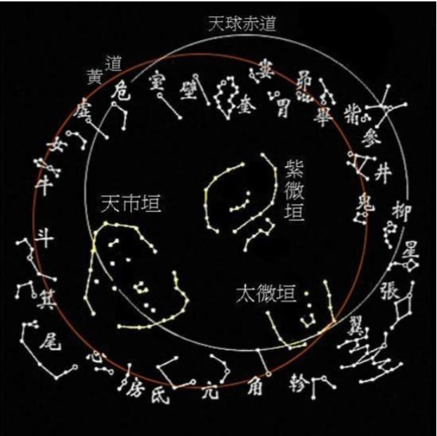

# 星宿

中国古时便有三垣二十八宿的星区划分体系，垣（拼音：yuán）是围墙，宿是宿舍，象征月亮每夜留宿此处。三垣即紫微垣、太微垣、天市垣，每垣都是比较大的天区，内含若干星座。紫微垣是三垣中的中垣，居于北天中央。

“紫”字是指紫微星垣，代称皇帝。因为天上的三垣，紫微垣居中央，太微垣、天市垣陪设两旁。古时候认为天皇应住在天宫里，天宫又叫紫微宫。后世人间皇帝诩为天子。“太平天子当中坐，清慎官员四海分”，所以紫微星垣代称皇帝，又因为皇帝居住的内城严禁黎民百姓靠近，所以明清故宫名曰紫禁城。

自古研究者就都把紫微星当成“帝星”，多数认为紫微星就是北极星，也是小熊座的主星，北斗七星围绕着它四季旋转。如果把天比作一个漏斗，那北极星则是这个漏斗的顶尖。我们把这种象“被群星围绕的紫微星”的人称作紫微下凡的命。但是被围绕的范围有大有小，生在家为一家之主，生在国为一国之主。

但是北极正上方那颗星不是恒久不变的，随着天体运动，星体也会发生移位，取而代之是另一颗更靠近北极正上方的星。小北斗七星分别是：北极二（β），北极一（γ），勾陈增九（η），勾陈四（ζ），勾陈三（ε），勾陈二（δ），勾陈一(α)。其中的北极二就是曾经的北极星，而现在，北极星已经变成勾陈一(α)星了。

因此，并没有一颗单独的星称为紫微星，北极星是北极星，是最北的一颗星。紫微星或说紫微星宿其实是指紫微垣，是有很多颗星组成的星域。从远古道家天人合一实证的角度来看，整个紫微星宿有十四颗主星或是整体二十八颗星，直线是八颗星，其中有六颗围绕着北极星之下的一颗星，这七颗星就是六芒星，也就是人类肉眼可见的北斗七星的更高维度的对应。这紫微星宿十四颗星称为宇宙之轴，整个宇宙所有的能量散发是从宇宙之轴散发出来的，因此这个宇宙之轴是整个宇宙星系运转最主要的能量来源，也是整个宇宙不崩溃的机密所在。所以整个连接的对应当中，它就是整个宇宙最核心的管理层。

## 北斗星宫

- 天枢宫**贪狼**星君（Kratu）
- 天璇宫**巨门**星君（Pulaha）
- 天玑宫**禄存**星君（Pulastya）
- 天权宫**文曲**星君（Atri）
- 玉衡宫**廉贞**星君（Angiras）
- 开阳宫**武曲**星君（Vashista）
- 瑶光宫**破军**星君（Bhrigu）

北斗七星位于紫微垣中，是紫微垣的重要组成部分。紫微垣被视为天帝居住的宫殿，而北斗七星就像是宫殿中的重要设施或者工具。北斗七星因其特殊的形状和重要的位置，被视为天帝的车驾，有引领方向的含义。它和紫微垣的象征体系紧密相连，代表着天帝出行或者对天界的巡视，体现了天帝的权威和主宰地位。

北斗七星在古代天文观测和计时等方面发挥着关键作用，它可以帮助人们确定时间和季节。在古代，人们通过观察北斗七星斗柄的指向来判断季节变化，如 “斗柄东指，天下皆春；斗柄南指，天下皆夏；斗柄西指，天下皆秋；斗柄北指，天下皆冬”。而紫微垣整体被认为是主宰天界秩序的区域，北斗七星在其中的这种指示功能，就像是为天帝（紫微星所象征）掌管时间秩序的工具，辅助天帝管理天界事务。

## 紫微垣

- **北极区**：包括北极星官，有太子、帝、庶子、后宫、天枢五颗星，位于小熊座/鹿豹座；还有四辅星官，是古代天子左右四个辅助之臣，在小熊座/鹿豹座。
- **垣墙区**：紫微左垣八星，分别为左枢、上宰、少宰、上弼、少弼、上卫、少卫、少丞，位于天龙座/仙王座/仙后座；紫微右垣七星，包括右枢、少尉、上辅、少辅、上卫、少卫、上丞，在大熊座/天龙座/鹿豹座。
- **其他星官**：有阴德、尚书、女史、柱史、御女、天柱、大理、勾陈、六甲、天皇大帝、五帝内座、华盖、杠、传舍、内阶、天厨、八谷、天棓、内厨、文昌、三师、三公、天床、太尊、天牢、太阳守、势、相、玄戈、天理、北斗、辅、天枪等。

## 太微垣

共含20个星座，正星78颗，增星100颗，以下是其包含的星官及星名：
1. **太微左垣**：左执法、东上相、东次相、东次将、东上将。
2. **太微右垣**：右执法、西上将、西次将、西次相、西上相。
3. **谒者**：位于室女座，只有1颗星。
4. **三公**：太尉、司徒、司空，共3颗星。
5. **九卿**：九个高级官员对应的星，共3颗星。
6. **五诸侯**：帝师、帝友、三公、博士、太史，共5颗星。
7. **内屏**：又称“轩屏”，有4颗星。
8. **五帝座**：包含5颗星，对应着五个方位的天帝。
9. **太子**：1颗星，代表太子。
10. **从官**：能亲近皇帝或天子的侍从对应的星，为1颗。
11. **幸臣**：受宠幸的臣子对应的星，只有1颗。
12. **郎将**：高级武官对应的星，1颗。
13. **虎贲**：宫中卫戍部队将领对应的星，1颗。
14. **常陈**：禁卫军，在猎犬座/大熊座，共7颗星。
15. **郎位**：庶务官对应的星，有15颗。
16. **明堂**：早期帝王宣明政教的地方，狮子座3星。
17. **灵台**：观天象之天文台，狮子座3星。
18. **少微**：士大夫或一般官员对应的星，在狮子座/小狮座，共4颗。
19. **长垣**：边境城墙之意，狮子座4星。
20. **三台**：分上台、中台、下台，或指司命、司中、司禄三个神，或指三公，或指天子至庶民三个社会阶级，大熊座6星。

## 天市垣

包含19个星官，正星87颗，增星173颗。以下是天市垣的星官及星名：

**垣墙星**

- **东蕃十一星**：南一为宋，二为南海，三为燕，四为东海，五为徐，六为吴越，七为齐，八为中山，九为九河，十为赵，十一为魏。
- **西蕃十一星**：南一为韩，二为楚，三为梁，四为巴，五为蜀，六为秦，七为周，八为郑，九为晋，十为河间，十一为河中。

**其他星官**

- **帝座**：位于天市垣中心，对应武仙座α。
- **侯**：在帝座东北，对应蛇夫座α。
- **宦者**：在帝座西南，有宦者一至宦者四及若干增星，对应蛇夫座和武仙座的一些恒星。
- **斗**：在宦者南，有斗一至斗五及若干增星，对应武仙座和巨蛇座的一些恒星。
- **斛**：在斗南，有斛一至斛四及若干增星，对应蛇夫座和武仙座的一些恒星。
- **列肆**：在斛西北，有列肆一、列肆二及若干增星，对应巨蛇座和蛇夫座的一些恒星。
- **屠肆**：在帛度东北，主屠宰、烹杀。
- **车肆**：在天市门中，有车肆一、车肆二，主百货。
- **宗正**：在帝座东南，有宗正一、宗正二。
- **宗人**：在宗正东，有宗人一至宗人四。
- **宗星**：在候星东，有宗星一、宗星二。
- **帛度**：在宗星东北，有帛度一、帛度二。
- **市楼**：在天市中，临箕星之上，有市楼一至市楼六。
- **七公**：在招摇东，有七颗星，为天相，三公之象，主七政。
- **贯索**：在七公星前，有九星，又名连索、连营、天牢，主法律，禁强暴。
- **天纪**：在贯索东，有九星，为九卿之象，万事纲纪，主狱讼。
- **女床**：在天纪北，有三星，为后宫御女侍从官，主女事。

## 二十八星宿

二十八星宿是中国古代天文学家为观测日、月、五星运行而把天体黄道、赤道附近的恒星分为的二十八个星区，每个星区各取一星为宿，共二十八宿。以下是关于它的具体介绍：

### 历史起源
- **图腾说**：二十八宿起源于四象，四象源于华夏民族的图腾信仰，东夷、西羌、戎夏、南蛮四方民族分别以龙、虎、龟蛇和鸟为图腾，后被置于黄道带的四面八方。
- **观象授时说**：上古时期人们经常使用星宿来判断季节，如参宿“三星”、大火星（心宿二）等被用来确定一年的开始或季节变化，后来人们观测日月在星空中的运动，发明了二十八宿，使得“观象授时”更加精确。

### 具体分组与星宿
- **东方苍龙七宿**：角、亢、氐、房、心、尾、箕。角宿为龙的犄角，亢宿是龙的颈，氐宿、房宿是龙的身躯和爪子，心宿是龙的心脏，尾宿是龙的尾巴。
- **北方玄武七宿**：斗、牛、女、虚、危、室、壁。它们组成了龟与蛇的形象。
- **西方白虎七宿**：奎、娄、胃、昴、毕、觜、参。奎宿状如鞋底，是白虎之神的尾巴，娄宿、胃宿等各有其特点。
- **南方朱雀七宿**：井、鬼、柳、星、张、翼、轸。形象是一只展翅飞翔的朱雀，井宿八星如井，鬼宿四星掌管积聚等。

### 文化意义
- **古代天文坐标**：古人以赤道为准创立二十八宿，可作为天球框架，用于确定天体在天球上的位置，也可间接参照月亮在星空中的位置推定太阳的位置，进而测得一年中的季节和天气变化。
- **与分野学说关联**：天上的星星各自对应着地球的某一个区域，如尾宿和箕宿对应着九江口等，在古代被用于占卜各地的吉凶祸福。
- **在术数学中的应用**：衍生出了星宿算命法等术数内容，通过二十八星宿来推断人的命运和运势。
- **对文学艺术的影响**：为文学、绘画、雕塑等艺术创作提供了丰富的素材，如诗词中常出现相关星宿的意象，《诗经》中就有对多个星宿的描写。 

