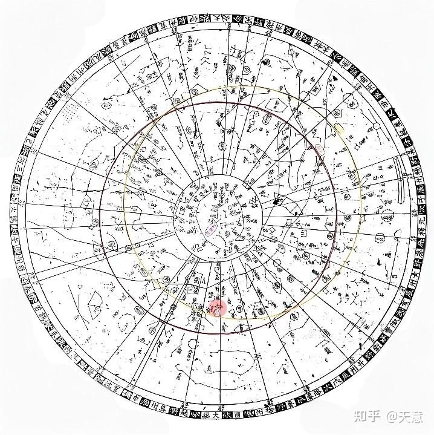
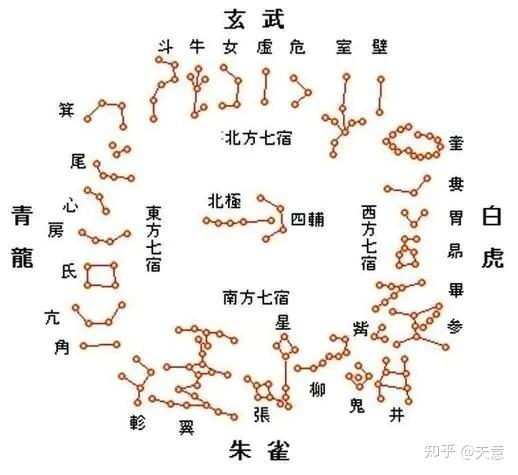

# 星宿

中国古时便有三垣二十八宿的星区划分体系，垣（拼音：yuán）是围墙，宿是宿舍，象征月亮每夜留宿此处。三垣即紫微垣、太微垣、天市垣，每垣都是比较大的天区，内含若干星座。紫微垣是三垣中的中垣，居于北天中央。

“紫”字是指紫微星垣，代称皇帝。因为天上的三垣，紫微垣居中央，太微垣、天市垣陪设两旁。古时候认为天皇应住在天宫里，天宫又叫紫微宫。后世人间皇帝诩为天子。“太平天子当中坐，清慎官员四海分”，所以紫微星垣代称皇帝，又因为皇帝居住的内城严禁黎民百姓靠近，所以明清故宫名曰紫禁城。

自古研究者就都把紫微星当成“帝星”，多数认为紫微星就是北极星，也是小熊座的主星，北斗七星围绕着它四季旋转。如果把天比作一个漏斗，那北极星则是这个漏斗的顶尖。我们把这种象“被群星围绕的紫微星”的人称作紫微下凡的命。但是被围绕的范围有大有小，生在家为一家之主，生在国为一国之主。

但是北极正上方那颗星不是恒久不变的，随着天体运动，星体也会发生移位，取而代之是另一颗更靠近北极正上方的星。小北斗七星分别是：北极二（β），北极一（γ），勾陈增九（η），勾陈四（ζ），勾陈三（ε），勾陈二（δ），勾陈一(α)。其中的北极二就是曾经的北极星，而现在，北极星已经变成勾陈一(α)星了。

因此，并没有一颗单独的星称为紫微星，北极星是北极星，是最北的一颗星。紫微星或说紫微星宿其实是指紫微垣，是有很多颗星组成的星域。从远古道家天人合一实证的角度来看，整个紫微星宿有十四颗主星或是整体二十八颗星，直线是八颗星，其中有六颗围绕着北极星之下的一颗星，这七颗星就是六芒星，也就是人类肉眼可见的北斗七星的更高维度的对应。这紫微星宿十四颗星称为宇宙之轴，整个宇宙所有的能量散发是从宇宙之轴散发出来的，因此这个宇宙之轴是整个宇宙星系运转最主要的能量来源，也是整个宇宙不崩溃的机密所在。所以整个连接的对应当中，它就是整个宇宙最核心的管理层。

## 北斗星宫

- 天枢宫**贪狼**星君（Kratu）
- 天璇宫**巨门**星君（Pulaha）
- 天玑宫**禄存**星君（Pulastya）
- 天权宫**文曲**星君（Atri）
- 玉衡宫**廉贞**星君（Angiras）
- 开阳宫**武曲**星君（Vashista）
- 瑶光宫**破军**星君（Bhrigu）

北斗七星位于紫微垣中，是紫微垣的重要组成部分。紫微垣被视为天帝居住的宫殿，而北斗七星就像是宫殿中的重要设施或者工具。北斗七星因其特殊的形状和重要的位置，被视为天帝的车驾，有引领方向的含义。它和紫微垣的象征体系紧密相连，代表着天帝出行或者对天界的巡视，体现了天帝的权威和主宰地位。

北斗七星在古代天文观测和计时等方面发挥着关键作用，它可以帮助人们确定时间和季节。在古代，人们通过观察北斗七星斗柄的指向来判断季节变化，如 “斗柄东指，天下皆春；斗柄南指，天下皆夏；斗柄西指，天下皆秋；斗柄北指，天下皆冬”。而紫微垣整体被认为是主宰天界秩序的区域，北斗七星在其中的这种指示功能，就像是为天帝（紫微星所象征）掌管时间秩序的工具，辅助天帝管理天界事务。

## 紫微垣

- **北极区**：包括北极星官，有太子、帝、庶子、后宫、天枢五颗星，位于小熊座/鹿豹座；还有四辅星官，是古代天子左右四个辅助之臣，在小熊座/鹿豹座。
- **垣墙区**：紫微左垣八星，分别为左枢、上宰、少宰、上弼、少弼、上卫、少卫、少丞，位于天龙座/仙王座/仙后座；紫微右垣七星，包括右枢、少尉、上辅、少辅、上卫、少卫、上丞，在大熊座/天龙座/鹿豹座。
- **其他星官**：有阴德、尚书、女史、柱史、御女、天柱、大理、勾陈、六甲、天皇大帝、五帝内座、华盖、杠、传舍、内阶、天厨、八谷、天棓、内厨、文昌、三师、三公、天床、太尊、天牢、太阳守、势、相、玄戈、天理、北斗、辅、天枪等。

## 太微垣

共含20个星座，正星78颗，增星100颗，以下是其包含的星官及星名：
1. **太微左垣**：左执法、东上相、东次相、东次将、东上将。
2. **太微右垣**：右执法、西上将、西次将、西次相、西上相。
3. **谒者**：位于室女座，只有1颗星。
4. **三公**：太尉、司徒、司空，共3颗星。
5. **九卿**：九个高级官员对应的星，共3颗星。
6. **五诸侯**：帝师、帝友、三公、博士、太史，共5颗星。
7. **内屏**：又称“轩屏”，有4颗星。
8. **五帝座**：包含5颗星，对应着五个方位的天帝。
9. **太子**：1颗星，代表太子。
10. **从官**：能亲近皇帝或天子的侍从对应的星，为1颗。
11. **幸臣**：受宠幸的臣子对应的星，只有1颗。
12. **郎将**：高级武官对应的星，1颗。
13. **虎贲**：宫中卫戍部队将领对应的星，1颗。
14. **常陈**：禁卫军，在猎犬座/大熊座，共7颗星。
15. **郎位**：庶务官对应的星，有15颗。
16. **明堂**：早期帝王宣明政教的地方，狮子座3星。
17. **灵台**：观天象之天文台，狮子座3星。
18. **少微**：士大夫或一般官员对应的星，在狮子座/小狮座，共4颗。
19. **长垣**：边境城墙之意，狮子座4星。
20. **三台**：分上台、中台、下台，或指司命、司中、司禄三个神，或指三公，或指天子至庶民三个社会阶级，大熊座6星。

## 天市垣

包含19个星官，正星87颗，增星173颗。以下是天市垣的星官及星名：

**垣墙星**

- **东蕃十一星**：南一为宋，二为南海，三为燕，四为东海，五为徐，六为吴越，七为齐，八为中山，九为九河，十为赵，十一为魏。
- **西蕃十一星**：南一为韩，二为楚，三为梁，四为巴，五为蜀，六为秦，七为周，八为郑，九为晋，十为河间，十一为河中。

**其他星官**

- **帝座**：位于天市垣中心，对应武仙座α。
- **侯**：在帝座东北，对应蛇夫座α。
- **宦者**：在帝座西南，有宦者一至宦者四及若干增星，对应蛇夫座和武仙座的一些恒星。
- **斗**：在宦者南，有斗一至斗五及若干增星，对应武仙座和巨蛇座的一些恒星。
- **斛**：在斗南，有斛一至斛四及若干增星，对应蛇夫座和武仙座的一些恒星。
- **列肆**：在斛西北，有列肆一、列肆二及若干增星，对应巨蛇座和蛇夫座的一些恒星。
- **屠肆**：在帛度东北，主屠宰、烹杀。
- **车肆**：在天市门中，有车肆一、车肆二，主百货。
- **宗正**：在帝座东南，有宗正一、宗正二。
- **宗人**：在宗正东，有宗人一至宗人四。
- **宗星**：在候星东，有宗星一、宗星二。
- **帛度**：在宗星东北，有帛度一、帛度二。
- **市楼**：在天市中，临箕星之上，有市楼一至市楼六。
- **七公**：在招摇东，有七颗星，为天相，三公之象，主七政。
- **贯索**：在七公星前，有九星，又名连索、连营、天牢，主法律，禁强暴。
- **天纪**：在贯索东，有九星，为九卿之象，万事纲纪，主狱讼。
- **女床**：在天纪北，有三星，为后宫御女侍从官，主女事。

## 二十八星宿

亢金龙、女土蝠、房日兔、心月狐、尾火虎、箕水豹、斗木獬、牛金牛、氐土貉、虚日鼠、危月燕、室火猪、壁水獝、奎木狼、娄金狗、胃土彘、昴日鸡、毕月乌、觜火猴、参水猿、井木犴、鬼金羊、柳土獐、星日马、张月鹿、翼火蛇、轸水蚓。

亢(kàng)金(jīn)龙(lóng)、女(nǚ)土(tǔ)蝠(fú)、房日(fángrì)兔(tù)、

心(xīn)月(yuè)狐(hú)、尾(wěi)火(huǒ)虎(hǔ)、箕(jī)水(shuǐ)豹(bào)、

斗(dòu)木(mù)獬(xiè)、牛金牛(niújīnniú)、氐(dǐ)土(tǔ)貉(mò)、

虚(xū)日(rì)鼠(shǔ)、危(wēi)月(yuè)燕(yàn)、室(shì)火(huǒ)猪(zhū)、

壁(bì)水(shuǐ)獝(xù)、奎(kuí)木(mù)狼(láng)、娄(lóu)金(jīn)狗(gǒu)、

胃(wèi)土(tǔ)彘(zhì)、昴(mǎo)日(rì)鸡(jī)、毕(bì)月(yuè)乌(wū)、

觜(zuǐ)火(huǒ)猴(hóu)、参(cān)水(shuǐ)猿(yuán)、井(jǐng)木(mù)犴(àn)、

鬼(guǐ)金(jīn)羊(yáng)、柳(liǔ)土(tǔ)獐(zhāng)、星(xīng)日(rì)马(mǎ)、

张(zhāng)月(yuè)鹿(lù)、翼(yì)火(huǒ)蛇(shé)、轸(zhěn)水(shuǐ)蚓(yǐn)。

二十八宿度数：

角木十一度，亢金十度，氐土十八度，房日五度，心月八度，尾火十五度，箕水九度， 斗木廿四度，牛金八度，女土十二度，虚日十度，危月二十度，室火十五度，壁水十四度， 奎木十一度，娄金十三度，胃土十三度，昴日九度，毕月十五度，觜火一度，参水十度，井 木卅一度，鬼金四度，柳土十七度，星日九度，张月十八度，翼火十七度，轸水十三度。

以上二十八宿，环列周天，占度多寡不同，合之共为三百六十度。

　　角、亢、氐初总在辰，
　　氐一、房、心、尾卯存，
　　尾三、箕、斗在寅位。
　　斗四、牛、女丑宫真。
　　女二、虚、危同在子。
　　危十二度亥宫行
　　室、壁奎兮都在亥，
　　奎一、娄、胃戌宫亲。
　　胃三、昴、毕同躔酉。
　　毕六、觜、参、井在申。
　　井八、鬼、柳俱在未。
　　柳三、星、张午位迎。
　　张十五兮、翼、轸巳，
　　轸十还归在于辰。

二十八宿方位：

二十八宿又分为东方七宿、北方七宿、西方七宿、南方七宿；

- **东方苍龙七宿**：角、亢、氐、房、心、尾、箕。角宿为龙的犄角，亢宿是龙的颈，氐宿、房宿是龙的身躯和爪子，心宿是龙的心脏，尾宿是龙的尾巴。
- **北方玄武七宿**：斗、牛、女、虚、危、室、壁。它们组成了龟与蛇的形象。
- **西方白虎七宿**：奎、娄、胃、昴、毕、觜、参。奎宿状如鞋底，是白虎之神的尾巴，娄宿、胃宿等各有其特点。
- **南方朱雀七宿**：井、鬼、柳、星、张、翼、轸。形象是一只展翅飞翔的朱雀，井宿八星如井，鬼宿四星掌管积聚等。

十二宫分所属

    子土宝瓶齐青位，丑土磨羯越扬州，
    寅木人马燕幽地，卯火天蝎宋豫求，
    辰金天秤郑兗分，巳水双女楚荆丘，
    午日三河周狮子，未月巨蟹秦雍留，
    申水益魏阴阳位，酉金赵冀是金牛，
    戌火白羊鲁徐郡，亥木双鱼卫幽收。

注解：这个就用到地支六合了。

子丑合化土，所以子宫和丑宫的主星都属土。

安命子宫为宝瓶座，八卦九州分属齐国青州。

安命丑宫为磨羯座，八卦九州分属吴国杨州，或越南杨州。

寅亥合化木，所以寅宫和亥宫的主星都属木。

安命寅宫为人马座，八卦九州分属燕国幽州。

安命亥宫为双鱼座，八卦九州分属卫国幽州，或拜州。

卯戌合化火，所以卯宫和戌宫的主星都属木。

安命卯宫为天蝎座，八卦九州分属宋国豫州。

安命戌宫为白羊座，八卦九州分属鲁国徐州。

辰酉合化金，所以辰宫和酉宫的主星都属金。

安命辰宫为天秤座，八卦九州分属郑国兗州。

安命酉宫为金牛座，八卦九州分属赵国冀州。

巳申合化水，所以巳宫和申宫的主星都属水，或晋国益州。

安命巳宫为双女座，八卦九州分属楚国荆州。

安命申宫为双子座，八卦九州分属益国魏州。

午宫主星为太阳，安命午宫为狮子座，八卦九州分属周国邑州或山河三河。

未宫主星为月亮，安命未宫为巨蟹座，八卦九州分属秦国雍州。