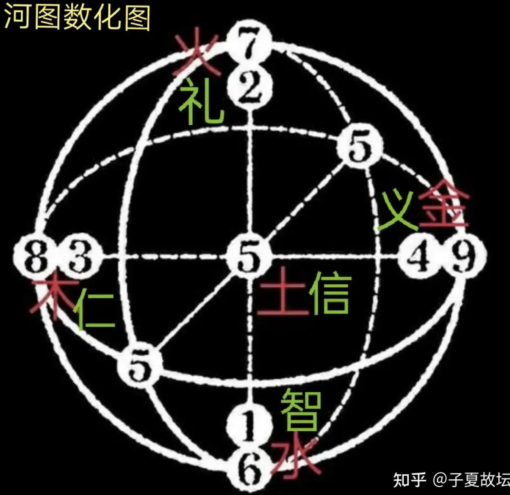
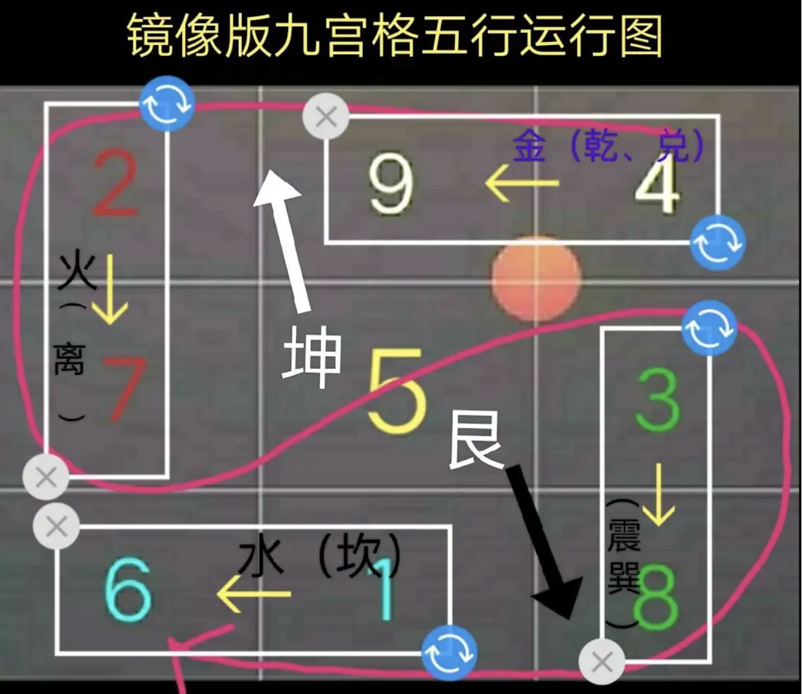

# 河图洛书

《周易.系辞上传》：
“大衍之数五十，其用四十有九。分而为二以象两，挂一以象三， 揲之以四以象四时，归奇于扐以象闰，五岁再闰，故再扐而后挂。 天一地二，天三地四，天五地六，天七地八，天九地十。天数五，地数五，五位相得而各有合。天数二十有五，地数三十，凡天地之数五十有五。此所以成变化而行鬼神也。”

（一）什么是“天地之数”呢？我国古人采用十进制的数字体系，认为“十”为满数，或称为“旬”，故“旬”既表示十数，也表示满数。十以内的数，奇数为阳数，古人称为“天数”；偶数为阴数，古人称为“地数”。这样，一、三、五、七、九为天数，二、四、六、八、十为地数，天地之数合计共为五十五。故《系辞传》有曰“天一地二，天三地四，天五地六，天七地八，天九地十。”又曰“天数二十有五，地数三十，凡天地之数五十有五。”

二）“天数五，地数五，五位相得而各有合”是怎么回事呢？其实这句话是就五行之数的本质而言的。五行之数的本质就是天地之数两两相得而各有合。具体讲就是“天一生水，地六成之；地二生火，天七成之；天三生木，地八成之；地四生金，天九成之；天五生土，地十成之。”这种天地之数相得而各有合所形成的五行之数体现在《河图》和《洛书》中。

