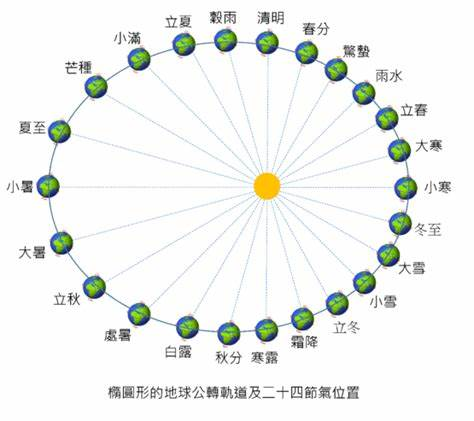

# 二十四节气

四时八节三气三候

四时：春夏秋冬

八节：八卦

三气：一节三气，三八二十四

三候：一气三候，一年72候，一候5天，一年360天

黄帝“始创奇门四千三百二十局法”。其根源是将每一年按八卦之数分为八节(即我们俗称的“四时八节"之意);每节有三气(八个三,相当于今天的二十四节气);每气有天、地、人三候(俗称“气候”,按古法气大候小,一气管三候),那么每年就有七十二候;每候有五天,一年就有三百六十天;每天有十二时(按地支每天分为十二个时辰相当于今天的二十四小时,每时辰两小时小时,即是小的时展)，那么每年就有四千三百二十时。与每一时相对应有一种局势,因此奇门遁甲就有了四千三百二十种局势。

## 四时八节是指什么?

1. **“四时”的含义**
   - “四时”指的是春、夏、秋、冬四季。这是基于地球绕太阳公转过程中，太阳直射点在南北回归线之间移动，导致地球上不同区域接收到的太阳热量随时间周期性变化而划分的。
   - 春季是万物复苏、阳气上升的季节，气温逐渐回暖，大地开始呈现生机勃勃的景象；夏季是一年中气温较高的时期，日照时间长，降水相对充沛，万物生长茂盛；秋季天气转凉，树叶变色掉落，是收获的季节；冬季气温寒冷，万物闭藏，许多动物进入冬眠状态，部分植物停止生长。
2. **“八节”的含义及具体内容**
   - “八节”是指立春、春分、立夏、夏至、立秋、秋分、立冬、冬至这八个主要节气。
   - **立春和立秋**：立春标志着春季的开始，是冬去春来的转折点。此时阳气上升，天气逐渐变暖，万物开始有复苏的迹象。而立秋则表示秋季的开端，意味着暑热将退，凉秋将至。不过立秋之后往往还有一段比较炎热的时期，俗称“秋老虎”。
   - **春分和秋分**：春分和秋分这两个节气，太阳直射赤道，昼夜时间几乎相等。春分之后，北半球昼长夜短，气温逐渐升高，是春季九十天的中分点；秋分之后，北半球昼短夜长，天气逐渐变凉，是秋季九十天的中分点。这两个节气在天文和气候上都具有重要的意义，也体现了地球在公转过程中的位置变化对昼夜长短和季节变化的影响。
   - **立夏和立冬**：立夏代表夏季的开始，立夏之后，气温明显升高，雷雨增多，农作物生长进入旺季。立冬则象征着冬季的来临，立冬后，日照时间缩短，气温下降，万物开始进入休养、收藏的状态。
   - **夏至和冬至**：夏至是北半球一年中白昼最长、黑夜最短的一天，太阳直射北回归线。这一天过后，太阳直射点开始向南移动，北半球白昼逐渐变短。夏至时节，天气炎热，是盛夏的开始。冬至是北半球一年中白昼最短、黑夜最长的一天，太阳直射南回归线。此后，太阳直射点向北移动，北半球白昼开始变长。冬至在古代是一个很重要的节日，有“冬至大如年”的说法。

“四时八节”在中国传统文化中占有重要地位，它们不仅用于指导农事活动，还与众多的节日、习俗和文化观念紧密相连。

## 二十四节气

**一、二十四节气的定义与概述**

二十四节气是指中国农历中表示季节变迁的24个特定节令，它是中国古代订立的一种用来指导农事的补充历法。它能反映季节的变化，指导农事活动，影响着千家万户的衣食住行。这些节气将太阳周年运动轨迹划分为24等份，每一等份为一个节气，始于立春，终于大寒，周而复始。

**二、二十四节气的具体名称及时间（按顺序）**

1. **春季**
   - **立春**：每年公历2月3 - 5日交节，立是开始的意思，立春标志着万物闭藏的冬季已过去，开始进入风和日暖、万物生长的春季。
   - **雨水**：公历2月18 - 20日交节。此时，气温回升、冰雪融化、降水增多，故取名为雨水。
   - **惊蛰**：公历3月5 - 7日交节。蛰是藏的意思，惊蛰意味着天气回暖，春雷始鸣，惊醒蛰伏于地下冬眠的昆虫。
   - **春分**：公历3月20 - 22日交节。春分这一天太阳直射赤道，昼夜几乎相等。之后，太阳直射点北移，北半球开始昼长夜短。它是春季90天的中分点。
   - **清明**：公历4月4 - 6日交节。清明时节，气候清爽温暖，草木始发新枝芽，万物开始生长，大地呈现春和景明之象。同时，这也是人们扫墓祭祖的传统节日。
   - **谷雨**：公历4月19 - 21日交节。谷雨是春季最后一个节气，这时田中的秧苗初插、作物新种，最需要雨水的滋润，所以说“春雨贵如油”。

2. **夏季**
   - **立夏**：公历5月5 - 7日交节。立夏表示即将告别春天，是夏天的开始。此后，日照增加，逐渐升温，雷雨增多。
   - **小满**：公历5月20 - 22日交节。小满其含义是夏熟作物的籽粒开始灌浆饱满，但还未成熟，只是小满，还未大满。
   - **芒种**：公历6月5 - 7日交节。芒种字面的意思是“有芒的麦子快收，有芒的稻子可种”，这个时节，大麦、小麦等有芒作物种子已经成熟，抢收十分急迫。同时，晚谷、黍、稷等夏播作物也正是播种最忙的季节。
   - **夏至**：公历6月21 - 22日交节。这一天太阳直射北回归线，北半球各地的白昼时间达到全年最长。夏至过后，太阳直射点开始向南移动，北半球白昼开始逐渐变短。
   - **小暑**：公历7月6 - 8日交节。小暑意味着天气开始炎热，但还没到最热。此时，已是初伏前后。
   - **大暑**：公历7月22 - 24日交节。大暑是一年中最热的节气，这时正值中伏前后，高温酷热、雷暴频繁。

3. **秋季**
   - **立秋**：公历8月7 - 9日交节。立秋表示暑去凉来，秋天开始。但实际上，立秋过后，我国大部分地区仍处于炎热之中，民间有“秋老虎”之说。
   - **处暑**：公历8月22 - 24日交节。处暑即为“出暑”，是炎热离开的意思。处暑节气意味着进入气象意义的秋天。
   - **白露**：公历9月7 - 9日交节。白露是由于温度降低，水汽在地面或近地物体上凝结而成的水珠。所以，白露实际上是表征天气已经转凉。
   - **秋分**：公历9月22 - 24日交节。秋分这一天太阳直射赤道，昼夜等长。此后，太阳直射点移向南半球，北半球开始昼短夜长。它是秋季90天的中分点。
   - **寒露**：公历10月8 - 9日交节。寒露的意思是气温比白露时更低，地面的露水更冷，快要凝结成霜了。
   - **霜降**：公历10月23 - 24日交节。霜降节气含有天气渐冷、初霜出现的意思，是秋季的最后一个节气，也意味着冬天即将开始。

4. **冬季**
   - **立冬**：公历11月7 - 8日交节。立冬是季节类节气，表示自此进入了冬季。立，建始也；冬，终也，万物收藏也。
   - **小雪**：公历11月22 - 23日交节。小雪表示降雪的起始时间和程度。小雪和大雪节气都是反映气候特征的节气，小雪节气时，北方地区可能会开始下雪，南方地区则可能只是气温下降。
   - **大雪**：公历12月6 - 8日交节。大雪的意思是天气更冷，降雪的可能性比小雪时更大了，并不意味着降雪量一定很大。
   - **冬至**：公历12月21 - 23日交节。冬至是北半球各地一年中白昼最短、黑夜最长的一天。冬至过后，太阳直射点开始向北移动，北半球白昼开始逐渐变长。
   - **小寒**：公历1月5 - 7日交节。小寒标志着开始进入一年中最寒冷的日子。
   - **大寒**：公历1月20 - 21日交节。大寒是一年中最后一个节气，也是天气寒冷到极点的意思。

**三、二十四节气的形成原理**

二十四节气是基于地球绕太阳公转的天文现象制定的。地球公转轨道是一个近似椭圆的轨道，太阳位于椭圆的一个焦点上。在公转过程中，由于地球自转轴与公转轨道平面有一个约23.5度的夹角（黄赤交角），使得太阳直射点在南北回归线之间来回移动。这种太阳直射点的移动导致地球上不同地区在不同时间接收到的太阳热量不同，从而产生了四季更替和节气变化。例如，当太阳直射赤道时，就是春分和秋分，昼夜等长；当太阳直射北回归线时，就是夏至，北半球白昼最长；当太阳直射南回归线时，就是冬至，北半球白昼最短。

**四、二十四节气的文化意义**

1. **农事指导方面**
   - 在中国古代，农民根据二十四节气来安排农事活动。比如“谷雨前后，种瓜点豆”，表明谷雨时节是播种瓜豆等农作物的合适时机。“芒种忙忙栽，夏至谷怀胎”体现了芒种和夏至时节农作物生长和种植的节奏。这些节气谚语是农民长期实践经验的总结，对农业生产有着重要的指导作用。
2. **传统节日方面**
   - 一些节气同时也是重要的传统节日。如清明，它不仅是节气，也是人们祭祀祖先、缅怀先烈的重要节日。在清明时节，人们会扫墓、踏青等。又如冬至，在古代有“冬至大如年”的说法，这一天人们会团聚，吃饺子（北方）或汤圆（南方）等。
3. **文化内涵方面**
   - 二十四节气蕴含着丰富的哲学思想。它体现了中国人顺应自然、天人合一的观念。人们通过观察节气变化，来调整自己的生活和生产方式，与自然和谐共生。同时，二十四节气也反映了中国古代天文、气象、物候等方面的知识成就，是中国传统文化的重要组成部分。许多文人墨客也以节气为主题进行诗词创作，如杜牧的“清明时节雨纷纷，路上行人欲断魂”，这些诗词增添了节气的文化韵味。

二十四节气是根据太阳在黄道（地球绕太阳公转的轨道平面与天球相交的大圆）上的位置来划分的。

1. **角度划分**
   - 从春分点开始（此时太阳直射赤道，昼夜等长，通常在公历3月20 - 22日），将黄道圆周360°等分为24份，每份15°。每运行15°便为一个节气。例如，当太阳在黄道上从春分点开始运行15°后，就到达清明节气。
   - 由于地球公转速度不是匀速的，在近日点（1月初）附近公转速度快，在远日点（7月初）附近公转速度慢。所以相邻两个节气之间的时间间隔不是完全相等的。但从角度划分的角度来说，是以太阳在黄道上相对于春分点的角度位置为主要划分依据，而不是按照椭圆轨道的弧长。

2. **天文观测角度辅助理解**
   - 古代没有现代精密的天文仪器时，人们通过观测日影长度变化、星辰位置等来确定节气。例如，利用圭表测日影，圭表由“圭”和“表”两个部件组成。直立于平地上测日影的标杆和石柱，叫做表；正南正北方向平放的测定表影长度的刻板，叫做圭。当太阳位置变化时，表的影子长短和方向也会变化。春分和秋分这两天，太阳直射赤道，正午时圭表的日影正好在圭的中心位置（南北方向），长度适中。而到夏至时，太阳直射北回归线，日影最短；冬至时，太阳直射南回归线，日影最长。通过这种长期的观测和记录，结合对星辰位置变化的观测（如北斗七星斗柄的指向在一年中会绕北极星旋转一周，斗柄东指，天下皆春；斗柄南指，天下皆夏；斗柄西指，天下皆秋；斗柄北指，天下皆冬），来确定太阳在黄道上的位置，进而划分出二十四节气。

每个节气的具体开始结束的时间怎么确定？

1. **现代天文学方法**
   - **太阳黄经度数**：现代确定节气时间主要是依据太阳在黄道上的位置，即太阳黄经度数。春分点被定义为太阳黄经0°，从这个点开始，每经过15°就到达下一个节气。例如，当太阳黄经到达15°时，便是清明节气。这种计算是基于高精度的天文观测设备和复杂的天文计算模型，通过精确测量太阳的位置来确定节气的准确时间。
   - **地球公转规律**：考虑到地球绕太阳公转的轨道是椭圆，且公转速度不均匀。在近日点（大约在1月初），地球公转速度快；在远日点（大约在7月初），公转速度慢。所以，节气之间的时间间隔不完全相同。比如，小暑和大暑之间的天数可能会比大雪和冬至之间的天数稍短一些。科学家们通过精确的轨道计算和时间修正，来确定每个节气的具体时间点，精确到分秒级别，这些数据会由天文机构发布。
2. **传统方法（古代）**
   - **圭表测日影**：圭表由“圭”和“表”组成。“表”是直立于平地上测日影的标杆或石柱，“圭”是正南正北方向平放的测定表影长度的刻板。在正午时分，观察太阳照射表后在圭上投射的影子长度。例如，在北半球，冬至日太阳高度角最小，日影最长；夏至日太阳高度角最大，日影最短。当影子长度变化达到一定程度，结合长期的观测经验来判断节气的到来。不过这种方法相对粗糙，只能大致确定节气时间范围。
   - **观测北斗星斗柄指向**：古人还通过观测北斗七星的斗柄指向来判断节气。北斗七星在天空中呈勺状，其斗柄在一年中会绕北极星旋转一周。当斗柄指向东方时，大致是春季；指向南方时，大致是夏季；指向西方时，大致是秋季；指向北方时，大致是冬季。这种方法也是一种较为粗略的判断节气的方式，主要用于辅助判断季节和大致的节气时段。
