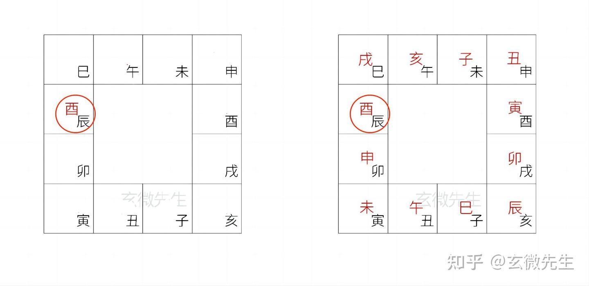
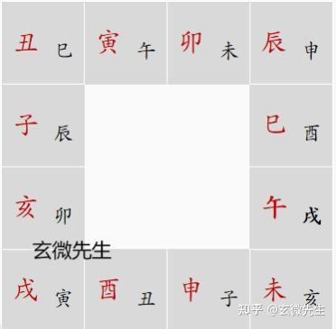
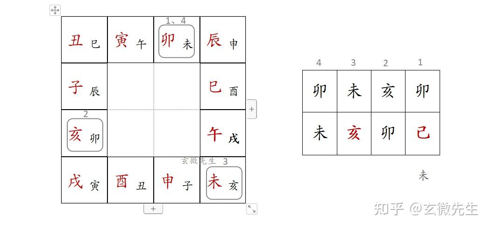
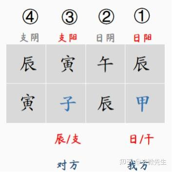

# 大六壬排盘

第一步，月将加时，起出天地盘；

第二步，根据天地盘，起出四课；

第三步，依据九宗门运算法则，起出三传；

第四步，为课传配上天将，六亲；

## 一、天地盘

（一）什么是天地盘

天地盘，简称作式盘，是由天盘、地盘两部分构成的。

天盘，是由当值的月将和不当值的其他十一个月将构成，符号虽然是十二地支，但是位置是随着时间的不同，有变化的，天盘代表月将。（后面会举例说明）

地盘，是固定不变的，就是十二地支在手掌中的位置，地盘代表时辰。

这样天地盘组合，就叫月将加时，起出天地盘。

（二）如何确定天地盘

例如，公历2023年4月29日 辰时 起盘

step1.先查询目前月将，现在时间处于[谷雨，小满)之间，月将为酉。

step2.时辰为辰时，地盘代表时辰，天盘代表月将，就把月将“酉”写在地盘“辰”上面。

step3.然后，从“酉”开始，依次顺时针，写出来其他不当值的月将，这样月将加时，就构成了天地盘。

## 起四课

### 十干寄宫口诀

学习四课之前，要先会十干寄宫口诀，因为实际起盘过程中，要使用到日干（天干）、日支，但大六壬式盘中，没有天干，所以，要讲天干转化为地支，《十干寄宫》口诀就是教大家如何讲天干转化为地支。口诀如下：

甲课寅兮乙课辰，丙戊课巳不须论。

丁己课未庚申上，辛戌壬亥是其真。

癸课原来丑宫坐，分明不用四正神。

“寄宫”可以理解为租房子，六壬中没有天干，就让天干暂时寄居在地支上。

简单解释口诀，就是说，在大六壬中，看到天干甲就是寅，乙就是辰，丙和戊都是巳，丁和己都是未，庚就是申，辛是戌，壬是亥，癸是丑。

最后一句“分明不用四正神”的意思是：子、午、卯、酉，由于分别处于正北、正南、正东、正西，四个正位，没有被寄宫。

### 如何起四课

四课，四课顾名思义就是四个课体，因为在大六壬中，起出来的形成叫课体。

四课分为上下结构，上面为天盘，下面为地盘，一共八个字。

第一课，以日干寄地盘之位，寻天盘地支。名为“干阳课”。

第二课，以第一课天盘地支转到地盘，再推至天盘所得。名为“干阴课”。

第三课，以日支所在地盘之位，寻天盘地支。名为“支阳课”。

第四课，以第三课天盘地支转到地盘，再推至天盘所得。名为“支阴课”。

一二课又称“外事门”，三四课又称“内事门”。

我们用一个具体的例子，来看如何起四课

演示案例：

公历 2022年8月14日 19时

农历 壬寅年 戊申月 己亥日 甲戌时 午将

首先，根据时间确定好天地盘。

这个时间的月将为午，时辰为戌，“月将加时”把午加在地盘时辰戌上，然后依次顺时针写出其他月将（图中红色的字），未、申、酉... ...这样，天盘就写好了！

然后，根据天地盘，起出四课。

以起课当日干支的干分做两课，支分做两课，共为四课。

四课是根据日干、日支，从天地盘取，但是天地盘中没有天干，要通过寄宫口诀，将天干转化为地支。

第一、二课是根据日干己来起的。

日干己的寄宫是未，在天地盘中，找到地盘未的上面是谁，未上是卯，就把卯写在己的上面，这就是第一课；

再看卯的上面是谁？卯上为亥，就把亥写在卯上面，这就是第二课；

第三、四课是根据日支亥来起的。

日支亥是地支，不用看寄宫，直接在天地盘中，找亥的上面是谁，亥上是未，就把未写在亥的上面，这是第三课；

再看未的上面是谁，未的上面是卯，就卯写在未得上面，这是第四课；

这样，就把四课就起好了。

### 四课之间的关系

月将加时，成天地盘，是当下时辰所有的事都在这个盘中，太多太乱；

在乱象里取出四课，表示我们所关注的事，也就是通过天地盘这个大的信息库里，提取出我们关注的事情，由四课来表达。所以，四课最大的作用就是定位。

四课中的干支定位方法，大体如下图（甲子日 子时 寅将）。

甲子日的“甲”，可称为“日”、“干”，代表我方、本体等；

甲的上神“辰”，可称为“干阳”、“支阳”，代表我的行为、我的动作、我的语言等；

“午”，可称为“日阴”、“干阴”，代表我的思想、内在想法、真实想法等；

甲子日的“子”，可称为“支”、“辰”，代表对方、思想等；

子的上神“寅”，可称为“支阳”、“支阴”，代表对方的行为，动作，对方的语言等；

“辰”，可称为“支阴”，“干阴”，代表对方的思想、真实想法、内在想法；

总结来说，干为阳，可以表示为男，外，明，动，尊，上，夫，父，儿子等

支为阴，可以表示为女，内，暗，静，卑，下，妻，子，女儿等

(根据所问之事不同，而灵活定位，总以阴阳、动静、尊卑为主要方法)

四课中的干支定位，必然会产生各种错综复杂的关系，简单总结就是纵观，横比，交互这三类关系：

日上生日百事吉，昼将人助夜神庇，

日上克日百不利，昼将人害夜鬼魅。

日生上神百费出，日克上神事抑塞。

日上之神去生辰，辰上之神来生日，

日辰各受上神生，两家顺利有生意。

日上之神去克辰，辰上之神来克日，

日辰各受上神克，两家俱伤都不利。

日上脱辰我脱他，辰上脱日他脱我，

日辰各受上神脱，彼此防脱俱蹉跎。

日上之神见辰旺，辰上之神见日旺，

日辰上各见旺神，静则为禄动遭网。

日往临辰遭下克，自取卑幼凌犯推，

辰来临日又克日，卑幼上门肆侵欺。

二者皆名为乱首，父子兄弟各离析。

日临辰上去受生，以尊从卑受包容。

辰临日上来生日，彼自上门来周济。

日临辰上去生辰，宅旺人衰虚耗频。

辰临日上来脱日，亦主虚耗钱财是。

日临辰上去克辰，事虽费力得财云；

辰来临日受日克，尊长得财卑幼悲。

二者皆名为赘媚，日辰比和吉将吉。

日上禄马主荣迁，日见辰马宅动言。

（君子迁官，小人宅动）

辰上日禄受屈抑，权摄不正此为占。

日辰上各见德神，再乘吉将进发真；

若见六合和合事，不宜解散忧病寝。

乘墓坐墓日辰同，俱主昏迷云雾中。

（以上见鬼墓为暗鬼，尤当防）

宾主不投怀猜忌，日辰互见害与刑。

日辰逢败人宅颓，绝神结绝旧事宜，

死气死神宜休息，若值空亡虚无实。

日课不足心意焦，辰课不足家宅忧。

若见卯酉为阻隔，鬼罡蛇虎有伤折。

## 定三传

起三传分为以下几类，并称为九宗门，分别是贼克法，比用法，涉害法，遥克法，昴星法，别责法，八专法，反吟法，伏吟法。比用和涉害都是补充前面贼克的部分，而遥克是贼克法已经不能用时而取。当上下无贼克也无遥克时，四课俱全用昴星法，四课缺一用别责法，四课备二不可取遥克而必须用八专法。剩下的伏吟反吟都是贼克法的另一特类补充。

四课中下面地盘的支是不会作为发传的，初传叫发端是切入点，是测来意的根本，中传叫移易，是发展走的线路，末传叫归计，是事物的结果。

（一）、贼克法

四课中的天盘称为上神，地盘称为下神。上神克下神称为克。下神克上神称为贼。

方法：
①四课中只有一个下贼上直接作为初传，其余中传，末传，皆以前者天盘换到地盘而再推天盘之支。这种形式称为始入课。就是最原始的入课法。

②四课中有上克下，但还有一个下贼上的，还是以下贼上作为初传，其余中传，末传，皆以前者天盘换到地盘而再推天盘之支。这种形式称为重审课。

③四课中只有一个上克下直接作为初传，其余中传，末传，皆以前者天盘换到地盘而再推天盘之支。这种形式称为元首课。

（二）、比用法

四课中有两或三课下贼上或仅有上克下的两或三课，则应当取唯一与日干俱比为初传。俱比指的是与日干阴阳属性相同。两或三个下贼上发用叫做比用课，仅有上克下两或三个而无下贼上发用时叫做知一课。当与日干阴阳相同的地支存在多个或一个都没，则选用其它方式。

注：凡有下贼上都是忧先考虑的，无论是否还存在一个还是两个或三个的上克下。

（三）、涉害法

① 四课中有下贼上两个或以上，又或者仅有上克下两个或以上，且与日干发生多个俱比或不俱比，导致无法取初传发用，则由天盘涉归本位，即天盘顺走回归地盘本位，以原地盘进行克的数量多者为发用初传，这种叫做涉害课。

注意的是地盘除十二地支的五行相克，还要把寄干加上，是两个一起加进去考虑的，如地盘未看有没有克的关系，还要考虑丁己有没有克的关系，把克的数量合并加起来，课是比较下贼上的数量，就一律以下贼上计算，课是比较上克下的数量，就一律以上神克地盘计算。

② 若涉归本位中的相克数量相等，则以在地盘为四孟的上者为发用，叫做见机课。

如无孟则取地盘为仲的上者为发用，叫做察微课。

若孟与仲皆无也不取季，或课内同见孟或仲，直接阳日取干上神发用，阴日取支上神发用，叫做缀瑕课。

上者就是上面的天盘上神，四孟为寅申巳亥，四仲为子午卯酉，四季为辰戌丑未。这些中传末传的方法皆同第一类。

（四）、遥克法

凡四课中，上下无克，看日干与其三课进行遥克。

①先论上神遥克日干者发用，中末传皆以前者天盘换到地盘而再推天盘之支。叫做蒿矢课。

②无上神克日，则看日干遥克发用，中末传皆以前者天盘换到地盘而再推天盘之支。叫做弹射课。

若有两三克，克多先俱比，同比再涉害。

（五）、昴星法

四课俱全，但上下无克，且无遥克，用昴星法。

（1）阳日以地盘酉位找天盘之支为初传，支上神为中传，干上神为末传。叫做虎视转蓬课。

（2）阴日以天盘酉位找地盘之支为初传，干上神为中传，支上神为末传。叫做冬蛇掩目课。

（六）、别责法

凡四课缺一，只有三课，上下无克，且无遥克，为别责课。若干支上神交互克，又称芜淫课。

（1）阳日初传取干合之上神，中末传皆用干上神。

（2）阴日初传取支前三合为用，中末传皆用干上神。

（七）、八专法

凡日干支同位（甲寅日，丁未日，己未日，庚申日，癸丑日），导致四课备二，上下无克时，不取遥克！用八专法。干支同位专聚于一处，如同八家同井，故名八专课。八专课又名帷簿不修。因干支同位，内外不备，男女主客共居一室，如无帷帐设防，帷稍不修，多失礼之事也。

（1）阳日以干上神顺数三位为初传。

（2）阴日以第四课（支阴课）的上神逆数三位为初传。若逆数三神与干上神相同，则三传皆归一神，为独足课。

中末传皆用干上神。（数位含自身，如午顺数，午未申，取申。）

（八）、伏吟法

凡月将与占时相同，导致天地盘同位，为伏吟课。

(1)若四课中上下有克（六乙与六癸日），照常取克为初传，中传取初(传)刑，末传取中刑。若初传为自刑，取支上神为中传，末传取中刑，若中传又为自刑，则取中冲为末传。叫做不虞课。

(2)若四课中上下无克，不取遥克。

①阳日取干上神发用，中取初刑，末取中刑。若初传为自刑，取支上神为中传，末传取中刑，若中传又为自刑，则取中冲为末传。叫做自任课。

②阴日取支上神发用，中取初刑，末取中刑。若初传为自刑，取干上神为中传，末传取中刑，若中传又为自刑，则取中冲为末传。叫做自信课。

初传自刑叫做杜传课。

（九）、反吟法

凡月将与占时相冲，导致天地盘各居冲位，为反吟课。

（1）若四课中有克，照常以克为初传，中传末传皆以前者换地盘而推天。叫做无依课。

（2）若四课中无克，以日驿马直接为初传，支上神为中传，干上神为末传。叫做无亲课。或称“井栏射”。

戊辰，戊戌这二日遇到反吟，古例三传均为巳、亥、巳。