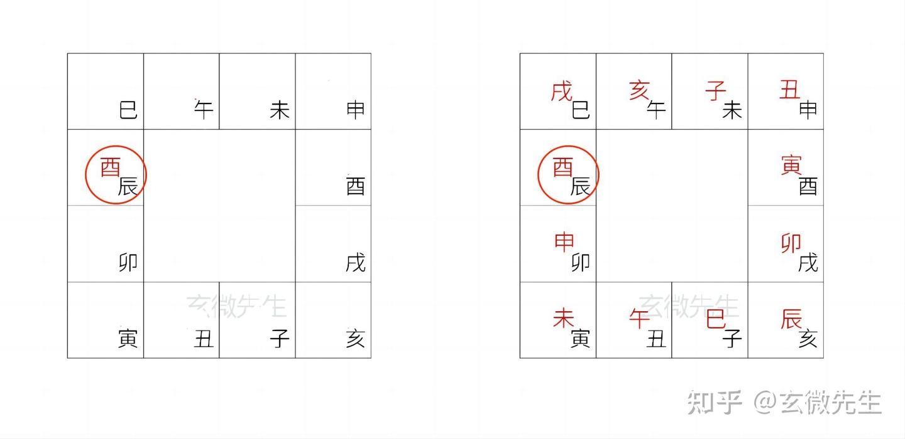

# 大六壬排盘

第一步，月将加时，起出天地盘；

第二步，根据天地盘，起出四课；

第三步，依据九宗门运算法则，起出三传；

第四步，为课传配上天将，六亲；

## 一、天地盘

（一）什么是天地盘

天地盘，简称作式盘，是由天盘、地盘两部分构成的。

天盘，是由当值的月将和不当值的其他十一个月将构成，符号虽然是十二地支，但是位置是随着时间的不同，有变化的，天盘代表月将。（后面会举例说明）

地盘，是固定不变的，就是十二地支在手掌中的位置，地盘代表时辰。

这样天地盘组合，就叫月将加时，起出天地盘。

（二）如何确定天地盘

例如，公历2023年4月29日 辰时 起盘

step1.先查询目前月将，现在时间处于[谷雨，小满)之间，月将为酉。

step2.时辰为辰时，地盘代表时辰，天盘代表月将，就把月将“酉”写在地盘“辰”上面。

step3.然后，从“酉”开始，依次顺时针，写出来其他不当值的月将，这样月将加时，就构成了天地盘。

## 起四课

十干寄宫口诀

学习四课之前，要先会十干寄宫口诀，因为实际起盘过程中，要使用到日干（天干）、日支，但大六壬式盘中，没有天干，所以，要讲天干转化为地支，《十干寄宫》口诀就是教大家如何讲天干转化为地支。口诀如下：

甲课寅兮乙课辰，丙戊课巳不须论。

丁己课未庚申上，辛戌壬亥是其真。

癸课原来丑宫坐，分明不用四正神。

“寄宫”可以理解为租房子，六壬中没有天干，就让天干暂时寄居在地支上。

简单解释口诀，就是说，在大六壬中，看到天干甲就是寅，乙就是辰，丙和戊都是巳，丁和己都是未，庚就是申，辛是戌，壬是亥，癸是丑。

最后一句“分明不用四正神”的意思是：子、午、卯、酉，由于分别处于正北、正南、正东、正西，四个正位，没有被寄宫。

