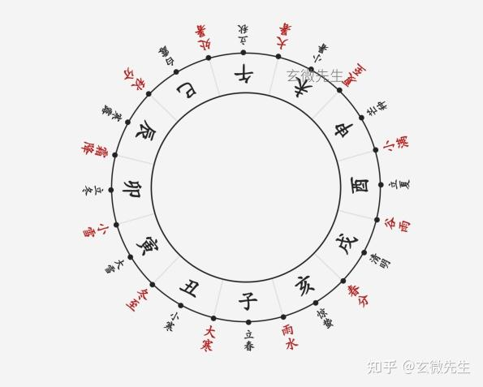

# 月将

## 一、什么是月将

月将，又称为太阳，太阳一年会依次经过十二宫，占课时候，太阳在哪一个宫，我们就说月将在哪一个宫。

月将的符号是十二地支，就是子 丑 寅 卯 辰 巳 午 未 申 酉 戌 亥

但是，我们这里不叫作地支，而是叫月将。

比如，雨水到春分这段时间起盘，我们说“月将在亥”，或者“月将在亥宫”。

## 二、月将如何划分

月将是根据24节气划分的，每三个节气为一个月将

1.二十四节气歌

二十四节气歌：

春雨惊春清谷天，夏满芒夏暑相连，

秋处露秋寒霜降，冬雪雪冬小大寒。

2.月将的划分

从雨水到春分，月将在亥。从春分到谷雨，月将在戌。

从谷雨到小满，月将在酉。从小满到夏至，月将在申。

从夏至到大暑，月将在未。从大暑到处暑，月将在午。

从处暑到秋分，月将在巳。从秋分到霜降，月将在辰。

从霜降到小雪，月将在卯。以小雪到冬至，月将在寅。

从冬至到大寒，月将在丑。从大寒到雨水，月将在子。

这里要注意点的是：

（1）月将交替的时间顺序是逆时针的，与十二地支的顺序不同。月将的顺序依次是亥，戌，酉，申，未，午，巳，辰，卯，寅，丑，子

（2）每三个节气，为一个月将，例如亥宫，是从雨水到春分，中间还有一个节气“惊蛰”。

（3）根据万年历，查询节气，根据节气确定月将。