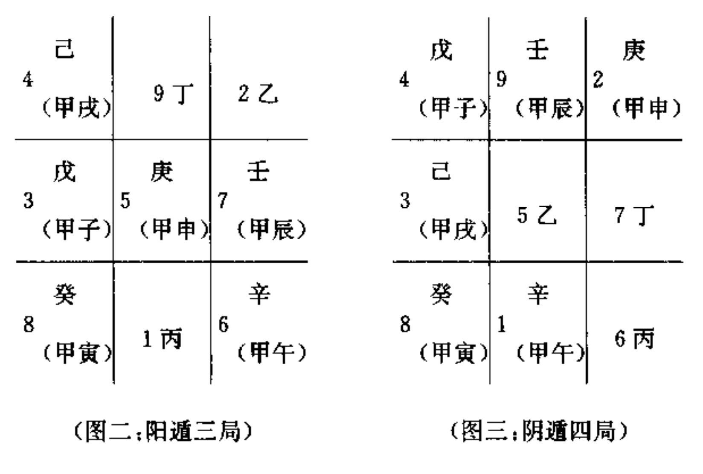

# 军事

甲为元帅为主将，他经常隐敲在阵中，所以叫遁甲。

甲、丙、丁为三奇，是元帅或主将身边最得力的三个辅佐官。在一定意义上，乙、丙、丁三奇就像现代军队的司、政、后三大机关-样，司今部起参谋作用,政治部起政治官传作用，后勤部起粮草供应作用。

乙为文官为谋士，他或她打着一面绣有太阳标志的旗帜(日奇);丙为武官，为主帅身边最得力的卫士,他打着一面绣有月亮标志的旗帜(月奇:关公的青龙偃月刀,也可能源于此);丁为军需官，负责粮草军需供应，他或她打着一面绣有星星的旗帜(星奇)。乙、丙、工三奇，也可以作为三支奇兵来理解，出奇制胜往往都靠它。

也有人从阴阳五行的概念来解释乙、丙、丁为何称为三奇，即甲为主帅，为阳木，最怕庚金克杀(阳金克阳木为七杀，最凶);乙为阴木,好比甲木的妹妹，乙庚相合，甲将乙妹嫁给庚金为妻,这样甲木就解除了威胁，乙自然可称得上实行“美人计”的奇兵了，丙为阳火,木生火,他好比甲木的儿子,能克杀庚金,保护甲木之父，所以他自然也是一奇;丁为阴火，她好比甲木的女儿,也能克伤庚金保护甲木之父,所以也是一奇,为此她还有“玉女”的美称。

戊、己、庚、辛、壬、癸叫做六仪，也就是六支仪仗队，六面旗帜我们可以根据阴阳五行的概念，分别为它们命名:戊为阳士，可叫正黄旗，已为阴土，可叫镶黄旗;庚为阳金,可叫正白旗,辛为阴金可叫镶白旗;壬为阳水,可叫正黑旗,癸为阴水，可叫镶黑旗。这样就形成黄、白、黑六面不同标志的旗帜、仪仗队。

十天干与十二地支相配，形成六十甲子，则十天干每个都会用六次，这样就形成了六甲、六乙、六丙、六丁、六戊、六己、六庚、六辛、六壬、六癸。

所谓六甲,即甲子、甲戌、甲申、甲午、甲辰、甲寅。这六甲就是六位将帅，其中甲子为元帅，其他五甲为大将，他们在排兵布阵中都要隐遁在一定的旗职之下。在奇门遁甲的九官八卦阵中，他们的仪仗旗帜是固定不变的。

元帅甲子隐蔽在正黄旗戊土仪仗之下，二甲大将甲成隐蔽在镶黄旗己土仪仗之下，三甲大将甲申隐蔽在正白旗庚金仪仗之下，四甲大将甲午隐蔽在镇白旗辛金仪仗之下，五甲大将甲辰隐蔽在正黑旗壬水仪仗之下，六甲大将甲寅隐蔽在镶黑旗癸水仪仗之下。

换一种说法，就是元帅甲子以戊为仪仗，因此又叫甲子戊；二甲大将甲戌以己为仪仗，因此又叫甲戌己;三甲大将甲申以庚为仪仗，因此又叫甲申庚;四甲大将甲午以辛为仪仗，因此又叫甲午辛；五甲大将甲辰以壬为仪仗，因此文叫甲辰壬;六甲大将甲申以癸为仪仗，因此又叫甲申癸。这是永定例,即永远不变的将帅仪仗配备准则。

十天干将甲隐遁起来,剩下九干，以配九宫八卦阵。六甲分别隐蔽在六仪之下,与乙、丙、丁三奇分占九宫。他们有固定不变的顺序和队形。这个顺序和队形就是

戊、己、庚、辛、壬、癸、丁、丙、乙.

这一点是奇门遁甲排局布阵的要害，过来所有的书籍都没有或不肯点明这一点。这一个固定不变的队形和顺序，并非一条直线，并非一字长蛇阵,而是一个连环阵，是一个太极圈，是一个无头无尾永远连在一起的迷魂阵。如果把它弯曲起来，就构成一个圆：

具体而言，所谓阳遁，就是从一宫到九官,按戊、己、庚、辛、壬、癸、丁、丙、乙这个顺序顺排;所谓阴遁，就是从九宫到一宫,按着这个顺序逆排。

还有一点，就是元帅甲子戊遁在几宫,就是奇门遁甲的几局。即阳遁时,甲子戊在一官时,就是阳遁一局;甲子成在二宫时,就是阳遁一局;依次类推。阴遁时,甲子戊在九官，就是阴遁九局;在八官,就是阴遁八局;在七官,就是七局;依次类推。

依次类推。我们只要记熟了六甲隐在六仪下的固定位置，那么我们就可以随时在纸上或手上推演九官八卦阵即奇门遁用的格局。

在纸上速记的方法如图二和图三即在纸上随便画一井字,然后填上九官的固定位置，用几局，就在几宫的格内填上甲子戌，然后按阳遁顺排、阴遁逆排的规律分别填上已、庚、辛、壬、癸、丁、丙、乙，这样一个奇门遁甲地盘的格局就布好了。

