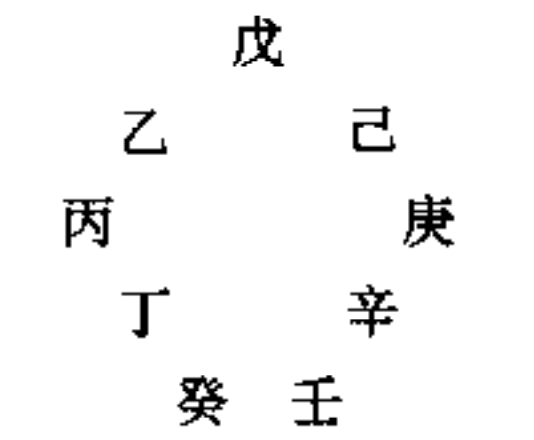
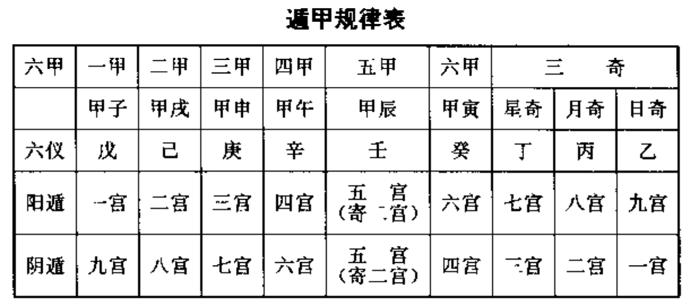
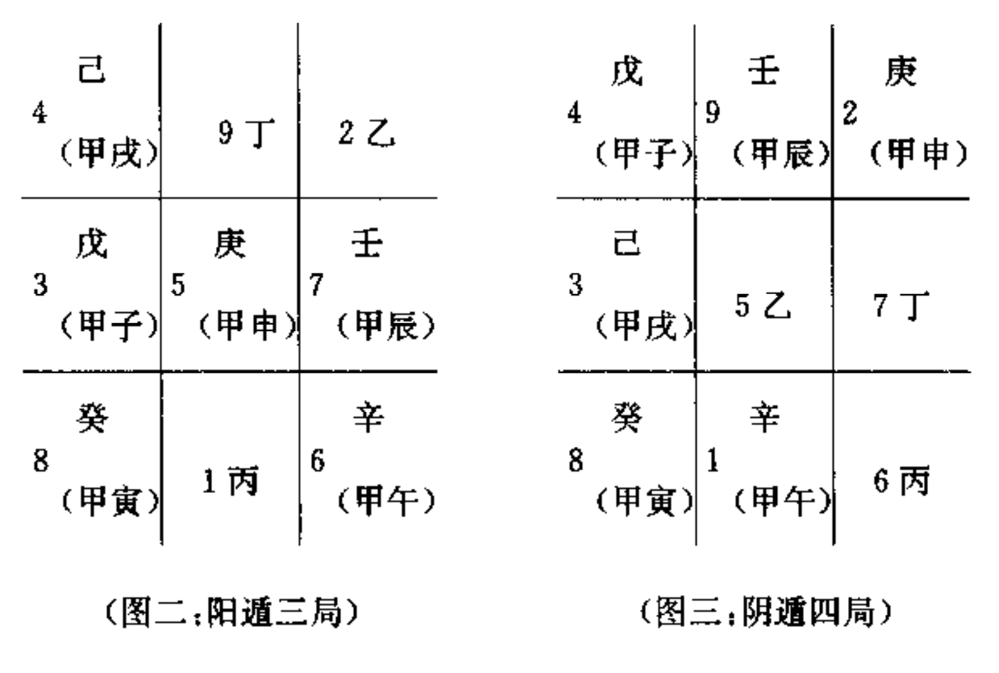
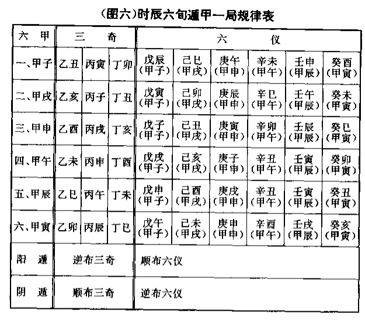

# 时家奇门遁甲原理

## 遁甲十八局

甲为元帅为主将，他经常隐敲在阵中，所以叫遁甲。

甲、丙、丁为三奇，是元帅或主将身边最得力的三个辅佐官。在一定意义上，乙、丙、丁三奇就像现代军队的司、政、后三大机关-样，司今部起参谋作用,政治部起政治官传作用，后勤部起粮草供应作用。

乙为文官为谋士，他或她打着一面绣有太阳标志的旗帜(日奇);丙为武官，为主帅身边最得力的卫士,他打着一面绣有月亮标志的旗帜(月奇:关公的青龙偃月刀,也可能源于此);丁为军需官，负责粮草军需供应，他或她打着一面绣有星星的旗帜(星奇)。乙、丙、工三奇，也可以作为三支奇兵来理解，出奇制胜往往都靠它。

也有人从阴阳五行的概念来解释乙、丙、丁为何称为三奇，即甲为主帅，为阳木，最怕庚金克杀(阳金克阳木为七杀，最凶);乙为阴木,好比甲木的妹妹，乙庚相合，甲将乙妹嫁给庚金为妻,这样甲木就解除了威胁，乙自然可称得上实行“美人计”的奇兵了，丙为阳火,木生火,他好比甲木的儿子,能克杀庚金,保护甲木之父，所以他自然也是一奇;丁为阴火，她好比甲木的女儿,也能克伤庚金保护甲木之父,所以也是一奇,为此她还有“玉女”的美称。

戊、己、庚、辛、壬、癸叫做六仪，也就是六支仪仗队，六面旗帜我们可以根据阴阳五行的概念，分别为它们命名:戊为阳士，可叫正黄旗，已为阴土，可叫镶黄旗;庚为阳金,可叫正白旗,辛为阴金可叫镶白旗;壬为阳水,可叫正黑旗,癸为阴水，可叫镶黑旗。这样就形成黄、白、黑六面不同标志的旗帜、仪仗队。

十天干与十二地支相配，形成六十甲子，则十天干每个都会用六次，这样就形成了六甲、六乙、六丙、六丁、六戊、六己、六庚、六辛、六壬、六癸。

所谓六甲,即甲子、甲戌、甲申、甲午、甲辰、甲寅。这六甲就是六位将帅，其中甲子为元帅，其他五甲为大将，他们在排兵布阵中都要隐遁在一定的旗职之下。在奇门遁甲的九官八卦阵中，他们的仪仗旗帜是固定不变的。

元帅甲子隐蔽在正黄旗戊土仪仗之下，二甲大将甲成隐蔽在镶黄旗己土仪仗之下，三甲大将甲申隐蔽在正白旗庚金仪仗之下，四甲大将甲午隐蔽在镇白旗辛金仪仗之下，五甲大将甲辰隐蔽在正黑旗壬水仪仗之下，六甲大将甲寅隐蔽在镶黑旗癸水仪仗之下。

换一种说法，就是元帅甲子以戊为仪仗，因此又叫甲子戊；二甲大将甲戌以己为仪仗，因此又叫甲戌己;三甲大将甲申以庚为仪仗，因此又叫甲申庚;四甲大将甲午以辛为仪仗，因此又叫甲午辛；五甲大将甲辰以壬为仪仗，因此文叫甲辰壬;六甲大将甲申以癸为仪仗，因此又叫甲申癸。这是永定例,即永远不变的将帅仪仗配备准则。

十天干将甲隐遁起来,剩下九干，以配九宫八卦阵。六甲分别隐蔽在六仪之下,与乙、丙、丁三奇分占九宫。他们有固定不变的顺序和队形。这个顺序和队形就是

戊、己、庚、辛、壬、癸、丁、丙、乙.

这一点是奇门遁甲排局布阵的要害，过来所有的书籍都没有或不肯点明这一点。这一个固定不变的队形和顺序，并非一条直线，并非一字长蛇阵,而是一个连环阵，是一个太极圈，是一个无头无尾永远连在一起的迷魂阵。如果把它弯曲起来，就构成一个圆：

具体而言，所谓阳遁，就是从一宫到九官,按戊、己、庚、辛、壬、癸、丁、丙、乙这个顺序顺排;所谓阴遁，就是从九宫到一宫,按着这个顺序逆排。

还有一点，就是元帅甲子戊遁在几宫,就是奇门遁甲的几局。即阳遁时,甲子戊在一官时,就是阳遁一局;甲子成在二宫时,就是阳遁一局;依次类推。阴遁时,甲子戊在九官，就是阴遁九局;在八官,就是阴遁八局;在七官,就是七局;依次类推。

依次类推。我们只要记熟了六甲隐在六仪下的固定位置，那么我们就可以随时在纸上或手上推演九官八卦阵即奇门遁用的格局。

在纸上速记的方法如图二和图三即在纸上随便画一井字,然后填上九官的固定位置，用几局，就在几宫的格内填上甲子戌，然后按阳遁顺排、阴遁逆排的规律分别填上已、庚、辛、壬、癸、丁、丙、乙，这样一个奇门遁甲地盘的格局就布好了。

## 时家六旬

十天干其实主要是时间符号,所以恢复它们的时间含义,以十天干配上十二地支,一个干支代表一个时辰(古代一个时辰相当于现在2个小时)的话,则六十个时辰，由元帅甲子成带头,正好演练完一种阵式,一种格局。

六甲大将每人值班十个时辰,正好六十个时辰，与循环记时的六十花用子相一致，而在这六十个时辰中，六甲大将和三个奇兵所在的宫次是固定不变的。

由于在六十个时辰中，三奇六仪所在官次是固定的，所以就形成一种阵式,一种格局,奇门遁甲就叫一局。

这就是时家奇门最根本的规律。见图六《六旬一局遁甲规律表》,这里所谓一句,不是指十天,而是指十个时辰。

## 二十四节气

六十个时辰5天一局为一元，一个节气三元，上中下元，一年共72局。

古人根据八卦九宫阵与时间和空间的关系,对此做了巧妙安排,即以
- 坎卦一宫正北方位对应冬至、小寒、大寒三个节气,
- 艮卦八宫东北方位对应立春、雨水、惊蛩三个节气,
- 震卦三宫正东方位对应春分、清明、谷雨三个节气,
- 巽卦四宫东南方位对应立夏、小满、芒种三个节气，
- 离卦九宫正南方位对应夏至、小暑、大暑三个节气,
- 坤卦一宫西南方位对应立秋、处暑、白露三个节气,
- 兑卦七宫正西方位对应秋分、寒露、霜降三个节气,
- 乾卦六宫西北方位对应立冬、小雪、大雪三个节气。

古人把一年二十四节气,每个节气上、中、下元所用局数,总结为两个歌诀,这就是“阳遁歌”和“阴遁歌”

阳遁歌曰:

    冬至惊蛰一七四,小寒二八五同推
    大寒春分三九六，芒种六三九是真，
    谷雨小满五二八,立春八五二相随
    立夏清明四一七,九六三从雨水期。

阴遁歌曰:

    夏至白露九三六,小暑八二五重逢;
    秋分大暑七一四，立秋二五八流通;
    霜降小雪五八二,大雪四七一相同;
    处暑排来一四七,立冬寒露六九三。

六旬一局即六十个时辰正好演完遁甲一种格局。所谓几局是由元帅甲子戊在几宫确定的,同时元帅和五员大将即六甲分别值班十个时辰共演练完一局，也就是六甲分占六个宫位演完一种格局。元帅甲子戊如果在这一局中在一宫,下一局他就轮到古七宫,因为二、三、四、五、六宫分别有二甲甲戌已、三甲甲申庚、四甲甲午辛、五甲甲辰士、六甲甲寅癸这五员大将占着,下一局元帅甲子戊就得到七宫站位带班了。这样以来就是局与局之间,即演练完一种阵式再接着排演下一种阵式，中间隔着五个宫位。

## 日干与三元

一、每一元的第一天的天干,不是甲就是已,古人把这个元头，称为符头。即符头只有二个，不是甲,就是已。

二、凡上元第一天的地支总是子午卯酉中的一个,中元第一天的地支总是寅申已亥中的一个，下元第一天的地支总是辰成丑未中的一个。

古人把子、午、卯、酉称为四仲,即冬夏春秋每个季节的中间一个月;把寅、申、巳、亥称为四孟,即春秋夏冬每季的第一个月;把辰、戌、丑、未称为四季,即春秋冬夏每季最末一月。

从五行寄生十二宫来讲,子、午、卯、酉均为帝旺之月,寅、申、巳、亥均为长生之月,辰、戌、丑、未均为四库之月。

换句话说，上元符头即上元头一天的日干支为甲子、甲午、已卯、已酉;中元符头即中元头一天的日干支为甲寅、甲申、已巳、已亥;下元符头即下元头一天的日干支为甲辰、甲戌、已丑、已未

## 超神接气置润

时家奇门每个节气所用的元,既与节气相联系,又与日干支相联系。时家奇门按每个节气十五天分别用上中下三元,一年二十四节气,15x24=360,共计360天,而一年的实际时间即地球绕太阳运行的周期是365.2422日，二十四节气是按照地球绕太阳运行的实际时间、度数制定的(这实际是阳历，中国农历是阴阳历的结合),即每一个节气平均15.2184日，不是正好十五天。这样以来,每个节气交节的这一天,并不能都与符头即上元头一天的日干支碰到一起,由此就出现了三种情况:

第一种情况,交节的这一天正好碰上上元符头,即日干支为甲子、甲午、已卯、已酉,古人称之为“正授”。但是,实际上这种情况并不多见。

第二种情况,上元符头在节气的前边,这叫“超神”,超在节气神前边,这种情况较多。比如乙亥年(1995)农历正月初五下午3点24分交立春节,但这一天日干支为丙寅,符头为甲子,即立春前正月初三日干支为甲子,从初三这天就是立春上元了，应用阳遁八局。这就叫“超神”

第三种情况，节气在前,即交节时间在前,上元符头在后,这叫“接气”,一般在置闰之后才出现这种情况。

实际上,大部分情况是上元符头在节气的前边,这种差距,有时只有一二天,有时四五天,最多可达九天以上。当上元符头超过节气九天的时候,就要置闰

所谓置国,就是接着这个节气下元的最后一天,再从上元第一天开始,把这个节气的上中下三元重复一遍。这样重复十五天,本来是“超神”,一下子就变为“接气”了,即上元符头跑到下一个节气的后边了。

但是,置闰有一个规定,就是只有在芒种和大雪这两个节气时才能置闰。这是为什么呢?因为芒种在夏至前,属子阳遁的最后一个节气;大雪在冬至节前,属于阴遁的最后一个节气。从冬至开始实行阳遁,从夏至开始实行阴遁,为了使符头与节气尽量接近和一致,所以在改变阴阳适之前,把符头调整好,使符头与节气不要差得太远。如果在别的节气置国,就容易使阴阳混淆,把应该阳适的时间搞到阴适里边去,或把应该阴遁的时间搞到阳遁中来

置润的目的是调整二十四节气与奇门遁甲上中下三元的对应关系。古人多数主张用置闰法来解决这一矛盾,以保持以甲、已日为符头,使时家奇门用局从日千支就可以确定下来。

也有少数人不主张置闰,可称之为“无国派”。不置闰即可解决上述矛盾,有两种方法,一种叫拆补法,又称拆补局。

拆补法仍然把上中下三元放在一个节气之中，而且仍采用日干支甲子、甲午、已卯、已酉为上元符头,甲寅、甲申、已巳、已亥为中元符头,甲辰、甲戌、己丑、已未为下元符头。但由于多数情况下不是“正授”,而是“超神”,所以从交节以后所用上元天数必然不满五天,这就叫拆。到了交下一个节气之前,用完下元之后,一般还有二三天可以用来补上上元所缺的天数,这就叫补。也就是说,多数情况下交节后所用上元为残局，用完下元又来弥补这个残局，出现残上--中--下--补上的局面。

还有一种方法,由茅山道人所创,既不用置润,又不用拆补法，直接从每个节气的交节时刻开始,即用本节气遁甲上元局，上元用满六十个时辰转入中元,中元用满六十个时辰转入下元。这样以来,就打破了根据日干支符头之日地支子午卯西为上元,寅申巴亥为中元,辰戌丑未为下元的规律。而且还会出现遁甲下元有所取舍的情况,即前一个节气下元尚未用完六十个时辰,节气一到就停止不用,即要舍弃一部分时间;前一个节气下元已用完六十个时辰，下个节气尚未到,仍需继续用前一个节气下元,这就叫取。这种方法,进行奇门预测应用时,必须按照事先编制好的无润法奇门遁甲历才能进行,只记住日干支和交节日就不行了。

## 拆补法说明

笔者认为:古人的-年也是365.2422日，古历的24节气也必有长有短，古贤在制订这张用局表时如果真会不顾事实，确定“一年360天,每节气15天”,此表一问世即是废品,又何能留传至今使用至今呢?

考虑到用局表是一种指导书;她不同于每年一本的历书而是要能应用于任何一年的历书。

本文将讨论《用局表》能适应任何-本年历的充足条件及其原理。

1.用局表是对各节气消息卦的指示

天道(十天干)适行是以10为周期，地道(十二地支)运行是以12为周期。因而在连续60变中必出现一次天道地道整合之局,这类出现在甲子成所居宫位上的整合之局起了消息卦的作用，即在此局中可以分辨值符值便的起始位置。
当然在甲成已、甲申庚……的所居宫位上也可以出现天道地道整合之局。但分别推之，它们也必是每60变整合一次，只是古人专注于甲子戊这只“领头羊”,麻雀解剖一只足矣!

2.消急卦的演进规律

消息卦是每隔60时辰翻一次牌。这有点像老式自鸣钟从第1次报时到第2次报时，分针必须走满60格。所不同的是它的面盘上只有三个数字，“冬至一七四”，“小寒二八五”等来

为什么继阳谴一局以后必是阳遁七局，继阳遁七局以后必是阳遁四局?

因为已证明每60变天道地道必重合一次，因此只要能确定其中一“道”经60变后将在何宫出现,此宫即是二者汇合的地点。根据“值使随时宫”(阳遁顺行,阴遁逆行)值使在一宫与值符汇合后依宫位走60步必到七宫。这可用简单数学证之:因为地盘共9宫，值使走9步必回到原宫，第10步才移出1宫，60变中共有6次移宫，必从原宫位移出6宫，阳道1+6-7所以如阳一局是消息卦，那么接下的消息卦应是阳七局:继阳七局的消息卦必是阳四局(7+6-9-4)。而阴遁，如阴九局是消息卦，那么接下来的消息卦必是9-6-3,即阴三局;继阴三局之后必是3十9-6-6,即阴六局。

消息卦自动演进的规律在24节气的用局表中都能验证成立，使我们能够对超过180时辰的节气用完上中下三元以后补充取局。

3.节气能调整消息卦来统

假设冬至节有200个时辰，那么在“-七四”用完以后该取什么局?显然继阳四局后的消息卦必是阳-局(4十6-9-1)。于是在冬至节气内必是一七四一七四-……直到200时展用完为止。

此例可证:消息卦是一个全封闭的系统，它由三个元素组成，按一定顺序循环出现。阳一阳七阳四是冬至节气内部特有的消息卦系统。

接冬至的小寒节用局是二八五系统。二八五系统不能由一七四系统自动演进，在被时甲子戊即使移入二宫八宫五宫并不出现天道地道整合之局，可是一交小寒节气，阳二阳八阳五就有了消息卦的特征，而此时阳一阳七阳四失去消息卦特征。在全表24节气中都有如此突变，迫使我们接受一个假设:节气能调整消息卦系统。

4.用局表中的太极圈

古贤在用局表中央嵌着阴阳鱼并非装饰，乃是指示此表是以太极原理制订的。只有看懂此表中的太极圈才能正确使用此表。

首先，24节气排成阳遁半圈、阴遁半圈是有事实根据的，从冬至到些种，地球是从近日点向远日点运动，地球受太阳引力逐渐减弱，节气时间持续延长。增长为阳;离日运动为阳(因为太阳为“阳”，与阳相背相斥时该物必为阳)，定为阳遁半圈明矣!夏至起，地球进入向日运动平圈，节气时间持续缩短，定此阴遁半圈完全有根据。一种可以分出阴和阳的圆圈运动正是太极圈。

已经证明各节气用局表中三个消息卦是循环出现的封闲系统，以-个圆来表征它是最形象的，但又怎样分辨其中的阴和阳呢?它的阴阳就在“隐”和“显”。

从系统内部看，任何时刻只能有一个消息卦当政，当政时它处显态，不当政时它处隐态。

从全年的大系统看，一个消息卦系统是时隐时显，例如阳遁时，一七四采统在冬至、惊垫、清明、主夏四个节气中处显态，其它节气它处隐态;阴遁时,它在大暑、处焉、秋分、大雪四个节气中处显态，其它节气中它处隐态。

由此可知:“冬至一七四”实是一个小太被圈，这个小太极圈不仅内部不停运动，还随着全年的大太极圈作时隐时显的运动，这同地球一边自转一边公转的情况相似。太极围是无头无尾，无始无终的，因而也就可以随处为头随处为尾，一切取决于节气的开始和结束。下面以实例来说明怎样从这种观念使用节气用局表。

1996年芒种节开始于6月5日17时41分，即阴历四月二十(癸西日)酉时。节气全程189时辰，用局表为“芒种六三九”。

癸酉日的符头是已巳，所以它是中元第5天，按表取阳三局，此局用3个时辰;即遇上甲成日(下元符首)，按表启用阳遁九局，此局用满60时辰,遇已卯日(上元符首)启用阳遁六局(按照消息卦演进规律，阳九局经60时辰必启动阳六局，9+6-9-6。可以看到用“演进规律”启动和用“符头”启用是完全吻合的)，阳遁六局用满60时辰必启动和启用(正好遇上甲申日，中元符首)阳遁三局;此局用满60时辰启动和启用阳遁九局，阳遁九局用到第6个时辰，芒种节全部时间用完(3-60+60十60十6=189)，按下来的已巳时正是1996年夏至日的交节时间，由“夏至九三六”阴遁主政了。笔者认为这样用法是符合节气主大局，符首定用局的原则,个个节气都这样用去,还有什么超神、接气、置闰等等问题呢?就是碰到闰年闰月的历书，这张用局表也无须改变，因而它能世世代代用下去，显示它的太极圈的面貌。

5.《奇门遁中用局表》的物理模型

为把本文的观点得到清晰直观的归纳，笔者给出一个用局表的物理模型。

前面已说明各消息卦系统都是独立封闭的，不能从一七四系统自动产生二八五、三九六系统，那么这些独立的封闭的亲统究竟从哪里来?从阳遁一局的演局过程来看，一七四是甲子戊的消息卦系统、二八五是甲戌已的消息卦系统、三九六是甲申庚的消息卦系统……。因为在阳一局演到第11时辰甲戌己所在宫位上出现天道地道整合之局，这正是消息卦的特征，此时甲戌已居二宫，以每经60变再出消息卦的规律推之，它必是二八五系统。同理，第21时辰申申庚在三宫上也出现消息卦，由此演出三九六系统。如果我们把甲午辛、甲辰壬、甲寅癸的消息卦都推演出米，分别是四一七、五二八、六三九等等,以最简约原理归纳，真正有独立性的就是“一七四”“二八五”、“三九六”三个系统。节气可以调动其中一个来统作为自己的消息卦来统。

笔者用一个“氢原子模型”来说明它们之间的关系。三个独立的消息卦来统相当于三重核外电子轨道;被隐去的“甲”相当于一个电子，电子“甲”受激以后能在这三重轨道间跃迁，进入某重轨道就照这轨道运行，从哪个地点进入就从哪里开始，直到它再被激发脱离此轨道为止。因为电子只有一个，而且仅当电子跃入时，某重轨道的存在和性质才能显示出来;空载的轨道是一种隐态的存在;三重轨道都呈波浪形，轨道相互穿越时有交接点。阳道是这个模型的顺旋态，阴遭是它的逆旋态。

## 天地人三盘

### 天盘九星

- 天蓬星：与北方、坎卦、一官对应，五行属水，又名贪狼星。
- 天芮星：与西南方、坤卦、二宫对应，五行属土，又名巨门星。
- 天冲星：与东方、震卦、三宫对应，五行属木，又名禄存星。
- 天辅星：与东南方、巽卦、四宫对应，五行属木，又称文曲星。
- 天禽星：与中方、五宫对应，五行属土，又称廉贞星。
- 天心星：与西北方、乾卦、六宫对应，五行属金，又称武曲星。
- 天柱星：与西方、兑卦、七宫对应，五行属金，又名破军星。
- 天任星：与东北方、艮卦、八宫对应，五行属土，又名左辅星。
- 天英星：与南方、离卦、九宫对应，五行属火，又名右弼星 。 

而天盘上的九星是一直在运转的。九星运动的规律,是一个时辰换一个宫位,即随时辰天干而动,时辰的天干在哪一宫,值班的星球就运转到那一官,其他星球依次运转。

具体而言,根据预测时的时辰干支,首先找出这一干支所在的旬,是甲子旬,还是甲戌旬、甲申旬、甲午旬,甲辰句或甲寅旬。知道了哪一旬,就知道了地盘上是六甲中哪一员大将在带班,这员大将站在几宫带班,与他所在宫位对应的天上九星之一就是值班的星座,奇门遁甲中叫值符。

### 人盘八门

- 休门：北方、坎卦、一宫、天蓬星对应，五行属水。
- 死门：西南方、坤卦、二宫(含五宫)、天芮星(含天禽星)对应，五行属土。
- 伤门：东方、震卦、三宫、天冲星对应，五行属木。
- 杜门：东南方、巽卦、四宫、天辅星对应，五行属木。
- 生门：东北方、艮卦、八宫、天任星对应，五行属土。
- 开门：西北方、乾卦、六宫、天心星对应，五行属金。
- 惊门：西方、兑卦、七宫、天柱星对应，五行属金。
- 景门：南方、离卦、九宫、天英星对应，五行属火。

八门的运转规律是随时宫，即按照阳遁顺行、阴遁逆行，随着时辰的地支和九宫的顺序运转，也是一个时辰换一个宫位。

具体而言，首先要找出在某局某旬中值班的门吏是谁，奇门遁甲就叫值使，即八门中哪个门在值班。值使的确定以值符为准，也就是说，天上值班的星座是谁，与它对应宫次的八门之一就是在人间值班的门吏。 

### 神盘

神盘又叫八诈门、八诈盘、八将盘、针盘、顶盘。它同六爻预测法中的六神、六兽有类似之处。

它是古人根据阴阳五行学说，在天、地、人相互感应中，发现的八种影响人类生活吉凶祸福和举事成败得失的神秘能量，并分别给予命名，传统上又叫神煞。

- 值符：禀中央土，为天乙之神。它是八神的元首、九星的领袖，所到之处，百恶消散。又名小值符，以区别于天盘上九星值班的大值符。
- 腾蛇：禀南方火，为虚诈之神，性柔而口毒，专司惊恐怪异之事。
- 太阴：禀西方阴金，为荫佑之神，性阴匿暗昧。
- 六合：禀东方木，为护卫之神的六合。性和平，专管婚姻交易中介之事。
- 白虎(下隐有勾陈)：禀西方之金，为凶恶刚猛之神。性好杀，专司兵戈争斗杀伐病死之事。
- 玄武(下隐有朱雀)：禀北方水，为奸谗小盗之神。性好阴谋贼害，专司盗贼逃亡口舌之事。
- 九地：具有坤土之象，万物之母，为坚牢之神。性柔好静。 
- 九天：具有乾金之象，万物之父，为威悍之神。性刚好动。

八神排列的顺序，在阳遁九局中，顺时针方向，依次是值符、腾蛇、太阴、六合、白虎(勾陈)、玄武(朱雀)、九地、九天；在阴遁九局中，它们按逆时针方向排列，次序仍然是值符、腾蛇、太阴、太合、白虎(勾陈)、玄武(朱雀)、九地、九天。其中太阴、六合、九地、九天为四吉神。

八神运转的规律比较简单，有两种说法，一种认为小值符永远追随大值符。阳遁时用阳遁八神的顺序，阴遁时用阴遁八神的顺序。每个时辰预测时，只要找出大值符，即天盘上值班的星座之后，大值符运转到几宫，小值符也运转到几宫，其它七神依次旋转即可。另一种说法，认为小值符运转比较缓慢，每旬即每十个时辰才运转一个宫次。《奇门预测学》作者刘广斌先生即持此观点，并用于实践。也有的书把这种用法叫做地盘八神。 

## 纸上起局

- 第一步,是先把阳历的年月日时换算成干支历
- 第二步是根据节气和上中下三元的规律,确定求测日所用遁甲局数,是阳遁几局,或阴遁几局。
- 第三步,在纸上画一个井字形九宫格或者米字形八宫格,将至九宫分别按奇门遁甲格局填在格内。
- 第四步,在纸上一至九宫格内,按遁甲几局三奇六仪的排布规律,即戊、己、庚、辛、壬、癸、丁、丙、乙这个永定例、永远不变的顺序,将六仪三奇布在一至九宫格内。
- 第五步,找出预测时辰的旬首,比如乙亥时,甲戌为旬首;辛亥时,甲辰为旬首;戊戌时,用午为旬首;即预测时辰是六甲中哪一甲大将在地盘值班。同时根据该甲所隐的六仪,即知道地盘上该甲在几宫值班了。
- 第六步,根据地盘上六甲中值班一甲所在宫位,即可找出与它对应的天盘上值班的九星之一,这就是值符;人盘上值班的八门之一,这就是值使。这样把这个时辰内的值符和值使就找出来了，并一一写在纸上。
- 第七步,根据“值符随时干”的规律,看预测时辰的天干在地盘几宫,就将值符直接写在这个宫内，同时将它原在地盘宫内的六仪三奇也随之写在它如今运转到的这个宫内。
- 第八步,值符落宫确定了,将其余八星连同它们原来地盘内所携带的六仪三奇也一一写在运转到的官内,这样用事时辰天盘运行的格局就确定了。
- 第九步,根据“值使随时宫”的规律,将值使的八门之一按时间和宫位运行的顺序,确定它所落宫位,然后把它写在该宫格内。同时,将其余七门按固定顺序,一一写在其他宫格之内。这样,八门运转到问事时辰的格局也就一目了然了。
- 第十步,根据阳遁顺时针运转,阴遁逆时针运转的规律和小值符永远追随大值符的规律,将神盘中的小值符首先写在大值符所落宫内,然后,将腾蛇、太阴、六合、白虎(勾陈)、玄武(朱雀)、九地,九天按顺序一一写在其他七个宫内。这样,八神盘在问事时辰运行的格局也就确定了。

至此,奇门遁甲起局或叫起卦的过程就全部完成了，每个宫内天、地、人、神及三奇六仪所形成的格局,就一目了然了。