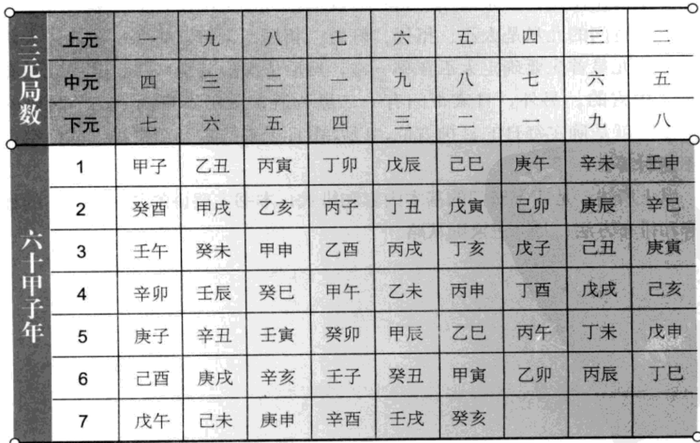
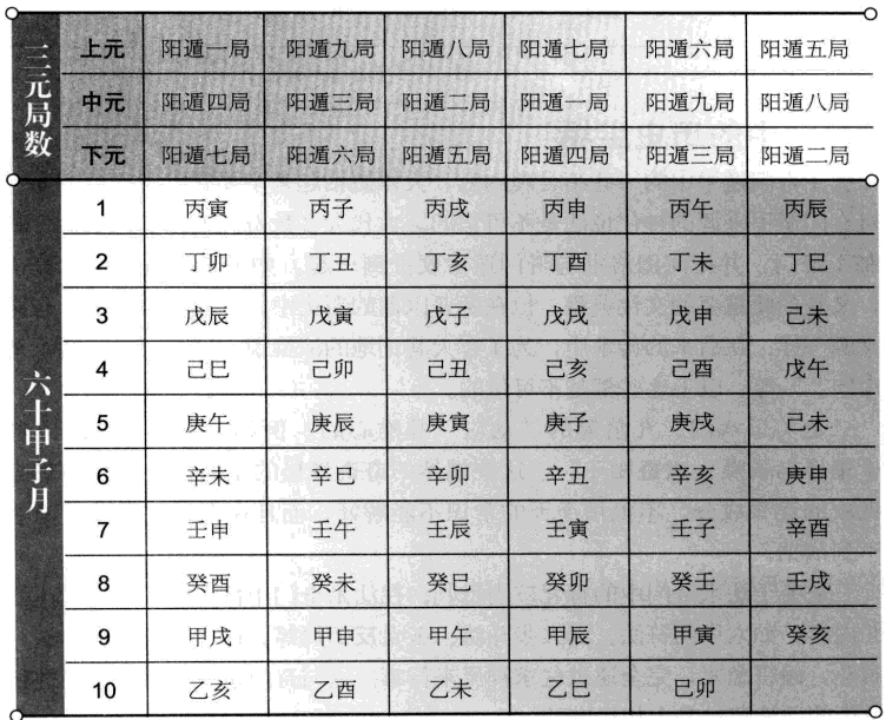
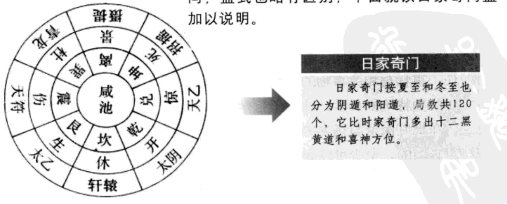

# 各家奇门

## 年家奇门

年家奇门是以60年为一元，也就是以60年为一局，分为上元、中元、下元，三元共计180年。年家奇门的定局起法是以上元甲子年起坎一宫，中元甲子年起巽四宫，下元甲子年起兑七宫，相当于时家奇门依节气而起定局。但由于天道左旋，所以年家奇门均为阴遁局，依阴遁之法，要逆布六仪，顺布三奇。年家奇门盘定局之后，先看当年的年干和年支是什么，再去寻它的旬头，在盘上依旬头看直符、直使是什么，然后据此转动活盘，直符随年干，直使随年支。吉凶的判断
和时家奇门的方法一样。年家奇门主要在定局，也就是每年都是从几宫起甲子，然后才能逆布六仪，顺布三奇。一般来说，年家奇门是从黄帝有熊氏即位的甲子年(公元前2697年)作为年家奇门上元开始推算。另外，年家奇门还配有另一套九星，即一白、黑、三碧、四绿、五黄、六白、七赤、八白、九紫。年家奇门配九星的法则是以上元甲子一白入中宫，中元甲子四绿入中宫，下元甲子七赤入中宫，其他各种则按九星的次序和九宫的顺序顺布。

年家奇门定局

年家奇门以六十年为一局，只用阴遁。其重点是确定局数，下面就列表说明其具体的定局之法。

## 月家奇门

月家奇门是五年一局，也就是五年一元，也分为上、中、下三元。每年十二个月，五年正好六十个月，所以五年为一元。月家奇门的分元是:年支遇寅、申、巳、亥四孟为上元，在坎一宫起甲子;年支遇子、午、卯、酉四仲为中元，在巽四宫起甲子;年支遇辰、戌、丑、未四季为下元，在兑七宫起甲子。实际上，月家奇门的分元与时家奇门秋分节气的上、中、下三元完全相同。月家奇门的布局法是先从年干推出月干，月的支都明确后，再寻出它的旬头，据旬头找出直符、直使，直符随地盘月干，直使随地盘月支飞泊，定局之后，得奇得门之方大利。

月家奇门也配年家奇门九星，配九星的法则是由年定的，入中宫的九星为:孟年正月二黑，仲年正月八白，季年正月五黄，星顺月逆而布。

月家奇门定局

月家奇门以五年为一局，只用阴遁。其重点是确定局数，下面就列表说明其具体的定局之法。

## 日家奇门

日家奇门比时家奇门要简单，其局数只有120个。它与时家奇门相同的地方有以下四点:一是以九宫八卦为排盘的构架;二是都分阳遁和阴遁，冬至到夏至前为阳遁，夏至到冬至前为阴遁;都是用休、生、伤、杜、景、死、惊、开八门;都忌五不遇时。不同的地方有以下五点:一是排局方法不同，二是九星不同，三是日家奇门没有时家奇门的几十个吉凶格;四是日家奇门分十二黑黄道，时家奇门不分;五是日家奇门论喜神方位，时家奇门则没有。

日家奇门排八门之法，首先是得日辰而定休门在哪一宫，然后依三日一换宫，冬至后用阳遁，夏至后用阴遁;以及依据日干之阴阳，而作顺布或逆布法则。日家奇门的九星是太乙、摄提、轩辕、招摇、天符、青龙、咸池、太阴、天乙。排九星首先要确定太乙在哪一宫，然后依次排其他八星，其中九星有一星是入中宫的。另外，日家奇门有十二黑黄道，预示本日内十二个时辰的吉凶。还有就是确定每日的喜神方位，以及由日干来推定天乙贵神、截路空亡和五不遇时等。

以上所述，是四家奇门的基本内容和排式，本书主要讲的是时家奇门的相关内容和排布方法，其余三家则从略。

日家奇门的局数

日家奇门与时家奇门相似，但九星不同，盘式也略有区别，下面就以日家奇门盘加以说明。

