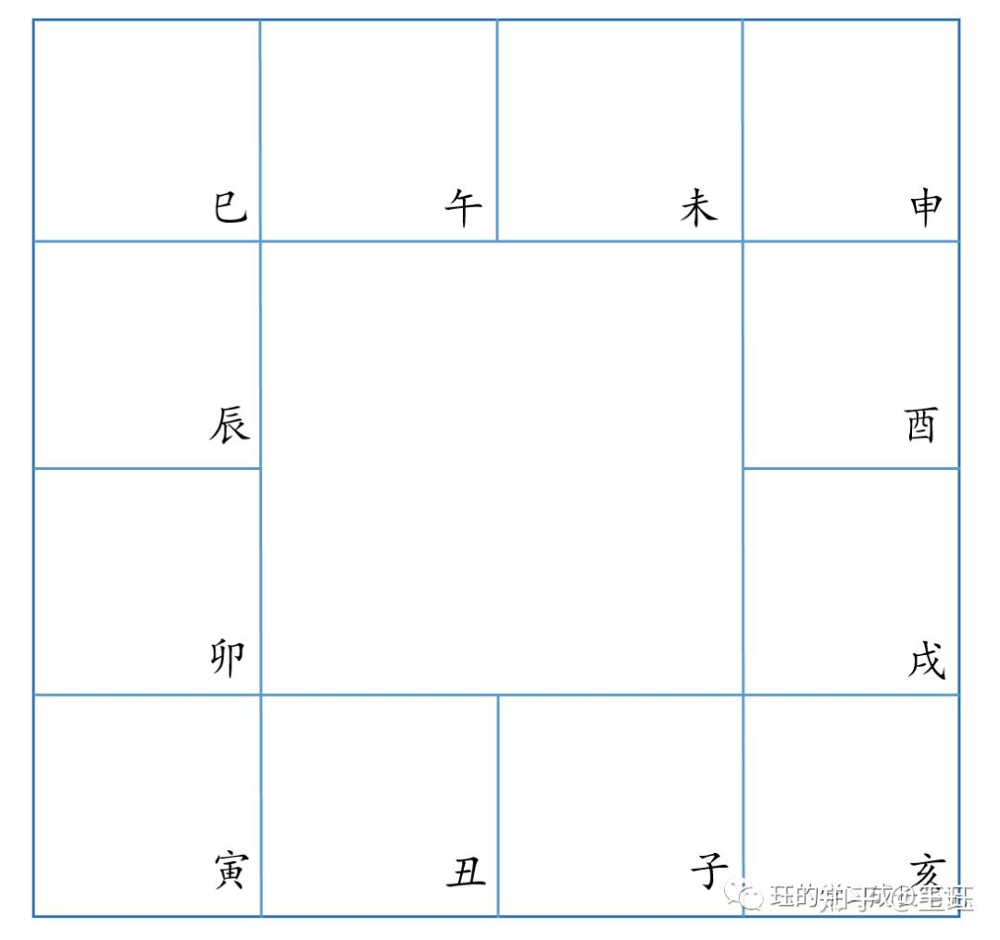
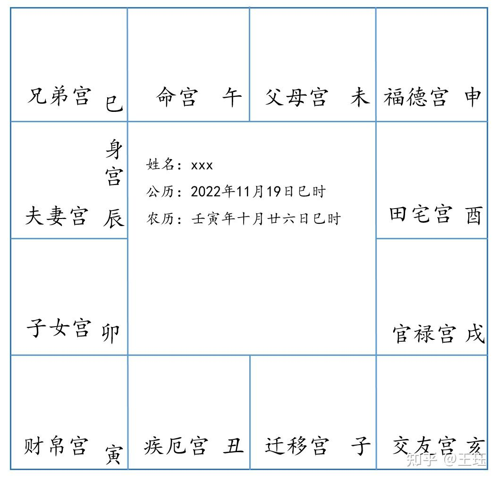
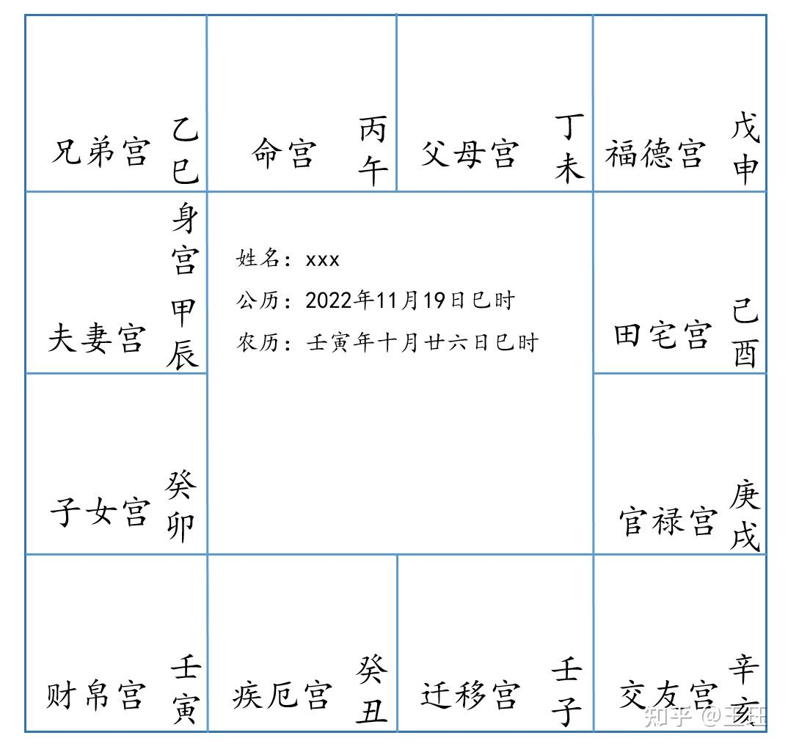
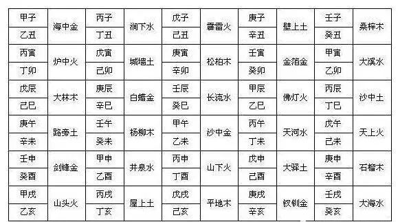
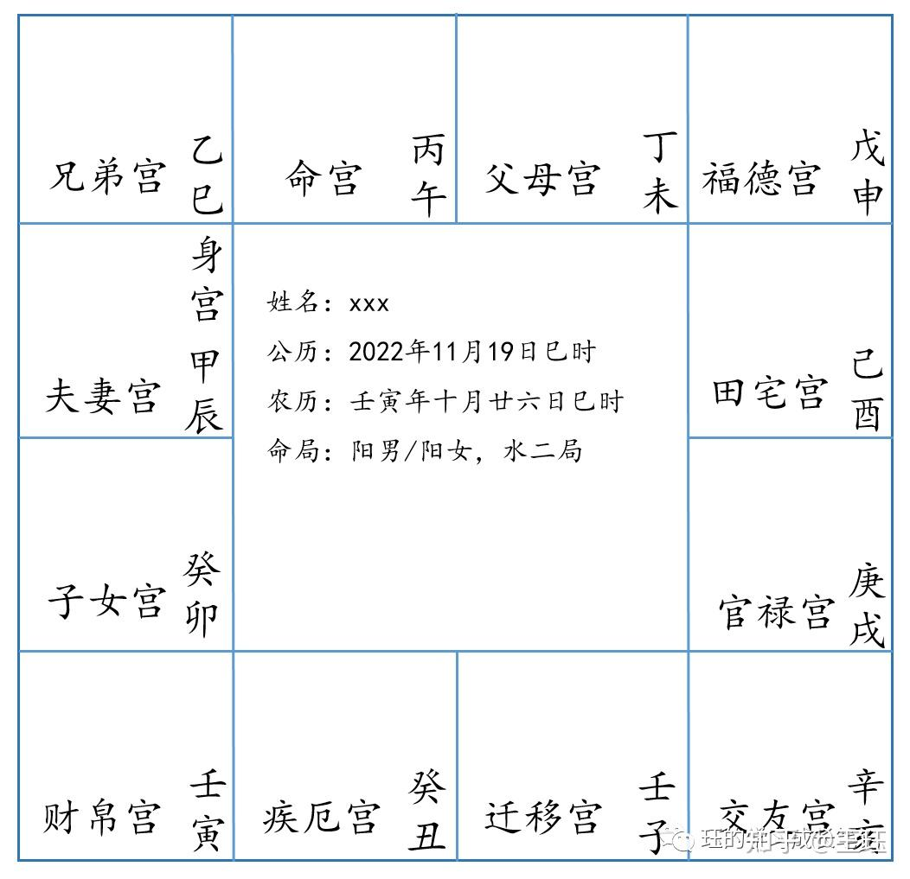

# 紫微斗术排盘

紫微斗术的排盘次序，分别为:
- 安命宫和身宫，定出十二宫位；
- 排布天干；
- 定五行局数；
- 再分别安上南北斗主星、辅星以及杂曜。

- 本文中先介绍定命、身宫、其他十一个宫位，以及定五行局的方法。

## 固定盘

## 安命宫和身宫

安命宫

排命宫：从生月的宫位开始起子时，然后逆数到所生时辰安命宫。

比如假设是生在2022年11月（亥月）的巳时（上午9点-11点），就从亥宫开始起子时，按照十二地支的顺序，即子丑寅卯辰巳午未...顺序逆数到巳，因此巳就落在午宫里了，命宫也就一起安在午宫。

命宫安好后就可以将剩下的十一个宫位按照之前所说的顺序依次逆时针排入十一个地支宫位里了。

安身宫

身宫和命宫相反着来，是从生月的宫位开始起子时，然后顺数到所生时辰安身宫。

所以是从亥宫起子时，然后顺数到巳，巳落在辰宫里，因此身宫就在辰宫。

身宫和命宫以及其他十一宫都安好之后，排面就是这样子的：

十二宫（顺时针排列）：命宫、父母宫、福德宫、田宅宫、官禄宫、朋友宫（仆役宫）、迁移宫、疾厄宫、财帛宫、子女宫、夫妻宫、兄弟宫

## 排天干

取寅宫天干顺排其他宫，和时辰干支无关。

下一步就是排天干了，排天干的方式是用五虎遁来排，在排八字月干的时候也会用五虎遁。

五虎遁的口诀如下：

    甲己之年丙作首，乙庚之岁戊为头；
    丙辛之年寻庚上，丁壬壬寅顺水流；
    若问戊癸何处找，甲寅之上好寻求。

以上歌诀的含义就是，如果是甲己之年，正月就是丙天干，也就是丙寅；而如果是乙庚之年，正月天干就是戊开始，也就是戊寅；丙辛之年的正月是庚寅；丁壬之年的正月是壬寅；最后戊癸之年的正月是甲寅。

壬寅年正月从壬寅开始，所以就在寅宫上安壬干，接下来按照天干的固定顺序（甲乙丙丁戊己庚辛壬癸），顺时针方向，依次在所有宫位上写上天干。写完之后如下：

## 定五行局

按照命宫所在的干支五行，来确定五行局。五行局分别为水二局、木三局、金四局、土五局和火六局。

五行局的数字和起大限（也就是起大运）的岁数相关，是多少局就是几岁起大限。

本盘的命宫在丙午，纳音为天河水，因此是水二局，在二岁开始起大限。

十年一个大限，和八字一样，按阳男阴女顺行，阴男阳女逆行的原则，依次排列。

阴阳是按照出生年干的阴阳来论的，以甲丙戊庚壬为阳，乙丁己辛癸为阴，壬寅年是阳年，出生的男孩是阳男，女孩就是阳女。因此这个盘的主人如果为男孩，则大限顺排，第一大限命宫在午宫，第二大限命宫就走到未宫。如果是女孩，大限逆排，第二大限命宫就走到巳宫。