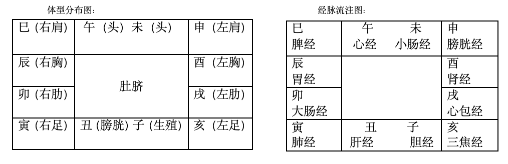

# 紫微解盘十二宫

## 十二宫

十二宫（顺时针排列）：
- 命宫
- 父母宫
- 福德宫
- 田宅宫
- 官禄宫
- 朋友宫（仆役宫）
- 迁移宫
- 疾厄宫
- 财帛宫
- 子女宫
- 夫妻宫
- 兄弟宫

六亲（兄弟宫、父母宫）：斗数来批，不太精准，需配合面相来判断。

## 命宫

先天命格（长相、个性、行为模式、一生成败）

家财丰厚的先天命：命宫全是财星或财帛宫全是财星

后天财：财星不会在财帛汇聚

## 父母宫

如果黯淡无光，庶出或螟蛉子。

## 福德宫

## 田宅宫

a.祖产情况；b.置产吉凶（火星在内招火灾，官非星在内招官司）

## 官禄宫

公家，从政

## 朋友宫（仆役宫）

多耗星，或化忌，合伙必败！多吉星，贵星，合伙大吉！流年财星来会时机最好。

小人定义：命中注定有小人，然后就会相信他，被他影响或害到的人（不一定是他故意的）。

观人术：
- 君子难进易出；庸才易进易出；奴才易进难出。
- 未言先笑，语无伦次，心生毒计；眼珠闪动；三角眼；四白眼。

## 迁移宫

外出发展

## 疾厄宫

只做参考。结合中医经脉流注、体型分布来看致命伤痛，**肺寅大卯胃辰宫，脾巳午心小未中，申胱酉肾心包戌，亥焦子胆丑肝通**。心包主后天心脏病，心经主先天心脏病。煞星多在那个宫就相对知道那方面的疾病。

## 财帛宫

私企，从商

## 子女宫

古人重视男丁的意义在于农耕劳作，不在重男轻女。宜夫妻结合来看。一般来说，女儿漂亮像父亲，儿子很帅像母亲。论子女将来，最好是看子女八字。

## 夫妻宫

必须与福德宫一起看

福德宫主一生福禄、财禄、事业，夫妻宫好福德宫差也代表夫妻不能长久。

## 兄弟宫

化忌：a.兄弟不和（眉毛很乱，交错不顺）；b.兄弟夭折（断眉）；c.兄弟合伙破财

## 相关面相

面相：眉毛太粗就是独子；眉毛（左兄弟，右姐妹）断裂兄弟姐妹夭折；左眼袋代表儿子，右眼袋代表女儿；左边的额头（日角）代表父亲，右边的额头（月角）代表母亲； 眼睛一大一小且不在一个水平线上代表是庶出或螟蛉子。额头上山林鼓起代表祖业丰厚。眼尾奸门代表夫妻宫（纹往下，配偶不贤，主生离；暗黑主配偶重病；纹多向上感情好）

气色：黄润最好。气色枯焦代表已经发生，气色枯黄代表刚发生两个星期，（气色主一个节气），暗黑色将于近期发生。

手相：男人手软如棉多福，女人手见筋见骨旺夫

