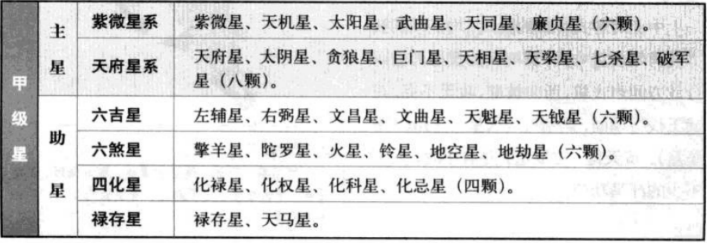
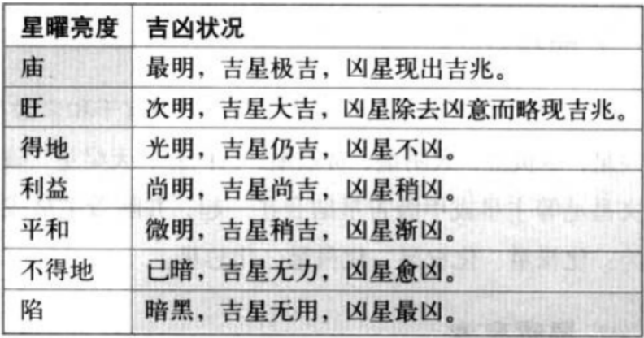

# 紫微解盘星辰

紫微斗数中的星曜众多，通常分为甲级星、乙级星、丙级星、丁级星和戊级星，以下是主要星曜介绍：

**甲级星**

- **十四主星**：紫微、天机、太阳、武曲、天同、廉贞、天府、太阴、贪狼、巨门、天相、天梁、七杀、破军。
- **十八辅星**：包括四化星（化禄、化权、化科、化忌）、六吉星（文昌、文曲、左辅、右弼、天魁、天钺）、六煞星（擎羊、陀罗、火星、铃星、地空、地劫）、禄马星（禄存、天马）。

诸星分南斗星和北斗星。
- 南斗星(天府系)：天府、太阴、天梁、天相，七杀、破军、贪狼；
- 北斗星(紫微系)：紫微星、天机、太阳、武曲、天同、廉贞。

- 六煞星：擎羊、陀罗、火星、铃星、天空、地劫。
- 六吉星：左辅、右弼、天魁（科甲星）、天钺（科甲星）、文昌、文曲

**乙级星**

包括天刑、天姚、解神、阴煞、天巫、天月、三台、八座、恩光、天贵、台辅、封诰、天福、天官、天厨、天空、天哭、天虚、龙池、凤阁、红鸾、天禧、孤辰、寡宿、蜚廉、破碎、华盖、咸池、天德、月德、天才、天寿等。

**丙级星**

有天伤、天使、截空、旬空、长生、沐浴、冠带、临官、帝旺、衰、病、死、墓、绝、胎、养、博士、力士、青龙、小耗、将军、奏书、飞廉、喜神、病符、大耗、伏兵、官府等。

**丁戊级辅星**

- **丁级**：岁建、龙德、天德、将军、攀鞍、岁驿。
- **戊级**：晦气、丧门、贯索、官符、小耗、大耗、白虎、吊客、病符、息神、劫煞、灾煞、天煞、指背、月煞、亡神。

## 科权禄忌

- 化科星性：
  - a.主科名（金榜题名，文笔优秀，才艺超群，为人师表）；
  - b.声名远播。
- 化权星性：
  - a.官印；
  - b.性情刚直。
  - 不同位置，意义不同。比如：
    - 夫妻宫化权，配偶性刚，主见很强；
    - 命宫化权，先天是领导之才。
    - 命中有科无权，代表有技术专长，适合佐才、参谋、顾问。
- 化禄星性：
  - a.钱财；
  - b.悭吝（守财奴）。
  - 比如：
    - 在父母宫，父母从商，很会做生意赚钱；
    - 财帛宫，自己会做生意；
    - 命宫，天生祖业丰厚……
- 化忌星性： 
  - a.劫杀（官司、横祸、意外等等）；
  - b.自身想不开。杀、破、廉、贪落陷为恶煞。

**化解灾戒在戒慎**

- 手相：在手掌上有天柱纹（事业线）主科；

面相：
  - 脸上颧大有肉，主权；
  - 颧大皮骨相连，主孤独；
  - 眉骨（犀牛骨）突出主有权；
  - 眉毛短小，有科无权，师爷像；
  - 男鼻主财帛，狮鼻（肉很大），悬胆鼻（细长鼻头有肉）均主富；
  - 女鼻主夫妻；男人手软如棉、女人手干枯，均为大福之相；
  - 五官紧凑为容易想不开，五官分布很开阔为大富相，额头开阔且眉毛在额头和眼睛的中间，大富大贵。

气色：
- 黄润主喜事；
- 黑暗，如有灰尘，犹如没有洗脸，一般主劫杀或想不开；
- 枯萎色（头发干枯蓬松，脸色发枯，无反光）、青蓝色主死。
- 看到气色后第一个节气通常就是劫杀发生的日期。

## 紫微系

### 紫薇（阳）星性

北斗星君，帝星，代表文武官带、贵人、正财（固定收入），解厄、制化（凶星遇到紫微，逢凶化吉）；

配合星：左辅、右弼。

帝星——耳朵不在大，正面不见耳；整个脸五官开阔，有宽、重感觉、不苟言笑

命官有紫薇，没有辅星，为僧道，或代表人厚道性情孤独。女命紫微独在福德宫，主一世孤单。

官星进入官禄官最好，财星进入财帛官最好。官带星进入官禄宫越大做的官越大。

财星进入官禄宫：贪官或手握财权；

面相：鼻子很大颧骨很高三个相呼应掌握财权；鼻子很大颧骨小自己有钱；鼻子小颧骨很大是贸易公司的财务经理。

### 天机（阴）星性

代表文官带（公务员、教师、银行工作人员、办事员），代表正财。

天机坐命面相：肤黑、个矮、体格壮、机灵。

### 太阳星性

代表武官带（军人、警察、外交官、法官），代表贵人，解厄，代表财禄（在财帛宫主横财---非固定收入，官禄宫主官），代表父亲、丈夫、儿子。

太阳坐命面相：红光满面、双目圆大、圆脸、皮肤白皙、中等身材、精壮。

### 武曲星性

代表武官带；解厄、代表财星王；代表贵人。

武曲坐命面相：个性火爆过得快，但是身材五短且壮（主富贵）；

### 天同星性

代表人和、解厄。

**治天下：天时大于地利、地利大于人和；平天下：人和大于地利、地利大于天时。**

孟子说：王无罪岁，斯天下之民至焉。（罪己不罪天，民心自然向）

### 廉贞星性

次桃花；代表武官带；

廉贞坐命面相：迷迷眼，见到美女未言先笑，长相清秀；

## 天府系

### 天府星性

南斗星君，代表个性温和；代表文官带（公务员），或教星（教师）；心眼比较多。**不可解厄制化**

小人面相：浓眉、四白眼、三角眼。

### 太阴星性

在子丑亥最好，女子太阴坐命很漂亮，代表文官带；正财（收入固定）。

### 天梁星性

食神（口福）；代表文武双全官带；天梁星坐命男相：英俊潇洒，长得精壮。

### 天相星性

佐才星（秘书、助理、参谋），天相入命：长相瘦高，为人厚道、脾气温和。

### 巨门星性

- 凶星，代表口舌，是非，官司，牢狱，也代表豪宅大院；
- 落陷代表牢狱；庙旺代表口才好。
- 入命：形小音高音量大或长绒（毛发旺盛）肥胖。
- 化权：为人师表，声名远扬。

### 杀破狼：武官带

- 七杀星性：七杀入命面相-----目大、性急、多疑。
- 破军星性：七杀入命-----孤僻、体瘦、不重利。
- 贪狼星性：贪狼入命-----身材魁梧，毛发比较多。主桃花星。代表酒、色、财气、赌。

事业上：
- 七杀、破军主劳、耗，流年逢杀破，主辛苦奔波，不能聚财；
- 贪狼主财，流年逢贪狼旺，主赚钱，少不了桃花。

杀破狼三方会命，刚愎自用的，易被人利用。

## 六殺星

擎羊、陀罗、火星、铃星、天空、地劫。

- 天空、地劫，生意流年逢之必赔；
- 火星、铃星，流年遇到，主火厄，个性冲突，口角；
- 陀罗、擎羊，主身边看不到的小人，又疾病血光。

面相：讲话时左边眉毛直纹向上，两面三刀相，看不到的小人相。

## 六吉星

左辅、右弼、天魁（科甲星）、天钺（科甲星）、文昌、文曲。六亲宫单星主凶。

- 文曲星主才艺，博学，斯文；文昌星;科甲（读书考试）；
- 天魁、天钺主科甲；
- 红鸾、天喜主桃花，男命红鸾必招美妻，女命红鸾（长得很漂亮，头脑很清楚）必有贵夫；
- 左辅、右弼主要辅助紫薇星；
- 三台、八座主要辅助天府。

流年遇到文昌星、化科容易金榜题名。

## 星辰的亮度

庙、旺、得、利、平、闲、陷。星辰在庙旺为吉，得亮度稍弱于旺，利为小吉，平、闲主无用，陷主凶，殺星在陷大凶。

- 吉处藏凶（吉星丛中煞星落陷）：必凶；
- 凶处藏吉（未落陷的煞星丛中吉星入庙）：平安

做人要知戒的时机：做事开始要知戒--戒之初，好运高峰要知戒--戒之盛

补充介绍副星：
- 文曲星主才艺，博学，多能，斯文；文昌星主科甲，读书考试；
   流年化科或逢文昌，金榜题名。文昌或文曲化忌，考试不中。文昌坐命，无文曲来会，学而不思，书呆子。文昌坐命会文曲，男子文采风流，女子则为桃花。
- 天魁、天钺主科甲；命中昌曲、魁钺来会，读书奇才。
   科甲旺之人，手相天柱纹明显，男左女右。
- 红鸾、天喜主桃花，男命宫红鸾，必招美妻，女子命宫红鸾（长得很漂亮，头脑很清楚）必有贵夫；流年在有人的宫（夫妻、父母、子女）、财帛，均可以结婚。
- 左辅、右弼主要辅助紫薇星；
- 三台、八座主要辅助天府。天府有三台八座，才可解厄制化。

自我补充知识点：
- 朝与冲：吉星居对宫叫朝，凶星居对宫叫冲。本宫及对宫逢七煞星亦谓之冲。一般多称化忌星在对宫为冲。
- 会与照：星曜在本宫的三方叫会，在在对宫相对称照。
- 遇、加、逢、同或同度：均指某星与另一星同宫之意。
- 本宫的左右两邻宫叫夹宫，吉凶星入两邻宫都叫夹
- 辰为天罗，戍为地网。
- 男命以命、身、财、官、福、田、迁等宫为强宫。女命以命、身、夫、儿、财、田、福等宫为强宫。
