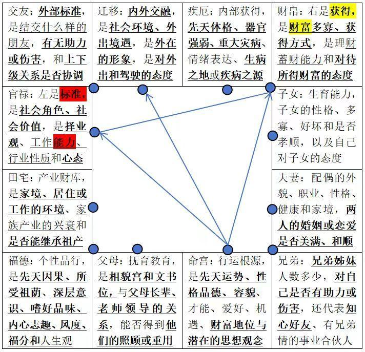
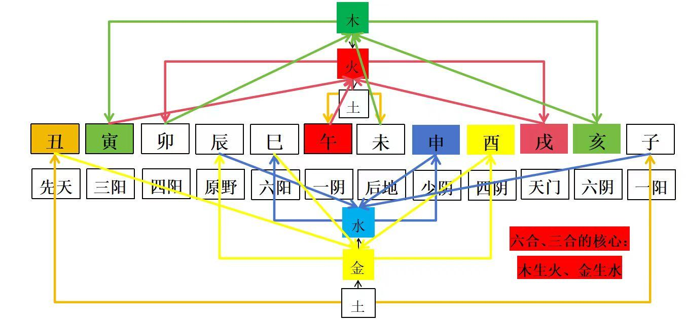

# 紫微斗数十二宫含义（超详细）

https://zhuanlan.zhihu.com/p/692068269

六内宫是命、财、官、福、田、疾，六外宫是父、兄、夫、子、友、迁。禄随忌走，禄是财源，忌是财库。禄在六内，一般代表靠上一代人或靠自身技能赚钱；忌在六外，一般代表钱都花在外面了。如果是禄在六外宫，忌在六内宫，这样就比较能把钱守住。

以命迁线为对称轴，本命宫是能量库（来因宫是能量源），左边官禄宫是标准、交友宫是对外人的标准，右边财帛宫是获得、疾厄宫是身体所得，命财官的三合是一个抓手（像机器夹娃娃的抓手一样），三合左边的父福田是血缘的内化，三合右边的兄夫子是血缘的外化，对面的迁友疾是非血缘的外气的入口。

生年四化、大运流年为什么都要重点看命财官的三合呢？因为三合的凝聚力决定了你能不能抓住机遇、发挥才能和有所成就。这就类似于抓娃娃主要看抓手的合力强度，如果抓手松软无力，即使有好的机遇也抓不住。命财官三合中，离心的自化就代表这个抓手有点松散，向心的自化说明抓手有点紧实。

命财官三合的左边（父田福）是血缘内化隐藏于我的精神烙印、为我所有、我可展现的实力，右边（兄夫子）是血缘外化显现于我的人际锁链、为我所见、我不可摆脱的名分。

在左边，命宫和官禄宫夹三个宫位：田宅（祖业）、福德（先天因果）和父母（文书位），核心是固定的继承关系，这些都是血缘关系赋予你的、内化于你而使你拥有的，前世的福德、今世的家族产业（阳宅风水）和父母的基因（国家的文化）是一定先于你存在。

在右边，命和财所夹的夫妻（有名分的爱人）、子女（还包括情人、宠物）和兄弟（还包括密友、兄弟情）都是由血缘和情缘构建的名分。核心是固定的名分关系，无论在一起还是分开，他总会有一个名分在你这里，但要你的本命和你的财帛来支撑，子女离财帛近耗财，兄弟离命近看命，夫妻则要兼看。

＊在子夫兄三宫，血缘外化为情缘，情谊是主观的血缘，血脉是客观的情缘。既然能够成为有血缘关系的兄弟，即使同辈之间没有感情，父母辈之间也一定有客观的情缘；非血缘的朋友如果走的亲近，兄弟情深厚，视作亲生兄弟，也就有了主观上的兄弟“血缘”。

最后，在命宫的正对面这边，官和财夹疾厄（身体以及灾厄）、朋友（不亲近的人）和迁移（外出机遇），疾、迁、友等于是固定的命局里开了三个吸纳外气的口子，这三道开口就是最能够激发改变的内容。比如通过你自己的身体修行（锻炼、斋戒、早睡早起），通过结交朋友（贵人）来改变原来的圈层，或者离开原生环境，迁移出去外面发展，而在其余的宫位里摸爬打滚的话，其实剩下的都是定数。

命宫：行运根源，是先天的运势、后天的性格品德、容貌、才能、爱好、机遇、财富地位与潜在的思想观念。兄弟宫、夫妻宫或子女宫比命宫强，说明兄弟、配偶或子女比自己能力强，反之亦然。

身宫：承受命宫的场所，是后天运势，与哪一宫同宫，就吉者加吉、凶者加凶，并预示一生的倾向性。命弱身强，为空强；命强身弱，则恐怕无用武之地。“身宫是空宫，代表行动力会比较差，但是接受不同事物的包容性也比较强。身宫落于迁移宫，那么在外机遇或是外在的条件对他一生的影响会非常大。迁移坐身时人际成为他的重点，所以要看一下交友兄弟，是不是会成为交际应酬过度的人。这个是一个思路。需要身在迁移时看人际带来的是利益还是在外面乱玩，其实本身命身格也能看出来。”[1]

身宫落坐在官禄，事业心会加强，事业也会对他的人生带来比较大的影响。空宫时不喜欢一成不变的事业特质。身宫是不喜欢见天机或是天才的，代表一生费尽聪明。

父母宫：抚育教育，是相貌宫和文书位，与父母长辈、老师领导的关系，能否得到他们的照顾或重用。父母宫也是疾厄宫（肉身）的皮肤、外貌。*父母宫见左辅是指师傅、长辈的数量多；右弼是更换（包括文书凭证的更迭）；地空是指超出辈分的上级，如（太）爷爷或奶奶；文昌是指偏房父母，也可能是指传递文书。

疾厄宫：疾厄就是指身体所存储的，是内部获得，先天体格、器官强弱、重大灾病、情绪表达、生病之地或疾病之源身心状况、祖上余德、父母遗传（看不见的）。如果身体多劫难，这可能其实就是通过承受痛苦来抵消业债的一种方式，即借业消业。*疾厄宫飞出来的四化一般都是不好的，一些比较星耀情况比较凶的宫位飞出来的四化即使是化禄也可能带着负面性质，化忌则更凶了，化禄则可以理解为身体上的组织增生（臃肿）。

＊父疾线最不宜见化忌，实质的影响较大，容易回冲，对父疾两宫皆不利。

财帛宫：财帛在命宫的右边，右是获得，是财富多寡、获得方式，是理财蓄财能力和对待所得财富的态度；现金、财运的好坏、看待金钱的方式。父母宫的疾厄宫就是自己的财帛宫，父母的健康与子女的财运关联。夫之夫是自己的财帛宫，代表配偶对待感情的方式，比如在流年的时候，财帛宫代表财运，也代表情感的对待关系，如果流年破财，要么是财运是亏损，要么是情缘上的聚少离多，总会有一个相应的结果。

＊化忌落入财福线的负面影响最小，反而有利于守财，化忌可能的负面力量从大到小排序：父疾线＞命迁线＞夫官线＞子田线＞财福线。

福德宫：个性品行，是先天因果、所受祖荫、深层意识、嗜好品味、内心志趣、风度、福分和人生观，与婚后生活的离合悲欢密不可分。夫之官就是自己的福德，姻缘其实总是门当户对的，你所修的福德就是你配偶的事业运。

“福德是投资宫，是精神世界，是内驱力。福德宫为内心的需求，空宫，内心世界比较空虚。福德空星太重加天马，带来的问题就大了。浮性重，自我想法多，做事急。见煞星的话容易情绪不稳定、三分钟热度，见煞较重容易极端冲动，因小事就发作；煞忌交冲，命身较好的话，会有很多事情想做，内驱力很足；（不见煞星的话）福德宫太好了，人就容易懒、没有担当；有化禄星代表想得开，也可能缺乏危机意识；化忌容易纠结悲观，但也可能有钻研精神。”[1]

田宅宫：是财帛宫的后院（家人分配资产的情况），资金链看田宅，不宜有空劫；祖业、置业吉凶、房屋坐向、不动产、田地产、异性朋友、家世背景；宜见贵星（太阳庙旺、太阴庙旺、紫微、天相、天贵天恩、三台八座成对出现、天魁或天钺单星即可），屋宅星（天府、龙池、凤阁）和财星（武曲、禄存、化禄、天府或太阴）。产业财库，是家境、居住或工作的环境、家族产业的兴衰和是否能继承祖产。兄弟宫的官禄宫就是自己的田宅宫，兄弟的事业运和家族的老本、祖产也有关联。

官禄宫：事业宫在命宫的左边，左是标准，是社会角色、社会价值，是择业观、工作能力、行业性质和心态，煞忌重的时候，也可能代表专业技术能力；做事能力、相关行业；配偶的情绪、对待方式。官禄宫为夫妻宫的内心，对方让你在感情的内心感到缺乏。跟夫妻宫化忌最大的差异在于，夫妻宫化忌是在情感上直接造成你觉得因为他而感受的空缺，但是在官禄宫时，却只是在面对情感时，心情上会有点空缺感，却不见得会受到很大的影响。

*通常来说，事业宫进空劫星为大败笔，进了空劫，事业会在很长一段时间内毫无起色，以至于外人以为你是“啃老族”或者“躺平者”，并且认为你事业很平平。事业宫又是夫妻宫迁移位，也是爱人外在形象位。因此事业宫强大，一般喜欢打扮板正、大方得体的异性。事业宫非常喜欢入强星，紫微，天府，太阳，或者化权星，化科星，天魁，天钺星，终究事业运可为命主添彩。

夫妻宫：配偶的外貌、职业、性格、健康和家境，两人的婚姻或恋爱是否美满、和顺等。化忌在官禄宫官禄宫为夫妻宫的内心，对方让你在感情的内心感到缺乏。跟夫妻宫化忌最大的差异在于，夫妻宫化忌是在情感上直接造成你觉得因为他而感受的空缺，但是在官禄宫时，却只是在面对情感时，心情上会有点空缺感，却不见得会受到很大的影响。

*斗数全盘的化权、化禄、化科皆由化忌作承担，夫妻宫化忌说明对于配偶而言，缘主的要求可能是难以承受之重，而命主也会因为过度的期盼而见落差极大的遗憾，可能由爱转怨。但化忌的作用力是属于纷杂、仍需整理的一种能量，需要理性看待。

兄弟宫：亲近的人，兄弟姊妹人数多少，对自己是否有助力或伤害，还代表知心好友、有兄弟情的事业合伙人；现 金（小钱）看兄弟宫；婚后生活是否有滋有味，不宜见夫妻宫飞忌入兄弟宫。

奴仆（交友）宫：不亲近的人，外部标准，是结交什么样的朋友，合作伙伴有无助力或伤害，和上 下级关系是否协调等。

子女宫：床位、桃花宫（子田线即桃花线）、股东位；对待子女、下属、晚辈的关系；生育能力，子女的性格、多寡、好坏和是否孝顺，以及自己对子女的态度。

＊兄友线代表人际关系，子田线代表实质的桃花，忌来忌（人情债、有情有义）＞禄来忌（冷脸贴热屁股），科忌（贵人化解、专业能力）＞权忌（冰火两重天、极端碰撞）。

迁移宫：内外交融，是社会环境、外出境遇，是外在的形象，是对外出和驾驶的态度；为什么而动身；外出状况、外在形象和表现、与父母之间的关系，核心是代表别人怎么看你，比如紫微星独坐迁移宫，一代表你外面有贵人帮助，二代表你在外面孤身一人、孤君独坐，这两点又是有关联的。如果是代表出外有人帮你，就是先天看先天（自己的先天命遇见贵人的先天命），你的贵人在先天运势中与你有缘、给予你帮助，你们之间的先天命相遇发生互动了；如果是代表外在形象的时候，就是先天命入后天，后天就是任何一个人看你都是这个相。

空宫：不由自主、使不上力，也意味着不确定性，不稳定性，有着无限可能，无限扩大它的吉凶。简而言之就是空宫既可以大吉，也可以大凶。也可以代表者一种渴望、空缺，比如夫妻宫空宫，就是希望别人主动来在意他、关心他。

借宫：借过来的星耀需要打折，力量有折扣。空宫意味着没有主见、没有主心骨，或者外出得利。然而无论如何变化，只要是见着空宫，那么则是暗示着该宫位充满难以预料的变数，是须要藉由抽丝剥茧的细功夫，才能够让真相大白。空宫是飞不进四化能量的，而空宫之对宫如果是我宫，即使有自化也射不进去空宫，却会影响空宫（因为没星曜呼应），却会产生气势的氛围笼罩住空宫，再则，既然每个宫位皆是情、财、智慧、精神的交通管道或驻足场所，所以，空宫之详论必然有其重要性，更何况空宫并无法让四化能量驻足以掀起风浪，所以其所存在之现象，也有如深邃的黑洞，须藉由其之交易位来窥视内涵。[2]

来因宫：先天的性格，就是人之生年天干所在之宫位，为启动生年四化之枢纽，要解释命盘所演化之所有四化，皆需回归此生年之四化以检视其本意，即所有四化皆以生年之四化为其原始意含。因为生年四化就是先天所禀赋之性。而其它四化之象则为后天之命也。例如来因宫在疾厄，疾厄宫指自己，即生年四化所造就之环境，是自己主观的心性或独自的努力所造成的。来因在疾厄宫：偏向个人，自我意识作用，情绪、思维与理念等心态。(命宫代表个性而表于外，疾厄宫代表心性而表于内，福德代表性情)

＊看出生年与命宫阴阳：出生年的天干和命宫的地支阴阳同者，吉则加吉，凶则减凶；不同者，吉则减吉，凶则加凶。

＊看命宫的地支：

寅申巳亥四马地：一生奔波，喜动不喜静，既指的是身动，也指的是灵动，性不耐静福动中。亥为要地，寅为山头，命宫在寅亥者最容易获得成功。

辰戌丑未四墓库：命坐孤独地，不喜欢出门、应酬，为人刚直忠厚诚，不靠投机取巧，全凭踏实努力。紫微星入丑未，性格爱憎分明、喜欢创新，有独立见解，对喜欢的事能全力以赴；入辰戌宫则爱恶无常，易得易失。辰宫为天罗，戌宫为地网，紫微遇破军辰戌丑未四墓宫，若见煞又无化禄化权及吉星会照，则为臣不忠，为子不孝。

子午卯酉四桃花：子午是被动桃花，卯酉是主动桃花，桃花亦称败地，男女多变不明情，生性乐观，处事随便，善机变，喜投机，易成易败。

禄是因，忌是果，是痴迷和执念。禄向忌流动，金水同源；科向权流动，木火一家。改运先改心，人生实无宿命。阴延年增百福，至于陷地不遭伤。阴有德者，天知之。斗数取三合，是按黄 道周天十二宫，每隔一百二十度即为「合」。这可以说是有天象上的根据。然而「六合」却无天象的根据。斗数看三方四正。可谓合理，但看「六合」，则不合理，完全是由子平找出来的依据。无论是六合还是三合，它们的核心都是木生火、金生水。

