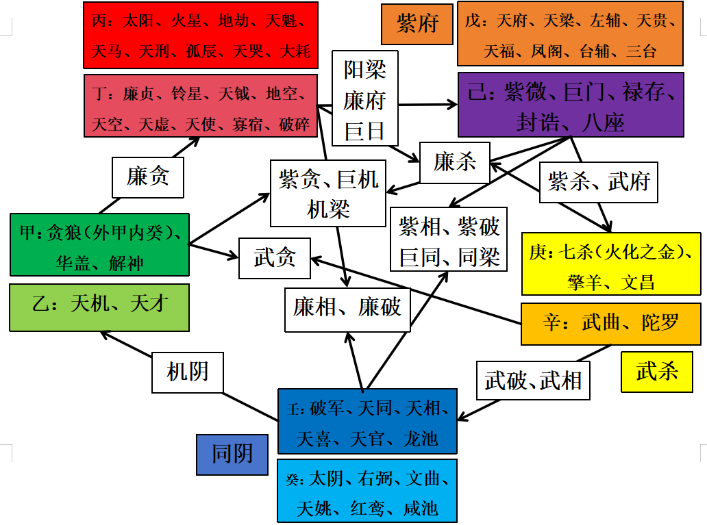
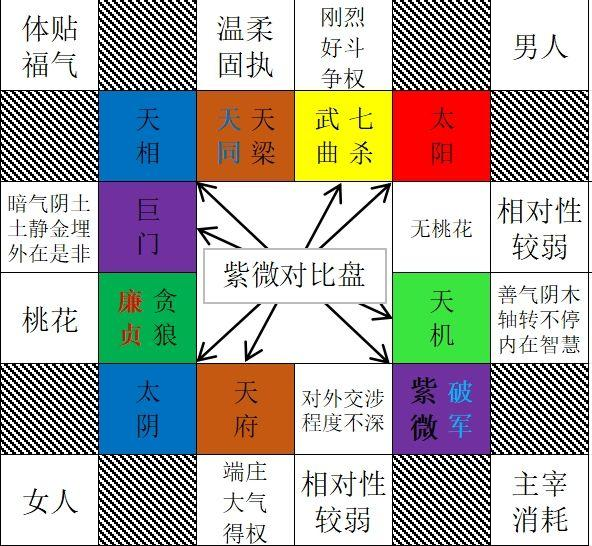

# 紫微斗数十四主星介绍（详细版）

1、紫微：己土，北斗帝王星，尊、贵、孤。紫微星又名帝座，系中天星主兼古时的皇帝星，掌造化之机枢，人生之主宰，有化解刑灾之功（最多应对3颗煞星），落诸宫均能降福消灾，解诸星之恶。

紫微是译 文 天 皇，主要是破译老 天 爷的天语，立命知贵 贱，安身知根基。洛书说了紫微坐在军中帐，就是做在太极的中央，定紫微就是定我。天府就是司命之君。排盘的时候先定紫微，才能定其他的星辰。在原始盘里，紫微是在命宫，其他实际的盘里可能紫微不在命宫。可能在田宅、官禄等那他的本质意义是代表我。意思就是紫微在哪里我就在哪里。命宫大限的最后一年（虚岁）时所在的地方，称为本地，50里开外的地方称为外地。

以大小限、流年落宫的星曜来推断，例如大小限、流年宫值紫微星，称为紫微星之限年。一般正星庙旺加吉化吉则吉，加煞平常；失陷加吉亦平常，失陷加煞则凶。逢化忌多有特殊之处，宫吉则变动，宫凶则变凶。

2、破军：癸水，子息之星，个性难以捉摸，进退反复不一，不按常理出牌，寡合、好胜心强、求真务实，大成大败，落坐十二宫都有动 荡、破耗的特质，又因破耗而修行，喜见天机星和紫微帝星（见紫微星才有获得权柄的意义），不喜见破碎、大小耗或天虚。破军化禄，有意外之财，但容易挥霍无度，存不住钱，适合任务型、拆解型工作（达成目标、获得奖赏），执行力强；破军化权，非常自我、一意孤行、刚强好胜、大好大坏，在跌撞磨练中成长，早年失志反而好，失败乃成功之母。

＊破军也代表创意，打破旧有的格局，开创新的局面，能发挥其刚毅、果断、勇敢、正直的长处，求新求变，为这个社会注入新的动力，容易展现才华，出人头地。

3、七杀：庚金，帅星，化气为权，相当于一颗化权星，虽为煞星但仍有化权之义，乃司权柄掌生死之星，主观决断、心急、早熟、敢爱敢恨，不苟言笑、叛逆暴 戾、孤军奋战，代表血光、恐怖、黑暗或神奇，守身命宫主做事进退、喜怒无常，喜见化禄和禄存，不喜昌曲。

*七杀代表上将、孤克；破军代表前锋、消耗。七杀与天府一定相对，破军与天相一定相对，刚柔并济，以对宫为外、本宫为内，既对立，又统一。

4、天相：壬水，衣食之星、印星、马屁星、模仿之星，对吃穿用度比较讲究，重视外观的美感，主聪明、好善、有高度的服务热忱、个性幽默，是个开心果，喜欢合作共赢和一团和气的氛围，擅长打理内 务，适合做和事佬，但不喜欢惹麻烦上身，喜欢一辈子过着清清闲闲的生活。

5、天府：戊土，南斗帝王星（南斗星君、统率），相当于一颗化科星，但会见三台和八座的时候才真正有解厄制化的作用，又是权 令之星、丰隆之星（物产丰饶）、管理之星、财星、库星和延寿化厄之星，能制擎羊、陀罗为从，化火星、铃星为福，主忠厚善良、心性温和、聪明灵巧、外柔内刚、不喜奔波、重视家庭，多才多艺和六亲不缺，穿衣风格高贵雅致，为人作风保守、重视钱财，被动式地求财理财，逢禄存、武曲则必有巨万之富。（逢府看相，要看夹星和牵扯，天府是仓库、柜子，天相是钥匙）

天府星在现代社会代表银 行和政 府机 关，是财帛主，代表储蓄，仓库，田宅，财帛，金融银行，政府，种养业。秘经曰：天府是禄库，命逢总是富。天府星化气为贤，代表有才华还老实，一般资本家都超级喜欢这样的打工人。天府无论落何宫皆吉，都有稳定和可靠之意，能解一切坏运气，能把擎羊和陀罗制服老实，化火星和铃星的戾气变成福气，天府不怕四煞星，但是害怕空劫和空亡同宫。

*天相代表印、衣食住行、福相、有礼拘谨、人际关系和睦；天府代表衣食朴素、尊贵大气、自带端庄之气、甚至高高在上

6、贪狼：气属甲木（精神层面），体属癸水（行为模式），外甲内癸，可祸可福，外缘（向外部攀缘的心念）较强，外向、机智、圆滑但耐心不够，代表欲望（万物的原欲），尤其是物欲，是感情猎人，心态方面不怕失败，认为失败就算了，成功的话就属于我了。

贪狼的原始宫位（本位）在福德宫。爱好、情怀、深层次情感等都与福德有关，修炼的好就是长寿的、享福的星辰，如果不好则主祸、放纵、贪欲太深。人性的弱点就是贪。哲学的话题，怎么去“修炼”，非常矛盾的问题。天地又让你贪得无厌又要让你修炼。祸福一线之间。贪狼化权，代表一种向顶峰攀爬的精进，对实现社会地位的提升很有野心；贪狼化忌，贪心、不怀好意或有所不满，但是所求不得，如果盘里还有太阳不得地或落陷、巨门化忌，则更容易怪事一箩筐；如果天梁庙旺、遇到六吉星或天机星调解，也可能得到净化。

7、廉贞：丁火，可善可恶，性格狂妄、为人浮荡，又代表公q力、贞节，公关能力强，但遇煞忌易流入邪恶、沉迷赌 博等等，幼年辛苦，长大后追求物质享受，是浪漫爱神。廉贞见天刑 、白虎只要再稍见煞忌就容易出问题。廉贞在化禄的时候是男，化忌的时候是女。

8、天梁：戊土，父母星、荫星、寿星、医药星和宗教星，侧重精神，如同天下父母心，爱面子，适当做老大或经纪人，博学多才，喜好命理哲学，外表温良，内心带有老气横秋、古板保守的固执，陷地则更顽固孤傲、与人寡合。廉贞的是自己犯错，天梁是秉公办事，所以天梁星见天刑星、白虎时不忌讳。天梁侧重物质时也是为了表达对精神面的重视。天梁在午守命宫为庙旺，干武职则为一品武官（军人、警察、法官、外交官）近天子，有生杀之权。

天梁为荫星，一为官贵之荫，扶持解难；一为父母之荫，继承或参与事业。当天梁化禄之时，仅在表示父母之荫，最喜得天魁天钺同会，便可补官贵益荫的缺陷。 命宮见天梁化禄，利发展家族事业；或参加有名誉的企业机构服务，则可积年资而攀上高居。

“荫”又可引伸为服务于社会，并且因此而取得名誉地位，财禄亦随此而来，三方见天梁化禄，以参加公众服务行业为佳。 然而天化禄虽主有现成事业，但除非是在公众服务行业工作，而且凡事秉公办理，不求私利，否则必会因钱财而发生麻烦，甚至成为别人攻击自己的把柄。要趋吉避凶，唯一的办法是从事专业，而且是些专业性质去属替人排难解纷（如律师，或替人解除痛苦（如医生、社会工作者），或替人解除财务困扰（如会计、财务计划专业），如此即可将天梁化禄的性质，转化为工作上的困难，在专业上劳心费神，代替此种受人攻击的困扰。

天梁化禄，喜欢分享，但容易言之无物，要透过分享去学习和成长，放下身段去和自己很不一样的人去交流，年轻的时候多学习打好基础，终将收获自己成绩。化权，有追求不懈的精神，专业领域内有成绩；化科，有艺术气质、仙风道骨，风度翩翩的美男子。

*一种说法：“天梁有可能偏欲求，也有可能偏贵清贵。要看子女宫，要看贪狼如何成立。天梁化禄代表幸运，但是如果偏贵且孤时，自己会把自己拉扯死，就是生活要钱，但是又感觉要钱影响我的面子，努力在那里拉扯，来个化禄就感觉难受了（天梁化禄或见禄存）。”

9、天同：壬水，小孩星、福星，侧重物质，代表宴饮酒食、大家的开心果、物质享受、小孩子的纯真和懒散，外表随和，内心带有孩子气情绪化的固执，化忌会放大这种毛病。小孩子得到了一个彩色的棒棒糖，他可能就已经非常高兴，充满了对美好事物的幻想，但最终也是为了赞美物质的丰盛美妙。

天同在辰戍二宫，对宫有巨门星，难免有些口舌是非，戍宫为日月反背，逢化忌，但丁生人反为佳，因福星居戍弱地，而丁生人虽有对方巨门化忌来照，但因三合双禄及科权及魁銊夹命亦是奇格也，天同之化权恰乎稳其本身之情绪，不但可解巨门之阴暗而巨门之化忌反成天同之激发力也。化权增强主星善良的一面，主动性和积极性的一面，化解掉天同抗压性差、懒散的问题，适合服务业和旅游业。

天同是柔弱的星是感性的星，没有能力去抵抗环境的折磨，环境的变化这是火铃，那么天同遇空劫，空劫天同并不适合，因为空劫是代表了思维上的那种空幻，幻想，打破常规，那么天同又是软弱的星，软弱的星再加上自己的思想怪异，这时候的天同遇到空劫，变成在思维上的那种怪异，变成在思维上的一种更加不能让人让别人理解，而且自己又更加的沉沦，而且这个想法跟大众不合，而且自己不会去努力的去力争上游去改变环境，反而在思维上面，多有这些不为人理解的这些观点想法，容易说服自己不上进，自己给自己打圆场。

所以古人讲天同化忌遇煞星刺激，尤其于遇火空遇地劫在男女情感上面，很有可能会变成同 性 恋，天同遇到空劫火星遇到铃星，很有可能因遇到打击转变了思想，一下子的人的思想是转变了，可能变的你不认识越变越坏。

*天同侧重于内在的自我享受，不怕化忌，带一点小孩子的情绪，是福星和小孩子星，容易受到煞星刺激；天相侧重于天生受到外界照顾，情绪方面更稳定，对于吃穿比较讲究，是衣食星和马屁星，更注重外在名利。

10、武曲：辛金，将星、寡宿之星、财帛主，主动求财、通过劳心劳力得到正财，性刚果决但精神孤虚、冰冷理性，揣着明白装糊涂，利字当头，重视利益分配问题。武曲重理性，重金钱，往往也会过于注重事业和赚钱，而忽略了家人和感情。

＊武曲加破军，权力欲望重，女命不适合将星入命，易经崇尚阴要从于阳，唯有阳失正道时，阴方可顺位。

11、太阳：丙火，官禄主，是男人中的男人，主父、夫、子，乃造化之仪表，其权威仅次于紫微帝星，代表责任、担当、事业、公平和公正，司权贵为文，遇天刑为武，活力四射、不拘小节、光明磊落、为人乐观、待人亲切、博爱，热心社会公益和照顾别人。太阳属火，卯属木，太阳星入卯宫则为庙旺，未属土，土泄火，入未宫只能是得地，亥、子水克火，入属水的宫位则为陷。一般来讲，庙、旺、得地为吉，陷、不得地为凶。

太阳落陷后，其动态的象会更弱，如果太阳庙旺就容易自尊心很强，落陷后易识人不清，盲目行动。但太阳的热情、活泼、好助人、喜欢被别人认可这些特质是不受落陷影响的。

庙旺的太阳更光彩夺目，与落陷者气质上的区别比较明显。落陷者想比更辛劳，且需要四化的参与才能提升动能。庙旺的太阳能力强，做事目标明确。太阳化禄一般不会财来财往，反而会越来越旺、达官显贵，因为太阳是恒星；太阳化权，能快速推动事项的进展，但可能会过于积极，容易给人压迫感。

12、太阴：癸水，田宅、财帛主，是至阴至柔的一颗星，是快乐之星、美貌之星和才华之星，主母、妻、女，心思细腻、温柔体贴、善解人意、感情洁癖，对一切充满浪漫主义，喜欢美的事物，乐于接受他人意见，通过制定计划和目标去做生意求 财。

13、巨门：己土，巨门星和太阳星在三方四正会照且庙旺，为巨日格（正格），落陷则为偏格。巨门在辰落陷会太阳在子落陷，为人喜怒无常、表里不一。巨门对六亲宫来说都是比较不利的，彼此相处之间非常容易造成口舌是非，紫微斗数中有几颗星都有阴谋欺骗的特质，天府、太阴、贪狼，巨门。这几颗星只要再见阴星非常容易造成外面有第三者，或是婚姻上有难以言语的隐性问题。巨门化忌在夫妻宫，与配偶话不投机，经常发生口舌之争，也表示夫妻关系里的无穷无尽的是非与麻烦。巨门本身就是看世界就不信任的，而且巨门本身不光明总是很多事讲不透的。

但巨门化忌于辰或戌宫反主吉利，视凶实吉的实质最为明显，所以表面上虽挫折困扰，是非毕生但结局却往往非旁人所能料及。只是当事人排解辛苦，心思忧虑则仍难避免。因巨门属水，化忌五行亦属水，且巨门为沟渠之水，较脏，所流过之处，必留有痕迹，故事情发生过后，总是或多或少会留下些许后遗症。凡巨门坐命，必须以不出锋头为宜，但求实利，不慕虚名，乃是趋吉避凶之道；当巨门化为忌星时，尤须如此，若稍出锋头，则必横逆交加，阻力特大矣。巨门星是一颗明暗都懂的星辰，往往能够明白人性，但是只做到了看穿人性，却不知道如何处理人性中的问题。作为一颗暗蔽星，只有得太阳照耀，方能转凶为吉。

14、天机：虽然是乙干阴木，但属于男星，代表一种轴转不停的“内在智慧”，这和巨门阴沉隐晦的“外在是非”相对。天机化忌坐命宫者，只适合为他人谋划，如果为自己谋划，就容易有“聪明反被聪明误”、“搬起石头砸自己的脚”等等情况，适合多为别人考虑。这情况在福德宫，也有同样性质。天机化忌，更有太阴星、阴煞星、天虚星、天月星等，主心术不正，易行旁门左道，宜注意教养。化权则是动中动，奔波、在外发展，但不是劳碌命，可能会变化过度、不安定，尤其是见天马星，落在迁移宫或四驿马。

