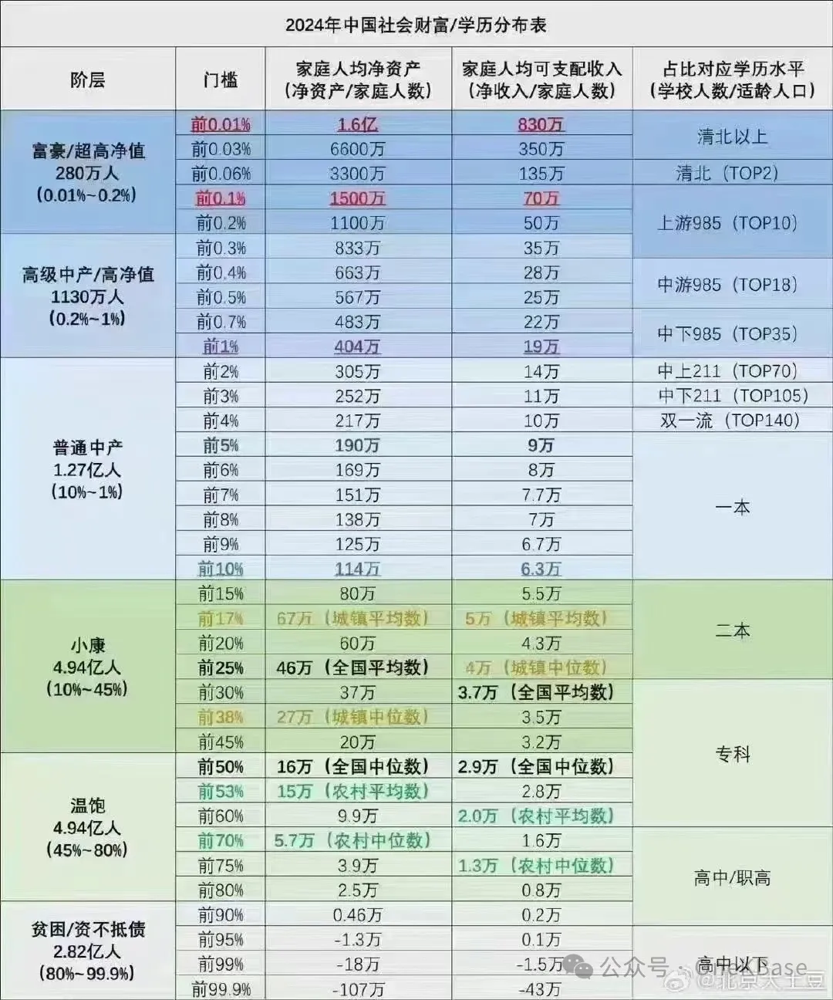

# 2024中国社会财富和学历分布

中国14.13亿人口都是什么学历水平？截止2020年底，中国6岁以上人口有13.15亿:

从未上过学的有5141万人，占3.9%

小学文化3.47亿占26.4%

初中文化4.87亿占37%

高中文化2.21亿占16.1%

专科学历1.12亿占8.5%

本科学历9416万，占7.2%

研究生学历1077万，占0.8%。

这就是目前全体中国人的学历结构。

财富等级(无负债，一个人可以用于生活的支出)

- 赤贫：500/月
- 贫穷：1千/月 
- 温饱：2千/月
- 小康：5千/月
- 中产：1万/月
- 高产：2万/月
- 富裕：5万/月
- 巨富：10万/月
