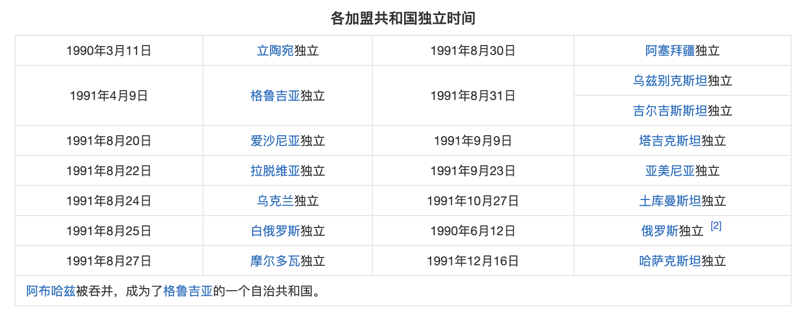

# 苏联解体总结

苏联解体，是指20世纪90年代初苏联共产党失去执政地位及由15个苏联加盟共和国组成的苏维埃社会主义共和国联盟的解体的事件。

1991年9月6日，波罗的海三国宣布独立；12月8日，俄罗斯、白俄罗斯、乌克兰三国领导人签署《独立国家联合体协议》宣布组成“独立国家联合体”。12月25日，米哈伊尔·谢尔盖耶维奇·戈尔巴乔夫宣布辞去苏联总统职务。12月26日，苏联最高苏维埃共和国院举行最后一次会议，宣布苏联停止存在，苏联正式解体，苏联解体分裂成15个国家。俄罗斯成为苏联的唯一继承国。原苏联在海外的一切财产、存款、外交机构、使领馆等由俄罗斯接收。

## 背景介绍

勃列日涅夫上台后，大量提拔亲信，苏联政坛形成了以勃列日涅夫为核心的特权阶层。贪污、盗窃和将国家财产据为己有的现象非常普遍，行贿成风，生产效率低下。勃列日涅夫时代的后半部分，被称为苏联的“停滞期”和“僵化期”。此时，苏联的特权阶层羽翼丰满。

据俄罗斯专家估计，在勃列日涅夫时期，苏联的特权阶层发展到50万人-70万人，加上他们的亲属，共有300万人之多，约占全国人口的1.5%。苏联的特权阶层早已将大量国家财富占为己有。贪污腐败的盛行不仅给国家带来巨大经济损失，对苏共党风以及社会风气也产生了极大影响。此时，苏联已经积重难返。

1985年戈尔巴乔夫上台，试图扭转这种停滞僵化的局面，进行了非常激烈的改革。为了缓解经济困难，首先进行经济改革。

但这些改革措施，缺少宏观决策和相应的配套措施；加上戈尔巴乔夫仍没有放弃苏联的传统做法，继续优先发展重工业，致使经济不断滑坡，人民生活水平继续下降。 同时引发了苏联的特权阶层强烈不满和社会动荡。

在经济改革没有迅速取得预期成果的情况下，1988年起，戈尔巴乔夫把改革的重点转向政治领域，实行政治多元化和多党制，削弱和放弃了苏共的领导地位，反对派趁势崛起，致使社会动荡日益加剧。

## 原因

至于改革失败的原因，戈尔巴乔夫在2015年归结为两点：一是起步太晚，等到他上台启动实质性改革，对积重难返的苏联模式来说为时已晚；二是急于求成，他推动的改革开始后，一系列措施的出台引起社会矛盾的激化，当时苏联社会并没有做好相应的准备。

### 政治

体制僵化

斯大林在社会主义国家带头开创的个人集权制、任期终身制、指定接班人制（斯大林模式）全面背离民主共和制的基本原则，是一种高度集中和集权的体制。

有以下特征：

1. 高度集权的政治体制。在党和国家的关系上，长期党政不分，以党代政，权力高度集中于党中央的执行机构，党中央的权力又高度集中于苏共中央总书记一人，斯大林长期独揽党政军大权。
2. 一党专政，苏共是唯一的执政党。原因有三。第一苏共领导十月革命，取得政权。第二，十月革命后，在苏维埃政府中也曾有与左派革命政党联合执政，后者退出并武装反苏。第三，后来阶级斗争尖锐，党逐渐对政府实行高度集中领导。
3. 党内民主严重破坏。苏共年会制被破坏，长达13年之久没有召开。苏共中央政治局成为凌驾于全党之上的最高权力机关。斯大林1922-1941年是党的总书记。1941年5月后斯大林集党的总书记，人民委员会主席，国防委员会主席于一身，独揽党政军大权。1928发生的沙赫特案件，斯大林对苏共党内的反对派以托洛茨基为首进行大清洗。苏联的一大批政治局委员、元帅、将军、书记、科学家、作家、音乐家等被克格勃暗杀，流放，迫害。个人崇拜极其严重，全党只听斯大林一人，大清洗的后果极其严重，希特勒发动苏德战争初期，苏联的大量部队由于将军、高级军官被清洗而散失战斗力。

官僚腐败

由于苏联的集权体制导致权力过度集中，从而使得苏共的官员和干部中饱私囊与贪污腐败严重。以权谋私在各行各业及各个领域泛滥。

从20世纪70年代中期开始，伴随着勃列日涅夫等中央执政者的年老体衰，思想愈加保守僵化，不思改革进取，使苏联政治体制中存在的各种问题都暴露出来。在国家中诞生一批特权阶层，这个阶层大约有50-70万人，加上他们的亲属共有300万之多， 约占全国人口的1.5%。

在苏联的官僚体制下，还形成以苏共官员和干部为首的特权利益集团，从而引发一定的社会矛盾。这一利益集团也成为苏联进行改革最大的阻碍。俄罗斯副总理曾指出苏联权力过度集中的集权体制是导致苏联解体的根本原因。

领导失职

1985年3月戈尔巴乔夫出任苏共中央总书记，他所面对的是一个动荡的世界和困难重重的国内环境。有人比喻此时的苏联，犹如一艘满载军火的航船，船体锈蚀、方向不明、运转缓慢，在茫茫大海中濒临下沉。这就决定戈尔巴乔夫受命之时，必须实行改革，以挽救这艘航船危亡的命运。

直至八一九事件发生，苏联共产党处境到危难关头，“戈尔巴乔夫自动辞去苏共中央总书记的职务，使苏共迅速走向衰败。苏共衰败，是苏联剧变的前兆；苏联解体，是苏共垮台不可避免的结果。

对内政策上，苏联经济学家格里高利·亚夫林斯基为戈尔巴乔夫制定500天计划，在尚未有完整的市场经济理论支持下，想利用短短500天将苏联原来的计划经济彻底转变为市场经济，结果是国内在价格固定的情况下生产者不愿意亏本出售商品，导致生产力下降，商品供应不足，最终政策被迫终止，但此时黑市充斥着美元，卢布已经贬值到接近崩溃的边缘，1990年的劳动节，苏联领导人在人民的谩骂声中走下红场主席台。

对外政策上，戈尔巴乔夫太过于求助西方社会，不断让步，放弃东德，以期待获得西方的经济援助，结果以英国首相梅杰为代表的西方阵营作壁上观，致使苏联失去被拯救的机会。

第28届共产党大会上，保守派受到少数派沉重打击，叶利钦宣布退出共产党。与此同时，戈尔巴乔夫在政治上也犯下严重的错误，他向由于废除一党制而已经成为敌人的苏联共产党妥协，任命亚佐夫等大批保守强硬派为政府高官（包括副总统、国防部长、克格勃主席、总理、内务部长），导致自己的亲信盟友，已经通过克格勃（苏联情报机构）嗅到政变危险的谢瓦尔德纳泽外交部长愤怒离开政坛，并在辞职时痛斥戈尔巴乔夫和整个苏联政府。

在戈尔巴乔夫推动新思维改革后，一些如波兰的“卡廷森林惨案”和1944年时期苏联政府对车臣人的流放等历史真相被解禁并逐渐被曝光出来，后来这些事件也得到平反。最终激化并爆发苏联所长期存在的民族、历史矛盾。

### 文化

施行高度集中管理体制。各种文化单位由国家包办下来。文化上学术上的是非，往往由党组织或者党的领导人说了算。苏联的政治经济学教科书由斯大林亲自审定，才能出版。

## 经济

模式僵化

1. 单一的公有制。主要是由没收大银行和大资本家的企业的全民所有制和农业集体化的集体农庄形式的集体所有制。
2. 优先发展重工业的工业化战略。1925年，苏共十四大把实现工业化作为全党的中心工作，作为当前时期的总路线。以牺牲农民的利益来换取工业化，农业、轻工业严重落后，满足不了人民的需求。
3. 否认和限制商品货币关系的指令性计划经济。不允许商品货币的流通，全靠中央各部门下发的生产指标进行生产，没有市场。严重浪费和效率低下。

经济崩溃

勃列日涅夫执政的后期，苏联领导层竭力回避改革，经济改革措施大多半途而废，致使经济发展迟滞，远远落后于美国等资本主义国家。20世纪70年代战略均衡的态势逐渐被打破，并且苏联的实际军费开支已接近甚至超过美国，而苏联的国民生产总值却只有美国的一半多，这使苏联的国民经济发展不堪重负。另一方面，苏联人民的生活水平明显下滑，尤其是农民的生活水平，生产粮食不如进口粮食便宜，农产品的增长赶不上需求增长。战后到80年代末人民生活水平的各项指标呈逐年递减态势，苏联经济的各项指标也都出现速度递减规律。例如苏联国民收入增长率50年代平均增长10.3%，60年代平均增长6.8%，70年代平均增长4.9%，80年代经济增长率继续下跌，到90年代则出现负增长。

苏联政府的秘密报告指出，卢布出现严重贬值、老百姓购买力严重下降，国内物资、商品尤其是生活用品极度匮乏，人们要为了购买自己的生活必需品而一大早就排起一望无际的长长队伍，甚至苏联民众在商店和超市里已经无法买到必要的商品。当时还出现囤积物资后再高价卖出的“地下经济”，而这种情况最后还变得越来越猖獗且政府已经无力管控。

同时从1990年开始，苏联政府就再也没有公开发表过任何对经济状况的统计和报告，也没有按例制定和发布相应的“五年规划”。

20世纪80年代，苏联极度依赖油气出口收入来维持经济运转，油气价格下跌使苏联国力遭受重创。能源出口收入占苏联外汇收入最高曾达到54.4%（1984年），在1973年和1979年两次石油危机期间，苏联大幅增产，拒绝与欧佩克限产保价相配合。其与欧佩克争夺西欧市场，争当西方的“可靠伙伴”。1985年8月，美国里根政府迫使沙特增产，实行“逆向石油冲击”战略，戈尔巴乔夫改革时期，苏联陷入用增产维持石油美元收益的怪圈。

苏联农业衰退的基础是在20世纪20-30年代形成的。苏联选择斯大林模式，彻底消灭个体经济，组织大规模生产，完全剥夺农业生产者的物质利益，这使农业发展走向末路。因为政府不愿意、也不打算在农业生产领域实施痛苦的但却必要的市场化改革，这种情况导致苏联农产品消费市场在1990-1991年间的彻底崩溃。

货币改革失败

为应对日益严重的财政危机帕夫洛夫政府开始推行货币改革，宣布废止旧卢布的流通而发行和使用新卢布。要求民众将自己持有的旧卢布换成新卢布，然而这却并不是按照等额原则进行兑换的，而是政府以一定比例向普通民众进行兑换。

这样的改革是以民众遭受损失为代价的，货币改革之后导致卢布严重贬值，物价急剧上涨，苏联爆发物资匮乏，民众在超市外排起长龙争相疯狂的抢购生活必需品与食物，苏联人民辛辛苦苦一辈子所挣得的财富一下之间就化为乌有。

货币改革最终不仅彻底摧毁苏联原本脆弱的金融体系，还破坏还处于雏形状态的市场经济，搞乱经济发展的秩序，让苏联政府的金融储备金消耗殆尽，而且使得民怨沸腾增加苏联民众对政府的不满。

## 社会

丧失民心

苏共（布尔什维克）在十月革命夺取国家政权后，由于自身权力过度集中的体制及缺乏一个公开、透明和有效的监督竞争机制，使得苏共长期高度垄断一切的资源和国家的权力而变成一个新的贵族阶级，站在人民的对立面，同时因为没有一个对人民负责的体制，工农阶级的劳动人民只是沦为一个旗号。权力与资源最终只是为上层阶级服务的。官员干部为所欲为欺压百姓假公济私，越是基层则越是腐败。

在切尔诺贝利事故发生后人民更加认识到苏共的本质而加剧对政府的不满。苏共官员干部大搞裙带关系，官商勾结与权贵资本严重侵犯老百姓的利益。苏联体制制造一个等级森严的社会，上层根本接触不到底层的民众，不了解人民的疾苦，在粉饰下其所看到的只是他们想看到和让其看到的东西。官员干部并不关心人民艰难的生存现状，政府对于人民的态度只是任其自生自灭，面对苏联大量老百姓的贫穷和饥寒交迫苏共则视而不见。最终苏共致使自己完全丧失了民心。到最后苏联解体之时没有一个苏联公民站出来维护苏共和苏联的体制，而叶利钦等反对派却一呼百应得到人们激烈的支持。

## 军事

**军备竞赛**

从20世纪50年代随着冷战的开始，美苏两国展开激烈的军备竞赛。美苏都各自在国际上拉拢自己的盟国组成各自的阵营，美苏两国在军事、科技、经济、意识形态、文化等方方面面进行着激烈的对抗。

美国高调推出星球大战计划，一旦星球大战计划完成，苏联对美国最具威慑的战略核力量优势就会被抵消，面对战略盾牌在手的美国，苏联就更加难以对抗，因此和美国一样开展战略防御计划，也是苏联最自然也是最无奈的应对之举。在这些高技术领域，苏联向来处在劣势，为了能够和美国竞争，国力不如美国的苏联不得不投入比美国更多的人力和物力来进行研制。

1993年5月，美国突然宣布放弃星球大战计划，不少人认为美国当初高调推出星球大战计划是一场处心积虑的战略欺骗，目的就是要将苏联拖入过度军事竞备，从而拖垮其经济。

尽管美国官方一直表示放弃星球大战计划完全是因为技术上的不成熟，并且星球大战计划中的一些科研项目实际上还在进行研究。但是从星球大战计划提出、推进到最终放弃，和苏联解体的步履如此相契合，不能不让人觉得这就是压垮骆驼的最后一根稻草。

**穷兵黩武**

苏联后期在世界各地四处扩张军事基地，甚至出兵阿富汗（苏阿战争），给原本濒临崩溃的苏联经济雪上加霜，使苏联陷入战争的泥潭最终拖垮苏联这座帝国大厦。苏联入侵阿富汗遭到国际社会的强烈谴责使得自己在道义上成为众矢之的，同时也遭到阿富汗人民坚定的抵抗，导致苏军在阿富汗的战争旷日持久让苏联耗尽自己的财政从而加速苏联的灭亡。

在长达几十年的时间里苏联扩军备战，使国家财力过多投入国防军事预算，加剧国民经济的比例失调，苏联在数十年的时间里，与西方对抗花费7000亿美元，与中国对抗花费2000亿美元，其它军费开支约100亿美元，这严重消耗和削弱苏联国力，成为苏联解体原因之一。

## 外交

和平演变是西方国家特别是美国对社会主义国家实行颠覆的一种战略，即以武力为后盾对社会主义国家遏制的同时，强化政治、经济、文化和意识形态领域的手段，全面推出西方世界的价值观，或明或暗支持苏联国内的反对派和民族分立主义势力，加速美国式全球民主化进程。西方的和平演变战略主要不是只靠广播和书刊等发起宣传攻势，而是加强国家计划调控，促进市场经济竞争，加大科技与教育投资， 鼓励科技发明创造，以其掀起的信息化科技革命的成果为物质基础，向社会主义国家显示发达资本主义制度的优越性：能实行新的产业革命和生产力革命，微电子技术、激光技术、新材料技术、机器人、航天工程、海洋工程、手机、 计算机、生物工程等自60年代以来能全方位发展；从而工人劳动时间能进一步减少，美国和西欧率先实行五天工作周 ，工人工资年年微调，失业救济和各种社会福利、社会保障逐步完善，各种社会矛盾得以缓解；民主、自由、人权、法治、市场供应、社区建设、文化教育与医疗设施等均有所改善。在这些社会背景和物质基础上，西方针对社会主义国家的弱点着重运用三大武器：经济上以市场经济攻计划经济，政治上以多党民主攻一党专政，文化上以自由文化攻文化专制。外因要通过内因起作用，外因只是变化的条件，内因才是变化的根据。应该说，和平演变战略对苏联的剧变只起着推波助澜的作用，只有当苏联国内出现政治、社会危机和动荡的时候，外因才能发挥一定的作用。

20世纪80年代，里根政府开展意识形态上的宣传大战，把苏联称为“邪恶的帝国”，号召对苏联进行意识形态上的“十字军讨伐”。1983年，美国国会拨巨款，以支持社会主义国家内部的反共政党和组织，资助“美国之音”“自由欧洲电台”的活动，加强宣传攻势。长期的争霸，给苏联造成沉重的经济负担，拉大苏联与发达国家的距离。自戈尔巴乔夫改革以来，东西方交流大幅度增加，使苏联人民得到一个了解西方、与西方国家生活水平作比较的机会，由于苏联计划经济体制下长期存在短缺经济，也使国内民众看到自己国家与西方世界的差距。

## 民族

苏联是在沙俄的废墟上建立起来的、以民族为特征联邦制国家。因而，苏联民族问题由来已久。从1547年莫斯科公国大公伊凡四世称沙皇建立沙皇俄国开始到1917年被推翻，在长达370多年中，沙俄先后扩张占领外高加索、中亚、西伯利亚和远东（含侵占中国的150多万平方公里）等地，使其版图扩张8倍，征服的民族达120多个。

苏联的民族政策建立在十月革命时列宁所提出的两项重要原则之上：是民族自决，大民族要补偿小民族曾经受到的不公正待遇。这一政策在十月革命后具体体现在苏联按民族划分行政区域，实行以主体民族冠名加盟共和国和行政区域，实行民族—国家联邦制上。

在国内战争时期，在布尔什维克党组织的统一领导下，各共和国通过与俄罗斯联邦签订双边条约的形式结成同盟，采取协调一致的行动，在俄罗斯联邦人民委员会下成立联合的人民委员部（包括军事、财政、劳动、交通、邮电等），这些委员部在各共和国驻有全权代表。在这一背景下，列宁主张承认少数民族的权利，建立联邦制国家。苏联成立后，各加盟共和国境内又按民族划分民族自治地区，但为了所谓的国家利益，苏联政府常常忽视民族地区的特殊性。二战前，斯大林对少数民族不信任，以维护国家安全为由，把居住在苏联西部的3万多波兰人、居住在远东的10多万朝鲜人、居住在伏尔加河流域的 100 多万德意志人等从他们的居住地强行迁至中亚和西伯利亚。

1986年3—4月间发生在雅库茨克大学一批俄罗斯族青年和雅库特族大学生之间的冲突。接着是阿拉木图事件。1986年12月16日，苏共中央在未与哈萨克当地领导人商量的情况下，任命非哈萨克族出身的科尔宾取代库纳耶夫，引发民族骚乱。从1987年开始，民族运动具有有组织的特点，被迫害的鞑靼人要求返回克里木、纳—卡地区的归属、第比利斯事件、波罗的海三国的独立风潮等，让戈尔巴乔夫应接不暇。

在社会矛盾加剧、经济状况没有好转的情况下，戈尔巴乔夫又启动政治体制改革，在人民代表选举、加盟共和国最高苏维埃主席的选举和总统选举中，民族主义成合理的要求。

苏联长时期推行大俄罗斯民族主义，导致在各民族之间，特别是各少数民族和俄罗斯民族之间，各加盟共和国和联盟中央之间的矛盾相当尖锐。戈尔巴乔夫上台以后，过分相信在民族问题上所取得的成就，对民族之间的矛盾和问题估计不足，对民族分裂主义势力缺乏警惕，对其迁就妥协，一让再让，最终酿成民族危机。带头闹独立的是立陶宛、爱沙尼亚、拉脱维亚，格鲁吉亚紧随其后，纷纷发表“独立宣言”和“主权宣言”。 戈尔巴乔夫对这些独立宣言都不表态，实际上是默认。

## 各国独立过程

在苏联解体之前，立陶宛于1990年3月11日率先宣布独立，其他共和国也纷纷加以仿效，先后发表了宣布恢复或收复主权的声明，并开始制订实现独立的步骤和措施。

**全民公投**

1991年3月27日，戈尔巴乔夫在全苏进行了是否继续保留联盟的全民公投，76.4%的苏联公民赞同保留联盟，但其中波罗的海三国（立陶宛、拉脱维亚、爱沙尼亚）、亚美尼亚、格鲁吉亚、摩尔多瓦抵制公投。然而，苏联的解体与否，只取决于苏联的权力阶层的决策。戈尔巴乔夫并没有利用公投带来的舆论优势抵制分裂势力，叶利钦等支持分裂的苏联高官们在政治斗争中获得优势，导致苏联局势的急剧转折。

**俄罗斯总统选举**

1991年6月12日，俄罗斯举行了历史上第一次全民性和有竞争的总统选举，有数名竞选者参加大选。在经过几十天的激烈选战和宣传活动之后最终叶利钦高票当选为俄罗斯苏维埃社会主义共和国总统。

**八一九事件**

（见八一九事件）1991年8月19日，以苏联副主席亚纳耶夫、国防部长亚佐夫元帅等多名强硬派高层领导（包括副总统、国防部长、克格勃主席、总理、内务部长）为阻止戈尔巴乔夫与叶利钦等人签署一个旨在维护苏联形式上存在，同意给予各加盟共和国与自治共和国更大自主权的新联盟条约，发动了一场失败的政变，组建了国家紧急状态安全委员会，发表了《告苏联人民书》，软禁了当时正在黑海畔克里米亚别墅中度假的苏联总统戈尔巴乔夫，试图收回下放给加盟共和国的权力，同时终止不成功的经济改革与由戈尔巴乔夫发起的“新思维运动”。

政变开始后，紧急状态安全委员会立刻向叶利钦表态请求支持，叶利钦非常明确拒绝这一邀请。他站在一辆坦克车上发表讲话说：“因为电视和广播都不能用了，所以我在此宣布声明文，各位俄罗斯的国民，从18日晚到19日期间，我们合法选出的总统被逼下权力的座椅。我们宣布，‘国家紧急状态安全委员会’是违法的。”

政变最终如一场闹剧般收场，除一辆坦克因被群众蒙住视线造成2人被碾到之外无其他伤亡。8月21日紧急状态宣告取消，坦克回到基地。叶利钦派出俄副总统鲁茨科伊为首的俄罗斯官员（机上还有法国驻苏联大使米歇尔·佩希奇）和政变为首的克格勃议长克留奇科夫分别乘坐2架飞机到克里米亚迎接戈尔巴乔夫，最终戈尔巴乔夫选择了叶利钦的飞机回到莫斯科。

1991年8月23日，叶利钦在苏联人民代表大会上，要求发动政变的苏联共产党在俄罗斯停止一切活动。虽然戈尔巴乔夫严厉地回绝了这一举动，之后叶利钦竟走近讲台，要求戈尔巴乔夫和他共同签署俄罗斯联邦总统令，停止共产党活动，并回到自己的座位上宣布自己同意签字。戈尔巴乔夫最终与其共同下令查封苏共各级机关，宣布苏共为非法组织并将苏共的一切财产收归国有，包括苏共的办公大楼、政府机关、国企、由苏共所控制的资产与财产以及全国各地的干部疗养院等。苏联军警与克格勃特工奉命包围了苏共在各地的办公楼、克格勃总部、国防部等地，同时驱逐还在里面办公的工作人员。苏共的各级党委和机构停止办公和运作，陷入了瘫痪。

但是由于军队倒戈，克格勃部队倒戈，以及叶利钦总统及时的反应，最重要的是紧急状态安全委员会内部混乱，紧急状态安全委员会试图维护苏联继续存在的做法最终失败。虽然戈尔巴乔夫在政变结束后恢复了职务，但苏联中央政府已经无法控制在平息政变的过程中大大加强的加盟共和国的独立力量。叶利钦总统下令宣布苏共为非法组织，并限制其在俄罗斯境内的活动。八一九事件后，苏联政局急转直下，俄罗斯当局逮捕了参与政变的领导人，以叛国罪予以起诉，并对国防部、内务部等要害部门进行清洗。苏联共产党完全失去执政党的地位。

8月24日，戈尔巴乔夫宣布辞去苏共中央总书记的职务，并建议苏共中央自行解散。各加盟共和国全部宣布独立，在俄罗斯境内的鞑靼斯坦、车臣、西伯利亚等地也出现了要求独立的主张。

9月6日，苏联国务委员会通过决议，承认爱沙尼亚、拉脱维亚、立陶宛三个加盟共和国独立。

11月16日，俄罗斯领导人叶利钦宣布了10项总统令，接管了包括贵重金属生产部门在内的一系列属于中央财政金融部门的权力，剥夺了联盟的重要财源，并停止向中央约80个部提供资金。稍后，叶利钦又宣布由俄罗斯中央银行接管苏联国家银行和对外经济银行，掌握了联盟的货币大权。

12月，西方国家开始把原来对共和国与中央一视同仁的“双轨政策”逐步过渡到支持各共和国独立的“一边倒”政策。

12月8日，俄罗斯总统叶利钦、乌克兰总统克拉夫丘克和白俄罗斯最高苏维埃主席舒什克维奇三个创始加盟共和国领导人在别洛韦日森林举行了《关于建立独立国家联合体的协议》（别洛韦日协议）等解散苏联文件的签字仪式，宣布组成“独立国家联合体”。

12月21日，除波罗的海三国和格鲁吉亚外的苏联11个加盟共和国签署《阿拉木图宣言》和《独立国家联合体协议议定书》。
1991年12月25日19时40分，戈尔巴乔夫宣布辞去苏联总统职务。

12月26日，苏联最高苏维埃共和国院举行最后一次会议，宣布苏联停止存在。至此，苏联解体，而俄罗斯联邦成为完全独立的国家。在1993年12月12日，经过全民投票通过了俄罗斯独立后的第一部宪法，规定国家名称为“俄罗斯联邦”。

**乌克兰公投独立**

1991年12月1日，乌克兰共和国就脱离苏联和选举总统问题举行全民公决，美国在投票前放风说，如果乌克兰投票的结果表明要独立于苏联，则美国会尽快地予以承认。美国这一立场变化对乌克兰的投票起了很大作用。结果99.85%的选民赞成独立。原乌克兰最高苏维埃主席克拉夫丘克当选为首任乌克兰总统。克拉夫丘克在就职讲话中明确表示，乌克兰将不参加戈尔巴乔夫倡议的主权国家联盟。

在东欧剧变的浪潮下，乌克兰国内也爆发了大规模的独立运动，乌克兰民众要求独立的情绪高涨。在苏联解体前夕，乌克兰举行独立公投以绝对性的结果宣布从苏联独立。乌克兰的独立是苏联解体过程中的重要一环，象征着苏联彻底瓦解。无可否认，二战时期苏联政府曾饿死了上千万乌克兰人及苏联政府对乌克兰人民的压迫和歧视等的因素推动了乌克兰人民最后选择独立仍然有着强烈的抗俄情绪。

**独联体诞生**

1991年8月23日，人民代议员大会之后，苏联政府陆续同意了亚美尼亚，格鲁吉亚、乌克兰甚至白俄罗斯的独立，戈尔巴乔夫希望建立经济联合体，经过和叶利钦联系沟通，制定了经济联合体的新协议，可叶利钦已经暗地独自制定好白拉维拉协议，即后来的独联体协议了。

同年12月8日，叶利钦在自己位于白俄罗斯明斯克森林的别墅中秘密会见了白俄罗斯与乌克兰的总统，签订独联体协议，成立独立国家联合体，通过建立一个类似英联邦的架构来取代苏联，彻底击溃了苏联政府的新协议，最终导致旧有制度从根本上无法运作。其中宣称，“苏联作为国际法的一个主体和一种地缘政治现实已不复存在。除波罗的海三国和格鲁吉亚外的其他苏联加盟国纷纷响应，苏联在此时已经名存实亡。

12月21日，11个共和国在哈萨克斯坦的阿拉木图签字加盟了独联体，苏联彻底被宣判死刑。叶利钦发表讲话时说：“我曾经用自己大半生的时间冥思苦想苏联的未来，现在已经不需要了。”

在此之前，1991年10月18日，苏联总统和八个加盟共和国领导人在莫斯科签署了《主权共和国经济合作条约》，阿塞拜疆、格鲁吉亚、摩尔多瓦和乌克兰没有参加签约，条约规定要保留卢布作为统一货币系统的共同货币的作用，参加国要履行苏联所有的对外经济义务并奉行协调一致的经济政策。但由于条约缺乏政治约束力，很快就成为一纸空文。

**正式解体**

1991年12月23日，叶利钦来到克里姆林宫，同戈尔巴乔夫进行了8小时的会谈，要他交出武装力量的最高指挥权、发射2.7万个核弹头的“核按钮”、克里姆林宫总统府等。戈尔巴乔夫还把一批珍贵的档案材料交给了叶利钦。叶利钦保证戈尔巴乔夫辞职后享有包括国家别墅、汽车、警卫人员在内的优厚待遇。24日，戈尔巴乔夫同他的工作人员，包括雅科夫列夫、谢瓦尔德纳泽等人举行了告别会，大家依依惜别。

25日，戈尔巴乔夫签署了他的最后一道总统令：辞去武装力量最高统帅职务，将武装部队和“核按钮”的控制权移交给叶利钦。晚上19时，戈尔巴乔夫在总统办公室，面对着摄像机、向全国和全世界发表了辞去苏联总统职务的讲话。他说：“鉴于独立国家联合体成立后形成的局势，我停止自己作为苏联总统职务的活动。作出这一决定是出于原则性考虑。”“我坚决主张各族人民的独立自主，主张共和国拥有主权；同时主张保留联盟国家，保持国家的完整性。但是，事态却是沿着另一条道路发展的，肢解和分裂国家的方针占了上风，对此我是不能同意的。”“我还对我国人民失去一个大国的国籍感到不安，它会给所有的人带来十分沉重的后果。”戈尔巴乔夫表情严肃，但他以乐观的预言结束了演说：“我相信，我们的共同努力迟早会结出硕果，我们的人民将生活在繁荣昌盛和民主的社会中。”

19时20分，戈尔巴乔夫把“核按钮”通过“独联体”武装力量临时总司令沙波什尼科夫交给了俄罗斯总统叶利钦。19时38分，克里姆林宫上空印有镰刀和铁锤图案的苏联国旗降下，俄罗斯白蓝红三色旗升上了旗杆。

1991年12月26日，苏联最高苏维埃共和国院举行最后一次会议，以履行苏联终止存在的法律手续。不足百人的会场十分冷清，主席台上只有共和国院主席阿利姆扎诺夫一人就座。惯用的电子表决器也不用开动，连到会人数的登记亦未进行。大会代表以表决方式通过一项宣言。

宣言说：“苏联最高苏维埃联盟院确认，随着独立国家联合体的建立，苏联作为一个国家和国际法的主体即将停止其存在。”但是必须指出，并不是所有的代表都赞同此宣言，有的认为它毫无意义，因为苏联解体已成既定事实；有的认为由共和国院宣布苏联停止存在不合法律，这类决定只能由苏联人民代表大会来决定。宣言通过之后，阿利姆扎诺夫对代表们说：“共和国院坚持到了最后。我们完成了自己的公民和代表职责，没有辜负主权共和国的信任。”“既然苏联总统已经向全体人民宣布辞职，既然苏联国旗已经降下，我们今天有完全的权利以宪法途径平静地完成我们的工作——举行最后一次会议。”在此之前，苏联最高苏维埃联盟院已于1991年12月23日作出决定，联盟院不再举行任何会议。1991年12月26日，苏联最高苏维埃共和国院举行最后一次会议，宣布苏联停止存在，标志着苏联正式解体。于是，阿利姆扎诺夫宣布苏联最高苏维埃从此解散，代表们互相告别，各奔东西。