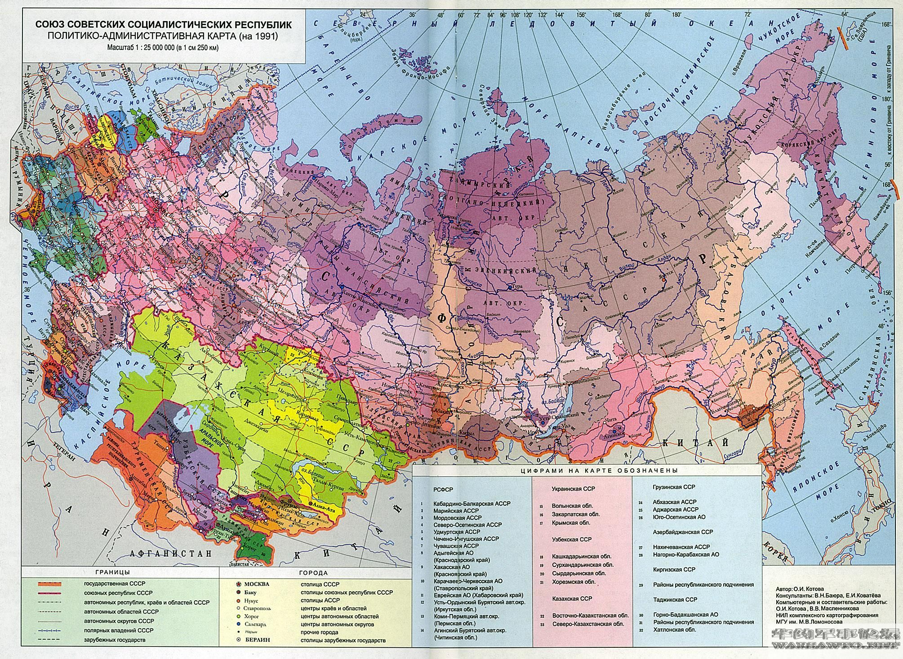

# 苏联

## 时间线

- 1917.11.7（俄历10.25）十月革命
- 1918.1.28 红军建立
- 1918至1920 苏俄内战
- 1922.4 斯大林上台
- 1922.12.30 苏联成立
- 1928至1932 首个五年计划
- 1930.1.5至1934 农业集体化
- 1932至1933 乌克兰大饥荒
- 1934至1938 大清洗运动
- 1939.8.23 《苏德互不侵犯条约》
- 1941.6.22 纳粹德国突袭苏联
- 1942.6.28至1943.2.2 斯大林格勒战役
- 1945.5.9 德国投降
- 1945.8.8 苏联对日宣战
- 1945.9.2 日本投降
- 1949.8.29 苏联成功试爆原子弹
- 1953.2 斯大林逝世
- 1953.9.3 赫鲁晓夫当选第一书记

## 1917.11.7（俄历10.25）十月革命

列宁和托洛茨基领导的布尔什维克武装力量向资产阶级临时政府所在地圣彼得堡冬宫发起总攻，推翻了临时政府，建立了苏维埃政权。建立人类历史上第二个无产阶级政权(第一个是巴黎公社无产阶级政权)和由马克思主义政党领导的第一个社会主义国家──俄罗斯苏维埃联邦社会主义共和国，简称苏俄。

## 1918.1.28 红军建立

根据列宁的建议，1918年1月28日苏维埃人民委员会通过关于建立工农红军的法令。红军最高领导机关是列宁领导的人民委员会，直接指挥机关是军事人民委员部。起初，红军以赤卫队为骨干，按照自愿的原则，动员劳动者阶级中最有觉悟最有组织性的先进分子参加红军。2月23日，苏俄劳动人民为抗击德国军队入侵，踊跃参加红军，经英勇战斗，阻止了德军的进攻。这一天后来被定为红军的建军节。

## 1918至1920 苏俄内战

1917年11月7日(俄历10月25日)十月革命取得了伟大胜利，建立了世界上第一个社会主义国家政权--苏维埃俄国，其与国内反革命势力白俄和外国武装干涉者进行的战争在苏联被称为"1917年到1922年的内战和武装干涉"。

## 1922.4 斯大林上台

1922年4月，在党的第11次代表大会新选出的中央委员会第一次会议上当选为联共（布）中央总书记。在1922年12月第一次全苏苏维埃代表大会上，斯大林作了关于成立苏维埃社会主义共和国联盟（ссср）的报告。他提出了“在一个国家首先建立社会主义”的主张。

## 1922.12.30 苏联成立

1922年12月30日晚，苏维埃社会主义共和国联盟首次苏维埃代表大会在莫斯科召开。斯大林在会上作关于成立苏联的报告。列宁因病未出席大会，被推为大会的名誉主席。大会通过了苏联成立宣言。当时加入苏联的有俄罗斯、南高加索、乌克兰和白俄罗斯4个加盟共和国。大会通过的联盟条约规定，联盟苏维埃代表大会为国家最高权力机关，联盟人民委员会为执行机关。条约还特别规定，每个加盟共和国都保留有自由退出联盟的权利。

## 1921.5至1928 新经济政策

新经济政策的一项重要内容是以征收粮食税代替余粮收集制。农民按国家规定交纳一定的粮食税，超过税额的余粮完全归个人所有，大大减轻了农民的负担。并且允许外资企业管理国家暂时无力经营的企业，恢复商品货币关系进行调节生产的作用。这使小农经济占优势的苏俄找到了向社会主义经济阶段过渡的道路。后来因斯大林上台而被逐步取消。

## 1928至1932 首个五年计划

苏联第一个五年计划是指在1928年至1932年，苏联共产党和政府为摆脱苏联落后的农业国面貌而实行的大规模有计划的全面的社会主义建设。这是人类历史上第一次按照预先编制的详细计划建设的开端，同时也是人类大规模社会主义现代化建设事业的开端。第一个五年计划的完成，使苏联开始由农业国变成工业国，苏联初步建起了独立的比较完整的国民经济体系，为实现社会主义工业化奠定了物质基础。

## 1930.1.5至1934 农业集体化

1929-1933年前苏联大规模开展了将个体小农私有经济转变为社会主义大集体经济的运动。为适应社会主义工业化发展的要求，1928年11月，联共(布)中央全会决定加快农业集体化步伐。到1937年，超过百分之九十的农户参加了集体农庄。农业集体化消灭了富农阶级，为农业机械化、现代化开辟了道路，但其中出现的强迫命令现象，也造成了不良影响和后果。

## 1932至1933 乌克兰大饥荒

据估计，大约有315万至718万乌克兰人死于这一事件。当代学者大多认为乌克兰大饥荒是在斯大林农业集体化运动的背景下出现的灾难，造成饥荒的原因有自然因素，但更主要的是人为因素。在乌克兰，这次饥荒有时被认为是故意制造的、针对乌克兰民族的行动，因此当地也称为"饥荒种族清洗"。历史学家认为苏联政府在这次大饥荒中起了推波助澜的作用，致使大饥荒的后果更加惨重。

## 1934至1938 大清洗运动

苏联肃反运动，又称大清洗。是指1934年在苏联领导人斯大林执政下，爆发的一场政治镇压和迫害运动，1937至1938年被称为苏联"大恐怖"时期，在此期间，130万人被判刑，其中68.2万人遭枪杀 。这段时期典型的现象包括无处不在的政治审查、到处都存在的怀疑"间谍破坏"、做秀公审(沙赫特案件、工业党审判、莫斯科大审判等)、关押和死刑，使斯大林的个人崇拜达到了前所未有的状态，同时也使苏联的党、政、军、科学文化界失去了一大批优秀骨干，使社会主义失去了一次自我完善的机会。

## 1939.8.23 《苏德互不侵犯条约》

1939年8月23日苏联与纳粹德国在莫斯科签订的一份秘密协议。苏方代表为莫洛托夫，德方代表为里宾特洛甫。该条约划分了苏德双方在东欧地区的势力范围。 这个条约造成日后苏德对波兰的侵略，苏联为了应对来自西线的可能的战争威胁、争取备战的时间，于1939年9月至1940年8月间，以保卫"西部边界安全"为目的，在东欧建立的战争防备缓冲带。

## 1939.5.11至1939.8.27 诺门罕战役

诺门罕位于中国内蒙古呼伦贝尔市西南部的新巴尔虎左旗。西面为哈拉哈河及外蒙古，东面为阿尔山市。1939年苏联红军与日本关东军在该处开战，结果苏联以立体机动战战胜日军，日军两个师团被歼灭，史称诺门罕战役。此战役让日本不得不重新评估苏联实力，放弃“北进”计划，最后引发珍珠港事件。

## 1939.11.30至1940.3.13 冬季战争

1939年11月26日，苏联制造了“曼尼拉炮击事件”，以此为借口对芬宣战，在两国边境发动全线进攻。苏联投入大规模的军队进攻芬兰，并在兵力、飞机、坦克上占有压倒性优势，然而战前其军事领导人因斯大林于1937年开始的一连串的政治整肃而被处死或入狱，以致冬季战争爆发时，苏军仅剩下经验不足的高级将领和中级军官，再加上芬军训练精良、熟悉地形，导致苏军在冬季战争初期战技拙劣、损失惨重，芬兰则展现了远超过苏联预计的抵抗能力。然而苏联于后期撤换指挥成员、改善作战方式以及结合强大的物资优势，终于突破了芬军主防线，芬兰因而求和。1940年3月双方签订《莫斯科和平协定》，芬兰割让出其11％的领土和30％资产予苏联，结束了战争。

## 1941.6.22 纳粹德国突袭苏联

1941年6月22日，希特勒撕毁苏德互不侵犯条约，以事先拟订好的一份代号叫“巴巴罗萨”的计划，出动190个师，3700辆坦克，4900架飞机，47000门大炮和190艘战舰。军分三路以闪电战的方式突袭苏联。1941年7月3日，斯大林向苏联人民发表广播演说，号召全体苏联人民团结起来，全力以赴同希特勒法西斯做殊死的斗争，苏德战争全面爆发。

## 1942.6.28至1943.2.2 斯大林格勒战役

斯大林格勒战役是第二次世界大战中纳粹德国对争夺苏联南部城市斯大林格勒而进行的战役，时间自1942年6月28日至1943年2月2日为止。斯大林格勒战役是第二次世界大战东部战线的转折点，单从伤亡数字来看，该战役也是近代历史上最为血腥的战役，双方伤亡估计约2000000人，参与该场战役的人数也比历史上的其他战役都来的多，更以双方无视军事与平民分别而造成的伤亡著称。

## 1944.10 苏联吞并外蒙唐努乌梁海

1944年8月17日，"图瓦人民共和国"小呼拉尔非常大会通过一项宣言，请求前苏联接纳唐努乌梁海，同年10月11日，苏联最高苏维埃决定接受其"请求"。10月13日，"图瓦人民共和国"正式改名为"图瓦苏维埃社会主义自治共和国"，隶属于俄罗斯苏维埃联邦社会主义共和国。至此，唐努乌梁海正式成为前苏联领土，但苏联官方对于此事未予报道。

## 1945.5.2 苏军攻占柏林

1945年4月16日，苏联红军从奥得河﹑尼斯河同时向柏林发动进攻，激战16个昼夜，至5月2日下午3时，德军停止抵抗，柏林战役结束。苏联红军歼灭和俘虏德军40多万人。盘踞在捷克斯洛伐克的德国两个集团军群（55个师）也于5月中旬投降。苏联红旗插上了柏林国会大厦的顶峰，标志着战争的结束。

## 1945.5.9 德国投降

1945年5月8日24时，德国无条件投降仪式在柏林正式举行。参加仪式的苏方代表是朱可夫元帅和外交部副部长维辛斯基。仪式由朱可夫主持。代表德国在投降书上签字的是：陆军元帅凯特尔﹑海军上将弗雷德堡﹑空军上将施通普夫。德国投降书于1945年5月9日零时生效。欧洲战争到此结束。

## 1945.8.8 苏联对日宣战

欧洲战争结束以后，苏联调集大军到苏中边境地区。6月30日， 《苏中友好同盟条约》中规定苏联尊重中国对东北的主权， 宣布大连为自由港等，这就为苏联对日作战创造了条件。7月26日，中、美、英促令日本投降的波茨坦公告公布后，日本天皇于次日主持最高作战会议，但没有作出一致的决议。铃木首相在7月30日宣称，要把大东亚战争进行到底。 苏联便参加了对日战争。1945年8月8日晚， 苏联根据雅尔塔会议精神，忠于同盟国义务，宣布从次日起与日本进入战争状态。

## 1945.8.14《中苏友好同盟条约》

《中苏友好同盟条约》是1945年8月14日中华民国政府与苏联政府就对日作战后期及战争结束后解决双方争议问题的一个丧权辱国的条约。主要内容是:两国在对日战争中，"彼此互给一切必要之军事及其它援助与支持"、"不与日本单独谈判"或"缔结停战协定或和约"、战后"共同密切友好合作"、"彼此给予一切可能之经济援助"、"不缔结反对对方的任何同盟"、"不参加反对对方的任何集团"。同时，苏联政府声明，一切援助给予国民政府，并重申尊重中国在东三省之完全主权及领土的完整。

## 1945.9.2 日本投降

1945年8月15日正午，日本天皇向全日本广播，接受波茨坦公告、实行无条件投降，结束战争。

## 1949.8.29 苏联成功试爆原子弹

1949年8月29日早上七点，在塞米巴拉金斯克试验场成功试爆了苏联第一颗核武器——RDS-1原子弹，成为世界上第二个拥有核武器技术的国家。

## 1953.2 斯大林逝世

1953年3月5日晚间，苏联部长会议主席、苏联共产党中央委员会书记、苏联大元帅斯大林突患脑溢血，在莫斯科郊外昆采沃的别墅中去世，享年74岁。他的遗体被装入水晶棺，安放在列宁墓中。不过，斯大林的遗体只防腐保存了8年。

## 1953.6.17 东德六一七事件

东德六一七事件，是发生于1953年6月17日的一场德意志民主共和国的工人运动。原本是6月16日东柏林300名建筑工人因抗议国营公司领导提高工作定额而不加薪的一次小规模的经济罢工，但是当天工人的要求被拒绝的消息被位于西柏林的美战区电台广播之后，于此日发展成为一场遍及东德各大城镇的人民群众示威游行，提出了撤走一切外国军队，实行言论和新闻自由，释放政治犯，举行全德自由选举等政治口号。开始是东德人民警察维持治安，后来驻德苏军出动坦克上街，驱散示威群众，导致55人死亡。为了纪念六一七事件，西柏林通往勃兰登堡门的大街被命名为“六月十七大街”。

## 1953.9.3 赫鲁晓夫当选第一书记

1953年9月3日赫鲁晓夫当选为苏联共产党中央委员会第一书记。1958年兼任苏联部长会议主席。担任苏联最高领导人期间，他于1956年主持召开苏共二十大，从根本上否定斯大林，此后实施去斯大林化政策，为大清洗中的受害者平反，苏联的各领域均为活化，尤其是文艺获得解冻。同时，赫鲁晓夫积极推行农业改革，使苏联的民生经济得到改善。

