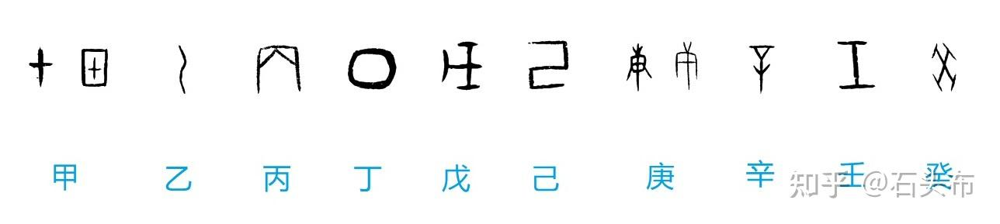
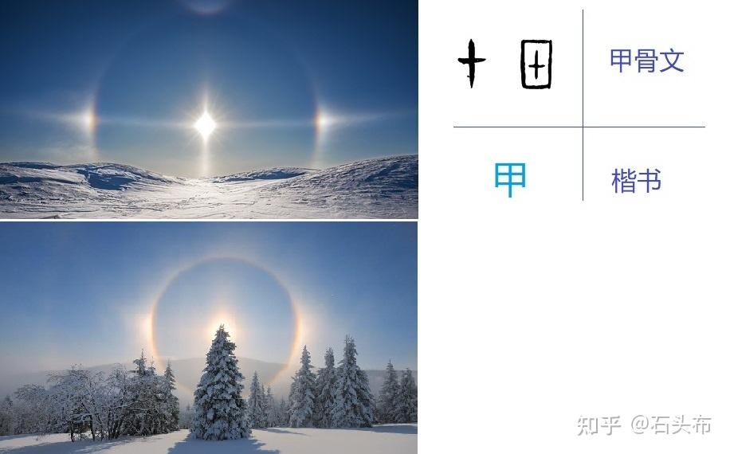
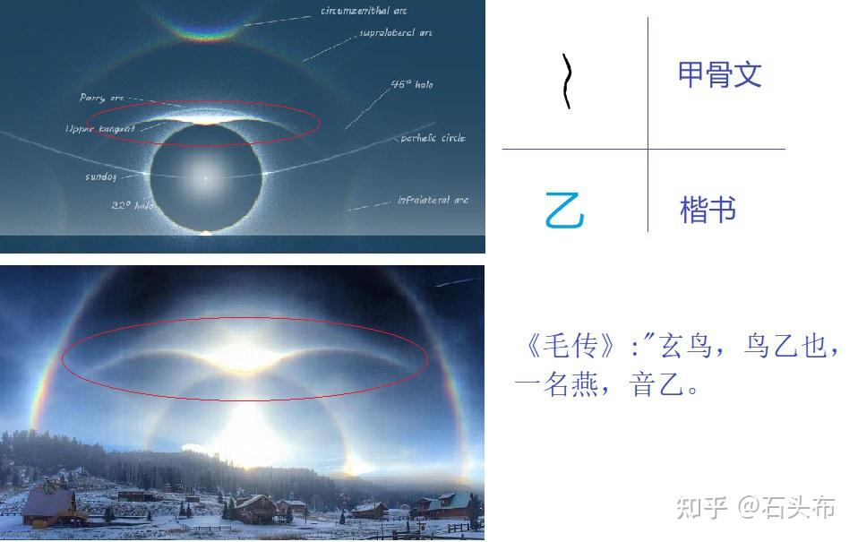
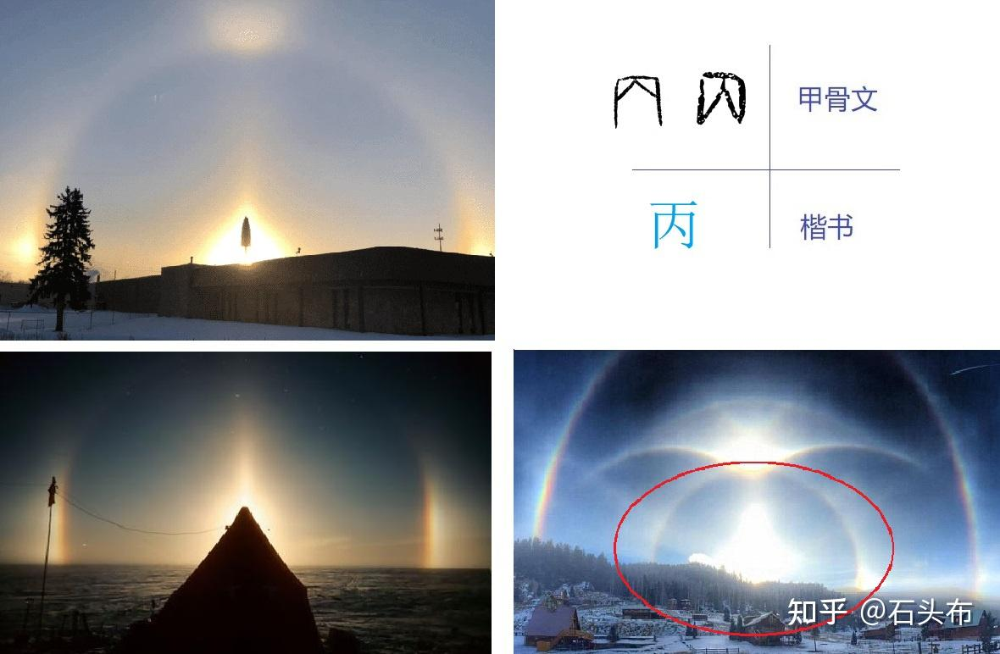
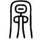
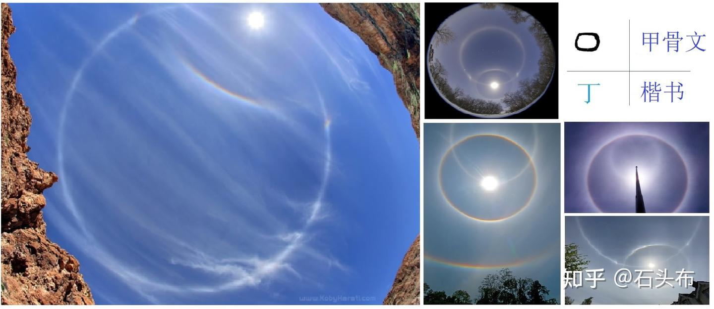
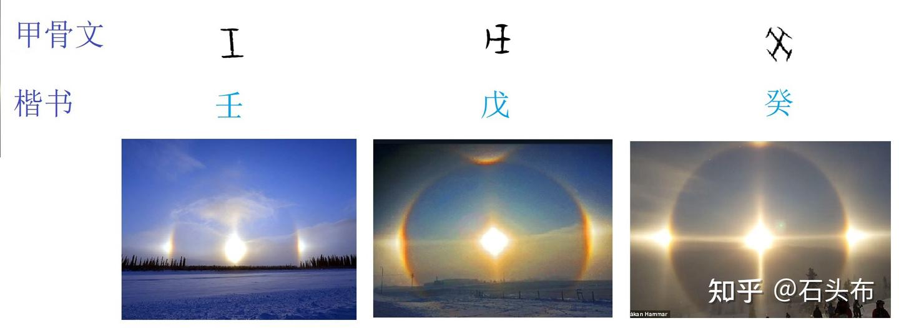
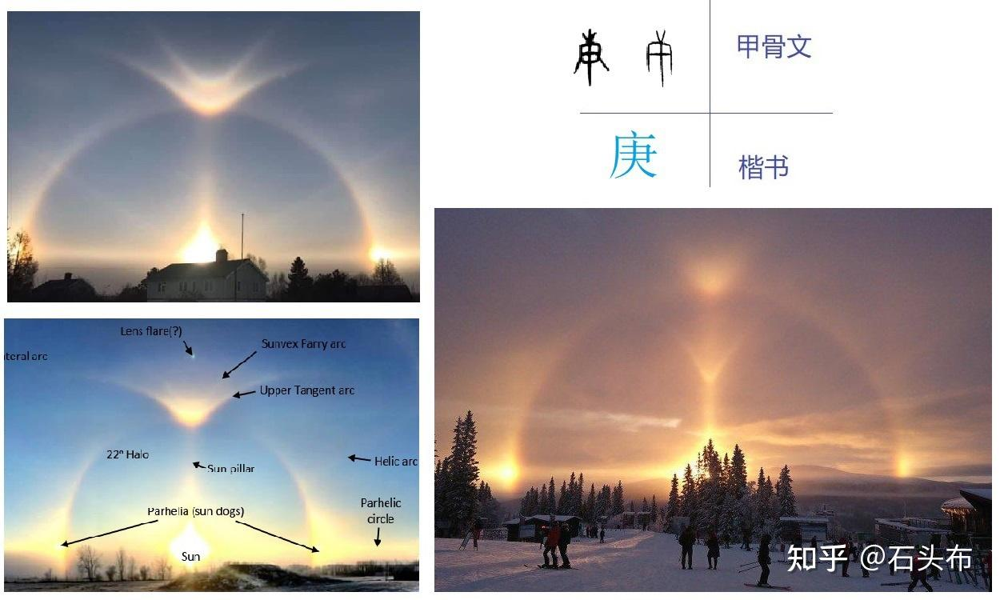
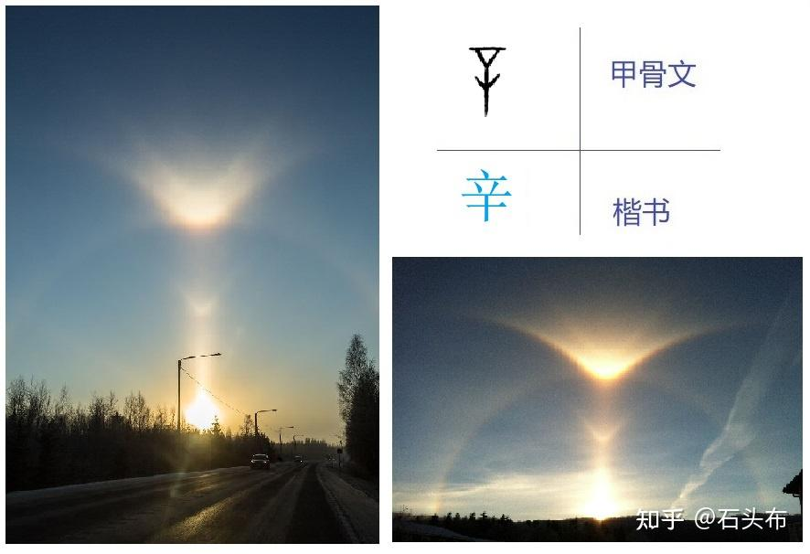
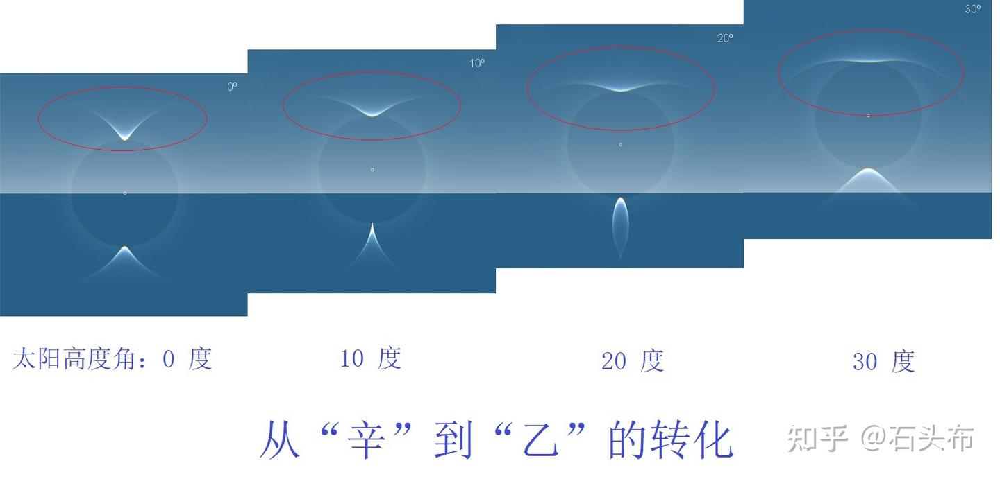

# 天干

天干源于太阳的运动

## 解释一

[解析十天干和十二地支的来源](https://zhuanlan.zhihu.com/p/609498920)

跟天干相关的最早记述，来自《山海经·大荒南经》：“东南海之外，甘水之间，有羲和之国。有女子名曰羲和，方日浴于甘渊。羲和者，帝俊之妻，生十日。”

在古代很长的时间内，羲和这个人物被认为是‘日月之神’。（中国首颗太阳探测科学技术试验卫星“羲和号”，也是取义于此）

而在这之后，还有后羿射日的神话（天上十个太阳，后羿射掉九个，剩下一个）。

神话是不能当做确切的考证资料的，但鉴于上古时期有很多历史的蛛丝马迹被糅合进了神话里，所以我们寻找天干的来源，找到这里是很有必要的。

因为十个太阳的名字，正是日后的十天干称呼。

比如，后世的人们从甲骨文中发现，商代实行一种独特的计算日期的方式——“十日制”，十天一个循环，称作一“旬”。

这种方式每天以“甲乙丙丁戊己庚辛壬癸”十个太阳的名字中的一个来命名，于是“十天干”就成了计算日期的符号系统。

商代人认为，他们的王也是神，与天上的十个太阳有对应关系。

他们用“天干”来给先王做庙号，这就是所谓商王的“日名”。它相当于后世的 “谥号”，比如“上甲”、“天乙”(成汤)，“武丁”、“盘庚”、“受辛”（纣）等等。

而在“商代”之前，“夏代”的王名，有一部分也是这个特征。

学者们还发现，商人先王的祭祀都安排在与他的“日名”相同的那一天。人们将死去的王看做太阳，是十个太阳中的一个。

因此，要在那个太阳出来“值班”的那一天，来为他举办祭祀。

十个太阳，表示十个天干，而且成为计时系统的形象记述，更是出现在其后的《诗经》中。

《诗经·尔雅·释天》中写道：“太岁在甲曰阏逢，在乙曰旃蒙，在丙曰柔兆，在丁曰强圉，在戊曰著雍，在己曰屠维，在庚曰上章，在辛曰重光，在壬曰玄黓，在癸曰昭阳。”

“阏逢，旃蒙，柔兆，强圉，著雍，屠维，上章，重光，玄黓，昭阳”就是十个太阳的名字，也是最原始的天干称呼。

从上面的历史演化，我们可以得知，至少从夏代开始，到商代，已经完成了十个太阳（十天干）名称的简化，分别为“甲乙丙丁戊己庚辛壬癸”。

从神话的线索，再到夏代和商代，还有周代的有限史料，我们可以推理出一个更符合现实的十天干来源，即，十天干应该是上古先祖观察太阳的运行周期，而总结的计时系统，也就是“太阳历”（为了农业生产，及生活应用）。

现在的主流学术认为，最早的太阳历，是古埃及于6000多年前（然而据我个人的经验，西方人口中的历史通常没有什么确凿的证据，我一般都当做胡说八道）发明的，即便把这个当成是真实的，我以为还是没有我们的太阳历早。

为什么这么说？

这里就不得不提到我国一支少数民族的“太阳历”，即彝族的“太阳历”。

这个历法正是“十月太阳历”。

据考证，彝族的向天坟（一种墓葬形式），其实就是古人用以观天象的天文台，而此太阳历，应该就是“十杆测影法”，即利用传统的圭表和地平日晷系统，直观、形象地表现出太阳的周日和周年视运动。

这种方法，能够利用其中地平日晷晷针日影的投向和影端位置，得出当日所处的节令和当天地方的真太阳时。

彝族十月太阳历，是将一年分为10个月。每月以鼠日为一个月起头，12属相循环3次，在猪日终结为月末，每月36天，一年360天，剩下五或六天为过年日，不计算在10个月之内。

此外，每到第四年时的“过年日”闰作6天，用这样的历法，通常一年是365日，逢闰年是366天，4年平均为365.25天，与回归年（太阳年）365.2422日相近。

更关键的是，现在越来越多的研究成果证明，彝族正是上古伏羲部落的后代，彝族的天文历法也是对伏羲八卦的继承和发展（这样，十月太阳历即可追溯到至少7000到8000年前，伏羲、神农氏的时代，我们的农业初始文明也是从那时候开始的）。

注：上篇文章也分享过，安徽凌家滩的河图玉器遗址，在距今5800年—5300年间。河南濮阳青龙、白虎贝壳图案的遗址，在距今约6500多年前。河图和洛书是古人观测星象的结果，而古人观测更直观的太阳运行规律，只会比其他星象更早，这符号正常的逻辑（十干为10，也是河图总结的万物生存之数）。

结合上面我们提到的《山海经》的上古神话，我们几乎可以断定，十个太阳就是古人观测到的十个不同时间段的太阳（因为不同季节的太阳，给人的能量是完全不同的，所以远古的人们认为是十个不同的太阳，这种认知很正常）。

后羿射九日的神话，就是人们对太阳认知过程的抽象化（当认识到太阳的运行规律后，便逐渐明白，原来一年不同日子的太阳都是同一个）。

于是，起初十个太阳的名字，才合理地成为了一个太阳的十个时间运行次序，即最终的“甲乙丙丁戊己庚辛壬癸”。

这是我认为目前十天干最合理的来源（虽然也是一家之言）。

## 解释二

[“十天干”的起源（上） — 为什么“夏”是夏天，也是“中国之人”？(9)](https://zhuanlan.zhihu.com/p/346663097)

中国的上古先民相信天上有十个太阳，每天不同的太阳出来值班，十天轮换一遍。《山海经》、《楚辞》、《庄子》、《淮南子》等文献对“十日”神话都有所记载，比如:

    汤谷上有扶桑，十日所浴，在黑齿北。居水中，有大木，九日居下枝，一日居上枝。—— 《山海经-海外东经》
    羲和者，帝俊之妻，生十日。 ——《山海经-大荒南经》
    魂兮归来！东方不可以托些？长人千仞，惟魂是索些？十日代出，流金铄石些。 ——《楚辞-招魂》

马王堆出土的帛画上还栩栩如生地描绘了十个太阳由鸱鸮背负着在天空和地下黑水之间循环往复的场景。

这个信仰今天看起来稍有点奇怪，每天的太阳在我们看来都是一模一样的，怎么会区分出十个不同的呢？

然而，就像大家已经预料到的：在纬度较高的寒冷气候下，这种神话的产生却有其自然物理的基础。

我们知道，降温会让空气里面水蒸气的饱和阈值降低，从而让水蒸气析出，在大气中形成大量悬浮的微小冰晶，这就是寒冷环境下的所谓“钻石尘”（diamond dust）天气。密集悬浮冰晶对阳光的反射，会在天空中形成多姿多彩的独特光现象，这就是日晕（Sun halo）、日柱（Sun pillar）和幻日（Sundog）等等现象以及它们的不同组合。不同形状的冰晶以及不同的太阳高度，会让这些伴随着太阳出现的光现象呈现不同的形态。

中国古人曾经给从不同方向的吹来的风都起了的独特名字（即所谓“八风”），给各种毛色的马各自造了专用的字。那么在更加古老的年代，他们会不会把不同形态的太阳光现象的组合归纳为十种，认为它们是十个轮流出现的不同的太阳，并且给它们每个单独起名字呢？这当然是完全可能的。

从甲骨文中人们发现商代实行一种独特的计算日期的方式 —— “十日制”，十天一个循环，称作一“旬”。每天以“甲乙丙丁戊己庚辛壬癸”十个符号中的一个来命名，这些符号就是所谓“十天干”。

商先公和商王的名号（多认为是死后的祭名）中也包含“天干”，这就是所谓商王的“日名”。比如“上甲”、“天乙”(成汤)，“武丁”、“盘庚”、“受辛”（纣）等等。“夏代”的王名有一部分也有这个特征。学者们发现，对商先王的祭祀都安排在与他的“日名”相同的那一天。

“日名”究竟是“那一天的名字”，还是“太阳的名字”呢？起初人们多认为仅是前者，但有学者（比如王晖[1]） 指出它同时也是后者。河北出土的商三句兵铭文是一个有力的旁证，这三件礼戈上铭刻了铸器者祖、父、兄的名号，其中有“祖日丁、祖日乙、祖日庚、祖日己、大父日癸、中父日癸、父日癸、父日辛、父日乙、兄日戊、兄日壬、兄日癸、兄日丙”等等字样。在祖、父、兄的祭名中直接包含了“日”字，说明人们将死去的王看做太阳，而且是十个太阳中的一个。故此，要在那个太阳出来“值班”的那一天来为他举办祭祀。

“十天干”作为古老的“日名”，与“十二地支”一起，构成后世中国独特的计数和计时系统。“甲乙丙丁”这套计数符号每个中国人都耳熟能详，但它们最初是什么意思，为什么被选择做了“天干”呢？这个问题自古以来就是一个谜。我们知道《水浒传》的好汉有三十六天罡，七十二地煞。假如只有三十六天罡的名号传下来了，他们的英雄故事却没人知道，不能不说是个遗憾。

关于“十天干”的起源，人们提出的假说不计其数，但都没能得到广泛的认同，此处我们就不赘述了。为追寻这个起源，我们应该秉持一个合理的标准，那就是：

与甲骨字形有较好的对应，不能大而化之，虚而言之。
与天和太阳有关，让“天干”和“日名”之称不虚置。
形象崇高美好，配得上做王的祭名。
是一个相互紧密联系的系统。
以这个标准来衡量的话，不得不说，在我们熟悉的历史时代的时空里面无处索解。

但就像我们曾多次提到过的，古文化里面有些谜题之所以难解，是因为我们对中国先民的源起之处的定位错误造成的。若我们循着“华夏北来说”的线索，在高纬度地区环境中去追寻中国先民的精神文化的源头，则这个谜底之易得，不是“俯拾可得”可以形容，而是抬头可见，昭如天日。

所谓“十天干”，就是冰晶反射造成的日柱和日晕弧线所形成的十种阑干纵横之态。“甲乙丙丁戊己庚辛壬癸”是古人给它们起的名字，其甲骨字形都对应这些太阳光现象的形态。让我们来一一检视这些对应是否合理。

1. 甲

上图中下面的日晕是这类现象中最为常见的，它是22度日晕。“十”字在世界各地的古文明中被广泛用作代表太阳的符号，是其光芒四射的象形。“甲”的甲骨文中的十字，也是这个寓意。所以“甲”不见得一定要有日柱和Parhelic弧（图中的水平方向弧线）。为这个常用字刻写的方便，甲骨文以直线方框代替了圆圈。

2. 乙

在某些特定气象条件下，日晕中的Upper tangent曲线特别明亮，超过了其他部位，如上图中红圈所示，古人称它为“乙”。它的形态像极了一只飞翔的鸟。巧的是，古人也把燕子称作“乙”。《诗经-邶风》:“燕燕于飞，差池其羽 ”，《毛传》:“燕燕，鸟乙（鳦）也"。相传商族的祖先是燕子遗卵所生，《诗经》郑玄注：“有女简狄，吞鳦卵而生契”。 《诗经》：天命玄鸟，降而生商。 《毛传》:“玄鸟，鳦也，一名燕，音乙。”

这个像鸟的Upper tangent弧，与“辛”所对应的三角形日晕处在同一部位，且随着太阳高度角的不同，可以相互转化。相传商族的祖先是高辛氏，从日晕的视角看，高辛和乙鸟是相通的概念。

[“十天干”的起源（下） — 为什么“夏”是夏天，也是“中国之人”？(10)](https://zhuanlan.zhihu.com/p/347226836)

3. 丙

“丙”是日晕和较短的日柱的组合。这时太阳的位置较低，日柱与太阳几乎合体，日柱顶端向上冒出，形成一个尖锥形状的发光体。它与外围的22度日晕一起，构成甲骨文“丙”字所描绘的日象。

这个低位太阳的景象，与“冥”的意象有相通之处。“冥”与“丙”不仅字音相似，如果把偏旁“日”去除，“冥”与“丙”的字形也几乎一样。

“冥”未见于甲骨文（或未识别出来），它的最早字形我们只能追溯到《说文解字》里面的篆书，是这个样子：

它为何写成这个样子呢？许慎说：

“冥，幽也。从日，从六，冖声。日数十，十六日而月始亏，幽也”。
他认为其下部结构是“六”，加上“日数十”，就是十六。圆月从十六日开始渐亏，所以字义是“幽”。这个解读甚是迂曲，可靠性不高。但又应了张光直先生那句话:“后来学者，想不出更好的解释，只得从之”。

从我们的角度看，“冥”当然描述的是太阳将沉落或将升起之前的幽暗景象，与“丙”一样，其下部结构也来自于对低位太阳和日柱组成的尖锥状发光体的象形。两字的上部结构都来自于外围的22度日晕，它们是同源的。但“冥”字添加了“日”字做义符，显然是后起的字。进一步的推论是，甲骨文中未见到“冥”字，可能是当时与“丙”尚未分化，或者我们将它与“丙”混淆了。

商人的先公“季”（王亥的父亲），也被称作“冥”。如此一来，我们就知道可能他的日名是“丙”。

汉语里有个独特的现象：“冥”与“明”的读音很接近，现代的普通话里更是完全同音，不能不说有点奇怪，幸亏写法不同。据说这在保留了古汉语读音但改用拼音文字的越南语中造成人们诸多的迷惑。这个矛盾也只能在上述的日象中得到解释，两个概念在这里完全可以统一。

毫不意外，“丙”也有光明的含义。郑玄注《礼记-月令》：“丙之言炳也”。 “炳”即光明、显著。但这个形声字显然后起，它的更早形态未知，我们认为其本字就是“丙”。春秋时代金文已有“丙”字下部写成“火”的字例（见于□侯簋，□字写为“左：上竹下膚，右：阝”）。从汉代起我们看到古人把“五行”观念和“十天干”糅合在一起，认为“甲、乙属木”、“丙、丁”属火等等。但这与“丙”的光明之义没有太多联系，如果有的话，是其果，而不是其因。

另外，“商”的甲骨字形，就是“辛”和“丙”的合体。所以“帝”、“高辛”、“玄鸟”、“商”、“冥”、“北曙光”、“天鼋”这些概念，在这里我们可以看到它们以太阳崇拜为纽带相互联系的枢纽。

4. 丁

“丁”代表的日晕是parhelic 圆（parhelic circle）。上图中左图是它单独出现的景象（它中间的短弧是22度日晕的残迹）。右面的几个小图是parhelic 圆和22度日晕同时出现的景象。22度日晕就是我们前面定义的“甲”。两者的区别是，太阳在22度日晕的圆心上，但对parhelic 圆来讲，太阳在圆周线上。

当太阳位置较低时，parhelic圆环绕地平线一周，范围非常广大且较为暗淡，不容易为人察觉。随着太阳升高，parhelic圆逐渐缩小，集中在头顶天空的中央部位，变得更清晰，上图中的左图就是垂直仰角镜头拍摄的。

我们在关于“中”的解读中提到过，“丁”是“顶”的初文，其原义是以半地穴式住宅的天窗的象形来喻示“头顶上方”之义（它的字形为何由甲骨文的类似“口”的形状变成楷书的“丁”，前文介绍过，此处不赘述）。古人以“天窗”的象形——“丁”来称呼parhelic 圆这种天象，是一种典型的以比喻来命名的方式。

5， 6， 7. 戊、壬、癸

戊、壬、癸这三个是同类，原型都是幻日（sundog）的景象，区别是幻日的数量不同。

“壬”对应两个幻日的情况，“戊”是三个，“癸”是四个。加上太阳本身，它们就是偶尔作为天象奇观见于报道的“三日同辉”、“四日同辉”、“五日同辉”的景象。

它们与“甲”的区别在于，“甲”代表22度日晕和太阳本身，并不需要包括幻日。而“戊、壬、癸”的景象强调幻日，尽管22度日晕往往也同时存在。它们直线封头的短划都是对幻日的指事。

“戊、壬”的字形被旋转了90度，因为竖划更容易刻写，在汉字里较长的直线一般被安排为竖划。

（对“癸”，在石头布几个小时的网上搜索中没能找到特别贴切的图片，上图中的仅供示意。但四个幻日同时出现的场景一定存在，尽管相当罕见。）

8. 庚

“庚”对应的是22度日晕、日柱和Upper tangent 弧同时出现的景象，它并不强调幻日。如果太阳的位置较低，它实际上与“商”一样也是“辛”与“丙”的合体。如果太阳的角度再稍抬高一些，就是“辛”与“甲”的合体。上图中显示的都是第一种情况。

9. 辛

“辛”对应的是低位太阳的Upper tangent 弧和日柱的组合，它与“庚”的区别在于此时22度日晕非常暗淡甚至不可见。

典型的“辛”出现于太阳位置较低的时候。随着太阳的升起，它的上部由类似 V 字的形态逐渐变得伸展和平缓，转变成类似展翅飞鸟的形态，也就是我们前文介绍过的“乙”。

上图是Atmospheric Optics 网站（https://www.atoptics.co.uk/halo/colsolat.htm）制作的不同太阳高度角下Upper tangent 弧演变过程的图示。

在历史传说中，王使用“日名”的商族的祖先是高辛氏（而高辛氏又是高阳氏的后代）。《诗经-商颂》：“天命玄鸟，降而生商”。汉代人毛亨对它的注解说：“玄鸟，鳦也，一名燕，音乙。” 《吕氏春秋》记载商族祖先契的诞生过程是“帝令燕往视之 。。。， 燕遗二卵，北飞，遂不返。”

这个飞翔的“乙”不仅像燕，更像雁，就是鸿的形象。巧的是，黄帝还有一个称号叫“帝鸿氏”。

各种传说和神话的片段，当我们溯源至先民生息坐卧的时空，它们相互联系的脉络就浮现出来了。

10. 己

“己”对应没有日晕和日柱的太阳，它取义“自己”。

读者一定会问，已经有“日”字了，为何要另称它为“己”呢？在上古先民给日晕、日柱和幻日的各种阑干纵横的组合天象命名的时候，是不应包括“己”的，对太阳直接称“日”。这些“天干”也不全是太阳的名字，有的只是天象的名字，几种天象可以同时出现。它们也没有固定的顺序。甚至数量也不见得是十个或者九个。

但到了用“十日制”来计时的商代，一定已经发生了对神话的系统化整理。十个“天干”符号既代表日期，也成了十种太阳的名字和商王的名字，那它们显然应该把没有日晕的太阳包括进来。但不能在“日甲，日乙，日丙，日丁，日戊”之后，继之以“日日”，需要另找一个符号，所以这一天被称为“日己”，取义“太阳自己”。

“十天干”的原型，到这里就介绍完了。但笔者觉得，关于它们的文章还远远没有写完。这是一个大题目，我们才起了个头而已。虽然错误和遗漏在所难免，但只要我们迈出了重要的第一步，后续的补充、修正和发展，就可以预期。