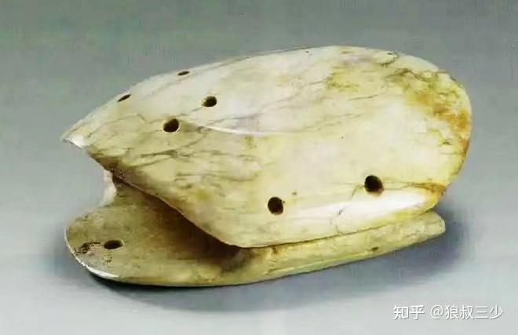
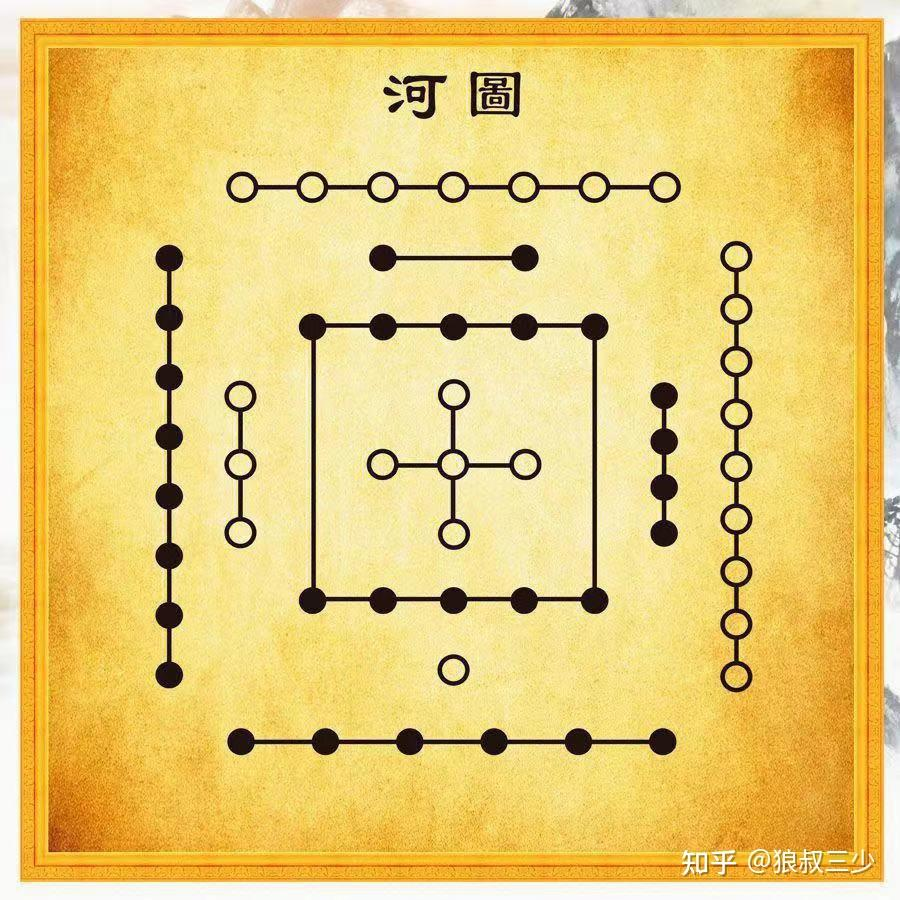
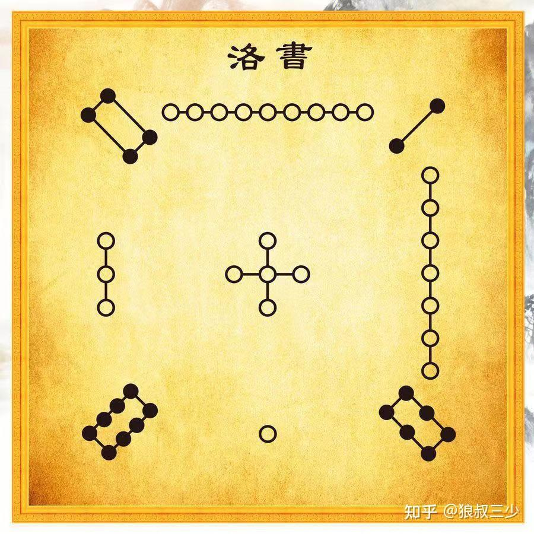

# 河图洛书

河图为银河之图

[易经：河图和洛书的奥秘](https://zhuanlan.zhihu.com/p/608057282)

关于河图洛书的记载，最早出现在《尚书》中，其次是在《易传》中，另外在诸子百家的众多著作中也都有记述。

《易．系辞上》有言：“河出图﹐洛出书﹐圣人则之。”

那么，河图和洛书到底有没有史料？

答案是，有。

1985年，安徽省含山县凌家滩村，一位村民在给去世的母亲挖墓地的时候，在村子一处土岗上陆续挖出一批玉器和石器，自此这座5000多年前新石器晚期的重要遗址被发现。

1987年开始，考古队前后对遗址进行了多次发掘，其中，考古专家发现了多件奇形怪状的玉器，比如编号为87m4的大墓中，就有一件玉龟，这件玉器完全模仿了龟的形体，由背甲、腹甲组成。

令人奇怪的是，这个龟的背甲与腹甲上均有钻孔，而且这些钻孔似乎存在着某种意义上的规律。

此外，在两块龟甲间，还夹着一块形状特别的长方形玉板，玉板的中心有八角星纹，向外有一大一小的同心圆，同心圆之间有八个玉龟形的图案，并以直线划分成八等分，分别指向东南西北以及东北、东南、西北、西南等八个方向。

考古人员经过一番研究，最终认定，这玉板上刻的图案，应该就是四象八卦最原始的版本，但让人疑惑的是，玉板的边缘同样也存在着密密麻麻的钻孔，其数量与分布，似乎也存在着某种规律，后来经过多方的对照，考古人员终于发现，这些钻孔，正是宋朝道士陈抟所记载的河图洛书。

另外，同样是在1987年，河南濮阳西水坡形意墓中，也被发现了距今6500多年前，用贝壳绘制出的青龙、白虎等图像，完美的诠释了河图中的四象以及二十八宿。

这些确凿无疑的文物，证明河图洛书是事实存在的。那么，另外的问题是，河图洛书有什么作用呢？为什么它被称作易经文化的源头？

我们先来看看河图的结构，

河图之象

关于河图确切的说法，河图这个河并非指代的是固有认知中的黄河，而是古人观察日月星辰的天象，也就是我们现在称之为的银河。

所谓的河出图，其本意也是古人从星河的运转中，观察出来的客观规律，从而绘制出来的象形图案，具体如下：

北方，一个白点在内，六个黑点在外，代表玄武星象，五行为水；

东方：三个白点在内，八个黑点在外，表示青龙星象，五行为木；

南方，两个黑点在内，七个白点在外，代表朱雀星象，五行为火；

西方：四个黑点在内，九个白点在外，表示白虎星象，五行为金；

中央，五个白点在内，十个个黑点表示时空奇点，五行为土。

这其中，单数为白点，为阳；双数为黑点，为阴。形成的四象之中，每象各统领七个星宿，共28宿。

28星宿，是古人在靠近黄道面的一带仰望星空，将黄道附近的星象划分成28个区域，因为它们环绕在日、月、五星的四方，很像日、月、五星栖息的场所，所以称作28星宿，又将这28个星宿按方位分为东南西北四宫，分别由四象统领。

河图的四象，按古人坐北朝南的方位为正位，依次是：前朱雀，后玄武，左青龙，右白虎（这也是风水的象形来源）。

河图之数

1，天地之数：河图共有10个数，1，2，3，4，5，6，7，8，9，10。

其中1，3，5，7，9，为阳；2、4、6、8、10、为阴。

阳数相加一共是25，阴数相加一共是30，阴阳相加一共为55数。这也是古人说天地之数五十有五的缘由。

2，万物生存之数：天一生水，地六成之；地二生火，天七成之；天三生木，地八成之；地四生金，天九成之；天五生土，地十成之。

所以一为水之生数，二为火之生数，三为木之生数，四为金之生数，五为土之生数。

六为水之成数，七为火之成数，八为木之成数，九为金之成数，十为土之成数。

万物有生数，当生的时候方能生；万物有成数，能成的时候方能成。所以，万物的生存都有内在对应的数。

3，五行之数：五行之数即五行的生数，就是水一、火二、木三、金四、土五，也叫小衍之数。

一、三、五、为阳数，其和为九，所以九为阳极之数；二、四为阴数，其和为六，所以六为阴之极数。

阴阳之数一共为15数，五行之数也是变化之数，所以体现在变化规律的洛书上，就是纵横都是15数。

4，大衍之数：天地之数55，减去小衍之数5，得大衍之数50。

其中，小衍为天地的体数，大衍为天地的用数。所谓“大衍之数50其用49”，就是用大衍之数预测的占筮方法，原理是以一为体，四十九为用。

5，天干交合之数：河图的数十，也是十天干的数。交合数为：一、六共宗，二、七同道，三、八为朋，四、九为友，五、十同德。

这是万物生存之数。所以，甲己合为一、六共宗，乙庚合为二、七同道，丙辛合为三、八为朋，丁壬合为四、九为友，戊癸合为五、十同德。

十天干经过交合之后，化为天干交合的五行，将河图五行的来源，化为天干五行的应用。

6，六甲纳音之数：天地之数55，加上五行之数5，合化为60甲子，这也是五行纳音之数。

十天干之阴阳五行与万物相交，同气相求，同声相应，各发出12种声音，无声无音不计，按河图北、东、南、西、中成象，五位五行共60纳音。

河图之理

1，河图左旋之理：坐北朝南，左东右西，水生木、木生火、火生土、土生金、金生水，所以五行左旋相生。

现代科学也已证明，银河系等各星系的运转，如果俯视是右旋，仰视则是左旋。所以，古人才认为，顺天而行是左旋，逆天而行是右旋。

2，河图象形之理：河图本是星图，它的应用在地理，所以在天为象，在地成形。

在天为象，就是二十八宿，在地成形则是青龙、白虎、朱雀、玄武、明堂。

天之象为风为气，地之形为龙为水，所以为风水。

3，河图五行之理：河图定五行先天之位，东木西金，南火北水，中间土。五行左旋而生，中土自旋。

所以，河图五行相生，就是万物相生的道理。土为德为中，这也是为什么有五行运动的先天有好生之德的说法。

4，河图阴阳之理：土为中为阴，四象在外为阳，这是内外阴阳之理；木火相生为阳，金水相生为阴，这是阴阳水火既济之理。

五行中各有阴阳相交，生生不息，是阴阳互根同源之理。中土为静，外四象为动，是阴阳动静之理。

若将河图方形化为圆形，木火为阳，金水为阴，阴土阳土各为黑白鱼眼，就是太极图。此时水为太阴，火为太阳，木为少阳，金为少阴，就是太极四象。

5，河图先天之理：什么叫先天？人没有自己的思想，只是天的从属，受制于天，这时人就是天的一部分，无所谓人的独立性，这时候的天就是先天。

人能识别天的规律，能利用规律行事，这时就有了各种先天之外的变化，所以为后天。

先天之理，五行万物相生相制，以生发为主；后天之理，五行万物相克相制，以灭亡为主。

关于河图基本的知识点了解后，我们再来看洛书。

这是洛书的数字结构：

洛书的考证，最为合理的一种，是古人观测天象，认为北极星（太乙）一直处在北方，可以作为中心，成定位的标准。

洛书的九宫，是古人根据北斗斗柄所指，从天体中找了九个方位上最亮的星为标志，以便于配合斗柄，从而辨别方向和定位。

九星的方位及数目，就是洛书的方位和数目。

古人认为，体为北极，用在北斗，以斗为帝车，言北斗为北极帝星所乘之车，因北斗绕北极而旋转，就是北极帝星乘车临御八方之象，若根据斗柄旋指的八宫方位，便能推知四时八节的气象变化，也就是‘九’代表了不同的时序。

洛书的九宫数，以1、3、7、9为奇数，也称之为阳数；2、4、6、8为偶数，也称之为阴数。

其中，阳数为主，位居四正，代表天气；阴数为辅，位居四角，代表地气；5居中，属土气，为五行生数之祖，位居中宫，寄旺四方（所谓寄旺，达不到旺的程度，最多达到旺的边缘，因为土气兼容并蓄，气不纯，所以不会形成王霸级别的旺盛。因此，木旺在春天，火旺在夏天，金旺在秋天，水旺在冬天，而土则是寄旺在四季）。

由以上种种，我们可以得出洛书的三个特性：

1，洛书九宫，是古人观测太一之车的天象，即北斗斗柄从中央临御四正四角，而形成的；

2，洛书的九宫，与八卦，及阴阳变化，有着密切的关系。或者可以说洛书的九宫演绎，包含了八卦和阴阳变化的运行规律；

3，洛书的九宫，从‘太一游宫（星象运转的变化规律）’，归纳出了四时八节（二十四节气的主干，四时，即一年四季春夏秋冬，八个节气，即立春、春分、立夏、夏至、立秋、秋分、立冬、冬至，一直到秦汉年间完善至二十四节气。）

以上就是河图和洛书的来源和结构，那么，河图与洛书之间是什么关系呢？

古人通过观察和总结，认为‘河图为体，洛书为用’。

什么意思呢？就是河图是宇宙（星象）的布局，是根本的，是静态的,；洛书是宇宙（星象）的运动过程，是变化的，是动态的。

相对于无边无际的宇宙来说，河图对应的区域是有限的大；相对于包括人，乃至单颗星球来说，河图对应的区域则是无限的大。

河图的星象区域中，典型的变化运动区域，就是洛书指代的星象区域，它相对于无限大来说是有限的大，相对于无限的小来说又是无限的大，它在相对完整的结构内，完美演绎了宇宙运行的规律。

因此，河图为体，主静，洛书主变，为用。

这个理论在我看来是站得住脚的，而从实际应用来说，它也是行得通的（尽管衍生出的理论体系中，很多原理用现代科学还不能完全解释，但我相信随着科学的发展和进步，它必将被证明确实是宇宙的规律。）

我还看过一个很好的通俗的解释，关于河图，就好比是一部机器的结构分布图，而关于洛书，则好比是这部机器运转的使用说明书。

用这样的关系比喻河图洛书，我以为或许不是很准确，但很恰当，也更容易理解。

总之，河图和洛书，是易经文化的源头，而其中更多的奥秘，还有待我们不断的挖掘发现。