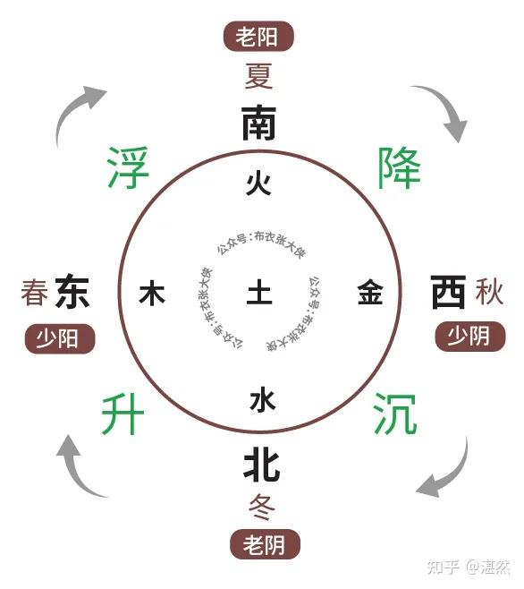
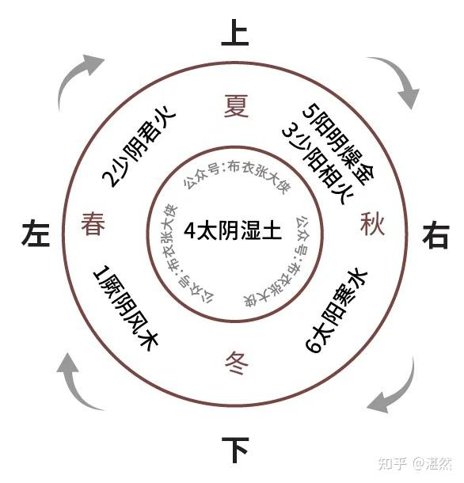

# 五行五运六气

## 五行

## 五运

以地球为坐标原点的第一人称角度看待金、木、水、火、土、月亮、太阳的空间位置关系。

五行学说中对气象运行规律的研究，就是“五运”。

《素问·五运行大论》

东方生风，风生木，木生酸，在天为风，在地为木，其性为暄，其德为和，其用为动，其色为苍，其化为荣，其虫毛，其政为散，其令宣发，其变摧拉，其眚为陨。

南方生热，热生火，火生苦，其在天为热，在地为火，其性为暑，其德为显，其用为躁，其色为赤，其化为茂，其虫羽，其政为明，其令郁蒸，其变炎烁：其眚燔焫。

中央生湿，湿生土，土生甘，其在天为湿，在地为土，其性静兼，其德为濡，其用为化，其色为黄，其化为盈，其虫倮，其政为谧，其令云雨，其变动注，其眚淫溃

西方生燥，燥生金，金生辛，其在天为燥，在地为金，共性为凉，其德为清，其用为固，其色为白，其化为敛，其虫介，其政为劲，其令雾露，其变肃杀，其眚苍落。

北方生寒，寒生水，水生咸，其在天为寒，在地为水，其性为凛，其德为寒，其用为藏，其色为黑，其化为肃，其虫鳞，其政为静，其令闭塞，其变凝冽，其眚冰雹

## 六气

五运的运行和促进，如“春气由冬气而来，故曰水生木。夏气由春气而来，故曰木生火。长夏之气由夏气而来，故曰火生土。秋气由长夏之气而来，故曰土生金。冬气由秋气而来，故曰金生水。夏秋之间是为长夏”。

这种五运的转换是怎么促进的呢？

六气，即风、热、暑、湿、燥、寒

六气当中，五行各一，惟火有二，故曰六气。

君火运行，重在上升。相火运行，重在下降。相火由秋降入水中，再由春升上，乃为君火。而君火又随相火下降，形成完美闭环，如图：

图中所讲的少阴、少阳、太阴、阳明、太阳、厥阴又是什么意思呢？

六气的圆运动，四节一气。

    大寒、立春、雨水、惊蛰属初之气。
    春分、清明、谷雨、立夏属二之气。
    小满、芒种、夏至、小暑属三之气。
    大暑、立秋、处暑、白露属四之气。
    秋分、寒露、霜降、立冬属五之气。
    小雪、大雪、冬至、小寒属六之气。

厥阴风木

地面上属阳，地面下属阴。初气之时，大气由寒而温。地下水中所封藏经秋收来的阳热，动而上升。此阳热与水化合，是为木气。

木气者，一年之阳根也。大寒节气，当阴极之时，故称厥阴。厥者，极也。木气主动，动而不通，则成风。故称风木

少阴君火

二之气，亦从地下阴位升出地面，即木气上升之气也。此时大气较热，不似厥阴之阴极，故称少阴。

木气上升之气，即水中气藏上年秋时下降的阳气。此阳气，由地下升至地上，照临大宇，光明四达，上升之象，有如君位，故称君火。此时大气由温而热，又称热火。

少阳相火

三气之时，地面上阳热盛满。经暮夜大气之凉降，降入地面下之水中。然当暑热上腾之时，旋降旋升。地下水中，为生物生命之所从出。此阳热实为生命之本，地面上阳热盛满，地而下所得阳热不多，故称少阳。

此阳热降入地下水中，以生中气。中气旋转，则上下交清，有如相臣之职，故称相火。此火不降，暑热熏蒸，又称暑火。

太阴湿土

四气之时，地面上阳热盛满。地面下旧有的阳气，亦升上来。地面上非常之热，地面下非常之寒。热属阳，寒属阴。大气阴多，故称太阴。

为在水下则生气，火在水上则生湿。此时地面上阳热盛满，尚未降入土下。寒热相逼，湿气濡滋。土气在升降之交，故称湿土。

阳明燥金

地面上为阳位。五气之时，地面上盛满的阳热，经秋气之收敛，正当下降。中土之下，阳气充足。湿气已收，大宇光明，阳盛而明，故称阳明。
金气当旺，湿也收则燥热气结。此时地面上空的金气，压力极大，故称燥金。

太阳寒水

六气之时，地面上的阳热，经秋气之收敛，全行降入土下的水中。造化之气，中下为本。中下阳多，故称太阳。此阳热降入水中，水即将他封藏不泄。此时大气降压，水外即寒。水外已寒，则水内阳藏，故称寒水。