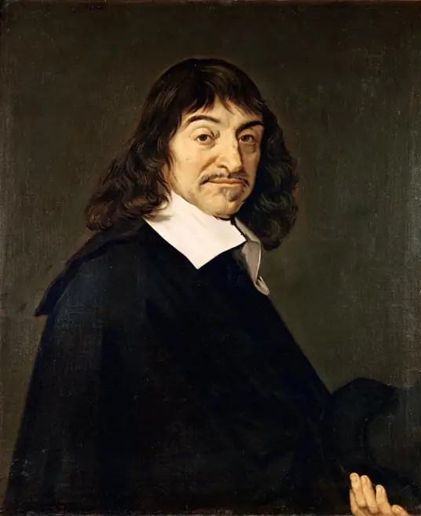
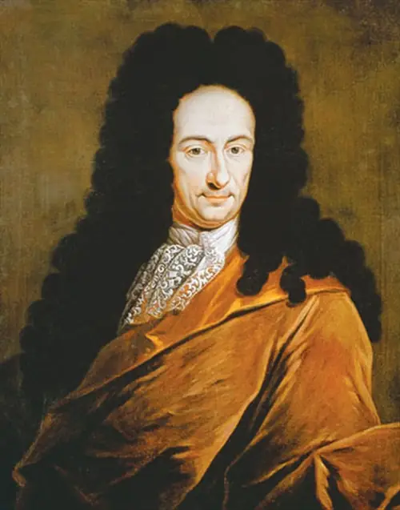

# 数学正史人物清单

| 人物                                           | 关键词              | 单位 | 简介 |
|----------------------------------------------|------------------|------|------|
| [1596-1650 笛卡尔 Descartes](1596descartes.md) | 坐标系 解析几何之父 |      |      |
| [1646-1716 莱布尼茨 Leibniz](1646leibniz.md)   | 微积分              |      |      |

## 1596-1650 法国 笛卡尔 Descartes

勒内·笛卡尔（René Descartes，1596年3月31日–1650年2月11日）

法国哲学家、数学家、物理学家。他对现代数学的发展作出了重要的贡献，由于他的几何坐标系的公式化而被认为是解析几何之父。

- 他于1637年发明了现代数学的基础工具之一——坐标系，将几何和代数相结合，创立了解析几何学。
- 他还对人眼进行光学分析，解释了视力失常的原因是晶状体变形，设计了矫正视力的透镜。
- 他还用光的折射定律解释彩虹现象，并且通过元素微粒的旋转速度来分析颜色。
- 发展了伽利略运动相对性的理论，运动与静止需要选择参考系的道理。
- 惯性定律：只要物体开始运动，就将继续以同一速度并沿着同一直线方向运动，直到遇到某种外来原因造成的阻碍或偏离为止。
- 动量守恒定律：物质和运动的总量永远保持不变。

[[1596descartes]]

## 1646-1716 德国 莱布尼茨 Leibniz

戈特弗里德·威廉·莱布尼茨（Gottfried Wilhelm Leibniz，1646年7月1日－1716年11月14日）

德国哲学家、数学家，是历史上少见的通才，被誉为十七世纪的亚里士多德。

莱布尼茨在数学史和哲学史上都占有重要地位。在数学上，他和艾萨克·牛顿先后独立发现了微积分，而且他所使用的微积分的数学符号被更广泛的使用，莱布尼茨所发明的符号被普遍认为更综合，适用范围更加广泛。莱布尼茨还发现并完善了二进制。

[[1646leibniz]]

[//begin]: # "Autogenerated link references for markdown compatibility"
[1596descartes]: 1596descartes.md "1596-1650 笛卡尔 Descartes"
[1646leibniz]: 1646leibniz.md "1646-1716 莱布尼茨 Leibniz"
[//end]: # "Autogenerated link references"