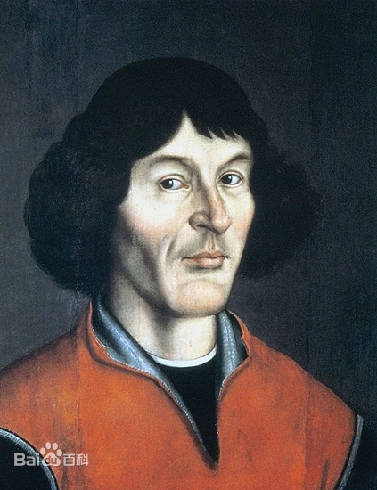
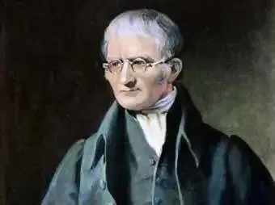
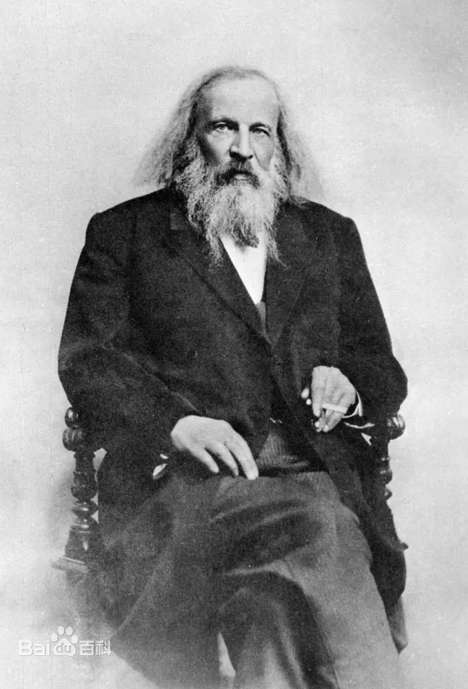
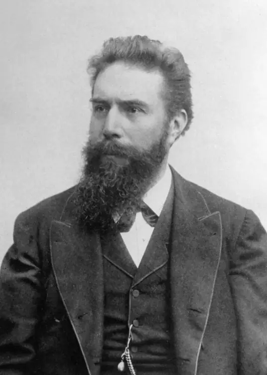
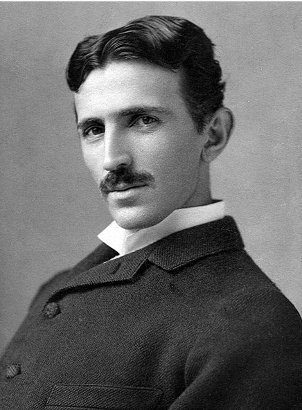
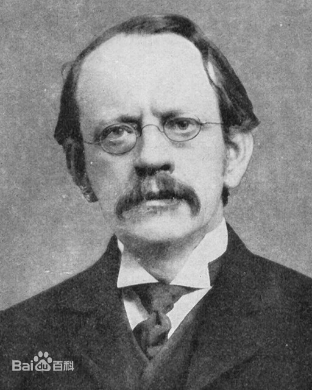
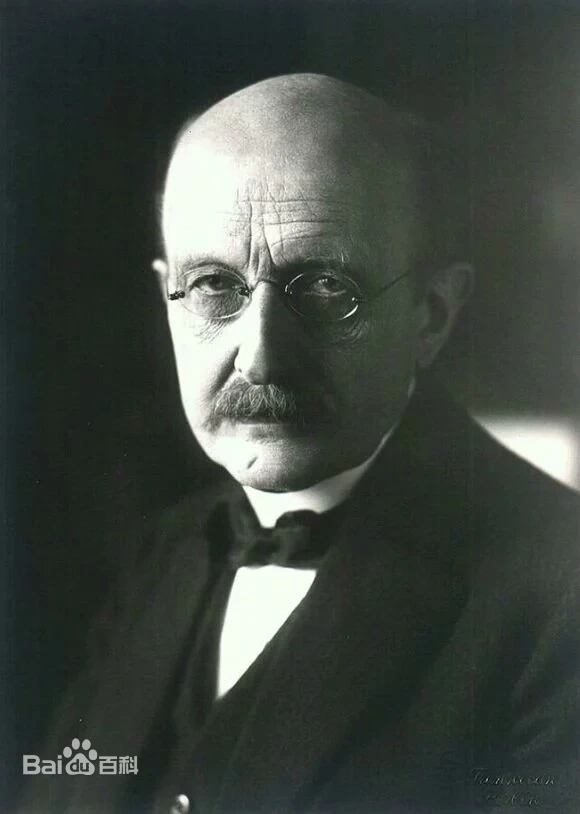
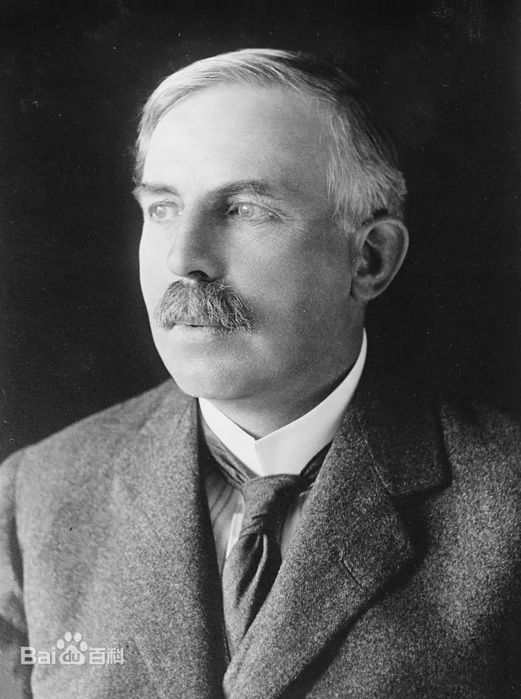
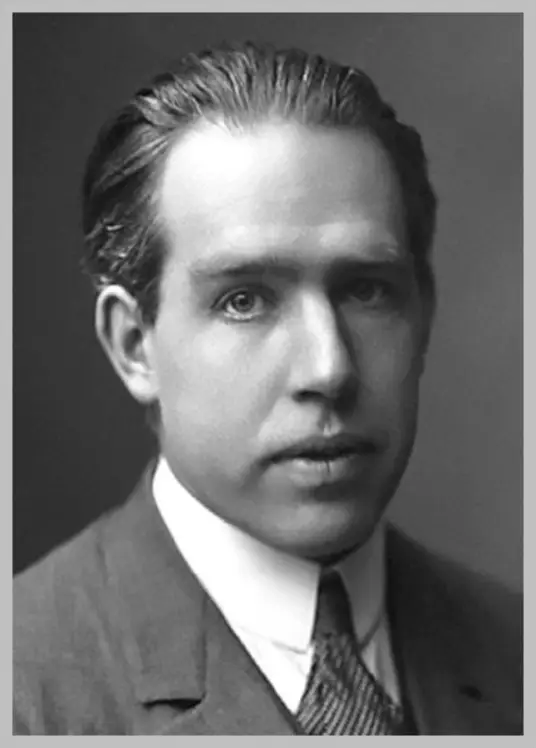
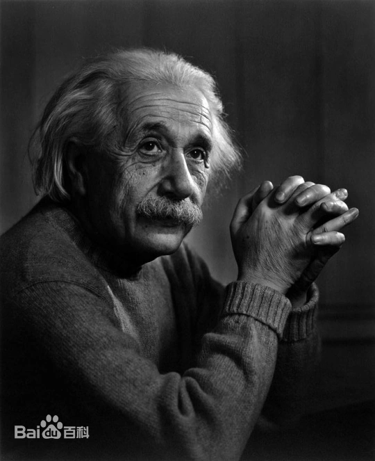

# 物理正史人物清单

各人物相关文献下载：[One文献](/kb-sci-book/)

| 人物                                             | 关键词              | 单位/命名   | 简介                         |
|--------------------------------------------------|---------------------|-------------|------------------------------|
| 1473-1543 哥白尼 Kopernik                        | 日心说              |             |                              |
| 1564-1642 伽利略 Galileo                         | 加速度、望远镜       |             |                              |
| [1627-1691 波义耳 Boyle](1627boyle.md)           | 元素说              |             | 化学之父                     |
| [1635-1703 胡克 Hooke](1635hooke.md)             | 显微镜 细胞         |             | 伦敦的莱奥纳多（达芬奇）       |
| [1643-1727 牛顿 Newton](1643newtom.md)           | 力学 微积分         | 物理单位N   | 近代物理学之父               |
| 1706-1790 富兰克林 Franklin                      | 避雷针              |             |                              |
| 1736-1806 库仑 Coulomb                           | 库仑定律            | 物理单位C   |                              |
| 1745-1827 伏特 Volta                             | 伏打电堆            | 物理单位V   |                              |
| 1766-1844 道尔顿 Dalton                          | 原子论              |             | 近代化学之父                 |
| 1775-1836 安培 Ampere                            | 安培定则            | 物理单位A   | 被麦克斯韦誉为“电学中的牛顿” |
| [1776-1856 阿伏伽德罗 Avagadro](1776avagadro.md) | 分子                | 物理常数Na  | 阿伏伽德罗常数               |
| 1777-1851 奥斯特 Orsted                          | 电生磁              |             |                              |
| [1791-1867 法拉第 Faraday](1791faraday.md)       | 电磁感应            | 物理单位F   | 电学之父                     |
| 1831-1879 麦克斯韦 Maxwell                       | 麦克斯韦方程        |             | 创立了经典电动力学           |
| 1832-1919 克鲁克斯 Crookes                       | 阴极射线管          |             |                              |
| 1834-1907 门捷列夫                               | 元素周期律          |             |                              |
| 1845-1923 伦琴 Rontgen                           | X射线               |             |                              |
| [1853-1928 洛伦兹 Lorentz](1853lorentz.md)       | 电子论              |             |                              |
| [1856-1943 特斯拉 Tesla](1857tesla.md)           | 交流电 特斯拉线圈   | 物理单位T   |                              |
| [1856-1940 汤姆逊 Thomson](1856thomson.md)       | 电子                |             |                              |
| [1857-1894 赫兹 Hertz](1857hertz.md)             | 电磁波              | 物理单位Hz  |                              |
| [1858-1947 普朗克 Planck](1858planck.md)         | 普朗克常量 量子力学 |             |                              |
| [1865-1943 塞曼 Zeeman](1856zeeman.md)           | 塞曼效应            |             |                              |
| [1868-1953 密立根 Millikan](1868millikan.md)     |                     |             |                              |
| [1871-1937 卢瑟福 Rutherford](1871rutherford.md) | 质子 中子           |             |                              |
| [1885-1962 玻尔 Bolr](1885bolr.md)               |                     | 107号元素Bh |                              |
| [1879-1955 爱因斯坦 Einstein](1879einstein.md)   | 相对论              |             |                              |
| 1891-1974 查德威克 Chadwick                      | 中子                |             |                              |
| 1901-1958 劳伦斯 Lawrence                        | 回旋加速器          | 103号元素Lr |                              |
|                                                  |                     |             |                              |

## 1473-1543 哥白尼 Kopernik

尼古拉·哥白尼（波兰语：Mikołaj Kopernik，1473年2月19日–1543年5月24日），文艺复兴时期波兰天文学家、数学家、教会法博士、神父。

在哥白尼40岁时，他提出了日心说，改变了人类对自然对自身的看法。当时罗马天主教廷认为他的日心说违反《圣经》，哥白尼仍坚信日心说，并认为日心说与其并无矛盾，并经过长年的观察和计算完成他的伟大著作《天球运行论》。

## 1564-1642 伽利略 Galileo

伽利略·伽利雷（1564年2月15日—1642年1月8日）享年77岁，原名（Galileo di Vincenzo Bonaulti de Galilei）

意大利天文学家、物理学家和工程师、欧洲近代自然科学的创始人。伽利略被称为“观测天文学之父”、“现代物理学之父”、“科学方法之父”、“现代科学之父”。

伽利略研究了速度和加速度、重力和自由落体、相对论、惯性、弹丸运动原理，并从事应用科学和技术的研究，描述了摆的性质和“静水平衡”，发明了温度计和各种军事罗盘，并使用用于天体科学观测的望远镜。他对观测天文学的贡献包括使用望远镜对金星相位的确认，发现木星的四颗最大卫星，土星环的观测和黑子的分析。

## [1627-1691 波义耳 Boyle](./1627boyle.md)

罗伯特·波义耳（Robert Boyle，1627年1月25日—1691年12月30日）

英国物理学家、化学家，化学科学的开山祖师，近代化学的奠基人，化学史家都把1661年作为近代化学的元年，因为这一年有一本对化学发展产生重大影响的著作出版问世，这本书就是波义耳所著的《怀疑派化学家》（The Skeptical Chemist）。

## [1635-1703 胡克 Hooke](./1635hooke.md)

罗伯特·胡克（Robert Hooke，1635年7月18日－1703年3月3日），波义耳助手。

英国博物学家，发明家，被誉为英国的“双眼和双手”。

1655年，胡克提出了光的波动说，他认为光的传播与水波的传播相似。1672年胡克进一步提出了光波是横波的概念。

他制作或发明了显微镜、望远镜等多种光学仪器。

1679年给牛顿的信中正式提出了引力与距离平方成反比的观点，但由于缺乏数学手段，还没有得出定量的表示。

1663年胡克发现了细胞，用自己制造的显微镜观察植物组织。

## [1643-1727 牛顿 Newton](./1643newtom.md)

艾萨克·牛顿爵士 PRS MP（英语：Sir Isaac Newton，格里历：1643年1月4日—1727年3月31日）

英国辉格党政治家、物理学家、数学家、天文学家、自然哲学家和炼金术士。

1687年他发表《自然哲学的数学原理》，阐述了万有引力和三大运动定律，由此奠定现代物理学和天文学，并为现代工程学打下了基础。他通过论证开普勒行星运动定律与他的引力理论间的一致性，展示了地面物体与天体的运动都遵循着相同的自然定律；为太阳中心学说提供了强而有力的理论支持，是科学革命的一大代表。

## 1706-1790 富兰克林 Franklin

本杰明·富兰克林（英语：Benjamin Franklin，1706年1月17日－1790年4月17日），美国政治家、科学家、印刷商和出版商、作家、发明家，以及外交官，美国开国元勋之一。

富兰克林第一个发现了金属尖端放电现象。他又经过各种试验，在1747年末得出结论：电不是摩擦产生的，而是通过摩擦集中起来的。它是物质中的一个元素，有正(+)有负(-)，从而创造了(+)(-)概念。他否定了法国科学家提出的二流体理论，即电有玻璃电、琥珀电。

1752年6月，富兰克林进行了一项著名的费城电风筝实验（详见“轶事典故”目录），并由此发明了避雷针。消息不久传到英国。英国人立即采用这一发明成果，并于1752年年底发表了他的论文。在未征得富兰克林的同意下，英国皇家学会为表扬富兰克林对电的研究，在1753年选他为院士。

## 1736-1806 库仑 Coulomb

查利·奥古斯丁·库仑（Charles-Augustin de Coulomb，1736年6月14日---1806年8月23日）法国工程师、物理学家。1736年6月14日生于法国昂古莱姆。1806年8月23日在巴黎逝世。主要贡献有扭秤实验、库仑定律、库伦土压力理论等。同时也被称为“土力学之始祖”

库仑终于找出了在真空中两个点电荷之间的相互作用力与两点电荷所带的电量及它们之间的距离的定量关系，这就是静电学中的库仑定律，即两电荷间的力与两电荷的乘积成正比，与两者的距离平方成反比。

库仑定律是电学发展史上的第一个定量规律，它使电学的研究从定性进入定量阶段，是电学史中的一块重要的里程碑。电荷的单位库仑就是以他的姓氏命名的。

## 1745-1827 伏特 Volta

亚历山德罗·朱塞佩·安东尼奥·安纳塔西欧·伏特（Count Alessandro Giuseppe Antonio Anastasio Volta，1745年2月18日－1827年3月5日）

意大利物理学家。因在1800年发明伏打电堆而著名。后受封为伯爵。

## 1766-1844 道尔顿 Dalton

约翰·道尔顿（John Dalton，1766年9月6日—1844年7月27日）

英国化学家、物理学家。原子理论的提出者。他所提供的关键的学说，使化学领域自那时以来有了巨大的进展。道尔顿患有色盲症，这种病的症状引起了他的好奇心。他开始研究这个课题，最终发表了第一篇有关色盲的论文。后人为了纪念他，又把色盲症叫作道尔顿症。

道尔顿一生宣读和发表过116篇论文，主要著作有《化学哲学的新体系》两册。

遗憾的是道尔顿曾固执地反对为他解围的阿伏加德罗分子学说而传为“笑话”。

1803年10月，在曼彻斯特文学和哲学学会的一次活动中，道尔顿第一次讲述了他的原子论。他的基本观点可归纳为三点:

1. 元素是由非常微小、不可再分的微粒------原子组成，原子在一切化学变化中不可再分，并保持自己的独特性质。
2. 同一元素所有原子的质量、性质都完全相同。不同元素的原子质量和性质也各不相同，原子质量是每一种元素的基本特征之一。
3. 不同元素化合时，原子以简单整数比结合。

## 1775-1836 安培 Ampere

安德烈·玛丽·安培（André-Marie Ampère，1775年1月20日--1836年6月10日）

安培最主要的成就是1820～1827年对电磁作用的研究，他被麦克斯韦誉为“电学中的牛顿”。在电磁作用方面的研究成就卓著。电流的国际单位安培即以其姓氏命名。

安培定则是表示电流和电流激发磁场的磁感线方向间关系的定则，也叫右手螺旋定则。

1. 直线电流的安培定则用右手握住导线，让伸直的大拇指所指的方向跟电流的方向一致，那么弯曲的四指所指的方向就是磁感线的环绕方向。
2. 环形电流的安培定则让右手弯曲的四指和环形电流的方向一致，那么伸直的大拇指所指的方向就是环形电流中心轴线上磁感线的方向。

直线电流的安培定则对一小段直线电流也适用。环形电流可看成许多小段直线电流组成，对每一小段直线电流用直线电流的安培定则判定出环形电流中心轴线上磁感强度的方向。叠加起来就得到环形电流中心轴线上磁感线的方向。直线电流的安培定则是基本的，环形电流的安培定则可由直线电流的安培定则导出，直线电流的安培定则对电荷作直线运动产生的磁场也适用，这时电流方向与正电荷运动方向相同，与负电荷运动方向相反。

## [1776-1856 阿伏伽德罗 Avagadro](./1776avagadro.md)

阿莫迪欧·阿伏伽德罗（1776年8月9日～1856年7月9日），意大利物理学家、化学家。

1811年发表了阿伏伽德罗假说，也就是今日的阿伏伽德罗定律，并提出分子概念及原子、分子区别等重要化学问题。

1832年，出版了四大册理论物理学，有名的假设：“在相同的物理条件下，具有相同体积的气体，含有相同数目的分子。”但未被当时的科学家接受。著名的阿伏伽德罗常量（Avogadro's number）以他的姓氏命名，单位符号：NA。

## 1777-1851 奥斯特 Orsted

汉斯·克海斯提安·奥斯特（丹麦语：Hans Christian Ørsted，1777年8月14日－1851年3月9日），丹麦物理学家、化学家和文学家。在物理学领域，他首先发现载流导线的电流会产生作用力于磁针，使磁针改变方向。在化学领域，他发现了铝元素。

## [1791-1867 法拉第 Faraday](./1791faraday.md)

迈克尔·法拉第（英语：Michael Faraday，1791年9月22日—1867年8月25日）

迈克尔·法拉第是英国著名化学家汉弗里·戴维的学生和助手，他的发现奠定了电磁学的基础，是詹姆斯·克拉克·麦克斯韦的先导。1831年10月17日，法拉第首次发现电磁感应现象，并进而得到产生交流电的方法。1831年10月28日法拉第发明了圆盘发电机，是人类创造出的第一个发电机。

由于他在电磁学方面做出了伟大贡献，被称为“电学之父”和“交流电之父”。

## [1831-1879 麦克斯韦 Maxwell](./1831maxwell.md)

詹姆斯·克拉克·麦克斯韦 FRS FRSE（英语：James Clerk Maxwell；1831年6月13日—1879年11月5日）

- 事迹1：总结前人特别是法拉第的研究成果，用数学方式建模了电磁模型
- 事迹2：用数学方法证明以太模型和超距场模型数学结果一致，给出了基于以太的“动态电磁场理论”
- 事迹3：预测电磁波的存在

《动态电磁场理论》《电磁通论》

## 1832-1919 克鲁克斯 Crookes

威廉·克鲁克斯（William Crookes，1832年6月17日－1919年4月4日），男，英国著名物理学家与化学家。

他于1859年创办并主编《化学新闻》。1863年当选英国皇家学会会员，1913年至1915年间担任皇家学会会长。是铊（第81号Tl）元素的发现和命名者。其研制的阴极射线管（克鲁克斯管），为1895年X射线的发现，和1897年电子的发现提供了基本实验条件。威廉·克鲁克斯同时也发明闪烁镜等实验仪器和防护射线的特种玻璃，以及研究稀土元素及其光谱、空气中固氮等问题，并以此发明了辐射计。

## 1833-1896 诺贝尔 Nobel

阿尔弗雷德·贝恩哈德·诺贝尔（Alfred Bernhard Nobel，1833年10月21日~1896年12月10日）

瑞典化学家、工程师、发明家、军工装备制造商和矽藻土炸药的发明者，出生于斯德哥尔摩。

诺贝尔一生拥有355项专利发明，并在欧美等五大洲20个国家开设了约100家公司和工厂，积累了巨额财富。

## 1834-1907 门捷列夫

 

 德米特里·伊万诺维奇·门捷列夫（俄语：Дмитрий Иванович Менделеев，1834年2月7日---1907年2月2日）

 俄国科学家，发现并归纳元素周期律，依照原子量，制作出世界上第一张元素周期表，并据以预见了一些尚未发现的元素。

 ## 1845-1923 伦琴 Rontgen

 

 威廉·康拉德·伦琴（德语：Wilhelm Conrad Röntgen，1845年3月27日—1923年2月10日）

1895年11月8日发现了X射线

## [1853-1928 洛伦兹 Lorentz](./1853lorentz.md)

亨德里克·安东·洛伦兹（Hendrik Antoon Lorentz，1853年7月18日-1928年2月4日）

荷兰理论物理学家、1902年诺贝尔奖物理学奖获得者、数学家、经典电子论的创立者。

洛伦兹认为一切物质分子都含有电子，阴极射线的粒子就是电子。把以太与物质的相互作用归结为以太与电子的相互作用。这一理论成功地解释了塞曼效应，因此与塞曼一起获1902年诺贝尔物理学奖。

## [1856-1943 特斯拉 Tesla](./1857tesla.md)

尼古拉·特斯拉（英语：Nikola Tesla；1856年7月10日—1943年1月7日）

## [1856-1940 汤姆逊 Thomson](./1856thomson.md)

约瑟夫·约翰·汤姆逊（Joseph John Thomson，1856年12月18日--1940年8月30日）

英国物理学家，电子的发现者，诺贝尔物理学奖获得者，第三任卡文迪许实验室主任，前英国皇家学会会长。

1897年在真空管阴极射线实验中证明了电子的存在。除了在物理研究中的贡献，汤姆逊还是一位杰出的教师，培养了7位诺贝尔奖得奖者。

## [1857-1894 赫兹 Hertz](./1857hertz.md)

 海因里希·鲁道夫·赫兹（Heinrich Rudolf Hertz，1857年2月22日－1894年1月1日）

 海因里希・鲁道夫・赫兹（1857年~1894年），德国物理学家，于1887年首先用实验证实了电磁波的存在，并于1888年发表了论文。他对电磁学有很大的贡献，故频率的国际单位制单位赫兹以他的名字命名。

 赫兹用实验证明电磁波是存在的，且电磁波的传播速度相当于光速，赫兹实验为无线电、雷达和电视等无线电电子技术的发展开拓了创新途径。他对紫外光对火花放电的影响进行了研究，并从中发现了光电效应，认为在光的照射下物体能够释放电子，这个发现成为爱因斯坦建立光量子理论的基础。

## [1858-1947 普朗克 Planck](./1858planck.md)

 

马克斯·普朗克（全名：马克斯·卡尔·恩斯特·路德维希·普朗克，Max Karl Ernst Ludwig Planck，1858年4月23日---1947年10月4日）

德国物理学家、量子力学重要创始人之一，普鲁士科学院院士，美国艺术与科学院院士，美国国家科学院外籍院士，1918年诺贝尔物理学奖获得者

## [1865-1943 塞曼 Zeeman](./1856zeeman.md)

彼得·塞曼（Pieter Zeeman，1865年5月25日-1943年10月9日），荷兰物理学家

1896年塞曼发现了原子光谱在磁场中的分裂现象，被命名为塞曼效应。

## [1868-1953 密立根 Millikan](./1868millikan.md)

罗伯特·安德鲁·密立根（Robert Andrews Millikan，1868年3月22日—1953年12月19日）

实验物理学家，美国艺术与科学院院士，美国国家科学院院士，1923年诺贝尔物理学奖得主。

- 精确测定基本电荷值
- 对光电效应的实验研究

## [1871-1937 卢瑟福 Rutherford](./1871rutherford.md)

欧内斯特·卢瑟福（Ernest Rutherford，1871年8月30日---1937年10月19日）

物理学家，纳尔逊男爵，英国皇家学会院士，诺贝尔化学奖获得者，生前是卡文迪许实验室主任。

欧内斯特·卢瑟福主要从事核科学和放射性方面的研究，发现了α射线、β射线的、质子、中子。

## [1885-1962 玻尔 Bolr](./1885bolr.md)

尼尔斯·玻尔（全名：尼尔斯·亨利克·戴维·玻尔，丹麦文：Niels Henrik David Bohr，1885年10月7日—1962年11月18日）

1913年初，提出了原子结构的玻尔模型。

1921年，阐述了光谱和原子结构理论的新发展，诠释了元素周期表的形成，对周期表中从氢开始的各种元素的原子结构作了说明，同时对周期表上的第72号元素的性质作了预言。 1922年，第72号元素铪的发现证明了尼尔斯·玻尔的理论。

## [1879-1955 爱因斯坦 Einstein](./1879einstein.md)

阿尔伯特·爱因斯坦（德语/英语：Albert Einstein；1879年3月14日—1955年4月18日）

美国和瑞士双国籍的犹太裔物理学家。

1905年，爱因斯坦获苏黎世大学物理学博士学位，并提出光子假设、成功解释了光电效应（因此获得1921年诺贝尔物理学奖）；同年创立狭义相对论，1915年创立广义相对论，1933年移居美国。

## 1891-1974 查德威克 Chadwick

詹姆斯·查德威克（James Chadwick，1891年10月20日——1974年7月24日），英国物理学家。1935年因发现中子获得诺贝尔物理学奖。

## 1901-1958 劳伦斯 Lawrence

欧内斯特·劳伦斯（全名：欧内斯特·奥兰多·劳伦斯，Ernest Orlando Lawrence，1901年8月8日—1958年8月27日）

物理学家，美国国家科学院院士，美国艺术与科学院院士，诺贝尔物理学奖获得者，生前是加州大学伯克利分校物理学教授

欧内斯特·劳伦斯主要从事加速器技术、核物理及其在生物学和医学上应用方面的研究