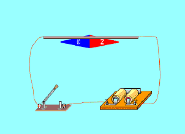
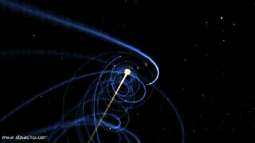

# 电磁学重要发现时间线

## 磁

公元前6世纪，古希腊古风时期的学者泰勒斯最早以成文方式记述了磁石能够吸铁、经过摩擦后的琥珀能够吸引轻小物体等现象。由于古希腊人发现磁石的地方叫做Magnesia，就把这种石头称为Magnes lithos，后来逐渐转化为拉丁语词magnetum 及英语词magnet并用于表达"磁"这一含义。

## 1600 电

1600年，吉尔伯特的研究首先区分了电现象和磁现象，提出磁石上的正、负极（即现代术语所指的N、S极）必定成对出现而不会独立存在，发现了电现象在水中消失但磁现象仍存在，发现磁力在高温下消失等现象。他的著作《De Magnete》提出了地球是一个巨大磁体的假说和星球间引力源于磁性的假说（这时人类还尚未科学地认识万有引力）。

在这一著作中，吉尔伯特根据"琥珀"一词的希腊语词elektron、古拉丁语词electrum创造了拉丁语词electricus以表达"电"这一含义，后来转化为英语词electric并沿用至今。为了纪念他，在曾经广泛应用的CGS单位制中磁动势的单位就是吉伯（符号为Gb或Gi）。

## 1660 摩擦起电机

1660年，格里克基于摩擦起电现象研制成功摩擦起电机

## 1720 静电感应现象 

1720年，英国格雷发现了电的传导现象并对其深入研究后提出了导体和绝缘体的概念，还发现了导体的静电感应现象。

## 1733 电的双流体理论

1733年，杜菲通过实验认为自然界存在两种电荷并将其分别命名为"vitreous"（原意为玻璃）和"resinous"（原意为松脂），指出电荷间相互作用表现为同种电荷相互排斥、异种电荷相互吸引的基本特征，被称为"电的双流体理论"。

## 1745 莱顿瓶

1745--1746年间，穆欣布洛克和克莱斯特（Ewald Georg von Kleist，1700--1748，德国物理学家、法学家）分别独立发明了能够储存静电的莱顿瓶，静电学研究从此有了廉价易得、使用方便的静电来源。莱顿瓶的结构成为现代电容器的先声。

典型的莱顿瓶是一个玻璃容器，内外包覆着导电金属箔作为极板。瓶口上端接一个球形电极，下端利用导体（通常是金属锁链）与内侧金属箔或是水连接。莱顿瓶的充电方式是将电极接上静电产生器或起电盘等来源，外部金属箔接地；内部与外部的金属将会携带相等但极性相反的电荷。

## 1750 电的单流体理论

1750年，富兰克林通过实验认为电现象是一种分布在所有物体内的、没有质量的流体（他将之称为"电流体"）所产生的作用（这一观点显然受到了以太论的影响）：当物体所含的电流体为其自然拥有的数量时，称物体处于"电中性"，当物体所含的电流体大于其自然拥有的数量时，称物体"带正电"，反之则称物体"带负电"。富兰克林认为杜菲提出的"vitreous"对应了"带正电"、"resinous"对应了"带负电"（这一观点显然是人为规定的，但一直被沿用，使得后来发现的电子"带负电"而原子核"带正电"），这被称为"电的单流体理论"。

富兰克林还基于实验现象提出了电荷守恒思想，他认为在封闭系统中电流体的总量是不变的，它只能被重新分配而不能被创造，这使得将数学工具引入电现象的研究成为可能。他的另一个重大贡献是发明了避雷针，这标志着人类第一次驯服了"天电"，有效解决了高大建筑物被雷击的问题，人类对雷电防护技术的研究由此发端。

## 1754 静电感应原理

1754年，英国康顿用"电的单流体理论"解释了静电感应现象，静电力基本特性、电荷守恒和静电感应原理都已建立

## 1785 库仑定律

1785年，库仑通过著名的"扭秤实验"总结出了电荷之间相互作用的基本规律，即现在所称的库仑定律，这是静电学得以建立的基本实验定律。

## 1799 伏打电池

1799年，意大利的伏特（A.Voult）用铜片和锌片浸于食盐水中，并接上导线，制成了第一个电池，他提供首次的连续性的电源，堪称现代电池的元祖。

## 1820 电生磁

 1820年，丹麦奥斯特发现电生磁现象

## 1820 右手螺旋定则

对于直线电流，判定的方法是，用右手握住导线，让伸直的大拇指指向电流方向，那么，弯曲的四指所指的方向就是磁力线的环绕方向。对于通电的螺线管，判定的方法是，右手握住螺线管，让弯曲的四指指向环形电流方向，那么，伸直的大拇指所指的方向就是磁力线方向。

1821年，安培探索了磁现象的本质。他认为物体中的每个分子都有圆形电流，即分子电流，分子电流产生磁场，使每个分子都成为一个小磁体。当物体内部的分子电流杂乱无章地排列时，它们的磁性相互抵消，而使物体不显示磁性；当物体内部的分子电流取向一致时，至少是部分地一致时，就使物体显示出磁性。这样，安培初步揭示了电和磁的内在联系，他的观点和现代观点非常接近。

后人为了纪念他，把电流强度的单位命名为"安培"，简称"安"。

## 1826 欧姆定律

1826年，欧姆发现了欧姆定律。部分电路的欧姆定律是：导体中的电流强度，跟这段导体两端的电压成正比，跟这段导体的电阻成反比。

全电路的欧姆定律是：电路中的电流强度跟电源的电动势成正比，跟整个电路的电阻（外电路电阻和电源电阻）成反比。

为了纪念欧姆，后人将电阻的单位命名为"欧姆"，简称为"欧"。

## 1829 互感现象

1829年，亨利发现了自感现象并独立于法拉第发现了互感现象。他还发明了电铃和电磁继电器

## 1831 法拉第 电磁感应定律

[[1791faraday]]

1831年法拉第终于发现，一个通电线圈的磁力虽然不能在另一个线圈中引起电流，但是当通电线圈的电流刚接通或中断的时候，另一个线圈中的电流计指针有微小偏转。法拉第心明眼亮，经过反复实验，都证实了当磁作用力发生变化时，另一个线圈中就有电流产生。他又设计了各种各样实验，比如两个线圈发生相对运动，磁作用力的变化同样也能产生电流。这样，法拉第终于用实验揭开了电磁感应定律。法拉第的这个发现扫清了探索电磁本质道路上的拦路虎，开通了在电池之外大量产生电流的新道路。

法拉第电磁感应定律：电路中感生电动势的大小，跟穿过这一电路的磁通量的变化成正比。这一发现成为现代电工学的基础，用于发电、送电等技术。

## 1833 法拉第 电解定律

[[1791faraday]]

1833年，法拉第在实验中得出两条电解定律，被称为法拉第电解定律。

法拉第第一电解定律是：电解时，在电极上析出的物质的质量和通过电解液的电流强度及通电时间成正比。

法拉第第二电解定律是：一定量的电量所析出的物质的质量与该物质的化学当量成正比。

在发现电解定律的过程中，法拉第最先使用了电极、阳极、阴极、离于、阳离子、阴离子等名词。

## 1839 光伏效应

1839年，法国科学家贝克雷尔(Becqurel)就发现，光照能够使得半导体材料的不同部位之间产生电位差。这种现象后来被称为"光生伏特效应"，简称"光伏效应"。

## 1843 法拉第 电荷守恒定律

[[1791faraday]]

1843年，法拉第第一个证明了电荷守恒定律，认为电荷既不能被创造，也不能被消灭。只能在物体内或在几个物体之间相互转移，电荷的代数和是守恒的。

## 1845 法拉第 旋光效应

[[1791faraday]]

1845年9月，法拉第在一次实验中发现了旋光效应，这就是著名的法拉第效应。在他用磁力线测试不同物体的磁效应时，发现透明固体和液体中的光的偏振面发生了旋转。对此，法拉第解释为"光线被磁化了"，这实际上是后来光的电磁说的萌芽。

## 1865 麦克斯韦方程

[[1831maxwell]]

1864年，麦克斯韦发表他的第三篇电磁学论文《电磁场的动力学理论》。在这篇论文里，麦克斯韦方程更完备了，它导出了电场与磁场的波动方程，其波的传播速度正好等于光的速度。这启发他提出了光的电磁学说，指出光也是一种电磁波，只不过是一种频率很低的电磁波，从而进一步认识了光的本质。

1873年，麦克斯韦出版了他的电磁学专著《电磁学通论》。

## 1887 光电效应

[[1857hertz]]

1887年，德国物理学者海因里希·赫兹做实验观察到光电效应、电磁波的发射与接收。

## 1888 赫兹 电磁波

[[1857hertz]]

1888年，赫兹终于发现了人们所怀疑的电磁波。

电磁波的发现对人类产生了巨大的影响。6年后，意大利的马可尼、俄国的波波夫实现了无线电传播，其他无线电技术如无线电报、无线电话、电视、雷达、卫星通信等等，像雨后春笋般涌现出来了。

## 1895 洛伦兹力

伦兹于1895年建立经典电子论时,作为基本假定而提出

认为一切物质分子都含有电子，阴极射线的粒子就是电子。洛伦兹把以太与物质的相互作用归结为以太与电子的相互作用。这一理论成功地解释了塞曼效应，与塞曼一起获1902年诺贝尔物理学奖。

## 1896 塞曼效应

荷兰物理学家塞曼在1896年发现把产生光谱的光源置于足够强的磁场中，磁场作用于发光体使光谱发生变化，一条谱线即会分裂成几条偏振化的谱线，这种现象称为塞曼效应。

## 1900 能量量子化

[[1858planck]]

1900年，普朗克首次提出了能量量子化，标志着量子论诞生 e=hv

1900年10月下旬，马克斯·普朗克在《德国物理学会通报》上发表一篇只有三页纸的论文，题目是《论维恩光谱方程的完善》，第一次提出了黑体辐射公式。12月14日，在德国物理学会的例会上，他作了《论正常光谱中的能量分布》的报告，在报告中指出，为了从理论上得出正确的辐射公式，必须假定物质辐射（或吸收）的能量不是连续地、而是一份一份地进行的，只能取某个最小数值的整数倍，这个最小数值就叫能量子，能量的最小数值表示为：

e=hv

该公式称为普朗克辐射公式或普朗克定律，其中，ν是辐射频率，h被马克斯·普朗克叫做基本作用量子，后来被命名为普朗克常数。

$$h = 6.626068 \times 10^{-34} J.s$$

## 1905 光子说 光电效应方程

[[1879einstein]]

1905年，爱因斯坦把普朗克的量子化概念进一步推广。他指出：不仅黑体和辐射场的能量交换是量子化的，而且辐射场本身就是由不连续的光量子组成，每一个光量子的与辐射场频率之间满足ε=hν，即它的能量只与光量子的频率有关，而与强度（振幅）无关。

光子说：在空间传播的光不是连续的，而是一份一份的，每一份叫做一个光子，光子的能量跟它的频率成正比

如果入射光子的能量hν 大于逸出功 $W_0$ ，那么有些光电子在脱离金属表面后还有剩余的能量，也就是说有些光电子具有一定的动能。因为不同的电子脱离某种金属所需的功不一样，所以它们就吸收了光子的能量并从这种金属逸出之后剩余的动能也不一样。由于逸出功W0指从原子键结中移出一个电子所需的最小能量，所以如果用Ek 表示动能最大的光电子所具有的动能，那么就有下面的关系式

$$E_k=hv-W_0$$

其中h为普朗克常量，ν为入射光频率，$W_0$ 为逸出功。

## 1910 基本电荷值

1910年，美国物理学家Robert Millikan通过实验测出电子所带的电荷为 $1.602×10^{-19}C$

## 1992 自旋磁陀螺实验

杨燕自旋磁陀螺实验

二个磁体表现出同极相吸、异极相斥

自旋陀螺产生公转现象，顺逆方向和磁极和自旋方向有关

中学时代的杨燕，当时作为一位业余科学爱好者发现了一个关于《自旋磁陀螺的反向倾斜和公转》的奇异现象,多方求教而不得其解，于1992年在《自然杂志》上公诸于众，供大家探讨。

地球绕太阳运动，地球自旋并有磁轴，太阳也是一个带有偶磁极的自旋恒星体，它们的绕动与自旋磁陀螺绕自旋磁体的运动及其相似——太阳自旋磁轴与地球自旋磁轴也呈现异极相斥现象！

## 太空静电-水珠实验

在太空中一个水滴可以绕一个带电塑料棒作跳跃式的饶璇运动，那么对于一个自旋小磁陀螺在太空中会绕一块柱型磁铁作什么运动呢？

## 近代发明

-   1832年，法国人毕克西发明了手摇式直流发电机。
-   1833年，德国数学家高斯和青年电学家韦伯在哥丁根建立了一个电报系统
-   1837年，莫尔斯发明了一套用点、划组成的著名的"莫尔斯电码"。
-   1866年，德国人西门子（Siemens）制成世界上第一台工业用发电机，自励式直流发电机。
-   1876年，美国的贝尔首先发明了电话。
-   1876年，爱迪生发明了留声机。
-   1879年，爱迪生发明电灯
-   1882年，美国的戈登制造出了输出功率447KW，高3米，重22吨的两相式巨型发电机；
-   1895年，意大利物理学家马可尼又发明了无线电报。
-   1896年，特斯拉的两相交流发电机在尼亚拉发电厂开始劳动营运，3750KW，5000V的交流电一直送到40公里外的布法罗市；
-   1889年，西屋公司在俄勒冈州建设了发电厂，1892年成功地将15000伏电压送到了皮茨菲尔德。
-   1906年，爱迪生用钨丝来做灯泡，一直沿用到今天。

[//begin]: # "Autogenerated link references for markdown compatibility"
[1791faraday]: ../1who/1791faraday.md "1791-1867 法拉第 Faraday"
[1831maxwell]: ../1who/1831maxwell.md "1831-1879 麦克斯韦 Maxwell"
[1857hertz]: ../1who/1857hertz.md "1857-1894 赫兹 Hertz"
[1858planck]: ../1who/1858planck.md "1858-1947 普朗克 Planck"
[1879einstein]: ../1who/1879einstein.md "1879-1955 爱因斯坦 Einstein"
[//end]: # "Autogenerated link references"