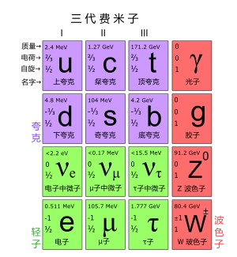

# 粒子标准模型

标准模型（英语：Standard Model, SM）是粒子物理学中一套描述强力、弱力及电磁力这三种基本力及组成所有物质的基本粒子的理论。它隶属量子场论的范畴，并与量子力学及狭义相对论相容。几乎所有对以上三种力的实验的结果都合乎这套理论的预测。但是标准模型还不是一套万有理论，主要是因为它并没有描述到引力。

标准模型共61种基本粒子（见表）包含费米子及玻色子——费米子为拥有半奇数的自旋并遵守泡利不相容原理（这原理指出没有相同的费米子能占有同样的量子态）的粒子；玻色子则拥有整数自旋而并不遵守泡利不相容原理。简单来说，费米子就是组成物质的粒子而玻色子则负责传递各种作用力。

## 费米子

在一组由全同粒子组成的体系中，如果在体系的一个量子态（即由一套量子数所确定的微观状态）上只允许容纳一个粒子，这种粒子称为费米子。或者说自旋为半奇数（1/2，3/2…）的粒子统称为费米子，服从费米-狄拉克统计。费米子满足泡利不相容原理，在由费米子组成的系统中，即不能两个以上的费米子出现在相同的量子态中。轻子，核子和超子的自旋都是1/2，因而都是费米子。自旋为3/2，5/2，7/2等的共振粒子也是费米子。中子、质子都是由三种夸克组成，自旋为1/2。奇数个核子组成的原子核。因为中子、质子都是费米子，故奇数个核子组成的原子核自旋是半整数。

基本费米子分为2类：夸克和轻子。而这2类基本费米子，又分为合共24种味(flavour)：

- 12种夸克：包括上夸克 (u)、下夸克(d)、奇夸克(s)、粲夸克(c)、底夸克(b)、顶夸克(t)，及它们对应的6种反粒子。
- 12种轻子：包括电子(e)、渺子(μ)、陶子(τ)、中微子νe、中微子νμ、中微子ντ，及对应的6种反粒子，包括3种反中微子。
  
中子、质子：都是由三种夸克组成，自旋为1/2。

### 夸克

夸克（英语：quark）是一种参与强相互作用的基本粒子，也是构成物质的基本单元。夸克互相结合，形成一种复合粒子，叫强子。强子中最稳定的是质子和中子，它们是构成原子核的单元。由于一种叫“夸克禁闭”的现象，夸克不能够直接被观测到，或是被分离出来，只能够在强子里面找到。基于这个原因，人类对夸克的所知大都是间接的来自对强子的观测。

- 上夸克质量：1.7 to 3.3（ MeV/c2）
- 下夸克质量：4.1 to 5.8（ MeV/c2）
- 粲夸克质量：1,270+70−90（ MeV/c2）
- 奇夸克质量：101+29−21（ MeV/c2）
- 顶夸克质量：172,000±900 ±1,300（ MeV/c2）
- 底夸克质量：4,190+180−60（ MeV/c2）

夸克有六种。夸克的种类被称为“味”，它们是上（u）、下（d）、奇（s）、粲（c）、底（b）及顶（t）。上及下夸克的质量是所有夸克中最低的。较重的夸克会通过一个叫粒子衰变的过程，来迅速地变成上或下夸克。粒子衰变是一个从高质量态变成低质量态的过程。就是由于这个原因，上及下夸克一般来说很稳定，所以它们在宇宙中很常见，而奇、粲、顶及底则只能经由高能粒子的碰撞产生（例如宇宙射线及粒子加速器）并很快衰变。

夸克有着多种不同的内在特性，包括电荷、色荷、自旋及质量等。在粒子物理的标准模型中，夸克是唯一一种能经受全部四种基本相互作用（电磁、引力、强相互作用及弱相互作用）的基本粒子。另外，夸克也是唯一一种基本电荷为非整数的粒子。夸克的每一种味都有一种对应的反粒子，叫反夸克，它跟夸克的不同之处只在于它的一些特性跟夸克大小一样但符号不同。

由夸克构成的强子根据其自旋可以分为重子（自旋为半奇数）和介子（自旋为整数）。所有的重子，比如质子和中子，都是由三个夸克组成的（反重子则是由三个反夸克组成的）。质子由两个上夸克和一个下夸克组成，中子是由两个下夸克和一个上夸克组成。而所有的介子都是由一对正–反夸克构成。

提出

上世纪5、60年代实验上观测到200多个强子。因此，探索如此大数目强子可能的内部结构并建立它们的“元素周期表”成为当时粒子物理学家思考的问题。正是这些探索导致了夸克概念的提出。

1964年，美国物理学家默里·盖尔曼和乔治·茨威格各自独立提出了强子的夸克模型。在这一模型中子、质子这一类强子是由更基本的单元—quark组成的。它们具有分数电荷，是基本电量的+2/3或-1/3倍，自旋为1/2。其空间尺度是微观粒子中最小的，大约小于10的-19次方米。在最初的夸克模型中，用上、下和奇这三种夸克及其反粒子就可以解释当时已发现的强子并且预言了Ω并很快被实验所观测到。夸克模型在建立之初并没有什么能证实夸克存在的物理证据，直到1968年SLAC开发出深度非弹性散射实验为止。实验上已经观测到六味夸克，而最早于1995年在费米实验室被观测到的顶夸克，是最后发现的一种。

## 玻色子

玻色子（英语：boson）是遵循玻色-爱因斯坦统计，自旋量子数为整数的粒子。玻色子不遵守泡利不相容原理，多个全同玻色子可以同时处于同一个量子态，在低温时可以发生玻色-爱因斯坦凝聚。和玻色子相对的是费米子，费米子遵循费米-狄拉克统计，自旋量子数为半整数（1/2，3/2，……）。物质的基本结构是费米子，而物质之间的基本相互作用却由玻色子来传递。

基本玻色子有传递基本相互作用的胶子、光子、Z、引力子以及给其他基本粒子提供质量的希格斯粒子。

复合玻色子由偶数个费米子组成，常见的有介子、氘核、氦-4等。按照自旋和宇称量子数，可以分成标量、赝标量、矢量和轴矢量粒子等。

- 胶子-强相互作用的媒介粒子，质量为零，电中性，自旋量子数为1，有8种。
- 光子-电磁相互作用的媒介粒子，质量为零，电中性，自旋量子数为1，只有1种。
- Z玻色子-弱相互作用的媒介粒子，自旋量子数为1。Z玻色子有一个，不带电，质量约为91.2GeV。W玻色子有两个，分别带正、负一个电子电量，质量约为80.4GeV。
- 引力子-量子引力理论中传递引力相互作用的媒介粒子，质量为零，电中性，自旋量子数为2，只有1种，尚未被发现。
- 希格斯玻色子（Higgs boson）- 又称为“上帝粒子”，在GSW电弱统一理论中引起规范对称性自发破缺并给其他基本粒子提供质量的自旋量子数为0的基本粒子，质量约为125GeV。2012年7月被欧洲核子中心（CERN）的大型强子对撞机（LHC）实验发现。
- 介子- 由一个正夸克和一个反夸克组成的强子，常见的有π、ρ、K等。
- 氘核、氦-4等由偶数个核子组成的原子核。因为质子和中子都是费米子，故含偶数个核子的原子核是自旋为整数的玻色子。
