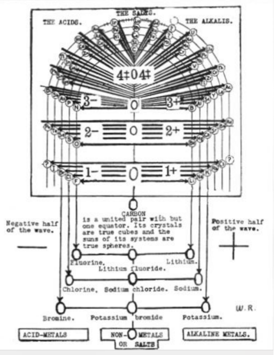
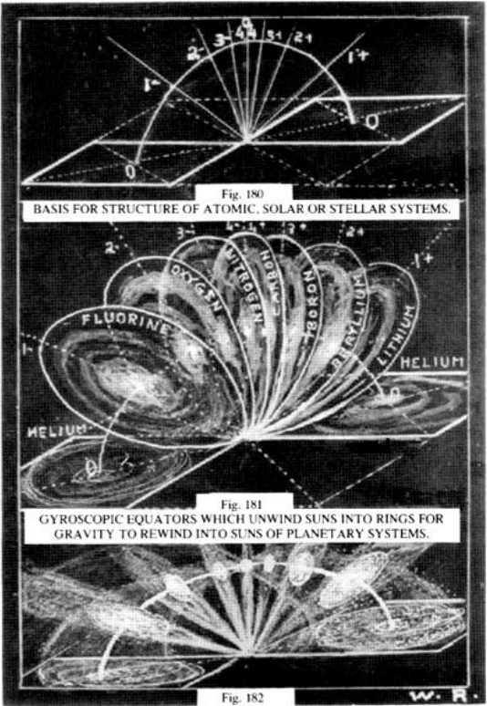

# Russell理论图片

## 正负极的示意(图80)

类似条形磁铁

## 八度波

### 第一步 正负螺旋锥(图81 82)

第一步：两个正负两极对（磁体），正负极吸引，从图81形成图82正负螺旋锥形状

### 第二步 八度波(图83)

第二步：示意正负螺旋锥形成八度波

### 八度波示意(图86)

### 八度波说明(图88)

八度音阶的振动光，构成了物质的元素，由四对音调组成，以零音为中心，从内部控制它们的平衡，并由两个零极控制。

当这两对相等的色调中的任何一对结合时，它们变得稳定--如氯化钠。当它们不结合时，则变得不稳定--如氨基氯和氯。

### 八度波周期叠加(图94)

### 八度波极性示意(图101 102)

### 八度波赤道面(图103)

任何系统，无论是元素的原子还是我们银河系中的太阳系，如果其波幅与其波轴相差90度，其中央太阳是一个真正的球体，其所有行星都围绕其太阳的赤道平面旋转。

## 八度波球

图105-113

图114

Every polorized action-reaction counts up to nine--never more--never less。The wave octave formuls for the elements of matter and the color spectrum is nine--being eight, centered by zero, as follows:

图115

球体只有在八波-菲立德的对角线相交的波振幅上才能达到真正对称平衡的形式。因此，球体内部有八度音，它们向四面八方投射，形成球体的八度音，球体的八度音是三个分开的八度音的父音和母音。

图125

## 其他图

图126 127 129

图130 131 132 133

电流中的力波被中心束缚，就像太阳能和星系被束缚在山中一样，中心力会解除它们的旋转以进行旋转和重现。

图158 159

图160 161

图166 167

图174

图174

图 180 181 182

原子行星系统从它们的零惰性气体中延伸出来，通过一系列四个音调涡旋螺旋上升，这些音调涡旋在物质中被记录下来，成为扩大的球体，这些球体成为真正的球体，其中波在振幅和旋转风的加速中相遇，球体的旋转加速使它们旋转。

