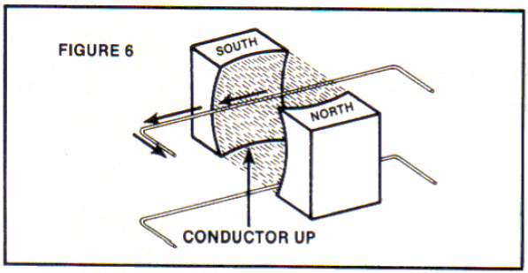
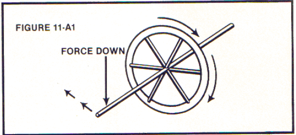
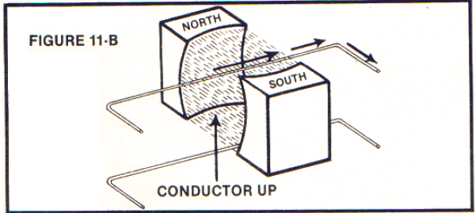
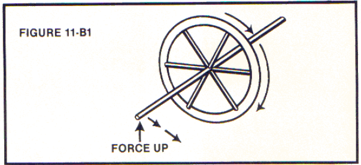
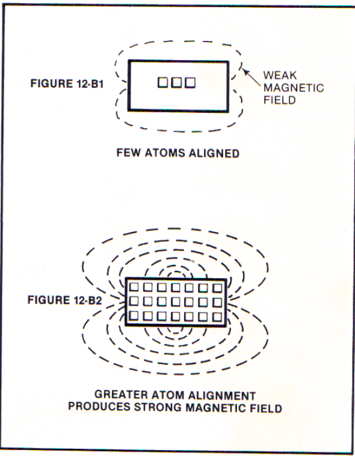

# 第二章 旋涡运动

Chapter 2 GYROSCOPIC ACTIONS

"The way in which Faraday made use of his lines of force in coordinating the phenomena of electric induction shows him to have been a mathematician of high order, and one from whom the mathematicians of the future may derive valuable and fertile methods."

-James Clerk Maxwell

法拉第用力线表示电感应现象展示了他已经是一个有很高水平的数学家，未来的数学家可能从他的方法中得到宝贵和丰富的方法。

-麦克斯韦

I will begin with the scientific facts concerning my initial reading in March, 1965 on the nature of Michael Faraday's Generator.

我将从我在1965年3月开始读的迈克尔-法拉第的发电机中的科学事实开始。

Anyone who cannot recognize the veracity of certain conclusions that I understood when I initially studied Faraday's facts has been unjustly influenced by the teaching process which rewards one for memorization and discourages questioning of the subject matter taught.

所有人都没有认识到某些结论的真像，当我开始学习法拉第的研究时我已经明白了，这些事实被不鼓励质疑鼓励死记硬背的教学过程不公正的影响了。

As you read the following list of experimental facts concerning Faraday's generator, you will retrace the steps of my initial readings during March 1965. With open eyes and an open mind, question for yourself what would happen under the conditions described below.*

当你读下面的关于法拉第的发电机实验事实时，你将追溯我在1965年的步伐。打开双眼打开思想，问你自己在下面描述的情况下会发生什么。

1.Push a conductor wire down and through a magnetic field at right angles to the lines of force and the electric current will flow to the left as drawn.

1.向下移动导线垂直于磁力线穿过一个磁场区域，电流会向左流。

2.Push a conductor up and through a magnetic field at right angles to the lines of force and the electric current flows to the right as drawn (opposite to Figure 1 above).

2.向上移动导线垂直于磁力线穿过一个磁场区域，电流会向右流（和图1相反）。

3.Flip over the magnet 1800 and the direction of the electric current flow will be reversed from that of Figures 1 and 2 above, although the direction and motion of the conductor remain the same (compare Figure 3 to Figure 1 and observe opposite results).

3.将磁体对调 180°电流方向将和图1图2中的方向相反，虽然导线移动方向一样（图3和图1相比，观察相反的结果）。

4.Push the conductor "down" or "up" in a motion parallel to, and through the magnetic lines of force: no electric current will flow despite a vigorous or energetic pushing effort.

4.平行于磁力线上下移动导线：没有电流产生，不论用多大的力。

5.However, although the conductor can be very slowly pushed at right angles to the magnetic lines of force, the resulting electric current will move at the speed of light.

5.然而，虽然导线垂直于磁力线非常缓慢移动，电流将以光速产生。

6.The conductor can be disconnected from the ammeter, flipped over 180°, reconnected to the ammeter to repeat the same motions of the conductor through, and at right angles to the magnetic lines of force (as in Figures l - 3). Identical results of the electric current flow will then be observed even though the conductor has been flipped over 180°. (See Figures 5 and 6: the conductor in Figure 6 has been flipped over 180° from that of Figure 5, yet the direction of current flow is identical.)

6.将导线和电流表断开，对调两端重新连接，重复图1-3的运动，导线垂直于磁力线穿过磁场。产生的电流运动方向没有改变，虽然改变了导线的两端。（看图5和图6：图6中的导线相比图5已经翻转了180°，然而电流的方向没有改变。）

7.The conventional teachings would suggest that the above-discussed electric current flow was a result of electron flow in the conductor and that nothing came from the magnetic field. Also, conventional teachings states that the magnetic lines of force are imaginary, consisting of Potential Energy and no Kinetic Energy. [This claim was believed to be justified because no current flow was observed when the conductor was motionless in a magnetic field. There is no merit to this position when one knows that one can vigorously move a conductor parallel to magnetic lines of force and no current flow will occur.]

7.传统的教学会说上面的讨论的电流是电子在导线中流动的结果，和磁场没多少关系。另外，传统教学规定磁力线是想象出来的，只有势能没有动能。【这种说法被相信是因为导线在磁场中不动时没电流被观察到。这是没有任何价值的，因为当一个人猛烈的平行于磁场线移动一个导线时也没电流产生。】

8.As I studied the above facts of Faraday’s Generator, I concluded that the conventional teachings of No. 7 above were totally incorrect and that such a conclusion completely ignores the known facts presented by Faraday’s Generator.

8.当我学习到上述法拉第的电机的事实，我得出了一个结论，以上7种传统学说都是不正确的，这些学说完全忽视了法拉第的电机中出现的现象。

9.Facts 1-6 above clearly proved to me that a magnetic field consists of:

上面1-6的事实清楚的证明磁场构成如下：

A.Particles which have mechanical characteristics. I asked myself, "How else could these particles 'know' which way to travel and why else would the direction of current flow be so dependent upon the magnetic field and totally independent of the conductor itself?”

A.有力学运动特性的微粒。我问自己，“这些微粒怎么‘知道’向哪条道运动，为什么电流方向这么依赖于磁场而不是导体本身？”

B.Particles moving at the speed of light within the magnetic field. The facts prove to me that one did not impart the velocity of light to electric current flow by moving a conductor slowly through a magnetic field. Rather, the facts demonstrated that the resulting electric current flow consisted of an entity which already traveled at the speed of light. The slow movement of conductor at right angles to that entity had simply mechanically deflected the particle from its normal path. [Such action is similar to that of a bullet being deflected by hitting a metal plate or body of water at the proper angle which results in the bullet being deflected from its original path.]

B.微粒以光速在磁场中运动。这些事实证明电流的光速运动是通过导体缓慢通过磁场产生的。这些事实证明电流由已经以光速运动的实体组成。导体相对这种实体在垂直方向的运动使微粒偏离了它们原来的方向。【这样的运动和子弹通过在正确的角度撞击金属盘子或水体被偏移一样，结果是子弹从原来的路径偏移】

However, I was still puzzled. I asked myself, "Why did the up and down motion of the deflecting conductor produce opposite-direction deflection of this mechanically-natured particle which moved at the speed of light? Why did the deflection reverse when the magnet was flipped over 180°? And why, when the conductor moved parallel to these mechanically natured particles (which were moving at the speed of light), was no current flow produced?" This latter question indicated to me that no proper deflection of the particles occurred in the mechanical position of force of the conductor.

然而，我依然困惑。我问自己，“为什么导体上下运动会使这种以光速运动的机械粒子产生相反的偏移方向。为什么当磁场翻转180°偏移方向相反了？为什么当导体平行于这些微粒（以光速运动）运动时没有电流产生？”这些之后的问题指示给我，在导体的力的位置没有合适的微粒偏移发生。

Also, I asked myself, "When the conductor was motionless in the magnetic field (consisting of particles with mechanical characteristics and moving at the speed of light), why was no current flow produced?" This observation indicated that there was no proper deflection of the particles occurring in the mechanical position of the conductor.

同时，我问自己，“当导体在磁场（由有力学特性的以光速运动的微粒组成）中没有运动时，为什么没有电流产生？”这个观察指明，在导体的力的位置没有真正的微粒偏移发生。

10.Summation of my thoughts in the early months of 1965:

10.1965年前几个月的总结：

Faraday had invented an important invention - the electric generator - but he had invented an inefficient invention because one always obtained less energy from a system than the energy put into that system: yet, the facts clearly showed that the system consisted of an orderly flow of Kinetic Energy. This Kinetic Energy consists of a mechanically-oriented particle which moves at the speed of light. Therefore I knew that in order to construct the proper technological mechanism which could utilize this energy, I must simply understand the essence of the entire system.

法拉第已经发明了一种重要的发明-发电机-但他也发明了一种无效率的发明，因为总是从系统中得到的能量比输入系统的少：但是，事实证明系统由有序流动的动能组成。这种动能由以光速定向运动的微粒组成。因此我知道，为了构建能正确利用这种能量的科学装置，我必须理解整个系统的本质。

In addition to making my living by other successful inventions, the next three years consisted of thousands of hours of testing, studying, and thinking to search for the truth concerning the nature of this mechanically­ oriented particle. During this time, the same question dominated my thoughts: How did the particles of a magnetic field "know" which way to travel? In retrospect, the answer is extremely simple, but seemed very difficult to me at the time since I had never taken a physics course and had been teaching myself many varied subjects.

除靠另外一个发明谋生外，以后的三年我用了几千个小时来实验、学习、思考，研究关于这种机械粒子的的原理。在这段时间，同一个问题在困扰着我：磁场粒子如何“知道”走哪个路径？回想起来，答案是如此简单，但似乎对我来说太难了，因为我从没有上过物理课也没有自学那么多科目。

At this time in my life, I began to work on another invention consisting of a flywheel which acted as a "mechanical storage battery" for a bicycle. This flywheel caused the bicycle to automatically react as a "wheelie.”  Such "stored mechanical energy" within the flywheel suggested to me the stabilizing influence of a gyroscope. I then became fascinated with understanding the essence of the gyroscope and thereafter I learned the answer to the questions dominating my thoughts concerning the explicit, mechanical characteristics of the particles comprising a magnetic field and traveling at the speed of light.

我生命里的这段时间，我开始研究另一个发明，它由一个飞轮组成，就像一个自行车的“机械存储电池“。飞轮引起自行车自动产生一些特技反应。这些飞轮中“存储的机械能”暗示我陀螺仪的稳定影响。我之后沉迷于对陀螺仪本质的理解，之后这找到了我一直关心的问题的答案，关于组成磁场的以光速运动的粒子的力学特性。

11.These particles consist of a gyroscopic mechanical action which can be operationally (mechanically) understood and predicted! Let the following facts prove or disprove this Theory: 

11.这些粒子以陀螺仪方式运动，这可以用于真实的理解和预测一些事！这下面的事实证明或推翻这个理论：

Figure 11-A Move a conductor down at a right angle to a magnetic field and the current flow moves left.

图 11-A 在正确的角度向下移动一个导体，产生向左的电流。

Figure 11-A1 Apply a downward force to the axis of a spinning gyroscope and it will pivot at a right angle to the force (in this case pivot left). Now imagine that this gyroscope has a forward direction at the speed of light.

图 11-A1 给个旋转的陀螺仪的一端一个向下的力，它会在垂直于力的方向在枢轴方向进动（在这里是向左移动）。现在想象这个陀螺仪以光速向前运动。

THE ANALOGY OF THE ABOVE TWO EXAMPLES IS SCIENTIFICALLY EXACT!

类似上面两个的例子同样科学精准！

Figure 11-B Move the conductor "up" at right angles to the magnetic field and the current flows right and opposite to Figure 11-A above.

图11-B 垂直于磁场区域向上移动导体，电流向右流，和图11-A相反。

Figure 11-Bl Apply an upward force to the axis of the spinning gyroscope and it will pivot at right angles to the force. In this case, the gyroscope pivots right and opposite to Figure 11-A1 above. Now imagine that this gyroscope has a forward direction at the speed of light.

图 11-B1 给个旋转的陀螺仪的一端一个上的力，它会在垂直于力的方向在枢轴方向进动（在这里是向右移动）。现在想象这个陀螺仪以光速向前运动。

AGAIN, THE ANALOGY OF THE ABOVE TWO EXAMPLES IS SCIENTIFICALLY EXACT!

Figure 11-B Flip the magnets over 180° and repeat the actions of Figure 11-A above. The current flow direction will be right and opposite to that of Example 11-A even though the force direction is the same.

图 11-B 对调磁场方向重复图11-A中的动作。电流方向向右，和11-A相反，虽然力的方向一样。

Figure 11-C1 Flip the spinning gyroscope over 180°. Repeating the actions of Figure 11-Al above, the gyroscope will pivot at right angles to the force,  but will now pivot  right and opposite to that of Figure 11 –A1 above, even though the force  direction is the same. Now imagine that this gyroscope has a forward direction at the speed of light.

AGAIN, THE ANALOGY OF THE ABOVE TWO EXAMPLES IS SCIENTIFICALLY EXACT!

Figure 11-D Repeat the actions of Figure 11-B and the current flow will be left and opposite to Figure 11-B even though the force direction is the same.

图11-D 重复图11-B的运动，电流将向左流动，和图11-B相反，即使力的方向一相同。

Figure 11-D1 Repeat the actions of Figure 11-Bl: the gyroscope will pivot at right angles to the force, but will now pivot left and opposite to Figure 11-B1 even though the force direction is the same. Now imagine that this gyroscope has a forward direction at the speed of light.

图11-D1 重复图11-Bl的运动：陀螺仪将垂直于力的方向进动，但将向左进动，和图11-B1相反，即使力的方向相同。现在想象陀螺仪以光速向前运动。

AGAIN, THE ANALOGY OF THE ABOVE TWO EXAMPLES IS SCIENTIFICALLY EXACT!

Figure 11-E Move the conductor vigorously "up" and “down" through the magnetic field, maintaining the conductor force parallel to the magnetic tines of force and no current flow will result.

图11-E 快速的上下移动导线穿过磁场区域，保持导线和磁力线平行，没有电流产生。

Figure 11-E1 Apply an "up" and "down" force parallel to the axis of the spinning gyroscope. Regardless of how energetically the force is applied, as long as the force remains parallel, the gyroscope will not pivot even though it has a forward motion at the speed of light.

图11-E1 施加一个平行于自旋陀螺仪轴上下的力。不管力多大，只要力平等于陀螺仪的轴就没有进动的发生，即使它在以光速向前运动。

AGAIN, THE ANALOGY OF THE ABOVE TWO EXAMPLES IS SCIENTIFICA LLY EXACT!
"These particles consist of a 'gyroscopic mechanical action ' which can be operationally (mechanically) understood and predicted!”

“这些粒子以陀螺仪方式运动，可以解释和预言很多事实！”

F. The reason that a stationary conductor in a magnetic field (generated by and consisting of gyroscopic particles spinning and moving at the speed of light) does not produce current flow is very simple. The fundamental Laws for the Mathematics of Probability (Statistics of Large Numbers) states that as many of the gyroscopic particles will pivot left as pivot right due to the random motion of the atoms comprising the conductor. Such action causes a cancellation effect. The same is true if, from all directions, one randomly applies a force to the axis of a spinning gyroscope. It simply will not pivot if the random forces are fast.

F.在一个磁场（由的陀螺仪式的粒子以光速旋转和运动产生）中一个静止的导体不产生电流的原因很简单。统计学说明大量的陀螺仪式粒子将向左或右进动，归因于导体中原子的无规则运动。这种运动会抵消效果。如果从各方向施加力到旋转陀螺仪的一端也是一样的。如果随机的力很快，它将不会进动。

AGAIN, THE ANALOGY OF THE ABOVE TWO EXAMPLES IS SCIENTIFICALLY EXACT!

G. When one brings a conductor "down" or "up" at right angles to a magnetic field, the random motion of the atoms within the conductor does not affect the system because there is a general drift direction of the "up” and "down" force applied to the gyroscopic particles comprising a magnetic field. This effect is similar to an airflow consisting of gas molecules in random motion within the airflow, but also possessing a general drift direction which will apply a force to a windmill, etc. If the airflow ceases, however, the windmill will not turn even though the molecules of gas - while still moving at high velocities - are nonetheless in a random motion which cancels the force applied to all sides of the windmill.

G.当相对于磁场在一个正确的角度上下移动导体时，导体内的无规则运动的原子不影响整个系统，因为一个大致的上下方向的力作用于组成磁场的陀螺仪粒子。这种效果和气流相似，气流由无规则运动的气体分子组成，但一个大致的方向可以带动风车等。然而，如果没有气流风车不会转动，即使气体分子依然以很高的速度在运动，但无规则的运动会抵消作用于风车的作用力。

The same effect is true if one applies a random force to the axis of a gyroscope. If the random force has a given drift direction of force, the gyroscope will pivot at right angles to that drift directional force.

给陀螺仪的一端一个无规则的力效果是一样的。如果无规则的力有一个大致的方向，陀螺仪将垂直于力的方向进动。

AGAIN, THE ANALOGY OF THE ABOVE TWO EXAMPLES IS SCIENTIFICA LLY EXACT!
At this point in time, the facts I had assembled had convinced me that my initial thoughts in 1965 were indeed correct. A magnetic field does consist of discrete particles which move forward at the speed of light and possess mechanically-identifiable characteristics which are identical to those possessed by a gyroscope. Such characteristics can be mechanically understood and predicted.

这时，我收集到的实事使我深信不疑我1965年的想法是正确的。磁场是由不相连的粒子组成，它们以光速运动，有明显的力学特性，和陀螺仪的特性一致。这样的特性可以被力学的理解和预测。

By this time, however, I also mechanically explained other questions which I had conceived regarding the nature of a magnetic field. Questions such as:

这时我同时力学的解释了另一些问题，我设想的关于自然界中的磁场。问题如下：

Why, in a mechanical sense, does a magnet attract and repel other magnets?

在力学的意义上，为什么磁体会吸引和排斥别的磁体？

Why, in a mechanical sense, do electric charges attract and repel?

在力学的意义上，为什么电荷会吸引和排斥？

What is the energy in a magnetic field and what is its source?

磁场中的能量是什么，它们的源头是什么？

Did the energy used in creating a permanent magnet have any bearing upon the strength or energy contained within a magnetic field emitted from the permanent magnet once it was made?

制作永磁体的能量和一但永磁体制作完成而发出的磁场中的能量或力量有关？

12.In the early part of 1965, I eagerly researched the known facts concerning the creation of a permanent magnet. Because I instinctively knew that if the strength of a magnetic field was solely relative to the energy input, then I would know I was incorrect. But if the strength of the magnetic field was independent of the energy input, then I would be even more assured that I was correct. 

12. 在1965年早期，我深入的研究了已知的关于制作永磁体的事实。因为我本能的知道，如果磁场的强度只和输入的能量相关，那么我将是错的。但如果磁场强度和输入能量无关，那么我将更确定的我正确性。

Upon examining the known facts concerning permanent magnets, I again knew I was correct and such facts are listed as follows:

通过上面对关于永磁体已知事实的调查，我又知道我是正确的，这些事实列在下面：

A.For a given energy input into varying materials of identical volume, the generated strength of the magnetic field varies drastically!

对于给定的输入能量和各种相同质量的材料，产生的磁场强度是变化非常大！

The same electrical energy input created extremely variable field strengths! I therefore instantly knew that the strength of the magnetic field had to be a result of the nature of the atoms comprising the material and not a result of the electrical energy input.

同样的电能输入创建了各种各样的场强！因此我马上知道，磁场强度一定是组成材料原子的自然结果，而不是电能输入的结果。

B.The facts further demonstrated that the strength of the magnetic field was observed to increase as more atoms within the material became aligned!

事实证明磁场强度被观察到和材料的原子数量成线性正相关！

FACT B therefore further corroborated FACT 12-A above as being correct.
C.The facts also taught that once the maximum atom alignment of a given material was achieved, then no amount of electrical input would continue to increase the magnetic field of that material! (See Figure 12-B2 above.)

事实同样说明，一旦给定材料的原子完全排序完成，输入再多的电能也不会增加材料的磁场强度！

It was obvious to me from this conclusion that the strength of the magnetic field of a given material was not relative to the electrical energy input. Once the maximum atom alignment of a material was achieved, one could increase the energy input 1000 times and there would be no increase in the strength of the magnetic field of the permanent magnet. Therefore, FACT 12-C further corroborated FACT 12-A above.

这个结论明显的告诉我，磁场强度和输入的电能无关。一旦给定材料的原子完全排序完成，输入能量大1000倍永磁体的磁场强度也不增加。因此，上面的事实12-C进一步证实了12-A。

D.The facts also taught that if one took a permanent magnet (such as in Figure 12-D1 below) which has a strong magnetic field and heated the magnet to its Curie temperature, the magnetic field would virtually disappear! (See Figure 12-D2 below.)

事实同样说明如果一个人将一块有很强磁场强度永磁铁加热到它的居里温度，磁场将消失于无形！

Again, it was obvious to me that the magnetic field disappeared in Figure 12-D2 because the heat input created a random atomic motion and non-alignment within the material. One can clearly see that in Figure 12-D2 one is transferring energy into the system of the magnetic material, i.e., one is not taking energy from the magnetic material and yet the magnetic field virtually disappears.

对我来说这是很显而易见的，图12-D2的磁场消失，因为加热使原子无规则运动，材料中没有了排序。可以清楚的看到图12-D2中，传入能量到磁体材料系统中，从中没得到磁体材料上的能量，可以磁场消失于无形。

13.The conclusions which I drew from the above FACTS l- 12D clearly proved to me the following:

从上面FACTS 1-12D中得到的结论清楚的证明下面的结论：

- A.The energy in a magnetic field is the energy which comprises the component parts of the atoms from which the energy comes!
- B.The energy in a magnetic field is therefore literally Einstein’s Equation of E = MC2 !
- C. The energy in a magnetic field must be moving in a direction at the speed of light and must also have a gyroscopic spin at the speed of light: herein lies the mechanical essence of $E = MC^2$ !

- A.磁场能量来自原子中的组成部分！
- B.磁场中的能量真正的符合爱因斯坦的方程 $E = MC^2$ 
- C.磁场中的能量一定在一个方向上以光速运动，一定是以光速陀螺仪式的快速旋转：这是 $E = MC^2$ 力学的本质！

The Kinetic Energy of a moving particle is 1/2 MV2. If the particle is moving with speed V and also rotating about its axis at speed V,  then the total Kinetic Energy is 1/2 MV2 (for forward motion) plus  1/2 MV2 (for the rotational motion [not  1/2 Iw2]) which equals MV2 . If V is equal to C, then the total Kinetic Energy is equal to MC2 (Hypothetically, this particle is mathematically an infinitely small entity which, in a literal and mechanical sense, moves laterally and rotationally to generate a gyroscopic \[spiral\] helix effect.)

运动中的粒子的动能是  $1/2 MV^2$ 。如果粒子以速度V运动并绕轴线以V做圆周运动，总动能是$1/2 MV^2$前进运动）加$1/2 MV^2$圆周运动[不是 $1/2 Iw^2$]）等于MV2。如果V等于C，总动能是 $MC^2$（假想，粒子是算术无穷小的粒子，在字面和力学意义上，横向旋转运动产生陀螺仪螺旋效果）。

D.The literal and mechanical configuration of a magnetic field is simply a result of the summation of atom alignment within the material from which the magnetic field is generated.

D.字面和实际磁场的结构只是生成磁场的材料原子排序的总的结果。

E.At Dhis time, I had also mechanically explained why electric charges as well as magnets attracted and repelled. (Conventional teachings only state that "like" magnetic poles repel and "unlike" magnetic poles attract. It is also said that "like" electrical charges repel and "unlike" electrical charges attract. This is a superficial analysis.) The answer to such attraction/repulsion is simple. The gyroscopic spin has a mechanical action which causes the observed results and can be mechanically understood and predicted.

E.这时，这已经力学的解释了为什么电荷也和磁体一样会吸引和排斥。（传统教学只说“同”极排斥，“异”极相吸。也说“相同”电荷排斥“相异”电荷吸引。这是肤浅的分析。）吸引/排斥的答案很简单。陀螺仪式旋转会产生一种力学行为，这引起观察到的结果并可力学的理解和预测。

F.The same conventional and superficial analysis was also applied to electric charges, i.e., "like" charges repel and "unlike" charges attract. My mechanical explanation concerning electric charges was developed 3/2 years before I understood the gyroscopic composition of magnetic fields. In essence, I mechanically viewed the electric charges as rotating arrows similar to the mechanics of gear interaction. This enabled me to easily envision and draw the mechanical effects of attraction and repulsion. However, I did not call this mechanical effect of attraction and repulsion a gyroscopic effect since (at that time) I had still not studied gyroscopes. Upon understanding gyroscopes, I instantly understood that the mechanics I had originally drawn for electric charges was a gyroscopic action. The fact that the same mechanical explanation for gyroscopic action explained both magnetism and electric charges made me even more certain of the correctness of the mechanical explanation. [Electric charges consist of millions (plus) of gyroscopic particles and such charges will be discussed in more detail in a later chapter (Sections 29 A-M) discussing gravity.] At this point, you should first intellectually master the concept and mechanical nature of magnetism.

F.同样传统浅显的分析也用于电荷，“相同”电荷排斥“相异”电荷吸引。我的关于电荷的力学的解释在一年半以前，在我理解磁场陀螺仪式的组成以前。本质上，我力学的把电荷看作旋转的箭头，和机械中的齿轮运动相似。这可以让我很容易想象的画出吸引和排斥的力学效果。然而，我没有把这种吸引和排斥的力学效果叫做陀螺仪效果，那时我还没学习陀螺仪理论。自从理解了陀螺仪，我马上理解我原来对电荷描绘的力学是陀螺运动。实际上，对陀螺仪的力学解释同样是磁场和电荷的力学解释，使我更加确信这种力学解释的正确性。\[电荷由无数陀螺粒子组成，这样的粒子将在后面讨论重力时详细讨论。\]这时，你应该第一时间熟知这个观念和磁性的力学原理。

The following two pages of drawings describe MAGNETS IN REPULSION and MAGNETS IN ATTRACTION, (as  well  as electrical  repulsion  and attraction),  visually explaining  the discussion  in  13 A-E. These drawings have been unselfishly produced for me by_ Mr. Evan R. Soule', Jr. (talented artist and teacher). See also the following pages presenting a Technical Description of the drawings. This Technical Description was also unselfishly written by Mr. Evan R. Soule', Jr. from information developed by me, with the purpose being that if Mr. Soule' could understand what I have taught, then as an experienced teacher he could put forth this information so that you, the reader, would also understand.

下面的两页图描述排斥的磁场和吸引的磁场，（同样适用于电荷的吸引与排斥），解释13 A-E的讨论。这些图是Mr. Evan R. Soule', Jr.（天才的艺术家和老师）无私制作的。下面还有图的技术说明。技术说明同样是Mr. Evan R. Soule', Jr.根据我发布的信息无私的写的，我发布信息带着这样的目的，如果Mr. Soule'能理解我所说的，那么一个经验丰富的教师能传播这些信息，这样你、读者都将可以理解。

