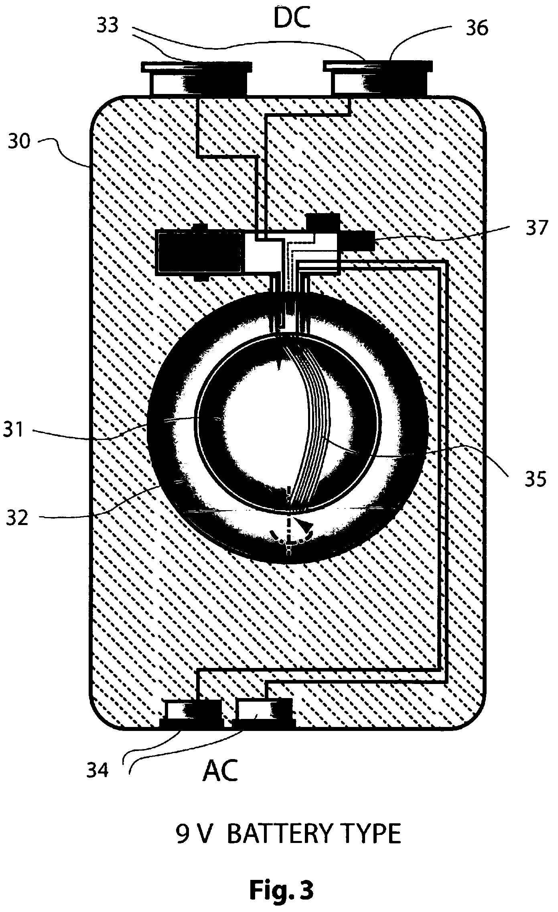
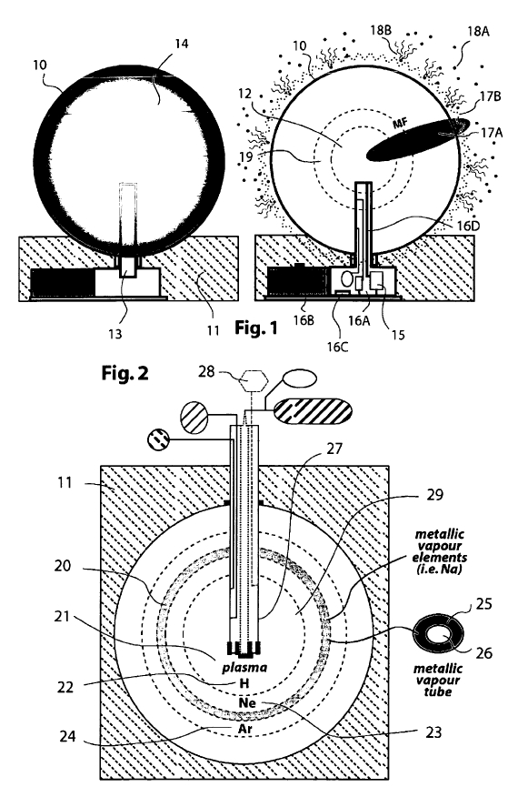

# 微型等离子反应器

Micro plasma reactor

A fixed or handheld micro-plasma-reactor can be build-in, connected with and/or inserted into various electrical/electronic devices (i.e. mobile phones, computers), in various objects (i.e. lighting devices in general, light bulb, microchips, IC’s), in various container types (i.e. cooking pan) and all type of machines, i.e. Vacuum cleaner, pumps, electrical car, etc., to generate DC current and/or AC, and consequently the various uses resulting from electrical current, for lighting, for heating/cooling, and desired process (i.e. creation magnetic fields).

一种可以生成直流电流或交流电的固定或掌上电脑微-等离子体反应器，可以外接或者插入应用到各种电气电子设备中（即手机，计算机），各种电器（即一般照明设备、灯泡、微芯片、IC）,各种加热容器（即电磁炉）和所有类型的机器（即真空吸尘器、泵、电动汽车等）。并因此产生的电流用于照明，加热/制冷和所需的过程（即创建磁场）。

The self-sustaining plasmatic process gives independent functioning without connections to any electrical power network, solar cells or the need to recharge. New type of products will be created. Different type of micro reactors are decribed, and new methodes of technology.

等离子磁场的自维持技术，使其可以独立产生作用，而不必同任何电网，太阳能电池连接，也不需要重新充电。新类型的产品将被创建。这是不同类型的微核反应堆技术的延伸和新方法。

图3    9伏电池模型

- 30 微等离子电池本体。
- 31 反应堆的外层。 
- 32 反应堆外壳。 
- 34 交流电。 
- 33，36 直流电。 
- 35 至少一个固定的线圈。 
- 37 存储例如放射性物质，液态氦等物质的容器。

专利正文：

1  We refer to the priority European patent application Nr. 05447221.2 / EP 05447221 dated October 3,2005, introduced by the same inventor.

我们的专利是欧洲专利申请号 05447221.2/EP 05447221  于2005年10月3日，由相同的发明家推出。

2  In above mentioned patent application an extensive description and several claims were made related to new plasma reactors.

在上述专利申请中，就各种新型的等离子反应器作了广泛的说明并提出了一些权利要求。

This new patent-application contains many of the basic ideas disclosed and claimed in EP 05447221 in more detailed way or in variations. There are also methods described which were not disclosed in the abovementioned patent application. This invention relates to an energy producing system, method, concept and technology whereby in a reactor-embodiment a chain of energetic events is created via a rotative magnetic initiation of a basic ionization of a gas (i.e. hydrogen) or other matters, which then triggers a controllable chain of energy transfers (so called scintillation) to the next following layer(s) of introduced gasses (i.e. He, Ne, Ar, Kr, Xe) and all other introduced elements of the periodic table (i.e. Li, Be, K, Ca, Ti, ...Pt, etc.) and/or their introduced molecule combinations (i.e. vapor). We show now also that injection of specific liquid metallic elements has advantages.

这个新的专利申请，包括了许多在EP 05447221专利中已揭示的基本思想和权利要求，并进一步或以不同的方式做了更详尽的阐释。这里也有一些方法，是在上述专利申请中没有提及的。这项发明涉及到能源生产的系统、 方法、 概念和技术，**在微型等离子体反应堆中产生一连串的激发事件，通过旋转磁场产生了一个基本的电离气体（如氢）或其他物体，然后触发一个可控的链式能量转移（也称为闪烁）触发它到以下已知的气体层（如i.e. He, Ne, Ar, Kr, Xe）和其他元素周期表中已知的物质（如i.e. Li, Be, K, Ca, Ti, ...Pt, etc.）**。在这里可以看到，即使注射入特定的液态金属元素，也能起到有益的作用。

3  The technology for creation of light and heat using the principal of creation of energy of the system using the principal of the patent, mainly can utilise the single magnetic field or more magnetic field principal of the patent.

这项技术是利用造物系统的能量即单一磁场或多磁场原理来创造光能和热能的专利。

4  The double magnetic fields effect for higher current production is an alternative.

双磁场效应可产生更强的电流，是另一个可供选择的方法。

5  The other alternative will be the use of the lighting and the heating in the caroline core for the creation of the extreme ultraviolet light with or without transparent inner and outer core wall, or the use of this ray inside the rector core for lithography is possible.

其它的选择是使用凯若琳核心的照射和加热性能，产生极限紫外光，而核心的内外壁可以由射线透射材料构成，也可以不需要内外壁，或者在反应器核心中使用该射线，或者使用平板印刷也是可行的。

6 The creation of the ionisation which can lead to current that in conjunction with the matters in the core of the reactor can lead to creation of the single at least one dimension or more this being three dimensional spherical or any other shape magnetic field, which can cross the boundaries of any core, this being made of any material, this being plasma, gas or other states of matter, that the interaction between the magnetic field of the caroline core or any other layers of the cores of the reactor, in interacting with the charge particles, which could be deliberately created, by means of tube , or paint or lamination, in the vicinity of the core or the charge particles in the atmosphere around the core, to create heat or light, through the principal of the interaction of charge particles with a magnetic field.

电离的产生可引发电流，该电流连同反应器核心中的各种物质一起，导致了单一的，至少是一维或多维的，如三维球状或任何其它形状的磁场的产生，该磁场可穿越任何核心的边界，这个可由任意材料制成，可以是等离子体，气体或其它形态的物质，反应器的凯若琳核心或任何其它的核心层之间的磁场的互动，与带电粒子产生相互作用，该作用可通过管道，或喷涂，或叠层的方法，在核心附近或核心周围空气中的电粒子中，让其精确地产生，通过电粒子与磁场互动的原理，以生成热和光。

7  In this system using the principal introduced in the creation of the reactor in the main patent application N°05447221.2 / EP 05447221 the materials can be introduced through or positioned in different parts of the core by means of saddling or empty chambers or floating cavities or loose balls created by any means or through any method, in the/ or on the central column or any position in at least one core of the reactor, the material individual form like atomic or plasma or others , or compounds like molecules or as compound of different atoms or molecules or any other form from plasma or energy package to solid, can bee used for the containment and material for the core or production of new materials.

在这个系统中，主要运用在专利申请N° 05447221.2 / EP 05447221中介绍的反应器创建原则，各种材料可以通过不同方法馈入或被置入核心的不同部分，在中心圆柱之中或之上，或在反应器的至少一个核心中的任意位置，这些方法可以是使用任何手段或方法制造的鞍形填料，或空盒，或浮动的空腔，或游离分散的球体。材料各自的形状，类如原子的，或等离子体的，或其它形式；或混合物，类如分子或不同原子或分子的混合物；或任何其它形式，从等离子体或能量束一直到固体，都可用于维持和用作核心物质材料，或用于产生新的物质。

8  Where the matter can be allowed to be in any gravitational conditions, this being from zero to maximum gravity that a system could attain through its design. 

这里，物质可以处于任意的引力环境中，可以是系统通过设计能够获得的，从零重力到最大的重力。

9  A large potential market is open for small plasma reactors. The embodiment can be any material, but for prototyping we use standard steel. In applications such as for lamps a part of the body will be glass or another transparant material (i.e. a synthetisch composite).

小型等离子反应器，有广阔的潜在市场。制造实际装置可以使用任意材料，实验样机我们用的是标准钢材。在一些应用中，如灯的应用，装置的一部分将是玻璃或另一种透明材料（即，一种合成复合材料）。

10  We disclose a fixed or handheld micro-plasmareactor (10 + 11) which can be build-in, connected with and/or inserted into various electrical/electronic devices (i.e. a refrigerator, various kitchen, household and professional devices, cool box, mobile phone, computer, medical apparatus, laser, satellite systems, desalination unit, desert air-to-water-transformer collecting units, EMwave transmitter, etc.).

Such micro-plasma-reactor can also be incorporated in various objects (i.e. lighting devices in general, light bulb, lamp, torch, light strip, light beam, flood light, floor light, door light, garden light, traffic-light, street-lighting, signalization, meter, sensor, heat-generating clothes, space clothing, pillow, connector, wire, conductors, semi-conductors, microchips, IC’s, magnetic locks, etc.). A micro-plasma-reactor may also be incorporated or used in various container types (i.e. box, cooking pan, drum, 40 FT, greenhouse, etc.). Many applications are possible for all type of machines, i.e. vacuum-cleaner, ventilator, calculator, drill, mixer, wheel-chair, pumps, carpenter tools, electrical car, electric bike, radio, office machines, etc. The purpose of the micro-plasma-reactor can be to generate DC current (similar to a battery) and/or AC current or combination of DC and AC-current, and consequently the various uses resulting from electrical current.

我们见着了一个固定或手持微型等离子体反应堆（10+11）。这个反应堆可以连接或插入各种电气/电子设备（例如，一台冰箱，各类厨房，家庭和专业设备，低温箱，手机，计算机，医疗器械，激光，卫星系统，海水淡化装置，沙漠空气 - 水变压器收集单位，电磁波发射器等）。这种微等离子体反应堆也可以被纳入不同的对象（即在一般的照明设备，灯泡，灯，电筒，光带，光柱，投光灯，落地灯，门灯，庭院灯，交通灯，路灯-照明，灯号，仪表，传感器，产生热量的衣服，空间的衣服，枕头，连接器，电线，导体，半导体，芯片，集成电路，磁力锁等）。它也可能被使用在不同的容器类型（即盒，蒸煮锅，桶，40英尺，温室等）。许多应用可能为所有类型的机器，如真空吸尘器，风扇，计算器，钻，混频器，轮椅，泵，木工工具，电动车，电动自行车，收音机，办公设备等。微等离子体反应器的目的是可以产生直流电流（类似电池）或交流电流或直流和交流电流的组合，因此可以产生各种用途的电流。

11  A micro-plasma-reactor can be used also for lighting and for heating/cooling, but also to maintain at least one desired process (i.e. the creation of one or more magnetic fields, two magnetic fields used for creating magnetic locks, etc.).

Due the self-sustaining process the operation will last for a long period of time (i.e. 5 years), which can make the abovementioned functioning in devices, objects, containers and machines possible without that they are connected to an electrical power network, without being equipped with solar cells or to any other manner of traditional power source, and/or without the need to recharge. This brings a complete new way of use of traditional products and concept, but also new type of products will be created.

一种也可以用于照明和加热烹饪的微型等离子反应器，也可以至少保持一种希望的作用（即，产生一个或多个磁场，两个磁场用于生成磁锁定或磁同步等等。）

**由于自维持作用，该装置的运行将持续很长时间（即，5年），这可使安装在各种设备，物体，容器和机械之中的这种装置，能够发挥上述功能，而无需同电网连接，无需由太阳电池供电，或与任何其它形式的传统电源相连接，和/或者无需再充电。这在应用传统的产品和概念上，带来一种全新的方式，而且新型的产品也将被创造出来。**

12  We describe now two specific micro-reactors. The first micro-plasma-reactor has at least one closed, internal fixed reactor chamber in which at least one inert gas (19, 23, 24) or any other gasses or elements or isotopes or other matters is present, like Hydrogen (H) (22) or liquid Helium (He), and in which the inside chamber wall(s) is equipped with at least one layer and/or zone of one or more radioactive material(s) that will provoke scintillation.

The second micro-plasma-reactor has at least one reactor chamber in which at least one inert gas or any other element or isotope is present, like liquid Helium (He), to which a very light radioactive material (i.e. a dilution, granules, dust) is added that will provoke scintillation. But in these two micro-plasma-reactors - additionally - at least one atomic gas, metallic material vapour (20, 25) and/or liquid state element of the periodic table can be added, in example: Potassium (K), Sodium (Na), Stratum (Sr) for high temperature operations above 1000K, etc.;

现在我们描述两种特定的微型反应器。第一种微型等离子反应器，具有至少一个封闭的、内部的、固定的反应器腔室，腔室中至少具有一种惰性气体（19，23，24），或者任何其它的气体或元素，或同位素，或其它物质，例如氢（H）（22），或液态氦（He），另外在单层或多层腔室壁中，至少设置由一种或多种放射性材料构成的一个层和/或区，该层或区将诱发火花闪烁。

第二种微型等离子反应器，具有至少一个反应器腔室，腔室中至少具有一种惰性气体或者任何其它的元素或同位素，例如**液态氦（He），其中加入了一种极轻的放射性物质（即，一种稀释物，细粒，尘粒），用于诱发火花闪烁**。但是在这两种微型等离子反应器中，另外至少还要加入一种原子的或微量的气体，金属材料气化物（20，25），和/或周期表上的液态元素，例如：钾（K），钠（Na），锶（Sr），用于温度在1000K以上的高温运行，等等。

13  We claim and describe here also a new method by which in a plasma reactor chamber at least one metallic material vapour (20)(i.e. K, Na, Ca, Mg) or liquid metallic element layer is brought by injection means between at least two layers of inert gasses (i.e. H, He, Ne, Xr), what will create - without rotation or adjustable speed of rotation and if the correct element combinations are used - a magnetic field by the added metallic type layer (s) (in example: element Sodium between Neon 20 and Argon 40, or 41) causing a recurring process of creation of magnetic field, where for example if atomic Potassium is used in the reactor, this element through beta decay lead to creation of Argon and the by-product of scintillation for example Neon gas or the Argon itself leading to ionization of the gasses (i.e. Hydrogen) leading to creation of free electron for creation of current and establishment of plasma within the caroline core.

This new method makes it possible to create magnetic field (17A) within the caroline core (12) with the use of metallic or semi-metallic materials in the form of vapour or solid or any other state of matter in between different layers of the material which their motion within the core can lead to creation of magnetic fields due to the passing of the electrons which created by ionization passing through this metallic or semi-metallic material which is in rotation within the core, and this is a self-sustaining energy system or battery system which the life of the battery can be predetermined by the atomic count of all matters in the core.

这里我们也提出和描述了一种新的方法，按照这种方法，在一个等离子反应器腔室中，至少一种金属材料气化物（20）（即，K，Na，Ca，Mg）或液态金属元素层，通过在至少两个惰性气体层（即，H，He，Ne，Xr）之间的注入方法被引进其中，在没有旋转和可调旋转速度，并使用了正确的元素混合时，在加入金属形式的层后（例如，在氖20和氩40，或41之间的钠元素）生成的一个磁场将产生什么？ 将导致磁场不断的生成过程，这里，举例来说，如果在反应器中使用了原子钾，这种元素通过贝塔衰变，产生了氩和火花闪烁副产物，例如氖气，或者，氩气自身导致气体（即，氢）的电离，结果产生了自由电子，为在凯若琳核心中创造电流和创建等离子体提供了条件。
 
 这种新的方法，通过在不同的材料层之间，以气化物或固体或任何物质状态的形式使用金属或半金属材料，使在凯若琳核心中创造磁场（17A）成为可能。这些材料在核心中的运动，导致了磁场的产生，原因是电离产生的电子，流过了在核心中旋转的那些金属和半金属材料，这是一种自维持的能源系统或电池系统，而电池的寿命，可预先由核心中的所有物质的原子数量来决定。

14  We describe here and claim a new method of creating magnetic fields in the reactor by introducing special transparent saddling means where heavier elements (i.e. Uranium vapour) in the shape of plasma (21) or vapour or any other state of matter can be positioned irrespective to the atomic weight in between different gas layers or matters which by means of deliberate pumping of rotation of the material within the saddle due to passing of the electrons through the saddle media electromagnetic fields can be created. This method through which high-level magnetic field and consequently high gravitational field forces can be created at low temperatures in the caroline core or in another core can be created, which the magnetic field created can be utilized for high power lamps (i.e. flood lights), or for the creation of strong magnetic fields necessary for shielding, intensive lighting (18B) and high heating (17B).

这里我们描述和提出一种新的在反应器中产生磁场的方法，即通过引入特殊的透明鞍式支架，这里，较重的元素（即，铀气化物）以等离子体的形式（21），或任何其它物质形态的气化物，不管原子量是多少，都可以被置于不同的物质气体层之间，通过电泵精确控制支架内物质的旋转，由于电子流过支架，结果产生了电磁场。使用这种方法，可在较低的温度上，在凯若琳核心或在另一个核心，产生高强度的磁场，和因此而生成的更强的引力场，产生的磁场可用于高能量灯（即，泛光灯），或生成用于防护，高强度照明（18B）和高温加热（17B）的强磁场。

15  This method can be applied on a special plasma reactor where the saddle is tubular (25) and this leads to the creation of the condition for tubical magnetic field where materials (like amino-acids or dark matters) could be created within the inner hollow tubical (26) body of the saddle where the magnetic field is created in the outer layer of the tube within the layers of the reactor core.

这个方法可用于一个特殊的等离子反应器，这里，支架是管状的（25），这为产生管状磁场创造了条件，这里，各种物质（如氨基酸或暗物质）可在管状支架内部的（26）空腔中生成，这里，磁场产生在反应器核心各层中的管道的外层。

16  This method can be applied on a special plasma reactor where the saddle is tubular (25) and this leads to the creation of the condition for tubical magnetic field where materials (like amino-acids or dark matters) could be created within the inner hollow tubical (26) body of the saddle where the magnetic field is created in the outer layer of the tube within the layers of the reactor core the tube creating its own gravitational free access hole, channel or area into any layer or layers of the core or the surrounding environment which the system might create, i.e. for access into the cocoon created by the reactor.

这个方法可用于一种特殊的等离子反应器，这里，支架是管状的（25），这为产生管状磁场创造了条件，这里，各种物质（如氨基酸或暗物质）可在支架内部管状的（26）空腔中生成，这里，磁场产生在反应器核心各层中的管道的外层。管道生成它自身的引力自由出入的孔洞，通道或区域，这些同系统可能产生的核心的任何层或所有层或周围环境，都相通，也就是说，这些可进入反应器产生的的茧中。

17  This method can be applied on a special plasma reactor where the saddle is double spherical (25) and this leads to the creation of the condition for spherical magnetic field where materials (like amino-acids or dark matters) could be created within the inner hollow spherical (26) body of the saddle where the magnetic field is created in the outer layer of the sphere within the layers of the reactor core.

这个方法可用于一种特殊的等离子反应器，这里，支架是双球形的（25），这为产生球形磁场创造了条件，这里，各种物质（如氨基酸或暗物质）可在支架内部球形的（26）空腔中生成，这里，磁场产生在反应器核心各层中的球形的外层。

18  A conceptual interesting micro-plasma-reactor has at the outside of the reactor at least one layer and/or zone of one or more material(s) that will provoke or create charged particles (18A) which the interaction of the particles with the magnetic field created in the core of the reactor can create lighting (18B) in any frequencies, or microwave production or heating in the surrounding area or vicinity of the system.

一种概念的，有趣的微型等离子反应器，在反应器外部具有由一种或多种材料组成的至少一个层和/或区，该层或区将引发或产生带电粒子（18A），带电粒子与反应器核心中形成的磁场产生互动，可以生成任意频率的光（18B），或微波，或对系统周围或附近加热。

19  A micro-plasma-reactor can have in the embodiment a mechanical (like watch system, fly-wheel type) and/or electro-magnetic rotational mechanism (16B)(i.e. at 250 rpm) which is connected with (13) or making a whole (16A) with at least one central column (27, 16D) in which at least one container (15, 37) is located that can release precise quantities of the contained matter (i.e. radio-active material or liquid Helium) into the reactor chamber. But a micro-plasma-reactor can have also a fixed central column with on the tip rotational means which pumps through at least one channel - when needed in the plasmatic process - precise quantities of gas or other matter into the reactor chamber from at least onecontainer in the embodiment. The central column may have at least one channel and with on the tip means of ionization (i.e. a micro-wave emitter, lamps, etc.).

一种微型等离子反应器，在实际的设备中可具有一种机械的（类似钟表，飞轮形式）和/或电磁旋转装置（16B）（即，每分250转），与至少一个中心柱（27，16D）连接（13），或与该柱制成一体（16A），该柱中至少安置一个容器（15，37），该容器可向反应器腔室内释放精确数量的所容纳的物质（即，放射性物质或液态氦）。但是一种微型等离子反应器也可以具有一种固定的中心柱，在其末端带有旋转装置，该装置通过至少一个通道-在等离子化过程中需要的时候-从该实际设备的至少一个容器中，向反应器腔内泵入精确数量的气体或其它物质。中心柱可以具有至少一个通道，并在末端带有电离装置（即，一种微波发射器，灯管，等等）。

20  A micro-plasma-reactor which has no internal rotating system can be started - by hand (i.e. pushing a spring, screwing, etc.), or magnetically, or wireless, by a Integrated circuit (16C) and/or by a timing mechanism -by the opening or breaking of a closed internal container which holds materials for scintillation of other material. This will activate the reactor.

一种微型等离子反应器，该反应器没有内部的旋转系统，可以通过手动方式（即，推动一个弹簧，旋动等等），或磁力的，或无线的，使用集成电路（16C）和/或一种定时装置，通过打开或关闭一个封闭的内部容器（15）来启动，该器容装着使其它物质产生火花闪烁的材料。这将激活该反应器。

21  A micro-plasma-reactor will have an inside chamber size of 50,000 cm3 maximum,and the smallest micro-plasma-reactor, has an inside-chamber size in nano- dimensions.

The embodiment (11) of a micro-plasma-reactor can be made in any shape and of any material and combination, after the intentional use.

一种微型等离子反应器，内部具有一个腔室，该腔室最大可以是50000立方厘米，最小可以是毫微尺寸。

一种微型等离子反应器的实用装置（11），在试用之后，可以制成任意一种形状，可由任意一种材料或复合材料制造。

22  We claim here also a new type of light bulbs and light tubes which are in fact micro-plasma-reactors. These new lighting devices will have in one version at the outside a transparent layer material (14)(i.e. glass) and inside an inert gas - like Neon -, where the charged particles of the gas create an inner circulation using the magnetic field (17A) which created in the core of the reactor to excited the charged particles (18A) for them to glow (18B).

In another versions they have at the outside a double glass wall with between the glass layers of an inert gas - like Neon or any other material - , where interaction between the magnetic fields created in the reactor and the charged particles create inside the glass chamber excitation leading to the creation of light or heat from the boundary of the system (i.e. IR, blue light, heating elements, etc.).

Another version is that at the outside at least two areas of the reactor parameter could be covered by at least two different, two identical or a mixture of matters, possible wise in different states (such as other temperature, variation in pressure,) - which can be encapsulated (i.e. In layers, in tubes, or any kind of containments like square boxes, hexagons, or adjacent to each other), coated, laminated, glued, sprayed or the reactor is suspended within, which can create two or more different electromagnetic waves of different frequencies caused by the same constant strength or varying strength of the magnetic field caused by the inner core(s), what for example results in the creating of two different color lights or one color light and one heating radiation, or for optical communication by fiberglass or similar, or the use in light computers, or for satellite communication.

这里我们也提出了一种新型的灯泡和灯管，该灯泡和灯管实际上就是微型等离子反应器。这些新型照明装置的一种实施方案是，在外部有一种透明物质层（14）（即，玻璃），内部是一种惰性气体，例如氖，这里，气体的带电粒子利用在反应器核心中产生的磁场（17A），生成一种内部的循环，产生该磁场的目的就是激励带电粒子（18A），使其流动（18B）。

在另一个实施方案里，在外部是一种双层玻璃墙，玻璃墙之间是一种惰性气体层，类如氖或任何其它的材料，这里，在反应器中产生的磁场间的互动，和在玻璃腔中产生的带电粒子的激励下，导致了在系统的边界处产生了光或热（即，红外线，蓝光，加热周围环境，等等）。

另一个版本是，在外面至少两个方面的反应器参数应该包含至少两个不同的,两个相同或混合的事物,在不同的方面可能了解(如其他温度、压力变化,) 可以扼要概括(即层，管，或任何一种像方框，六角形，或彼此相邻的闭合结构)，涂层，层压，胶合层，喷淋层，或者反应堆内的悬浮层，通过内部核心产生相同的持续强度或不同强度的磁场从而创造两个或更多不同频率的电磁波，例如结果创造两个不同颜色的光,或者一种颜色的光和一个热辐射,或者用于光纤或者类似光纤的光通信，或用于光计算机，或用于卫星通信。

23  We claim a light bulb, light tube or lighting system for nano technology or nano communication using a nano sized reactor which is in multi-layer condition where the light from the interaction of the charges of proton or electrons using the magnetic field of the reactor to generate light for nano technology, for nano communication systems or for nano lighting and communication connections.

我们设置出一种灯泡，光管或照明系统用于纳米系统或者用于纳米反应堆的纳米通信，在多层条件下，从反应堆中的充电质子或受磁场影响的电子互相作用中产生光能，可以用于纳米技术，纳米通信系统 或者纳米照明和通讯的连接。

24 The new lighting devices can use at the inside the core of their reactor a microwave-lamp as source to create scintillation leading to creation of for example Extreme Ultra Violet lighting (i.e. used in lithography). They can have replaceable covers to have a different radiation effect (i.e. IR, red light, etc.) after wish.

新的照明设备可以使用于反应堆内部核心：一个微波灯作为一个本源来创建闪烁导致创建例如极端紫外线照明（即使用在光刻）。只要你愿意，他们可以用更换覆盖层来获取不同的辐射效应（即红外，红光，等）。

25  Some of those new lighting devices will have an inner rotative core that creates at least a minimal rotation of the inner material(s) to avoid stagnation. Stagnation would create instability and change of position.

一些新的照明设备将有一个内部的回转核心，使内部材料产生一个最小的旋转，以避免停滞。停滞会造成不稳定的状况和变化。

26  Since the market uses for many years traditional lamps and people have a broad scale of variations the lighting devices can have the same types of fitting as traditional lamps, or existing ISO-norms. So people can just replace the old type lamps at home by new microplasma- reactor (MPR) lamps.

由于灯具面试已经有很多年了，人们有很大的余地从传统光源中选择一款合适的或者遵从ISO体系选择。所以人们可以用新型微等离子体反应堆（MPR）作为照明设备来替代传统灯具。

27  One type of micro-plasma-reactor has at least one closed fixed reactor chamber with at least one inert liquid Helium (He) gas or any other materials and an additional dilution of radio-active material so their interaction provokes scintillation.

一种类型的微等离子体反应堆至少有一个封闭的固定反应室，至少有一个惰性气体（He氦气）或其他材料和稀释的放射性物质所以他们的交互作用,引发闪烁。

28  A micro-plasma-reactor can be placed in any environment, i.e. a greenhouse, where the interaction of the charged particles within that environment and the magnetic field of the reactor could create the conditions necessary - i.e. for growth of plants, decontamination of matters or humidity control - which not necessary can create visible light or tangible heat but i.e. invisible electromagnetic light.

一个微等离子体反应器可放置在任何环境中，如一个温室环境里，在没有创建必要的可见光或有形的热量，但有无形的电磁光的情况下，带电粒子相互作用的同时反应堆的磁场创造了植物的生长必要的条件 比如,净化环境或对湿度的控制。

29  The micro-plasma-reactor can also make a completely new type of battery (30). This will generate and delivers at the same time DC (33) and AC (34) which can be tapped from the same or several different connecting points. A more performing reactor-battery can generate and deliver even at the same time various values of DC and different AC phase power!

微等离子反应器，也可以作为一个新型电池（30）。他会同时产生和提供DC（33）和AC（34）从相同或几种不同的连接点可以汲取电力.这个更先进的反应器电池可以同一时间产生并提供不同类型的交流电和直流电。

30  The MPR-Batteries (30) can have the same types of connectors (36) as all traditional batteries have (i.e. figure 3: a 9V Battery type), conform the relevant ISO norms. This means that MPR-batteries can immediately be inserted in all type of handheld devices, offering a quasi lifetime performance.

这个微等离子电池（MPR电池）(30)像所有传统电池一样的连接方式（36）（即图3：一个9V电池类型），符合相关的ISO标准。这意味着可以立即在所有类型的手持设备中插入MPR电池，提供准寿命性能。

31  A special battery with a soft body embodiment of the reactor or transparent can be made where the created EUV in conjunction with at least one created magnetic field of the reactor - this material being inside the core or outside - can be utilized for irradiation purposes or etching or lithography on or in any material.

一个使用柔软材料用作反应堆的特殊电池，显而易见的也可以用紫外光EUV结合至少产生一个磁场的反应堆制造——这种材料在核心的内部或外部——可以用于辐照或在任何材料上蚀刻或光刻。

32  We claim also a new laser type where the body of the reactor is transparent or a porthole or channel where mono-energetic magnetic radiation can be transmitted through an outer core interaction with a specific charged particle(s). This very powerful laser can be used for various communication, for very narrow wave-band readers, sensors and scanners, printers and cutting machines.

还有一种新的激光类型，当反应堆是透明的 或有一个舷窗或有通道的情况下，单高能电磁辐射可以传输通过一个外核与特定的带电粒子互相影响。这个非常强大的激光可用于各种通信，波频带很窄的接收器，传感器和扫描仪，打印机和金属切削机床。

33  New type of mobile phones and laptops (and all kind of computers) will be powered by micro-plasma reactor (s) which can create currents at micro electrovolts level which can be placed inside the devices at the production lines since the battery doesn’t have to be replaced for a predetermined period due to a specific atomic loading of the caroline core (i.e. 10 years). So in stead of a battery now a reactor will power such devices.

新型手机和笔记本电脑（和各种电脑）将采用微等离子体反应堆，能在微电镀的水平上制造电流，当卡洛琳核心在生产线上被放置在设备内开始到一个预设的时间内就不用更换电池（如10年）。因此用于替代电池现在的反应堆将更强劲。

34  We claim a method to build electronic devices such as mobile phones, laptops, sensor devices, robots,and all other electronic devices without internal power distribution lines, which reduces the number of parts inside such devices.

我们主张，以建立电子设备，如手机，笔记本电脑，传感器设备，机器人,和所有其他电子设备无内部配电线路，从而降低了这些设备内的部件数量。

35  We claim also microchips, IC’s, semi-conductors and/or electric/electronic components(i.e.motherboard) in which a micro-plasma-reactor in integrated or connected with to create or use micro electrovolts powergenerated. Such electronics will be build in without outer power source and works independently, which leads to computers with reduced spare parts and no power distribution systems. There is no need to transform current to very low level.

我们也要求微晶片，集成电路，半导体，或电气/电子组件（如主板）在一个微等离子体反应器中集成或创建连接或使用微电镀电力产生器。无需外部电源电子产品将可以独立工作，从而使计算机减少配件不使用配电系统。

36  We claim also new types of robots, cars, computers and other electronic devices, which are powered by at least two micro-plasma-reactors, each for the powering of a different part of the electrical, electronic, magnetic and/or mechanical system, i.e. robots in which each moving part has it’s own proper - iocai independent - micro-plasma-reactor, the internal and external communication
systems have appropriate micro-plasma-reactors and the total system is protected by a magnetic shield powered by another micro-plasma-reactor.

我们也声称新型的机器人，汽车，计算机及其他电子设备，至少使用两个微等离子体反应堆供电，每个供电不同部分的电气，电子或机械系统，例如,每个机器人的运动部分具有它自己的独立电源——微等离子反应器，内部和外部通信系统有适当的微等离子体反应器，整个系统的使用另一个微等离子体反应堆为动力作为的磁屏蔽保护。

37  Batteries type reactors or heat generating systems of nano-size can be embedded in any electric, electronic component or into any solid, liquid, gaseous material.

纳米尺寸的电池类型反应堆或热发电系统可以嵌入到任何电气系统，电子元件，或到任何固态，液态，气态物质之中。
  
38  A method is also disclosed by which a microplasma- reactor is build inside an electric device, an object, a container and/or a machine as a power source (current, heat, magnetic force, micro pressure devices).

一种方法还披露，通过在电气设备中建立一个微等离子体反应器，微等离子体反应器可以是一个对象，一个容器或一台机器的动力源。（电流，热，磁力，微压装置）。

39  A method is disclosed whereby around at least one reactor core at least one wire (35) is fixed on the surface (31) or in the body of the surface in the appropriate way that by rotation of the inner core (caroline core) or the other core that might be involved through the rotation into the magnetic field(s) which is created inside the reactor leading to the generation of alternating current (AC) within the wire, and which can be tapped for various uses (34).

这里公开了一种方法，该方法是，环绕至少一个反应器的的外层（31），至少固定一个线圈（35），或将线圈以适当的方式置入外层中，这样通过内部核心（凯若琳核心）或其它可能具有的核心的旋转，通过在反应器内产生的磁场中的旋转，导致在线圈中产生了交流电（AC），该电能可通过分接头导出，用于各种目的（34）。

40  A method is disclosed to build electronic devices such as mobile phones, laptops, sensor devices, robots, and all other electronic devices without internal power distribution lines, which reduces the number of parts inside such devices.

使用这个披露的方法建立的电子设备，如手机，笔记本电脑，传感器设备，机器人，和所有其他电子设备无需内部配电线路，从而降低了这些设备内的部件数量。

41  A method whereby around at least one reactor core at least one wire (35) is fixed on the surface (31) or in the body of the surface in the appropriate way that by rotation of the inner core (caroline core) or the other core that might be involved through the rotation into the magnetic field(s) which is created inside the reactor leading to the generation of alternating current (AC) within the wire, and which can be tapped for various uses (34).

一种方法披露一个反应堆核心周围至少有一个线圈（35）固定在表面上（31）或以适当的方式固定在表面内，通过旋转的核心（卡罗琳核心）或可能牵涉通过旋转进入磁场的其他核心，这个方法可以在内部反应堆的电线内创造交流电流（AC），从而可以做各种用途（34）。

42  A method where around or inside the embodiment (11) of magnetic plasma-reactor at least one coil is placed within the reach of magnetic field(s) generated in the reactor core(s), i.e. for the creation of AC current.

周围或内部的磁场的具体作用（11）就是等离子体反应堆至少有一个线圈放置在反应堆核心生成的磁场内，这样就能产生交流电流。  

- 11 微型等离子反应器。  
- 12 凯若琳核心。   
- 13 旋转装置与中心柱连接部分。  
- 14 外侧透明材料层。   
- 15 存储例如放射性物质，液态氦等物质的容器。
- 16A 机械旋转或电磁旋转装置与中心柱制成的一体化装置。
- 16B 机械旋转或电磁旋转装置。  
- 16C 磁力的，或无线的，或集成电路的一种定时装置。  
- 16D 中心柱。   
- 17A 凯若琳核心中创造的磁场。  
- 17B 磁场产生的热量。  
- 18A 区域外产生的带电粒子。  
- 18B 带电粒子与磁场互动产生的任意频率的光、热或微波。   
- 19 惰性气体层。    
- 20 一种金属材料气化物层或者液态金属元素层。    
- 21 被置于不同的物质气体层之间的较重元素(如铀)等离子体形式或任何其它物质形态的气化物。   
- 22 氢 。 
- 23 氖 。 
- 24 氩 。
- 25 管状支架。  
- 26 管状支架的内部空腔。
- 27 中心柱。  
- 28 储存的用于补充的例如放射性物质，液态氦等物质。   
- 29 凯若琳核心。
