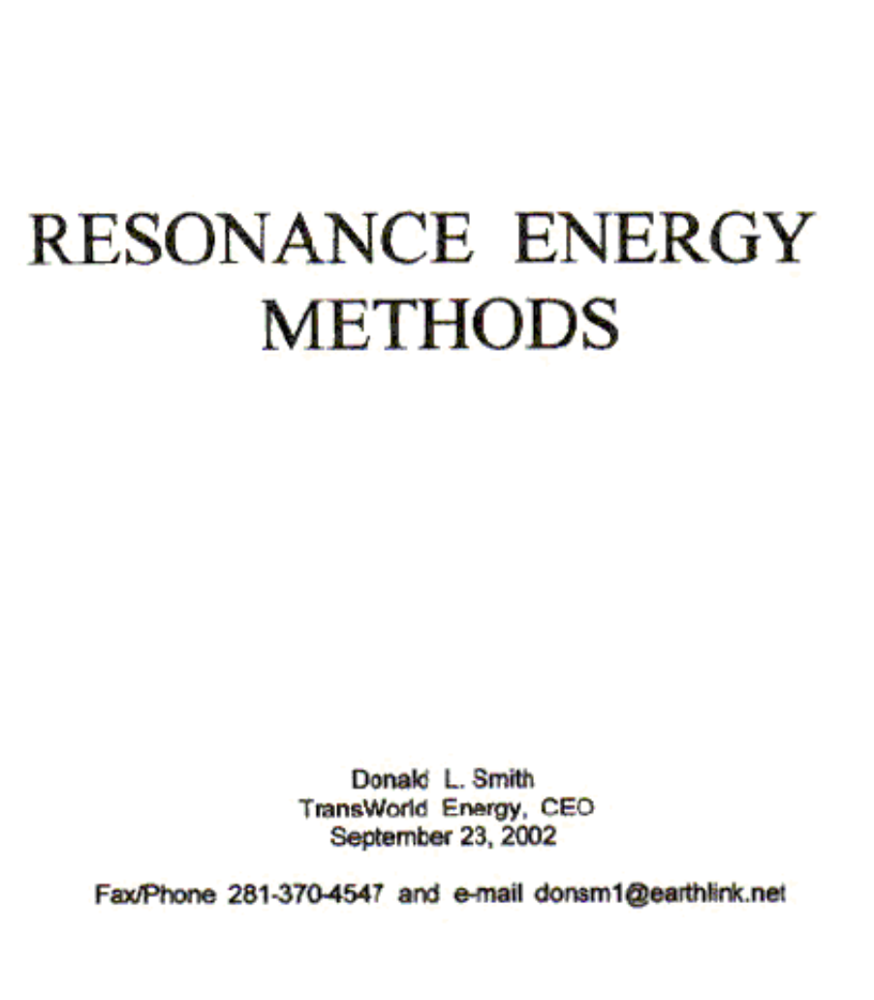

# 唐·史密斯介绍
Don Smith is elderly and has suffered several serious strokes in the last few years. He is no longer able to respond to e-mails and his web site has been taken over by people who appear very keen to ensure that his work and information can no longer be accessed by members of the public.

唐·史密斯年纪大了，在过去的几年里遭受了几次严重的中风。他不再能够回复电子邮件，他的网站已被一些人接管，这些人似乎非常热衷于确保他的工作和信息不再被公众访问。

At this point in time there is very little information available on Don's achievements.  What I have been able to locate is four video recordings of lectures which he gave, plus a copy of his pdf document entitled "Resonance Energy Systems". There is also a web site with limited information. This site appears to have been set up by Don's son whom I suspect does not fully understand how his father's devices work. Don has produced at least forty eight different devices which draw energy from what Don prefers to call "the ambient background". His devices are capable of supplying kilowatts of excess energy and in most cases they do not require any input energy to be supplied by the user.

目前，关于唐的成就，可获得的信息很少。我找到的是他演讲的四段录像，以及一份题为“共振能量系统”的pdf文件。还有一个信息有限的网站。这个网站似乎是由唐的儿子建立的，我怀疑他并不完全理解他父亲的设备是如何工作的。唐已经生产了至少48种不同的设备，这些设备从唐更喜欢称之为“环境背景”的地方获取能量。他的设备能够提供千瓦的多余能量，在大多数情况下，它们不需要用户提供任何输入能量。

It is said that 40,000 copies of Don's pdf document have been sold worldwide, but it appears that it is no longer possible to buy a copy, and for that reason, a copy is contained within this document. Please be aware that Don states quite openly that he does not disclose all of the details on any of his devices in his public discussions. This is because the rights to each device have been assigned to a different company in which Don has a financial interest, and so it is not in his interests to disclose the full details. However, ha says that he discloses enough for somebody who is experienced in radio-frequency electronics to be able to deduce the things which he does not disclose and so build a device for his own use. If that is the case, then anybody who has succeeded in doing so has kept very quiet about it afterwards (which is understandable). Having said that, Tariel Kapanadze of Georgia appears to have replicated one of the designs although it is quite likely that Tariel deduced the operating principles for himself. These principles are clearly based on the work of Nikola Tesla.

据说，唐的pdf文档已在全球售出40000份，但似乎已无法购买副本，因此，本文档中包含一份副本。请注意，Don非常公开地表示，他不会在公开讨论中透露任何设备的所有细节。这是因为每台设备的权利都被分配给了唐拥有经济利益的不同公司，因此披露全部细节不符合他的利益。然而，哈说，他披露的信息足够让一个在射频电子领域有经验的人能够推断出他没有披露的东西，从而为自己制造一个设备。如果是这样的话，那么任何成功做到这一点的人事后都对此保持沉默（这是可以理解的）。话虽如此，格鲁吉亚的塔里埃尔·卡帕纳泽似乎复制了其中一种设计，尽管塔里埃尔很可能自己推导出了操作原理。这些原则显然是基于尼古拉·特斯拉的工作。

In Don's work, he refers to the educational kit entitled "Resonant Circuits" No 10 - 416 from The Science Source at www.thesciencesiource.com. That kit now costs US$100 and they don't mention the fact that you need a signal generator capable of producing a 10 volt output at up to 1 MHz in order to be able to do resonance tests, and the kit now uses an LED rather than a neon bulb.

在唐的工作中，他提到了《科学资源》网站www.thesciencesource.com上题为“谐振电路”的10-416号教育套件。该套件现在售价100美元，但他们没有提到这样一个事实，即你需要一个能够在高达1 MHz的频率下产生10伏输出的信号发生器才能进行谐振测试，该套件现在使用LED而不是霓虹灯泡。

There is a "book" of Don's entitled "An Answer to America's Energy Deficit" but, being an earlier work than his pdf document, it does not appear to contain anything extra of any significance. Here is Don's pdf document, in it's original American-language wording with just minor clerical corrections:

唐有一本名为《美国能源赤字的答案》的“书”，但作为比他的pdf文件更早的作品，它似乎没有包含任何额外的意义。这是唐的pdf文档，采用原始的美国语言措辞，只有轻微的笔误：

