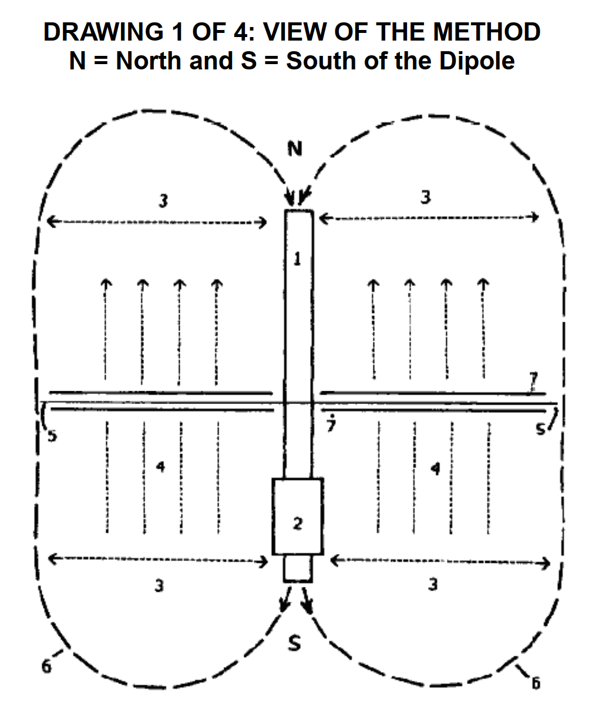
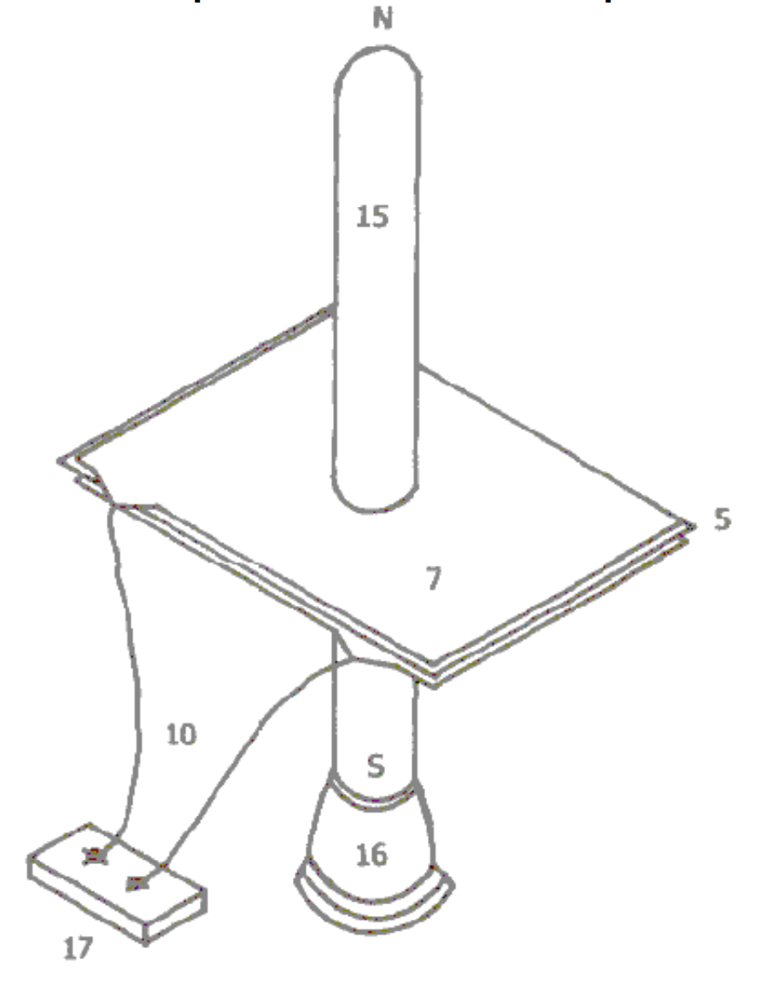
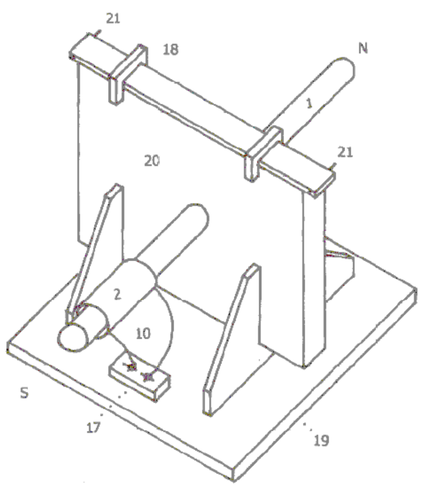

# 偶极变压器发电机说明

DIPOLE TRANSFORMER GENERATOR DESCRIPTION

TECHNICAL FIELD:

The Invention relates to loaded Dipole Antenna Systems and their Electromagnetic radiation. When used as a transformer with an appropriate energy collector system it becomes a transformer generator. The invention collects and converts energy which, with conventional devices, is radiated and wasted.

技术领域：

本发明涉及负载偶极天线系统及其电磁辐射。当用作具有适当能量收集系统的变压器时，它就变成了变压器发电机。本发明收集和转换能量，这些能量与传统设备一起被辐射和浪费。

BACKGROUND ART:

An International search of Patent Databases for closely related methods did not reveal any prior Art with an Interest in conserving radiated and wasted mag¬netic waves as useful energy.

背景艺术：

在国际专利数据库中搜索密切相关的方法，没有发现任何对将辐射和浪费的电磁波作为有用能量感兴趣的现有技术。

DISCLOSURE OF INVENTION:

The Invention is a new and useful departure from transformer generator construction, such that radiated and wasted magnetic energy changes into useful electrical energy.  Gauss Meters show that much energy from conventional electromagnetic devices is radiated back into the ambient background and wasted. In the case of conventional transformer generators, a radical change in the physical construction, allows better access to the energy available. It is found that creating a dipole and Inserting capacitor plates at right angle to the current flow, allows magnetic waves to change back to useful electrical (coulombs) energy. Magnetic waves passing through the capacitor plates do not degrade and the full impact of the available energy is accessed. One, or many sets of capacitor plates, may be used as desired. Each set of plates makes an exact copy of the full force and effect of the energy present in the magnetic waves.  The originating source is not depleted or degraded as is common in conventional transformers.

发明公开：

本发明是对变压器发电机结构的一种新的有用的偏离，使得辐射和浪费的磁能转化为有用的电能。高斯计显示，传统电磁设备的大量能量被辐射回环境背景并被浪费。就传统的变压器发电机而言，物理结构的根本性改变可以更好地获取可用的能源。研究发现，创建偶极子并以与电流成直角的方式插入电容器板，可以使磁波变回有用的电能（库仑）。穿过电容器板的磁波不会退化，并且可以获得可用能量的全部影响。根据需要，可以使用一组或多组电容器极板。每组板都精确地复制了磁波中存在的能量的全部力和效应。原始电源不会像传统变压器中常见的那样耗尽或退化。

BRIEF DESCRIPTION OF THE DRAWINGS:

The Dipole at right angle allows the magnetic flux surrounding it to intercept the capacitor plate, or plates, at right angles. The electrons present are spun in such a way that the electrical component of the electrons is collected by the capacitor plates.  Essential parts are the South and North component of an active Dipole. Examples presented here, exist as fully functional prototypes, and were engineer constructed and fully tested for utility by the Inventor. Corresponding parts are utilized in each of the three examples as shown in the Drawings.

图纸简要说明：

直角偶极子允许其周围的磁通量以直角拦截电容器极板。存在的电子以这样的方式旋转，即电子的电气成分被电容器板收集。重要部分是活跃偶极子的南部和北部成分。此处展示的示例以全功能原型的形式存在，由发明人工程师构建并进行了全面的实用性测试。如图所示，三个示例中的每一个都使用了相应的零件。

DRAWING 1 OF 4: VIEW OF THE METHOD N = North and S = South of the Dipole

图1（共4幅）：方法视图N=偶极子的北，S=偶极子的南

1. North and South component of the Dipole.
2. Resonate High Voltage induction coil.
3. Dipole's electromagnetic wave emission.
4. Heaviside current component.
5. Dielectric separator for the capacitor plates
6. For purposes of the drawing, a virtual limit of the electromagnetic wave energy.
7. Capacitor plates, with dielectric in between.

--
1. 偶极子的南北分量。
2. 谐振高压感应线圈。
3. 偶极子的电磁波发射。
4. Heaviside流分量。
5. 电容器极板的绝缘隔板
6. 为了绘图的目的，电磁波能量的虚拟极限。
7. 电容器板，中间有电介质。

DRAWING 2 OF 4: COMPONENTS, 2A and 2B

Fig.2-A:

- 1 Hole for mounting Dipole B-1.
- 2 Resonate high voltage induction coil.
- 5 Dielectric separator, a thin sheet of plastic separating the capacitor plates.
- 7 Capacitor plates, upper plate is aluminum and lower plate is copper.
- 8 Battery system, deep cycle.
- 9 Inverter. Input: Direct Current, output: 120 Volts at 60 cycles per second.
- 10 Connector wires.
- 12 Output to point of use being the load.

图2-A：

- 1 用于安装偶极B-1的孔。
- 2 谐振高压感应线圈。
- 5 电介质隔板，一块将电容器极板隔开的薄塑料片。
- 7 电容器板，上板为铝，下板为铜。
- 8 电池系统，深循环。
- 9 逆变器。输入：直流，输出：120伏，每秒60个周期。
- 10 连接线。
- 12 输出到使用点是负载。

Fig.2-B N = North and S = South component of the Dipole

- 1、 Metal rod, being soft magnetic metal such as iron.
- 2、 Resonate high voltage induction coil.
- 10、Connector wires.
- 11、High Voltage input energy source such as a neon tube transformer.

图2-B N=偶极的北分量，S=偶极的南分量

- 1、 金属棒，是铁等软磁性金属。
- 2、 谐振高压感应线圈。
- 10、 连接器电线。
- 11、 高压输入能源，如霓虹灯管变压器。

DRAWING 3 OF 4 : Proof of Principle Device, using a Plasma Tube as an active Dipole.

N = North and S = South Components of the active Dipole.

图3/4：原理验证装置，使用等离子体管作为有源偶极子。

N=活动偶极子的北分量，S=南分量。

- 5. Dielectric separator of the capacitor plates.
- 7. Upper capacitor plate: upper plate is aluminum and lower plate is copper.
- 10. Connector wires.
- 15. Plasma Tube, 4 feet long and 6 inches in diameter.
- 16. High Voltage Energy source for the active Plasma Dipole.
- 17. Connector block: outlet for testing and use.

- 5.电容器极板的绝缘隔板。
- 7.上电容器板：上板为铝，下板为铜。
- 10. 连接器电线。
- 15. 等离子管，长4英尺，直径6英寸。
- 16. 有源等离子体偶极子的高压能源。
- 17. 连接器块：用于测试和使用的插座。

DRAWING 4 OF 4: Manufactures Prototype, Constructed and fully tested.

图纸4/4：制造原型，建造并充分测试。

- 1 Metal Dipole rod.
- 2 Resonate High Voltage induction coil.
- 10 Connector wires.
- 17 Connector block for Input from high voltage energy source.
- 18 Clamps for upper edge of capacitor packet.
- 19 Support Device for The Dipole Transformer Generator.
- 20 Packet of Capacitor Plates.
- 21 Output connectors of the capacitor, producing energy into a deep cycle battery which then powers the inverter.

- 1 金属偶极杆。
- 2 谐振高压感应线圈。
- 10 连接器电线。
- 17 高压能源输入连接器块。
- 18 电容器包上边缘的夹具。
- 19 偶极变压器发电机的支撑装置。
- 20 电容器极板包。
- 21 电容器的输出连接器，将能量产生到深循环电池中，然后为逆变器供电。

BEST METHOD OF CARRYING OUT THE INVENTION:

The Invention is applicable to any and all electrical energy requirements. The small size and high efficiency makes It an attractive option. It is particularly attractive for remote areas, homes, office buildings, factories, shopping centers, public places, transportation, water systems, electric trains, boats, ships and all things small or great Construction materials are readily available and the skill level required is moderate.

实施本发明的最佳方法：

本发明适用于任何和所有电能要求。小尺寸和高效率使其成为一个有吸引力的选择。它对偏远地区、家庭、办公楼、工厂、购物中心、公共场所、交通、供水系统、电动火车、船只、轮船和所有大小物品都特别有吸引力。建筑材料随时可用，所需的技能水平适中。

CLAIMS:

1. Radiated magnetic flux from the Dipole, when intercepted by capacitor plates at right angles, changes to useful electrical energy.
2. A Device and method for converting for use, normally wasted electromagnetic energy.
3. The Dipole of the Invention is any resonating substance such as Metal Rods, Coils and Plasma Tubes which have interacting Positive and Negative Components.
4. The Resulting Heaviside current component Is changed to useful electrical energy.

声称：

1. 偶极的辐射磁通量，当被电容器板以直角拦截时，会转化为有用的电能。
2. 一种用于转换通常浪费的电磁能以供使用的装置和方法。
3. 本发明的偶极子是任何具有相互作用的正负分量的共振物质，如金属棒、线圈和等离子体管。
4. 产生的Heaviside流分量被转化为有用的电能。

ABSTRACT

An Electromagnetic Dipole Device and Method, wherein, radiated and wasted energy is transformed into useful energy. A Dipole as seen in Antenna Systems is adapted for use with capacitor plates such that the Heaviside Current Component becomes a useful source of electrical energy.

摘要

一种电磁偶极装置和方法，其中，辐射和浪费的能量被转化为有用的能量。天线系统中看到的偶极适用于电容器板，使Heaviside电流分量成为有用的电能来源。