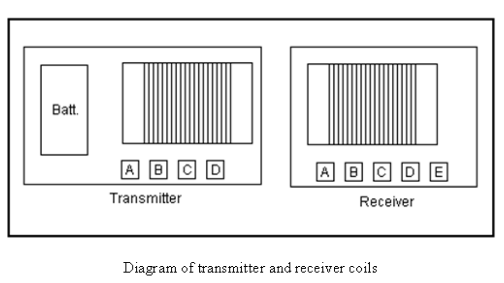

# 发电系统

Electrical Energy Generating System

Description and Function:

The Generation of Electrical Power requires the presence of electrons with various methods of stimulation, yielding magnetic and electrical impulses, collectively resulting in Electrical Energy (Power). In place of the mechanical - coils and magnet system, present in conventional electrical power generation, visible moving parts are replaced by resonate magnetic induction, using radio frequency. Transfer of energy by resonate induction is related to the ratio of the square of the cycles per second.

描述和功能：

电能的产生需要电子的存在和各种刺激方法，产生磁脉冲和电脉冲，共同产生电能（功率）。代替传统发电中存在的机械线圈和磁体系统，可见的运动部件被使用射频的共振磁感应所取代。共振感应的能量传递与每秒周期的平方比有关。

The Energy System, presented here, operates at millions of cycles per second verses the conventional 60 C.P.S. This tells us that it has a frequency advantage over conventional methods. This same advantage applies to the amount of electrical energy output. Therefore the Device is small in size and produces large amounts of Electrical Energy. The Electrons acquired, are from the surrounding Air and Earth Groundings, being the same source as in conventional methods. This is accomplished by magnetic resonate radio induction.

这里介绍的能量系统与传统的60 C.P.S.相比，以每秒数百万次循环的速度运行。这告诉我们，它比传统方法具有频率优势。同样的优点也适用于电能输出量。因此，该装置体积小，产生大量电能。获得的电子来自周围的空气和接地，与传统方法中的来源相同。这是通过磁共振无线电感应实现的。

Applications:

This Electrical System adapts nicely to all Energy Requirements. It is a direct replacement for all existing Energy Systems. This includes such things as Manufacturing, Agricultural, Home Usage, Office Complexes, Shopping Centers, Rail Transportation, Automobiles, Electrical Power Grids, Municipalities, Subdivisions, and Remote Areas. Briefly, the only limiting factor is the imagination.

应用：

该电气系统能够很好地适应所有能源要求。它是所有现有能源系统的直接替代品。这包括制造业、农业、家庭使用、办公综合体、购物中心、铁路运输、汽车、电网、市政当局、分区和偏远地区。简而言之，唯一的限制因素是想象力。

Economic Possibilities:

No Historical Reference Point exists for a comparison of the Possibilities of this System. One can see from the impacted applications listed above, that the magnitude exceeds any known invention, presently a part of the Human Experience.

经济可能性：

没有历史参考点来比较该系统的可能性。从上面列出的受影响的应用中可以看出，其规模超过了任何已知的发明，目前是人类体验的一部分。

Present and Future Plans:

The Energy System has been in the developmental stage during the past seven years. It is Patent Pending # 08/100,074 with the Patent Office. No prior art exists according to the Patent Office's response. The System is presently being introduced into the World Market.

当前和未来计划：

在过去的七年里，能源系统一直处于发展阶段。这是专利局正在申请的专利#08/100074。根据专利局的答复，不存在现有技术。该系统目前正在引入世界市场。

Useful energy occurs as the result of imbalances in the ambient background energy, which is a transient phenomena. In the electrical field, it is a closed system subject to heat death, which severely limits it's utility. The flip side of the electron, produces magnetic waves which are an open system, not subject to heat death. These waves, being unrestricted, are the universal source of energy when unlimited resonate duplicates from this one source are available.  Therefore, the key to unlimited energy, is Magnetic Resonance. In order to understand this, requires putting a stake through the Heart of Antique Physics. Non-linear and Open Systems are universally available in Magnetic Resonance Systems, Explosions of any sort [including Atomic Explosions] and Combustibles of any type. Mechanical equivalents would be levers, pulleys and hydraulics. A highly obvious example is the Piano where the Key impacts the one note giving one sound level, which resonates with it's two side keys providing a much higher sound level. Magnetic Resonance Energy clearly amplifies itself, demonstrating more energy out, than in.

有用能量是环境背景能量不平衡的结果，这是一种瞬态现象。在电场中，它是一个受热死亡影响的封闭系统，这严重限制了它的实用性。电子的另一面产生磁波，这是一个开放的系统，不受热死亡的影响。这些不受限制的波是宇宙能量的来源，当来自这个来源的无限共振副本可用时。因此，无限能量的关键是磁共振。为了理解这一点，需要把赌注放在古董物理学的心脏上。非线性和开放系统在磁共振系统、任何类型的爆炸（包括原子爆炸）和任何类型的可燃物中都是普遍可用的。机械等效物将是杠杆、滑轮和液压装置。一个非常明显的例子是钢琴，琴键撞击一个音符，产生一个声级，与它的两个侧键产生共鸣，提供更高的声级。磁共振能量显然会放大自身，显示出比输入更多的能量。

Ohmic resistance does not apply to Magnetic Resonance which travels unrestricted for great distances, therefore multitudes of electrons are disturbed, and their back-spin translates magnetic into usable electric energy. The right angle component which the magnetic flux provides, translates into useful electrical energy. Taken at right angles, the Magnetic Dipole provides an unlimited source of electrical energy. The writer is recognized world-wide for his knowledge and experience. See his Web Site at altenergy-pro.com.

欧姆电阻不适用于长距离无限制传播的磁共振，因此大量电子受到干扰，它们的后自旋将磁性转化为可用的电能。磁通量提供的直角分量转化为可用电能。从直角角度看，磁偶极子提供了无限的电能来源。这位作家因其知识和经验而享誉全球。请访问他的网站altenergy-pro.com。

Gravity is a function of spin phenomenon as observed in gravity separation of liquids. When spun, milk and cream separate. Therefore, relative specific gravity is function of mass versus spin. Magnetics and gravity are both spin related. In part, a top levitates when spun. Therefore, spinning magnetic fields are a functional motor source as in flying saucers.

重力是液体重力分离中观察到的自旋现象的函数。旋转时，牛奶和奶油分离。因此，相对比重是质量与自旋的函数。磁性和重力都与自旋有关。在某种程度上，陀螺在旋转时会悬浮。因此，旋转磁场是一种功能性的电机源，就像飞碟一样。

## 摘要：新能源技术：

ABSTRACT: Technology of New Energy:

Developments in the understanding of Electricity, along with Materials which were not previously available, allows the construction of Devices which collect energy in large quantities, from the Earth's Ambient Electrical Background. This Energy is naturally occurring,environmentally benign and is available everywhere. It is available wherever and whenever it is required. New Devices use Resonate Magnetic Waves which replicate upon spinning the locally present electrons, providing multiple duplicate copies of the Energy Present. Each electron when spun yields both magnetic and electric waves in equal proportion. The electrical component is a closed system limited by Ohms Law. The magnetic component is an open system not limited and it replicates multiple copies of the energy present.

对电的理解的发展，以及以前没有的材料的出现，允许建造从地球环境电背景中大量收集能量的设备。这种能量是自然产生的，对环境无害，无处不在。无论何时何地，只要需要，它都是可用的。新设备使用共振磁波，在旋转局部存在的电子时进行复制，提供能量存在的多个复制副本。每个电子在旋转时都会产生相等比例的电磁波和电波。电气元件是一个受欧姆定律限制的封闭系统。磁性组件是一个不受限制的开放系统，它复制了存在的能量的多个副本。

Special materials and recent developments allow the magnetic energy to reproduce, through resonance, unlimited duplicate copies acquired from the ambient background. These Devices harvest the energy that has been, and is always present universally. Conventional methods consist of coils and magnets systems. Upon moving past each other, the magnetic flux field disturbs electrons which yield electricity, which is collected by the coils system. This is accomplished electronically with the new technology, without any moving parts and the energy is multiplied such that the Device becomes self-sustaining once it is started. This Technology, already presented Worldwide, will be shown at the Conference.

特殊材料和最近的发展使磁能能够通过共振从环境背景中获得无限复制。这些设备收集普遍存在的能量。传统方法包括线圈和磁体系统。在相互移动时，磁通量场会干扰产生电流的电子，这些电流由线圈系统收集。这是通过新技术以电子方式实现的，没有任何运动部件，能量倍增，使设备在启动后能够自我维持。这项技术已经在全球范围内展示，将在会议上展出。

    Dr. Smith
    www.altenergy-pro.com
    e-mail donsml@earthlink.net

"Putting a stake through the Heart" and thus removing the mental block created by antique physics is required. Conditions wherein this becomes necessary are non-linearity, resonance and explosions of any sort. Combustibles of any sort such gasoline and atomic explosions are good examples wherein more energy out than in, is obvious. You can add to that the nonlinearity found in pulleys, hydraulics, steam power and suchlike. Magnetic resonance is a highly obvious source for multiplying energy output. The sound system present in the piano, demonstrates this very clearly. Energy amplification clearly present in the above, demonstrates the silliness attested to by many Physicists.

需要“把一根木桩插进心脏”，从而消除古董物理学造成的心理障碍。需要这样做的条件是非线性、共振和任何类型的爆炸。任何类型的可燃物，如汽油和原子爆炸，都是很好的例子，其中能量输出明显多于输入。你可以添加滑轮、液压、蒸汽动力等中的非线性。磁共振是一种非常明显的能量输出倍增源。钢琴中的音响系统非常清楚地证明了这一点。上述明显存在的能量放大证明了许多物理学家所证明的愚蠢。

Ohmic resistance does not apply to magnetic resonance which travels unrestricted for great distances, therefore multitudes of electrons are disturbed, and their back-spin converts from magnetic energy to usable electric energy. These same electrons have been around from the beginning of time and they are undiminished and will remain so until the end of time.

欧姆电阻不适用于长距离无限制传播的磁共振，因此大量电子受到干扰，它们的后自旋从磁能转换为可用的电能。这些相同的电子从一开始就存在，并且不会减弱，直到时间结束。

## 电能系统前言

ELECTRICAL ENERGY SYSTEMS PREFACE

Useful Electrical Energy is obtained directly from electron spin induced by incoming magnetic waves, or indirectly through mechanical exchange as in dynamo type devices. Simply put, electron spin converts from magnetic to electrical energy and vice versa. Nature provides grand scale magnetic wave induction throughout the universe, for free. In Electrical Systems, movement is at right angles to the direction of current movement. This explains the rotary movement of the Earth and other related Systems. The rate of Spin for the Earth is known aswell as the mass (5.98 x 1024 Kg - "Physics for Scientist and Engineers", by Raymond A.  Serway, Saunders College Publishing, 2nd Ed. page 288, Table 14.2), therefore the amount of incoming Electrical Energy which produces this action can be calculated.

有用的电能可以直接从入射磁波引起的电子自旋中获得，也可以通过发电机型设备中的机械交换间接获得。简单地说，电子自旋从磁能转换为电能，反之亦然。大自然在整个宇宙中免费提供大规模的磁波感应。在电气系统中，运动与电流运动方向成直角。这解释了地球和其他相关系统的旋转运动。地球的自转速度和质量都是已知的（5.98 x 1024千克-“科学家和工程师的物理学”，Raymond A.Serway著，桑德斯学院出版社，第2版，第288页，表14.2），因此可以计算出产生这种作用的输入电能的量。

It can be seen quite easily, that the incoming magnetic wave energy is Vast and Continuous. As an accretion mass, the Earth is an Energy Sink, getting it's energy from elsewhere, being Cosmic, Galactic and Solar. Conversion of incoming magnetic waves into electrical energy provides an unending, inexpensive and environmentally friendly source available to all.  Cosmic and Galactic Energy is available twenty four hours per day. Large amounts of this Energy accumulates in the Earth's radiation belts. This Giant Energy Storage, when properly understood, provides a major source of free unending electrical energy. Each of My Inventions plugs into this vast energy source.

很容易看出，入射的磁波能量是巨大而连续的。作为一个吸积物质，地球是一个能量汇集地，从宇宙、银河和太阳的其他地方获得能量。将入射的电磁波转化为电能，为所有人提供了一种无休止、廉价和环保的能源。宇宙和银河能量每天24小时可用。大量的这种能量积聚在地球的辐射带中。如果正确理解，这个巨大的储能装置提供了一个主要的免费无休止的电能来源。我的每一项发明都插入了这个巨大的能源。

A perverse, Intentional Ignorance on the part of the Establishment, prevents recognition of the importance of the Energy Systems shown here. Any new system which is favorable towards the masses, is considered as disruptive, and therefore not allowed. Those who have the (Gold) Energy Rule (Golden rule) Mandated Destruction of all Humanity is not a consideration.

当权者的一种反常的、故意的无知，阻碍了人们对这里所示能源系统重要性的认识。任何有利于群众的新制度都被认为是破坏性的，因此是不允许的。那些拥有（黄金）能量法则（黄金法则）强制毁灭全人类的人不是考虑因素。

This Presenter will remove some of the Fog placed with the intention of preventing the recognition of this unending, environmentally clean, electrical energy Source, which is present everywhere throughout the Universe. The Cost of Harvesting and Using this Free Energy is a function of Human Stupidity.

本演示者将移除一些雾，其目的是阻止人们认识到这种无休止的、环境清洁的电能源，它存在于整个宇宙的任何地方。收获和使用这种自由能源的成本是人类愚蠢的函数。

RESONANCE CIRCUITS DEMO

Used to demonstrate electromagnetic radiation between two UC circuits - one a transmitter and the other a receiver. When the 1.5 volt power transmitter is pulsed, the radiated signal is picked up by the remote receiver circuit which then lights up a 70 volt neon lamp.

用于演示两个UC电路之间的电磁辐射，一个是发射器，另一个是接收器。当1.5伏功率发射器发出脉冲时，辐射信号被远程接收器电路拾取，然后点亮70伏霓虹灯。

With this apparatus, the student quickly understands some basic principles governing wireless communication, broadcasting, etc.

使用此设备，学生可以快速理解无线通信、广播等的一些基本原理。

THE SCIENCE SOURCE WALDOBORO, MAINE 04572 P.O. BOX 727

科学资料来源缅因州沃尔多波罗04572邮政信箱727

    Tel.1-800-299-5469
    info0thesciencesource.com

