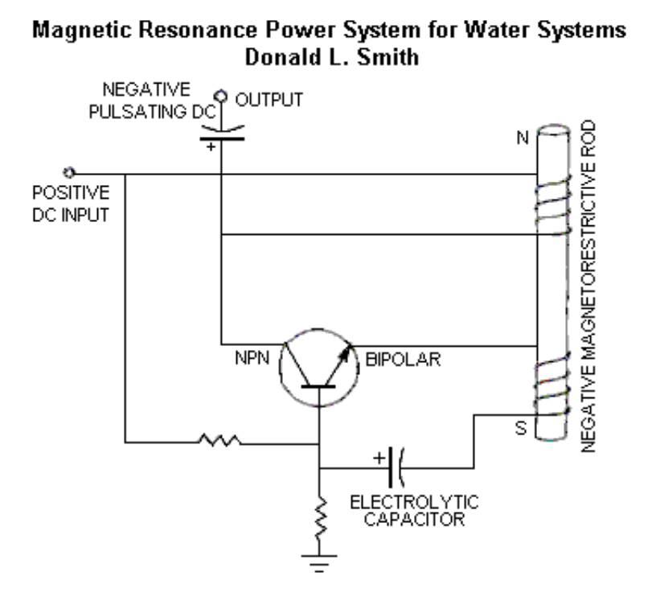

# 发电系统

Electrical Energy Generating System

Description and Function:

The Generation of Electrical Power requires the presence of electrons with various methods of stimulation, yielding magnetic and electrical impulses, collectively resulting in Electrical Energy (Power). In place of the mechanical - coils and magnet system, present in conventional electrical power generation, visible moving parts are replaced by resonate magnetic induction, using radio frequency. Transfer of energy by resonate induction is related to the ratio of the square of the cycles per second.

描述和功能：

电能的产生需要电子的存在和各种刺激方法，产生磁脉冲和电脉冲，共同产生电能（功率）。代替传统发电中存在的机械线圈和磁体系统，可见的运动部件被使用射频的共振磁感应所取代。共振感应的能量传递与每秒周期的平方比有关。

The Energy System, presented here, operates at millions of cycles per second verses the conventional 60 C.P.S. This tells us that it has a frequency advantage over conventional methods. This same advantage applies to the amount of electrical energy output. Therefore the Device is small in size and produces large amounts of Electrical Energy. The Electrons acquired, are from the surrounding Air and Earth Groundings, being the same source as in conventional methods. This is accomplished by magnetic resonate radio induction.

这里介绍的能量系统与传统的60 C.P.S.相比，以每秒数百万次循环的速度运行。这告诉我们，它比传统方法具有频率优势。同样的优点也适用于电能输出量。因此，该装置体积小，产生大量电能。获得的电子来自周围的空气和接地，与传统方法中的来源相同。这是通过磁共振无线电感应实现的。

Applications:

This Electrical System adapts nicely to all Energy Requirements. It is a direct replacement for all existing Energy Systems. This includes such things as Manufacturing, Agricultural, Home Usage, Office Complexes, Shopping Centers, Rail Transportation, Automobiles, Electrical Power Grids, Municipalities, Subdivisions, and Remote Areas. Briefly, the only limiting factor is the imagination.

应用：

该电气系统能够很好地适应所有能源要求。它是所有现有能源系统的直接替代品。这包括制造业、农业、家庭使用、办公综合体、购物中心、铁路运输、汽车、电网、市政当局、分区和偏远地区。简而言之，唯一的限制因素是想象力。

Economic Possibilities:

No Historical Reference Point exists for a comparison of the Possibilities of this System. One can see from the impacted applications listed above, that the magnitude exceeds any known invention, presently a part of the Human Experience.

经济可能性：

没有历史参考点来比较该系统的可能性。从上面列出的受影响的应用中可以看出，其规模超过了任何已知的发明，目前是人类体验的一部分。

Present and Future Plans:

The Energy System has been in the developmental stage during the past seven years. It is Patent Pending # 08/100,074 with the Patent Office. No prior art exists according to the Patent Office's response. The System is presently being introduced into the World Market.

当前和未来计划：

在过去的七年里，能源系统一直处于发展阶段。这是专利局正在申请的专利#08/100074。根据专利局的答复，不存在现有技术。该系统目前正在引入世界市场。

Useful energy occurs as the result of imbalances in the ambient background energy, which is a transient phenomena. In the electrical field, it is a closed system subject to heat death, which severely limits it's utility. The flip side of the electron, produces magnetic waves which are an open system, not subject to heat death. These waves, being unrestricted, are the universal source of energy when unlimited resonate duplicates from this one source are available.  Therefore, the key to unlimited energy, is Magnetic Resonance. In order to understand this, requires putting a stake through the Heart of Antique Physics. Non-linear and Open Systems are universally available in Magnetic Resonance Systems, Explosions of any sort [including Atomic Explosions] and Combustibles of any type. Mechanical equivalents would be levers, pulleys and hydraulics. A highly obvious example is the Piano where the Key impacts the one note giving one sound level, which resonates with it's two side keys providing a much higher sound level. Magnetic Resonance Energy clearly amplifies itself, demonstrating more energy out, than in.

有用能量是环境背景能量不平衡的结果，这是一种瞬态现象。在电场中，它是一个受热死亡影响的封闭系统，这严重限制了它的实用性。电子的另一面产生磁波，这是一个开放的系统，不受热死亡的影响。这些不受限制的波是宇宙能量的来源，当来自这个来源的无限共振副本可用时。因此，无限能量的关键是磁共振。为了理解这一点，需要把赌注放在古董物理学的心脏上。非线性和开放系统在磁共振系统、任何类型的爆炸（包括原子爆炸）和任何类型的可燃物中都是普遍可用的。机械等效物将是杠杆、滑轮和液压装置。一个非常明显的例子是钢琴，琴键撞击一个音符，产生一个声级，与它的两个侧键产生共鸣，提供更高的声级。磁共振能量显然会放大自身，显示出比输入更多的能量。

Ohmic resistance does not apply to Magnetic Resonance which travels unrestricted for great distances, therefore multitudes of electrons are disturbed, and their back-spin translates magnetic into usable electric energy. The right angle component which the magnetic flux provides, translates into useful electrical energy. Taken at right angles, the Magnetic Dipole provides an unlimited source of electrical energy. The writer is recognized world-wide for his knowledge and experience. See his Web Site at altenergy-pro.com.

欧姆电阻不适用于长距离无限制传播的磁共振，因此大量电子受到干扰，它们的后自旋将磁性转化为可用的电能。磁通量提供的直角分量转化为可用电能。从直角角度看，磁偶极子提供了无限的电能来源。这位作家因其知识和经验而享誉全球。请访问他的网站altenergy-pro.com。

Gravity is a function of spin phenomenon as observed in gravity separation of liquids. When spun, milk and cream separate. Therefore, relative specific gravity is function of mass versus spin. Magnetics and gravity are both spin related. In part, a top levitates when spun. Therefore, spinning magnetic fields are a functional motor source as in flying saucers.

重力是液体重力分离中观察到的自旋现象的函数。旋转时，牛奶和奶油分离。因此，相对比重是质量与自旋的函数。磁性和重力都与自旋有关。在某种程度上，陀螺在旋转时会悬浮。因此，旋转磁场是一种功能性的电机源，就像飞碟一样。

## 摘要：新能源技术：

ABSTRACT: Technology of New Energy:

Developments in the understanding of Electricity, along with Materials which were not previously available, allows the construction of Devices which collect energy in large quantities, from the Earth's Ambient Electrical Background. This Energy is naturally occurring,environmentally benign and is available everywhere. It is available wherever and whenever it is required. New Devices use Resonate Magnetic Waves which replicate upon spinning the locally present electrons, providing multiple duplicate copies of the Energy Present. Each electron when spun yields both magnetic and electric waves in equal proportion. The electrical component is a closed system limited by Ohms Law. The magnetic component is an open system not limited and it replicates multiple copies of the energy present.

对电的理解的发展，以及以前没有的材料的出现，允许建造从地球环境电背景中大量收集能量的设备。这种能量是自然产生的，对环境无害，无处不在。无论何时何地，只要需要，它都是可用的。新设备使用共振磁波，在旋转局部存在的电子时进行复制，提供能量存在的多个复制副本。每个电子在旋转时都会产生相等比例的电磁波和电波。电气元件是一个受欧姆定律限制的封闭系统。磁性组件是一个不受限制的开放系统，它复制了存在的能量的多个副本。

Special materials and recent developments allow the magnetic energy to reproduce, through resonance, unlimited duplicate copies acquired from the ambient background. These Devices harvest the energy that has been, and is always present universally. Conventional methods consist of coils and magnets systems. Upon moving past each other, the magnetic flux field disturbs electrons which yield electricity, which is collected by the coils system. This is accomplished electronically with the new technology, without any moving parts and the energy is multiplied such that the Device becomes self-sustaining once it is started. This Technology, already presented Worldwide, will be shown at the Conference.

特殊材料和最近的发展使磁能能够通过共振从环境背景中获得无限复制。这些设备收集普遍存在的能量。传统方法包括线圈和磁体系统。在相互移动时，磁通量场会干扰产生电流的电子，这些电流由线圈系统收集。这是通过新技术以电子方式实现的，没有任何运动部件，能量倍增，使设备在启动后能够自我维持。这项技术已经在全球范围内展示，将在会议上展出。

    Dr. Smith
    www.altenergy-pro.com
    e-mail donsml@earthlink.net

"Putting a stake through the Heart" and thus removing the mental block created by antique physics is required. Conditions wherein this becomes necessary are non-linearity, resonance and explosions of any sort. Combustibles of any sort such gasoline and atomic explosions are good examples wherein more energy out than in, is obvious. You can add to that the nonlinearity found in pulleys, hydraulics, steam power and suchlike. Magnetic resonance is a highly obvious source for multiplying energy output. The sound system present in the piano, demonstrates this very clearly. Energy amplification clearly present in the above, demonstrates the silliness attested to by many Physicists.

需要“把一根木桩插进心脏”，从而消除古董物理学造成的心理障碍。需要这样做的条件是非线性、共振和任何类型的爆炸。任何类型的可燃物，如汽油和原子爆炸，都是很好的例子，其中能量输出明显多于输入。你可以添加滑轮、液压、蒸汽动力等中的非线性。磁共振是一种非常明显的能量输出倍增源。钢琴中的音响系统非常清楚地证明了这一点。上述明显存在的能量放大证明了许多物理学家所证明的愚蠢。

Ohmic resistance does not apply to magnetic resonance which travels unrestricted for great distances, therefore multitudes of electrons are disturbed, and their back-spin converts from magnetic energy to usable electric energy. These same electrons have been around from the beginning of time and they are undiminished and will remain so until the end of time.

欧姆电阻不适用于长距离无限制传播的磁共振，因此大量电子受到干扰，它们的后自旋从磁能转换为可用的电能。这些相同的电子从一开始就存在，并且不会减弱，直到时间结束。

## 电能系统前言

ELECTRICAL ENERGY SYSTEMS PREFACE

Useful Electrical Energy is obtained directly from electron spin induced by incoming magnetic waves, or indirectly through mechanical exchange as in dynamo type devices. Simply put, electron spin converts from magnetic to electrical energy and vice versa. Nature provides grand scale magnetic wave induction throughout the universe, for free. In Electrical Systems, movement is at right angles to the direction of current movement. This explains the rotary movement of the Earth and other related Systems. The rate of Spin for the Earth is known aswell as the mass (5.98 x 1024 Kg - "Physics for Scientist and Engineers", by Raymond A.  Serway, Saunders College Publishing, 2nd Ed. page 288, Table 14.2), therefore the amount of incoming Electrical Energy which produces this action can be calculated.

有用的电能可以直接从入射磁波引起的电子自旋中获得，也可以通过发电机型设备中的机械交换间接获得。简单地说，电子自旋从磁能转换为电能，反之亦然。大自然在整个宇宙中免费提供大规模的磁波感应。在电气系统中，运动与电流运动方向成直角。这解释了地球和其他相关系统的旋转运动。地球的自转速度和质量都是已知的（5.98 x 1024千克-“科学家和工程师的物理学”，Raymond A.Serway著，桑德斯学院出版社，第2版，第288页，表14.2），因此可以计算出产生这种作用的输入电能的量。

It can be seen quite easily, that the incoming magnetic wave energy is Vast and Continuous. As an accretion mass, the Earth is an Energy Sink, getting it's energy from elsewhere, being Cosmic, Galactic and Solar. Conversion of incoming magnetic waves into electrical energy provides an unending, inexpensive and environmentally friendly source available to all.  Cosmic and Galactic Energy is available twenty four hours per day. Large amounts of this Energy accumulates in the Earth's radiation belts. This Giant Energy Storage, when properly understood, provides a major source of free unending electrical energy. Each of My Inventions plugs into this vast energy source.

很容易看出，入射的磁波能量是巨大而连续的。作为一个吸积物质，地球是一个能量汇集地，从宇宙、银河和太阳的其他地方获得能量。将入射的电磁波转化为电能，为所有人提供了一种无休止、廉价和环保的能源。宇宙和银河能量每天24小时可用。大量的这种能量积聚在地球的辐射带中。如果正确理解，这个巨大的储能装置提供了一个主要的免费无休止的电能来源。我的每一项发明都插入了这个巨大的能源。

A perverse, Intentional Ignorance on the part of the Establishment, prevents recognition of the importance of the Energy Systems shown here. Any new system which is favorable towards the masses, is considered as disruptive, and therefore not allowed. Those who have the (Gold) Energy Rule (Golden rule) Mandated Destruction of all Humanity is not a consideration.

当权者的一种反常的、故意的无知，阻碍了人们对这里所示能源系统重要性的认识。任何有利于群众的新制度都被认为是破坏性的，因此是不允许的。那些拥有（黄金）能量法则（黄金法则）强制毁灭全人类的人不是考虑因素。

This Presenter will remove some of the Fog placed with the intention of preventing the recognition of this unending, environmentally clean, electrical energy Source, which is present everywhere throughout the Universe. The Cost of Harvesting and Using this Free Energy is a function of Human Stupidity.

本演示者将移除一些雾，其目的是阻止人们认识到这种无休止的、环境清洁的电能源，它存在于整个宇宙的任何地方。收获和使用这种自由能源的成本是人类愚蠢的函数。

RESONANCE CIRCUITS DEMO

Used to demonstrate electromagnetic radiation between two UC circuits - one a transmitter and the other a receiver. When the 1.5 volt power transmitter is pulsed, the radiated signal is picked up by the remote receiver circuit which then lights up a 70 volt neon lamp.

用于演示两个UC电路之间的电磁辐射，一个是发射器，另一个是接收器。当1.5伏功率发射器发出脉冲时，辐射信号被远程接收器电路拾取，然后点亮70伏霓虹灯。

With this apparatus, the student quickly understands some basic principles governing wireless communication, broadcasting, etc.

使用此设备，学生可以快速理解无线通信、广播等的一些基本原理。

THE SCIENCE SOURCE WALDOBORO, MAINE 04572 P.O. BOX 727

科学资料来源缅因州沃尔多波罗04572邮政信箱727

    Tel.1-800-299-5469
    info0thesciencesource.com

## 终极能源

ULTIMATE ENERGY SOURCES

A human is a speck of dust on Earth, the Solar System is a speck of dust in the Galaxy and in turn, the Galaxy is a speck of dust in the Universe (Cosmos). All of these respectively represent vast ambient energy reservoirs. Awareness of the Sun, opens doors into other energy sources.  Electromagnetic Energy which is present everywhere throughout the Universe, is accessed by catalytic activity, directly as in Solar Cells or indirectly as by mechanical means. Resonate, Magnetic Waves (Faraday's "Action at a Distance") allow Energy Activation Transfer to remote points of usage. The method of capture and use of this Energy is optional, and therefore it's cost is a function of Human Stupidity (Free-Energy).

人类是地球上的一粒灰尘，太阳系是银河系中的一粒尘埃，反过来，银河系是宇宙（宇宙）中的一颗尘埃。所有这些分别代表了巨大的环境能量库。对太阳的认识，打开了通往其他能源的大门。存在于整个宇宙中的电磁能可以通过催化活性直接获得，如太阳能电池，也可以通过机械手段间接获得。共振磁波（法拉第的“远距离作用”）允许能量激活转移到远程使用点。捕获和使用这种能量的方法是可选的，因此它的成本是人类愚蠢（自由能量）的函数。

Direct access is more desirable, and technology transfer from Solar Cell-type Devices provides the Catalyst. Enormously high Ambient Energy Levels are not detected by instruments that use the Ambient Background as a Reference Plane. A spoonful of water lifted from the Ocean does not define the Ocean. Incoming magnetic waves are reflected, Deflected or absorbed. Deflected Magnetic Waves spin electrons sideways producing useful Electrical Energy. Absorbed Wave Energy produces heat, therefore a hot interior for the Earth. In Electrical Systems physical movement is in the direction of current flow, frictional drag from inflow current defines gravity. Accretion masses resulting from Energy Sinks, provide all solid entities with their respective gravitational effect.

直接访问更可取，太阳能电池型设备的技术转让提供了催化剂。使用环境背景作为参考平面的仪器无法检测到极高的环境能量水平。从海洋中升起的一匙水并不能定义海洋。入射的磁波被反射、偏转或吸收。偏转的磁波使电子侧向旋转，产生有用的电能。吸收的波能产生热量，因此地球内部很热。在电气系统中，物理运动是沿电流方向进行的，流入电流的摩擦阻力定义了重力。能量汇产生的吸积质量为所有固体实体提供了各自的引力效应。

Increasing the tolerance level for Intellectual Awakening opens Doors of Reality. These doors blink into, and out of existence, and upon recognition, benefit Mankind. Opening some of these Doors, which at the present time are seen through a deep fog, is our purpose. Exploring Unrecognized Energy Sources, which are a Part of the Ambient Background, is another goal.  Our Available Instruments do not use reference planes which allow recognition of this energy, as we shall see, vast Energy Sources that totally surround us are available through Technology Transfer. They are inexpensive (Free), fully self-renewable and environmentally benign.

提高对知识觉醒的容忍度打开了现实之门。这些门存在与否，一经发现，便造福人类。打开其中一些门，目前可以透过浓雾看到，这是我们的目的。探索作为环境背景一部分的未识别能源是另一个目标。我们的可用仪器不使用允许识别这种能量的参考平面，正如我们将要看到的，通过技术转让可以获得完全围绕我们的巨大能源。它们价格低廉（免费），完全可再生，对环境无害。

Incoming Magnetic Wave Energy with Faraday's "action at a distance" will be looked at closely. Particle Physics will be left for the Astrophysics. Excited Electrons at point "A" the Sun (including the Galaxy and Cosmos) do not travel to point "B" the Earth, however a corresponding action occurs at point "B". The Electrons being disturbed at the Central Power Plant, in the same manner excite the Electrons at Your House, upon switching into an Earth grounding (known as "flipping the switch"). Correspondingly, there are Four Major Power Sources providing enormous amounts of Ambient Background Magnetic Wave Energy. They are The Cosmic, Galactic, Solar and Earth's Ambient Electromagnetic Backgrounds. The Earth's Electromagnetic Field comes from reflection, deflection and absorption as a result of action at a distance from the above.

法拉第“远距离作用”的入射磁波能量将受到密切关注。粒子物理学将留给天体物理学。太阳（包括银河系和宇宙）的“A”点处的激发电子不会到达地球的“B”点，但在“B”点将发生相应的作用。在中央发电厂受到干扰的电子，在切换到接地（称为“拨动开关”）时，以同样的方式激发你家的电子。相应地，有四种主要的电源提供大量的环境背景磁波能量。它们是宇宙、银河、太阳和地球的环境电磁背景。地球的电磁场来自反射、偏转和吸收，这是在距离上方一定距离处作用的结果。

Prescription Physics mandates that the Earth's background is of little interest. When we have Considered the evidence herein, it will become obvious that Special Interest's effort at keeping the People ignorant has, until now, largely succeeded.

处方物理学给出的方案对地球的背景并不感兴趣。当我们考虑了这里的证据后，很明显，到目前为止，特殊利益集团让人民保持无知的努力在很大程度上取得了成功。

Information for the entire World is available regarding the Magnetic Flux Background of the Earth's Surface (United State's Geological Survey, Colorado, USA, Office). When examined and properly understood, these Maps yield important information regarding reflection, deflection and absorption of incoming Magnetic Waves, plus action at a distance. When properly understood, these Maps reveal a very large Ambient Electromagnetic Energy Source.  This is the Part of the Earth's Energy System that relates to the Bird on the High Voltage Line.  When deflected, magnetic flux from electrons changes to electrical flux, providing the Motor System that spins or rotates the Earth. Physical movement by electrical systems is from inflow current movement. What level of current movement is required to spin the Earth? The Earth's Mass is 5.98 x 1024. From this Information, the Watts of Electricity Required may be calculated! Absorbed microwave flux energy heats from the inside out, therefore a hot interior of the Earth results. Water is strongly diamagnetic, and on windless days, ocean waves provide visible Proof of the overhead incoming magnetic flux. From the information above, the Earth's weight and rate of spin allows the calculation of the amount of incoming ambient background energy required. As You can see, it is not inconsequential as Prescription Physics mandates.

关于地球表面磁通量背景的全世界信息（美国科罗拉多州美国地质调查局办公室）。当检查并正确理解时，这些地图会提供有关入射磁波的反射、偏转和吸收以及远处作用的重要信息。如果理解得当，这些地图显示了一个非常大的环境电磁能源。这是地球能量系统中与高压线上的鸟有关的部分。当偏转时，电子的磁通量变为电通量，提供旋转或旋转地球的电机系统。电气系统的物理运动来自流入电流运动。旋转地球需要多大程度的电流运动？地球的质量是5.98 x 1024。根据此信息，可以计算出所需的瓦特数！吸收的微波通量能量由内而外加热，因此导致地球内部变热。水具有很强的抗磁性，在无风的日子里，海浪提供了头顶入射磁通量的可见证据。根据上述信息，地球的重量和自转速度可以计算出所需的环境背景能量。正如你所看到的，正如处方物理学所要求的那样，这并非无关紧要。

Astrophysicist are concerned with charged particles that whiz by, once every one hundred years, rather than Wave Phenomenon associated with action at a distance. This highly Active Wave Energy translates into Electrical Energy at point "B". The Galaxy is alive With Energy which is billions of times greater than that of the Sun. Visible Light is a very tiny part of the Electromagnetic Energy Spectrum. Frequencies present in the Galaxy and Cosmos allow Radio Telescope photographs of their existence and magnitude. One such 408 MHz photograph of the Electromagnetic Energy Spectrum shows that the Earth is a tiny speck of dust in this Enormous Ocean of Energy, and can be seen near the left end of the Central High Energy Area.

天体物理学家关注的是每百年掠过一次的带电粒子，而不是与远距离作用相关的波现象。这种高度活跃的波浪能在“B”点转化为电能。银河系充满了比太阳大数十亿倍的能量。可见光是电磁能谱中非常微小的一部分。银河系和宇宙中存在的频率使射电望远镜能够拍摄到它们的存在和大小。一张408 MHz的电磁能谱照片显示，地球是这个巨大的能量海洋中的一个微小尘埃，可以在中央高能区的左端附近看到。

This Energy extends in all directions. Accretion and formation of Planets, Suns and Galaxies are results of energy sinks and variable sized black holes. Mass retains heat, and is cooked from the inside out by the microwave background energy provided by the Universe. Flux movement into energy sinks, provides the frictional force know as gravity. Spinning mass in the presence of incoming flux amplifies the gravitational effect.

这种能量向各个方向延伸。行星、太阳和星系的吸积和形成是能量汇和大小可变的黑洞的结果。质量保留热量，并由宇宙提供的微波背景能量从内到外烹饪。通量运动进入能量汇，提供称为重力的摩擦力。在入射通量存在的情况下，旋转质量放大了引力效应。

At present, only Solar Energy is recognized. It is inconsistent, flaky and a very small Part of the Magnetic Wave Energy Present. Technology Transfer from Solar Power provides uncomplicated and inexpensive, direct access to the Other Greater Energy Sources. All Electromagnetic Energy harvesting methods include a Catalyst, a Collector and a Pump.  Catalysts include sensitization through doping with certain elements, air and earth groundings.  Collectors include temporary storage as in Capacitors, Coils and Transformers. The Pump System includes induced movement onward to the point of use. Conventional rotating coils and magnet systems activate electrons present, such that action at a distance can occur, therefore it is an energy activation pump. In Direct Access Systems such as Solar Cells, the same occurs without mechanical action. Direct access occurs when Magnetic Waves impact a catalyst, spinning the local electrons sideways, producing useful electrical energy.

目前，只有太阳能得到认可。它是不一致的，片状的，并且是磁波能量的一小部分。太阳能技术转让提供了简单、廉价、直接的其他大能源。所有电磁能量收集方法包括催化剂、收集器和泵。催化剂包括通过掺杂某些元素、空气和土壤接地进行敏化。收集器包括电容器、线圈和变压器中的临时存储。泵系统包括向使用点的诱导运动。传统的旋转线圈和磁体系统激活存在的电子，从而可以在远处发生作用，因此它是一个能量激活泵。在太阳能电池等直接接入系统中，即使没有机械作用，也会发生同样的情况。当磁波冲击催化剂，使局部电子侧向旋转，产生有用的电能时，就会发生直接访问。

Indirect acquisition of electrical energy by mechanical means is wasteful, troublesome, expensive and degrades the environment. The dynamo is a combination collector and pump of energy which is collected from the Earth's Ambient Energy Background. Generators do not make electricity, they collect it from the Ambient Background and forward it, as in Faraday's "action at a distance". Energy Conservation Laws relating to these systems, relate to gray areas, and when understood, are excluded because of the existence of External forces, open and nonlinear systems as per Einstein. The Knowledge Base just viewed, provides a Direct Understanding of the Requirements for Harvesting of unending, fully renewable, environmentally benign Sources of Electrical Energy.

通过机械手段间接获取电能是浪费、麻烦、昂贵的，并且会破坏环境。发电机是从地球环境能量背景中收集能量的组合收集器和泵。发电机不发电，它们从环境背景中收集电力并将其转发，就像法拉第的“远距离动作”一样。根据爱因斯坦的说法，与这些系统相关的能量守恒定律与灰色区域有关，当理解时，由于存在外力、开放和非线性系统，因此被排除在外。刚刚查看的知识库提供了对收获无休止、完全可再生、环保的电能来源的要求的直接理解。

## 磁共振电力系统建设建议

Magnetic Resonance Power System Suggestions for Construction

This is the Basic Sonar Power System which permits submarines to see approximately 50 miles distance. What is not commonly known is that it works better at higher frequencies in the Gigahertz range. Any Device that can radiate 50 miles plus, is producing an enormous electromagnetic disturbance from a small input into a rod of magnetostrictive material.

这是基本声纳动力系统，它允许潜艇看到大约50英里的距离。鲜为人知的是，它在千兆赫范围内的更高频率下工作得更好。任何可以辐射50英里以上的设备，都会从磁致伸缩材料棒的小输入中产生巨大的电磁干扰。

Disturbing the Earth's Ambient Background plus the strong dipole being produced, turns the magnetostrictive rod into a combination of a receiving antenna and a vastly superior output transformer.

干扰地球的环境背景加上产生的强偶极子，将磁致伸缩杆变成接收天线和性能优越的输出变压器的组合。

The Drawing is only the Key Unit. A power input module and an output inverter circuit (diode bridge plus output transformer) are also required. The metal core and the wire size of the output transformer, plus adjusting the Earth Grounding of the Load, will determine the Amperage.  The Ideal rod material is Terfenol-D (check the internet). However a 1.5" diameter 10" long rod, costs over $5,000 each. Less expensive alternatives are obvious. When constructing, use PVC tubing with removable caps. Wind the coils on it and insert the experimental rod. Use only magneto¬strictive material.

图纸只是关键单位。还需要电源输入模块和输出逆变器电路（二极管桥加输出变压器）。输出变压器的金属芯和电线尺寸，加上调整负载的接地，将决定电流。理想的杆材料是Terfenol-D（查看互联网）。然而，一根直径1.5英寸、长10英寸的杆，每根的成本超过5000美元。更便宜的替代品是显而易见的。施工时，使用带可拆卸盖子的PVC管。将线圈缠绕在其上，然后插入实验棒。仅使用磁致伸缩材料。

When you get it right, you will have exactly what the Doctor ordered:

当你做对了，你会得到博士所要求的：

Magnetostriction oscillators work by magnetic resonance in a rod of magnetostriction material.  This rod serves two purposes: It vibrates at the frequency of resonance oscillation, and it becomes the feedback transformer. Frequency is determined by items 4, 5, 6 and 8. The diameter, length and volume of the rod and output windings, determines the output. Item 2 provides feedback into the system. The negative magnetic character of item 8 plus the windings 2, in reaction to the magnetic flux field provided by 9, increases (amplifies or magnifies) the output. Magnetic permeability is the counterpart of negative resistance. Resonating with negative magnetic resistance, it pumps energy from the Earth's ambient background. Magnetic permeability is the ratio of flux density (Earth's B field) to the magnetizing force (H) in oersteds.

磁致伸缩振荡器通过磁致伸缩材料棒中的磁共振工作。该杆有两个用途：它以谐振频率振动，并成为反馈变压器。频率由第4、5、6和8项决定。杆和输出绕组的直径、长度和体积决定了输出。项目2向系统提供反馈。第8项加上绕组2的负磁特性与第9项提供的磁通量场反应，增加（放大或放大）输出。磁导率是负电阻的对应物。它与负磁阻共振，从地球的环境背景中泵送能量。磁导率是磁通密度（地球的B场）与磁化力（H）之比，单位为奥斯特。

Magnetostrictive materials are piezoelectric in character, and have a very high resistance to electrical current flow.

磁致伸缩材料具有压电特性，对电流具有很高的电阻。

Examples are:

1. Permealloy Negative Magnetic Permeability > 80,000
2. Sendust Negative Magnetic Permeability 30,000 -120,000
3. Metglas Negative Magnetic Permeability > 200,000
4. Iron with ( 34% ) Cobalt Magnetic Permeability 13,000
5. New Technology Magnetic Permeability > 1,000,000

例如：

1. 坡莫合金负磁导率>80000
2. Sendust负磁导率30000-120000
3. Metglas负磁导率>200000
4. 铁（34%）钴磁导率13000
5. 新技术磁导率>1000000
