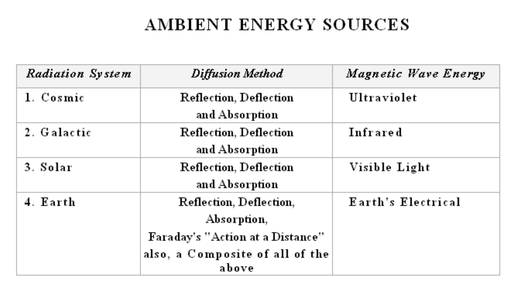
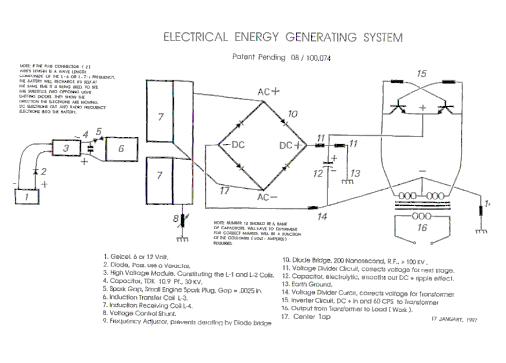

# 电能系统方法

ELECTRICAL ENERGY SYSTEMS METHODS

1. DIRECT

Faraday's "Action at a Distance" incoming magnetic wave conversion to useful electrical energy. This includes Cosmic, Galactic, Solar and Magnets. Technology Transfer is from Solar Cell Technology.

1.直接

法拉第的“远距离作用”将入射磁波转换为有用的电能。这包括宇宙、银河、太阳和磁铁。技术转让来自太阳能电池技术。

2. INDIRECT

Electron Stimulation-Induced Electron Spin Systems, Electron Avalanche Pumping Systems

2.间接

电子刺激诱导电子自旋系统、电子雪崩泵浦系统

Primitive

Indirect Conversion from another form of energy. Coils and Magnet as in Dynamo Systems(Closed Systems). Chemical Systems, Atomic, Pons & Fleischman and etc.

原始

另一种形式的能量的间接转换。发电机系统（封闭系统）中的线圈和磁铁。化学系统、原子、Pons&Fleischman等。

Advanced

- Direct Conversion, Magnetic Wave ( Open Systems ).
- Ambient Sources
- Air Core Coil Systems
- Gaseous Tube Systems,
- Solid State Marx Generator Avalanche Type Systems.
- Leyden Bottle Capacitor Types inserted in Lakes and other.
- Magnet Systems
- Electron Beam Antenna Systems

高级

- 直接转换，磁波（开放系统）。
- 环境源
- 空心线圈系统
- 气体管系统，
- 固态马克思发电机雪崩型系统。
- 莱顿瓶型电容器插入湖泊等。
- 磁铁系统
- 电子束天线系统

1. TRANSFER MECHANISMS

Solids - as in metal conductors

Gaseous as in radio wave transmission, a form of ionization.

Sensitizing of Systems by use of Trace Doping with Radioactive elements, includes metal surfaces.

Open Systems, non-linear with external forces. Albert Einstein in a direct quote from hisbiography states that these are excluded from the conservation of energy laws.

Closed Systems Maxwellian Type Systems. Mathematics are predictable requiring deductivereasoning. Ohm's Law is King, and Establishment Intellectuals being comfortable with this, brand all else as a violation of the Laws of Nature by obtaining something for nothing. This is Dishonesty grand mal.

1.转移机制

固体-如金属导体

气体，如无线电波传输中的一种电离形式。

使用放射性元素微量掺杂对系统进行敏化，包括金属表面。

开放系统，与外力非线性。阿尔伯特·爱因斯坦在他的传记中直接引用了一句话，他说这些都被排除在能量守恒定律之外。

封闭系统麦克斯韦型系统。数学是可预测的，需要演绎推理。欧姆定律为王，当权派知识分子对此感到满意，他们认为其他一切都是对自然法则的违反，因为他们不劳而获。这是不诚实的大罪。

A deep fog pervades the entire Scientific Community with regards to the Significance of the Above Energy Sources. Magnetic Waves convert directly into Electrical Waves (useful electricity). Two sides of the electromagnetic system are always present and never separate.  Local electron spin provides (action at a distance) the flip side of the incoming magnetic wave energy.

关于上述能源的意义，整个科学界笼罩着一层浓雾。磁波直接转化为电波（有用电）。电磁系统的两面总是存在的，永远不会分开。局域电子自旋提供了（远距离作用）入射磁波能量的翻转面。

Enormous amounts of incoming magnetic wave energy becomes a part of the Ambient Background, and as such, cannot be measured directly. Reconstruction from indirect information, allows us to establish the actual energy levels which are present. Instruments provided by the Scientific Community measure only point "A" to "B", and when both are ambient, no potential energy is shown. This is the "bird sitting on the million volt power line and sensing nothing" approach. The Earth's actual ambient background has as it's Energy level multi-billions of Volts, which are conveniently and obliviously ignored by the scientific community. When properly understood, this enormous, never-ending source of environmentally-friendly energy becomes available.

大量的入射磁波能量成为环境背景的一部分，因此无法直接测量。从间接信息中重建，使我们能够确定存在的实际能量水平。科学界提供的仪器只测量点“A”到“B”，当两者都是环境时，没有显示势能。这就是“鸟坐在百万伏的电力线上，什么也没感觉到”的方法。地球的实际环境背景具有数十亿伏特的能量水平，这被科学界方便而忽视了。如果理解得当，这种巨大的、永无止境的环保能源就会变得可用。

## 电能系统

Electrical Energy System

Don L. Smith, Energy Consultant

At a meeting between J.P. Morgan, Edison and Tesla, Tesla proposed an Electrical Energy System which could he connected into directly, without using a meter. Tesla's Idea of "Free Energy" was not compatible with their thinking. Courtesy of Morgan and Edison, from that day foreword, a complete and total bastardization of the Idea has been in progress. Agents for Morgan and Friends include the U.S. Patent Office and Academia. Academia's bad habit of incestuous quoting of each other, eliminates them as a possibility in cleaning up the mess. This selective ignorance, permeates throughout the study of electricity

在摩根大通、爱迪生和特斯拉的一次会议上，特斯拉提出了一种可以直接连接的电能系统，而无需使用电表。特斯拉的“自由能源”理念与他们的想法不相容。感谢摩根和爱迪生，从那天的前言开始，这一理念的全面和彻底的篡改一直在进行中。摩根大通和他的伙伴的代理人包括美国专利局和学术界。学术界混乱引用彼此的坏习惯，消除了他们清理混乱的可能性。这种选择性的无知渗透到了整个电学研究中

Many people, otherwise known as "intellectuals", have a total blackout and become jabbering idiots when "free-energy" is mentioned. The term has been amended to say, "something which was never there is being harvested and that this violates the laws of physics". For the selectively ignorant, this seems the way to run. Those who choose Morgan's drum beat, have severely limited the possibilities built into electricity.

This paper will be an exercise in creative understanding, in placing updated knowledge at your disposal. Whether it becomes a useful tool or is selectively ignored is your choice.

Electrons are defined as being the practical source of electrical and magnetic energy. The electron as a particle, was postulated by professor J. Thompson in early 1900's. It is now universally accepted that the electron exists and that it is the source of electricity. When the electron is agitated it produces magnetic and negative electrical energy. Physics as it exists today, cannot explain why the electron remains intact and is not diminished by the energy it releases. This is a part of the built-in ignorance provided by the Morgan and Edison Camp.

One volts worth of electrons, when cycled, yields one volts worth of electricity. This can be repeated continuously forever and it never deplete or diminishes the electrons in question. They simply return to their air and/or earth source, waiting to do the whole thing again and again.  Therefore, electrical energy is available, anywhere and everywhere humans go. People who intercede for profit, set the cost of electrical energy. Otherwise, all electrical energy is free, Morgan and Edison be damned.

Improving upon Professor Thompson's postulation, other obvious characteristics can be seen to further define the electron. It has both magnetic and electrical emanations resulting from a right-hand and left-hand spin. Since magnetism and amperage come as one package, this suggest, that electrons in their natural non-ionic state, exist as doublets. When pushed apart by agitation one spins and supplies electricity and the other spins and provides magnetic (amperage) energy. When they reunite, we have Volts x Amperage = Watts. This Idea, until now, has been totally absent from the knowledge base.

The number of times that an electron is cycled, sets the collective energy potential present. The electrical equivalent of $E = mC^2$ is $E = (Volts x Amperes) x (Cycles Per Second)^2$. Those who choose, are now free to head for the bushes and make their usual contribution to humanity.

Prior to Tesla, there was a large group of people in Europe, who were building resonant coil systems for medical use. Amperage was dangerous in their coil systems. The Tesla Coil is only the Voltage half of their coil system, as will be demonstrated. A short list of those (from 1860 onwards) active in resonate high frequency coil systems include; the Curies, Roentgen, Ruhmkoff, Oudin, Hertz, Levassor, Dumont, D'Arsonval and many others.

Peugeot, Panhard-Levassor, Bollee, Renault and others had successful electric automobiles in production using A C. motors. Various electrically-powered airships, including the Dirigible "France" were in service.

D'Arsonval, Professor of Experimental Medicine at the College of France, invented the electrocardiograph, oscilloscope, amp and volt meters, thermography and numerous other medical applications of high frequency electricity. As early as 1860, he was building high frequency coil systems, which he used in his experimental work. There is a strong connection between the work of Tesla and the people mentioned above.

Electric vehicles of all sorts, dominated until the 1920s, when the electric starter motor made the internal combustion engine practical. Prior to that, upon cranking, it frequently would break the owner's arm. At that point the use of batteries as a source of power was replaced by oil.  The establishment's carpet has some rather large lumps under it. Coulomb's and Newton's inverse square law is politely ignored and it's opposite is allowed to have only the most abstract status. Without opposites we have no definition.

The source value of a remote flux reading, requires the squaring of the distance, times the remote reading, to obtain the original value. The opposite of this, being the derivations relate to Energy equals Mass times the Velocity constant squared. The electrical equivalent, being Energy equal capacitance times voltage squared and Energy equals induction times amperes squared. Flux lines increase as the law of squares and then activate electron energy which was not previously a part of the sum. The cumulative capacitance and inductance increase as the outer ends of a Tesla coil are approached, and this results in output energy being greater than the input energy present. This Energy is real. It can be safely measured by magnetic flux methods and electrostatic voltmeters, based on the inverse square law

As seen above, flux lines result both from induction-henrys-amperage and capacitancecoulombs-volts, and define electrical energy. The non-linearity of this system does not obey Ohm's law, which is replaced with impedance and reactance for alternating current systems.  Impedance is the sum of the system's resistance to AC current flow, and this becomes zero at resonance. In resonant induction systems, a cycles-per-second increase, invokes a second round for the law of squares.

The degree to which flux lines are present, disturbs an equal amount of electrons, upsetting the ambient background energy, resulting in useful electrical energy being obtained. The frequency at which the disturbance occurs, increases the useful energy available, and it obeys the law of squares. Two square-law components, flux density and frequency are involved. Enter resonance
which cancels the resistive effect.

Only the electrical energy which is either above or below the ambient level is useful. For the Central U.S. going east to west, ambient as approximated by electro-static voltmeters and flux methods is 200,000 volts on a solar-quiet day. At night time, the ambient energy level drops to about one half of the daytime value. On a solar-active day, it may reach more than five times that of a solar-quiet day. Ambient background energy at the polar regions, is approximately 500,000 volts on a solar-quiet day. The background energy varies as it relates to the NorthSouth component and the East-West continuum.

This leaves us with an interesting problem. Electrons, when disturbed, first produce magnetic flux and then produce electrical flux when they spin back to their normal position. Therefore any electron movement produces above ambient energy, being over unity.
