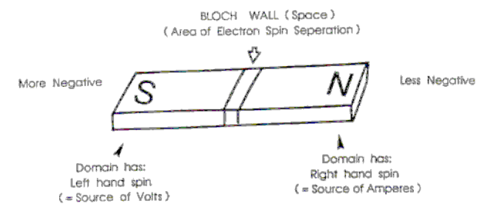
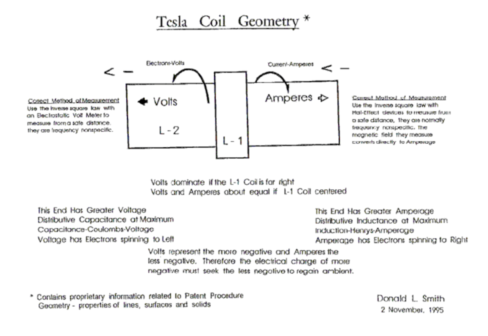
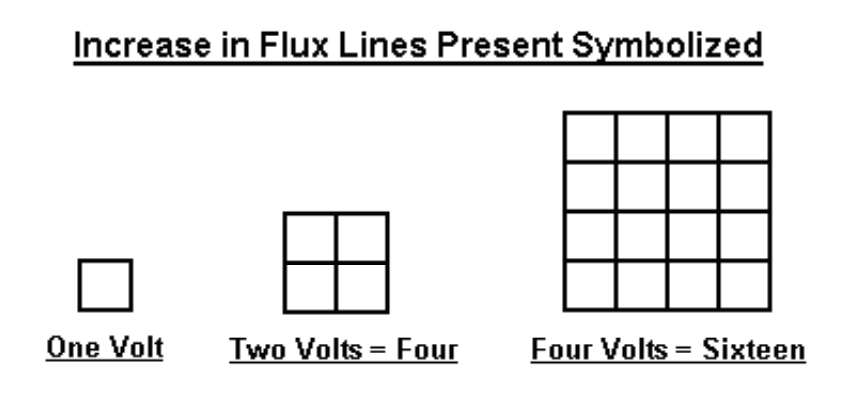
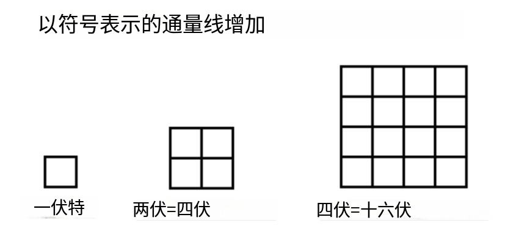
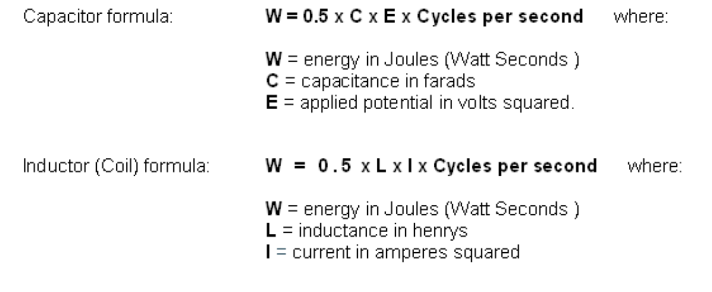
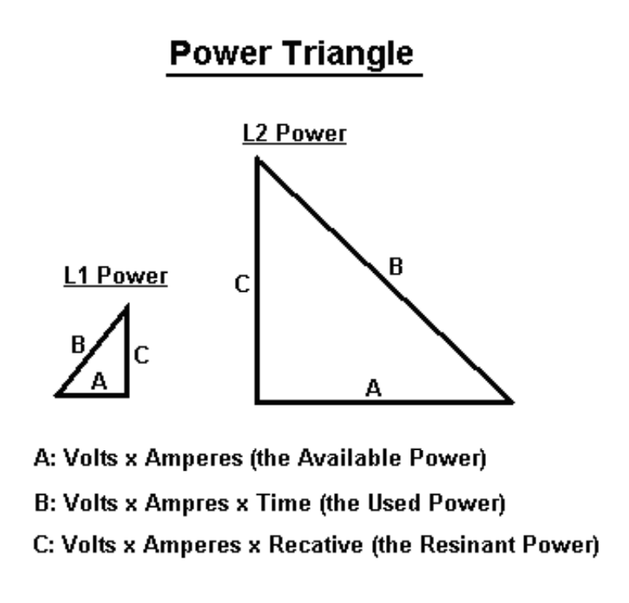

# 磁功率和电功率的推导

Derivation of Magnetic and Electrical Power

Analogous Relationships:

类比关系：

- Potential Power is present in a bar magnet as shown:

如图所示，条形磁铁中存在潜在功率：

- The Source of these Electrons being from the Solar Plasma, are non-ionic and occupy all Free Space. They are commonly obtained from Earth and Air Groundings. They exist in Doublet Pairs, one being more negative than the other. The more negative one has a Left Hand Spin. The less negative one has a Right Hand Spin.

这些电子的来源来自太阳等离子体，是非离子的，占据了所有的自由空间。它们通常来自地面和空中接地。它们存在于双对中，一个比另一个更消极。更负的一个有左手旋转。较不负的一个有右手旋转。

- Resonate Electrical Coil Systems (Tesla ) are Analogous to the System observed in the Bar Magnet (above). The Bloch Wall Area is Located at the base of the L-2 Coil. The Left Spin portion of the coil (Voltage Only ) Coil predominates. The Right hand Spin portion of the coil (Magnetic-Amperage) is mostly absent.

谐振电线圈系统（特斯拉）类似于在条形磁铁（上图）中观察到的系统。布洛赫墙区域位于L-2线圈的底部。线圈的左旋转部分（仅电压）线圈占主导地位。线圈的右侧自旋部分（磁场强度）大多缺失。

## 感应电能系统

Induced Electrical Energy System

Collection and transfer of energy requires temporary storage, which occurs as capacitors and coils of a resonant circuit are cycled, on and off. The frequency at which the capacitors and coils are pumped, determines the amount of electrical energy that moves onward.

能量的收集和转移需要临时存储，这是在谐振电路的电容器和线圈循环、打开和关闭时发生的。电容器和绕组被泵送的频率决定了向前移动的电能量。

The amount of Energy transferred relates directly to the density of lines of flux present. The Kinetic Energy Formula is helpful in establishing the amount of energy present. This formula squares the velocity times mass. In the case of electrical energy, the intensity of voltage and amperes multiplied by the cycles per second, replace the velocity component.

传递的能量与存在的通量线的密度直接相关。动能公式有助于确定存在的能量。这个公式是速度乘以质量的平方。在电能的情况下，电压和电流的强度乘以每秒的循环次数，替换速度分量。

Note that the "acceleration" of the Voltage "E" and Amperage "I", which increase as non-linear components, then obeys the Law of Squares.

请注意，作为非线性分量增加的电压“E”和电流“I”的“加速度”遵循平方定律。

Each unit of increase, causes a squaring of the flux lines present. The amount of energy transfercaused by this increase in flux lines is demonstrated below.

每增加一个单位，都会导致存在的磁通线平方。通量线增加引起的能量传递量如下所示。

In resonant air-core coil energy transfer, the increase in flux lines present disturbs more electrons than previously, resulting in over-unity energy being present and available.

在谐振空心线圈能量传递中，磁通线的增加比以前干扰了更多的电子，导致存在和可用的能量超一。

Energy stored, times the cycles per second, represents the energy being pumped by the system.  Capacitors and inductors store electrons temporarily

存储的能量乘以每秒的循环次数，表示系统泵送的能量。电容器和电感器暂时储存电子

Both one henry, and one farad, equal one volt. The higher the cycles per second, including the squaring of the flux lines, cause a large increase in the amount of energy being produced.

一个亨利和一个法拉都等于一伏特。每秒循环次数越高，包括磁通线的平方，会导致产生的能量大幅增加。

The above combined with a resonant energy induction system (where all electrons are moving in the same direction at the same time), make the next move into over-unity practical.

上述与共振能量感应系统（所有电子同时沿同一方向移动）相结合，使下一步走向超一变得切实可行。

The dampening process of conventional electrical power generation, has all the available electrons bouncing randomly, mostly cancelling out each other. In that System, the useful energy available is a very small percentage of the energy which is present.

传统发电的阻尼过程中，所有可用的电子都会随机反弹，大多会相互抵消。在该系统中，可用的有用能量只占现有能量的一小部分。

In the resonant induction system, a very high percentage of the energy present is useful. At resonance, (ohms-impedance-Z) becomes zero and all of the energy present is not degraded and becomes available to do useful work. "Ohms" is load or wasted energy, and "amperes" is the rate of that wasting of energy.

在谐振感应系统中，存在的能量的很高百分比是有用的。在谐振时，（ohms-impedance-Z）变为零，所有存在的能量都没有退化，可以做有用的工作。“欧姆”是负载或浪费的能量，“安培”是能量浪费的速率。

Using the previous information, if we now apply it to an air-core coil, resonant transformer energy system. L-1 and L-2 coils are now present. L-1 has a smaller number of turns and is several times the diameter of L-2. Input from a 12 volt high-voltage laser driver source, produces 8,000 volts with a low level of wasted energy, pushing amperage into, say, 4 turns of coil L-1. Each turn of the L-1 coil then acquires 2,000 volts of resonant potential.

使用之前的信息，如果我们现在将其应用于空心线圈谐振变压器能量系统。L-1和L-2线圈现在存在。L-1的匝数较少，是L-2直径的几倍。来自12伏高压激光驱动源的输入产生8000伏的电压，浪费的能量很低，将电流推入线圈L-1的4匝。L-1线圈的每一圈都会获得2000伏的谐振电势。

Consequently, each turn of L-2 is then exposed to the electric flux of 2,000 volts. Each turn at the bottom end of L-2 acquires 2,000 volts. The flux lines are squared and are additive as the voltage and amperage progresses towards the top end of L-2's large number of turns.

因此，L-2的每一圈都暴露在2000伏的电通量下。L-2底端的每圈电压为2000伏。磁通线是平方的，随着电压和电流向L-2的大量匝数的顶端发展，磁通线是累加的。

A huge number of additional flux lines which were not previously present become present at the top end of the L-2 coil. These flux lines excite the nearby electrons in it's earth and air and groundings. This high level of excitement above the ambient, causes a large number of electrons which were not previously a part of the energy present, to become available for use.  At this point over-unity is present in large amounts.

L-2线圈的顶端出现了大量以前不存在的额外磁通线。这些通量线激发了地球、空气和地面附近的电子。这种高于环境的高度兴奋导致大量以前不属于能量的电子可供使用。在这一点上，超一的现象大量存在。

The "bubble gum between the ears" response to this is: "this must be lots of volts but no amperes". Please recall that amperage is wasted energy, and that until that wasting occurs, thereare no amperes. A good way to demonstrate this, would be to let the bubble gum crowd put their hands on the high-voltage end of the device while standing on wet ground (a people zapper). Note: **don't do this.**

对此，“耳际泡泡糖”的反应是：“这一定是很多伏特，但没有安培”。请记住，安培数是浪费的能量，在浪费发生之前，没有安培数。证明这一点的一个好方法是让泡泡糖人群站在潮湿的地面上（电击器），把手放在设备的高压端。注意：**不要这样做**

This over-unity device produces energy at radio frequencies which range into the megahertz band. This allows the device to be small in size, and yet produce large amounts of energy. A megawatt-sized unit will sit comfortably on a breakfast table. This energy is changed to Direct Current and then switched to produce the desired working frequency AC.

这种超一装置在兆赫波段的无线电频率上产生能量。这使得该设备体积小，但仍能产生大量能量。一个兆瓦级的装置可以舒适地放在早餐桌上。该能量被转换为直流电，然后被切换以产生所需的工作频率交流电。

- Random movement of electrons in "A" and "B", mostly cancel each other out. This dampening, or wasteful concept of energy, is a source of much pleasure for the establishment.

电子在“A”和“B”中的随机运动，大多相互抵消。这种抑制或浪费能源的概念为当权者带来了极大的快乐。

- "C" (Volt, Amperes, Reactive "V.A.R."), is the situation where all of the electrons move in the same direction at the same time. This results in near-unity energy output by resonant induction transfer.

“C”（伏特、安培、无功“V.A.R.”）是所有电子同时沿同一方向移动的情况。这导致通过谐振感应传输输出接近单位的能量。

- Resonant induction transfer from one isolated power system, allows other resonant induction systems to duplicate the original source, which in no way diminishes the original source. Air core coils (isolation-transformers) confirm this when they are a part of one of these functioning systems. A less perfect illustration would be the fact that the number of radio sets tuned to a particular radio transmission, does not alter the power required at the radio transmitter.

从一个隔离的电力系统传输谐振感应，允许其他谐振感应系统复制原始电源，这绝不会减少原始电源。当空心线圈（隔离变压器）是这些功能系统的一部分时，它们证实了这一点。一个不太完美的例子是，调谐到特定无线电传输的无线电机的数量不会改变无线电发射机所需的功率。

- Resonant induction transfer, disturbs a large number of adjacent electrons which were not a part of the original input power source. The pulsating-pumping effect then draws in the newly available additional electrons into the on-going energy generation system. A near unity energy system of resonant air-core coils and the extra acquired electron-energy source constitute an over-unity system.

共振感应转移会干扰大量不属于原始输入电源的相邻电子。然后，脉动泵浦效应将新获得的额外电子吸入正在进行的能量产生系统。谐振空心线圈的近单位能量系统和额外获得的电子能量源构成了一个超一系统。

## 发电/参考点

Electrical Power Generation / Points of Reference

