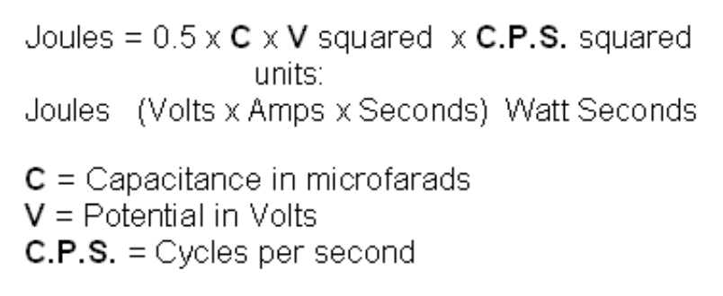
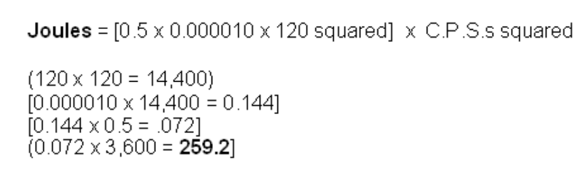
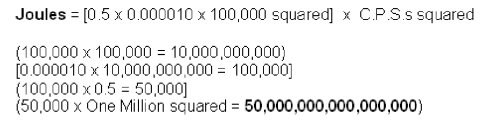

# 磁功率和电功率的推导

Derivation of Magnetic and Electrical Power

Analogous Relationships:

类比关系：

- Potential Power is present in a bar magnet as shown:

如图所示，条形磁铁中存在潜在功率：

- The Source of these Electrons being from the Solar Plasma, are non-ionic and occupy all Free Space. They are commonly obtained from Earth and Air Groundings. They exist in Doublet Pairs, one being more negative than the other. The more negative one has a Left Hand Spin. The less negative one has a Right Hand Spin.

这些电子来源于太阳等离子体，是非离子化的，并且占据了所有的自由空间。它们通常通过地球和空气接地获得。它们以双电子对的形式存在，其中一个比另一个更负。较负的电子具有左手旋，而较不负的电子则具有右手旋。

- Resonate Electrical Coil Systems (Tesla ) are Analogous to the System observed in the Bar Magnet (above). The Bloch Wall Area is Located at the base of the L-2 Coil. The Left Spin portion of the coil (Voltage Only ) Coil predominates. The Right hand Spin portion of the coil (Magnetic-Amperage) is mostly absent.

共振电磁线圈系统（特斯拉）与上述条形磁铁系统类似。布洛赫壁区域位于L-2线圈的底部。线圈的左手自旋部分（仅电压）占主导地位。线圈的右手自旋部分（磁-电流）几乎不存在。

## 感应电能系统

Induced Electrical Energy System

Collection and transfer of energy requires temporary storage, which occurs as capacitors and coils of a resonant circuit are cycled, on and off. The frequency at which the capacitors and coils are pumped, determines the amount of electrical energy that moves onward.

能量的收集和传输需要临时存储，这发生在谐振电路中的电容器和线圈循环开关的过程中。电容器和线圈被充放电的频率决定了向前传输的电能数量。

The amount of Energy transferred relates directly to the density of lines of flux present. The Kinetic Energy Formula is helpful in establishing the amount of energy present. This formula squares the velocity times mass. In the case of electrical energy, the intensity of voltage and amperes multiplied by the cycles per second, replace the velocity component.

传递的能量与存在的通量线的密度直接相关。动能公式有助于确定存在的能量。这个公式是速度乘以质量的平方。在电能的情况下，电压和电流的强度乘以每秒的循环次数，替换速度分量。

Note that the "acceleration" of the Voltage "E" and Amperage "I", which increase as non-linear components, then obeys the Law of Squares.

请注意，电压“E”和电流“I”的“加速度”是非线性增加的，因此遵循平方定律。

Each unit of increase, causes a squaring of the flux lines present. The amount of energy transfercaused by this increase in flux lines is demonstrated below.

每增加一个单位，会导致磁力线的平方增加。由磁力线增加导致的能量传输量如下所示：

In resonant air-core coil energy transfer, the increase in flux lines present disturbs more electrons than previously, resulting in over-unity energy being present and available.

在共振空心线圈能量传输中，磁力线的增加会扰动更多的电子，从而导致超过单位能量的现象发生，使得额外的能量变得可用。

Energy stored, times the cycles per second, represents the energy being pumped by the system.  Capacitors and inductors store electrons temporarily

存储的能量乘以每秒的循环次数，表示系统泵送的能量。电容器和电感器暂时储存电子

Both one henry, and one farad, equal one volt. The higher the cycles per second, including the squaring of the flux lines, cause a large increase in the amount of energy being produced.

一亨利和一法拉都等于一伏特。每秒的周期数越高，包括磁力线的平方增加，会导致产生的能量量大幅增加。

The above combined with a resonant energy induction system (where all electrons are moving in the same direction at the same time), make the next move into over-unity practical.

上述与共振能量感应系统（所有电子同时沿同一方向移动）相结合，使下一步走向超一变得切实可行。

The dampening process of conventional electrical power generation, has all the available electrons bouncing randomly, mostly cancelling out each other. In that System, the useful energy available is a very small percentage of the energy which is present.

传统电力生成中的阻尼过程会使所有可用电子随机反弹，大部分相互抵消。在这种系统中，可用的有用能量只占现有能量的一小部分。

In the resonant induction system, a very high percentage of the energy present is useful. At resonance, (ohms-impedance-Z) becomes zero and all of the energy present is not degraded and becomes available to do useful work. "Ohms" is load or wasted energy, and "amperes" is the rate of that wasting of energy.

在共振感应系统中，现有能量的很大一部分都是有用的。在共振状态下，（欧姆—阻抗—Z）变为零，所有现有能量都不会衰减，并且可以用于做有用功。“欧姆”代表负载或浪费的能量，“安培”代表能量浪费的速率。

Using the previous information, if we now apply it to an air-core coil, resonant transformer energy system. L-1 and L-2 coils are now present. L-1 has a smaller number of turns and is several times the diameter of L-2. Input from a 12 volt high-voltage laser driver source, produces 8,000 volts with a low level of wasted energy, pushing amperage into, say, 4 turns of coil L-1. Each turn of the L-1 coil then acquires 2,000 volts of resonant potential.

利用前面的信息，现在将其应用于空心线圈共振变压器能量系统。系统中存在 L-1 和 L-2 两个线圈。L-1 的匝数较少，直径是 L-2 的几倍。输入来自 12 伏高压激光驱动源，产生 8,000 伏电压，能量浪费很少，将电流推入 L-1 线圈的 4 匝。这样，L-1 线圈的每一匝就会获得 2,000 伏的共振电势。

Consequently, each turn of L-2 is then exposed to the electric flux of 2,000 volts. Each turn at the bottom end of L-2 acquires 2,000 volts. The flux lines are squared and are additive as the voltage and amperage progresses towards the top end of L-2's large number of turns.

因此，L-2 的每一匝都会受到 2,000 伏电场的影响。L-2 底部的每一匝会获得 2,000 伏的电压。随着电压和电流向上推进到 L-2 的大量匝数顶部，磁力线呈平方增加并累加。

A huge number of additional flux lines which were not previously present become present at the top end of the L-2 coil. These flux lines excite the nearby electrons in it's earth and air and groundings. This high level of excitement above the ambient, causes a large number of electrons which were not previously a part of the energy present, to become available for use.  At this point over-unity is present in large amounts.

L-2线圈的顶端出现了大量以前不存在的额外磁通线。这些通量线激发了地球、空气和地面附近的电子。这种高于环境水平的高度激发状态，使得大量原本不属于现有能量的电子变得可用。在这一点上，超一的现象大量存在。

The "bubble gum between the ears" response to this is: "this must be lots of volts but no amperes". Please recall that amperage is wasted energy, and that until that wasting occurs, thereare no amperes. A good way to demonstrate this, would be to let the bubble gum crowd put their hands on the high-voltage end of the device while standing on wet ground (a people zapper). Note: **don't do this.**

对此的“泡泡糖在耳朵里”的反应是：“这肯定是有很多伏特但没有安培。” 请记住，电流是浪费的能量，在浪费发生之前，是没有电流的。演示这一点的一个好方法是让那些持有这种观点的人站在湿地上触摸设备的高压端（相当于电击装置）。注意：**千万不要这样做**。

This over-unity device produces energy at radio frequencies which range into the megahertz band. This allows the device to be small in size, and yet produce large amounts of energy. A megawatt-sized unit will sit comfortably on a breakfast table. This energy is changed to Direct Current and then switched to produce the desired working frequency AC.

这种超一装置产生的能量在射频范围内，可达兆赫兹频段。这使得装置体积小巧，但仍能产生大量能量。一台兆瓦级别的装置可以轻松放在餐桌上。这种能量先转换为直流电，然后再切换以产生所需的交流工作频率。

- Random movement of electrons in "A" and "B", mostly cancel each other out. This dampening, or wasteful concept of energy, is a source of much pleasure for the establishment.

电子在“A”和“B”中的随机运动，大多相互抵消。这种抑制或浪费能源的概念为当权者带来了极大的快乐。

- "C" (Volt, Amperes, Reactive "V.A.R."), is the situation where all of the electrons move in the same direction at the same time. This results in near-unity energy output by resonant induction transfer.

“C”（伏特、安培、无功“V.A.R.”）是所有电子同时沿同一方向移动的情况。这导致通过谐振感应传输输出接近单位的能量。

- Resonant induction transfer from one isolated power system, allows other resonant induction systems to duplicate the original source, which in no way diminishes the original source. Air core coils (isolation-transformers) confirm this when they are a part of one of these functioning systems. A less perfect illustration would be the fact that the number of radio sets tuned to a particular radio transmission, does not alter the power required at the radio transmitter.

共振感应传输从一个隔离的电源系统中进行，允许其他共振感应系统复制原始电源，而不会减少原始电源的能量。当空心线圈（隔离变压器）作为这些功能系统的一部分时，证实了这一点。一个不太完美的例子是，调谐到特定广播传输的收音机数量并不会改变广播发射机所需的功率。

- Resonant induction transfer, disturbs a large number of adjacent electrons which were not a part of the original input power source. The pulsating-pumping effect then draws in the newly available additional electrons into the on-going energy generation system. A near unity energy system of resonant air-core coils and the extra acquired electron-energy source constitute an over-unity system.

共振感应传输会扰动大量原本不属于原始输入电源的相邻电子。脉动泵送效应随后将这些新获得的额外电子吸引到持续的能量生成系统中。接近单位能量的共振空心线圈系统以及额外获得的电子能量源共同构成一个过统一能量系统。

## 发电/参考点

Electrical Power Generation / Points of Reference

Useful Electrical Power is Generated when Electrons from Earth and Air Groundings are disturbed by the movement of coils and magnets with reference to each other. The resulting electrical and magnetic energy is then changed to joules (watt-seconds: Volts x Amps x Seconds). Each forward electron movement results in a magnetic impulse and each return movement causes an electrical impulse. The composite of the electrical energy impulses from these electrons yields useful energy (Power).

当来自地球和空气接地的电子受到线圈和磁体相对于彼此的运动的干扰时，会产生有用的电力。然后，产生的电能和磁能变为焦耳(瓦特秒：伏特x安培x秒)。每个正向电子运动都会产生磁脉冲，每个返回运动都会引起电脉冲。这些电子产生的电能脉冲的合成产生了有用的能量(功率)。

Let the above electron movement be represented by a room full of ping pong balls bouncing randomly. Most of the energy present cancels out by random impacts. This is the Classic Under-Unity approach to Electrical Power Generation, sanctioned by the Establishment.

假设上面的电子运动可以用一个充满随机弹跳乒乓球的房间来表示。大多数能量由于随机碰撞而相互抵消。这是由当权者认可的经典不超一发电方法。

In contrast to that, in the Electrical Energy Generation System presented here, the resonant Electrons are all moving in the same direction at the same time. This allows Near-Unity Electrical Power to Develop. This is the room-temperature equivalent of super conductivity.

与此相反，在这里提出的电能产生系统中，谐振电子都在同一时间沿同一方向移动。这使得Near Unity电力得以发展。这等同室温超导。

The Energy System presented here, consists of a properly-adjusted and functional resonant aircore coil tank. The magnetic energy is stored in the coil system and the Electrical Energy is stored in capacitors. From Maxwell and others, we know that electrical-related energy has an equal amount of magnetic energy associated with it.

这里介绍的能量系统由一个经过适当调整且功能正常的共振空心线圈谐振腔组成。磁能在线圈系统中储存，电能储存在电容器中。根据麦克斯韦等人的理论，我们知道与电能相关的能量具有相等的磁能。

"The formula which establishes the Useful Energy of the System":

“确定系统有用能量的公式”：

The transfer of Electrical Power by Resonant Induction is a direct function of the squaring of the cycles per second. For example, square 60 C.P.S. and then square the radio frequency C.P.S.s of the System here presented. Obviously, One Million Cycles per Second transfers more energy than Sixty Cycles per second. The Sanctioned Method of Electrical Power Generation uses the 60 C.P.S. Method. Using 60 C.P.S. and the random scattering of the Electrons System, assures the Establishment of it's desired Under-Unity Goal.

通过共振感应传输电能是每秒周期数平方的直接函数。例如，将 60 C.P.S.（每秒周期数）平方，然后将这里介绍的系统的无线电频率 C.P.S.s 平方。显然，每秒一百万次的周期传输的能量远多于每秒六十次的周期。传统的电力生成方法使用 60 C.P.S. 方法。使用60 C.P.S.和电子系统的随机散射，确保不能起一的目的。

This random bouncing of the Electrons is the Ohms of Ohm's Law and is used to establish the rate of dissipation and/or Load (Work).

电子的这种随机反弹是欧姆定律的欧姆，用于确定耗散率和/或负载(功)。

In the Resonant Tank Induction Energy Transfer System presented here, Impedance (system resistance) replaces the conventional ohm's usage. At Resonance, impedance becomes zero and the full force and effect of the Energy Transfer occurs. This is superconducting conditions at room temperature. At radio frequency the Electrons do not pass through the conductor as they do at lower frequencies. Instead, these Electrons encircle the conductor and are free of the conductor's resistance.

在本文介绍的共振感应能量传输系统中，阻抗（系统电阻）取代了传统欧姆定律的应用。在共振状态下，阻抗变为零，能量传输的全部效果得以实现。这相当于室温下的超导条件。在射频下，电子不像在较低频率下那样通过导体。相反，这些电子环绕导体，不受导体电阻的影响。

Let the Establishments Power Generation System be called 'A" and the System presented here be called "B".

将当权派的电系统称为“A”，此处介绍的系统称为”B“。

With "A": Given 60 C.P.S. at 120 Volts using a 10 microfarad Capacitor:

使用“A”：使用10微法电容器在120伏下给出60 C.P.S.：

Using the Inventor's Resonant Induction System, the Electrical Power available would then be 259.2 Joules (Watt-Seconds). Using the Establishment's method only permits less than 10 WattSeconds of Useful Electrical Energy.

使用发明人的谐振感应系统，可用的电力将为259.2焦耳(瓦秒)。使用权派的方法只允许小于10瓦特秒的有用电能。

"B". Given One Million Cycles per second at 100,000 Volts, using a 10 microfarad Capacitor.

B使用10微法电容器，在100000伏下每秒100万次循环。

## 发明人系统的好处

Benefits of the Inventor's System

1. Induction Energy transfer is enhanced by the squaring of the cycles per second produced by the System.
2. Induction Energy transfer is enhanced by the squaring the input voltage and amperage.
3. The increase of the flux lines occurring from the above, disturbing more electrons, causes more electrical energy to become available.
4. Resonant Induction has all of the Electrons moving unimpeded, resulting in superconductor conditions at room temperature.
5. A smaller amount of energy is used to disturb a larger number of Electrons. Electrons not originally a part of the System then contribute their energy, resulting in a net gain in available usable power.
6. The physical size of the System (Device) is small. The Device described in "B" sits comfortable on a breakfast table.
7. A small energy source is used to start the device and that source remains fully charged at all times by the System.

--
1. 感应能量传递通过系统产生的每秒周期的平方来增强。
2. 通过将输入电压和电流平方来增强感应能量传递。
3. 上述情况引起的通量线的增加，干扰了更多的电子，导致更多的电能可用。
4. 共振感应使所有电子不受阻碍地移动，从而在室温下形成超导体条件。
5. 使用较少的能量来干扰较多的电子。电子最初不是系统的一部分，然后贡献它们的能量，导致可用功率的净增益。
6. 系统(设备)的物理尺寸较小。“B”中描述的设备舒适地放在早餐桌上。
7. 使用小型能源启动设备，该能源始终由系统充满电。

## 不能超一的反证

The Evidence Against Under Unity

1. Use of Logarithmic Scales on electrical measurement instruments. Linear measurement works fine where Ohm's Law applies (direct current). In alternating current, ohms are replaced by impedance and the measurements become non-linear.
2. Infinite "Q" at resonance confirms that voltage and amperage is squared, as in the kineticenergy formula. See the formulas of this report.
3. Square waves are clipped infinite "Q"s.
4. Maxwell and others show that magnetic-inductance-amperage and electrical-capacitancevoltage are two sides of the same coin. Magnetic-inductance is directly equal to amperage.  Both obey the Law of Squares, which has over-unity built in.
5. Magnetic and electrical flux are present in enormous amounts at the outer ends of an operating Tesla Coil.
6. Ignorance of how to measure and relate magnetic and electrical flux, is the chief weapon of the under-unity gaggle.
7. The Cumulative inductance and capacitance of the Tesla Coil grounds itself out, if not properly utilized. See this report for the temporary energy storage accessible, when properly managed.
8. The Patent Office refers devices related to over-unity to their metering group, which is a sure indication that they are aware and accept the logarithmic measuring devices. This is direct and absolute evidence that they accept the square law as it relates to kinetic energy. This also indicates they are aware that over-unity exists. Since their bureaucratic brain is improperly motivated they continue to badger inventors who are working in the over-unity arena. Their level of intellectual dishonesty is sanctioned by, and is a real part of doing business with, a government which prides itself in being a hooliganistic bureaucracy.

1. 在电气测量仪器上使用对数刻度。线性测量在欧姆定律适用的地方（直流电）工作良好。在交流电中，欧姆被阻抗所取代，测量结果变得非线性。
2. 谐振时的无限“Q”证实了电压和电流的平方，如动能公式所示。请参阅此报告的公式。
3. 方波被截断为无限“Q”。
4. Maxwell等人表明，电感电流和电容电压是同一枚硬币的两面。磁电感直接等于安培数。两者都遵守正方形法则，该法则具有内在的超一性。
5. 运行中的特斯拉线圈的外端存在大量的磁通量和电通量。
6. 忽略如何测量和关联磁通量和电通量，是认为不能起一的人的主要武器。
7. 如果使用不当，特斯拉线圈的累积电感和电容会自行接地。如果管理得当，请参阅本报告以了解可访问的临时储能。
8. 专利局将与超一相关的设备归入其计量组，这明确表明他们知道并接受对数测量设备。这是他们接受与动能相关的平方律的直接和绝对证据。这也表明他们意识到存在超一设备。由于他们的官僚大脑动力不足，他们继续纠缠着在起一领域工作的发明家。他们的智力不诚实程度得到了一个以流氓官僚主义为荣的政府的认可，也是与之做生意的一部分。

Reading List

1. Alston, L.L. ( Ed.), 1968, High-Voltage Technology, Oxford Univ. Press, London
2. Beck, E. 1954, Lightning Protection for Electric Systems, McGraw-Hill, N Y.
3. Bowdler, GAV. 1973, Measurements in High-voltage Test Circuits Pergamom, Oxford. L C.  72-86488
4. Brewley, L.V., 1951, Traveling Waves in Transmission Lines Pub: John Wiley. N.Y.
5. Chapman, S. and Barteis, J . 1940, Geomagnetism, two volumes, 1,000 plus pages, Oxford at the Clarendon press, England
6. Craggs. J.D. and Meek, J.M. 1954, High-Voltage laboratory Technique., Butterworth, London
7. EHV Transmission Line Reference Book, 1968 Edison Elcctric Institute, N.Y.
8. Farno, R.M., Chu. L.J., and Adler, R.B., 1968, Electromagnetic Fields, Energy and Forces, Pub: M.I.T Press, Cambridge, Mass.
9. Feinberg, R. (Ed. ) 1979, Modern Power Transformer Practice, McMillan. London
10. Frungel, F., High Speed Pulse Technology, Vols 1 and 2, Pub: Academic Press. 1965, N.Y., and London
11. Gallagher, T.J. and Pearmain, AJ. 1983, ISBN 0-471-90096-6 High Voltage Measurement and Design, John Wiley, N.Y.
12. Hague, B., Alternating-Current Bridge Methods, 5 th. ed. Pub: Sir lsaac Pitman and Sons, 1959, London.
13. Hawley, W.G. 1959, Impulse-voltage Testing, Chapman and Hill, London.
14. Hayashi, Ch., Non-linear Oscillations in Physical Systems, Pub: McGraw-Hill, 1964. N.Y.
15. Henny, K. 1933-1959, Editor-in-Chief, Radio Engineering Handbook, five different copyrights, L.C. 58-11174, McGraw-Hill. N.Y.
16. Hudlestone, R.H. and Leonard, S.L., Plasma Diagnostics Techniques, Pub: Academic Press.  N.Y.
17. Jacobs, J A., Editor, Geomagnetism, ( a massive work ) 3 large volumes, Pub: Academic Press, London.
18. Jeans, J.H. 1925, The Mathematics of Electricity and Magnetism, 5 th. Ed., Cambridge University Press,
19. Jones, B. 1972, New Approaches to the Design and Economics of EHV Transmission Plant, Pergamom, London.
20. Kind, D. 1978, An Introduction to High-voltage Experimental Technique, Viewieg, Braunschweig ISBN 3-528-08383-2
21. Knoepfel. H. 1970. Pulsed High Magnetic Fields, North-Holland, Amsterdam.
22. Kreuger, F H. 1964, Discharge Detection in High-Voltage Equipment, Temple Press, Heywood, London.
23. Kuffel, E. and Zacngl. W S. 1984, High-Voltage Engineering, Pergamom, London. ISBN 0-08-024213-8
24. Kupfmuller, K. 1957, Introduction to the Scientific Basis of Electrical Engineering, Pub Spinger. Berlin.
25. Lemon. H.B. and Ference, M. Jr., Analytical Experimental Physics " a major work" from The Ryerson Physical Laboratory at the University of Chicago, numerous copyrights 1933-1944. Printed as a text book by the University of Chicago Press
26. Lewis, I.A.D., and Well, F.H., Milli-microsecond Pulse Techniques Pub: Pergamom Press, N.Y. and London.
27. Malan, D.J. 1963, Physics of Lightning, English University Press, London.
28. Martin, T.L Jr., Physical Basis for Electrical Engineering, Prentice-Hall, N.J.
29. Matsusta, S. and Campbell, W.H . 1967 Physics of Geomagnetic Phenomena, Massive work in two volumes of 700 pages each. Academic Press, London.
30. National Physical laboratory, 1956, Notes on Applied Science ii 17, High Voltage Impulse Testing. HMSO.
31. Rather, H.. 1961, The Electron Avalanche and it's Generation, Pub: Vo. 33, Springer, Berlin.
32. Rokityansky, I.I., 1982. Geo-electromagnetic Investigation of the Earth's Crust and Mantle, Pub: Springer-Verlag, Berlin.
33. Salge, J., Pcier, D , Brilka, R., Schneider, D„ 1970, Applications of Inductive Energy Storage for the Production of Intense Magnetic Fields, Pub: Procedure of 6 th. Symp. on Fusion Technology, Aachen
34. Schulz, E.H., Anderson, L.T., and Leger, R.M., Experiments in Electronics and Communication Engineering, Copyrights, various, from 1943 thru 1954 LC 55-5033 Harper and Brothers, N.Y.
35. Schwab, AJ 1972, High-Voltage Measurement Techniques, The M I T. Press, Cambridge.  Mass., ISBN 0262-19096-6
36. Sevin, L., 1965, Field Effect Transistors, McGraw-Hill, London.
37. Silsbee, F.B., 1942, Static Electricity, U.S. Department of Commerce, Washington. DC, U.S. Government Printing Office, (N.B.S. Circular C 438)
38. Smith, A. A., 1977, Coupling of External Electromagnetic Fields to Transmission Lines, ISBN 0-471-01995-X
39. Terman. F.E., Electronics and Radio Engineering, 4 th. ed., Copyrights 1932, 1937, 1947 and 1955 LC 55-6174 McGraw-Hill Book Co., N.Y
40. Thomas, R.T.,1970 High-Impulse Current and Voltage Measurement, Trans. I.E.E.E. EV1-19, pages 102-107
41. Thompson, Professor W, (titled Lord Kelvin ) Reprint of Papers or. Electrostatics and Magnetism (original 1872) London.
42. Traister, R., 1983, The Experimenter's Guide to Solid State Diodes, Prentice-Hall, Inc.  ISBN 0-13-295444
43. Valley, G.E, and Wallman. II . 1948, Vacuum Tube Amplifiers, McGraw-Hill, N.Y.
44. Weedy, B.M. 1980, Underground Transmission of Electrical Power, Wiley, London,
45. Weeks, W L. 1981, Transmission and Distribution of Electrical Energy, Harper and Row, N.Y.
46. Winch, R_P. Electricity and Magnetism ( several printings ) Composed in Copenhagen, Denmark, Prentice-Hall Physics Series
47. Zijlstra, H., 1957, Experimental Methods in Magnetism, two volumes, the North-Holland Publishing Co.. Amsterdam.
