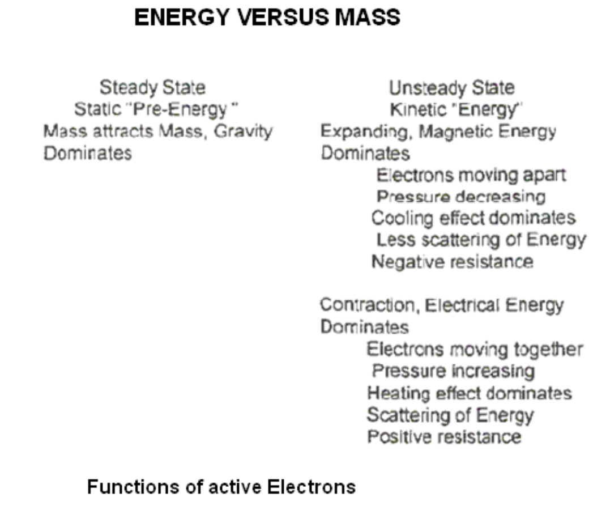

# E.E.S. II背景信息和概念

E.E.S. II, BACKGROUND INFORMATION & CONCEPT

With alternating electrical current, electrons do not move from point "A" to point "B" as commonly envisioned! Electrical potential (oscillating electrons) at point "A", results in harmonic electron activity at point "B", when the grounding switch (circuit) is closed. That is to say, point "B" supplies it's own electrons and mirrors the activity of point "A". Impulsing (turbulence) by magnetic induction causes electrons to be pulled into the system, which then oscillates. When the magnetic field collapses (becomes absent) the electrical potential returns to it's natural background level.

使用交流电时，电子不会像通常想象的那样从点“A”移动到点“B”！当接地开关（电路）闭合时，点“A”处的电势（振荡电子）会导致点“B”处的谐波电子活动。也就是说，点“B”提供自己的电子，并反映点“A”的活动。磁感应的脉冲（湍流）导致电子被拉入系统，然后系统振荡。当磁场崩溃（消失）时，电势恢复到其自然背景水平。

Several major flaws are present in the conventional 60 cycles per second method of electrical power generation and it's iron core transformer system. This system is handcuffed by the inverse relationship of volts to amperes. This represents a stodgy, inflexible inheritance, courtesy of Mr. T.A. Edison and his concept of electrical power generation.

传统的每秒60次循环的发电方法及其铁芯变压器系统存在几个主要缺陷。这个系统被伏特与安培的反比关系所束缚。这代表了爱迪生先生及其发电概念的一种僵化、不灵活的继承。

Nikola Tesla stood, almost alone, against Edison and managed to prevail with his Alternating Current system. Without the alternating current system, electronic things in the modern sense would not exist.

尼古拉·特斯拉几乎独自一人对抗爱迪生，并凭借他的交流电系统取得了胜利。没有交流电系统，现代意义上的电子产品就不会存在。

This report will be concerned with some of the extensions and benefits of the alternating current electrical system. This study will limit it's scope to air core coil transformers at radio frequency and upwards. The electrical power produced by this method is inverted to Direct Current and then to Alternating Current as required for popular usage. There are several important advantages of this system over conventional power generation.

本报告将关注交流电系统的一些扩展和好处。本研究将把其范围限制在射频及以上的空心线圈变压器上。这种方法产生的电力被转换为直流电，然后根据大众使用的需要转换为交流电。与传统发电相比，该系统有几个重要优点。

Start with two coils (separate-apart), one being a reactor coil (L-1) and a second coil (L-2), being the reactant coil. Magnetic field fluxing (off-on of the electrical source) causes inductive reactance of L-1 which replicates by induction in L-2. Pulsing of the magnetic field (from L-1) in the presence of L-2, generates electrical potential. For example, should the L-1 coil have ten turns, with an imposed AC. potential of 1,200 volts. This results in each turn of L-1 acquiring 120 volts of potential. This induced magnetic field, then replicates itself in each turn of the L-2 coil. The L-2 coil may have one or many hundreds of turns. Modern encapsulation techniques makes high frequency and high energy controllable.

从两个线圈（分开）开始，一个是反应器线圈（L-1），另一个线圈（L-2）是反应物线圈。磁场通量（电源关闭-打开）导致L-1的电感电抗，该电抗在L-2中通过感应复制。在L-2存在的情况下，磁场（从L-1）的脉动会产生电势。例如，L-1线圈应该有十匝，施加1200伏的交流电势。这导致L-1的每一圈获得120伏的电势。然后，这种感应磁场在L-2线圈的每一圈中复制自己。L-2线圈可能有一圈或几百圈。现代封装技术使高频和高能可控。

Let's take another important step in this air-core transformer process. For purpose of discussion, let the value of inductive reactance at 60 cycles per second, equal one. Each time the frequency is doubled, the effectiveness of induction is squared. At about 20,000 Hz, when radio frequency is achieved, the electrons begin spinning free, outside of the inductor and they become increasingly free of the inverse relationship of volt-amperes. From this point on, they replicate by the inductive process as V.A.R.. That is to say, volts and amperes are equal, until resistance (work) is introduced. Therefore, additional, not previously available electrons become incorporated for a very large net gain in potential. This gain is real !

让我们在这个空心变压器过程中迈出另一个重要步骤。为了便于讨论，让每秒60个周期的电感电抗值等于1。每次频率加倍，感应的有效性都是平方。在大约20000 Hz的频率下，当达到射频时，电子开始在电感器外自由旋转，并且它们越来越不受伏安的反比关系的影响。从这一点开始，它们通过感应过程复制为V.A.R.。也就是说，在引入电阻（功）之前，伏特和安培是相等的。因此，额外的、以前不可用的电子被引入，从而获得了非常大的电势净增益。这个收获是真实的！

The quality of the grounding system determines the effectiveness of this method of producing electricity. A handy reference to locate the negative grounding areas for power generation can be found in the Aeromagnetic Map Studies of the US Geological Survey. They provide an excellent method for locating the best sites for optimum negative grounding areas.  When this method is combined with the induction coil system, already described, it provides an electrical power generating system millions of times more efficient than any known conventional method.

接地系统的质量决定了这种发电方法的有效性。在美国地质调查局的航磁图研究中可以找到一个方便的参考，用于定位发电的负极接地区域。它们为确定最佳负极接地区域的最佳位置提供了一种极好的方法。当这种方法与已经描述的感应线圈系统结合时，它提供了一种比任何已知的传统方法高效数百万倍的发电系统。

This new system ("E.E.S. II") is uncomplicated, physically small and it is inexpensive to build.  The technology required for it's construction already exists. Maintenance is near zero, as there are no moving parts. Once operating, this system could last forever.  Small mobile E.E.S. II units are already available as replacements for the batteries used in electric automobiles. Larger E.E.S. II units can be provided as a replacement source of power for hotels, office buildings, subdivisions, electric trains, manufacturing, heavy equipment, ships, and generally speaking, any present day application of electrical power.

这个新系统（“E.E.S.II”）结构简单，体积小，建造成本低。建造它所需的技术已经存在。由于没有活动部件，维护几乎为零。一旦运行，这个系统可以永远持续下去。小型移动E.E.S.II装置已经可以替代电动汽车中使用的电池。更大的E.E.S.II机组可以作为酒店、办公楼、分区、电动火车、制造业、重型设备、船舶以及一般来说任何当前电力应用的替代电源。

## 接地电气系统II，模块化单元

Earth Electrical System II, Modular Units

The system consists of three separate modules. Reverse engineering is used in matching the modules to the desired usage.

该系统由三个独立的模块组成。逆向工程用于将模块与所需用途相匹配。

HIGH VOLTAGE INDUCTION TRANSFORMER MODULE:

1. Preferably an off-the-shelf-unit similar to a TV flyback and/or automobile ignition type related coil (transformer).
2. Ratio of input to output may be from less than 1:100 to greater than 1:1,000 A voltage tripler may then be used.
3. A connection allowing the high voltage output to pass onward through the induction coil L-1 and then to it's grounding.

高压感应变压器模块：

1. 优选地，类似于电视反激式和/或汽车点火型相关线圈（变压器）的现成单元。
2. 输入与输出的比率可以从小于1:100到大于1:1000。然后可以使用电压三倍器。
3. 允许高压输出向前通过感应线圈L-1，然后到达其接地的连接。

AN AIR CORE INDUCTION COIL TRANSFORMER MODULE:

1. There are two coils: the reactor coil L-1 and the reactant coil L-2. L-1 has a high voltage radio frequency capacitor between it and it's grounding.
2. Input into the L-1 inductor is divided by the number of turns in it. The magnetic flux field provided from each turn of L-1 replicates itself as an electrical potential in each turn of L-2.
3. L-2 may have one turn or many hundreds of turns. The net gain depends upon the number of turns in L-2. Output from L-2 is in V.A.R. With this type of output, volts and amperes are the same until work(resistivity) is introduced

空心感应线圈变压器模块：

1. 有两个线圈：反应器线圈L-1和反应物线圈L-2。L-1和接地之间有一个高压射频电容器。
2. L-1电感器的输入除以其匝数。L-1每匝提供的磁通量场在L-2每匝中复制为电势。
3. L-2可能有一圈或几百圈。净增益取决于L-2中的匝数。L-2的输出为V.A.R。在引入功（电阻率）之前，这种输出的电压和电流是相同的

THE INVERTER MODULE:

1. Inverts to direct current (D C.)
2. Inverts to alternating current (A C ), as desired.
3. Provides customized output of electrical power ready for designated usage

逆变器模块：

1. 转换为直流电（DC）
2. 根据需要转换为交流电（AC）。
3. 提供定制的电力输出，可用于指定用途
   

## 电能参考点

ELECTRICAL ENERGY REFERENCE POINTS 

Electrical Energy Generating System 

Patent Pending # 08/100.074. 2/4/92

电能发电系统 专利申请号08/100.074。2/4/92

Speech presented the evening of 23 July. 1994 at the International Tesla Society Convention at Colorado Springs. Colorado.

DONALD L. SMITH ENERGY CONSULTANT 8110 BENT OAK LANE SPRING. TEXAS 77379

7月23日晚发表的演讲。1994年，在科罗拉多斯普林斯举行的国际特斯拉协会大会上。科罗拉多。

唐纳德·L·史密斯能源顾问，德克萨斯州斯普林弯橡树巷8110号，邮编77379

The word "electric" comes from the Latin word electron "amber". When rubbed, amber develops an electrical charge, which can be transferred to a dissimilar substance. During the seventeenth and eighteenth centuries, a great deal of attention was centered on this attribute of amber. Amber was used to differentiate the non-metals. Carbon-related substances and other non-metals, when subjected to friction, give up negative electrical charges. On the other hand, metals when subjected to friction, simply conduct the charge. It is important to note that approximately 70% of the Earth's exposed crustal portions (surface) consist of silicone related non-metals (electron donors) and therefore becomes a direct source of electrical energy when properly agitated.

“电”这个词来自拉丁语“电子”琥珀。摩擦时，琥珀会产生电荷，电荷可以转移到不同的物质上。在十七和十八世纪，人们对琥珀的这一特性给予了极大的关注。琥珀被用来区分非金属。碳相关物质和其他非金属在受到摩擦时会释放负电荷。另一方面，金属在受到摩擦时，只会传导电荷。值得注意的是，地球上大约70%的暴露地壳部分（表面）由硅相关的非金属（电子供体）组成，因此在适当搅拌时会成为直接的电能来源。

Useful electrical energy is obtained by grounding into the Earth's non-metal crust and into it's atmosphere as a natural source of electrons. These electrons have accumulated from the solar plasma during the aging of the Earth for more than 4.5 billion years, at a rate exceeding 3.9 exajoules per year. This indicates that the Earth's electrical field contains in excess of 17.6 x 1018 power of cumulative exajoules of energy. One exajoule is the approximate energy equivalent of 125 million barrels of oil. The electrical energy in one display of lightning is approximately ten trillion joules. During each 24 hour period, the land portions of the Earth's surface yields in excess of 200,000 emissions, which involves more than 2,000 quadrillion watt-seconds of active energy on display.

有用的电能是通过接地进入地球的非金属地壳和大气层作为电子的天然来源而获得的。在地球老化过程中，这些电子以每年超过3.9艾焦耳的速度从太阳等离子体中积累了超过45亿年。这表明地球的电场包含超过17.6 x 1018次方的累积艾焦耳的能量。1艾焦耳大约相当于1.25亿桶石油的能量。一次闪电显示的电能约为10万亿焦耳。在每24小时的时间段内，地球表面的陆地部分产生的排放量超过20万次，这涉及超过2000万亿瓦时的显示有功能量。

This physical phenomenon indicates that the Earth's crust is an unending source of electrical energy. The surface area involved is a very small portion of the Earth's crust.  J.C. Maxwell (1891) suggested that an active electron field gives rise to an associated magnetic field. Therefore, both are present with pulsating current. Early studies, involving observation of compass needles by microscopy, revealed that the needle vibrates as with alternating current.  More recent studies by A. Nishida and others, confirm that alternating current is common in the Earth's crust.

这一物理现象表明，地壳是一个无休止的电能来源。所涉及的表面积是地壳的一小部分。J.C.Maxwell（1891）提出，活跃的电子场会产生相关的磁场。因此，两者都存在脉动电流。早期的研究，包括通过显微镜观察指南针针，表明指南针针会像交流电一样振动。A.Nishida和其他人最近的研究证实，交流电在地壳中很常见。

C.F. Gauss (1777-1855) and H.C. Oersted (1777-1851), both were separately trying to define the Earth's electrical field with all external influences removed. These external influences being solar-quiet periods and being remote from the land's surface. The air electricity background which they measured varies with latitude. Their European measurements correspond to approximately the latitude of Washington, D.C. They were measuring magnetic field flux as an indicator of negative electron energy active and present.

C.F.高斯（1777-1855）和H.C.奥斯特（1777年-1851）都试图在去除所有外部影响的情况下分别定义地球的电场。这些外部影响是太阳平静期和远离陆地表面。他们测量的空气电背景随纬度而变化。他们在欧洲的测量值大约相当于华盛顿特区的纬度。他们测量磁场通量，作为活跃和存在的负电子能量的指标。

A related family of measurement is now presented. Units of measurement used to define flux fields include Gauss (one unit = 100,000 volts), Oersted (one unit - 50,000 volts), Tesla (oneunit = 10,000 Gauss) and Gamma (one unit = 1/10,000 th of a Gauss). Much confusion exists in electrical related publications about these units. As presented here, they are correct with values taken from their original definitions.

现在介绍一个相关的测量系列。用于定义通量场的测量单位包括高斯（一个单位=100000伏）、奥斯特（一个单元-50000伏）、特斯拉（一个装置=10000高斯）和伽马（一个部件=高斯的1/10000）。与电气相关的出版物中对这些装置存在很多混淆。如这里所示，它们的值取自其原始定义，是正确的。

The entire surface of the Earth has been surveyed by aerial magnetometer, in most cases using gamma or nano teslas. One gamma is the magnetic flux equivalent of 10 active volts of electricity. When this data is corrected for flight height, it becomes obvious that there are numerous areas where the gamma readings exceed one trillion gammas. Lightning strikes from the ground up are in that energy range. With knowledge of these electron enriched areas, the quality of Earth grounding, becomes enhanced.

航空磁强计已经对地球的整个表面进行了测量，在大多数情况下使用伽马或纳米特斯拉。一个伽马是相当于10伏有效电压的磁通量。当这些数据根据飞行高度进行校正时，很明显，在许多地区，伽马读数超过一万亿伽马。地面上的雷击就在这个能量范围内。随着对这些电子富集区的了解，地球接地的质量得到了提高。

The correction necessary for land surface data when acquired from aerial magnetometer maps (using the inverse square law) requires that the remote distance be squared and then multiplied by the remote reading. For example, if the reading is 1,600 gammas and the flight height is 1,000 feet. Take 1,000 x 1,000 = 1,000,000 x 1,600 gammas = 1.6 trillion gammas x 10 volts = 16 trillion volts equivalent for land surface data.

从航空磁强计地图（使用平方反比定律）获取的陆地表面数据所需的校正要求将远程距离平方，然后乘以远程读数。例如，如果读数为1600伽马，飞行高度为1000英尺。对于陆地表面数据，取1000 x 1000=1000000 x 1600伽马=1.6万亿伽马x 10伏特=16万亿伏特当量。

Present day methodology requires mechanical energy to be expended in exchange for electrical energy. Any required amount of electricity is available by resonant induction transfer from the Earth's magnetic and electrical fields. Each cycling of this resonant induction system pulls in additional electrons, generating energy in any required amount. A small amount of electrical energy is used to activate and pull into the system a much larger amount of energy.

目前的方法需要消耗机械能来换取电能。任何所需的电量都可以通过地球磁场和电场的共振感应传输来获得。这种共振感应系统的每次循环都会吸引额外的电子，产生任何所需量的能量。少量的电能用于激活并将大量的能量引入系统。

Electrons become active when placed inside the critical distance allowed by their negativity.

当电子被置于其负性所允许的临界距离内时，电子会变得活跃。

Active Electrons provide:

1. Electricity
2. Magnetics
3. Gravitational thrust as in Electric Motors
4. The source of Visible Light
5. It's charge is Negative

活性电子提供：

1. 电力
2. 磁学
3. 电动机中的重力推力
4. 可见光的来源5。
5. 费用是负数

They move in a closed loop as seen in the Icon for infinity, not in a circle as shown in many books. One half of the loop consist of a magnetic impulse and the return half consist of the electrical impulse. This is seen as the classic sine wave of alternating electrical energy.

它们在无限图标中以闭环方式移动，而不是像许多书中所示的圆形。回路的一半由磁脉冲组成，另一半由电脉冲组成。这被视为交流电能的经典正弦波。

A flash of light occurs when two electrons suddenly find they are too close together. Daylight results from the impingement of Electrons in the Earth's atmosphere with the Electrons of the Solar Plasma.

当两个电子突然发现它们靠得太近时，就会发生闪光。日光是由地球大气中的电子与太阳等离子体中的电子碰撞产生的。

My Concept of the Forces of Nature differs from the conventional. It consist of a weak and a strong force, each being additionally composed of electrical, magnetic and gravitational (fields and waves). Any two of the three constitute the third member; Gravity "B" of the weak force competes with humans on a daily basis. Gravity "A" of the strong force is the force that holds the Solar System and the Universe in place. Energy from the Electrons represent the weak force. Energy inside the Atom represents the strong force "A". Controlled resonant induction of any two of the three, changes into the third and is the motor that runs the Universe. We see this in the electrically-induced magnetic thrust against gravity in electric motors.

我的自然力量概念不同于传统。它由一个弱力和一个强力组成，每个力又由电、磁和引力（场和波）组成。三人中的任何两人构成第三名成员；弱力的引力“B”每天都在与人类竞争。引力“A”的强大力量是将太阳系和宇宙保持在适当位置的力量。电子的能量代表了弱力。原子内部的能量代表了强大的力“A”。三者中任意两个的受控共振感应，变成第三个，是运行宇宙的发动机。我们在电动机中抵抗重力的电感应磁推力中看到了这一点。

Weak force is required to dislodge electrons and strong force (atomic) to dislodge protons.  Unless dislodged, these particles are of little value in producing Conventional Electrical Energy.

需要弱力来驱逐电子，需要强力（原子力）来驱逐质子。除非被移除，否则这些粒子在产生传统电能方面几乎没有价值。

Therefore, in conventional electrical energy production, the particle of importance is the negative electron. Electrons have a "grudging" relationship with other electrons. They like each other, especially at arms length. Like potentials repel each other, and unlike potentials attract.  To demonstrate this, take two batteries of the same type, but of a different charge level (unequal potentials). Put the plus and minus ends facing the same direction. Then with a volt meter, measure the electrical potential between the two negative ends and then the two positive ends. It is obvious that the "more negative" moves to the "less negative" is the correct concept for electrical energy generation. Electrical Energy flow consist of a higher concentration of
electrons moving to an area of lesser concentration.

因此，在传统的电能生产中，重要的粒子是负电子。电子与其他电子有着“勉强”的关系。他们彼此喜欢，尤其是在手臂的长度。同性势相互排斥，异性势相互吸引。为了证明这一点，取两个相同类型但充电水平不同的电池（不等电位）。将正负两端朝向同一方向。然后用电压表测量两个负极之间的电势，然后测量两个正极之间的电势。很明显，从“更消极”到“更少消极”是发电的正确概念。电能流由更高浓度的电子移动到浓度较低的区域。

OHM'S LAW WITH CORRECTIONS:

A major obstruction in reference to the correct function of electrical energy is the establishment's incorrect interpretation of Ohm's Law. The corrected version is:

    Volts = Energy Available (Potential)
    Ohm = Scattering, dissipation of Energy (Load)
    Ampere = the rate of, dissipation / scattering of energy

欧姆定律及其修正：

关于电能正确功能的一个主要障碍是机构对欧姆定律的错误解释。更正后的版本为：

    伏特=可用能量（电势）
    欧姆=散射、能量耗散（负载）
    安培=能量耗散/散射率

It is important to note that Ohm and Ampere are after the fact, and are not decisive except for the dissipation factor. High Voltage at low amperage simply means that the High Voltage is still intact for future usage. In no way is the potential diminished by low amperage.

值得注意的是，欧姆和安培是事后的，除了耗散因子外，它们不是决定性的。低电流下的高压意味着高压仍然完好无损，可供将来使用。低电流决不会降低电势。

## 超一的例子

EXAMPLES OF OVERUNITY

Dominos did not exist in England when the Laws of Conservation were originally put in place.
Otherwise they might have been very different. For example, let us take a long row of upright
dominos, (many thousands) and flip number one. The Energy required to flip the first domino
must now be added with that of thousands more in order to have a correct assessment.

The Electron itself is an excellent example of over-unity. The electron provides various forms
of energy continuously throughout eternity and is in no way diminished. It simply cycles
through the system and is available thereafter.

In Electrical Systems, Electrons active at point "A" are not the same Electrons active at point
"B". That is to say, the Electrons activated at the Central Electrical Energy Station are not the
ones used at your house. When you ground your system by flipping the wall switch, you use
your own electrons. In closed energy systems, electrons communicate with and replicate the
activity of the overbalanced potential, when provided with Earth and or Air Groundings.

The number of Radio sets and Television sets running at any one time do not diminish, in any
way the electrical output of the source station.

For example, let now use an Air Coil Resonant Induction System for the purpose of flipping
some electrons. The flipping device (reactor coil L-1) is pulsed, which then provides a resonant
induction pulse. In turn, this flips the electrons present at the (reactant L-2) Coil. The energy
input in L-1 is divided by the number of turns present. The induced magnetic pulsing in turn
flips the electrons in each turn of L-2. If more turns are present in L-2 than L-1, there is a net
gain in the Energy present, as demonstrated by the dominos above. The farads and henrys of
the resonant system provide the resonant frequency when pulsed by an external energy system.
A system shunt in the resonant circuit sets the containment level for energy potential.

The Induction Process itself provides an excellent example of over-unity. When comparing rate
of induction, the cycles per second must be squared and then compared to the square of the
second System. Let us then compare the 60 c.p.s. System with my 220 MHz Device. Energy
produced at radio frequency has several major advantages over the conventional system. Ohm's
Law does not apply to a resonant air-core radio frequency system.

For example: When the system is resonant, the following is true:

    EXPECTEDRESULTS

    Energy Potential as Volts/Dissipation = Rate of Dissipation

    ACTUAL RESULTS

    Superconductor Conditions take over

    Energy Potential as Volts/(Dissipation) = (Rate of Dissipation)

    *OHMS / DISSIPATION IN AIR-COIL RESONANT INDUCTION SYSTEMS: RESISTIVITY BECOMES ZERO AT RESONANCE

    预期结果

    电势（伏特）/耗散=耗散率

    实际结果

    超导体条件接管
    
    能量势，单位为伏特/（耗散）=（耗散率）

    *空气-线圈谐振感应系统中的欧姆/耗散：谐振时电阻率变为零

This is named the V.A.R. ( Volt Amperes Reactive ) System.

这被称为V.A.R（伏安反应）系统。

When compared to the Conventional Under-Unity iron-core transformer system, the results are over- unity. It is strange that mechanical advantage as in pulleys, gears, levers and others which correspond to the electrical advantage above mentioned, are not considered over-unity devices.

与传统的不能超一铁芯变压器系统相比，结果是超一的。奇怪的是，与上述电气优势相对应的滑轮、齿轮、杠杆和其他机械优势，并没有被认为超一的装置。

Let us take a closer look at resonant induction. As an example, let a room full of ping pong balls randomly bouncing at a high speed represent the Conventional method of under-unity energy generation. Suppose that by resonant induction the balls all move in the same direction at the same time. When this occurs a huge amount of energy not previously available is present.  The resonant air-core coil system lines up the electrons in such a manner that the energy factor is nearly 100 % , and not the 2% or 3% of Conventional under-unity devices sanction by the establishment.

让我们仔细看看共振感应。例如，让一个充满乒乓球的房间以高速随机弹跳来代表传统的单位能量生成方法。假设通过共振感应，所有球同时沿同一方向移动。当这种情况发生时，会出现以前无法获得的大量能量。谐振空心线圈系统以这样的方式排列电子，即能量因数接近100%，而不是机构认可的传统欠统一设备的2%或3%。

Some other devices where overunity is common would be resonant induction circuits present in conventional radio tubes (high plate voltage), negative-feedback systems found in Op-Amps and possibly others.

其他一些普遍存在超一的设备可能是传统无线电管中存在的谐振感应电路（高板电压）、运算放大器中的负反馈系统，也可能是其他设备。

SUMMARY

Useful electrical energy is achieved when the electron density at point "A" becomes greater than at point "B", (being the more-negative moving to the less-negative concept). Coils moving through a magnetic field or vice versa causes this imbalance.

摘要

当“A”点的电子密度大于“B”点的密度时，就获得了有用的电能（越负，越负）。线圈在磁场中移动或反之亦然会导致这种不平衡。

The mindset of the professional Electrical Engineer is restricted to non-resonant and iron-core coil resonant systems. Ohm's Law, when applied to resonant air-core induction systems, becomes, system resistivity (impedance, Z). "Z" becomes zero at resonance. Therefore, in this system, volts and amperes are equal until load (resistivity) is introduced. This is called the Volt Ampere Reactive (V.A.R.) System. With impedance being zero, the System grounding is coupled directly into the Earth's immense electrical potential. Efficiency of induction relates to the square of the cycles per second. Compare the ratio of the conventional 60 c.p.s. System and the 220 million plus cycles of my Earth Electrical System II.

专业电气工程师的思维方式仅限于非谐振和铁芯线圈谐振系统。当应用于谐振空心感应系统时，欧姆定律变为系统电阻率（阻抗，Z）。“Z”在共振时变为零。因此，在这个系统中，在引入负载（电阻率）之前，电压和电流是相等的。这被称为伏安反应（V.A.R.）系统。由于阻抗为零，系统接地直接与地球巨大的电势耦合。感应效率与每秒周期的平方有关。比较传统的60 c.p.s.系统和我的地球电气系统II的2.2亿多个周期的比率。

Electrons which cycle through this system, after being used, are returned intact to their formerstate for future usage.

在这个系统中循环的电子在使用后，会完好无损地恢复到原来的状态，以备将来使用。

Electron spin causes electrical current and magnetic lines of force

电子自旋导致电流和磁力线

The effect of current, results from the unequal distribution of negativity (electrons).

电流的影响是由负性（电子）的不均匀分布引起的。

Magnetic imbalance causes the gravitational effect. This is evidenced in electric motors by magnet-gravitational displacement of mass which causes the motor to rotate.

磁不平衡导致引力效应。这在电动机中得到了证明，磁体的重力位移导致电动机旋转。

The System is an extension of present technology.

该系统是现有技术的延伸。

The System and it's source utilizes magnetometer studies.

该系统及其来源利用磁力计研究。

This System (Earth Electrical System II. "EES.II") utilizes a fully renewable energy source.

该系统（接地电气系统II.“EES.II”）利用了完全可再生的能源。

This System utilizes a non-polluting energy source.

该系统采用无污染能源。

This System utilizes an universally available energy source.

该系统利用普遍可用的能源。

Endorsement and Certification of The System can be anticipated by States with pollutionproblems.

有污染问题的国家可以期待该体系的认可和认证。