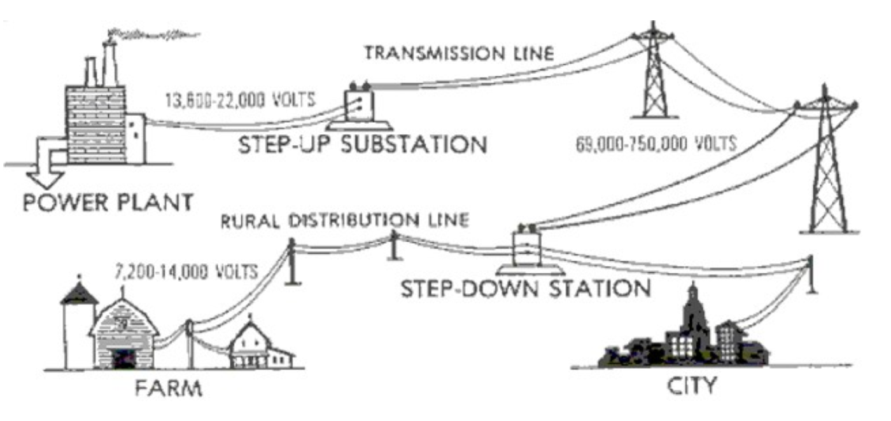
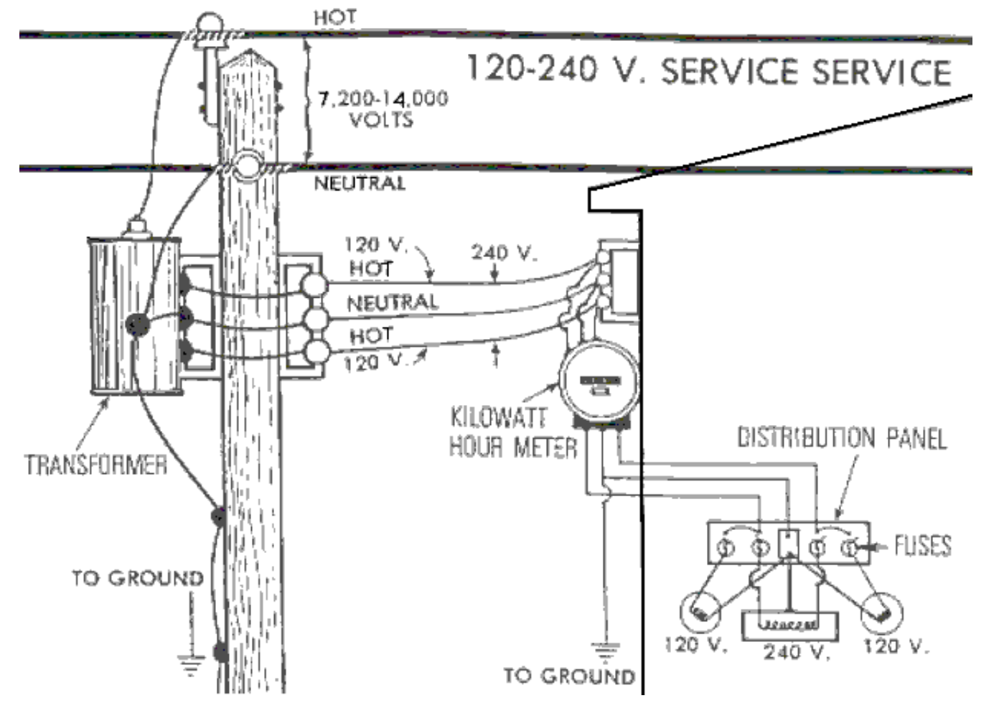
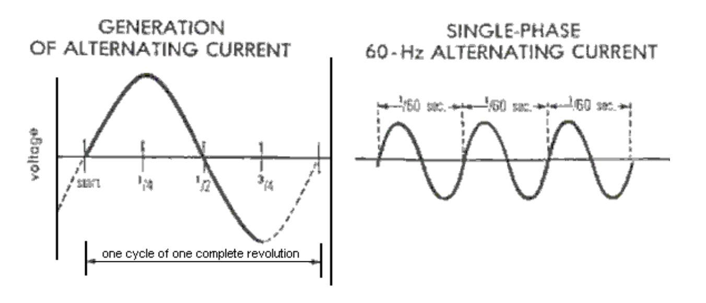
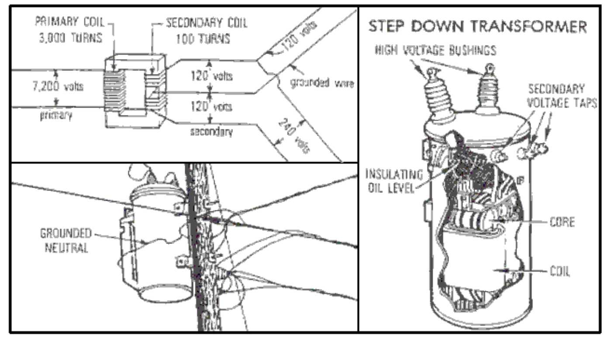

# 电气原理：术语与安全

ELECTRICAL PRINCIPLES: TERMINOLOGY & SAFETY

The use of electricity is so commonplace that most people assume that it will always be
available on demand. To fully realize our dependence upon electricity, consider the ways in
which electricity is being used each day in the home, on the farm and the ranch. Electricity is
doing more to increase work efficiency and promote enjoyable living than any other single
factor. The use of electricity has grown to the extent that an increasing portion of the home or
business budget, is used in paying for this source of energy.

1. Definition of Electricity

Electricity can be defined in several ways. The layman defines electricity as a source of energy
that can be converted to light, heat, or power. Electrical Engineers define electricity as a
movement of electrons caused by electrical pressure or voltage. The amount of energy
produced depends on the number of electrons in motion.

2. The Manufacture and Distribution of Electricity

Electricity is produced from generators that are run by water, steam, or internal combustion
engines. If water is used as a source of power to turn generators, it is referred to as
hydroelectric generation. There are a number of this type located in areas where huge dams
have been built across large streams.

Steam is used as a source of power for generating much of today's electricity. Water is heated to
a high temperature, and the steam pressure is used to turn turbines which generate electricity.
These are referred to as thermal-powered generators. Fuels used to heat the water are coal,
natural gas, and/or fuel oil.

Generators at the power plant generate from 13,800 to 22,000 volts of electricity. From the
power plant, electricity is carried to a step-up sub-station which, through the use of
transformers, increases the voltage from 69,000 to 750,000 volts. This increase in voltage is
necessary for the efficient transmission of electricity over long distances. From the step-up substation, the electricity is carried on transmission lines to a step-down sub-station which reduces
the voltage to 7,200 to 14,000 volts for distribution to rural and city areas.

Transformers at the business or residence reduce the voltage to 120 or 240 volts to supply the
meter of the customer:

3. Common Electrical Terms

In order to work safely and efficiently with electricity and have the ability to converse on the
subject, the following terms should be understood:

Ampere (Amp) - A measurement in units of the rate of flow of electrical current. This may be
compared with the rate of flow of water in gallons per minute. Example: A 60-watt
incandescent lamp on a 120V circuit would pull 1/2 ampere of electricity (60 divided by 120 =
0.5 or 1/2, Formula: Amperes = Watts / Volts

Volt (V) - A unit of measure of electrical pressure. A given electrical pressure (V) causes a
given amount of electrical current (Amps) to flow through a load of given resistance. Voltage
may be compared to water pressure in pounds per square inch in a water system. Common
service voltages are 120 volts for lighting and small appliance circuits and 240 volts for
heating, air conditioning, and large equipment circuits.

Watt (W) - A unit of measure of electrical power. When applied to electrical equipment, it is
the rate that electrical energy is transformed into some other form of energy such as light. Watts
may be compared to the work done by water in washing a car. (Formula: Volts x Amps = Watts)

Kilowatt (KW) - A unit of measurement used in computing the amount of electrical energy
used. Kilowatts are determined by dividing the number of watts by 1000 as 1 kilowatt = 1,000
watts.

Kilowatt-Hour (KWH) - A measure of electricity in terms of power in kilowatts and time in
hours. One KWH is 1000 watts used for one hour. Alternating Current (A.C.) - Electrical
current that alternates or changes direction several times per second. The direction currentmoves depends on the direction in which the voltage forces it.

Cycle - The flow of electricity in one direction, the reverse flow of electricity in the other
direction, and the start of the flow back in the other direction. The cycles per second are
regulated by the power supplier and are usually 60 in America. Most electric clocks are built to
operate on the mains frequency. More or fewer cycles per second would cause mains-operated
clocks to gain or lose time. The present practice is to use the term Hertz (Hz) rather than
"cycles per second".

Direct Current (D.C.) - Electrical current flowing in one direction. Example: electrical circuits
in automobiles and tractors.

Transformer - A device used to increase or decrease voltage.

Single Phase - The most common type of electrical service or power available to consumers.
One transformer is used between the distribution line and the meter. Usually three wires, two
"hot" and one neutral, are installed to provide 120V and 240V single-phase service. Singlephase service may also be supplied with a three-phase service.

Three-Phase - This type of service is designed especially for large electrical loads. It is a more
expensive installation due to three wires and three transformers being required. The important
advantage of three-phase power is that the total electrical load is divided among the three
phases, consequently, the wire and transformers can be smaller. Other advantages exist in the
design of three-phase motors.

Short Circuit - A direct connection (before current flows through an appliance) between two
"hot" wires, between a "hot" and neutral wire, or between a "hot" wire and ground.

Voltage Drop - A reduction of current between the power supply and the load. Due to
resistance, there will be a loss of voltage any time electricity flows through a conductor (wire).

Factors that influence voltage drop are size of wire, length of wire, and the number of amps
flowing. A drop in voltage may cause a loss of heat, light, or the full power output of a motor. It
could cause motor burn-out unless the motor is properly protected (time-delay fuse).

Fuse - A device used to protect circuits from an overload of current.

Circuit Breaker - A device used to protect circuits from an overload of current. May be
manually reset.

Time-Delay Fuse - A fuse with the ability to carry an overload of current for a short duration
without disengaging the contacts or melting the fuse link.

Horsepower (hp) - A unit of mechanical power equal to 746 watts of electrical power
(assuming 74.6% electric motor efficiency). Motors of one horsepower and above are rated at
1000 watts per hp while motors below one horsepower are rated at 1,200 watts per hp.

Conductor - The wire used to carry electricity (typically, copper or aluminum). Copper and
aluminum should not be spliced together due to their incompatibility resulting in deterioration
and oxidation.

Insulator - A material which will not conduct electricity and is usually made of glass, Bakelite,
porcelain, rubber, or thermo-plastic.

"Hot" Wire - A current-carrying conductor under electrical pressure and connected to a fuse or
circuit breaker at the distribution panel. (Color Code: usually black or red)

Neutral Wire - A current-carrying conductor not under electrical pressure and connected to the
neutral bar at the distribution panel. (Color Code: usually white)

Grounding - The connection of the neutral part of the electrical system to the earth to reduce
the possibility of damage from lightning and the connection of electrical equipment housings to
the earth to minimize the danger from electrical shock. (Color Code: Can be green or bare
wire).

Underwriters' Laboratory (U.L.) - An American national organization which tests all types of
wiring materials and electrical devices to insure that they meet minimum standards for safetyand quality.

National Electric Code (N.E.C.) - Regulations approved by the National Board of Fire
Underwriters primarily for safety in electrical wiring installations. All wiring should meet the
requirements of the national as well as the local code.

4. Computing Electrical Energy Use and Cost

If an estimate of cost for electricity used is desired, the name plate data on appliances and
equipment and an estimate of operating time may be used. The following formulas should be
used for determining watts, amps, volts, watt-hours, kilowatt-hours, and cost.
