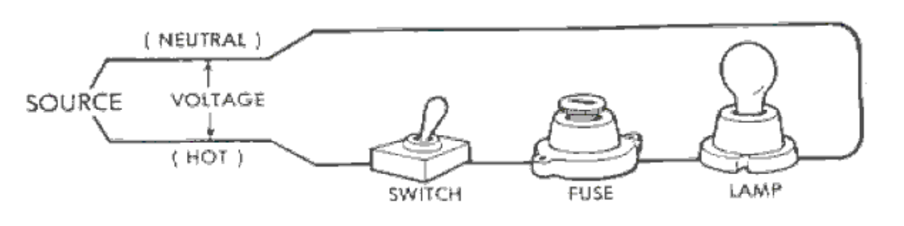
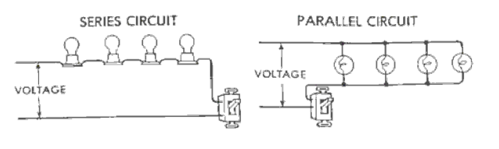

# 电气原理：术语与安全

ELECTRICAL PRINCIPLES: TERMINOLOGY & SAFETY

The use of electricity is so commonplace that most people assume that it will always be available on demand. To fully realize our dependence upon electricity, consider the ways in which electricity is being used each day in the home, on the farm and the ranch. Electricity is doing more to increase work efficiency and promote enjoyable living than any other single factor. The use of electricity has grown to the extent that an increasing portion of the home or business budget, is used in paying for this source of energy.

电力的使用是如此普遍，以至于大多数人认为它总是可以按需使用。要充分认识到我们对电力的依赖，请考虑家庭、农场和牧场每天用电的方式。电力在提高工作效率和促进愉快生活方面的作用比其他任何单一因素都要大。电力的使用已经增长到越来越多的家庭或企业预算用于支付这种能源的程度。

1. Definition of Electricity

Electricity can be defined in several ways. The layman defines electricity as a source of energy that can be converted to light, heat, or power. Electrical Engineers define electricity as a movement of electrons caused by electrical pressure or voltage. The amount of energy produced depends on the number of electrons in motion.

1.电力的定义

电可以用几种方式来定义。外行人将电定义为可以转化为光、热或电力的能源。电气工程师将电定义为由电压力或电压引起的电子运动。产生的能量取决于运动中的电子数量。

2. The Manufacture and Distribution of Electricity

Electricity is produced from generators that are run by water, steam, or internal combustion engines. If water is used as a source of power to turn generators, it is referred to as hydroelectric generation. There are a number of this type located in areas where huge dams have been built across large streams.

2.电力的生产和分配

电力是由水、蒸汽或内燃机驱动的发电机产生的。如果将水用作发电机的动力源，则称为水力发电。有许多这种类型的水坝位于横跨大溪流的地区。

Steam is used as a source of power for generating much of today's electricity. Water is heated to a high temperature, and the steam pressure is used to turn turbines which generate electricity.  These are referred to as thermal-powered generators. Fuels used to heat the water are coal, natural gas, and/or fuel oil.

蒸汽被用作产生当今大部分电力的动力源。水被加热到高温，蒸汽压力被用来转动涡轮机发电。这些被称为热力发电机。用于加热水的燃料是煤、天然气和/或燃油。

Generators at the power plant generate from 13,800 to 22,000 volts of electricity. From the power plant, electricity is carried to a step-up sub-station which, through the use of transformers, increases the voltage from 69,000 to 750,000 volts. This increase in voltage is necessary for the efficient transmission of electricity over long distances. From the step-up substation, the electricity is carried on transmission lines to a step-down sub-station which reduces the voltage to 7,200 to 14,000 volts for distribution to rural and city areas.

发电厂的发电机产生13800至22000伏的电力。电力从发电厂输送到升压变电站，通过使用变压器，将电压从69000伏提高到750000伏。这种电压的增加对于长距离高效输电是必要的。从升压变电站开始，电力通过输电线路输送到降压变电站，降压变电站将电压降至7200至14000伏，用于向农村和城市地区配电。

Transformers at the business or residence reduce the voltage to 120 or 240 volts to supply the meter of the customer:

企业或住宅的变压器将电压降至120或240伏，为客户的电表供电：

3. Common Electrical Terms

In order to work safely and efficiently with electricity and have the ability to converse on the subject, the following terms should be understood:

3.通用电气术语

为了安全有效地用电工作，并能够就这一主题进行对话，应理解以下术语：

Ampere (Amp) - A measurement in units of the rate of flow of electrical current. This may be compared with the rate of flow of water in gallons per minute. Example: A 60-watt incandescent lamp on a 120V circuit would pull 1/2 ampere of electricity (60 divided by 120 = 0.5 or 1/2, Formula: Amperes = Watts / Volts

安培（Amp）-以电流流速为单位的测量值。这可以与每分钟加仑的水流速度进行比较。示例：120V电路上的60瓦白炽灯将拉动1/2安培的电流（60除以120=0.5或1/2，公式：安培=瓦特/伏特

Volt (V) - A unit of measure of electrical pressure. A given electrical pressure (V) causes a given amount of electrical current (Amps) to flow through a load of given resistance. Voltage may be compared to water pressure in pounds per square inch in a water system. Common service voltages are 120 volts for lighting and small appliance circuits and 240 volts for heating, air conditioning, and large equipment circuits.

伏特（V）-电气压力的测量单位。给定的电气压力（V）导致给定量的电流（安培）流过给定电阻的负载。电压可以与水系统中的水压进行比较，单位为磅/平方英寸。照明和小型电器电路的常见服务电压为120伏，供暖、空调和大型设备电路的常用服务电压为240伏。

Watt (W) - A unit of measure of electrical power. When applied to electrical equipment, it is the rate that electrical energy is transformed into some other form of energy such as light. Watts may be compared to the work done by water in washing a car. (Formula: Volts x Amps = Watts)

瓦特（W）-电功率的计量单位。当应用于电气设备时，它是电能转化为其他形式的能量（如光）的速率。瓦特可以比作水洗车所做的工作。（公式：伏特x安培=瓦特）

Kilowatt (KW) - A unit of measurement used in computing the amount of electrical energy used. Kilowatts are determined by dividing the number of watts by 1000 as 1 kilowatt = 1,000 watts.

千瓦（KW）-用于计算所用电能的计量单位。千瓦是通过将瓦数除以1000来确定的，即1千瓦=1000瓦。

Kilowatt-Hour (KWH) - A measure of electricity in terms of power in kilowatts and time in hours. One KWH is 1000 watts used for one hour. Alternating Current (A.C.) - Electrical current that alternates or changes direction several times per second. The direction currentmoves depends on the direction in which the voltage forces it.

千瓦时（KWH）-以千瓦为单位的功率和以小时为单位的时间来衡量电力。一千瓦时等于一小时使用1000瓦。交流电（A.C.）-每秒交替或改变方向几次的电流。电流移动的方向取决于电压迫使它的方向。

Cycle - The flow of electricity in one direction, the reverse flow of electricity in the other direction, and the start of the flow back in the other direction. The cycles per second are regulated by the power supplier and are usually 60 in America. Most electric clocks are built to operate on the mains frequency. More or fewer cycles per second would cause mains-operated clocks to gain or lose time. The present practice is to use the term Hertz (Hz) rather than "cycles per second".

循环-电流沿一个方向流动，电流沿另一个方向反向流动，并开始沿另一方向回流。每秒的循环次数由电源供应商规定，在美国通常为60次。大多数电钟都是为在电源频率上运行而设计的。每秒循环次数的增减会导致主控时钟的时间增减。目前的做法是使用赫兹（Hz）一词，而不是“每秒周期数”。

Direct Current (D.C.) - Electrical current flowing in one direction. Example: electrical circuits in automobiles and tractors.

Transformer - A device used to increase or decrease voltage.

直流电（D.C.）-单向流动的电流。示例：汽车和拖拉机中的电路。

变压器-一种用于增加或减少电压的装置。

Single Phase - The most common type of electrical service or power available to consumers.  One transformer is used between the distribution line and the meter. Usually three wires, two "hot" and one neutral, are installed to provide 120V and 240V single-phase service. Singlephase service may also be supplied with a three-phase service.

单相-消费者可用的最常见的电气服务或电源类型。配电线路和仪表之间使用一台变压器。通常安装三条电线，两条“火线”和一条中性线，以提供120V和240V单相服务。单相服务也可以与三相服务一起提供。

Three-Phase - This type of service is designed especially for large electrical loads. It is a more expensive installation due to three wires and three transformers being required. The important advantage of three-phase power is that the total electrical load is divided among the three phases, consequently, the wire and transformers can be smaller. Other advantages exist in the design of three-phase motors.

三相-这种类型的服务是专门为大型电力负载设计的。由于需要三根电线和三个变压器，这是一个更昂贵的安装。三相电源的重要优点是将总电力负载分配给三相，因此，电线和变压器可以更小。三相电机的设计还具有其他优点。

Short Circuit - A direct connection (before current flows through an appliance) between two "hot" wires, between a "hot" and neutral wire, or between a "hot" wire and ground.

短路-两条“火线”之间、“火线”和中性线之间或“火线”与接地之间的直接连接（在电流流过电器之前）。

Voltage Drop - A reduction of current between the power supply and the load. Due to resistance, there will be a loss of voltage any time electricity flows through a conductor (wire).

电压降-电源和负载之间的电流减小。由于电阻，任何时候电流流过导体（电线）都会失去电压。

Factors that influence voltage drop are size of wire, length of wire, and the number of amps flowing. A drop in voltage may cause a loss of heat, light, or the full power output of a motor. It could cause motor burn-out unless the motor is properly protected (time-delay fuse).

影响电压降的因素包括电线的尺寸、电线的长度和流动的安培数。电压下降可能会导致热量、光线或电机全功率输出的损失。除非电机得到适当保护（延时保险丝），否则可能会导致电机烧坏。

Fuse - A device used to protect circuits from an overload of current.

保险丝-一种用于保护电路免受电流过载的装置。

Circuit Breaker - A device used to protect circuits from an overload of current. May be manually reset.

断路器-一种用于保护电路免受电流过载的装置。可以手动重置。

Time-Delay Fuse - A fuse with the ability to carry an overload of current for a short duration without disengaging the contacts or melting the fuse link.

延时保险丝-一种能够在短时间内承载过载电流而不会断开触点或熔化保险丝的保险丝。

Horsepower (hp) - A unit of mechanical power equal to 746 watts of electrical power (assuming 74.6% electric motor efficiency). Motors of one horsepower and above are rated at 1000 watts per hp while motors below one horsepower are rated at 1,200 watts per hp.

马力（hp）-一种机械功率单位，等于746瓦的电功率（假设电动机效率为74.6%）。一马力及以上的电机额定功率为每马力1000瓦，而一马力以下的电机额定为每马力1200瓦。

Conductor - The wire used to carry electricity (typically, copper or aluminum). Copper and aluminum should not be spliced together due to their incompatibility resulting in deterioration and oxidation.

导体-用于输送电力的电线（通常为铜或铝）。铜和铝不应拼接在一起，因为它们的不相容性会导致劣化和氧化。

Insulator - A material which will not conduct electricity and is usually made of glass, Bakelite, porcelain, rubber, or thermo-plastic.

绝缘体-一种不导电的材料，通常由玻璃、胶木、陶瓷、橡胶或热塑性塑料制成。

"Hot" Wire - A current-carrying conductor under electrical pressure and connected to a fuse or circuit breaker at the distribution panel. (Color Code: usually black or red)

“火线”-受电压力的载流导体，连接到配电盘上的保险丝或断路器。（颜色代码：通常为黑色或红色）

Neutral Wire - A current-carrying conductor not under electrical pressure and connected to the neutral bar at the distribution panel. (Color Code: usually white)

中性线-一种不受电气压力的载流导体，连接到配电盘的中性线棒。（颜色代码：通常为白色）

Grounding - The connection of the neutral part of the electrical system to the earth to reduce the possibility of damage from lightning and the connection of electrical equipment housings to the earth to minimize the danger from electrical shock. (Color Code: Can be green or bare wire).

接地-将电气系统的中性部分连接到地上，以减少雷击造成的损坏，并将电气设备外壳连接到地，以尽量减少触电的危险。（颜色代码：可以是绿色或裸线）。

Underwriters' Laboratory (U.L.) - An American national organization which tests all types of wiring materials and electrical devices to insure that they meet minimum standards for safetyand quality.

保险商实验室（U.L.）-一个美国国家组织，负责测试所有类型的接线材料和电气设备，以确保它们符合安全和质量的最低标准。

National Electric Code (N.E.C.) - Regulations approved by the National Board of Fire Underwriters primarily for safety in electrical wiring installations. All wiring should meet the requirements of the national as well as the local code.

国家电气规范（N.E.C.）-国家消防保险商委员会批准的主要用于电气布线装置安全的法规。所有接线应符合国家和地方规范的要求。

4. Computing Electrical Energy Use and Cost

If an estimate of cost for electricity used is desired, the name plate data on appliances and equipment and an estimate of operating time may be used. The following formulas should be used for determining watts, amps, volts, watt-hours, kilowatt-hours, and cost.

4.计算电能使用和成本

如果需要估算用电成本，可以使用电器和设备的铭牌数据以及运行时间的估算。以下公式应用于确定瓦特、安培、伏特、瓦时、千瓦时和成本。

    Watts = Volts x Amperes
    Amperes = Watts / Volts
    Volts = Watts / Amperes
    Watt-Hours = Watts x Hours of operation
    Kilowatt-Hours = Watt-Hours / 1000
    Cost = Kilowatt-Hours x Local Rate per Kilowatt-Hour (or per "Unit")

    瓦特=伏特x安培
    安培=瓦特/伏特
    伏特=瓦特/安培
    瓦特小时=瓦特x运行小时数
    千瓦时=瓦时/1000
    成本=千瓦时x当地每千瓦时费率（或每“单位”）

Example:

    Local electricity rate per Kilowatt-Hour: 8 cents
    Equipment plate data: 120 Volts 5 Amps
    Monthly hours of operation: 10

例子：

    当地每千瓦时电价：8美分
    设备铭牌数据：120伏5安
    每月运行小时数：10

1. Watts = Volts x Amperes, so Watts = 120 x 5 = 600 watts
2. Watt-Hours = 600 x 10 = 6,000 watt-hours
3. Kilowatt-Hours = 5,000 / 1,000 = 6 kilowatt-hours (or 6 Units)
4. Cost = 6 x 8 = 48 cents

--
1. 瓦特=伏特x安培，因此瓦特=120x5=600瓦特
2. 瓦时=600 x 10=6000瓦时
3. 千瓦时=5000/1000=6千瓦时（或6个单位）
4. 成本=6 x 8=48美分

5. Electrical Circuits An Electrical Circuit is a completed path through which electricity flows. Insulated conductors (wires) provide the path for the flow of electricity. A water system and an electrical circuit are similar in many respects. Water flows through pipes and is measured in gallons per minute, and electricity flows through conductors and is measured in amperes. A simple circuit is shown here:

5.电路电路是电流流动的完整路径。绝缘导体（电线）为电流提供了路径。水系统和电路在许多方面是相似的。水流过管道，以加仑/分钟为单位进行测量，电流流过导体，以安培为单位进行计量。这里显示了一个简单的电路：

A circuit includes a "hot" wire (red or black) carrying current from the source through a switch,circuit protector (fuse or circuit-breaker), and an appliance. The neutral wire (white) conducts the current from the appliance to the source (ground).

电路包括一根“火线”（红色或黑色），通过开关、电路保护器（保险丝或断路器）和电器从电源输送电流。中性线（白色）将电流从电器传导到电源（地）。

There arc two methods for connecting devices in a circuit - "in series" or "in parallel". In a series circuit, all of the current must flow through each device in the circuit. Removing any one of the devices in a series circuit will stop the flow of current. In parallel circuits, the load (lights or appliances) are connected between the two wires of the circuit providing an independent path for the flow of current, and removing a lamp has no effect on the other lamps in the circuit.

电路中连接设备有两种方法——“串联”或“并联”。在串联电路中，所有电流必须流过电路中的每个设备。移除串联电路中的任何一个设备都会停止电流流动。在并联电路中，负载（灯或电器）连接在电路的两根电线之间，为电流流动提供独立的路径，移除一盏灯对电路中的其他灯没有影响。

Switches, fuses, and circuit breakers are always connected in series. In most cases, except for some Christmas tree lights, appliances and lights are connected in parallel.

开关、保险丝和断路器始终串联连接。在大多数情况下，除了一些圣诞树灯，电器和灯是并联连接的。

1. 120 Volt and 240 Volt Circuits

The 120V circuit has one "hot" and one neutral wire, with the switch and circuit protector in the hot line. The neutral wire from the appliance is connected to the neutral bar in the fuse or breaker box. For safety, the neutral wire should never be broken or interrupted with a switch or fuse.

1.120伏和240伏电路

120V电路有一根“火线”和一根中性线，火线中有开关和电路保护器。电器的中性线连接到保险丝或断路器盒中的中性线棒。为了安全起见，中性线不应被开关或保险丝断开或中断。

The voltage in a 120V circuit is measured with a voltmeter with one lead on the hot terminal and the other lead on the neutral bar. The number of amperes flowing may be measured with a clamp-on ammeter by encircling the hot or neutral wire with the jaws of the ammeter.

120V电路中的电压是用电压表测量的，其中一根引线在热端子上，另一根引线位于中性线棒上。流动的安培数可以用钳形电流表测量，方法是用电流表的钳口环绕火线或中性线。

The 240V circuit has two hot wires and one safety-ground wire. Switches and fuses are installed in the hot lines. The two hot wires arc necessary for the operation of 240V welders and motors. The safety-ground wire, connected to the metal frame of the equipment or motor and to the neutral bar, does not carry current unless a "short" develops in the motor or welder.  If a short should occur, one of the circuit protectors will burn-out or open, thus opening the circuit.

240V电路有两根火线和一根安全地线。开关和保险丝安装在火线中。240V焊机和电机运行所需的两根火线。安全接地线连接到设备或电机的金属框架和中性线棒，除非电机或焊机中出现“短路”，否则不会载流。如果发生短路，其中一个电路保护器将烧坏或断开，从而断开电路。

The voltage on a 240V circuit is measured by fastening a lead on the voltmeter to each of the hot wires. Voltage between either hot terminal and the neutral bar will be one-half of the voltage between the two hot wires. The number of amperes flowing can be measured by clamping an ammeter around either of the hot wires.

240V电路上的电压是通过将电压表上的引线固定到每条火线上来测量的。任一火线端子和中性线棒之间的电压将是两根火线之间电压的一半。电流的数量可以通过将电流表夹在任何一根火线上来测量。

7. Safety Grounding of Electrical Equipment

Refer back, to the 240V circuit and note the ground wire from the metal frame to the neutral bar. The following illustration shows proper safety grounding when operating a drill in a 120V circuit. The safety-ground wire may be bare, but a three-wire cable is recommended. Safetyground wire in three-wire cable is usually green in color. A current-carrying neutral wire should never be used for a safety-ground. Likewise, a safety-ground wire should never be used as a current-carrying hot or neutral wire

请参阅240V电路，并注意从金属框架到中性线棒的接地线。下图显示了在120V电路中操作钻机时的正确安全接地。安全接地线可能是裸露的，但建议使用三线电缆。三线电缆中的安全接地线通常是绿色的。不得将载流中性线用作安全接地。同样，安全接地线不得用作载流火线或中性线

Using grounded receptacles and a safety-ground on all circuits will allow the safety-grounding of appliances when they are plugged into the outlet. An adapter must be used to properly ground appliances connected to receptacles which are not safety-grounded. If an adapter is used, the green pigtail wire must be connected to a known ground to give protection fromelectrical shock should a short-circuit occur.

在所有电路上使用接地插座和安全接地将允许电器在插入插座时安全接地。必须使用适配器将连接到未安全接地插座的电器正确接地。如果使用适配器，绿色尾纤线必须连接到已知的接地端，以便在发生短路时提供触电保护。

A test lamp can be used to check a circuit completed between a "hot" wire and a neutral wire.  Use the test lamp to check appliances for shorts. With the appliance plugged into an outlet, touch the appliance frame with one lead of the test lamp while the other lead of the test lamp is grounded to a water or gas pipe. If the test light does not burn, reverse the appliance plug and check with the test lamp again. If the light burns, a short exists (the hot wire is touching the frame of the appliance). Unplug the appliance and repair or discard it.

测试灯可用于检查“火线”和中性线之间完成的电路。使用测试灯检查电器是否短路。将电器插入插座，用测试灯的一根引线接触电器框架，同时测试灯的另一根引线接地到水管或气管。如果测试灯不亮，请反转电器插头，再次用测试灯检查。如果灯亮起，则存在短路（热线接触到电器的框架）。拔下电器插头，修理或丢弃。

8. Electrical Circuit Protection

Electrical circuits should be protected from an overload of amperes. Too many amperes flowing through an unprotected circuit will generate heat, which will deteriorate or melt the insulation and possibly cause a fire. The number of amperes that a given conductor can safely carry, depends upon the kind and size of wire, type of insulation, length of run in feet, and the type of installation. Charts are available in reference texts giving allowable current-carrying capabilities of various conductors.

8.电路保护

电路应防止电流过载。过多的电流流过未受保护的电路会产生热量，这会使绝缘层劣化或熔化，并可能导致火灾。给定导体可以安全承载的安培数取决于电线的种类和尺寸、绝缘类型、引入英尺的长度和安装类型。参考文献中提供了图表，给出了各种导体的允许载流能力。

The four types of circuit protection are: common fuses, fusetrons (time-delay), fustats (twopart time-delay), and circuit-breakers. Fuses are of two basic types: plug, and cartridge.  Common fuses contain a link made from a low-temperature melting alloy which is designed to carry current up to the rating of the fuse. Current higher than the amperage rating causes the link to heat above it's melting point. When the fuse "blows", the link melts and opens the circuit.

四种类型的电路保护是：普通保险丝、保险丝（延时）、保险丝（两部分延时）和断路器。保险丝有两种基本类型：插头式和盒式。普通保险丝包含一个由低温熔融合金制成的连接，其设计用于承载高达保险丝额定值的电流。电流高于额定电流会导致链路温度高于其熔点。当保险丝“熔断”时，链路熔化并断开电路。

Fusetrons (time-delay fuses) are made to carry a temporary overload, such as the overload caused by the starting of an electric motor. The fuse, however, still provides protection for thecircuit, and a short-circuit will melt the fuse link. If a common fuse is used, the fuse link will melt every time an electric motor starts. The use of a larger ampere common fuse will prevent the "blow" resulting from the temporary overload, but will not provide protection for the motor or the circuit.

保险丝管（延时保险丝）用于承载临时过载，例如电动机启动引起的过载。然而，保险丝仍然为电路提供保护，短路会熔化保险丝。如果使用普通保险丝，每次电动机启动时，保险丝都会熔断。使用较大安培的普通保险丝可以防止临时过载导致的“熔断”，但不会为电机或电路提供保护。

Fustats, non-tamperable fuses of the time-delay type, have a different size base and require a special adapter which is screwed into the standard fuse socket. After the adapter is installed, it cannot be removed. For example, the installation of a 15-ampere adapter allows only the use of 15-ampere or smaller fuse.

保险丝是延时型不可篡改保险丝，具有不同尺寸的底座，需要一个特殊的适配器，拧入标准保险丝插座。安装适配器后，无法将其卸下。例如，安装15安培的适配器只允许使用15安培或更小的保险丝。

Circuit breakers eliminate the replacement of fuses and are commonly used even though a circuit breaker box costs more than a fuse box. Circuit breakers are of two types, thermal and magnetic. The thermal breaker has two contacts held together by a bi-metal latch. A current overload causes the bi-metallic strip to become heated, the latch releases, and the points spring open. After the bi-metallic strip cools, the switch is reset and service is restored.

断路器消除了保险丝的更换，即使断路器盒的成本高于保险丝盒，也很常用。断路器有两种类型，热断路器和磁断路器。热断路器有两个触点，由双金属锁扣固定在一起。电流过载会导致双金属条变热，锁扣松开，触点弹开。双金属带冷却后，开关复位，服务恢复。

The magnetic breaker has contacts that are held together by a latch which is released by the action of an electromagnet. The amount of current flowing through the circuit will determine the size of the electromagnet. This type of circuit-breaker is reset by moving the toggle switch to the "on" position.

The following diagram shows the parts of a circuit breaker.

磁力断路器的触点由一个闩锁固定在一起，闩锁在电磁铁的作用下释放。流经电路的电流大小将决定电磁铁的大小。这种类型的断路器通过将拨动开关移动到“打开”位置来重置。

下图显示了断路器的零件。

9. No Fault Grounding

Fuses and circuit-breakers are safety devices which limit current (amperage) in a circuit. Their main function is to protect equipment and wiring from overload. Ground fault circuit interrupters (GFI) are designed to protect humans, equipment, and/or electrical systems from injury or damage if electricity flows in an unintended path (a short-circuit).

9.无故障接地

保险丝和断路器是限制电路中电流（安培数）的安全装置。其主要功能是保护设备和接线免受过载。接地故障断路器（GFI）旨在保护人员、设备和/或电气系统免受意外路径（短路）中电流的伤害或损坏。

A GFI is a very sensitive device that functions by comparing the current moving in the "hot" wire with that in the neutral wire. If these two currents are not equal, a fault exists, and current is "leaking" out of the circuit. If the difference in current between the two wires is 5/1000 of an ampere or greater, the GFI will open the circuit, shutting off the power and eliminating any shock hazard.

GFI是一种非常灵敏的设备，通过比较“火线”中的电流和中性线中的电流来工作。如果这两个电流不相等，则存在故障，电流“泄漏”出电路。如果两根电线之间的电流差为5/1000安培或更大，GFI将断开电路，切断电源并消除任何电击危险。

The National Electrical Code requires GFl's for all 120V, single phase, 15 and 20 amp receptacles installed outdoors, in bathrooms, and in garages for residential buildings. A GFI is required at construction sites and some other applications. After correcting a circuit fault, the GFI may be reset for further use.

A variety of GFI equipment is made for 120 and 240 volt circuits:

《国家电气规范》要求所有安装在室外、浴室和住宅楼车库的120V、单相、15和20安培插座都要有GFl。建筑工地和其他一些应用需要GFI。在纠正电路故障后，可以重置GFI以供进一步使用。

各种GFI设备适用于120和240伏电路：

REFERENCES:

参考文献：

    COOPER, ELMER L.,
    AGRICULTURAL MECHANICS: FUNDAMENTALS AND APPLICATIONS.
    DELMAR PUBLISHERS INC.,
    ALBANY,
    NEW YORK

    ELECTRICAL WIRING - RESIDENTIAL, UTILITY BUILDINGS, SERVICE AREAS,
    AAVIM,
    ATHENS,
    GEORGIA.

Note: This electrical information does not apply directly to areas outside America and local regulations for electrical supply should be checked.

The following material is the section in Chapter 3 of "The Practical Guide to Free-Energy Devices" which deals with Don Smith's technology:

注：此电气信息不直接适用于美国以外的地区，应检查当地的供电法规。

以下材料是《自由能器件实用指南》第3章中关于唐·史密斯技术的部分：

Don Smith. One of most impressive developers of free-energy devices is Don Smith who has produced many spectacular things, generally with major power output. These are a result of his in-depth knowledge and understanding of the way that the environment works. Don says that his understanding comes from the work of Nikola Tesla as recorded in Thomas C. Martin's book "The Inventions, Researches, and Writings of Nikola Tesla" ISBN 0-7873-0582-0 available from http://www.healthresearchbooks.com and various other book companies. This book can be downloaded from http://www.free-energy-info.com.

唐·史密斯。最令人印象深刻的自由能源设备开发商之一是唐·史密斯，他生产了许多壮观的东西，通常具有强大的功率输出。这些都是他对环境工作方式的深入了解和理解的结果。唐说，他的理解来自托马斯·C·马丁的书《尼古拉·特斯拉的发明、研究和著作》中记录的尼古拉·特斯拉的工作，ISBN 0-7873-0582-0，可从http://www.healthresearchbooks.com以及其他各种图书公司。这本书可以从以下网址下载http://www.free-energy-info.com.

Don states that he repeated each of the experiments found in the book and that gave him his understanding of what he prefers to describe as the 'ambient background energy' which is called the 'zero-point energy field' elsewhere in this eBook. Don remarks that he has now advanced further than Tesla in this field, partly because of the devices now available to him and which were not available when Tesla was alive.

唐表示，他重复了书中的每一个实验，这让他理解了他更喜欢描述的“环境背景能量”，在本书的其他地方被称为“零点能量场”。唐表示，他现在在这一领域比特斯拉取得了更大的进步，部分原因是他现在可以使用的设备，而特斯拉在世时还没有这些设备。

Don stresses two key points. Firstly, a dipole can cause a disturbance in the magnetic component of the 'ambient background' and that imbalance allows you to collect large amounts of electrical power, using capacitors and inductors (coils). Secondly, you can pick up as many powerful electrical outputs as you want from that one magnetic disturbance, without depleting the magnetic disturbance in any way. This allows massively more power output than the small power needed to create the magnetic disturbance in the first place. This is what produces a COP>1 device and Don has created nearly fifty different devices based on that understanding.

唐强调了两个关键点。首先，偶极子会对“环境背景”的磁性成分造成干扰，这种不平衡使您能够使用电容器和电感器（线圈）收集大量电力。其次，你可以从一个磁干扰中获得尽可能多的强大电输出，而不会以任何方式耗尽磁干扰。这允许比最初产生磁干扰所需的小功率输出更多的功率。这就是产生COP>1设备的原因，唐基于这一理解创建了近五十种不同的设备。

Although they get removed quite frequently, there is one video which was recorded 2006 and it covers a good deal of what Don has done. In the video, reference is made to Don's website but you will find that it has been taken over by Big Oil who have filled it with innocuous similarsounding things of no consequence, apparently intended to confuse newcomers. A website which I understand is run by Don's son is here and it has brief details of his prototypes and theory. You will find the only document of his which I could locate, presented as a downloadable pdf document here and it contains the following patent on a most interesting device which appears to have no particular limit on the output power. This is a slightly reworded copy of that patent as patents are generally worded in a way which makes them difficult to understand.

虽然它们经常被删除，但有一段视频是在2006年录制的，它涵盖了唐所做的很多事情。在视频中，提到了唐的网站，但你会发现它已被大石油公司接管，他们在网站上塞满了无害的类似东西，听起来无关紧要，显然是为了迷惑新来者。据我所知，唐的儿子经营着一个网站，上面有他的原型和理论的简要细节。你会发现我能找到的他唯一的文件，在这里以可下载的pdf文件的形式呈现，其中包含了一个最有趣的设备上的以下专利，该设备似乎对输出功率没有特别的限制。这是该专利的一个稍微改写的副本，因为专利的措辞通常很难理解。

    Patent NL 02000035 A 20th May 2004 Inventor: Donald Lee Smith