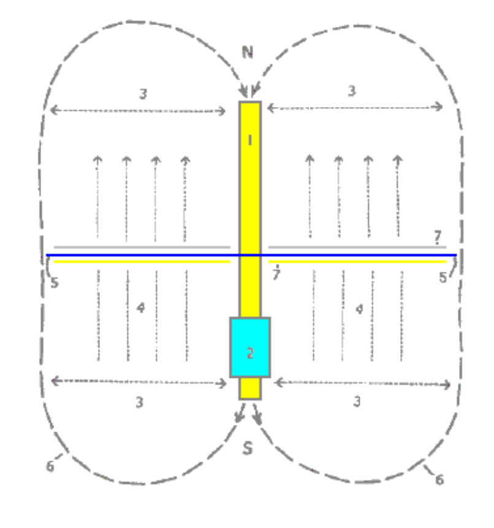
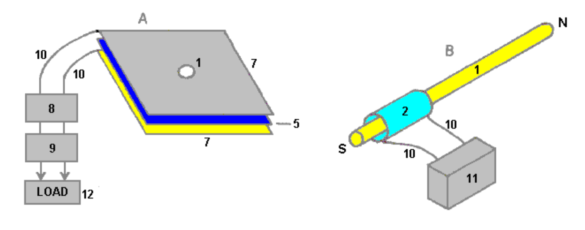
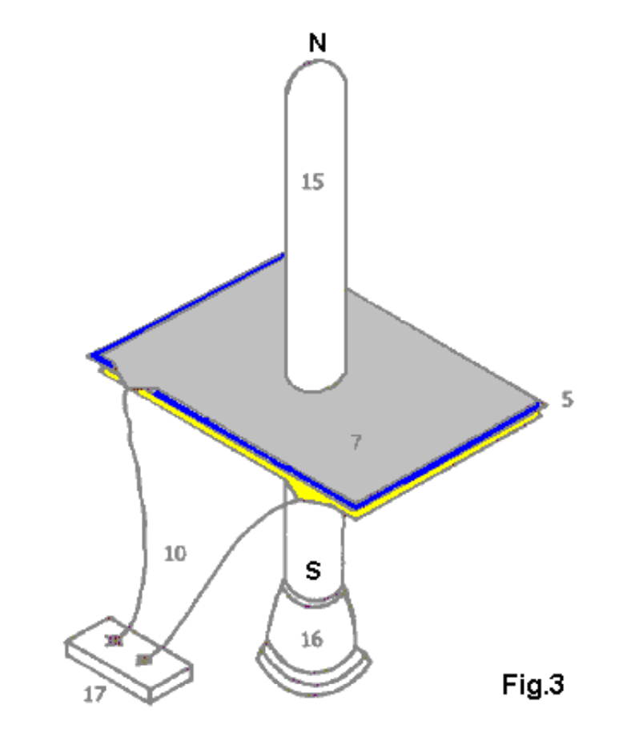
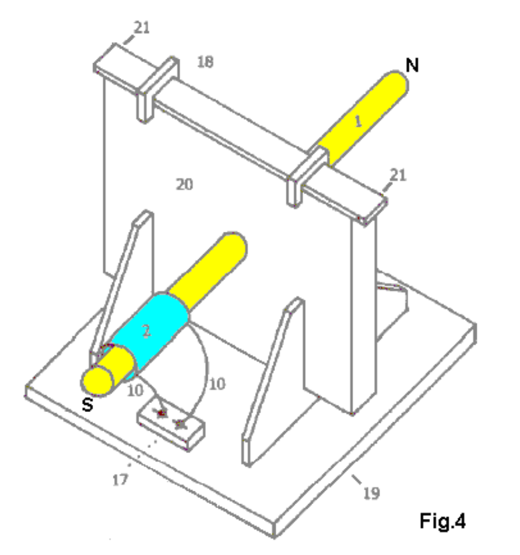

# 变压器发电机磁共振转化为电能

TRANSFORMER GENERATOR MAGNETIC RESONANCE INTO ELECTRIC ENERGY

ABSTRACT

The present invention refers to an Electromagnetic Dipole Device and Method, where
wasted radiated energy is transformed into useful energy. A Dipole as seen in AntennaSystems is adapted for use with capacitor plates in such a way that the Heaviside
Current Component becomes a useful source of electrical energy.

DESCRIPTION

Technical Field:

This invention relates to loaded Dipole Antenna Systems and their Electromagnetic
radiation. When used as a transformer with an appropriate energy collector system, it
becomes a transformer/generator. The invention collects and converts energy which is
radiated and wasted by conventional devices.

Background Art:

A search of the International Patent Database for closely related methods did not
reveal any prior art with an interest in conserving radiated and wasted magnetic waves
as useful energy.

DISCLOSURE OF THE INVENTION

The invention is a new and useful departure from transformer generator construction,
such that radiated and wasted magnetic energy changes into useful electrical energy.
Gauss meters show that much energy from conventional electromagnetic devices is
radiated into the ambient background and wasted. In the case of conventional
transformer generators, a radical change in the physical construction allows better
access to the energy available. It is found that creating a dipole and inserting capacitor
plates at right angles to the current flow, allows magnetic waves to change back into
useful electrical (coulombs) energy. Magnetic waves passing through the capacitor
plates do not degrade and the full impact of the available energy is accessed. One, or
as many sets of capacitor plates as is desired, may be used. Each set makes an exact
copy of the full force and effect of the energy present in the magnetic waves. The
originating source is not depleted of degraded as is common in conventional
transformers.

BRIEF DESCRIPTION OF THE DRAWINGS

The Dipole at right angles, allows the magnetic flux surrounding it to intercept the
capacitor plate, or plates, at right angles. The electrons present are spun such that the
electrical component of each electron is collected by the capacitor plates. Essential
parts are the South and North component of an active Dipole. Examples presented
here exist as fully functional prototypes and were engineer constructed and fully tested
in use by the Inventor. In each of the three examples shown in the drawings,
corresponding parts are used.

Fig.1 is a View of the Method, where N is the North and S is the South component of
the Dipole.

Here, 1 marks the Dipole with its North and South components. 2 is a resonant highvoltage induction coil. 3 indicates the position of the electromagnetic wave emission
from the Dipole. 4 indicates the position and flow direction of the corresponding
Heaviside current component of the energy flow caused by the induction coil 2. 5 is
the dielectric separator for the capacitor plates 7. 6 for the purposes of this drawing,
indicates a virtual limit for the scope of the electromagnetic wave energy.

Fig.2 has two parts A and B.

In Fig.2A 1 is the hole in the capacitor plates through which the Dipole is inserted
and in Fig.2B it is the Dipole with its North and South poles shown. 2 is the resonant
high-voltage induction coil surrounding part of the Dipole 1. The dielectric separator 5,
is a thin sheet of plastic placed between the two capacitor plates 7, the upper plate
being made of aluminium and the lower plate made of copper. Unit 8 is a deep-cycle
battery system powering a DC inverter 9 which produces 120 volts at 60 Hz (the US mains supply voltage and frequency, obviously, a 240 volt 50 Hz inverter could be
used here just as easily) which is used to power whatever equipment is to be driven by
the device. The reference number 10 just indicates connecting wires. Unit 11 is a highvoltage generating device such as a neon transformer with its oscillating power supply.

Fig.3 is a Proof Of Principal Device using a Plasma Tube as an active Dipole. In this
drawing, 5 is the plastic sheet dielectric separator of the two plates 7 of the capacitor,
the upper plate being aluminium and the lower plate copper. The connecting wires are
marked 10 and the plasma tube is designated 15. The plasma tube is four feet long
(1.22 m) and six inches (100 mm) in diameter. The high-voltage energy source for the
active plasma dipole is marked 16 and there is a connector box 17 shown as that is a
convenient method of connecting to the capacitor plates when running tests on the
device.

