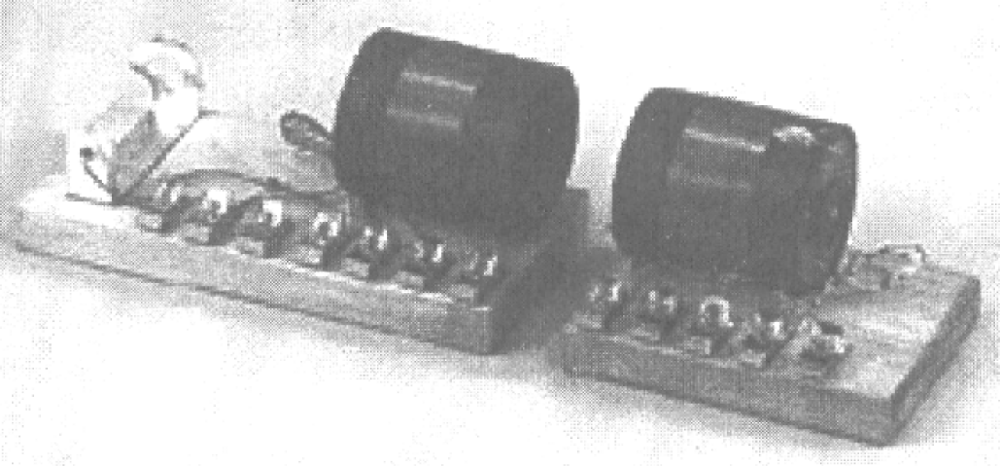
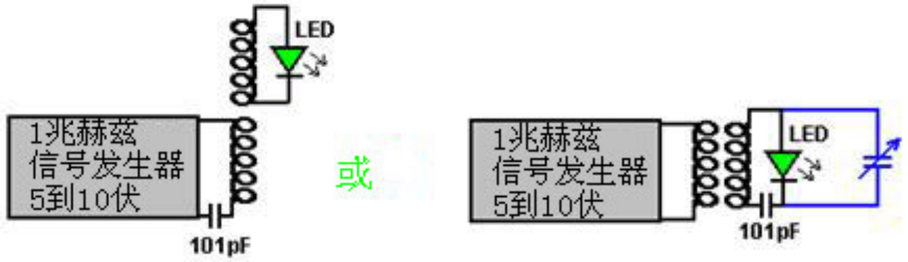

# 变压器发电机磁共振转化为电能

TRANSFORMER GENERATOR MAGNETIC RESONANCE INTO ELECTRIC ENERGY

ABSTRACT

The present invention refers to an Electromagnetic Dipole Device and Method, where wasted radiated energy is transformed into useful energy. A Dipole as seen in AntennaSystems is adapted for use with capacitor plates in such a way that the Heaviside Current Component becomes a useful source of electrical energy.

摘要

本发明是指电磁偶极子的装置和方法，把浪费的辐射能量变成有用的能源。就象在天线系统中看到的一样，一个偶极子适用于用电容器极板以海维赛德电流分量变成有用的电力能源的方式。

DESCRIPTION

Technical Field:

This invention relates to loaded Dipole Antenna Systems and their Electromagnetic radiation. When used as a transformer with an appropriate energy collector system, it becomes a transformer/generator. The invention collects and converts energy which is radiated and wasted by conventional devices.

描述

技术领域：

这项发明涉及加载偶极子天线系统及其电磁辐射。当作为一个带有适当的能源收集系统的变压器使用时，它变成一个转换器/发电机。本发明收集并转换那些在常规装置中被辐射和浪费的能量。

Background Art:

A search of the International Patent Database for closely related methods did not reveal any prior art with an interest in conserving radiated and wasted magnetic waves as useful energy.

技能背景:

搜索国际专利数据库以找到密切相关的方法，并没有显示出任何较早的技术对于可以保存辐射掉和浪费掉的磁波作为有用的能源感兴趣。

DISCLOSURE OF THE INVENTION

The invention is a new and useful departure from transformer generator construction, such that radiated and wasted magnetic energy changes into useful electrical energy.  Gauss meters show that much energy from conventional electromagnetic devices is radiated into the ambient background and wasted. In the case of conventional transformer generators, a radical change in the physical construction allows better access to the energy available. It is found that creating a dipole and inserting capacitor plates at right angles to the current flow, allows magnetic waves to change back into useful electrical (coulombs) energy. Magnetic waves passing through the capacitor plates do not degrade and the full impact of the available energy is accessed. One, or as many sets of capacitor plates as is desired, may be used. Each set makes an exact copy of the full force and effect of the energy present in the magnetic waves. The originating source is not depleted of degraded as is common in conventional transformers.

发明的披露

本发明对传统变压器发电机结构是一个新的有益的逾越，以使那些辐射掉的和浪费掉的磁能转变成有用的电能。高斯计显示大量能量从传统电磁器件中辐射到周围背景并被浪费掉了。在传统变压器发电机的情况下，物理结构的根本改变使得我们有一个更好的入口去获取能源。我们发现创建一个偶极子并与电流成直角插入一块电容器极板，使得磁波变回有用的电（库伦）能。磁波通过电容器极板不仅不减低、还充分影响进入的有效能。可以使用一个、或一套或你想要用多少就可以用多少的电容器极板。每一套都精确复制了磁波里存在的能量的全部的力和效应。原始源泉不象传统变压器那样，而是永不枯竭退化的。

BRIEF DESCRIPTION OF THE DRAWINGS

The Dipole at right angles, allows the magnetic flux surrounding it to intercept the capacitor plate, or plates, at right angles. The electrons present are spun such that the electrical component of each electron is collected by the capacitor plates. Essential parts are the South and North component of an active Dipole. Examples presented here exist as fully functional prototypes and were engineer constructed and fully tested in use by the Inventor. In each of the three examples shown in the drawings, corresponding parts are used.

绘图的简要说明

偶极子成直角，使得磁通围绕着它成直角去拦截电容器极板、或板材。目前电子被旋转以使电容器极板收集每个电子的电分量。实质部分是有源偶极子的南极和北极分量。这里介绍的范本是作为一个全功能的原型出现，并由工程师建造及由发明人在使用中充分进行过测试。图中所示的三个范本中的每一个，均用相应的部分。

Fig.1 is a View of the Method, where N is the North and S is the South component of the Dipole.

Here, 1 marks the Dipole with its North and South components. 2 is a resonant highvoltage induction coil. 3 indicates the position of the electromagnetic wave emission from the Dipole. 4 indicates the position and flow direction of the corresponding Heaviside current component of the energy flow caused by the induction coil 2. 5 is the dielectric separator for the capacitor plates 7. 6 for the purposes of this drawing, indicates a virtual limit for the scope of the electromagnetic wave energy.

图.1是方法视图，偶极子的北极分量是N而南极分量是S。

这里，带有南极和北极分量的偶极子标识为1。2是谐振高压感应线圈。3表示偶极子发射的电磁波的位置。4表示感应线圈2引起的能量流的海维赛德电流分量的对应位置和流向。5是电容器极板7的介电分离器。6是此图的目的，表示电磁波能量范围的虚拟的限制。

Fig.2 has two parts A and B.

In Fig.2A 1 is the hole in the capacitor plates through which the Dipole is inserted and in Fig.2B it is the Dipole with its North and South poles shown. 2 is the resonant high-voltage induction coil surrounding part of the Dipole 1. The dielectric separator 5, is a thin sheet of plastic placed between the two capacitor plates 7, the upper plate being made of aluminium and the lower plate made of copper. Unit 8 is a deep-cycle battery system powering a DC inverter 9 which produces 120 volts at 60 Hz (the US mains supply voltage and frequency, obviously, a 240 volt 50 Hz inverter could be used here just as easily) which is used to power whatever equipment is to be driven by the device. The reference number 10 just indicates connecting wires. Unit 11 is a highvoltage generating device such as a neon transformer with its oscillating power supply.

图.2有A和B两个部分

在图.2A中，1是电容器极板中的孔洞，偶极是通过这个孔洞插入的，而在图.2B中显示的是具有南极和北极的偶极。2是谐振高压感应线圈绕着偶极1的一部分。介电分离器5，是一张塑料薄片置于两个电容器极板7之间，上板为铝制而下板为铜制。单元8是一块深循环电池系统，为一台直流逆变器9供电，逆变器产生120伏60赫兹电流（美国市电电压和频率，显然，一个240伏50赫兹的逆变器同样可以轻松在此使用）用于依此装置驱动的任何设备提供动力。参考号10只是表明连接线。单元11是一台高压产生装置，例如霓虹变压器用以提供振荡功率。

Fig.3 is a Proof Of Principal Device using a Plasma Tube as an active Dipole. In this drawing, 5 is the plastic sheet dielectric separator of the two plates 7 of the capacitor, the upper plate being aluminium and the lower plate copper. The connecting wires are marked 10 and the plasma tube is designated 15. The plasma tube is four feet long (1.22 m) and six inches (100 mm) in diameter. The high-voltage energy source for the active plasma dipole is marked 16 and there is a connector box 17 shown as that is a convenient method of connecting to the capacitor plates when running tests on the device.

图.3是一台使用等离子体管作为有源偶极子的主要装置的证明。在该图中，5是电容的两个极板7的塑料片状介电分离器，上板为铝制，下板为铜制。连接导线标为10而等离子体管标注为15。等离子体管四英尺（1.22米）长，直径六英寸（100毫米）。有源等离子偶极的高压电源标为16，而显示的连接盒17是便于测试装置时连接电容器极板用的。

Fig.4 shows a Manufacturer's Prototype, constructed and fully tested. 1 is a metal Dipole rod and 2 the resonant high-voltage induction coil, connected through wires 10 to connector block 17 which facilitates the connection of it's high-voltage power supply.  Clamps 18 hold the upper edge of the capacitor packet in place and 19 is the base plate with it's supporting brackets which hold the whole device in place. 20 is a housing which contains the capacitor plates and 21 is the point at which the power output from the capacitor plates is drawn off and fed to the DC inverter.

图.4显示了一个制做者已建成的原型机，并经过充分测试。1是一根金属偶极棒；而2的谐振高压感应线圈，通过导线10连接到连接器块17，这便于连接其高压电源。夹具18把电容器心子上切面固定在适当位置上；而19是底座，以其支承托架固定着整个装置。20是外壳，以容纳电容器极板；而21是电容器极板的功率输出点，并由此伺给直流逆变器。

BEST METHOD OF CARRYING OUT THE INVENTION

The invention is applicable to any and all electrical energy requirements. The small size and it's high efficiency make it an attractive option, especially for remote areas, homes, office buildings, factories, shopping centres, public places, transportation, water systems, electric trains, boats, ships and 'all things great and small'. The construction materials are commonly available and only moderate skill levels are needed to make the device.

贯彻本装置的最佳方法

本发明适用于所有的电能需求。它小尺寸但高效率，令其成为很有吸引力的选择，特别是对边远地区、家庭、办公大楼、工厂、商业中心、公共场所、交通、水系统、电气火车、游艇、船舶和“所有或大或小的东西”。施工材料寻常可得，而制做设备只需中等技术水平。

CLAIMS

1. Radiated magnetic flux from the Dipole, when intercepted by capacitor plates at right angles, changes into useful electrical energy.
2. A Device and Method for converting for use, normally wasted electromagnetic energy.
3. The Dipole of the Invention is any resonating substance such as Metal Rods, Coils and Plasma Tubes which have interacting Positive and Negative components.
4. The resulting Heaviside current component is changed to useful electrical energy.

声明

1. 偶极子辐射的磁通量被电容器极板成直角拦截时，转换成有用的电能。
2. 为应用而以设备和方法进行转换，通常消耗电磁能。
3. 本发明的偶极子可以是任何产生共鸣的物质，如金属杆、线圈和等离子体管，只要有相互作用的正极和负极的组件既可。
4. 海维赛德电流分量的结果是转换成有用的电能。

This patent does not make it clear that the device needs to be tuned and that the tuning is related to its physical location. The tuning will be accomplished by applying a variable-frequency input signal to the neon transformer and adjusting that input frequency to give the maximum output.

这项专利并没有解释设备是需要进行调整的；而调整与它的物理位置有关。调整的实现要通过应用变频输入信号给霓虹变压器来完成，并调节输入频率以给出最大输出。

Don Smith has produced some forty eight different devices, and because he understands that the real power in the universe is magnetic and not electric, these devices have performances which appear staggering to people trained to think that electrical power is the only source of power. One device which is commercially
produced in Russia, is shown here:

唐·史密斯已经生产了大约48种不同的设备，因为他知道宇宙中的真正力量是磁性的，而不是电性的，所以这些设备的性能对于那些受过训练认为电力是唯一动力来源的人来说似乎是惊人的。一种商业化的设备在俄罗斯生产的，如下图所示：

This is a small table-top device which looks like it is an experiment by a beginner, and something which would be wholly ineffective. Nothing could be further from the truth.  Each of the eight coils pairs (one each side of the rotating disc) produces 1,000 volts at 50 amps (fifty kilowatts) of output power, giving a total power output of 400 kilowatts. It's overall size is 16" x 14.5" x 10" (400 x 370 x 255 mm). In spite of the extremely high power output, the general construction is very simple:

这是一个小型桌面设备，看起来像是初学者的实验，而且完全无效。事实远非如此。八对线圈中的每一对（旋转盘的每侧一对）在50安培（50千瓦）的输出功率下产生1000伏的电压，总功率输出为400千瓦。它的整体尺寸为16英寸x14.5英寸x10英寸（400 x 370 x 255毫米）。尽管功率输出非常高，但总体结构非常简单：

The device operates on a fluctuating magnetic field which is produced by a small lowpower DC motor spinning a plastic disc. In the prototype shown above, the disc is anold vinyl record which has had holes cut in it. Between the holes is an area which was covered with glue and then sprinkled with powdered neodymium magnet material. It takes very little power to spin the disc, but it acts in a way which is very much like the Ecklin-Brown generator, repeatedly disrupting the magnetic field. The magnetic field is created by a neodymium magnet in each of the sixteen plastic pipes. It is important that the change in the magnetic flux between the matching magnets on each side of the disc is as large as possible. The ideal rotor material for this is "Terfenol-D" (tungsten zirconate) with slots cut in it but it is so expensive that materials like stainless steel are likely to be used instead

该装置在由旋转塑料盘的小型低功率直流电机产生的波动磁场中运行。在上图所示的原型中，光盘是一张阳极乙烯基唱片，上面开了孔。孔之间有一个区域，上面涂着胶水，然后撒上粉末钕磁铁材料。旋转圆盘只需要很小的能量，但它的作用方式非常像埃克林-布朗发电机，反复扰乱磁场。磁场是由十六个塑料管中的每一个中的钕磁体产生的。重要的是，圆盘两侧匹配磁体之间的磁通量变化应尽可能大。理想的转子材料是“Terfenol-D”（锆酸钨），上面有槽，但它太贵了，可能会使用不锈钢等材料代替

For Don Smith, this is not an exceptional device. The one shown below is also physically quite small and yet it has an output of 160 kilowatts (8000 volts at 20 amps) from an input of 12 volts 1 amp (COP = 13,333):

下面所示装置体型相当小，可以具有160千瓦的输出（8000伏20安培），而输入为12伏1安培（COP=13.333）

Again, this is a device which can be placed on top of a table and is not a complicated form of construction, having a very open and simplistic layout. However, some components are not mounted on this board. The twelve volt battery and connecting leads are not shown, nor is the ground connection, the step-down isolation transformer and the varistor used to protect the load from over-voltage by absorbing any random voltage spikes which might occur, but more of these things later on when a much more detailed description of this device is given.

同样，这是一种可以放置在桌子上的设备，结构并不复杂，布局非常开放和简单。但是，有些组件没有安装在此板上。未显示12伏电池和连接引线，也未显示接地连接、降压隔离变压器和变阻器，变阻器用于通过吸收可能出现的任何随机电压尖峰来保护负载免受过电压，但稍后将对该设备进行更详细的描述。

Another of Don's devices is shown here:

唐的另一个设备如下：

This is a larger device which uses a plasma tube four feet (1.22 m) long and 6 inches (100 mm) in diameter. The output is a massive 100 kilowatts. This is the design shown as one of the options in Don's patent. Being an Electrical Engineer, none of Don's prototypes are in the "toy" category. If nothing else is taken from Don's work, we should realise that high power outputs can be had from very simple devices.

这是一个更大的装置，它使用一根四英尺（1.22米）长、直径6英寸（100毫米）的等离子管。输出功率高达100千瓦。这是唐专利中显示的选项之一。作为一名电气工程师，唐的原型都不属于“玩具”类别。如果不从唐的工作中吸取任何其他东西，我们应该意识到，可以从非常简单的设备中获得高功率输出。

There is one other brief document "Resonate Electrical Power System" from Don Smith which says:

Don Smith的另一份简短文件“谐振电力系统”说：

Potential Energy us everywhere at all times, becoming useful when converted into a more practical form. There is no energy shortage, only grey matter. This energy potential is observed indirectly through the manifestation of electromagnetic phenomenon, when intercepted and converted, becomes useful. In nonlinear systems, interaction of magnetic waves amplify (conjugate) energy, providing greater output than input. In simple form, in the piano where three strings are struck by the hammer, the centre one is impacted and resonance activates the side strings. Resonance between the three strings provides a sound level greater than the input energy. Sound is part of the electromagnetic spectrum and is subject to all that is applicable to it.

势能无时无处不在，当转换为更实用的形式时就成为有益的了。只要用脑，就没有能源短缺。这种潜在的能量是通过电磁现象的表现间接观察到的——当被截获和转换，变得有用时。在非线性系统中，磁波的相互作用放大(共轭)能源，提供比输入更大的输出。简单地说，锤击钢琴的三条弦，中间的一条遭到撞击而共鸣并激活两侧的弦。三条弦的共鸣产生一个大于输入能量的声级。声音是电磁波频谱的一部分，并遵守所有适用律。

"Useful Energy" is defined as "that which is other than Ambient". "Electric Potential" relates to mass and it's acceleration. Therefore, the Earth's Mass and Speed through space, gives it an enormous electrical potential. Humans are like the bird sitting unaware on a high voltage line. in nature, turbulence upsets ambient and we seeelectrical displays. Tampering with ambient, allows humans to convert magnetic waves into useful electricity.

“有用能源”被定义为“除了环境以外的能源”。“电势”与质量及其加速度有关。因此，地球的质量和速度穿过空间，给它一个巨大的电势。人类就像坐在高压线上而没有意识到的鸟。在自然界，湍流扰乱环境而我们看到电的显露。篡改环境，使得人类能够把磁波转化为有用的电能。

Putting this in focus, requires a look at the Earth in general. Each minute of each day (1,440 minutes), more than 4,000 displays of lightning occur. Each display yields more than 10,000,000 volts at more than 200,000 amperes in equivalent electromagnetic flux. This is more than 57,600,000,000,000 volts and 1,152,000,000,000 amperes of electromagnetic flux during each 24 hour period. This has been going on for more than 4 billion years. The USPTO insist that the Earth's electrical field is insignificant and useless, and that converting this energy violates the laws of nature. At the same time, they issue patents in which, electromagnetic flux coming in from the Sun is converted by solar cells into DC energy. Aeromagnetic flux (in gammas) Maps World-Wide, includes those provided by the US Department of Interior-Geological Survey, and these show clearly that there is present, a spread of 1,900 gamma above Ambient, from reading instruments flown 1,000 feet above the (surface) source. Coulomb's Law requires the squaring of the distance of the remote reading, multiplied by the recorded reading. Therefore, that reading of 1,900 gamma has a corrected value of 1,900 x 1,000 x 1,000 = 1,900,000,000 gamma.

以此为重点，一般要看看地球。在每天的1,440分钟里，发生4,000多次闪电。每次闪电收获超过千万伏特20万安培的相当电磁流量。这是每24小时周期里超过57,600,000,000,000伏和1,152,000,000,000安培的电磁流量。这已经持续了超过40亿年。美国专利商标局坚持认为，地球的电场是微不足道的和无用的，而这种能量转化违反自然规律。同时，他们发布的专利中，就有来自太阳的电磁流量由太阳能电池转化成直流能源。世界航空磁测通量（伽马能谱）图，包括那些由美国内部地质勘测部门提供的，这些都清楚地表明，从飞临（表面）源1000英尺以上的指示仪表上可知，存在一个在环境之上1,900伽马的分布。库仑定律需要距离平方的远程读数，乘以记录读数。因此，1900伽玛的读数校正值是1900x1000x1000=1,900,000,000伽马。

There is a tendency to confuse "gamma ray" with "gamma". "Gamma" is ordinary, everyday magnetic flux, while "gamma ray" is high-impact energy and not flux. One gamma of magnetic flux is equal to that of 100 volts RMS. To see this, take a Plasma Globe emitting 40,000 volts. When properly used, a gamma meter placed nearby, will read 400 gammas. The 1,900,000,000 gamma just mentioned, is the magnetic ambient equivalent of 190,000,000 volts of electricity. This is on a "Solar Quiet" day.  On "Solar Active" days it may exceed five times that amount. The Establishment's idea that the Earth's electrical field is insignificant, goes the way of their other great ideas.

有一种混淆“伽玛”和“伽玛射线”的倾向。“伽玛”是普通的日常磁通量，而“伽玛射线”是高冲击强度的能量而不是通量。一伽玛等于100伏均方根值。若要看到这一点，采取等离子球发射40000伏特。当正确使用时，一台放置在附近的伽马仪将读取到400伽玛。刚说到的1,900,000,000伽马，是相当于190,000,000伏电力的磁环境。这是“太阳安静”的一天。在“太阳活跃”日，将是上述数字的五倍。当局的地球电场是微不足道的观念，重蹈了他们其它的伟大理念的覆辙。

There are two kinds of electricity: "potential" and "useful". All electricity is "potential" until it is converted. The resonant-fluxing of electrons, activates the electrical potential which is present everywhere. The Intensity/CPS of the resonant-frequency-flux rate, sets the available energy. This must then be converted into the required physical dimensions of the equipment being used. For example, energy arriving from the Sun is magnetic flux, which solar cells convert to DC electricity, which is then converted further to suit the equipment being powered by it. Only the magnetic flux moves from point "A" (the Sun) to point "B" (the Earth). All electrical power systems work in exactly the same way. Movement of Coils and Magnets at point "A" (the generator) fluxes electrons, which in turn, excite electrons at point "B" (your house). None of the electrons at point "A" are ever transmitted to point "B". In both cases, the electrons remain forever intact and available for further fluxing. This is not allowed by Newtonian Physics (electrodynamics and the laws of conservation). Clearly, these laws are all screwed up and inadequate.

有两种电能，“潜能”和“有用能”。所有电能都是“潜能”，直至它们被转换。电子的共振流通激活了无处不在的电子潜能。共振频率通流率的强度/CPS(每秒电子数)，设置可用的能源。这必须被转换成正在使用的设备所需的物理尺寸。例如，来自太阳的能量是磁通量，由太阳能电池转换成直流电，然后进一步转换成适于它所提供能量的设备的形式。只有磁通从点“A”（太阳）转移到点“B”（地球）。所有电能系统的工作方式完全相同。线圈和磁体的运动在点“A”（发电机）流动电子，继而激发在点“B”（你的住宅）的电子。根本没有点“A”的电子源源不断地传送到点“B”。在这两种情况下，电子永远保持完整无损，并且可用于进一步通流。这是牛顿物理（电气力学和守恒定律）所不允许的。显然，这些定律把人搞糊涂了而且是不充足的。

In modern physics, USPTO style, all of the above cannot exist because it opens a door to overunity. The good news is that the PTO has already issued hundreds of Patents related to Light Amplification, all of which are overunity. The Dynode used to adjust the self-powered shutter in your camera, receives magnetic flux from light which dislodges electrons from the cathode, reflecting electrons through the dynode bridgeto the anode, resulting in billions of more electrons out than in. There are currently, 297 direct patents issued for this system, and thousands of peripheral patents, all of which support overunity. More than a thousand other Patents which have been issued, can be seen by the discerning eye to be overunity devices. What does this indicate about Intellectual Honesty?

在现代物理学中，美国专利商标局风格，上述所有都不可能存在，因为它为超一打开了一扇门。好消息是，美国专利商标局已经颁发了数百项与光放大相关的专利，所有这些专利都超一。Dynode用于调节相机中的自供电快门，它接收来自光的磁通量，将电子从阴极移开，通过Dynode桥将电子反射到阳极，导致出射的电子比入射的电子多数十亿。目前，该系统已获得297项直接专利和数千项外围专利，所有这些专利都支持超一。已经颁发的一千多项其他专利，可以用敏锐的眼光看出是超一的设备。这表明了什么是聪明的诚实？

Any coil system, when fluxed, causes electrons to spin and produce useful energy, once it is converted to the style required by its use. Now that we have described the method which is required, let us now see how this concerns us.

任何线圈系统在通电时，一旦转换为使用所需的样式，就会使电子自旋并产生有用的能量。既然我们已经描述了所需的方法，现在让我们看看这与我们有什么关系。

The entire System already exists and all that we need to do is to hook it up in a way which is useful to our required manner of use. Let us examine this backwards and start with a conventional output transformer. Consider one which has the required voltage and current handling characteristics and which acts as an isolation transformer. Only the magnetic flux passes from the input winding to the output winding. No electrons pass through from the input side to the output side. Therefore, we only need to flux the output side of the transformer to have an electrical output.  Bad design by the establishment, allowing hysteresis of the metal plates, limits the load which can be driven. Up to this point, only potential is a consideration. Heat (which is energy loss) limits the output amperage. Correctly designed composite cores run cool, not hot.

整个系统已存在，而所有我们需要做的是按我们的使用方式而组合成对我们有用的。让我们回过头来审核这一点并以一台传统输出变压器开始。考虑一台拥有所需的电压和电流处理特性并起隔离变压器作用的设备。从输入绕组到输出绕组只有磁通通过。输入端到输出端没有电子通过。所以，我们只需要通流变压器的输出端以得到一个电输出。主流的设计很糟糕，允许金属板的磁滞，限制了可以被驱动的负载。到目前为止，只有潜能是一个考虑因素。热量（这是能量损失）限制输出电流强度。正确的设计应该是复合芯变冷而不是发热。

A power correction factor system, being a capacitor bank, maintains an even flow of flux. These same capacitors, when used with a coil system (a transformer) become a frequency-timing system. Therefore, the inductance of the input side of the transformer, when combined with the capacitor bank, provides the required fluxing to produce the required electrical energy (cycles per second).

一个功率校正因数系统，以一个电容器组，保持一个平均流量的通量。这些相同的电容器，当用于一个线圈系统时（一台变压器）就成为变频调速系统。因此，变压器的输入端的自感应，当与电容器组结合，给出需要的通量去产生所需要的电能（每秒周期数）。

With the downstream system in place, all that is needed now is a potential system.  Any flux system will be suitable. Any amplification over-unity output type is desirable.  The input system is point "A" and the output system is point "B". Any input system where a lesser amount of electrons disturbs a greater amount of electrons - producing an output which is greater than the input - is desirable.

把下游系统放在适当位置，现在所需要的只是一个势能系统。任何通量系统都将是适宜的。任意放大“超统一体”的输出的类型都是可取的。输入系统是点“A”而输出系统是点“B”。任何输入系统中一个较少量的电子干扰数量较多的电子而产生的一个输出，既输出大于输入，是可取的。

At this point, it is necessary to present updated information about electrons and the laws of physics. A large part of this, originates from me and so is likely to upset people who are rigidly set in the thought patterns of conventional science.

在这点上，有必要呈上有关电子和物理定律的修正信息。在这点上，有必要提供有关电子和物理定律的最新的信息。这一点，很大一部分源自我(唐·史密斯），因而很可能会使那些硬性思考传统科学模式的人心烦意乱。

## 非离子电子

As a source of electrical energy, non-ionic electrons doublets exist in immense quantities throughout the universe. Their origin is from the emanation of Solar Plasma.  When ambient electrons are disturbed by being spun or pushed apart, they yield both magnetic and electrical energy. The rate of disturbance (cycling) determines the energy level achieved. Practical methods of disturbing them include, moving coils past magnets or vice versa. A better way is the pulsing (resonant induction) with magnetic fields and waves near coils.

作为电能的来源，整个宇宙中存在大量的非离子电子偶。它们的起源是太阳等离子体的发射。当周围的电子被旋转或推开而受到干扰时，它们会产生磁能和电能。干扰（循环）的速率决定了达到的能级。干扰它们的实用方法包括将线圈移过磁铁，反之亦然。更好的方法是在线圈附近用磁场和波进行脉冲（共振感应）。

In coil systems, magnetic and amperage are one package. This suggests that electrons in their natural non-ionic state, exist as doublets. When pushed apart by agitation, one spins right (yielding Volts-potential electricity) and the other spins left (yielding Amperage-magnetic energy), one being more negative than the other. This further suggests that when they reunite, we have (Volts x Amps = Watts) useful electrical energy. Until now, this idea has been totally absent from the knowledge base. The previous definition of Amperage is therefore flawed.

在线圈系统中，磁场和电流是一个整体。这表明，处于自然非离子状态的电子以双峰形式存在。当被搅拌推开时，一个向右旋转（产生伏特电势），另一个向左旋转（产生安培磁能），一个比另一个更负。这进一步表明，当它们重新结合时，我们拥有（伏特x安培=瓦特）有用的电能。到目前为止，这一想法在知识库中完全缺失。因此，之前对安培的定义是有缺陷的。

**电子左旋产生电能，右旋产生磁能。电子碰撞发出可见光和热。**

有用电路，对建造一台可运行单元的建议

1. Substitute a Plasma Globe such as Radio Shack's "Illumna-Storm" for thesource-resonant induction system. It will have about 400 milligauss of magnetic induction. One milligauss is equal to 100 volts worth of magnetic induction.  2. Construct a coil using a 5-inch to 7-inch (125 to 180 mm) diameter piece of PVC for the coil former.
3. Get about 30 feet (10 m) of Jumbo-Speaker Cable and separate the two strands. This can be done by sticking a carpet knife into a piece of cardboard or wood, and then pulling the cable carefully past the blade to separate the two insulated cores from each other. (PJK Note: "Jumbo-Speaker Cable" is a vague term as that cable comes in many varieties, with anything from a few, to over 500 strands in each core. As Don points out that the output power increases with each turn of wire, it is distinctly possible that each of these strands acts the same as individual insulated turns which have been connected in parallel, so a 500-strand cable may well be far more effective than a cable with just a few strands).
4. Wind the coil with 10 to 15 turns of wire and leave about 3 feet (1 m) of cable spare at each end of the coil. Use a glue gun to hold the start and finish of the coil.
5. This will become the "L - 2" coil shown in the Circuits page.
6. When sitting on top of the Plasma Globe (like a crown) you have a first-class resonant air-core coil system.
7. Now, substitute two or more capacitors (rated at 5,000 volts or more) for the capacitor bank shown on the Circuits page. I use more than two 34 microfarad capacitors.
8. Finish out the circuit as shown. You are now in business !
9. Voltage - Amperage limiting resistors are required across the output side of the Load transformer. These are used to adjust the output level and the desired cycles per second.

-- 
1. 可以用象“无线小屋”（RadioShack，美国的电子零售公司）的“伊露明纳风暴”（Illumna-Storm）替换等离子球作为振源感应装置系统。它具有约400毫高斯的磁感应强度。一毫高斯等值于100伏的磁感应强度。
2. 构建线圈用7英寸到5英寸（125到180毫米）直径的PVC件作为线圈架。
3. 取约30英尺（10米）的巨型扬声器电缆并分离成两股。这可以通过把地毯刀插入一块纸板或木板里，然后小心牵引电缆通过刀刃来分开两条绝缘线芯。（帕特里克注：“巨型扬声器电缆”是一个不精确的术语，因为电缆种类繁多，一个同芯电缆从只有几股到500股。由于唐指出输出功率依导线的每一匝而增加，显然可能这股线的每一股都起到并联的单独绝缘圈的作用，所以一条500股同芯电缆要比一条只有几股的要有效得多）。
4. 用10到15匝的导线绕制线圈，并留下约3英尺（1米）的电缆在线圈的每一端。用胶枪固定线圈的起始端和完成端。
5. 这将成为“L-2”线圈，如电路图所示。
6. 当把它置于等离子球顶部时（象一顶皇冠），你就有了一个一流的共振空心线圈系统。
7. 现在，用两个或更多个电容（额定5,000伏或更高）替换显示在电路图中的电容器组。，如电路图所示。我用了两个以上的34微法拉的电容器。
8. 完成了电路，如图所示。你现在该忙活了！
9. 电压-电流限制电阻需要跨接负载变压器的输出端。这些被用来调整输出级别和所需的每秒周期数。

Suggestions: Get a copy of the "Handbook of Electronic Tables and FormulasJ", published by Sams, ISBN 0-672-22469-0, also an LCR meter is required. Chapter 1 in this book has important time constant (frequency) information and a set of reactance charts in nomograph style ("nomograph": a graph, usually containing three parallel scales graduated for different variables so that when a straight line connects values of any two, the related value may be read directly from the third at the point intersected by the line) which makes working, and approximating of the three variables (capacitance, inductance and resistance) much easier. If two of the variables are known, then the third one can be read from the nomograph.

唐·史密斯的建议：找到一份《电子表格和公式手册》(HandbookofElectronicTablesandFormulas，由萨姆斯出版，书号0-672-22469-0），还要有一台电感/电容/电阻表。唐的pdf文档的第1章有重要的时间常数(频率)信息和一组列线图解法样式的电抗图（“列线图解法”，一种图表，通常以三条平行刻度表示不同变量，当一条直线与连接到任何两个值，那么被这条直线分割的第三点上可以直接读取到相关的值），这使得工作起来以及接近三个变量（电容、电感和电阻）要容易得多。如果已知两个变量，那么第三个就能在列线图上读出。

For example, if the input side of the isolation transformer needs to operate at 60 Hz, that is 60 positive cycles and 60 negative cycles, being a total of 120 cycles. Read off the inductance in Henries using the LCR meter attached to the input side of the isolation transformer. Plot this value on the (nomographic) reactance chart. Plot the needed 120 Hz on the chart and connect these two points with a straight line. Where this line crosses the Farads line and the Ohms line, gives us two values. Choose one (resistor) and insert it between the two leads of the transformer input winding.

例如，如果隔离变压器的输入端需要在60赫兹运行，就是60次正循环和60次负循环，共计120次周期。通过在隔离变压器输入端的电感表读出电感亨利值。在（列线图解法）电抗图上标绘出这个值。在图上标绘所需的120赫兹并以直线连接这两个点。这条线与法拉线和欧姆线的相交处，给我们两个值。选择一个（电阻器）并把它插入到变压器输入绕组的两条引线之间。

The Power Correction Factor Capacitor (or bank of more than one capacitor) now need adjusting. The following formula is helpful in finding this missing information. The capacitance is known, as is the desired potential to pulse the output transformer. One Farad of capacitance is one volt for one second (one Coulomb). Therefore, if we want to keep the bucket full with a certain amount, how many dippers full are needed? If the bucket needs 120 volts, then how many coulombs are required?

功率校正因数电容器（或多个电容器的组）现在需要调节。下列公式有助于你找到这种遗漏的信息。已知电容量，作为所需电势去脉冲输出变压器。电容量的一法拉是一伏特一秒（一库伦）。因此，如果我们要以一定的量保持水桶是满的，需要多少个满杓？如果水桶需要120伏，那么需要多少库伦？

    Desired Voltage/Capacitance in Microfarads = Required frequency in Hz

    所需电压/电容量(微法) = 所需频率(赫效)

Now, go to the Reactance Chart mentioned above, and find the required resistor jumper to place between the poles of the Correction Factor Capacitor.

现在，回到上面提到的列线图，并找到所需的电阻跳线放置在校正因子电容器的两极之间。

A earth grounding is desirable as a voltage-limiter and transient spike control. Two are necessary, one at the Power Factor Capacitor and one at the input side of the isolation transformer. Off-the-shelf surge arrestors / spark gaps and varistors having the desired voltage/potential and amperage control are commonly available. Siemans, Citel America and others, make a full range of surge arrestors, etc. Varistors look like coinsized flat capacitors. Any of these voltage limiters are marked as "V - 1" in the
following text.

需要一个接地，起到限压器和瞬时峰值控制的作用。两个单独的接地是必要的，一个在功率因数电容器而一个在隔离变压器的输入端。电涌放电器/火花隙和变阻器需要电压/电位和电流强度控制一般都有成品可供。西门子、美国西岱尔(Siemens,CitelAmerica)和其它公司，制造全系列的电涌放电器，等等。变阻器看来象硬币大小的平板电容器。这些限压器中的任何一种在下面文档中，都被标为“V-1”。

It should be obvious that several separate closed circuits are present in the suggested configuration: The power input source, the high-voltage module, a power factor capacitor bank combined with the input side of the isolation transformer. Lastly, the output side of the isolation transformer and its load. None of the electrons active at the power source (battery) are passed through the system for use downstream. At any point, if the magnetic flux rate should happen to vary, then the number of active electrons also varies. Therefore, controlling the flux rate controls the electron (potential) activity. Electrons active at point "A" are not the same electrons active at point "B", or point "C", and so on. If the magnetic flux rate (frequency Hz) varies, then a different number of electrons will be disturbed. This does not violate any Natural Law and does produce more energy out than in should that be desirable.

目前所建议的配置是几个独立的闭合电路，这应该是显而易见的：功率输入源，高压模块，功率因数电容器组与隔离变压器输入端结合。最后，是隔离变压器输出端及其负载。在电源（电池）活动的电子没有一个为使用下游而穿过系统。在任何时候，如果磁通率要发生变化，那么活跃的电子数也会变化。因此，控制磁通率也就控制了电子（电势）的活度。活跃在“A”点的电子与活跃在“B”点的、或者那些在“C”点的电子不同，依此类推。如果磁通量率（频率赫兹）改变，那么不同数量的电子会被扰乱。这并不违反任何自然律，而且也确实生成比输入能量多的输出能量，应该说是可取的。

A convenient high-voltage module is a 12 volt DC neon tube transformer. The Power Factor Correction Capacitors should be as many microfarads as possible as this allows a lower operating frequency. The 12-volt neon tube transformer oscillates at about 30,000 Hz. At the Power Correction Factor Capacitor bank we lower the frequency to match the input side of the isolation transformer.

一个方便的高压模块是一个12伏直流霓虹管变压器。功率因素校正电容器应为尽可能多的微法拉，因为这可以有一个较低的运行频率。12伏霓虹管变压器在约30,000赫兹上振荡。在功率校正因数电容器组我们降低了频率去匹配隔离变压器的输入端。

Other convenient high-voltage sources are car ignition coils, television flyback transformers, laser printer modules, and various other devices. Always lower the frequency at the Power Factor Correction Capacitor and correct, if needed, at the input side of the isolation transformer. The isolation transformer comes alive when pulsed.  Amperage becomes a part of the consideration only at the isolation transformer. Faulty design, resulting in hysteresis, creates heat which self-destructs the transformer if it is overloaded. Transformers which have a composite core instead of the more common cores made from many layers of thin sheets of soft iron, run cool and can tolerate much higher amperage.

其它方便的高压资源是汽车发火线圈，电视反馈变压器，激光打印机模块，和各种其它装置。如果需要的话，在隔离变压器的输入端，永远要调低功率因数校正电容器的频率。当脉冲时隔离变压器活跃起来。只在隔离变压器，电流强度成为考虑的一个部分。有缺陷的设计，导致磁滞现象，产生热量，如果过载，变压器还会自毁。变压器芯是混合芯，而不是通常的多层软铁薄片做成的芯，运行时变凉，并能承受非常高的电流强度。

The information shown above, relates to the small Suitcase Model demonstrated at the 1996 Tesla Convention, presented as Don Smiths' Workshop. This unit was a very primitive version and newer versions have atomic batteries and power output ranges of Gigawatts. The battery requirement is low level and is no more harmful than the radium on the dial of a clock. Commercial units of Boulder Dam size are currently being installed at several major locations throughout the world. For reasons of Don's personal security and contract obligations, the information which he has shared here is incomplete.

上面所示信息，是1996年特斯拉大会在唐·史密斯的工场所做的关于小型便携式模块的演示。这个单元是非常原始的版本，而较新的版本具有原子电池和十亿瓦的功率输出范围。电池要求是低电平的，而且不会有比钟表盘面上更有害的镭。顽石坝大小的商业设备目前正在全球身处主要地方安装。出于唐的人身安全和合同义务，他在这里共享的信息并不充分。

I am most definitely not an expert in this area. However, it is probably worth mentioning some of the main points which Don Smith appears to be making. There are some very important points being made here, and grasping these may make a considerable difference to our ability to tap into the excess energy available in our local environment. There are four points worth mentioning:

我绝对不是这方面的专家。然而，值得一提的是唐·史密斯似乎提出的一些要点。这里有一些非常重要的观点，掌握这些观点可能会对我们利用当地环境中多余能源的能力产生相当大的影响。有四点值得一提：

1. Voltage
2. Frequency
3. Magnetic / Electric relationship
4. Resonance

--
1. 电压
2. 频率
3. 磁/电关系
4. 共振

1. Voltage. We tend to view things with an 'intuitive' view, generally based on fairly simple concepts. For example, we automatically think that it is more difficult to pick up a heavy object than to pick up a light one. How much more difficult? Well, if it is twice as heavy, it would probably be about twice as much effort to pick it up. This view has developed from our experience of things which we have done in the past, rather than on any mathematical calculation or formula.

1.电压。我们往往用“直觉”来观察事物，通常基于相当朴素的观念。例如，我们自然觉得拿起一件沉重的物品要比拿起一件轻的困难得多。难多少？好吧，如果它重两倍，可能就要两倍的努力去拿起它。这种观念已经从我们以往事件的经验中得到发展，而不是仅凭数学和公式。

Well, how about pulsing an electronic system with a voltage? How would the output power of a system be affected by increasing the voltage? Our initial 'off-the cuff' reaction might be that the power output might be increased a bit, but then hold on… we've just remembered that Watts = Volts x Amps, so if you double the voltage, then you would double the power in watts. So we might settle for the notion that if we doubled the voltage then we could double the output power. If we thought that, then we would be wrong.

那么，用电压去脉冲一台电子系统会怎样？提升电压会使系统输出功率受到怎样的影响？我们的最初的“即兴”反应可能是功率输出或许会略有提高，但是，请稍候……我们刚记起瓦特＝伏特×安培，所以如果你加倍电压，那么你就加倍了功率瓦特。所以我们可能满足于如果加倍电压，就能加倍输出功率的观念。如果我们那样想，那我们就错了。

Don Smith points out that as capacitors and coils store energy, if they are involved in the circuit, then the output power is proportional to the square of the voltage used.  Double the voltage, and the output power is four times greater. Use three times the voltage and the output power is nine times greater. Use ten times the voltage and the output power is one hundred times greater !

唐·史密斯指出，因为电容器和线圈储存能量，如果在它们所涉及到电路中，那么输出功率是与所用的电压的平方成正比的。加倍电压，则输出功率会大四倍。使用三倍的电压则输出功率会大九倍。用十倍的电压，那么输出功率会大一百倍！

Don says that the energy stored, multiplied by the cycles per second, is the energy being pumped by the system. Capacitors and inductors (coils) temporarily store electrons, and their performance is given by:

唐说，能源储存，由每秒周期相乘，正是系统泵浦的能量。电容器和电感器（线圈）临时储存电子，而其性能为：

Capacitor formula: $W = 0.5 x C x V^2 x Hz$ where:

    W is the energy in Joules (Joules = Volts x Amps x seconds)
    C is the capacitance in Farads
    V is the voltage
    Hz is the cycles per second

Inductor formula: $W = 0.5 x L x A^2 x Hz$ where

    W is the energy in Joules
    L is the inductance in Henrys
    A is the current in amps
    Hz is the frequency in cycles per second

电容器公式：$W=0.5 x C x V^2 x Hz$其中：

    W是能量，单位为焦耳（焦耳=伏特x安培x秒）
    C是以法拉为单位的电容
    V是电压
    Hz是每秒的周期数

电感器公式：$W=0.5 x L x A^2 x Hz$其中

    W是焦耳能量
    L是亨利的电感
    A是电流，单位为安培
    Hz是以每秒周期为单位的频率

You will notice that where inductors (coils) are involved, then the output power goes up with the square of the current. Double the voltage and double the current gives four times the power output due to the increased voltage and that increased output is increased by a further four times due to the increased current, giving sixteen times the output power.

你会注意到这里涉及到电感器（线圈），那么输出功率就随电流的平方增加。加倍电压并且加倍电流给出了四倍的功率输出，由于增加电压，而那个增加的输出由于增加电流而被进一步增加了四倍，给出一个十六倍的输出功率。

2. Frequency. You will notice from the formulas above, that the output power is directly proportional to the frequency "Hz". The frequency is the number of cycles per second (or pulses per second) applied to the circuit. This is something which is not intuitive for most people. If you double the rate of pulsing, then you double the power output. When this sinks in, you suddenly see why Nikola Tesla tended to use millions of volts and millions of pulses per second.

2.频率。你会注意到上面的公式中，输出功率直接与频率“赫兹”成正比。频率是施加到电路的每秒周期数（或每秒脉冲数）。对大多数人来说，这不是凭直觉就能获知的。如果你加倍冲率，那么你就加倍了输出功率。当你了解到这一点，你突然明白了尼古拉·特斯拉为什么趋向于用数百万伏电压和每秒数百万次脉冲了。

However, Don Smith states that when a circuit is at it's point of resonance, resistance in the circuit drops to zero and the circuit becomes effectively, a superconductor. The energy for such a system which is in resonance is:

然而，唐·史密斯指出，当电路在它的共振点时，电路里的电阻下降到零，电路变成了有效的超导体。作为这样一种系统的能量其共振是：

Resonant circuit: $W = 0.5 x C x V^2 x (Hz)^2$ where:

    W is the energy in Joules
    C is the capacitance in Farads
    V is the voltage
    Hz is the cycles per second

谐振电路：$W=0.5 x C x V^2 x（Hz）^2$，其中：

    W是焦耳能量
    C是以法拉为单位的电容
    V是电压
    Hz是每秒的周期数

If this is correct, then raising the frequency in a resonating circuit has a massive effect on the power output of the device. The question then arises: why is the mains power in Europe just fifty cycles per second and in America just sixty cycles per second? If power goes up with frequency, then why not feed households at a million cycles per second? One major reason is that it is not easy to make electric motors which can be driven with power delivered at that frequency, so a more suitable frequency is chosen in order to suit the motors in vacuum cleaners, washing machines and other household equipment.

如果这是正确的，那么在一个振荡电路里提高频率会对装置的输出功率产生巨大影响。这时产生问题了：为什么欧洲的市电只有每秒五十周而在美国也只是每秒六十周？如果能量随频率而增加，那么为什么不以每秒数百万周伺给家庭？一个主要原因是建造一台在这种频率下进行能量传递而驱动的电动机是不容易的，因而只得选择更恰当的频率以适合真空吸尘器里的电机、洗衣机和其它家庭设备。

However, if we want to extract energy from the environment, then we should go for high voltage and high frequency. Then, when high power has been extracted, if we want a low frequency suited to electric motors, we can pulse the already captured power at that low frequency.

然而，如果我们要从环境中汲取能源，那么我们就应该争取用高电压和高频率。然后，当高功率得以萃取，如果我们又要低频率以适合电动机，我们可以对已经汲取的能量脉冲调制以低频率。

It might be speculated that if a device is being driven with sharp pulses which have a very sharply rising leading edge, that the effective frequency of the pulsing is actually determined by the speed of that rising edge, rather than the rate at which the pulses are actually generated. For example, if pulses are being generated at, say, 50 kHz but the pulses have a leading edge which would be suited to a 200 kHz pulse train, then the device might well see the signal as a 200 kHz signal with a 25% Mark/Space ratio, the very suddenness of the applied voltage having a magnetic shocking effect equivalent to a 200 kHz pulse train.

可以推测，如果一台设备正由一个尖脉冲驱动，它有一个急剧上升的前沿，那个脉冲调制的有效频率实际上视前沿的速度而定，而不在于脉冲的实际产生率。例如，如果脉冲生成在、比如说、50赫兹，但脉冲有一个前沿，就能适用于一个20万赫兹的脉冲群，那么装置就可能把这信号看作一个有着25%间隔比的20万赫兹的信号，施加电压的急剧突然造成一个等效于磁冲击效应给20万赫兹的脉冲群。

3. Magnetic / Electric relationship. Don states that the reason why our present power systems are so inefficient is because we concentrate on the electric component of electromagnetism. These systems are always COP<1 as electricity is the 'losses' of electromagnetic power. Instead, if you concentrate on the magnetic component, then there is no limit on the electric power which can be extracted from that magnetic component. Contrary to what you might expect, if you install a pick-up system which extracts electrical energy from the magnetic component, you can install any number of other identical pick-ups, each of which extract the same amount of electrical energy from the magnetic input, without loading the magnetic wave in any way. Unlimited electrical output for the 'cost' of creating a single magnetic effect.

3.磁/电关系。唐说我们目前的电力系统效率不高的原因是因为我们专注于电磁学的电子元件。这些系统总是COP<1，是由于电力是电磁能量的“损耗”。相反，如果您专注于磁元件，那么从磁元件提取的电能则没有任何限制。与你可能的预期相反，如果你安装了拾取系统，可以从磁元件萃取电能，你可以安装任何数量的其它的同一的拾取器，每一个都从磁输入里萃取相同数量的电能，而无需加载任何方式的磁波。作为创建一个单独磁效应的“成本”就是无限的电力输出。

The magnetic effect which we want to create is a ripple in the zero-point energy field, and ideally, we want to create that effect while using very little power. Creating a dipole with a battery which has a Plus and a Minus terminal or a magnet which has North and South poles, is an easy way to do create an electromagnetic imbalance in the local environment. Pulsing a coil is probably an even better way as the magnetic field reverses rapidly if it is an air-core coil, such as a Tesla Coil. Using a ferromagnetic core to the coil can create a problem as iron can't reverse it's magnetic alignment very rapidly, and ideally, you want pulsing which is at least a thousand times faster than iron can handle.

我们要生成的磁效应是零点能量场里的一道涟漪，而理想的是我们只用很少的能量来产生这种效应。用有正负端子的一块电池、或有南北极的磁体来产生双极子，这是一个很容易在本地环境造成电磁不平衡的方法。脉冲调制给一个线圈可能是一个更好的方法，因为如果是一个空心线圈，磁场会急剧反转，就象一个特斯拉线圈。线圈使用铁氧体芯可能会产生问题，因为铁不能迅速转换它的磁取向，而理想的情况是，您要的脉冲至少比铁去处理要快上一千倍。

Don draws attention to the "Transmitter / Receiver" educational kit "Resonant Circuits #10-416" supplied by The Science Source, Maine. This kit demonstrates the generation of resonant energy and it's collection with a receiver circuit. However, ifseveral receiver circuits are used, then the energy collected is increased several times without any increase in the transmitted energy. This is similar to a radio transmitter where hundreds of thousands of radio receivers can receive the transmitted signal without loading the transmitter in any way.

唐要我们留意一下缅因州科学之源(TheScienceSource,Maine)提供的教育套件“谐振电路10416号”的“发射器/接收器”。这个套件展示了共振能的产生及其用接收机电路的收集。然而，如果用了几个接收器电路，那么能量收集也提升数倍，但在发射能方面却无需任何增加。提供这与一台无线电发射器类似，有成千上万台收音机能收到发射信号，却无需加载任何方式的发射机。在唐的时代，这个套件由1.5伏电池驱动，却点燃了所提供的60瓦的灯泡。无需奇怪的是，该套件已停产，用一个微不足道的工具包替代。

如果你拿到了科学之源的套件，有一些需要留意的细节。装置有两个质量非常好的塑料基板和两个绕制非常整齐的线圈，每个用直径0.47毫米的漆包铜线在一个57毫米的清澈的丙烯酸管上绕60圈。绕线复盖了管子的28mm部分。发射器和接收器的模块布局与附带的说明书并不相配，因而在接通任何其电路电源时，需要认真考虑一下。没有电路图，只有接线图。从教育的角度来看，这可不太好。一个相关电路是：

在你买套件前，没有提醒你还需要一个10伏信号在1兆赫上能力的信号发生器才能使用。线圈有仅有1.9欧姆的直流电阻，但在1兆赫的振荡频率下，需要的驱动力是相当小的。
可变电容器是在接收器的线圈管子上的，但我的套件里的那个与频率谐调绝对没有任何区别，而我的电容计也完全测不到任何电容量值。即便如此它上面还是毫不犹豫地印着101pF的电容量测量值。所以，在上面的电路图里以蓝色显示。把它拆了也没什么不同。

在这个特别的套件里，标准螺旋式连接器用艾伦内六角扳手螺栓代替，它有一个足够大的头可以用手指上紧螺栓。不幸的是，如果要牢固地固定一道小直径导线，把那些圆头螺栓的头切成正方形是有必要的。如果你买了那个套件，我建议你换成带标准电气螺纹接头的电气螺旋接线盒。

在测试中，当线圈相互之间在100毫米以内且成一直线、或并排靠近时，发光二极管会被点亮。

This immediately makes the Hubbard device spring to mind. Hubbard has a central "electromagnetic transmitter" surrounded by a ring of "receivers" closely coupled magnetically to the transmitter, each of which will receive a copy of the energy sent by the transmitter:

这立刻使我突然想起哈伯德装置。哈伯德有一个被一圈“接收器”环绕的中心“电磁发射器”有磁力地紧密偶合到发射器，每一个都将收到一份由发射器发出的能量。

Don points to an even more clearly demonstrated occurrence of this effect in the Tesla Coil. In a typical Tesla Coil, the primary coil is much larger diameter than the inner secondary coil:

唐指出更为明确的证明发生这种效果的是特斯拉线圈。一个典型的特斯拉线圈，其初级线圈直径比内次级线圈大得多：

If, for example, 8,000 volts is applied to the primary coil which has four turns, then each turn would have 2,000 volts of potential. Each turn of the primary coil transfers electromagnetic flux to every single turn of the secondary winding, and the secondary coil has a very large number of turns. Massively more power is produced in the secondary coil than was used to energise the primary coil. A common mistake is to believe that a Tesla Coil can't produce serious amperage. If the primary coil is positioned in the middle of the secondary coil as shown, then the amperage generated will be as large as the voltage generated. A low power input to the primary coil can produce kilowatts of usable electrical power as described in chapter 5.

如果，例如，施加8,000伏到有四圈的初级线圈，那么每一圈会有2,000伏的电势。初级线圈的每一圈传输电磁通量给次级绕组的每一个单一的圈，而次级线圈有着极大数量的圈数。大量的、比用于给初级线圈通电的、更多的能量在次级线圈里产生。一个常见的错误是认为特斯拉线圈不能产生正儿八经的电流。如果初级线圈放置在次级线圈的中间，如上示，那么电流的生成量就同生成的电压一样大。一个低功率输入给初级线圈可以产生数千瓦的电功率，如在章节五里所叙述的。

4. Resonance. An important factor in circuits aimed at tapping external energy is resonance. It can be hard to see where this comes in when it is an electronic circuitwhich is being considered. However, everything has it's own resonant frequency, whether it is a coil or any other electronic component. When components are connected together to form a circuit, the circuit has an overall resonant frequency. As a simple example, consider a swing:

4.共振。旨在利用外部能源的电路中的一个重要因素是共振。当你考虑的是一个电路时，很难看到它是从哪儿进来的。然而，任何物体都有自己的振荡频率，不管它是一个线圈还是其它什么电子元件。当电路里的元件连接在一起，电路就有一个总的振荡频率。举一个简单的例子，想一想秋千：

If the swing is pushed before it reaches the highest point on the mother's side, then the push actually detracts from the swinging action. The time of one full swing is the resonant frequency of the swing, and that is determined by the length of the supporting ropes holding the seat and not the weight of the child nor the power with which the child is pushed. Provided that the timing is exactly right, a very small push can get a swing moving in a substantial arc. The key factor is, matching the pulses applied to the swing, to the resonant frequency of the swing. Get it right and a large movement is produced. Get it wrong, and the swing doesn't get going at all (at which point, critics would say "see, see …swings just don't work - this proves it !!").

如果在妈妈把秋千推到最高点之前，那么这个推力实际上有损于摆动动作。一个完整的摆动时间就是这个摆动的共振频率，而这取决于吊着椅子的绳子的长度，而非孩子的体重和孩子所受到的推力。只要时机是完全正确的，一个非常小的推力就可以使得摆动在一个很大的弧形里移动。关键因素是，匹配施加到摆动上的力，到摆动的共振频率上。于是产生了正确的和大幅的移动。如果错了，摆动就不会继续（在这点上，批评家们会说“看，看……摆动不摆了——这就是明证！！”）。

Establishing the exact pulsing rate needed for a resonant circuit is not particularly easy, because the circuit contains coils (which have inductance, capacitance and resistance), capacitors (which have capacitance and a small amount of resistance) and resistors and wires, both of which have resistance and some capacitance. These kinds of circuit are called "LRC" circuits because "L" is the symbol used for inductance, "R" is the symbol used for resistance and "C" is the symbol used for capacitance.

建立谐振电路所需的的精确的脉冲率特别不容易，因为电路包含有线圈（它有感应系数、电容量和电阻）、电容器（它有电容量和少量电阻）和电阻以及导线，它们都有电阻和一些电容量。这类电路称为“LRC”电路，因为“L”表示感应系数，“R”表示电阻而“C”表示电容。

Don Smith provides instructions for winding and using the type of air-core coils needed for a Tesla Coil. He says:

唐·史密斯提供了绕组和特斯拉线圈所需的空芯线圈类型的用法指南。他说：

1. Decide a frequency and bear in mind, the economy of the size of construction selected. The factors are:

    (a) Use radio frequency (above 20 kHz).
    (b) Use natural frequency, i.e. match the coil wire length to the frequency - coils
    have both capacitance and inductance.
    (c) Make the wire length either one quarter, one half or the full wavelength.
    (d) Calculate the wire length in feet as follows:
        If using one quarter wavelength, then divide 247 by the frequency in MHz.
        If using one half wavelength, then divide 494 by the frequency in MHz.
        If using the full wavelength, then divide 998 by the frequency in MHz.

        For wire lengths in metres:

        If using one quarter wavelength, then divide 75.29 by the frequency in MHz.
        If using one half wavelength, then divide 150.57 by the frequency in MHz.
        If using the full wavelength, then divide 304.19 by the frequency in MHz.

1.确定一个频率并记住，选好经济的施工规模。要素是：

    (a)使用无线电频率（20kHz以上）。
    (b)使用自然频率，即，线圈线长与频率匹配－线圈既有电容也有电感。
    (c)令导线长度为全波长的四分之一、或一半。
    (d)以英尺计算线长如下：
        如果用四分之一波长，那么以兆赫频率除247。
        如果用一半波长，那么以兆赫频率除494。
        如果用全波长，那么以兆赫频率除998。

        以长度单位为米时：

        如果用四分之一波长，那么以兆赫频率除75.29。
        如果用一半波长，那么以兆赫频率除150.57。
        如果用全波长，那么以兆赫频率除304.19。

2. Choose the number of turns to be used in the coil when winding it using the wire length just calculated. The number of turns will be governed by the diameter of the tube on which the coil is to be wound. Remember that the ratio of the number of turns in the "L - 1" and "L - 2" coils, controls the overall output voltage. For example, if the voltage applied the large outer coil "L - 1" is 2,400 volts and L - 1 has ten turns, then each turn of L - 1 will have 240 volts dropped across it. This 240 volts of magnetic induction transfers 240 volts of electricity to every turn of wire in the inner "L - 2" coil. If the diameter of L - 2 is small enough to have 100 turns, then the voltage produced will be 24,000 volts. If the diameter of the L - 2 former allows 500 turns, then the output voltage will be 120,000 volts.

2.在绕制时用刚计算出来的线长选择线圈所用的匝数。匝数取决于将要绕制其上的管子的直径。请记住，“L-1”和“L-2”线圈中的匝数比控制整体输出电压。例如，如果施加到大的外层线圈“L-1”的电压是2,400伏，而L-1有10匝，那么L-1的每一匝有240伏跨降其中。这个磁感应的240伏传递电的240伏到内层“L-2”线圈的导线的每一匝。如果L-2的直径足以小到可以有100匝，那么生成的电压将是24,000伏。如果L-2线圈架的直径允许有500匝，那么输出电压将是120,000伏。

3. Choose the length and diameter of the coils. The larger the diameter of the coil, the fewer turns can be made with the wire length and so the coil length will be less, and the output voltage will be lower.

3.选择线圈的长度和直径。线圈直径越大，以一定线长可做的匝越少，因而线圈长度越短，而输出电压越低。

4. For example, if 24.7 MHz is the desired output frequency, then the length of wire, in feet, would be 247 divided by 24.7 which is 10 feet of wire (3,048 mm).  The coil may be wound on a standard size of PVC pipe or alternatively, purchased from a supplier - typically, an amateur radio supply store.

4.例如，如果24.7兆赫是所需的输出频率，那么线长，以英尺为单位，将是24.7除247，就是10英尺线长（3,048毫米）。线圈可缠绕在标准尺寸的PVC管材上，另外，它可以从供应商购买——通常，一家业余无线电供应商店。

If the voltage on each turn of L - 1 is arranged to be 24 volts and the desired output voltage 640 volts, then there needs to be 640 / 24 = 26.66 turns on L - 2, wound with the 10 feet of wire already calculated.

如果L-1的每一匝上的电压配置为24伏，而所需输出电压640伏，那么则有640/24=26.66匝在L-2上，用已算出的10英尺导线绕制。

Note: At this point, Don's calculations go adrift and he suggests winding 30 turns on a 2-inch former. If you do that, then it will take about 16 feet of wire and the resonant point at 10-feet will be at about 19 turns, giving an output voltage of 458 volts instead of the required 640 volts, unless the number of turns on L - 1 is reduced to give more than 24 volts per turn. However, the actual required diameter of the coil former (plus one diameter of the wire) is 10 x 12 / (26.67 x 3.14159) = 1.43 inches. You can make this size of former up quite easily if you want to stay with ten turns on the L - 1 coil.

注：在这一点上，唐的计算脱节，而他建议在一个2英寸的线圈架上绕制30匝。如果你这样做，那么就大约要用16英尺的线，而谐振点在10英尺，将大约为19匝，给出一个458伏的输出电压，而不是需要的640伏，除非L-1上的匝数被减少到能给出每匝超过24伏。然而，线圈架的实际要求直径（加上一条导线的直径）是10x12/(26.67x3.14159)=1.43英寸。你能很容易构造这样尺寸的线圈架，如果你想继续在L-1线圈上保持10匝的线。

5. Connect to the start of the coil. To determine the exact resonant point on the coil, a measurement is made. Off-the-shelf multimeters are not responsive to high-frequency signals so a cheap neon is used instead. Holding one wire of the neon in one hand and running the other neon wire along the outside of the L - 2 winding, the point of brightest light is located. Then the neon is moved along that turn to find the brightest point along that turn, and when it is located, a connection is made to the winding at that exact point. L - 2 is now a resonant winding. It is possible to increase the ("Q") effectiveness of the coil by spreading the turns out a bit instead of positioning them so that each turn touches both of the adjacent turns.

5.连接到线圈的开始。为确定线圈上的确切的谐振点，做了一个测量。现成的万用表对高频信号不响应，用一个便宜的氖管来代替。一手持氖管的一根线，而另一根氖管线则沿L-2绕组的外面行走，找到最亮点的位置。然后沿着那个线匝移动氖管去寻找在那匝上的最亮点，当找到后，对这个绕组做一个确切的连接点。L-2现在是一个共振绕组了。可以通过略微扩展线匝来提高线圈的效能（“Q”），而不是把它们定位得每一都与相邻匝接触。

6. The input power has been suggested as 2,400 volts. This can be constructed from a Jacob's ladder arrangement or any step-up voltage system. An off-theshelf module as used with lasers is another option.

6.输入功率建议为2,400伏。这可以通过雅各的天梯的配置或任何升压系统来构建。还有一种现成的使用激光的模块是另一种选择。

7. Construction of the L - 1 input coil has been suggested as having 10 turns. The length of the wire in this coil is not critical. If a 2-inch diameter PVC pipe was used for the L - 2 coil, then the next larger size of PVC pipe can be used for the L - 1 coil former. Cut a 10-turn length of the pipe (probably a 3-inch diameter pipe). The pipe length will depend on the diameter of the insulated wire used to make the winding. Use a good quality multimeter or a specialised LCR meter to measure the capacitance (in Farads) and the inductance (in henrys) of the L - 2 coil. Now, put a capacitor for matching L - 1 to L - 2 across the voltage input of L - 1, and a spark gap connected in parallel is required for the return voltage from L - 1. A trimmer capacitor for L - 1 is desirable.

7.L-1输入线圈的结构建议为10匝。这个线圈的线长并不重要。如果一个直径2英寸的PVC管用于L-2线圈，那么下一个较大尺寸的PVC管可作L-1线圈架。裁出10匝长度的管子（可能是一个直径为3英寸的管子）。管道长度将取决于制做绕组的绝缘导线的直径。用一个质量好的万用表或一种专门的电感电容电阻三用计来测量L-2线圈的电容（单位法拉）和电感（单位亨利）。现在，放一个电容器来匹配L-1到L-2的L-1的跨输入电压，而对于L-1的返回电压还要求并联联接一个火花隙。L-1最好用一个微调电容器。

8. The performance of L - 2 can be further enhanced by attaching an earth connection to the base of the coil. The maximum output voltage will be between the ends of coil L - 2 and lesser voltages can be taken off intermediate points along the coil if that is desirable.

8.通过对线圈座附加一个接地连接能进一步提高L-2的性能。最大输出电压将在L-2线圈的两个末端之间，而如果需要的话，可以沿着线圈的中间点取得较低的电压。

一个开发者的描述

这个频率信息用唐的叙述方式是相当难以理解的。一个开发者的描述可能更容易接受，他说：

我注意到任何一台机器都可以通过添加一个跨接线圈的双极性电容器而做成一个超级机器。其它什么都不需要了。用正确的电容器，线圈成为自然谐振，并使用非常小的电流。每台机器使用不同大小的电容器。正确电容大小可以通过以线圈的线长除光速来计算，首先要获得的线圈自然频率，然后用频率除所用的电压。结果得出正确大小的电容。你的机器于是将会非常强大，甚至能用一个12伏的汽车电池运行而无需补充其它什么东西。

我的线圈线长是497.333米。

299000000米/秒/497.333米=600000赫兹。

12V/600000=0.00002或20微法拉。一个漂亮的自然谐振储能电路。你可以用这个做任何线圈来大于一（overunity）！

一旦我们有一个自然谐振线圈/电容器组合，我们就可以通过计算功率因数校正把频率降低到50赫兹：

赫兹=电阻×法拉那么

50Hz=Rx0.00002

所以50/0.00002=2500000

和R=2500000或2.5兆欧

然后我们把全部三个组件并行放置，于是我们的线圈应该给我们一个50赫兹的输出。

