# 设备原理

Don provides quite an amount of information on one of his devices shown here:

唐提供了关于他的在这里显示的一个设备的相当数量的信息：

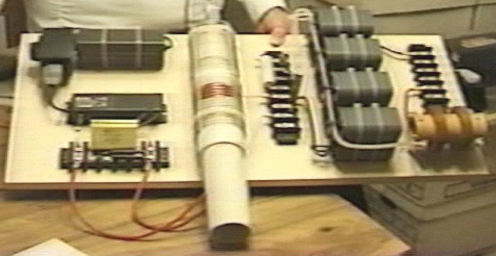

Without his description of the device, it would be difficult to understand it's construction and method of operation. Don's description appears to be for a somewhat simplified version. As I understand it, the circuit of what is mounted on this board is as shown here:

没有他的说明，将很难理解其构造和运行方法。以我的理解，在这块基板上的电路如下所示：

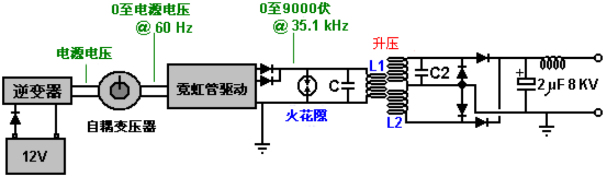

This arrangement has bothered some readers recently as they feel that the spark gap
should be in series with the L1 coil, like this:

这项配置近来很困扰了一些读者，他们觉得火花间隙应当与L1线圈串联，就像这样：

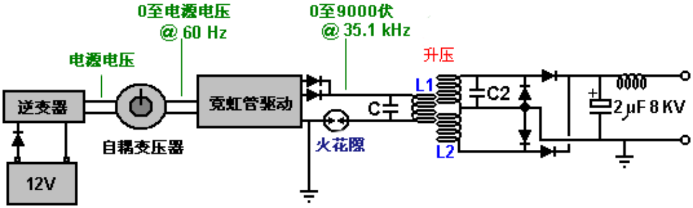

This is understandable, as there is always a tendency to think of the spark gap as
being a device which is there to protect against excessive voltages rather than seeing
it as an active component of the circuit, a component which is in continuous use. In
1925, Hermann Plauston was granted a patent for a whole series of methods for
converting the high voltage produced by a tall aerial system into useable, standard
electricity. Hermann starts off by explaining how high voltage can be converted into a
convenient form and he uses a Wimshurst static electricity generator as an example of
a constant source of high voltage. The output from a rectified Tesla Coil, a Wimshurst
machine and a tall aerial are very much alike, and so Hermann's comments are very
relevant here. He shows it like this:

这是可以理解的，因为人们趋于认为火花隙装置只是为了防止过电压，而不是把它视为电路的一个活性元件，一个不断使用的元件。1925年，赫尔曼·伯劳斯顿（HermannPlauson）因通过一个很高的天线系统把生成的高电压转换成可用的标准电力的全系列方法而被授予专利。赫尔曼以解释高电压如何可以转换为方便的形式开始，然后他用维姆斯赫斯特静电起电机作为高压恒定源的一个实例。来自一个特斯拉线圈整流了的输出，一台维姆斯赫斯特起电机和一个很高的天线是非常相似的，因此赫尔曼的评论在这里是非常有关联的。他的说明如下：

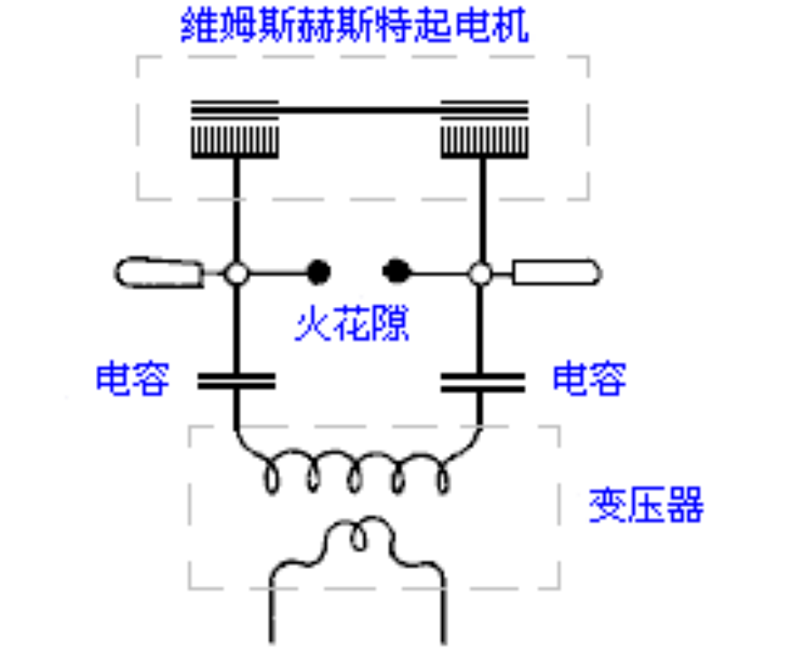

Here, the output of the Wimshurst machine is stored in two high-voltage capacitors
(Leyden jars) causing a very high voltage to be created across those capacitors. When
the voltage is high enough, a spark jumps across the spark gap, causing a massive
surge of current through the primary winding of the transformer, which in his case is a
step-down transformer as he is aimed at getting a lower output voltage. Don's circuit is
almost identical:

这里，维姆斯赫斯特起电机把两个高压电容器(莱登瓶)短路导致跨电容器之间产生了极高的电压。当电压足够高时，火花跳过火花隙，通过变压器的初级绕组产生了大量的电涌，在他的这种情况下，他用了一台降压变压器来达到较低的输出电压的目的。而唐的电路几乎是完全一样的：

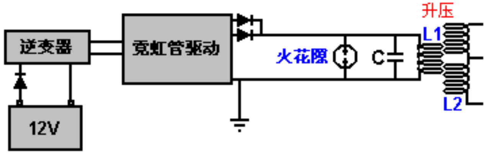

Here the high voltage comes from the battery/inverter/neon-tube driver/rectifiers,
rather than from a mechanically driven Wimshurst machine. He has the same build up
of voltage in a capacitor with a spark gap across the capacitor. The spark gap will fire
when the capacitor voltage reaches its designed level. The only difference is in the
positioning of the capacitor, which if it matched Hermann's arrangement exactly, wouldbe like this:

这里的高压来自电池/逆变器/霓虹管驱动/整流器，而非一台由维姆斯赫斯特起电机驱动的机器。他用跨接电容器的火花隙在电容器里积累了同样的电压。当电容器电压达到其设计电平时，火花隙会打火。唯一不同的是电容器的定位，如果它与赫尔曼的配置精确匹配，就会像这样：

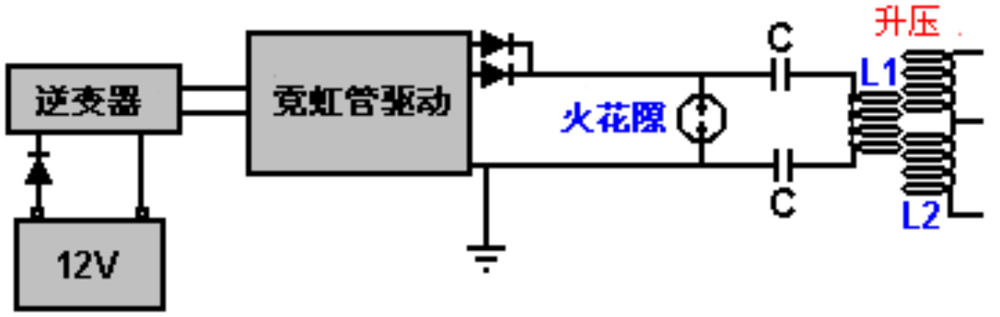

which would be a perfectly viable arrangement as far as I can see. You will remember
that Tesla, who always speaks very highly of the energy released by the very sharp
discharge produced by a spark, shows a high-voltage source feeding a capacitor with
the energy passing through a spark gap to the primary winding of a transformer:

依我之见，这将是完全可行的配置。你会记得特斯拉总是说，由火花产生的极尖锐放电释放出极高的能量，显示了一个高电压源通过火花隙到变压器的初级绕组传递能量来饲给电容器：

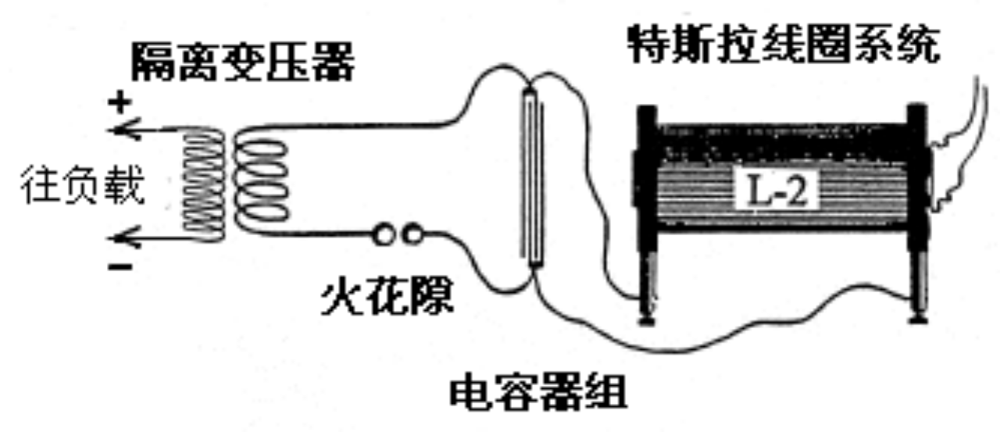

However, with Don's arrangement, it can be a little difficult to see why the capacitor is
not short-circuited by the very low resistance of the few turns of thick wire forming the
L1 coil. Well, it would do that if we were operating with DC, but we are most definitely
not doing that as the output from the neon-tube driver circuit is pulsing 35,000 times
per second. This causes the DC resistance of the L1 coil to be of almost no
consequence and instead, the coil's "impedance" or "reactance" (effectively, it's AC
resistance) is what counts. Actually, the capacitor and the L1 coil being connected
across each other have a combined "reactance" or resistance to pulsing current at this
frequency. This is where the nomograph diagram comes into play, and there is a much
easier to understand version of it a few pages later on in this document. So, because
of the high pulsing frequency, the L1 coil does not short-circuit the capacitor and if the
pulsing frequency matches the resonant frequency of the L1 coil (or a harmonic of that
frequency), then the L1 coil will actually have a very high resistance to current flow
through it. This is how a crystal set radio receiver tunes in a particular radio station,
broadcasting on it's own frequency.

不过，对于唐的配置，有点难以明白为什么电容器不通过几匝粗导线组成的、只有非常低电阻的L1线圈短路。嗯，如果我们在工作中采用直流，就会这么做，但当来自霓虹管驱动电路的输出是每秒35,000次脉冲时，绝对不能这样做。这将导致的L1线圈的直流电阻几乎没有任何结果，而相反，线圈的“阻抗”或“电抗”（有效地，其交流电阻）才是关键。其实，电容和L1线圈的彼此跨接使得这里对这个频率上的脉冲电流有了一个联合的“电抗”或电阻。这里就是列线图发挥作用之处了，而本文的几页后有一个更容易理解的版本。所以，由于脉冲频率高，L1线圈不短路电容器，而如果脉冲频率匹配的L1线圈的共振频率（或该频率的谐波），那么L1线圈将实际上对于电流流过的有电流有一个非常高的电阻。这就是为什么矿石收音机接收器调到一个特定的电台，能在其自身的频率上播放。

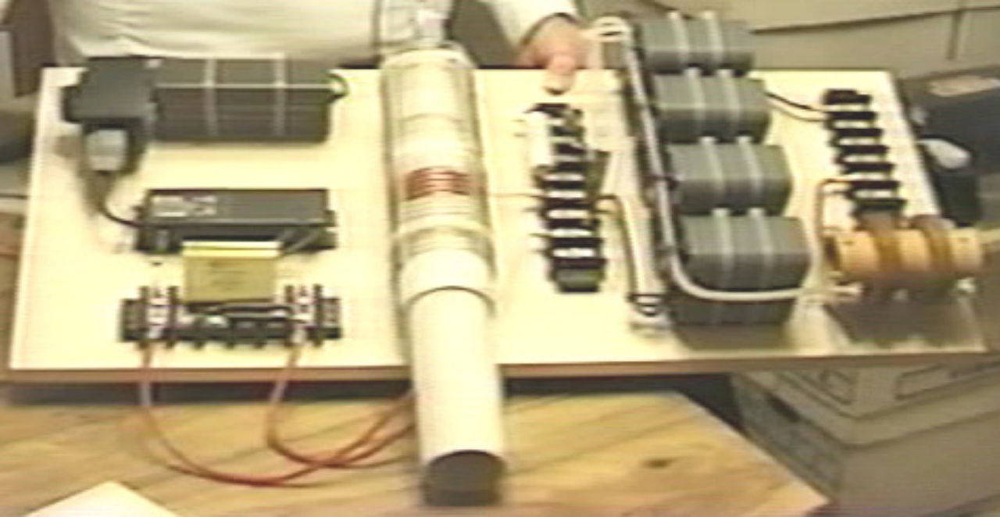

Anyway, coming back to Don's device shown in the photograph above, the electrical
drive is from a 12-volt battery which is not seen in the photograph. Interestingly, Don
remarks that if the length of the wires connecting the battery to the inverter are exactly
one quarter of the wave length of the frequency of the oscillating magnetic field
generated by the circuit, then the current induced in the battery wires will recharge the
battery continuously, even if the battery is supplying power to the circuit at the same
time.

不管怎样，回到上面照片中显示的唐的设备，电驱动来自12伏电池，这在照片里看不到。有趣的是，唐说，如果连接电池到逆变器的导线长度是电路生成的振荡磁场频率波长的确切的四分之一，那么电池导线感应的电流将不断给电池充电，即便同时电池还在为电路提供电源。

The battery supplies a small current through a protecting diode, to a standard off-theshelf "true sine-wave" inverter. An inverter is a device which produces mains-voltage
Alternating Current from a DC battery. As Don wants adjustable voltage, he feeds the
output from the inverter into a variable transformer called a "Variac". This produces an
AC output voltage which is adjustable from zero volts up to the full mains voltage (or a
little higher, though Don does not want, or use, a higher voltage). The Variac is there
so that Don can feed a reduced AC voltage to the next component of his circuit which
is a commercial Neon-tube driver. The use of a Variac makes it essential for the
inverter to be a true sine-wave type as a Variac cannot adjust the voltage of a square
wave which the cheaper inverters generate. As the power requirement of the inverter
is so low, the inverter should not cost very much.

电池提供一个很小的电流通过保护二极管到一个标准的现成的“纯正的正弦波”逆变器。逆变器是一种由直流电池产生电源电压交流电的装置。由于唐要的是可调电压，他把输出从逆变器送入一个称之为“自耦变压器”的可变比变压器，虽然这经常用于作为霓虹驱动电路的一部分，以使用户可以调节霓虹管的亮度。这样的配置产生了一个交流输出电压，是从零伏上到完整的电源电压（或略高，虽然唐并不想要更高的电压）可调的。这种调整的使用通常令其使逆变器成为一个纯正的正弦波型是必不可少的。由于霓虹管驱动电路所需电源是如此之低，逆变器的成本应该不会太高。

The neon-tube (or "gas-discharge" tube) driver circuit is a standard off-the-shelf device
used to drive neon tube displays for commercial establishments. The one used by Don
contains an oscillator and a step-up transformer, which together produce an
Alternating Current of 9,000 volts at a frequency of 35,100 Hz (sometimes written as
35.1 kHz). The term "Hz" stands for "cycles per second". The Variac is there so that
Don can lower that 9,000 volts. He has found that he gets great power output at lower
input voltages. The particular unit which Don is using here, has two separate outputs,
so Don connects them together and uses a blocking diode in each line to prevent
either of them affecting the other one. Not easily seen in the photograph, the highvoltage output line has a very small, encapsulated, spark gap connected between it
and a ground connection. This is to trap any voltage spikes by discharging them and
restricting the output voltage. The device is commonly used as a lightning strike
protection device and in Don's circuit it lights continuously when the device is running.
The component looks like this:

霓虹管驱动电路是一个标准的现成设备，商业机构用于驱动霓虹管显示器。唐用的这一个带有一个振荡器和一个升压器，它们在一起产生一个在35,100Hz（有时记作35.1kHz）的频率上的9,000的交流电。术语“Hz”表示每秒周期数。唐降低了9.000伏特，因为他在较低的输入电压上得到很大的输出功率，而输出电容器的成本是一个重要的因素。唐在这里使用的特殊霓虹管驱动电路，有两个独立的输出互为异相，所以把唐它们连接在一起，并在每条线上使用一个阻塞二极管以预防两者互相影响。在照片中不容易看出来，高电压输出线有一个有非常小的、封装的、气体放电管火花隙，而线还要接地。这个装置看起来像这样：

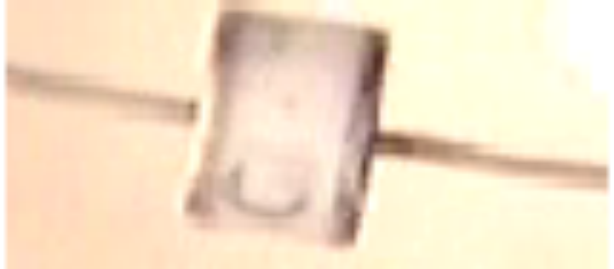

The output of the neon-tube driver circuit is used to drive the primary "L1" winding of a
Tesla Coil style transformer. This looks ever so simple and straightforward, but there
are some subtle details which need to have attention paid to them

请注意：当提到与唐·史密斯的设备有关的接地连接时，我们正在考虑的是一个实际导线连接到一个物体真正埋藏在地下的，不管它是一根长的敲入地下的铜棒，或是一个像卡帕纳泽使用的埋在洞里的旧的车用散热器。托马斯·亨利·莫雷被怀疑论者要求在指定的地点深入到乡村表演他的演示时，组成他的演示的电力负载的灯泡，会随着每敲击作为其地线的燃气管道的一截进入地下，就会发出更加明亮的光芒。

应该注意到，自唐购买了他的霓虹管驱动模块以来，更新的设计已经基本上完全取代了旧的模块，尤其是在欧洲，而这些设计都做成“通地漏泄电流”保护，如果检测到任何电流正在泄漏到地面，它会即刻停用这个电路。此功能使装置完全不适合在唐·史密斯电路中使用，因为在那里在，电流传输到地完全是有意而为之的，而且对电路的运行是至关重要的。

霓虹管驱动电路的输出用来驱动特斯拉线圈风格变压器的初级“L1”绕组。这看起来永远那么简单明了，但也有一些微妙的细节需要考虑。

The operating frequency of 35.1 kHz is set and maintained by the neon-tube driver
circuitry, and so we do not have to do any direct tuning ourselves. That frequency is
imposed on the "L1" coil winding which induces exactly the same frequency on the
"L2" secondary winding. However, we need to pay special attention is the ratio of thewire lengths of the two coil windings..

设定了35.1KHz的工作频率并通过霓虹管驱动电路维持，因此，理论上，我们无需自己做任何直接调整。然而，我们要L1线圈和跨接它的电容的共振频率匹配霓虹驱动电路的频率。“L1”线圈绕组的频率将在“L2”次级绕组中诱导出完全相同的频率。不过，我们需要特别注意两个线圈绕组的线长比，因为我们希望这两个绕组一起共振。大部分特斯拉线圈建造者的经验法则是在线圈L1和L2中有着相同重量的铜，这意味着，线圈L1的导线通常比线圈L2线粗得多。如果L1线圈是L2线圈长度的四分之一，那么我们预计L1线圈的横截面会是L2线圈导线的四倍，因此导线应有两倍的直径（因为面积与半径的平方成正比，而二的平方是四）。

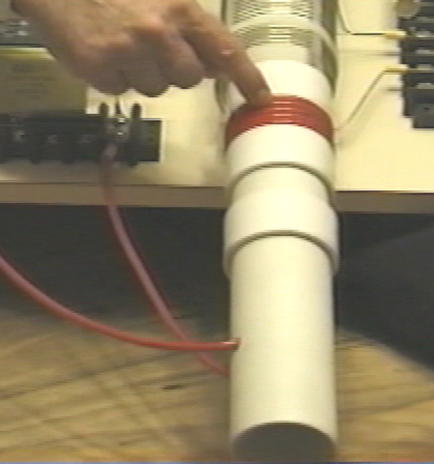

Don uses a plastic tube as the former for his "L1" primary coil winding. As you can see
here, the wire is fed into the former, leaving sufficient clearance to allow the former to
be slid all the way into the outer coil tube. The wire is fed up inside the pipe and out
through another hole to allow the coil turns to be made on the outside of the pipe.
There appear to be five turns, but Don does not always go for a complete number of
turns, so it might be 4.3 turns or some other value. The key point here is that the
length of wire in the "L1" coil turns is exactly one quarter of the length of wire in the
"L2" coil turns.

唐用了一根白色的塑料管材作为他的“L1”初级线圈绕组的线圈架。就像你在这里看到的，导线被送入线圈架，留有足够的余隙以使线圈架可在外层线圈内滑动。导线卷入管内并上行通过另一个孔洞出来，以使线圈的匝可在管子外面绕制。似乎有五匝，但唐并不总是用一个完整的匝数，所以它有可能是4.3匝或其它的匝数。这里的关键点是“L1”线圈匝中导线的长度应该是“L2”线圈匝中线长的精确的四分之一。

The "L2" coil is a commercial 3-inch diameter unit from Barker & Williamson,
constructed from uninsulated, solid, single-strand "tinned" copper wire. Don has taken
this coil and unwound four turns at the centre of the coil in order to make a centre-tap.
He then measured the exact length of wire in the remaining section and made the
length of the "L1" coil turns to be exactly one quarter of that length. The wire used for
the "L1" coil looks like Don's favourite "Jumbo Speaker Wire" which is a very flexible
wire with a very large number of extremely fine uninsulated copper wires inside it.

这里使用的“L2”线圈是极限特工（Barker&Williamson）的一个3英寸直径装置的商品，用非绝缘的实心单股“镀锡”铜线制造（稍后将说明如何自制）。唐采用这种线圈并在线圈中留出四匝不缠绕，以制做中心抽头。他于是量出余下部分中的准确线长，并使“L1”线圈匝的长度为那个长度的精确的四分之一。用于“L1”线圈的线看起来像唐最喜欢的“巨型扬声器导线”，这是一种十足的软花线，里面有着很多的非绝缘纯铜导线。

You will notice that Don has placed a plastic collar on each side of the winding,
matching the thickness of the wire, in order to create a secure sliding operation inside
the outer "L2" pipe coil former, and the additional plastic collars positioned further
along the pipe provide further support for the inner coil. This sliding action allows the
primary coil "L1" to be positioned at any point along the length of the "L2" secondary
coil, and that has a marked effect on the operation of the system.

您会注意到唐在绕组的两侧配合导线的厚度放置了胶领圈，以便在外层“L2”线圈的内面造成一个安全的滑动操作，而附加的胶领圈沿着管子的进一步定位为内层线圈提供了进一步的支撑。这种滑行动作使得初级线圈“L1”可以沿“L2”次级线圈的长度定位在任意点上，而这在系统的操作上具有明显的调整效果。外层“L2”线圈没有任何管座，而相反，线圈的外形是通过实心线的坚硬加上四道槽条来维系的。这种结构风格在无线频率上使得线圈性能得到了最高的可能性。作为特斯拉线圈，“L1”线圈直径小于“L2”线圈是极不寻常的。

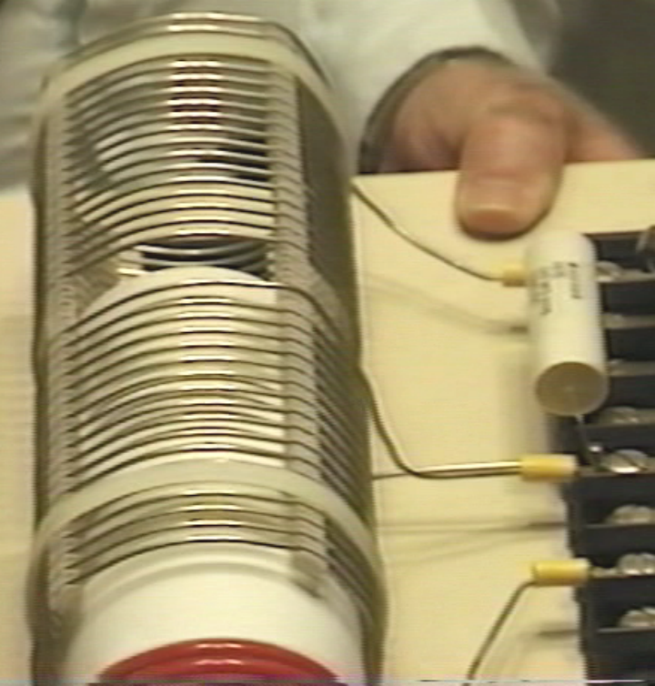

The "L2" coil has two separate sections, each of seventeen turns. One point to note is
that while the coil is placed on a larger diameter transparent tube, the turns are
spaced apart using slotted strips to support the wires and maintain an accurate
spacing between adjacent turns. While the spacing might be to avoid sparking
because of the high voltage generated in this coil, it must be remembered that spacing
coil turns apart like this alters the characteristics of the coil, changing it's main energystoring capability from "inductive" to "capacitive" mode. Every coil has resistance,
inductance and capacitance, but the form of the coil construction has a major effect on
the ratio of these three characteristics. The coil assembly is held in position on the
base board by two off-white plastic cable ties. The nearer half of the coil is effectively
connected across the further half as shown in the circuit diagram above.

“L2”线圈有两个独立的部分，每部分为十七匝。有一点要注意的是线匝是用支撑导线并维系的相邻导线间距的槽条分隔开的。必须记住像这样隔开线圈匝改变了线圈的特性，大幅增加了它的“电容”因素。每个线圈都有电阻、电感和电容，而线圈结构的形式对这三个特性的比例有很大的影响。线圈组由白色塑料带固定定位在基座上。上面显示的电路图中，近处的一半线圈有效地跨接远处的一半线圈。

One point which Don stresses, is that the length of the wire in the "L1" coil and the
length of wire in the "L2" coil, must be an exact even division or multiple of each other
(in this case, the "L2" wire length in each half of the "L2" coil is exactly four times as
long as the "L1" coil wire length). This is likely to cause the "L1" coil to have part of a
turn, due to the different coil diameters. For example, if the length of the "L2" coil wire
is 160 inches and "L1" is to be one quarter of that length, namely, 40 inches. Then, if
the "L1" coil has an effective diameter of 2.25 inches, (allowing for the thickness of the
wire when wound on a 2-inch diameter former), then the "L1" coil would have 5.65 (or
5 and 2/3) turns which causes the finishing turn of "L2" to be 240 degrees further
around the coil former than the start of the first turn - that is, five full turns plus two
thirds of the sixth turn.

唐强调的一点是，“L1”线圈的线长和“L2”线圈的线长必须精确相等或是彼此的倍数（依此，在“L2”线圈的每一半里的“L2”线长是“L1”线圈线长的刚好四倍）。这可能由于线圈的不同直径而导致“L1”线圈只有一匝的一部分。例如，如果“L2”线圈导线的长度是160英寸，而“L1”就要是那个长度的四分之一，即40英寸。那么，如果“L1”线圈有一个2.25英寸的有效直径，(当在2英寸直径的线圈架上绕制时允许用粗的导线)，那么“L1”线圈将有5.65(或5又2/3)匝，这导致“L2”的结束匝在线圈架上的第一匝上还要向前240度——即，五个完整匝加第六匝的三分之二匝。

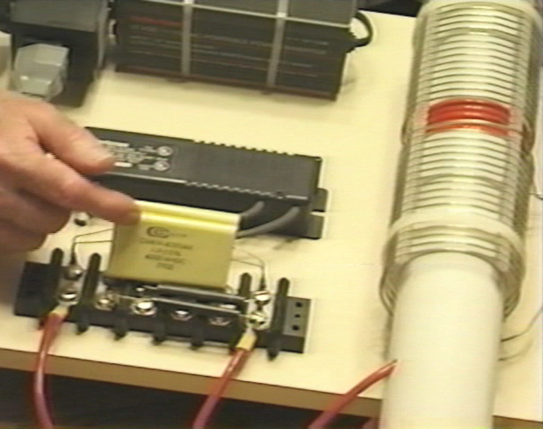

The L1 / L2 coil arrangement is effectively a Tesla Coil. The positioning of the "L1" coil
along the length of the "L2" coil, adjusts the voltage to current ratio produced by the
coil. When the "L1" coil is near the middle of the "L2" coil, then the amplified voltage
and amplified current are roughly the same. The exact wire ratio of these two coils
gives them an almost automatic tuning with each other, and the exact resonance
between them can be achieved by the positioning of the "L1" coil along the length of
the "L2" coil. While this is a perfectly good way of adjusting the circuit, in the build
shown in the photograph, Don has opted to get the exact tuning by connecting a
capacitor across "L1" as marked as "C" in the circuit diagram. Don found that the
appropriate capacitor value was around the 0.1 microfarad (100 nF) mark. It must be
remembered that the voltage across "L1" is very high, so if a capacitor is used in that
position it will need a voltage rating of at least 9,000 volts. Don remarks that the actual
capacitors seen in the photograph of this prototype are rated at fifteen thousand volts,
and were custom made for him using a "self-healing" style of construction. As has
already been remarked, this capacitor is an optional component. Don also opted to
connect a small capacitor across the "L2" coil, also for fine-tuning of the circuit, and
that component is optional and so is not shown on the circuit diagram. As the two
halves of the "L2" coil are effectively connected across each other, it is only necessary
to have one fine-tuning capacitor:

L1/L2线圈配置是一种特斯拉线圈。“L1”线圈沿着“L2”线圈的长度上定位，以调整线圈产生的电压对电流的比率。当“L1”线圈靠近“L2”线圈的中部，则放大的电压和放大的电流大体相同。这两个线圈的确切的导线比使它们几乎自动互相调节，而它们之间的确切共振可以通过“L1”线圈沿“L2”线圈长度的定位来实现。尽管这是一个完美的调节电路的好方法，唐却选择了通过在“L1”上跨接一个在电路图中标注为“C”的电容器来获取精确的调节。唐为他的特定线圈构成找到电容的适当值是在0.1微法(100nF)左右，因此他并联连接两个47nF的高压电容器以获取他要的值。必须记住“L1”的跨压是非常高的，所以如果在那个位置使用一个电容，它至少要有9,000伏的额定电压。唐说在这台原型机的照片里看到的这个实际电容额定为15千伏，而且是专为他客户定制的应用了“自动恢复”型的结构。正如已经指出的，这种电容器是可选件。

唐也选择了在“L2”线圈上跨接一个小的电容器，而在电路图里这个可选件标注为“C2”，唐所用的值为单个的47nF的高压电容，同时作为电路的微调，由于那个元件是可选的。所以没在电路图中显示。由于“L2”线圈的两半彼此有效跨接，所以只需一个微调电容。然而，唐强调，线圈长度的“高”（当直立放置时）控制产生的电压，而线圈“宽”（匝的直径）控制产生的电流。

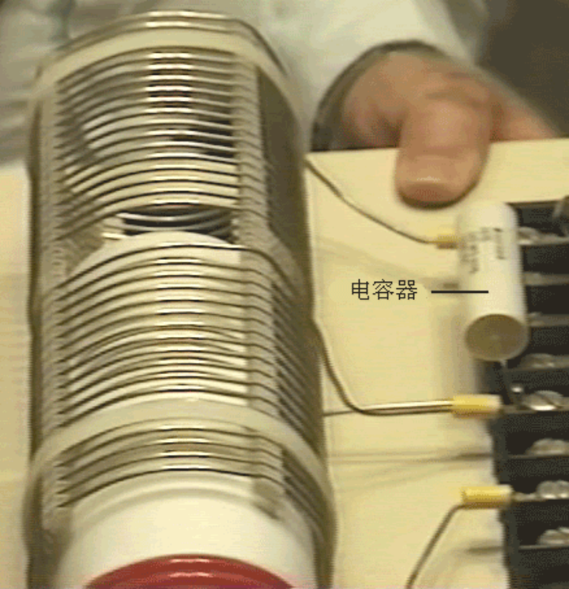

There are various ways of dealing with the output from the "L2" coil in order to get
large amounts of conventional electrical power out of the device. The method shown
here uses the four very large capacitors seen in the photograph. These have an 8,000
or 9,000 volt rating and a large capacity and they are used to store the circuit power as
DC prior to use in the load equipment. This is achieved by feeding the capacitor bank
through a diode which is rated for both high voltage and high current, as Don states
that the device produces 8,000 volts at 20 amps, in which case, this rectifying diode
has to be able to handle that level of power, both at start-up when the capacitor bank
is fully discharged and "L2" is producing 8,000 volts, and when the full load of 20 amps
is being drawn

有各种方法处理“L2”线圈的输出来大量获取设备的传统电功率输出。此处所示的方法使用了4个在照片中看到的非常大的电容器。它们都有着8.000或9.000伏的额定电压和大的容量，而它们被用来存储电路的能量，如在用于负载之前的直流电。这是通过经过一个同样是为额定高压和高强度电流的二极管输送给电容器来实现的，正如唐说的，该设备产生8.000伏特20安培，这样，这个整流二极管具有能够处理这一能级的功率，无论是在电容组完全放电和“L2”产出8.000伏特时，还是在20安培满负荷正在被汲取时。唐所用的实际的二极管额定为25KV，而这远远超出了额定的实际需要。

In passing, it might be remarked that the average home user will not have an electrical
requirement of anything remotely like as large as this, seeing that 10 kW is more than
most people use on a continuous basis, while 8 KV at 20 A is a power of 160 kilowatts.
As the neon-tube driver circuit can put out 9,000 volts and since the L1 / L2 coil
system is a step-up transformer, if the voltage fed to the capacitor bank is to be kept
down to 8,000 volts, then the Variac must be used to reduce the voltage fed to the
neon-tube driver circuit, in order to lower the voltage fed to the L1 / L2 coil pair,
typically, to 3,000 volts.

顺便提一下，也许会说一般家庭用户很少需要那么大的电气设备，看那10千瓦已是超过大多数人持续使用的需要了，而8千伏20安培是是160千瓦的功率。作为霓虹管驱动电路可以发出9,000伏特，而由于L1/L2线圈系统是一个升压变压器，如果送入电容器组的电压保持下到8,000伏，那么自耦变压器的调整必须用于降低送入霓虹管驱动电路的电压，以降低送入L1/L2线圈对的电压，通常为3,000伏。

A very astute and knowledgeable member of the EVGRAY Yahoo EVGRAY forum
whose ID is "silverhealtheu" has recently pointed out that Don Smith says quite freely
that he does not disclose all of the details of his designs, and it is his opinion that a
major item which has not been disclosed is that the diodes in the circuit diagrams
shown here are the wrong way round and that Don operates his voltages in reverse to
the conventional way. In fact, the circuit diagram should be:

EVGRAYYahooEVGRAY论坛上一个非常精明而又知识渊博的成员、其ID是"silverhealtheu"的最近指出，唐·史密斯相当随意地说，他不会透露他的设计的所有细节，而这只是他的看法，即主要的一条没披露的是，显示在这里的电路图中的二极管方向是不对的，而唐操作他的电压是与传统方式相反的。实际上，电路图应该是：

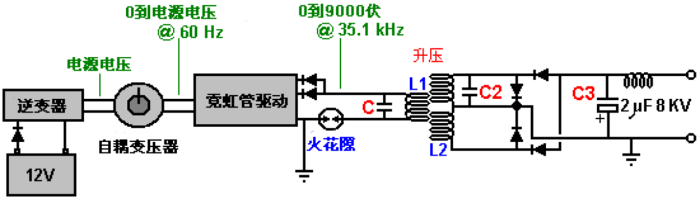

He comments: "the diodes leaving the Neon-tube Driver may need to be reversed as
we want to collect the negative polarity. The spark gap will then operate on ambient
inversion and the spark will look and sound totally different with a much faster crack
and producing very little heat and even becoming covered in frost is possible.

The Variac should be raised up just enough to get a spark going then backed off
slightly. Any higher voltage is liable to make the Neon-tube Driver think that it has a
short-circuit condition, and the new electronic designs will then shut down
automatically and fail to operate at all if this method is not followed.

When running, C, L1 and L2 operate somewhere up in the Radio Frequency band
because the Neon-tube Driver only acts as a tank-circuit exciter. The large collection
capacitor C3, should fill inverted to earth polarity as shown above. The load will then
be pulling electrons from the earth as the cap is REFILLED back to ZERO rather than
the joules in the capacitor being depleted.

Also remember that the Back-EMF systems of John Bedini and others, create a small
positive pulse but they collect a super large NEGATIVE polarity spike which shoots off
the bottom of an oscilloscope display. This is what we want, plenty of this stored in
capacitors, and then let the ambient background energy supply the current when it
makes the correction."

This is a very important point and it may well make a really major difference to the
performance of a device of this nature.

他评论说："二极管由霓虹管驱动离去可能需要反转，因为我们要收集的是负的极性。火花隙便会对环境产生反转作用，而火花会看起来和听起来完全不同，有一种快得多的劈啪声，而产生的热非常少，甚至可能变得被霜覆盖。

自耦变压器应提高到刚好足以让火花发出后又略有倒退。任何较高的电压很容易使霓虹管驱动器认为那有一个短路状态，而新的电路设计如果不遵循此方法，那么将完全自动关闭，并完全无法运行。

在运行时，C、L1和L2运行到某处会上到无线频带，因为霓虹管驱动器仅起着储能电路激励器的作用。大的收集电容器C3，应如上所示反充地极。负载于是由地汲取电子，因为电容被反充至零，而不是焦耳在电容器里被损耗。

还要记住，约翰贝迪尼和其它的反电动势系统产生了一个小的正脉冲，但它们收集的超大的负极性尖峰，射出到示波器显示屏幕的底部。这是我们所希望的，它们大量储存在电容器中，然后当它修正时，让周围背景的能量供应电流。”

这是非常重要的一点，很可能会使这种性质的设备的性能产生真正的主要的区别。

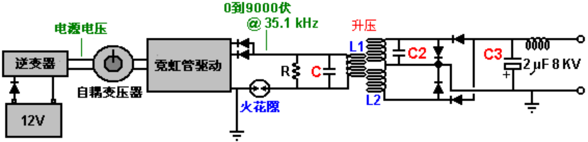

One reader has drawn attention to the fact that Don's main document indicates that
there should be a resistor "R" across the L1 coil as well as the capacitor "C" and he
suggests that the circuit should actually be as shown above with the spark gap in
series with L1 rather than across it - you need to make up your own mind on this.
Another reader points out that the wire in the output choke shown in the photograph
below appears to be wound with wire that is far too small diameter to carry the
currents mentioned by Don. I seems likely that a choke is not needed in that position,but one can easily be wound using more substantial wire.

一位读者提请注意这样一件事，唐的主文档指示应该有一个电阻“R”跨接L1线圈和电容器“C”，而他建议电路实际上应如上所示，想一想唐以前关于他的“手提箱”设计所说过的话。另一名读者指出，在下面所示的这张照片中输出扼流圈似乎是绕制的导线直径太小了，不能运送唐说的电流。似乎在这个位置上并不需要扼流圈，除非要抑制来自电路的可能的无线电频率传输，而用较大直径的导线可以很容易绕制更强大的扼流圈。

When the circuit is running, the storage capacitor bank behaves like an 8,000 volt
battery which never runs down and which can supply 20 amps of current for as long as
you want. The circuitry for producing a 220 volt 50 Hz AC output or a 110 volt 60 Hz
AC output from the storage capacitors is just standard electronics. In passing, one
option for charging the battery is to use the magnetic field caused by drawing mainsfrequency current pulses through the output "choke" coil, shown here:

当电路运行时，存储电容器组的行为像一个8.000伏的电池，永远不会耗尽，而且只要你愿意，它可提供20安培的电流。从存储电容器产生220伏50赫兹交流输出、或110伏60赫兹交流输出的电路只是标准的电子学。顺带一提，给电池充电的一个选项，是通过汲取工频电流脉冲所造成的磁场穿过输出“轭流”线圈，如下示：

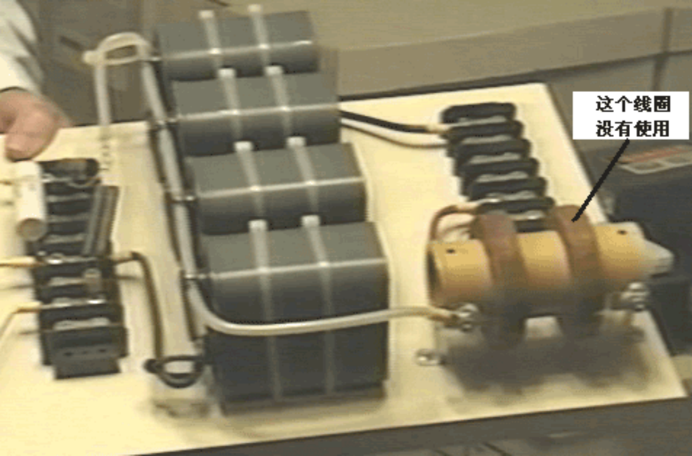

