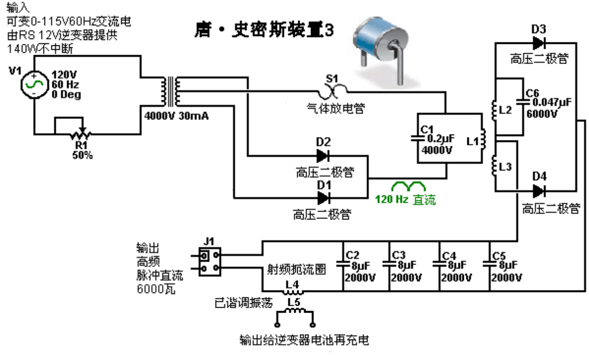

# 设备原理

Don provides quite an amount of information on one of his devices shown here:

唐提供了关于他的在这里显示的一个设备的相当数量的信息：

Without his description of the device, it would be difficult to understand it's construction and method of operation. Don's description appears to be for a somewhat simplified version. As I understand it, the circuit of what is mounted on this board is as shown here:

没有他的说明，将很难理解其构造和运行方法。以我的理解，在这块基板上的电路如下所示：

This arrangement has bothered some readers recently as they feel that the spark gap should be in series with the L1 coil, like this:

这项配置近来很困扰了一些读者，他们觉得火花间隙应当与L1线圈串联，就像这样：

This is understandable, as there is always a tendency to think of the spark gap as being a device which is there to protect against excessive voltages rather than seeing it as an active component of the circuit, a component which is in continuous use. In 1925, Hermann Plauston was granted a patent for a whole series of methods for converting the high voltage produced by a tall aerial system into useable, standard electricity. Hermann starts off by explaining how high voltage can be converted into a convenient form and he uses a Wimshurst static electricity generator as an example of a constant source of high voltage. The output from a rectified Tesla Coil, a Wimshurst machine and a tall aerial are very much alike, and so Hermann's comments are very relevant here. He shows it like this:

这是可以理解的，因为人们趋于认为火花隙装置只是为了防止过电压，而不是把它视为电路的一个活性元件，一个不断使用的元件。1925年，赫尔曼·伯劳斯顿（HermannPlauson）因通过一个很高的天线系统把生成的高电压转换成可用的标准电力的全系列方法而被授予专利。赫尔曼以解释高电压如何可以转换为方便的形式开始，然后他用维姆斯赫斯特静电起电机作为高压恒定源的一个实例。来自一个特斯拉线圈整流了的输出，一台维姆斯赫斯特起电机和一个很高的天线是非常相似的，因此赫尔曼的评论在这里是非常有关联的。他的说明如下：

Here, the output of the Wimshurst machine is stored in two high-voltage capacitors (Leyden jars) causing a very high voltage to be created across those capacitors. When the voltage is high enough, a spark jumps across the spark gap, causing a massive surge of current through the primary winding of the transformer, which in his case is a step-down transformer as he is aimed at getting a lower output voltage. Don's circuit is almost identical:

这里，维姆斯赫斯特起电机把两个高压电容器(莱登瓶)短路导致跨电容器之间产生了极高的电压。当电压足够高时，火花跳过火花隙，通过变压器的初级绕组产生了大量的电涌，在他的这种情况下，他用了一台降压变压器来达到较低的输出电压的目的。而唐的电路几乎是完全一样的：

Here the high voltage comes from the battery/inverter/neon-tube driver/rectifiers, rather than from a mechanically driven Wimshurst machine. He has the same build up of voltage in a capacitor with a spark gap across the capacitor. The spark gap will fire when the capacitor voltage reaches its designed level. The only difference is in the positioning of the capacitor, which if it matched Hermann's arrangement exactly, wouldbe like this:

这里的高压来自电池/逆变器/霓虹管驱动/整流器，而非一台由维姆斯赫斯特起电机驱动的机器。他用跨接电容器的火花隙在电容器里积累了同样的电压。当电容器电压达到其设计电平时，火花隙会打火。唯一不同的是电容器的定位，如果它与赫尔曼的配置精确匹配，就会像这样：

which would be a perfectly viable arrangement as far as I can see. You will remember that Tesla, who always speaks very highly of the energy released by the very sharp discharge produced by a spark, shows a high-voltage source feeding a capacitor with the energy passing through a spark gap to the primary winding of a transformer:

依我之见，这将是完全可行的配置。你会记得特斯拉总是说，由火花产生的极尖锐放电释放出极高的能量，显示了一个高电压源通过火花隙到变压器的初级绕组传递能量来饲给电容器：

However, with Don's arrangement, it can be a little difficult to see why the capacitor is not short-circuited by the very low resistance of the few turns of thick wire forming the L1 coil. Well, it would do that if we were operating with DC, but we are most definitely not doing that as the output from the neon-tube driver circuit is pulsing 35,000 times per second. This causes the DC resistance of the L1 coil to be of almost no consequence and instead, the coil's "impedance" or "reactance" (effectively, it's AC resistance) is what counts. Actually, the capacitor and the L1 coil being connected across each other have a combined "reactance" or resistance to pulsing current at this frequency. This is where the nomograph diagram comes into play, and there is a much easier to understand version of it a few pages later on in this document. So, because of the high pulsing frequency, the L1 coil does not short-circuit the capacitor and if the pulsing frequency matches the resonant frequency of the L1 coil (or a harmonic of that frequency), then the L1 coil will actually have a very high resistance to current flow through it. This is how a crystal set radio receiver tunes in a particular radio station, broadcasting on it's own frequency.

不过，对于唐的配置，有点难以明白为什么电容器不通过几匝粗导线组成的、只有非常低电阻的L1线圈短路。嗯，如果我们在工作中采用直流，就会这么做，但当来自霓虹管驱动电路的输出是每秒35,000次脉冲时，绝对不能这样做。这将导致的L1线圈的直流电阻几乎没有任何结果，而相反，线圈的“阻抗”或“电抗”（有效地，其交流电阻）才是关键。其实，电容和L1线圈的彼此跨接使得这里对这个频率上的脉冲电流有了一个联合的“电抗”或电阻。这里就是列线图发挥作用之处了，而本文的几页后有一个更容易理解的版本。所以，由于脉冲频率高，L1线圈不短路电容器，而如果脉冲频率匹配的L1线圈的共振频率（或该频率的谐波），那么L1线圈将实际上对于电流流过的有电流有一个非常高的电阻。这就是为什么矿石收音机接收器调到一个特定的电台，能在其自身的频率上播放。

Anyway, coming back to Don's device shown in the photograph above, the electrical drive is from a 12-volt battery which is not seen in the photograph. Interestingly, Don remarks that if the length of the wires connecting the battery to the inverter are exactly one quarter of the wave length of the frequency of the oscillating magnetic field generated by the circuit, then the current induced in the battery wires will recharge the battery continuously, even if the battery is supplying power to the circuit at the same time.

不管怎样，回到上面照片中显示的唐的设备，电驱动来自12伏电池，这在照片里看不到。有趣的是，唐说，如果连接电池到逆变器的导线长度是电路生成的振荡磁场频率波长的确切的四分之一，那么电池导线感应的电流将不断给电池充电，即便同时电池还在为电路提供电源。

The battery supplies a small current through a protecting diode, to a standard off-theshelf "true sine-wave" inverter. An inverter is a device which produces mains-voltage Alternating Current from a DC battery. As Don wants adjustable voltage, he feeds the output from the inverter into a variable transformer called a "Variac". This produces an AC output voltage which is adjustable from zero volts up to the full mains voltage (or a little higher, though Don does not want, or use, a higher voltage). The Variac is there so that Don can feed a reduced AC voltage to the next component of his circuit which is a commercial Neon-tube driver. The use of a Variac makes it essential for the inverter to be a true sine-wave type as a Variac cannot adjust the voltage of a square wave which the cheaper inverters generate. As the power requirement of the inverter is so low, the inverter should not cost very much.

电池提供一个很小的电流通过保护二极管到一个标准的现成的“纯正的正弦波”逆变器。逆变器是一种由直流电池产生电源电压交流电的装置。由于唐要的是可调电压，他把输出从逆变器送入一个称之为“自耦变压器”的可变比变压器，虽然这经常用于作为霓虹驱动电路的一部分，以使用户可以调节霓虹管的亮度。这样的配置产生了一个交流输出电压，是从零伏上到完整的电源电压（或略高，虽然唐并不想要更高的电压）可调的。这种调整的使用通常令其使逆变器成为一个纯正的正弦波型是必不可少的。由于霓虹管驱动电路所需电源是如此之低，逆变器的成本应该不会太高。

The neon-tube (or "gas-discharge" tube) driver circuit is a standard off-the-shelf device used to drive neon tube displays for commercial establishments. The one used by Don contains an oscillator and a step-up transformer, which together produce an Alternating Current of 9,000 volts at a frequency of 35,100 Hz (sometimes written as 35.1 kHz). The term "Hz" stands for "cycles per second". The Variac is there so that Don can lower that 9,000 volts. He has found that he gets great power output at lower input voltages. The particular unit which Don is using here, has two separate outputs, so Don connects them together and uses a blocking diode in each line to prevent either of them affecting the other one. Not easily seen in the photograph, the highvoltage output line has a very small, encapsulated, spark gap connected between it and a ground connection. This is to trap any voltage spikes by discharging them and restricting the output voltage. The device is commonly used as a lightning strike protection device and in Don's circuit it lights continuously when the device is running.  The component looks like this:

霓虹管驱动电路是一个标准的现成设备，商业机构用于驱动霓虹管显示器。唐用的这一个带有一个振荡器和一个升压器，它们在一起产生一个在35,100Hz（有时记作35.1kHz）的频率上的9,000的交流电。术语“Hz”表示每秒周期数。唐降低了9.000伏特，因为他在较低的输入电压上得到很大的输出功率，而输出电容器的成本是一个重要的因素。唐在这里使用的特殊霓虹管驱动电路，有两个独立的输出互为异相，所以把唐它们连接在一起，并在每条线上使用一个阻塞二极管以预防两者互相影响。在照片中不容易看出来，高电压输出线有一个有非常小的、封装的、气体放电管火花隙，而线还要接地。这个装置看起来像这样：

The output of the neon-tube driver circuit is used to drive the primary "L1" winding of a Tesla Coil style transformer. This looks ever so simple and straightforward, but there are some subtle details which need to have attention paid to them

请注意：当提到与唐·史密斯的设备有关的接地连接时，我们正在考虑的是一个实际导线连接到一个物体真正埋藏在地下的，不管它是一根长的敲入地下的铜棒，或是一个像卡帕纳泽使用的埋在洞里的旧的车用散热器。托马斯·亨利·莫雷被怀疑论者要求在指定的地点深入到乡村表演他的演示时，组成他的演示的电力负载的灯泡，会随着每敲击作为其地线的燃气管道的一截进入地下，就会发出更加明亮的光芒。

应该注意到，自唐购买了他的霓虹管驱动模块以来，更新的设计已经基本上完全取代了旧的模块，尤其是在欧洲，而这些设计都做成“通地漏泄电流”保护，如果检测到任何电流正在泄漏到地面，它会即刻停用这个电路。此功能使装置完全不适合在唐·史密斯电路中使用，因为在那里在，电流传输到地完全是有意而为之的，而且对电路的运行是至关重要的。

霓虹管驱动电路的输出用来驱动特斯拉线圈风格变压器的初级“L1”绕组。这看起来永远那么简单明了，但也有一些微妙的细节需要考虑。

The operating frequency of 35.1 kHz is set and maintained by the neon-tube driver circuitry, and so we do not have to do any direct tuning ourselves. That frequency is imposed on the "L1" coil winding which induces exactly the same frequency on the "L2" secondary winding. However, we need to pay special attention is the ratio of thewire lengths of the two coil windings..

设定了35.1KHz的工作频率并通过霓虹管驱动电路维持，因此，理论上，我们无需自己做任何直接调整。然而，我们要L1线圈和跨接它的电容的共振频率匹配霓虹驱动电路的频率。“L1”线圈绕组的频率将在“L2”次级绕组中诱导出完全相同的频率。不过，我们需要特别注意两个线圈绕组的线长比，因为我们希望这两个绕组一起共振。大部分特斯拉线圈建造者的经验法则是在线圈L1和L2中有着相同重量的铜，这意味着，线圈L1的导线通常比线圈L2线粗得多。如果L1线圈是L2线圈长度的四分之一，那么我们预计L1线圈的横截面会是L2线圈导线的四倍，因此导线应有两倍的直径（因为面积与半径的平方成正比，而二的平方是四）。

Don uses a plastic tube as the former for his "L1" primary coil winding. As you can see here, the wire is fed into the former, leaving sufficient clearance to allow the former to be slid all the way into the outer coil tube. The wire is fed up inside the pipe and out through another hole to allow the coil turns to be made on the outside of the pipe.  There appear to be five turns, but Don does not always go for a complete number of turns, so it might be 4.3 turns or some other value. The key point here is that the length of wire in the "L1" coil turns is exactly one quarter of the length of wire in the "L2" coil turns.

唐用了一根白色的塑料管材作为他的“L1”初级线圈绕组的线圈架。就像你在这里看到的，导线被送入线圈架，留有足够的余隙以使线圈架可在外层线圈内滑动。导线卷入管内并上行通过另一个孔洞出来，以使线圈的匝可在管子外面绕制。似乎有五匝，但唐并不总是用一个完整的匝数，所以它有可能是4.3匝或其它的匝数。这里的关键点是“L1”线圈匝中导线的长度应该是“L2”线圈匝中线长的精确的四分之一。

The "L2" coil is a commercial 3-inch diameter unit from Barker & Williamson, constructed from uninsulated, solid, single-strand "tinned" copper wire. Don has taken this coil and unwound four turns at the centre of the coil in order to make a centre-tap.  He then measured the exact length of wire in the remaining section and made the length of the "L1" coil turns to be exactly one quarter of that length. The wire used for the "L1" coil looks like Don's favourite "Jumbo Speaker Wire" which is a very flexible wire with a very large number of extremely fine uninsulated copper wires inside it.

这里使用的“L2”线圈是极限特工（Barker&Williamson）的一个3英寸直径装置的商品，用非绝缘的实心单股“镀锡”铜线制造（稍后将说明如何自制）。唐采用这种线圈并在线圈中留出四匝不缠绕，以制做中心抽头。他于是量出余下部分中的准确线长，并使“L1”线圈匝的长度为那个长度的精确的四分之一。用于“L1”线圈的线看起来像唐最喜欢的“巨型扬声器导线”，这是一种十足的软花线，里面有着很多的非绝缘纯铜导线。

You will notice that Don has placed a plastic collar on each side of the winding, matching the thickness of the wire, in order to create a secure sliding operation inside the outer "L2" pipe coil former, and the additional plastic collars positioned further along the pipe provide further support for the inner coil. This sliding action allows the primary coil "L1" to be positioned at any point along the length of the "L2" secondary coil, and that has a marked effect on the operation of the system.

您会注意到唐在绕组的两侧配合导线的厚度放置了胶领圈，以便在外层“L2”线圈的内面造成一个安全的滑动操作，而附加的胶领圈沿着管子的进一步定位为内层线圈提供了进一步的支撑。这种滑行动作使得初级线圈“L1”可以沿“L2”次级线圈的长度定位在任意点上，而这在系统的操作上具有明显的调整效果。外层“L2”线圈没有任何管座，而相反，线圈的外形是通过实心线的坚硬加上四道槽条来维系的。这种结构风格在无线频率上使得线圈性能得到了最高的可能性。作为特斯拉线圈，“L1”线圈直径小于“L2”线圈是极不寻常的。

The "L2" coil has two separate sections, each of seventeen turns. One point to note is that while the coil is placed on a larger diameter transparent tube, the turns are spaced apart using slotted strips to support the wires and maintain an accurate spacing between adjacent turns. While the spacing might be to avoid sparking because of the high voltage generated in this coil, it must be remembered that spacing coil turns apart like this alters the characteristics of the coil, changing it's main energystoring capability from "inductive" to "capacitive" mode. Every coil has resistance, inductance and capacitance, but the form of the coil construction has a major effect on the ratio of these three characteristics. The coil assembly is held in position on the base board by two off-white plastic cable ties. The nearer half of the coil is effectively connected across the further half as shown in the circuit diagram above.

“L2”线圈有两个独立的部分，每部分为十七匝。有一点要注意的是线匝是用支撑导线并维系的相邻导线间距的槽条分隔开的。必须记住像这样隔开线圈匝改变了线圈的特性，大幅增加了它的“电容”因素。每个线圈都有电阻、电感和电容，而线圈结构的形式对这三个特性的比例有很大的影响。线圈组由白色塑料带固定定位在基座上。上面显示的电路图中，近处的一半线圈有效地跨接远处的一半线圈。

One point which Don stresses, is that the length of the wire in the "L1" coil and the length of wire in the "L2" coil, must be an exact even division or multiple of each other (in this case, the "L2" wire length in each half of the "L2" coil is exactly four times as long as the "L1" coil wire length). This is likely to cause the "L1" coil to have part of a turn, due to the different coil diameters. For example, if the length of the "L2" coil wire is 160 inches and "L1" is to be one quarter of that length, namely, 40 inches. Then, if the "L1" coil has an effective diameter of 2.25 inches, (allowing for the thickness of the wire when wound on a 2-inch diameter former), then the "L1" coil would have 5.65 (or 5 and 2/3) turns which causes the finishing turn of "L2" to be 240 degrees further around the coil former than the start of the first turn - that is, five full turns plus two thirds of the sixth turn.

唐强调的一点是，“L1”线圈的线长和“L2”线圈的线长必须精确相等或是彼此的倍数（依此，在“L2”线圈的每一半里的“L2”线长是“L1”线圈线长的刚好四倍）。这可能由于线圈的不同直径而导致“L1”线圈只有一匝的一部分。例如，如果“L2”线圈导线的长度是160英寸，而“L1”就要是那个长度的四分之一，即40英寸。那么，如果“L1”线圈有一个2.25英寸的有效直径，(当在2英寸直径的线圈架上绕制时允许用粗的导线)，那么“L1”线圈将有5.65(或5又2/3)匝，这导致“L2”的结束匝在线圈架上的第一匝上还要向前240度——即，五个完整匝加第六匝的三分之二匝。

The L1 / L2 coil arrangement is effectively a Tesla Coil. The positioning of the "L1" coil along the length of the "L2" coil, adjusts the voltage to current ratio produced by the coil. When the "L1" coil is near the middle of the "L2" coil, then the amplified voltage and amplified current are roughly the same. The exact wire ratio of these two coils gives them an almost automatic tuning with each other, and the exact resonance between them can be achieved by the positioning of the "L1" coil along the length of the "L2" coil. While this is a perfectly good way of adjusting the circuit, in the build shown in the photograph, Don has opted to get the exact tuning by connecting a capacitor across "L1" as marked as "C" in the circuit diagram. Don found that the appropriate capacitor value was around the 0.1 microfarad (100 nF) mark. It must be remembered that the voltage across "L1" is very high, so if a capacitor is used in that position it will need a voltage rating of at least 9,000 volts. Don remarks that the actual capacitors seen in the photograph of this prototype are rated at fifteen thousand volts, and were custom made for him using a "self-healing" style of construction. As has already been remarked, this capacitor is an optional component. Don also opted to connect a small capacitor across the "L2" coil, also for fine-tuning of the circuit, and that component is optional and so is not shown on the circuit diagram. As the two halves of the "L2" coil are effectively connected across each other, it is only necessary to have one fine-tuning capacitor:

L1/L2线圈配置是一种特斯拉线圈。“L1”线圈沿着“L2”线圈的长度上定位，以调整线圈产生的电压对电流的比率。当“L1”线圈靠近“L2”线圈的中部，则放大的电压和放大的电流大体相同。这两个线圈的确切的导线比使它们几乎自动互相调节，而它们之间的确切共振可以通过“L1”线圈沿“L2”线圈长度的定位来实现。尽管这是一个完美的调节电路的好方法，唐却选择了通过在“L1”上跨接一个在电路图中标注为“C”的电容器来获取精确的调节。唐为他的特定线圈构成找到电容的适当值是在0.1微法(100nF)左右，因此他并联连接两个47nF的高压电容器以获取他要的值。必须记住“L1”的跨压是非常高的，所以如果在那个位置使用一个电容，它至少要有9,000伏的额定电压。唐说在这台原型机的照片里看到的这个实际电容额定为15千伏，而且是专为他客户定制的应用了“自动恢复”型的结构。正如已经指出的，这种电容器是可选件。

唐也选择了在“L2”线圈上跨接一个小的电容器，而在电路图里这个可选件标注为“C2”，唐所用的值为单个的47nF的高压电容，同时作为电路的微调，由于那个元件是可选的。所以没在电路图中显示。由于“L2”线圈的两半彼此有效跨接，所以只需一个微调电容。然而，唐强调，线圈长度的“高”（当直立放置时）控制产生的电压，而线圈“宽”（匝的直径）控制产生的电流。

There are various ways of dealing with the output from the "L2" coil in order to get large amounts of conventional electrical power out of the device. The method shown here uses the four very large capacitors seen in the photograph. These have an 8,000 or 9,000 volt rating and a large capacity and they are used to store the circuit power as DC prior to use in the load equipment. This is achieved by feeding the capacitor bank through a diode which is rated for both high voltage and high current, as Don states that the device produces 8,000 volts at 20 amps, in which case, this rectifying diode has to be able to handle that level of power, both at start-up when the capacitor bank is fully discharged and "L2" is producing 8,000 volts, and when the full load of 20 amps is being drawn

有各种方法处理“L2”线圈的输出来大量获取设备的传统电功率输出。此处所示的方法使用了4个在照片中看到的非常大的电容器。它们都有着8.000或9.000伏的额定电压和大的容量，而它们被用来存储电路的能量，如在用于负载之前的直流电。这是通过经过一个同样是为额定高压和高强度电流的二极管输送给电容器来实现的，正如唐说的，该设备产生8.000伏特20安培，这样，这个整流二极管具有能够处理这一能级的功率，无论是在电容组完全放电和“L2”产出8.000伏特时，还是在20安培满负荷正在被汲取时。唐所用的实际的二极管额定为25KV，而这远远超出了额定的实际需要。

In passing, it might be remarked that the average home user will not have an electrical requirement of anything remotely like as large as this, seeing that 10 kW is more than most people use on a continuous basis, while 8 KV at 20 A is a power of 160 kilowatts.  As the neon-tube driver circuit can put out 9,000 volts and since the L1 / L2 coil system is a step-up transformer, if the voltage fed to the capacitor bank is to be kept down to 8,000 volts, then the Variac must be used to reduce the voltage fed to the neon-tube driver circuit, in order to lower the voltage fed to the L1 / L2 coil pair, typically, to 3,000 volts.

顺便提一下，也许会说一般家庭用户很少需要那么大的电气设备，看那10千瓦已是超过大多数人持续使用的需要了，而8千伏20安培是是160千瓦的功率。作为霓虹管驱动电路可以发出9,000伏特，而由于L1/L2线圈系统是一个升压变压器，如果送入电容器组的电压保持下到8,000伏，那么自耦变压器的调整必须用于降低送入霓虹管驱动电路的电压，以降低送入L1/L2线圈对的电压，通常为3,000伏。

A very astute and knowledgeable member of the EVGRAY Yahoo EVGRAY forum whose ID is "silverhealtheu" has recently pointed out that Don Smith says quite freely that he does not disclose all of the details of his designs, and it is his opinion that a major item which has not been disclosed is that the diodes in the circuit diagrams shown here are the wrong way round and that Don operates his voltages in reverse to the conventional way. In fact, the circuit diagram should be:

EVGRAYYahooEVGRAY论坛上一个非常精明而又知识渊博的成员、其ID是"silverhealtheu"的最近指出，唐·史密斯相当随意地说，他不会透露他的设计的所有细节，而这只是他的看法，即主要的一条没披露的是，显示在这里的电路图中的二极管方向是不对的，而唐操作他的电压是与传统方式相反的。实际上，电路图应该是：

He comments: "the diodes leaving the Neon-tube Driver may need to be reversed as we want to collect the negative polarity. The spark gap will then operate on ambient inversion and the spark will look and sound totally different with a much faster crack and producing very little heat and even becoming covered in frost is possible.

The Variac should be raised up just enough to get a spark going then backed off slightly. Any higher voltage is liable to make the Neon-tube Driver think that it has a short-circuit condition, and the new electronic designs will then shut down automatically and fail to operate at all if this method is not followed.

When running, C, L1 and L2 operate somewhere up in the Radio Frequency band because the Neon-tube Driver only acts as a tank-circuit exciter. The large collection capacitor C3, should fill inverted to earth polarity as shown above. The load will then be pulling electrons from the earth as the cap is REFILLED back to ZERO rather than the joules in the capacitor being depleted.

Also remember that the Back-EMF systems of John Bedini and others, create a small positive pulse but they collect a super large NEGATIVE polarity spike which shoots off the bottom of an oscilloscope display. This is what we want, plenty of this stored in capacitors, and then let the ambient background energy supply the current when it makes the correction."

This is a very important point and it may well make a really major difference to the performance of a device of this nature.

他评论说："二极管由霓虹管驱动离去可能需要反转，因为我们要收集的是负的极性。火花隙便会对环境产生反转作用，而火花会看起来和听起来完全不同，有一种快得多的劈啪声，而产生的热非常少，甚至可能变得被霜覆盖。

自耦变压器应提高到刚好足以让火花发出后又略有倒退。任何较高的电压很容易使霓虹管驱动器认为那有一个短路状态，而新的电路设计如果不遵循此方法，那么将完全自动关闭，并完全无法运行。

在运行时，C、L1和L2运行到某处会上到无线频带，因为霓虹管驱动器仅起着储能电路激励器的作用。大的收集电容器C3，应如上所示反充地极。负载于是由地汲取电子，因为电容被反充至零，而不是焦耳在电容器里被损耗。

还要记住，约翰贝迪尼和其它的反电动势系统产生了一个小的正脉冲，但它们收集的超大的负极性尖峰，射出到示波器显示屏幕的底部。这是我们所希望的，它们大量储存在电容器中，然后当它修正时，让周围背景的能量供应电流。”

这是非常重要的一点，很可能会使这种性质的设备的性能产生真正的主要的区别。

One reader has drawn attention to the fact that Don's main document indicates that there should be a resistor "R" across the L1 coil as well as the capacitor "C" and he suggests that the circuit should actually be as shown above with the spark gap in series with L1 rather than across it - you need to make up your own mind on this.  Another reader points out that the wire in the output choke shown in the photograph below appears to be wound with wire that is far too small diameter to carry the currents mentioned by Don. I seems likely that a choke is not needed in that position,but one can easily be wound using more substantial wire.

一位读者提请注意这样一件事，唐的主文档指示应该有一个电阻“R”跨接L1线圈和电容器“C”，而他建议电路实际上应如上所示，想一想唐以前关于他的“手提箱”设计所说过的话。另一名读者指出，在下面所示的这张照片中输出扼流圈似乎是绕制的导线直径太小了，不能运送唐说的电流。似乎在这个位置上并不需要扼流圈，除非要抑制来自电路的可能的无线电频率传输，而用较大直径的导线可以很容易绕制更强大的扼流圈。

When the circuit is running, the storage capacitor bank behaves like an 8,000 volt battery which never runs down and which can supply 20 amps of current for as long as you want. The circuitry for producing a 220 volt 50 Hz AC output or a 110 volt 60 Hz AC output from the storage capacitors is just standard electronics. In passing, one option for charging the battery is to use the magnetic field caused by drawing mainsfrequency current pulses through the output "choke" coil, shown here:

当电路运行时，存储电容器组的行为像一个8.000伏的电池，永远不会耗尽，而且只要你愿意，它可提供20安培的电流。从存储电容器产生220伏50赫兹交流输出、或110伏60赫兹交流输出的电路只是标准的电子学。顺带一提，给电池充电的一个选项，是通过汲取工频电流脉冲所造成的磁场穿过输出“轭流”线圈，如下示：

The output current flows through the left hand winding on the brown cylindrical former, and when the photograph was taken, the right-hand winding was no longer in use.  Previously, it had been used to provide charging power to the battery by rectifying the electrical power in the coil, caused by the fluctuating magnetic field caused by the pulsing current flowing through the left hand winding, as shown here:

The DC output produced by the four diodes is then used to charge the driving battery, and the power level produced is substantially greater than the minor current drain from the battery. Consequently, it is a sensible precaution to pass this current to the battery via a circuit which prevents the battery voltage rising higher than it should. A simple voltage level sensor can be used to switch off the charging when the battery has reached its optimum level. Simple circuitry of the type shown in chapter 12 can be used for this. So the components on the board being displayed are like this:

四个二极管所产生的直流输出于是用于给驱动电池充电，而生成的功率水平远远多于电池的很小的耗用电流。因此，通过一个电路防止电池电压过高是一个明智的预防措施。一个简单的电压电平传感器可用于当电池已达到其最佳水平时关闭充电。如果需要，其它电池也可以充电。第12章中的简单电路可用于控制和限制充电过程。唐的底座上的元件布局就像这样：

Don draws attention to the fact that the cables used to connect the output of "L2" to the output of the board, connecting the storage capacitors on the way, are very highvoltage rated cables with special multiple coverings to ensure that the cables will remain sound over an indefinite period. It should be remarked at this point, that the outer 3" diameter coil used by Don, is not wound on a former, but in order to get higher performance at high frequencies, the turns are supported with four separate strips physically attached to the turns - the technique described later in this document as being an excellent way for home construction of such coils.

唐要我们注意的一件事是，用电缆连接“L2”输出到板的输出，连接存储电容器的方式是非常高的额定电压的电缆，有多种特殊的外护套，以确保电缆将无限期保持完好。应该注意在这一点上，唐所用的外层3英寸直径的线圈不是绕制在线圈架上的，但为了在更高的频率上获得更高的性能，线匝是用四条独立的、完全贴在匝上的的长条支撑的——本文稍后会说明这种技术，以此作为自制这类经线圈的一个很好的方式。

Please bear in mind that the voltages here and their associated power levels are literally lethal and perfectly capable of killing anyone who handles the device carelessly when it is powered up. When a replication of this device is ready for routine use, it must be encased so that none of the high-voltage connections can be touched by anyone. This is not a suggestion, but it is a mandatory requirement, despite the fact that the components shown in the photographs are laid out in what would be a most dangerous fashion were the circuit to be powered up as it stands. Under no circumstances, construct and test this circuit unless you are already experienced in the use of high-voltage circuits or can be supervised by somebody who is experienced in this field. This is a "one hand in the pocket at all times" type of circuit and it needs to be treated with great care and respect at all times, so be sensible.

请记住，这里的电压及其相关的功率电平确实是致命的，当设备加电时，完全可以杀死任何不小心处理设备的人。当复制一台这样的此设备准备日常使用时，必须封装起来，以避免任何人可以触及高压连接。这不是一个建议，而它是一项强制性的规定，尽管在照片中显示了组件布局，而当电路加电后仍然如此，这就是一个最危险的样式。在任何情况下，除非你已经有经验使用高压电路，或在这一领域有经验的人的监督下，否则不要建造和测试电路。这是一种“永远把一只手插入口袋里”（意为不得乱摸乱碰发生意外）的电路类型，所以必须小心翼翼永远和心怀敬畏，这才是明智的。

The remainder of the circuit is not mounted on the board, possibly because there are various ways in which the required end result can be achieved. The one suggested here is perhaps the most simple solution:

电路的其余部分没有安装在板上，可能是因为要求能够实现多种方法的最终结果。这里有一个建议，也许是最简单的方法：

The voltage has to be dropped, so an iron-cored mains-frequency step-down transformer is used to do this. To get the frequency to the standard mains frequency for the country in which the device is to be used, a mains-frequency oscillator is used to generate that frequency. The oscillator output is used to drive a suitable highvoltage semiconductor device, be it an FET transistor, an IGBT device, or whatever.

要把电压降下来，所以用了一台铁芯工频降压变压器来做这件事。这了获得设备将要使用的所在国家的标准工频频率，用一台振荡器生成该特定工频频率。振荡器输出用于驱动一个适用于高电压的半导体装置，可以是场效应晶体管、绝缘栅双极型晶体管或其它什么的都可以。这个装置要在8000伏切换工作电流，但不可否认，由于较高的电压在变压器的初级绕组上，这将是一个低于末级输出电流至少三十六倍的电流。由于能够处理这种电流的输出变压器非常庞大和昂贵，可用功率将受到限制。

This device has to switch the working current at 8,000 volts, though admittedly, that will be a current which will be at least thirty six times lower than the final output current, due to the higher voltage on the primary winding of the transformer.  As the circuit is capable of picking up additional magnetic pulses, such as those generated by other equipment, nearby lightning strikes, etc. an electronic component called a "varistor" marked "V" in the diagram, is connected across the load. This device acts as a voltage spike suppressor as it short circuits any voltage above its design voltage, protecting the load from power surges.

由于电路能够捡拾额外的磁脉冲，如那些由其它设备所产生的、附近的雷击等等，一个称为“变阻器”的电子元件，图中标注为“V”，被跨接在负载两端。这个装置起着抑制电压尖峰的作用，因为它短路任何高于设计的电压，防止负载的电压浪涌。

Don also explains an even more simple version of the circuit as shown here:

唐还解释了更简单的电路版本，如下所示：

This simplified circuit avoids the need for expensive capacitors and the constraints of their voltage ratings, and the need for electronic control of the output frequency. The wire length in the turns of coil "L2" still needs to be exactly four times the wire length of the turns in coil "L1", but there is only one component which needs to be introduced, and that is the resistor "R" placed across the primary winding of the step-down isolation transformer. This transformer is a laminated iron-core type, suitable for the low mains frequency, but the output from "L2" is at much higher frequency. It is possible to pull the frequency down to suit the step-down transformer by connecting the correct value of resistor "R" across the output transformer (or a coil and resistor, or a coil and a capacitor). The value of resistor needed can be predicted from the American Radio Relay League graph (shown as Fig.44 in Don's .pdf document which can be downloaded free from the www.free-energy-info.com website). The correct value could also be found by experimentation. You will notice that an earthed dual spark gap has been placed across "L2" in order to make sure that the voltage levels always stay within the design range. Don remarks that he intends this particular device to be built by anyone who wants to, providing power for that person's needs and that some two hundred replications have already been built.

这种简化的电路避免了需要昂贵的电容器及其额定电压的系统参数值，也无需输出频率的电子控制。线圈“L2”的匝线长仍然要求是线圈“L1”匝线长的确切的四倍，而只有一个元件需要引入的是电阻器“R”，跨接在降压隔离变压器的初级绕组上。这个变压器是一种叠压铁芯类型，适于低的工频，而从“L2”的输出是高得多的频率。通过连接跨接在输出变压器（或线圈和阻器，或线圈和电容）上的电阻器“R”的正确值，可以把频率拉下来，以适配降压变压器。电阻的所需值可以用美国无线电中继联盟的图表（如唐的pdf文档里的图.44所示，文档可用这个网址下载：http://www.free-energy-info.com/Smith.pdf）。第六版的霍华德·萨姆斯（HowardSams）的《电子表格和公式手册》（ISBN-10:0672224690或ISBN-13:978-0672224690）书中有一个下行到1kHz的表，因此不需要将扩展至这里所使用的频率。还可以通过实验找还到正确的电阻值。您将注意到一个接地的双火花隙被跨接到“L2”线圈，以确保电压电平总是保持在设计范围内。

Don also explains an even more simple version which does not need a Variac, high voltage capacitors or high voltage diodes. Here, a DC output is accepted which means that high-frequency step-down transformer operation can be used. This calls for an aircore transformer which you would wind yourself from heavy duty high voltage wire.  Mains loads would then be powered by using a standard off-the-shelf inverter. In this version, it is of course, necessary to make the "L1" turns wire length exactly one quarter of the "L2" turns wire length in order to make the two coils resonate together.  The operating frequency of each of these coils is imposed on them by the output frequency of the neon-tube driver circuit. That frequency is maintained throughout the entire circuit until it is rectified by the four diodes feeding the low-voltage storage capacitor. The target output voltage will be either just over 12 volts or just over 24 volts, depending on the voltage rating of the inverter which is to be driven by the system. The circuit diagram is:

唐还解释了一个甚至更简单的版本，不需要自耦变压器、高压电容器或高压二极管。这里，直流输出被接受，这意味着可以使用高频降压变压器运行。这就要求空芯变压器，您不得不自己用粗线绕制。主要负荷于是用一个标准的现成的逆变器供电。此版本中，当然，要使“L1”匝线长是“L2”匝线长的准确的四分之一，以令两个线圈一起共振。这些线圈的每一个工作频率通过霓虹管驱动电路的输出频率被强加在它们之上。该频率被保持遍及整个电路，直到它被四个二极管整流送入到低压存储电容器。靶输出电压将刚刚超过12伏或刚刚超过24伏，取决于由系统驱动的逆变器的额定电压。电路图为：

As many people will find the nomograph chart in Don's pdf document very difficult to understand and use, here is an easier version:

很多人会发现唐的pdf文档中的列线图很难理解和使用，下面是一个更容易的版本：

The objective here is to determine the "reactance" or 'AC resistance' in ohms and the way to do that is as follows:

这里的目的是确定单位为欧姆的“电抗”或“交流电阻”，而操作的方法如下：

Suppose that your neon-tube driver is running at 30 kHz and you are using a capacitor of 100 nF (which is the same as 0.1 microfarad) and you want to know what is the AC resistance of your capacitor is at that frequency. Also, what coil inductance would have that same AC resistance. Then the procedure for finding that out is as follows:

假设您的霓虹管驱动正运行在30千赫兹，而且你正在使用一个100皮法的电容器（即0.1微法），你要知道你的电容器在这个频率上的交流电阻是多少。还有，线圈电感在相同的交流电阻时又是多少：

Draw a straight line from your 30 kHz frequency (purple line) through your 100 nanofarad capacitor value and carry the line on as far as the (blue) inductance line as shown above.

画一直线，从你的30千赫兹频率（紫线）穿过你的100纳法电容值，并一起画到（蓝色）电感线的尽头，如上示：

You can now read the reactance ("AC resistance") off the red line, which looks like 51 ohms to me. This means that when the circuit is running at a frequency of 30 kHz, then the current flow through your 100 nF capacitor will be the same as through a 51 ohm resistor. Reading off the blue "Inductance" line that same current flow at that frequency would occur with a coil which has an inductance of 0.28 millihenries.

现在，您可以在红线上读出电抗（“交流电阻”），我看来像是51欧姆。这意味着当电路在30千赫频率上运行时，那么电流流过您的100纳法电容器，就如同通过一个51欧姆的电阻。在蓝色的“电感”线上读出在该频率的同样的电流会在线圈产生0.28毫亨的电感。

我最近收到唐的这个设备的电路图拷贝，如下所示：

这个图里显示的4000V30mA的变压器，可以使用变压器从霓虹管驱动模块升高电压，但它没有提高频率，因为那里明确标明了120赫兹的脉冲直流。

请注意，当与唐·史密斯的设备连接时提到的接地连接，我们正在谈论的是一个实际的导线连接到完全埋在地下的金属物体，不管它是一个被敲入地下的铜棒还是像塔里埃尔·卡帕纳泽那样把一个旧汽车的散热器埋进洞里，或者埋一块金属板。当托马斯·亨利·莫雷被怀疑论者要求深入到乡村，并在他们选择的地点做他的演示时，用一节燃气管作为接地连接，随着锤子敲击管道进入地底的每一下敲击，组成他示范的电力负荷的灯泡会变得越来越亮。

唐还解释了他的主要设备的一种甚至更简单的版本。它无需自耦变压器（可变比电压变压器）或高压电容器。这里，直流输出被接受这意味着可以使用高频降压变压器操作。这需要一个空心（或铁氧体棒芯）变压器，你要用重型电线自己在输出一侧绕制。电源负载的供电将是一个标准的成品逆变器。在这版本里，当然，必须精确地使“L1”匝线长是“L2”匝线长的四分之一，以使两个线圈一起共振。这些线圈的每一个的工作频率都由霓虹管激励电路的输出频率所施加。该频率被维持着遍及整个电路直至被四个二极管伺进低压储能电容所整流。靶输出电压既可以是刚刚超过12伏，也可以是刚刚超过24伏，这取决于由系统驱动的逆变器的额定电压。

由于该电路能够拾取额外的磁脉冲，就象那些由其它设备所生成的，附近的雷击等等。图中标记为“V”的一个电子元件称之为“变阻器”，被跨接着负载。这个装置起着电压尖峰抑制器的作用，因为它短路任何超过设计的电压，保护负载免受电涌伤害。气体放电管可以有效代替变阻器。

这种电路实际上是两个背靠背的特斯拉线圈，而电路图可能是：

绝不能肯定这个电路中蓝色和红色绕组是相反方向绕制的。火花隙（或气体放电管）与第一个变压器的初级串联，以一种有点说不出的方法改变了运行，因为它导致了初级在一个频率上的振荡，这个频率视其电感和其自电容而定，而这可能导致兆赫兹的频率。这个变压器的次级绕组必须与初级共振，而在这个没有频率补偿电容器的电路里，那个振荡是通过次级的确切的匝线长产生的。这看起来像一个简单的电路，但决非如此。过剩能量是由火花产生的提高的频率、提高的电压、和非常尖锐的脉冲而产生的。这部分是简单明了的。电路的其余部分可能是非常难以获得共振，因为它需要去传递过剩能到输出逆变器。

当考虑一个共振线圈里的导线“长度”时，要注意在这些条件下创建的驻波。驻波是由于当它到达导线的末端时的信号的反射，或当导线的直径突然改变，因而在连接中的那个点上改变了信号的反射能力。你应该注意理查德·奎克（RichardQuick）在他的专利的这个部分的非常清楚，这些都包括在本章稍后的部分中。此外，请记住唐·史密斯所说的关于使用手持霓虹灯寻位驻波的事。

唐指出一个重要的事情是电源供应是来自我家墙壁上的插座，而非来自发电站的输电线。相反，电站影响本地的“分站”，而流经我的设备的电荷实际上是来自我的本地环境，因为我的本地分站的影响。因此，如果我能在家里创造一个类似的影响，那么我就不再需要那个分站，获得我想要多少就有多少的电力，无需支付给某个提供电力给我的人什么。实际上，你将看到，这不难做到。

Another device of Don's is particularly attractive in that almost no construction is needed, all of the components being available commercially, and the output power being adaptable to any level which you want. Don particularly likes this circuit because it demonstrates COP>1 so neatly

唐的另一种设备特别有吸引力，因为几乎不需要任何结构，所有组件都可以在市场上买到，输出功率可以适应你想要的任何水平。唐特别喜欢这个电路，因为它非常清晰地展示了COP>1

The coil in the centre of the board is a power transmitter made from a Tesla Coil constructed from two Barker & Williamson ready-made coils. Three more of the inner coil are also used as power receivers. The outer, larger diameter coil is a few turns taken from one of their standard coils and organised so that the coil wire length is one quarter of the coil wire length of the inner coil ("L2").

电路板中心的线圈是一个电力发射器，由两个Barker&Williamson现成线圈组成的特斯拉线圈制成。另外三个内线圈也用作电力接收器。外部较大直径的线圈是从其标准线圈中取几圈，并组织成线圈线长度为内部线圈线圈线长度的四分之一（“L2”）。

As before, a commercial neon-tube driver module is used to power the "L1" outer coil with high voltage and high frequency. It should be understood that as power is drawn from the local environment each time the power driving the transmitter coil "L1" cycles, that the power available is very much higher at higher frequencies. The power at mains frequency of less than 100 Hz is far, far less than the power available at 35,000 Hz, so if faced with the choice of buying a 25 kHz neon-tube driver module or a 35 kHz module, then the 35 kHz module is likely to give a much better output power at every voltage level.

如前所述，商用霓虹灯管驱动模块用于为“L1”外线圈提供高压和高频电源。应该理解的是，由于每次驱动发射器线圈“L1”的功率循环时都会从当地环境中汲取功率，因此在较高频率下可用的功率要高得多。电源频率低于100 Hz时的功率远远低于35000 Hz时的可用功率，因此，如果面临购买25 kHz霓虹灯管驱动模块或35 kHz模块的选择，那么35 kHz模块在每个电压电平下都可能提供更好的输出功率。

The "L1" short outer coil is held in a raised position by the section of white plastic pipe in order to position it correctly relative to the smaller diameter "L2" secondary coil.  Again, it appears to have five turns:

“L1”短外线圈由白色塑料管段固定在凸起位置，以便相对于较小直径的“L2”次级线圈正确定位。再次，它似乎有五匝：

The secondary coils are constructed using Barker & Williamson's normal method of using slotted strips to hold the tinned, solid copper wire turns in place.

次级线圈采用Barker&Williamson的正常方法构造，即使用开槽条将镀锡实心铜线匝固定到位。

As there are very slight differences in the manufactured coils, each one is tuned to the exact transmitter frequency and a miniature neon is used to show when the tuning has been set correctly.

由于制造的线圈存在非常微小的差异，因此每个线圈都被调谐到精确的发射器频率，并使用微型霓虹灯来显示调谐何时设置正确。

The key feature of this device is the fact that any number of receiver coils can be placed near the transmitter and each will receive a full electrical pick up from the local environment, without altering the power needed to drive the Tesla Coil transmitter - more and more output without increasing the input power - unlimited COP values, all of which are over 1. The extra power is flowing in from the local environment where there is almost unlimited amounts of excess energy and that inflow is caused by the rapidly vibrating magnetic field generated by the central Tesla Coil. While the additional coils appear to just be scattered around the base board, this is not the case.  The YouTube video demonstrates that the pick-up of these coils is affected to a major degree by the distance from the radiating magnetic field. This is to do with the wavelength of the signal driving the Tesla Coil, so the coils shown above are all positioned at exactly the same distance from the Tesla Coil. You still can have as many pick-up coils as you want, but they will be mounted in rings around the Tesla Coil and the coils in each ring will be at the same distance from the Tesla Coil in the centre.

该设备的关键特征是，任何数量的接收器线圈都可以放置在发射器附近，每个线圈都可以从当地环境中接收完整的电信号，而不会改变驱动特斯拉线圈发射器所需的功率——在不增加输入功率的情况下输出越来越多——无限的COP值，所有这些值都超过1。额外的能量从当地环境流入，那里几乎有无限量的多余能量，而这种流入是由中心特斯拉线圈产生的快速振动磁场引起的。虽然额外的线圈似乎只是散布在基板周围，但事实并非如此。YouTube视频显示，这些线圈的拾取在很大程度上受到与辐射磁场距离的影响。这与驱动特斯拉线圈的信号波长有关，因此上面显示的线圈都位于与特斯拉线圈完全相同的距离处。您仍然可以拥有任意数量的拾取线圈，但它们将安装在特斯拉线圈周围的环中，每个环中的线圈与中心特斯拉线圈的距离相同。

Each of the pick up coils act exactly the same as the "L2" secondary coil of the Tesla Coil transmitter, each picking up the same level of power. Just as with the actual "L2" coil, each will need an output circuit arrangement as described for the previous device.  Presumably, the coil outputs could be connected in parallel to increase the output amperage, as they are all resonating at the same frequency and in phase with each other. Each will have its own separate output circuit with a step-down isolation transformer and frequency adjustment as before. If any output is to be a rectified DC output, then no frequency adjustment is needed, just rectifier diodes and a smoothing capacitor following the step-down transformer which will need to be an air core or ferrite core type due to the high frequency. High voltage capacitors are very expensive. The web site shows various ways of making your own high-voltage capacitors and the advantages and disadvantages of each type.

每个拾取线圈的作用与特斯拉线圈发射器的“L2”次级线圈完全相同，每个线圈都拾取相同水平的功率。与实际的“L2”线圈一样，每个线圈都需要一个如前一个设备所述的输出电路布置。据推测，线圈输出可以并联连接以增加输出电流，因为它们都以相同的频率和相位相互谐振。每个都有自己的独立输出电路，带有降压隔离变压器和频率调节，如前所述。如果任何输出都是整流直流输出，则不需要频率调整，只需要整流二极管和降压变压器后的平滑电容器，由于频率高，降压变压器需要是空心或铁氧体芯型。高压电容器非常昂贵。该网站展示了制造自己的高压电容器的各种方法以及每种类型的优缺点。

There are two practical points which need to be mentioned. Firstly, as the Don Smith devices shown above feed radio frequency waveforms to coils which transmit thosesignals, it may be necessary to enclose the device in an earthed metal container in order not to transmit illegal radio signals. Secondly, as it can be difficult to obtain highvoltage high-current diodes, they can be constructed from several lower power diodes.  To increase the voltage rating, diodes can be wired in a chain. Suitable diodes are available as repair items for microwave ovens. These typically have about 4,000 volt ratings and can carry a good level of current. As there will be minor manufacturing differences in the diodes, it is good practice to connect a high value resistor (in the 1 to 10 megohm range) across each diode as that ensures that there is a roughly equal voltage drop across each of the diodes:

有两点需要提及。首先，由于上述Don Smith设备将射频波形馈送到传输这些信号的线圈，因此可能需要将设备封闭在接地金属容器中，以避免传输非法无线电信号。其次，由于很难获得高压大电流二极管，它们可以由几个低功率二极管构成。为了提高额定电压，可以将二极管连接成链。合适的二极管可作为微波炉的维修项目。这些通常具有约4000伏的额定电压，可以承载良好的电流水平。由于二极管的制造差异很小，最好在每个二极管上连接一个高值电阻器（在1到10兆欧范围内），以确保每个二极管上的电压降大致相等：

If the diode rating of these diodes were 4 amps at 4,000 volts, then the chain of five could handle 4 amps at 20,000 volts. The current capacity can be increased by connecting two or more chains in parallel.

如果这些二极管的二极管额定值在4000伏时为4安培，那么五个二极管的链在20000伏时可以处理4安培。通过并联连接两个或多个链可以增加电流容量。

Two DVDs containing video recordings of Don Smith's lectures are available for purchase via this website Various questions from readers indicate that the operation of AC circuits is not really understood, so electronics experts can skip this next section.

AC Circuits. This is a lightweight introduction to Alternating Current circuits and pulsed DC circuits for people who have not read Chapter 12 which is an electronics tutorial. Let me say again, that I am mainly self-taught, and so this is just a general introduction based on my present understanding.

Alternating Current, generally called “AC” is called that because the voltage of this type of power supply is not a constant value. A car battery, for instance, is DC and has a fairly constant voltage usually about 12.8 volts when in it’s fully charged state. If you connect a voltmeter across a car battery and watch it, the voltage reading will not change. Minute after minute it says exactly the same because it is a DC source.

If you connect an AC voltmeter across an AC power supply, it too will give a steady reading, but it is telling a lie. The voltage is changing all the time in spite of that steady meter reading. What the meter is doing is assuming that the AC waveform is a sine
wave like this:

and based on that assumption, it displays a voltage reading which is called the “Root Mean Square” or “RMS” value. The main difficulty with a sine wave is that the voltage is below zero volts for exactly the same length of time as it is above zero volts, so if you average it, the result is zero volts, which is not a satisfactory result because youcan get a shock from it and so it can’t be zero volts, no matter what the arithmetical average is.

To get over this problem, the voltage is measured thousands of times per second and the results squared (that is, the value is multiplied by itself) and then those values are averaged. This has the advantage that when the voltage is say, minus 10 volts and you square it, the answer is plus 100 volts. In fact, all of the answers will be positive, which means that you can add them together, average them and get a sensible result.  However, you end up with a value which is far too high because you squared every measurement, and so you need to take the square root of that average (or “mean”) value, and that is where the fancy sounding “Root Mean Square” name comes from – you are taking the (square) root of the (average or) mean value of the squared measurements.

With a sine wave like this, the voltage peaks are 41.4% higher than the RMS value which everyone talks about. This means that if you feed 100 volts AC through a rectifier bridge of four diodes and feed it into a capacitor the capacitor voltage will not be 100 volts DC but instead it will be 141.4 volts DC and you need to remember that when choosing the voltage rating of the capacitor. In that instance I would suggest a capacitor which is made to operate with voltages up to 200 volts.

You probably already knew all of that, but it may not have occurred to you that if you use a standard AC voltmeter on a waveform which is not a sine wave, that the reading on the meter is most unlikely to be correct or anywhere near correct. So, please don’t merrily connect an AC voltmeter across a circuit which is producing sharp voltage spikes like, for instance, one of John Bedini’s battery pulsing circuits, and think that the meter reading means anything (other than meaning that you don’t understand what you are doing).

You will, hopefully, have learned that power in watts is determined by multiplying the current in amps by the voltage in volts. For example, 10 amps of current flowing out of a 12 volt power supply, represents 120 watts of power. Unfortunately, that only holds true for circuits which are operating on DC, or AC circuits which have only resistors in them. The situation changes for AC circuits which have non-resistive components in them.

The circuits of this type which you are likely to come across are circuits which have coils in them, and you need to think about what you are doing when you deal with these types of circuit. For example, consider this circuit:

This is the output section of a prototype which you have just built. The input to theprototype is DC and measures at 12 volts, 2 amps (which is 24 watts). Your AC voltmeter on the output reads 15 volts and your AC ammeter reads 2.5 amps and you are delighted because 15 x 2.5 = 37.5 which looks much bigger than the 24 watts of input power. But, just before you go rushing off to announce on YouTube that you have made a prototype with COP = 1.56 or 156% efficient, you need to consider the real facts.

This is an AC circuit and unless your prototype is producing a perfect sine wave, then the AC voltmeter reading will be meaningless. It is just possible that your AC ammeter is one of the few types that can accurately measure the current no matter what sort of waveform is fed to it, but it is distinctly possible that it will be a digital meter which assesses current by measuring the AC voltage across a resistor in series with the output, and if that is the case, it will probably be assuming a sine wave. The odds are that both readings are wrong, but let’s take the case where we have great meters which are reading the values perfectly correctly. Then the output will be 37.5 watts, won’t it? Well, actually, no it won’t. The reason for this is that the circuit is feeding the transformer winding which is a coil and coils don’t work like that.

The problem is that, unlike a resistor, when you apply a voltage across a coil the coil starts absorbing energy and feeding it into the magnetic field around the coil, so there is a delay before the current reaches it’s maximum value. With DC, this generally doesn’t matter very much, but with AC where the voltage is changing continuously, it matters a great deal. The situation can be as shown in this graph of both voltage and current:

At first, this does not look like any great problem, but it has a very significant effect on the actual power in watts. To get the 37.5 watts output which we were talking about earlier, we multiplied the average voltage level by the average current level. But these two values do not occur at the same time and that has a major effect.

As this can be a little difficult to see, let’s take the peak values rather than the averages as they are easier to see. Let’s say that in our example graph that the voltage peak is 10 volts and the current peak is 3 amps. If this were DC we would multiply them together and say that the power was 30 watts. But with AC, this does not work due to the timing difference:

When the voltage is peaking, the current is nowhere near it’s peak value of 3 amps:

As a result of this, instead of getting our expected peak power at the top of the voltage peak, the actual power in watts is very much lower – less than half of what we were expecting. Not so good, but it gets worse when you look at the situation more closely.  Take a look at what the voltage is when the current crosses the zero line, that is, when the current is zero. The output power is zero when the current is zero but this occurs when the voltage is at a very high value:

The same goes for when the voltage is zero. When the voltage is zero, then the power is also zero, and you will notice that this occurs when the current is at a high value:

The power is not the average current multiplied by the average voltage if there is a coil involved in the circuit – it will be less than that by an amount known as the “power factor” and I’ll leave you to work out why it is called that.

So, how do you determine what the power is? It is done by sampling the voltage and current many times per second and averaging those combined results:

Both the voltage and the current are sampled at the times indicated by the vertical red lines and those figures are used to calculate the actual power level. In this example, only a few samplings are shown, but in practice, a very large number of samples will be taken. The piece of equipment which does this is known as a wattmeter as it measures watts of power. The sampling can be done by windings inside the instrument, resulting in an instrument which can be damaged by overloading without the needle being anywhere near full deflection, or it can be done by digital sampling and mathematical integration. Most digital sampling versions of these meters only operate at high frequencies, typically over 400,000 cycles per second. Both varieties of wattmeter can handle any waveform and not just sine waves.

The power company supplying your home, measures the current and assumes that the full voltage is present during all of the time that the current is being drawn. If you are powering a powerful electric motor from the mains, then this current lag will cost you money as the power company does not take it into account. It is possible to correct the situation by connecting one or more suitable capacitors across the motor to minimise the power loss.

With a coil (fancy name “inductor” symbol “L”), AC operation is very different to DC operation. The coil has a DC resistance which can be measured with the ohms range of a multimeter, but that resistance does not apply when AC is being used as the AC current flow is not determined by the DC resistance of the coil. Because of this, a second term has to be used for the current-controlling factor of the coil, and the term chosen is “impedance” or for people who like to make everything sound unduly complicated “reactance”. I will stick with the term “impedance” as it is clear that it is the feature of the coil which “impedes” AC current flow through the coil.

The impedance of a coil depends on it’s size, shape, method of winding, number of turns and core material. It also depends on the frequency of the AC voltage being applied to it. If the core is made up of iron or steel, usually thin layers of iron which are insulated from each other, then it can only handle low frequencies. You can forget about trying to pass 10,000 cycles per second (“Hz”) through the coil as the core just can’t change it’s magnetic poles fast enough to cope with that frequency. A core of that type is ok for the very low 50 Hz or 60 Hz frequencies used for mains power, which are kept that low so that electric motors can use it.

For higher frequencies, ferrite can be used for a core and that is why some portable radios use ferrite-rod aerials, which are a bar of ferrite with a coil wound on it. For higher frequencies (or higher efficiencies) iron dust encapsulated in epoxy resin is used. An alternative is to not use any core material and that is usually referred to as an “air-core” coil. These are not limited in frequency by the core but they have a very much lower inductance for any given number of turns. The efficiency of the coil iscalled it’s “Q” (for “Quality”) and the higher the Q factor, the better. The resistance of the wire lowers the Q factor.

A coil has inductance, and resistance caused by the wire, and capacitance caused by the turns being near each other. However, having said that, the inductance is normally so much bigger than the other two components that we tend to ignore the other two.  Something which may not be immediately obvious is that the impedance to AC current flow through the coil depends on how fast the voltage is changing. If the AC voltage applied to a coil completes one cycle every ten seconds, then the impedance will be much lower than if the voltage cycles a million times per second.

If you had to guess, you would think that the impedance would increase steadily as the AC frequency increased. In other words, a straight-line graph type of change. That is not the case. Due to a feature called resonance, there is one particular frequency at which the impedance of the coil increases massively. This is used in the tuning method for AM radio receivers. In the very early days when electronic components were hard to come by, variable coils were sometimes used for tuning. We still have variable coils today, generally for handling large currents rather than radio signals, and we call them “rheostats” and some look like this:

These have a coil of wire wound around a hollow former and a slider can be pushed along a bar, connecting the slider to different winds in the coil depending on it’s position along the supporting bar. The terminal connections are then made to the slider and to one end of the coil. The position of the slider effectively changes the number of turns of wire in the part of the coil which is being used in the circuit.  Changing the number of turns in the coil, changes the resonant frequency of that coil.  AC current finds it very, very hard to get through a coil which has the same resonant frequency as the AC current frequency. Because of this, it can be used as a radio signal tuner:

If the coil’s resonant frequency is changed to match that of a local radio station by sliding the contact along the coil, then that particular AC signal frequency from theradio transmitter finds it almost impossible to get through the coil and so it (and only it) diverts through the diode and headphones as it flows from the aerial wire to the earth wire and the radio station is heard in the headphones. If there are other radio signals coming down the aerial wire, then, because they are not at the resonant frequency of the coil, they flow freely through the coil and don’t go through the headphones.

This system was soon changed when variable capacitors became available as they are cheaper to make and they are more compact. So, instead of using a variable coil for tuning the radio signal, a variable capacitor connected across the tuning coil did the same job:

While the circuit diagram above is marked “Tuning capacitor” that is actually quite misleading. Yes, you tune the radio receiver by adjusting the setting of the variable capacitor, but, what the capacitor is doing is altering the resonant frequency of the coil/capacitor combination and it is the resonant frequency of that combination which is doing exactly the same job as the variable coil did on it’s own.

This draws attention to two very important facts concerning coil/capacitor combinations. When a capacitor is placed across a coil “in parallel” as shown in this radio receiver circuit, then the combination has a very high impedance (resistance to AC current flow) at the resonant frequency. But if the capacitor is placed “in series” with the coil, then there is nearly zero impedance at the resonant frequency of the combination:

This may seem like something which practical people would not bother with, after all, who really cares? However, it is a very practical point indeed. Remember that Don Smith often uses an off-the-shelf neon-tube driver module as an easy way to provide a high-voltage, high-frequency AC current source, typically, 6,000 volts at 30,000 Hz. He then feeds that power into a Tesla Coil which is itself, a power amplifier. The arrangement is like this:

People who try to replicate Don’s designs tend to say “I get great sparks at the sparkgap until I connect the L1 coil and then the sparks stop. This circuit can never work because the resistance of the coil is too low”.

If the resonant frequency of the L1 coil does not match the frequency being produced by the neon-tube driver circuit, then the low impedance of the L1 coil at that frequency, will definitely pull the voltage of the neon-tube driver down to a very low value. But if the L1 coil has the same resonant frequency as the driver circuit, then the L1 coil (or the L1 coil/capacitor combination shown on the right, will have a very high resistance to current flow through it and it will work well with the driver circuit. So, no sparks, means that the coil tuning is off. It is the same as tuning a radio receiver, get the tuning wrong and you don’t hear the radio station.

This is very nicely demonstrated using simple torch bulbs and two coils in the YouTube video showing good output for almost no input power: here and while only one resonant pick-up coil is shown, there is the possibility of using many resonant pick-up coils with just the one transmitter.

As it would not be unusual for many readers to feel that there is some "black magic" about the neon-driver circuit used by Don to drive the Tesla Coil section of his circuitry and that if a suitable unit could not be purchased then the circuit could not be reproduced or tested, it seems reasonable to show how it operates and how it can be constructed from scratch:

The circuit itself is made up of an oscillator to convert the 12-volt DC supply into a pulsating current which is then stepped up to a high voltage by a transformer. Here is a circuit which has been used for this:

The supply for the 555 timer chip is protected against spikes and dips by the resistor "R" and the capacitor "C". The 555 timer chip acts as an oscillator or "clock" whose speed is governed by the two 10K resistors feeding the 440 nF capacitor. The step-up transformer is an ordinary (Model T Ford) car coil and the drive power to it is boosted by the IRP9130 FET transistor which is driven by the 555 chip output coming from it's pin 3.

The output from the car coil is rectified by the diode, which needs to have a very high voltage rating as the voltage at this point is now very high. The rectified voltage pulses are stored in a very high-voltage capacitor before being used to drive a Tesla Coil. As a powerful output is wanted, two car coils are used and their outputs combined as shown here:

You will notice that the car coil has only three terminals and the terminal marked "+" is the one with the connection common to both of the coils inside the housing. The coil may look like this:

and the "+" is generally marked on the top beside the terminal with the two internal connections running to it. The circuit described so far is very close to that provided by a neon-tube driver circuit and it is certainly capable of driving a Tesla Coil.

There are several different way of constructing a Tesla Coil. It is not unusual to have several spark gaps connected in a chain. This arrangement is called a "series spark gap" because the spark gaps are connected "in series" which is just a technical way of saying "connected in a row". In the chapter on aerial systems, you will see that Hermann Plauston uses that style of spark gap with the very high voltages which he gets from his powerful aerial systems. One of the possible Tesla Coil designs uses apancake coil as the "L1" coil as shown here:

The connection to the pancake coil is by a moveable clamp and the two coils are tuned to resonance by careful and gradual adjustment of that connection. The series spark gap can be constructed in various ways. The one shown here uses nuts and bolts projecting through two strips of a stiff, non-conducting material:

Tightening the bolts which compress the springs moves the bolt heads closer together and reduces the spark gaps. The electrical connections can be made to the end tags or to any of the intermediate wire connection straps if fewer spark gaps are required in the chain.

Let me remind you again that this is not a toy and very high voltages will be produced.  Also, let me stress again that if you decide to construct anything, then you do so entire on your own responsibility. This document is only provided for information purposes and must not be seen as an encouragement to build any such device nor is any guarantee given that any of the devices described in this eBook will work as described should you decide to attempt to construct a replication prototype of your own.  Generally, it takes skill and patience to achieve success with any free-energy device and Don Smith's devices are some of the most difficult, especially since he admits quite freely that he does not disclose all of the details.

The output capacitor marked "C1" in the circuit diagram above has to be able to handle very high voltages. There are various ways of dealing with this. Don dealt with it by getting very expensive capacitors manufactured by a specialist company. Some home-based constructors have had success using glass beer bottles filled with a salt solution. The outside of the bottles are wrapped in aluminium foil to form one of the contacts of the capacitor and bare wires are looped from deep inside each bottle on to the next one, looping from the inside of one bottle to the inside of the next one, and eventually forming the other contact of the capacitor. While that appears to work well, it is not a very convenient thing to carry around.

One method which has been popular in the past is to use two complete rolls of aluminium foil, sometimes called "baking foil", laying them one flat, covering it with one or more layers of plastic cling film and laying the second roll of foil on top of the plastic.  The three layers are then rolled up to form the capacitor. Obviously, several of these can be connected together in parallel in order to increase the capacitance of the set.  The thicker the plastic, the lower the capacitance but the higher the voltage which can be handled.

The November 1999 issue of Popular Electronics suggests using 33 sheets of the thin aluminium used as a flashing material by house builders. At that time it was supplied in rolls which were ten inches (250 mm) wide, so their design uses 14" (355 mm) lengths of the aluminium. The plastic chosen to separate the plates was polythene sheet 0.062 inch (1.6 mm) thick which is also available from a builders merchants outlet. The plastic is cut to 11 inch (280 mm) by 13 inch (330 mm) and assembly is as follows:

The sandwich stack of sheets is then clamped together between two rigid timber sheets. The tighter that they are clamped, the closer the plates and the higher the capacitance. The electrical connections are made by running a bolt through the projecting ends of the plates. With two thicknesses of plastic sheet and one of aluminium, there should be room for a washer between each pair of plates at each end and that would improve the clamping and the electrical connection. An alternative is to cut a corner off each plate and position them alternatively so that almost no plate area is ineffective.

As Don Smith has demonstrated in one of his video presentations, Nikola Tesla was perfectly correct when he stated that directing the discharge from a Tesla Coil on to a metal plate (or in Don's case, one of the two metal plates of a two-plate capacitor where a plastic sheet separates the plates just as shown above), produces a very powerful current flow onwards through a good earth connection. Obviously, if an electrical load is positioned between the plates and the earth connection, then the load can be powered to a high level of current, giving a very considerable power gain.

Coil Construction: The Barker & Williamson coils used by Don in his constructions are expensive to purchase. Some years ago, in an article in the “QST” amateur radio publication, Robert H. Johns shows how similar (if not superior) coils can be constructed without any great difficulty.

These home-made coils have excellent “Q” Quality factors, some even better than the tinned copper wire coils of Barker & Williamson because the majority of electrical flow is at the surface of the wire and copper is a better conductor of electricity than the silver tinning material. However, the Electrodyne Corporation staff who have worked extensively with free-energy devices, state that tinned copper wire produces three times as much magnetic flux as does copper wire on its own.

The inductance of a coil increases if the turns are close together. The capacitance of a coil decreases if the turns are spread out. A good compromise is to space the turns so that there is a gap between the turns of one wire thickness. A common construction method with Tesla Coil builders is to use nylon fishing line or plastic strimmer cord between the turns to create the gap. The method used by Mr Johns allows for even spacing without using any additional material. The key feature is to use a collapsible former and wind the coil on the former, space the turns out evenly and then clamp them in position with strips of epoxy resin, removing the former when the resin has set and cured.

Mr Johns has difficulty with his epoxy being difficult to keep in place, but when mixed with the West System micro fibres, epoxy can be made any consistency and it can be applied as a stiff paste without any loss of it’s properties. The epoxy is kept from sticking to the former by placing a strip of electrical tape on each side of the former.

I suggest that the plastic pipe used as the coil former is twice the length of the coil to be wound as that allows a good degree of flexing in the former when the coil is being removed. Before the two slots are cut in the plastic pipe, a wooden spreader piece is cut and it’s ends rounded so that it is a push-fit in the pipe. This spreader piece is used to hold the sides of the cut end exactly in position when the wire is being wrapped tightly around the pipe.

Two or more small holes are drilled in the pipe beside where the slots are to be cut.  These holes are used to anchor the ends of the wire by passing them through the hole and bending them. Those ends have to be cut off before the finished coil is slid off the former, but they are very useful while the epoxy is being applied and hardening. The pipe slots are cut to a generous width, typically 10 mm or more.

The technique is then to wedge the wooden spreader piece in the slotted end of the pipe. Then anchor the end of the solid copper wire using the first of the drilled holes.  The wire, which can be bare or insulated, is then wrapped tightly around the former for the required number of turns, and the other end of the wire secured in one of the other drilled holes. It is common practice to make the turns by rotating the former. When the winding is completed, the turns can be spaced out more evenly if necessary, and then a strip of epoxy paste applied all along one side of the coil. When that has hardened, (or immediately if the epoxy paste is stiff enough), the pipe is turned over and a second epoxy strip applied to the opposite side of the coil. A strip of paxolin board or strip-board can be made part of the epoxy strip. Alternatively, an L-shaped plastic mounting bracket or a plastic mounting bolt can be embedded in the epoxy ready for the coil installation later on.

When the epoxy has hardened, typically 24 hours later, the coil ends are snipped off, the spreader piece is tapped out with a dowel and the sides of the pipe pressed inwards to make it easy to slide the finished coil off the former. Larger diameter coils can be wound with small-diameter copper pipe.

The coil inductance can be calculated from:

Inductance in microhenrys $L = d^2n^2 / (18d + 40l)$

Where:

    d is the coil diameter in inches measured from wire centre to wire centre
    n is the number of turns in the coil
    l is coil length in inches (1 inch = 25.4 mm)

Using this equation for working out the number of turns for a given inductance in microhenrys:

