# 唐•史密斯设计之一的实施

这里的目标是确定如何构建一个自供电的自由能发电机，它没有移动部件，制做也不太贵，使用现成零件，而又有着数千瓦的输出。然而，在任何情况下，本文档不应被视为对你或任何其他人的一个鼓励，去实实在在地制做这样一台设备之一。本文档仅仅是提供信息和出于教育的目的，而由于涉及到高电压，应该考虑到这是一台危险的设备，是不适合没有经验的外行制做的。下面的部分只是我的意见，所以不应被作为经过反复测试、技术工作，而是只是一个缺乏经验的作家的意见。

然而，来自几个不同的读者的问题表明，给出一个尝试复制唐•史密斯设备所需的步骤的一个简短、合理地具体说明将是有益的。再一次，本文档不应被视为鼓励你去实实在在地制做这样一台具有高压和潜在危险性的设备之一。这份资料只是旨在帮助您理解我所认为的在这个过程中涉及到的东西。

概括地说，以下步骤用于配置最简单的版本：

1.放弃当地市电电源的极低频率和电压，以有利于超过20,000赫兹（每秒周期），以及有着从350伏到10000伏电压的电源运行。电压越高，可以给出的总输出功率越大，但其付出的使电压再次回落到当地市电电压，以可用于标准电源设备的努力也就更大。

2.这种高频高压被用来创建一个非常急遽的火花系列，用了一个接地的火花隙。每个火花都导致能量从本地环境流入到电路中。这种能量不是标准的电——当电流通过物体时，会使它们发热，而是相反，这种能量流过时会导致物体变冷，所以通常称为“冷”电。使用这种能源是相当棘手的，除非你想要做的只是点亮一串灯泡（用这种能量偶尔能给出不同质量的光）。出乎意料的是，电路现在容纳的能量大大超出了产生火花所需的能量。这是因为有额外的能流从大地、以及从本地环境进入。如果你受过传统训练，并被“封闭的系统”洗过脑，那么这对你来说似乎是不可能的。因此，让我问你一个问题：如果，正如可以显示出来的那样，所有进入变压器初级绕组电流，又从那个绕组返流出来，那么在次级绕组的大量的而又持续的电流是从哪里来的？它们没有一个是来自初级回路，可是次级的数以百万计的电子流却以一种持续流的形式可以无限供应。这些电子到底来自何方？回答是“来自周围的本地环境，它是川流不息的过剩能”，但你的教科书不会喜欢这一事实，因为他们相信变压器电路是一个“封闭的系统”——这可能是在这个宇宙中的任何地方也无法找到的东西。

3.这种高压、高频、高功率的能源需要被转换成与当地市电同样电压和频率的来自墙上插座的热电电源。这是技巧和理解起作用之处。第一步是用降压谐振变压器降低电压和增加可用电流。这听起来高度技术性并且复杂，而看看唐•斯密的昂贵的极限特工线圈，使得整个运作似乎只是为了一个富裕的实验者。情况并非如此，而有效的解决方案可以是廉价的和容易的。在一个单一的步骤中一般不容易获得需要经过全程都能达到的非常高的合适的电压电平，因此，可以使用一个或多个这些谐振变压器来达到靶电压电平。降压变压器的每一步都使可用的电流越来越大。

4.当达到满意的电压时，我们就需要对付很高的频率。最简单的处理方法是利用高速二极管将它转换为脉冲直流，并送入电容器来创建一个必须的永久电池。这种能量饲入到电容器并被转换成传统的“热”电，而一个标准的现成的逆变器可以用来提供当地市电电源的精确的电压和频率。在世界大部分地区，是220伏在每秒50周上。在美国，是110伏在每秒60周上。低成本逆变器通常在12伏或24伏上运行，更常见的12伏设备更便宜。

所以，让我们更仔细地看一看这些步骤的每一步，看看我们是否可以理解所涉及的和我们的选项是什么：

1.我们要产生一个高压、高频、小电流的电源。唐•史密斯展示的是霓虹灯变压器模块。他的模块产生了一个较高的电压，而不是刚好合适，因此他用了一个可变比交流变压器或自耦变压器——因为这是众所周知的——用以降低输入电压，从而降低输出电压。其实不必用自耦变压器，因为我们可以处理更高的电压，或者使用更合适的霓虹灯变压器模块。

不过，使用这种技术，我们有一个问题。自唐买了他的模块以来的数年间，极限特工已经对模块做了重新设计，包括禁用电路有任何电流直接流出接地，而这正是我们所需要的，所以，如果不是所有，至少大部分当前可供应的霓虹灯变压器模块是不适合我们的需求的。不过，据说，如果模块有一个地线，而地线是悬空的，那是防止通地漏泄电路，使得装置可以用于唐•史密斯的电路。个人意见，如果模块被封装在金属外壳里，我不会推荐使用。

这里有一个便宜得多的替代品：http://www.youtube.com/watch?v=RDDRe_4D93Q，它用了一个等离子球电路来产生高频火花。似乎很有可能这些模块之一能够满足我们的需要：

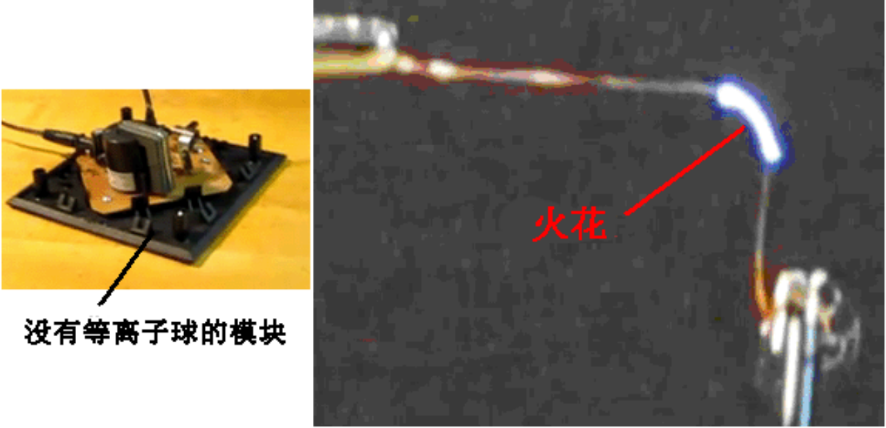

另一种方法是从零开始建立你自己的电源。这样做并不特别难，如果你不懂得任何电子学，那么也许阅读在第12章的初学者电子教程（http://www.free-energy-info.com/Chapter12.pdf）会告诉您所有的对这一类电路的理解（也许还能自己设计）的基本需要。下面是一个自制的可变频的设计：

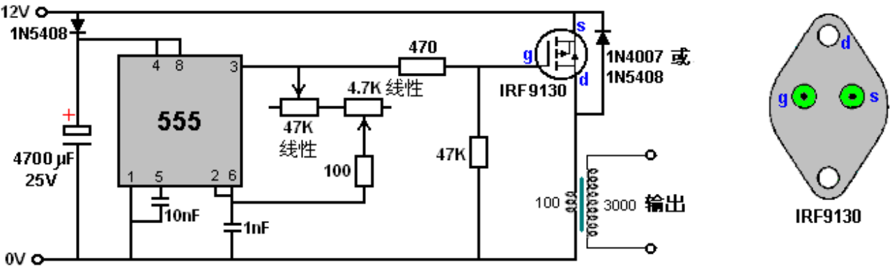

这个电路的一个优点是输出变压器的激励是在555定时器设置的频率下的，而那个频率不受初级绕组的匝线数目的影响，也不受其感应系数、线径或者别的什么有关线圈的影响，因此它更容易设置。尽管这个电路显示了相当昂贵的IRF9130晶体管，我预料有许多其它的P沟道场效应管在这个电路里都能令人满意地工作。IRF9130晶体管看来像这样：

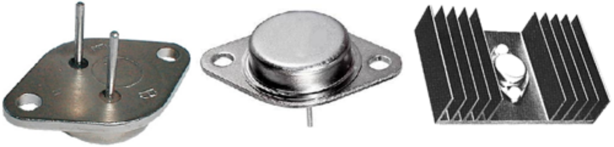

这个电路象原来那样有电源二极管和电容器，如果可能和需要，准备日后从输出接收能量。555电路是标准的，给出50%的占空比。10nF电容器维持555的稳定性，而定时部分由两个可变电阻、一个固定电阻和1nF电容器组成。这个电阻的安排，使电阻值可以从100欧姆到51.8K变化，而这将允许频率的范围非常大。47K(线性)可变电阻控制主要调节，而4.7K(线性)可变电阻使精调频率更容易。100欧姆电阻在这里是以防两个可变电阻均设置为零阻值的情况。输出的饲给是通过一个470欧姆的电阻到一个非常强大的P沟道场效应晶体管的门，它驱动输出变压器的初级绕组。

输出变压器可以绕在绝缘的覆盖着铁氧体棒的线轴上，使绕组之间以及高频操作均有着良好的耦合。由于初级绕组的匝数高，匝数比仅设置为30∶1。用一个12伏的电源，这将给出一个360伏的输出波形，并通过逐步减少初级的匝数，使得输出电压可以在控制步骤中增加。初级用10匝，输出电压应为3,600伏，而只用5匝，则是7,200伏。所用电压越高，以后要使电压降回到我们想要的输出电平的工作量就越大。

看看线的规格表，表明振荡器输出变压器次级绕组可以使用很细的导线直径。虽然这是完全正确的，但并非全部情况。霓虹管驱动器非常小，而其输出绕组线直径事实上也很小。这些驱动器模块是很容易出现故障的。如果在绕组的任何一个匝上的绝缘失效，则一匝就会变成短路，那么就会使绕组停止振荡，那就需要更换。因为对这个项目没有特定的大小限制，为了避免这种绝缘故障的危险，尝试使用0.45毫米或更大的铜漆包线，可能是个不错的主意。变压器线圈轴的任何部分都不应该是金属的，次级绕组的每一线圈匝间的额外的绝缘胶带也不应该有任何损伤。

插板的布局应该是：

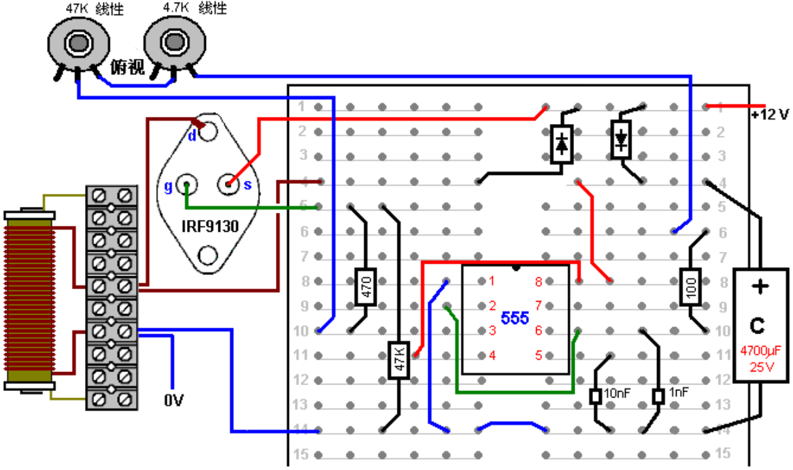

请记住你不能直接把你的伏特计跨接在一个4千伏的电容器上(除非你的确想要再买另外一台)，因为它们只测量大约最多达一千伏的直流电。所以你需要用一个电阻分压器对，并在较低的电阻上测量电压。但你应该用什么样的阻值？如果你把一个10兆欧电阻跨接你的充满了的4kV电容器，电流流过电阻将是0.4毫安。听起来很小，不是吗？但是，0.4mA为1.6瓦，这已经超过电阻能够处理的瓦数。即便用这样的配置：

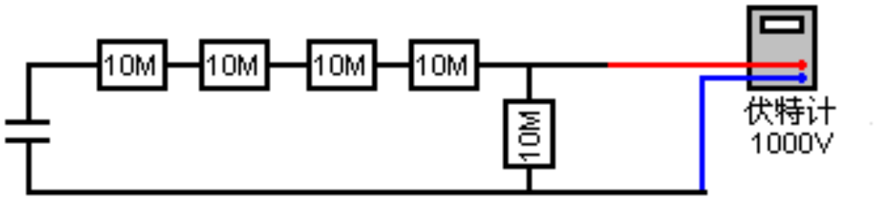

请记住你不能直接把你的伏特计跨接在一个4千伏的电容器上(除非你的确想要再买另外一台)，因为它们只测量大约最多达一千伏的直流电。所以你需要用一个电阻分压器对，并在较低的电阻上测量电压。但你应该用什么样的阻值？如果你把一个10兆欧电阻跨接你的充满了的4kV电容器，电流流过电阻将是0.4毫安。听起来很小，不是吗？但是，0.4mA为1.6瓦，这已经超过电阻能够处理的瓦数。即便用这样的配置：

电流将是0.08mA而每个电阻的瓦特数是64兆瓦。仪表读数将是电容器的大约20%，它将给出800伏的伏特计读数。仪表的入端电阻需要检查及其可能性，考虑到电阻在这个电路中是如此之高（参见第12章）。在测量这种类型时，电容器会放电，电阻链和附带的仪表，于是，也只有这样，电路通电，读出读数，断开输入功率的连接，电容器放电，而电阻器断开连接。高压电路高度危险，尤其是涉及到电容器。建议从事这种工作时戴上厚手套，这不是开玩笑的。这种类型的电路可产生意想不到的高压尖峰，因此，跨电表连接一个变阻器阻以防止这些尖峰，或许是个不错的主意。需要设置你打算来测量的变阻器的电压，而因为变阻器不一定能有高于300伏的阈值，也许要两到更多个串联在一起，就如上图所示。变阻器的额定电压不要高于你的伏特计。

2.现在，我们需要用这个高电压来创建一个战略定位的火花以连接到地。在接地时，有时意味着接到水管或散热器上，这是个好办法，因为它们有着长长的金属管道在地面下运行，使得它们成为非常棒的接触。不过，现在已经普遍用更为廉价的塑料管取代了金属管，所以任何打算连接的管道需要事先检查，以确保是有金属管道，且一路运行到地底。

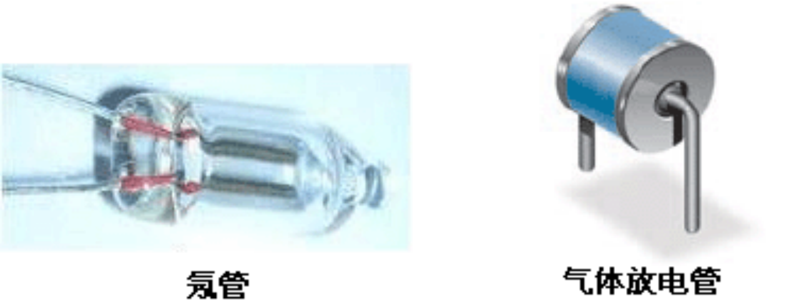

所示的火花隙可以是商用高电压气体放电管、有着约1毫米的不锈钢端的可调的自制火花隙、汽车火花塞、或标准氖管，尽管它们在运行时会变得相当热。一个15mmx6mm大小的氖泡只用90或100伏跨压运行，可以把相当数量的它们串联起来创建一个高压火花隙，而火花隙需要高电压可能是一个误解。在本章的后面部分，有一个非常成功的系统例子，只用了一个氖管作为火花隙，而仅当激励一个旧的2,500伏的霓虹灯变压器模块时，却产生了范围超过一米的振荡磁场。如果利用氖管作为火花隙，那么有经验的开发人员建议，22K的电阻器用于与氖管串联，可大大延长其使用寿命。

这个电路是火花隙与地连接的一种方法：

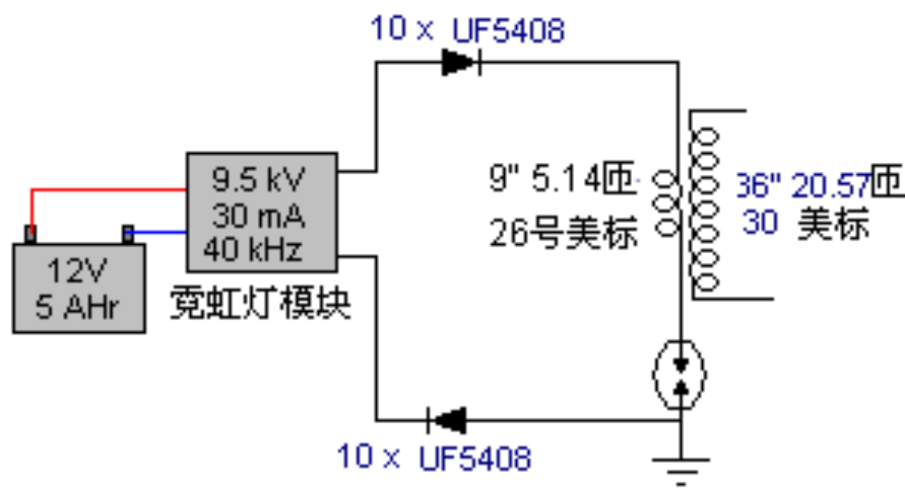

这是论坛成员“SLOW-‘N-EASY”在高能论坛（theenergeticforum）有关唐•史密斯主题的电路配置的改版。在这里，他用了一个自行车上使用的“低处发光”（LowGlow）的霓虹灯变压器。这里的二极管是防止以后在电路里产生的任何意外的电压尖峰的高压电源。火花隙连接在升压变压器的初级绕组和地线之间。没有用到电容器。看到这种电路，我们立即想到唐•史密斯那硕大而又昂贵的线圈，但这个实验者没有用到任何类似的东西。相反，他把他的绕组绕制在一个简单的塑料架上：

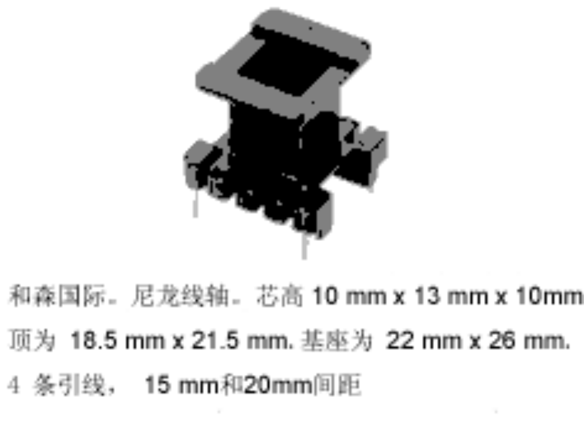

而使事情“更糟”的是：初级绕组的线只有9英寸(228.6毫米)长而次级只有36英寸（914.4毫米）长，初级被直接绕在次级上。全然不是一个大型的或昂贵的结构，可是足以应付实际测试。

这是一个非常紧凑的结构形式，但线圈没有必要使用完全相同的线圈架，至于9英寸长的L1线圈也没有什么神奇的，因为它很容易可以成为任何方便的长度，比如说两英尺或0.5米、或其它长度。重要的是使L2线的长度是那个长度的恰好四倍，精确地切割长度。通常的做法是匹配每个线圈中的铜的重量，因此较短的线是较长的线的两倍直径。

上述电路产生了一个高压高频的冷电输出。电压将不与霓虹灯变压器电压相同，频率也不相同。两个线圈在它们自己的自然频率上共振，没有经过任何电容器的改变。

3.下一步是要高压下降到更加适当的电平，也许像这样：

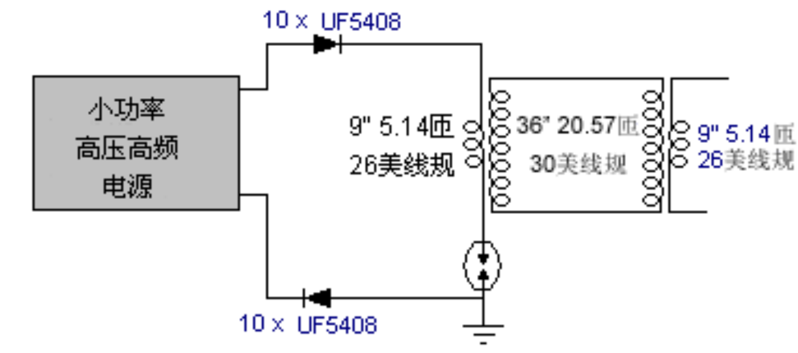

这里，一台同样的变压器，绕制方式完全相同，反过来应用，开始下降电压序列。线长比依然维持着，以保持变压器绕组彼此间的谐振。

假如我们绕制这个第二个变压器的L2线圈是一个单一笔直绕组，不是仅仅只有一个L1绕组缠绕其上，而是两个或更多个同样的L1绕组缠绕其上——那会发生什么？

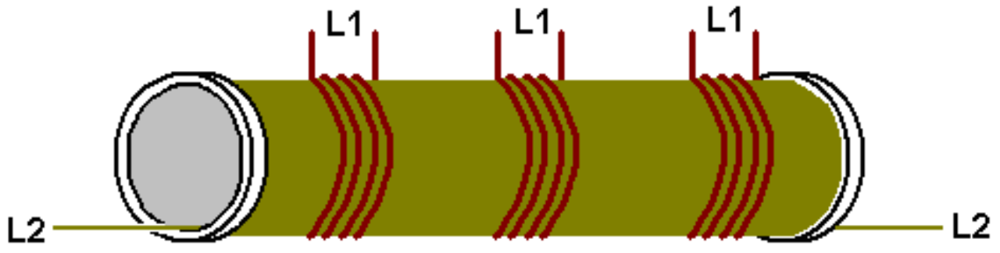

对于浸淫在现今（不充分的）科技水平的人来说，目前的解释会显得像异端邪说。在这些变压器里流动的能量是冷电，是以一种与热电完全不同的方式来运作的。如果运送的是热电，这些线圈之间的耦合将是感应的，而且在这种情况下，任何附加的L1线圈的额外能量输出，都必须通过从L2线圈汲取额外的电流来“支付”。不过，以这些线圈实际上携带的是冷电，线圈之间的耦合是磁而不是感应，而这会导致L2里没有电流增加，不管L1线圈的输出是多少。任何附加的L1线圈将得到免费电源。然而，线圈彼此相对的位置有一个调整的效应，所以L1应该在L2线圈的中间，这意味着，任何附加的L1线圈要稍微偏离最佳调谐点。

4.不管怎么说，保持有一个L1线圈，可能需要至少有一个进一步降压的变压器，并最终转换成我们需要的热电：

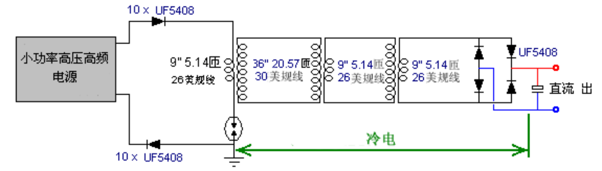

把能量送入电容器并使它成为标准的直流，可能是最简单的转换。频率仍然很高，所以这里需要高速二极管（如75纳秒的UF54008)，尽管现在电压电平已经足够低而不会有什么问题。直流输出可用于给逆变器供电，以便可以使用标准的电源设备。不必只用一个（昂贵的）大容量逆变器来给所有可能的负载供电，因为用几个较小的逆变器会更便宜，每个都只为自己的一组设备供电。大多数设备在方波逆变器上将能顺利运行，而这还包含一个市电电源单元以给输入振荡器电路供电。

在使用高频高压信号时，PVC管不是一种理想的材料，灰色PVC管更是一种特别低劣的线圈架材料。昂贵得多的压克力管当然很好，但如果用的是PVC管，并把它涂上绝缘清漆（或者像在YouTube中演示的那样把乒乓球球溶于丙酮），则具有更好的性能。

但是，有一些其他因素没有提及。例如，如果L1线圈直接绕在L2线圈上，就会有大致相同的直径，因此线长是四倍，将有大约4倍的匝数，给出一个大约为4:1的升压或降压比。如果，另一方面，线圈直径不同，比率也将不同，因为线长是彼此间相对固定的。如果L2线圈是L1线圈直径的一半，那么匝数比约为8:1；而如果是三分之一直径，则12:1；四分之一直径是16:1；这意味着通过减少L2线圈直径就能从同样的线长得到好得多的效果。然而，由线圈产生的磁效应与线圈横截面积有关，所以小直径必然没有很大的优势。而且，L1线圈的线长和匝数也影响直流电阻，更重要的是，交流阻抗也会影响脉冲线圈的功率值。

还有人认为，每个绕组中的铜的重量一样，能使性能改善，但有一个不常提到的看法是：铜的重量越大，效果越好。你会回想到约瑟夫•纽曼（第11章）使用大量的铜线去产生异常效果的情形。所以，虽然9寸和36寸线将可用于L1和L2，也许存在更长的线和/或较粗的线也能改进性能。

我们也不应忘记唐•史密斯指出电压和电流的作用（异相并）沿L2线圈从L1线圈沿相反方向移离的：

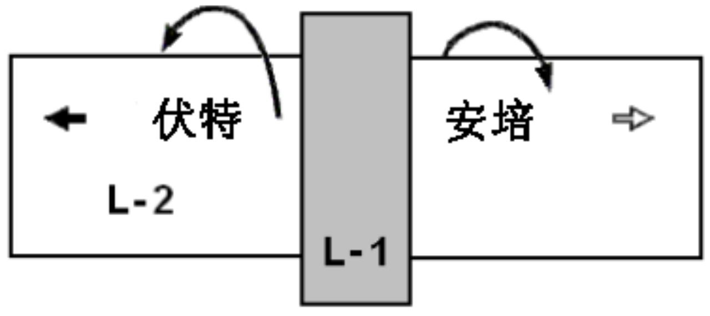

有人建议可以通过分开位于L1线圈下方的L2线圈，反向绕制L2的第二部分，以及在两个L2绕组的连接处接地，来获得更大和更有效的输出功率。唐认为没必要使绕组反向。其结果是一个L2绕组是原来的两倍长，而配置就像这样：

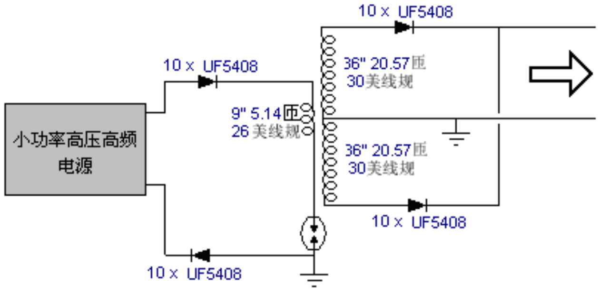

这里，附加的高压二极管使得两个异相绕组互相跨接。你会发现，这样的配置要求两个单独的接地，都需要高质量的连接，有点像一根管子或金属杆被深深敲入到潮湿的土壤中；或者金属板，或类似的有着大的表面积的金属物体被深埋在潮湿的地底，并用一条粗铜线或铜编织线来连接。这些接地点要离得相当远，比如说，十米。不能只用一个单一的接地，因为那会令L1/L2变压器实际上短路，这其实是你不想要的。

以此配置，电路要略变成：

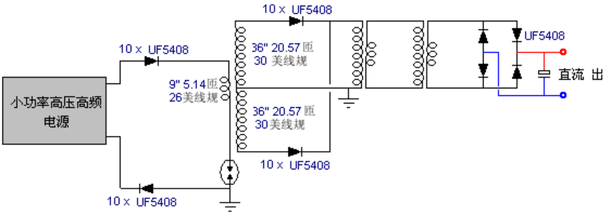

粗的地线是有利的，因为为了避免地线也被包括在共振线长中，您需要突然改变导线的截面积：

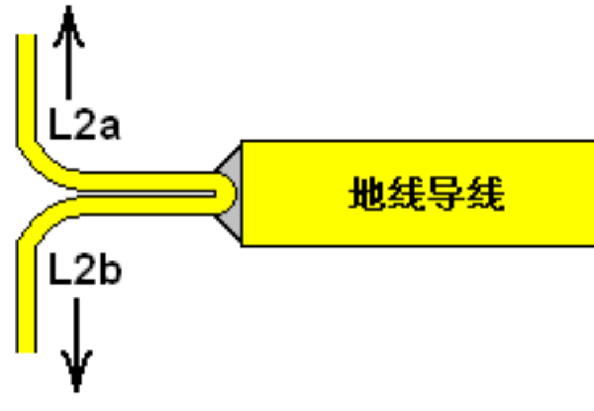

这些都只是一些想法，可能是来自于一些有经验的开发者对唐•史密斯风格电路的研究的思考。

为了使你对市面上导线运送热电时的能力有一定的概念，下表或许会有帮助：

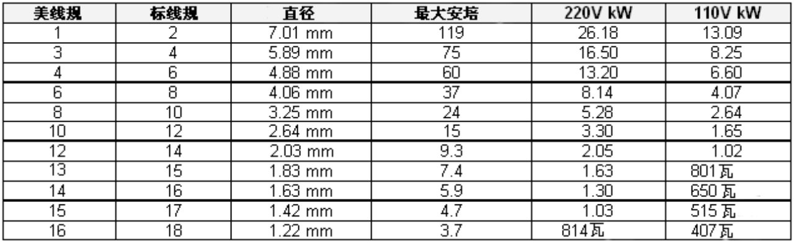

建议导线要有比预计实际负荷多20%以上的载流能力，以使它不会在使用时太热。线径不包括绝缘层，而对于实心漆包铜线则可忽略。

这里演示了一段最为令人印象深刻的视频的电路：http://youtu.be/Q3vr6qmOwLw，这是一个非常简单的配置，直接实现了唐的电路前段的性能。电路似乎是：

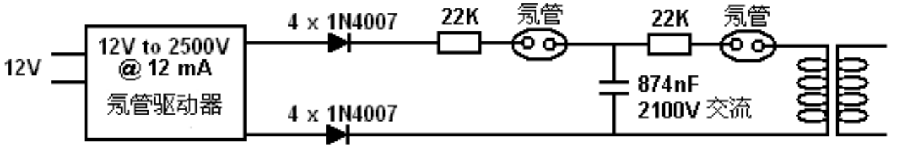

在这里，一个没有接地连接的简单的霓虹灯变压器模块用于产生电压2.5kV、频率25kHz及最大输出为12mA的载流量。构建等同于此的电源并不难。模块的两个输出——两个输出的每一个——通过四个串联成一条链的1N4007二极管的转换成直流（每条链均用一个塑料管绝缘）。

这个输出的饲给是通过一个可选的22K电阻，经由一个霓虹灯到微波炉电容器，它碰巧是874nF，额定电压2,100伏。你可能会觉得电容器的额定电压对于霓虹灯模块的输出电压来说是太低了，但霓虹有一个只要90伏的起弧电压，因此电容是不会达到电源的输出电压的。这些电阻仅仅是延长氖管寿命的；因为导通后的第一纳秒，管内的气体波动相当大。省略这些电阻不像是会造成什么重大影响，而另一方面，包含它们也是小事一桩。第二个氖管饲给共振变压器的初级，它只是理论上地要略显示在上图中，因为开发人员表明初级的作用是一个发射机，而任意数目的接收线圈可以通过调到初级的确切频率而用作独立的次级。

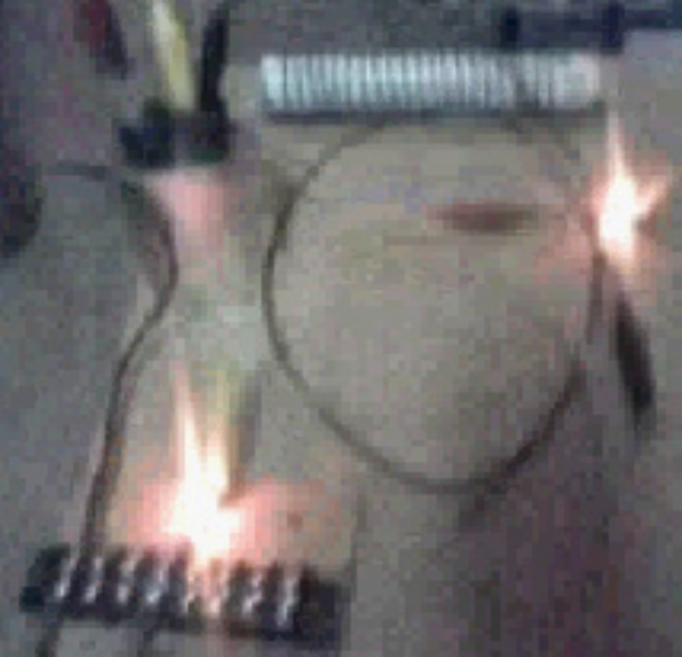

视频中展示的配置，开发人员演示了围绕着线圈振荡着的高频场向外延伸了约四英尺（1.2米）。他还说在他的配置中可以每一个都可以用两个串联的氖管取代。在我所做的测试中，我发现，我需要在电容器前面串联两个氖管，以获得输出氖管的持续放光。此外，二极管之一需要反转，以便一个面向输入而另一个则远离它。二极管的反转并不碍事，因为这两种设置均可运行。再次说明，请注意此文稿仅供参考，不是建议你应该建造这些设备之一。让我再次强调，这是高电压设备，因为带有电容器，甚至更危险，它完全可以杀了你，所以，不要去做一个。开发人员表明，正面显示的是唐的发射器/群-接收器设计的“发射”部分的一个实施。然而，在看这个设计之前，有一个问题在论坛上引起大量的讨论，即，如果L2次级线圈的中间抽头接地，那么地线连接导线的线长是否算作L1线圈的四分之一长的一部分？为了深入研究这种可能性，下面引用的理查德•奎克在他的2001年7月5的美国专利7,973,296中的对共振的非常清楚的解释，将会很有帮助。

然而，简单的回答是，导线的两个长度之间要有切实的共振（无论是那些导线的一部分或全部线长都绕制在一个线圈里），因此一个的长度必需是另一个的刚好四倍长，而最理想的还是直径的一半。在再做线段的两端，要突然改变线的直径，为什么这样做，理查德已经对此做过解释。但是，现在撇开详细的说明，我们可以用这种知识来更详尽解释上述的简化系统。这里还是电路：

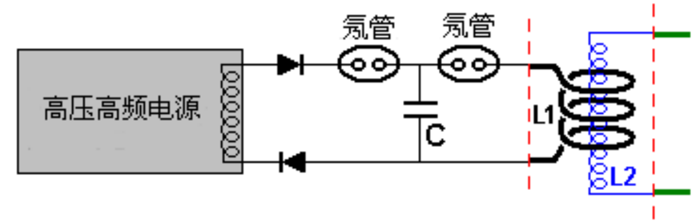

要注意的很重要的一点是不要求必须接地，尽管如此，视频上的表现的性能令人印象非常深刻。而接地连接可以将大量能量送入电路，无需一个用于前端，是一项巨大优势，并可能给真正的便携式设备开辟了一条通途。另外一个很重要的一点是绝对简单的配置，只用便宜、现成的组件（也不需要很多）。没有显示用于延长氖管寿命的电阻，但如果需要，它们可以包含进来；而有了它们，电路运行也不会有明显改变。如果要求一个更高的火花电压，那么可以用两个或更多个氖管串联，电路里只显示的一个。
相比于前图，有一点要注意的是下部的二极管显示是反转的。这是因为显示的电源是普通的电源，它激励的是一个简单的没有一个中心抽头的输出线圈。在早先的原理图的霓虹供应似乎有两个独立的输出，这将、也许会是彼此异相，因为这是霓虹灯驱动模块常见的做法。如果你愿意，这里所示的两个二极管可以由四个高压高速二极管组成的二极管桥取代。

L1和L2的线长要精确度量，因为在此处的线径要突然改变，即上面用红色短划线标示的那样。L2线长是L1线长的刚好四倍，而L2线径是L1线径的一半。
L1有多长？嗯，你想要多长？它可以是任何你想要的长度，而L1线圈的半径可以是任何你想要的半径。理论家会说L1线圈应与送入的功率频率产生共鸣。好吧，听来不错，我说，那么请告诉我那是什么频率？它不会是电源的频率，因为那将至少改变一个氖管。那么，氖管产生的频率会是多少？甚至制造商也没办法告诉你，因为每一个个别的管看起来是一样，但其实却是有着相当大的差异。

实际上，这完全无关紧要，因为L1线圈（和L2线圈，如果你准确地丈量它们）有自身的共振频率，它会在该频率上振动，而不管送入的频率是多少。一个线圈共振与撞击一个钟有着极为相同的方式。它与你用多大力气或多么急促撞击钟无关——钟会在自己的自然频率上鸣响。因此，L1线圈会在它自己的固有频率上共振，无论冲击它的电压尖峰以何种速率到达，而经过精心构造的L2线圈要有完全相同的频率，它会与L1线圈同步共振动。

这意味着，作为L1线圈的线长是建造者的选择，但一旦选择了它的长度，就要为L2线圈确定导线的长度，因为这是全然的4倍长，除非建造者决定使用的配置是L2线圈的绕制既有顺时针方向也有逆时针方向，在这种情况下，L2线圈的每一半将是L1线圈线长的四倍，就像这样：

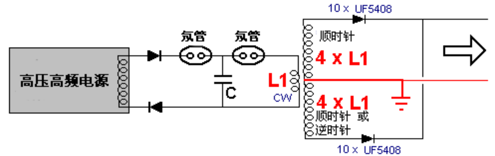

要注意，当决定什么可能是L1最合适的导线长度时，另外一个要考虑的因素是L1线圈中的匝数。L1和L2之间的匝数比越大，由L1/L2变压器产生的电压激励越高，并记住L2的长度相对于L1的长度是相对固定的。

所以，一种可能的电路样式可能是：

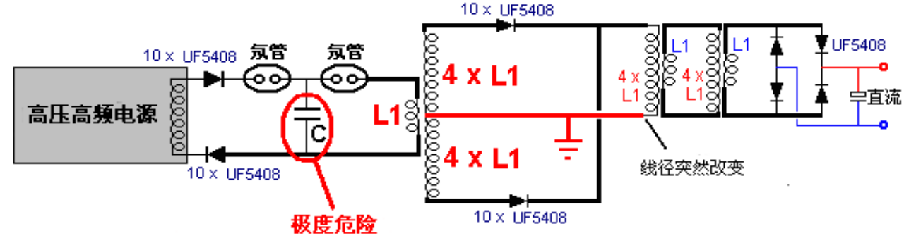

要记住一些要点。其一是每个L1线圈的两端和L2线圈的两端的导线直径必须有突然的改变。如果没有变化，那么连接导线的长度将形成线圈的一部分，而如果在直径上有一些变化，但不是很多，那么谁也说不准线圈的共振线的长度是多少。可以按所需配置多台降压隔离空芯L1/L2变压器，而这些并不需要特别大型的或昂贵的。

这个电路的制做者只用了短短几分钟就把它们放到一起，使用的组件也是手头上的组件，包括上图中标注为“C”的微波炉电容器。那个电容被两边的氖管火花隙隔离，因此它不会修改任何在这个电路里的线圈的共振频率的效应。但至关重要的是要理解储存在电容器里的能量可以、而且会秒杀了你，如果你去碰它，所以让我再次强调，此信息不建议你真的去制做这种电路。电路的直流输出是为了给一个标准的逆变器提供电源，反过来，也完全可以为高压高频的输入振荡器供电。

最后一点正如视频里演示的，由L1线圈产生的振荡磁场可以给数个相同的L2线圈提供动力，因为是磁耦合而非感应，如本章前面提到的，可以在不增加输入功率的情况下给出数个额外的功率输出。请注意无论是L1线圈还是L2线圈都没有跨接电容器，因此共振仅仅是在线的长度上，而且不需要昂贵的高压电容器获取L1/L2线圈对一起共振。一个可能的配置可能会像这样：

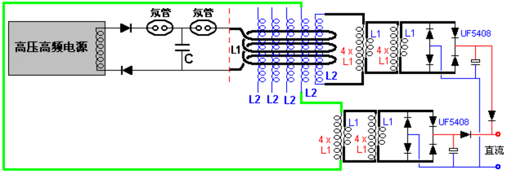

这里显示两个L2线圈连接在一起，以增加输出功率。这个配置为输出阶段使用了低压廉价的组件，而对于可供的输出功率并没有明显限制。由于电路始终运行在高频下，L1线圈内并不特别需要物理上放置额外的L2线圈：

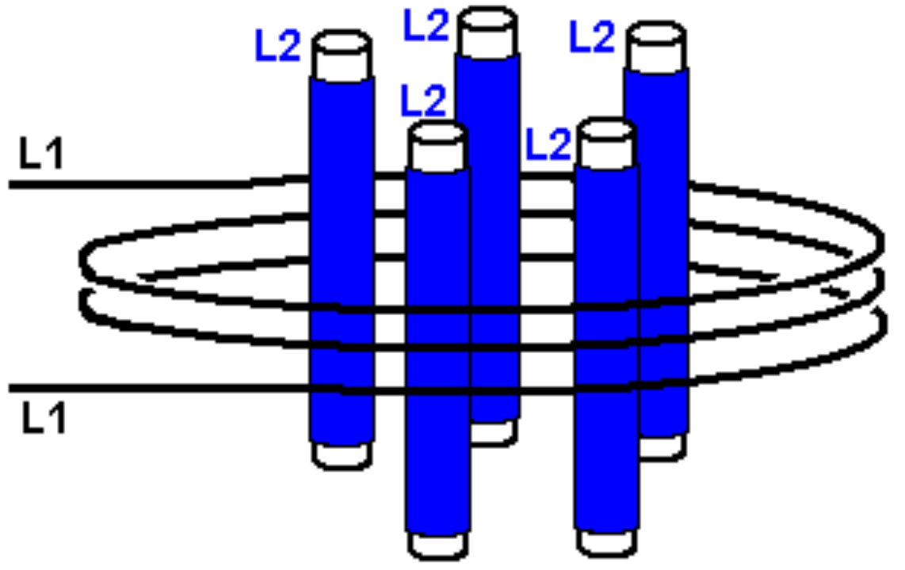

然而，这个配置的一个优势是L1线圈的线长越长，它会反过来使每个L2线圈的线长越长（四倍长）。这在计划L1/L2变压器的匝数比时提供了更大的灵活性。那个变压器的电压上升或下降恰巧是匝数的比率，尽管事实上这不是感应耦合，因此标准的变压器技术并不适用。

当你为L1选择了匝数和线圈直径时，也同样给出了L2导线的长度。为了得到所需的输出电压，如果也许，需要的降压比是46:1，那么你就需要在L2线圈上的L1匝数是46倍。这意味着你知道了L2线圈中想要的导线长度和匝的数量。但是，因为每一匝是直径的3.14159倍的长度，因而断定想要的直径是每匝线长除以3.14159。导线位于管子的上边，在这里绕制，因而以线的厚度而具有较大的直径，所以计算管子的直径需要减少一根线的直径。例如，如果每匝的长度是162mm而线径0.8mm，那么管径将是162/3.14159–0.8，即是50.766mm（刚刚超过两英寸）。
