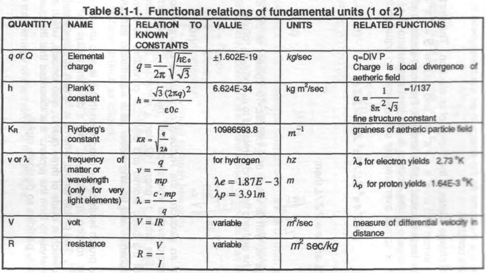
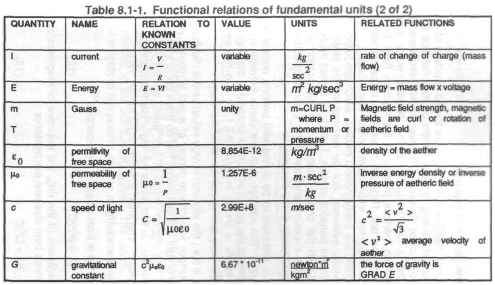
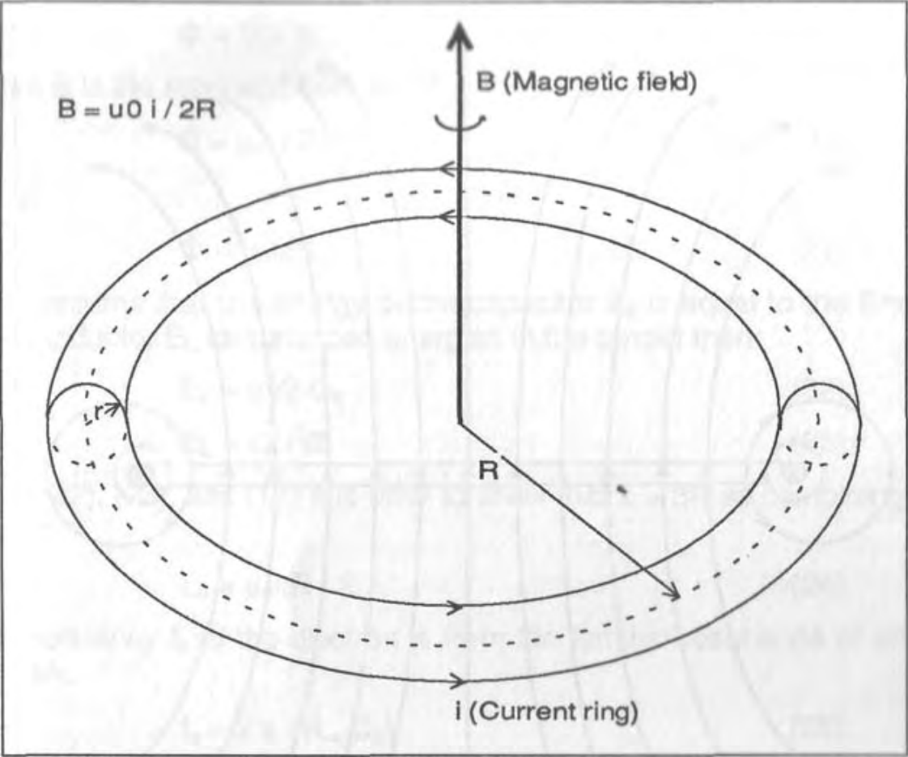
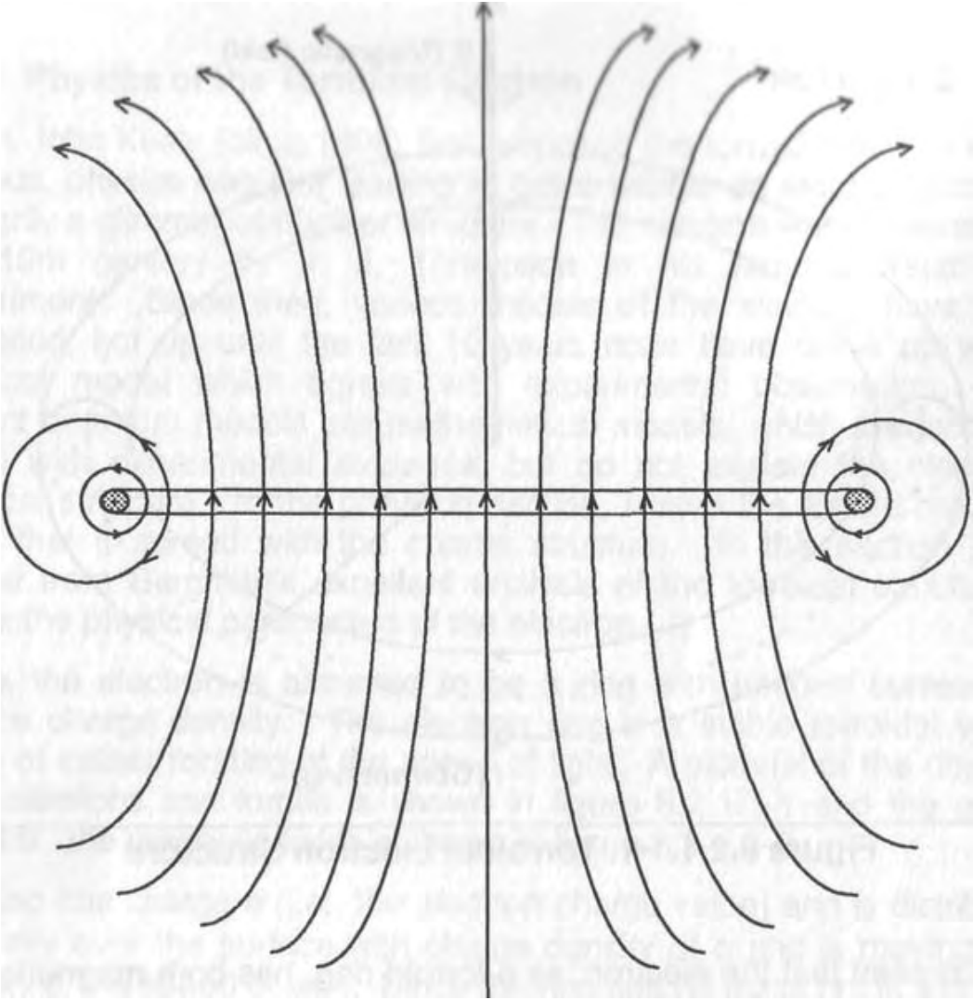
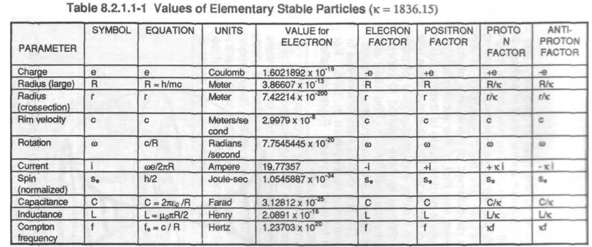
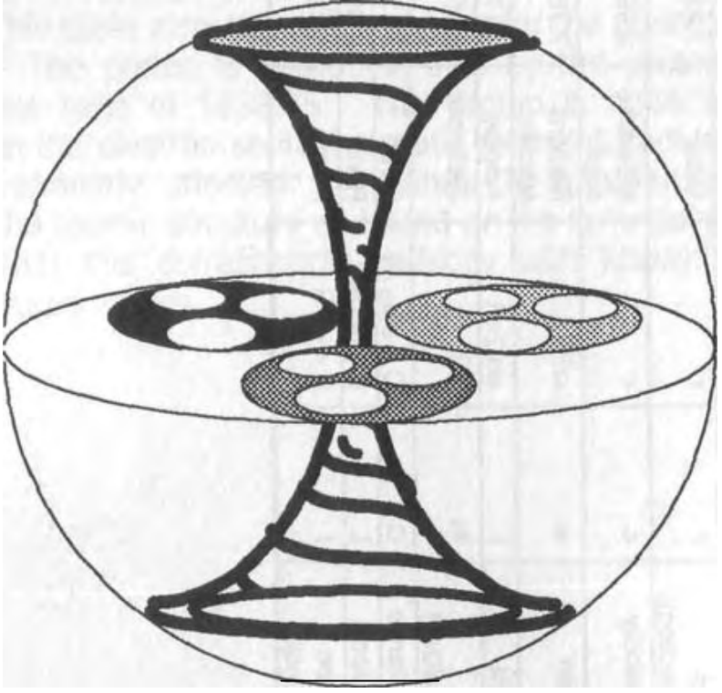
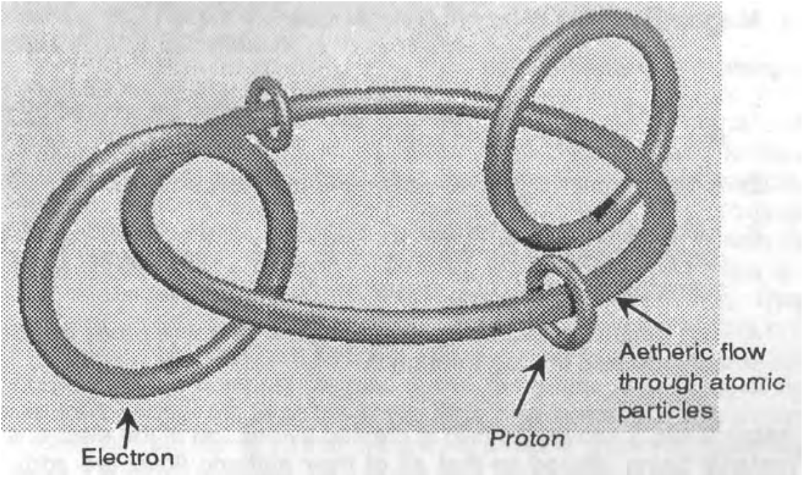
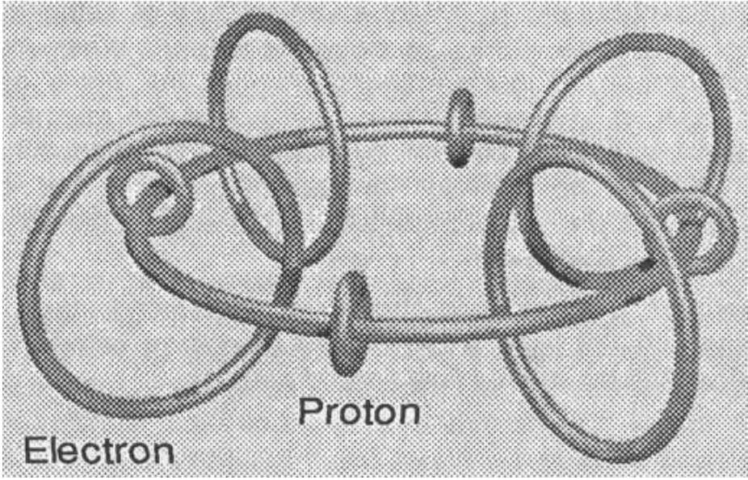
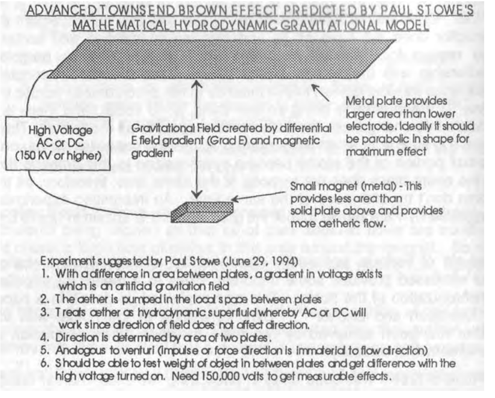

# 第8章核结构-形状力量的基础

CHAPTER 8 NUCLEAR STRUCTURE - BASIS OF SHAPE POWER

This chapter examines the shape power of subatomic structures.

本章研究亚原子结构的形状能力。

## 8.1简介

8.1 Introduction

The atom is the ultimate, original, shape power structure. Its perpetual vibration and motion reveals that it operates at the interface of the physical universe with the aetheric realm. All known forces and elements are embedded in the structure of the atom, and probably many more that we don't yet know about. Solve how the atom does its perpetual motion miracle and you have solved how the physical universe is constructed. Gravity control and free energy will be some of the resulting developments when the atom is understood.

原子是终极的、原始的、形状能量结构。它永恒的振动和运动揭示了它在物理宇宙与以太领域的交汇上运行。所有已知的力和元素都嵌入了原子的结构中，可能还有更多我们还不知道的。解决了原子是如何实现其永动机奇迹的，你就解决了物理宇宙是如何构建的。当原子被理解时，重力控制和自由能将是由此产生的一些结果。

In chapter one, the simple atom, as envisioned by John E. W. Keely, was depicted as a torroidal vortex of aetheric force, with a substructure of torroids embedded within the larger torroid in a triple particle effect. The main torroid is made up of three smaller torroids rotating to form the larger main pattern, with each pattern repeating at each sub-level, possibly ad infinitum.

在第一章中，正如约翰·E·W·基利所设想的那样，简单原子被描述为以太力的环面涡旋，在三粒子效应中，环面的子结构嵌入更大的环面中。主涡旋由三个较小的涡旋组成，它们旋转形成较大的主模式，每个模式在每个子级别重复，可能是无限的。

Modern physics envisions the atom as a collection of nuclear particles which are held together by the strong force, the weak force, gravity, electricity, and magnetism to form the various atomic elements. Their theory is that the center of the atom has a nucleus, a core of these subatomic particles, which is surrounded by a cloud of electrons orbiting the nucleus at tremendous speed.

现代物理学将原子设想为核粒子的集合，这些粒子通过强大的力、微弱的力、重力、电和磁结合在一起，形成各种原子元素。他们的理论是，原子的中心有一个原子核，一个由这些亚原子粒子组成的核，它被一团以惊人速度围绕原子核运行的电子所包围。

Neither Keely's model without electrons nor the modernist view with their particle soup is a satisfying concept. Electrons exist, at least particles that look like them, smell like then and quack like thorn, so Keely's model is incomplete or we simply don't have enough information to define it. Further, an electron or a cloud of them continuously rotating about the nucleus should quickly deplete then energy through electromagnetic radiation so we have more anomalies to deal with.

基利的无电子模型和现代主义的粒子汤观点都不是一个令人满意的概念。电子是存在的，至少是那些看起来像它们、闻起来像刺、嘎嘎作响的粒子，所以基利的模型是不完整的，或者我们根本没有足够的信息来定义它。此外，一个电子或它们围绕原子核连续旋转的云应该会通过电磁辐射迅速消耗能量，这样我们就有更多的异常现象需要处理。

On the other hand, the particle menagerie of the "standard model" seems to exist but only for the most fleeting of moments. The stable particles (i.e., those which exist independent of the atom are the electron, positron, proton, and anti-proton. Some might ask, "isn't the neutron a stable particle?"; observation shows it quickly devolves into an electron and a proton.

另一方面，“标准模型”的粒子园似乎存在，但只存在于最短暂的时刻。稳定粒子（即独立于原子存在的粒子是电子、正电子、质子和反质子。有些人可能会问，“中子不是稳定粒子吗？”观察表明，它很快就会转变为电子和质子。

A new model of the atom is emerging from the alternate science researchers that seems to satisfy experimental observations. This chapter describes this new atomic model. Atomic structure is described by this new model, and we are able to derive the nuclear and physical constants, plus the model forms the basis for a grand unified-field theory. None of the alternate science researchers, that I analyzed, including myself, have the full picture; but it looks like we are moving in the correct direction. I have endeavored to put all the parts together to have a more complete theory and form a cohesive picture of the atomic level and the basic nuclear forces. The researchers that formed the core ideas are listed in the bibliography.

科学研究人员提出了一种新的原子模型，似乎满足了实验观测的要求。本章介绍了这个新的原子模型。原子结构由这个新模型描述，我们能够推导出核常数和物理常数，加上这个模型构成了一个大统一场论的基础。我分析的其他科学研究人员，包括我自己，都没有完整的画面；但看起来我们正朝着正确的方向前进。我努力把所有的部分放在一起，以形成一个更完整的理论，并形成一个原子水平和基本核力的连贯画面。形成核心思想的研究人员列于参考书目中。

The essence of this new model is that the electron, proton, positron, and anti-proton are all torroidal (i.e., donut shaped) shaped particles that rotate at the velocity of light. The neutron is the result of an electron and proton being compressed in the nucleus.

这个新模型的本质是，电子、质子、正电子和反质子都是以光速旋转的圆环形（即圆环形）粒子。中子是电子和质子在原子核中被压缩的结果。

When I was first getting into a study of alternate physics and science back in the 1950's, my first brush with an alternative to the standard model of modern physics was with John E. W. Keely's torroidal structure of the nucleus. Having been educated ("brainwashed") by my classes in nuclear physics, atomic chemistry, and electronics, Keely's "atom" was a source of extreme puzzlement. On one hand, the evidence that Keely had truly discovered a certain modicum of control of gravity and magnetism was astounding (and way beyond modern physics), but I was never able to fully reconcile what he did with what he said was the physical basis for the atom. His atom was not adequately explained in the scant literature available and I couldn't make out if the particles Keely described were electrons, protons, neutrons, or what. My conclusion (circa 1959) was that Keely's concept of a torroidal particle structure was probably close but his subatomic structure was as goofy as the standard model. I decided that the short-lived subatomic particles were nothing more that the residue of a torroidal nucleus, made of the aether, getting blasted apart and the harder it got blasted the more strange the particle soup. Each succeeding, more powerful atomic accelerator that physicists used to blast the nucleus found new particles to add to the particle menagerie, possibly particles from Keely's substructure of smaller and smaller torroids.

早在20世纪50年代，当我第一次研究替代物理学和科学时，我第一次接触到现代物理学标准模型的替代品是约翰·E·W·基利的核的环面结构。在接受了我的核物理、原子化学和电子学课程的教育（“洗脑”）后，基利的“原子”引起了极大的困惑。一方面，基利真正发现了对引力和磁性的某种控制的证据令人震惊（远远超出了现代物理学），但我始终无法完全调和他所做的与他所说的原子的物理基础。在现有的文献中，他的原子没有得到充分的解释，我也不知道基利描述的粒子是电子、质子、中子还是什么。我的结论（大约在1959年）是，基利关于涡旋粒子结构的概念可能很接近，但他的亚原子结构和标准模型一样愚蠢。我决定，短命的亚原子粒子只不过是由以太组成的环形核的残留物，被炸开了，炸得越硬，粒子汤就越奇怪。物理学家用来爆破原子核的每一个成功的、更强大的原子加速器都会发现新的粒子添加到粒子群中，可能是来自基利的越来越小的涡旋子结构的粒子。

I am going to give a partial derivation of the mathematical formulas which describe the new alternate atomic model; however, if the reader wants to see the nitty gritty details, look into the articles listed in the bibliography at the end of this chapter. By and large, I have steered away from mathematical descriptions in preceding chapters and attempted to form a word and graphic depiction of the various elements of shape power to make this fascinating subject appealing, understandable, and usable to the serious researcher who may not have a mathematical background. In this chapter, I am going to show there is a very firm mathematical basis for this new physics. If math isn't your forte, then read the words and study the pictures, they tell the same story and you'll get 80% of the essential concepts.

我将给出描述新的交替原子模型的数学公式的部分推导；然而，如果读者想了解细节，可以查看本章末尾参考书目中列出的文章。总的来说，我已经避开了前几章的数学描述，并试图对形状能量的各种元素进行文字和图形描述，使这个引人入胜的主题对可能没有数学背景的严肃研究人员具有吸引力、可理解性和可用性。在这一章中，我将展示这一新物理学有一个非常坚实的数学基础。如果数学不是你的强项，那么阅读单词并研究图片，它们讲述了相同的故事，你会得到80%的基本概念。

My first real brush with the electron as a torroidal structure, that had some mathematics associated with it, was the seminal work done by Dr. Paramahansa Tewari. Subsequent modeling by Paul Stowe filled in more of the puzzle of gravitation, Dr. Hal Puthoff and Ml associates clarified the concept of inertia, and recent work by Lucas and Bergman solves another set of my questions about the nucleus and atomic structure and how the structure goes together geometrically What follows is a unified concept of these. I don't pretend that this is the end of the discussion of nuclear structure, but at least its a place to start developing a new, rational structure of matter and the universe, and to form a theoretical basis for a new picture of shape power research efforts.

帕拉马汉萨·特瓦里博士的开创性工作是我第一次真正将电子视为环面结构，并与之相关的数学知识。保罗·斯托随后的建模填补了引力的更多谜题，Hal Puthoff 博士和Ml同事澄清了惯性的概念，Lucas和Bergman最近的工作解决了我关于原子核和原子结构以及原子结构如何几何结合的另一组问题。下面是这些问题的统一概念。我并不认为这是核结构讨论的结束，但至少这是一个开始发展物质和宇宙的新的、合理的结构的地方，并为形状能量研究工作的新图景形成理论基础。

## 8.2圆环体电子

8.2 The Torroidal Electron

Space is envisioned as a superfluidic medium, nonviscous, relatively frictionless, massless and continuous. It can be modeled as a paniculate superfluid with average interaction spacing of L Essentially, this is a new definition of the aether.

The electron is postulated as a torroidal (i.e., donut shaped) ring. The ring with a radius of R and a cross section of r, rotates with a velocity of c, the speed of light. The ring (or more properly the toroid) also rotates within itself around the cross-section with radius r. The electron's electric charge and associated electrostatic field properties can be shown to be a result of the two rotations of the ring on it axis and cross section.

太空被设想为一种超流体介质，无粘性、相对无摩擦、无质量且连续。它可以被建模为平均相互作用间距为L的圆锥状超流体。本质上，这是以太的一个新定义。

假设电子是一个环面（即圆环形）环。半径为R、横截面为R的环以光速c旋转。环（或者更确切地说是环形环）也在其内部围绕半径为r的横截面旋转。电子的电荷和相关的静电场特性可以被证明是环在其轴和横截面上两次旋转的结果。

In the classical theory of kinetics, the transverse wave speed in a fluid is:

在经典动力学理论中，流体中的横波速度为：

$$c=\sqrt{\frac{P}{\rho}}$$

Where P is the pressure and $\rho$ is the fluid density.

其中P是压力，$\rho$ 是流体密度。

From electrostatics the velocity of light, c, is related to the permeability $\mu_0$, and the permittivity $\varepsilon_0$ of free space. The relationship is:

根据静电学，光速c与自由空间的磁导率$\mu_0$和介电常数$\varepsilon_0$相关。关系是：

$$c=\sqrt{\frac{1}{\mu_0\varepsilon_0}}$$

两个等式联合：

$$\frac{P}{\rho} = \frac{1}{\mu_0\varepsilon_0}$$

Since light is a transverse phenomena, we find that $μ_0 = 1/P$, the coefficient of compressibility, and o= p which is mass/density.

由于光是一种横向现象，我们发现$μ_0=1/P$是压缩系数，$\varepsilon_0=\rho$即质量/密度。

To find Plank's constant we define a field vector entity as follows:
- S=Space
- V=Velocity
- Z=momentum
- L= average movement or mean free path
- t= rate of momentum
- h=action parameter
- $m_z$= mass or apparent mass and $Z=m_zV$(from kinetics)

为了找到普朗克常数，我们定义了一个场向量实体，如下所示：

- S=空间
- V=速度
- Z=动量
- L=平均运动或平均自由程
- t=动量率
- h=动作参数
- $m_z$=质量或表观质量，Z=m2 V（来自动力学）

There are n of these entity vectors in a given space. The action parameter is defined as follows:

在给定的空间中有n个这样的实体向量。动作参数定义如下：

$$h=2Z\int_0^Ldh=2ZL$$

用$Z=m_zV$代替

$$h=2m_zVL$$

The total energy of the system is the integral:

系统的总能量是积分：

$$E=n\int_0^thdt=nht$$

The rate t is V for wave velocity and c (i.e., the speed of light) for electromagnetic radiation.

波速的速率t为V，电磁辐射的速率c（即光速）。

Thus:

- $E= hV $ for wave motion
- $E=m_zc^2$ for relativistic energy

因此：

- $E=hV$ 代表波浪运动
- $E=m_zc^2$ 代表相对论能量

Since equation $E= hV$ is the same as the energy in an electromagnetic wave, then h is Plank's constant.

由于方程$E= hV$与电磁波中的能量相同，因此h是普朗克常数。

The quantity of charge relates to the charge of an electron. The electron is defined as a torroid with area $a=4\pi^2Rr$ and volume $S=2\pi^2R^2$ where R is the large torroidal radius and r is the cross-section radius. The electric charge e of the electron is the total momentum Z of the electron which is spread over area per unit volume. In equation form this is:

电荷量与电子的电荷有关。电子被定义为面积$a=4\pi^2Rr$、体积$S=2\pi^2R^2$ 的环面，其中R是大环面半径，r是横截面半径。电子的电荷e是电子的总动量Z，它分布在每单位体积的面积上。方程式形式如下：

$$e=\frac{Z4\pi^2ZL}{2\pi^2ZL}=2\frac{Z}{L}$$

因为$h=2PL, e=2\frac{Z}{L}$所以

$$L=\sqrt{\frac{h}{e}}$$

Electric charge e, with a value of $\pm1.6029E-19$ kg/sec, is the local divergence of the aetheric field and is related to $μ_0$ and $\varepsilon_0$ as follows:

$$q=\frac{1}{2\pi}\sqrt{\frac{h}{\sqrt{\frac{3μ_0}{\varepsilon_0}}}}$$

The charge of an electron, the Rydberg constant, and gravitational constant are also derivable from simple fluid mechanics  treatment of the aether. See table 1, page 119, for a summary of the simple relationships of the basic atomic and electrical constants as derived using fluid mechanics and treating aether as a superfluidic particulate medium.

电子的电荷、里德伯常数和引力常数也可以从以太的简单流体力学处理中推导出来。使用流体力学和将以太视为超流体颗粒介质推导出的基本原子常数和电常数的简单关系概述，见第119页表1。

Analysis of the proton leads to the conclusion that it is also an aetheric torroidal vortex, rotating at velocity c, with a different radius and ring cross section. The proton torroid, when it is broken up, devolves into a substructure which is made of three quarks, also torroids, which spin as a complete whole to form the proton. It is theorized that the quarks are not self-stable particles so dissipate rapidly.

对质子的分析得出结论，它也是一个以太环面涡旋，以速度c旋转，具有不同的半径和环截面。质子-环面，当它被分解时，会分解成一个由三个夸克组成的亚结构，也就是环面，它们作为一个完整的整体旋转形成质子。理论上，夸克不是自稳定粒子，因此消散得很快。

## 8.2.1圆环体电子物理学

8.2.1 Physics of the Torroidal Electron

When John Keely (circa 1896) first proposed the torroid structure of the nucleus, physics was just starting to get a handle on electrostatics and had only a glimmer of nuclear structure. The electron was discovered in the 19th century by J. J. Thompson in his famous water drop experiment. Since then, various models of the electron have been proposed, but up until the last 10 years none have come up with a physical model which agrees with experimental observation. The current quantum models are mathematical models, which are forced to agree with experimental evidence, but do not explain the electron's physical structure. In the previous section, I used the torroid model to show that it agreed with the charge structure. In this section, l will borrow from Bergman's excellent analysis of the torroidal structure to derive the physical parameters of the electron.

当约翰·基利（约1896年）首次提出原子核的环面结构时，物理学才刚刚开始掌握静电学，对原子核结构只有一丝了解。19世纪，J·J·汤普森在他著名的水滴实验中发现了这种电子。从那时起，人们提出了各种各样的电子模型，但直到最近10年，还没有人提出与实验观测一致的物理模型。目前的量子模型是数学模型，被迫与实验证据一致，但不能解释电子的物理结构。在上一节中，我使用了环面模型来证明它与电荷结构一致。在本节中，我将借鉴伯格曼对环面结构的出色分析，推导出电子的物理参数。

Again, the electron is assumed to be a ring with uniform current and surface charge density. The electron ring is a stable torroidal vortex made of aether rotating at the speed of light. A pictorial of the ring and its dimensions and forces is shown in figure 8.2.1.1-1 and the aether flow (i.e., the magnetic field) is shown in figure 8.2.1.1-2.

再次，假设电子是具有均匀电流和表面电荷密度的环。电子环是由以太以光速旋转而成的稳定的环面涡旋。环及其尺寸和力的图示如图8.2.1.1-1所示，以太流（即磁场）如图8.2.1.1.2所示。

Figure 8.2.1.1-1. Torroidal Electron Structure

图8.2.1.1-1 圆环体电子结构

Figure 8.2.1.1-2. Side View of Torroidal Electron with Aether Flow (i.e., the magnetic field)

图8.2.1.1-2具有以太流（即磁场）的圆环体电子的侧视图

The ring has charge e (i.e., the electron charge value) and is distributed uniformly over the surface with charge density of sigma and is moving with velocity c, the speed of light. Since the ring has no mass but is a current of electrostatic force, the ring can move at light speed without violation of mass/velocity principles. In fact, since the ring is electromagnetic, em forces move at c anyway. The area, a, of the ring is $4\pi^2Rr$. Thus,

该环具有电荷e（即电子电荷值），以西格玛的电荷密度均匀分布在表面上，并以光速c移动。由于环没有质量，而是静电力的电流，因此环可以在不违反质量/速度原理的情况下以光速移动。事实上，由于环是电磁的，电磁力无论如何都会在c处移动。环的面积a为$4\pi^2Rr$。因此

$$e=\sigma4\pi^2Rr$$

The energy E of the ring is from classical electrostatics.

$$E_e=e^2/2C$$

Where C is the capacitance of the ring, the inductive or magnetostatic energy Em is also derived from classical electrostatics.

$$E_m=Li^2/2$$

L is the self inductance with current i of the ring. The current is also from classical electrostatics and is:

$$i=ec/2\pi R$$

It is thus seen that the electron, as a torroid ring, has both magnetic and electric fields as well as a magnetic moment caused by the ring spin. The magnetic field is shown in figure 8.2.1.1-2 and the electric field radiates from the ring in all directions. This sets up a push-pull relationship to the surrounding space. The electric field will attract or repel e-fields of like polarity and the magnetic field will do likewise for b fields.

由此可见，电子作为一个环面环，既有磁场，也有电场，还有由环自旋引起的磁矩。磁场如图8.2.1.1-2所示，电场从环向各个方向辐射。这就建立了与周围空间的推拉关系。电场将吸引或排斥相同极性的电子场，磁场也将如此。

For a very thin ring where r << R the voltage V is computed as follows:

对于r远远小于R的非常薄的环，电压V的计算如下：

$$V=1/(4\pi \varepsilon_0)(e/(x^2+R^2)^{1/2})$$

Capacitance $C_e = q/V$ (from Sears: "Electrostatics") but $q = e$ so

电容$C_e=q/V$（来自Sears：“静电学”），但$q=e$

$$C_e=e/V$$

联合上两式

$$C_e=4\pi \varepsilon_0/(x^2+R^2)^{1/2}$$

The inductance of the ring L is:

环L的电感为：

$$L=N\varPhi/i$$

where N is number of turns, x is the flux and i is the current. N = 1, and $\varPhi$ is:

其中N是匝数，x是通量，i是电流。N=1，并且为：

$$\varPhi=BxA$$

where B is the magnetic field and A is the area.

其中B是磁场，A是面积。

因此：

$$L=\mu_0i\pi R/2$$

If we assume that the energy of the capacitor $E_c$ is equal to the Energy of the inductor $E_L$ for balanced energies in the torroid then:

如果我们假设电容器$E_c$的能量等于电感器$E_L$ 的能量，以获得环面中的平衡能量，那么：

$$E_c=e^2/2C_e$$

$$E_L=L_ei^2/2$$

From(22), (23), and (17) it is easy to show that x =3R so combining the above:

从（22）、（23）和（17）中很容易看出x=3R，因此结合上述内容：

$$L_e=\mu_0\pi R/2$$

The frequency $f_e$ of the electron is from the familiar resonance of an LC network:

电子的频率$f_e$来自LC网络的常见共振：

$$f_e=\frac{2\pi}{L_eC_e}$$

Combining(17), (22), and(23)yields:

将（17）、（22）和（23）组合得到：

$$f_e=c/R$$

From Menzel' the Compton wavelength $f_e$ is:

根据Menzel的说法，康普顿波长$f_e$为：

$$f_c=mc^2/h$$

where c is speed of light and h is Plank's constant. Combining(26) and (27),

其中c是光速，h是普朗克常数。结合（26）和（27），

$$R=h/mc$$

This is the large radius, R, of the electron.

这是电子的大半径R。

The anomalous magnetic moment can also be computed from this model of the torroidal electron. The ring current i is $i=e\omega/2\pi$ where $\omega$ is the angular velocity which is c so

反常磁矩也可以从环形电子的这个模型中计算出来。环电流i为$i=e\omega/2\pi$元，其中$\omega$为角速度，c为

$$i=ec/2\pi R$$

Magnetic $u_e$ is:

磁性$u_e$为：

$$u_e=AI$$

where A is the area of the current torroid. Combining(28),(29), and(30) yields:

其中A是电流环面的面积。将（28）、（29）和（30）组合得到：

$$u_e=he/4\pi m=u_B$$

where $u_B$ is the Bohr magneton. Computation of this yields:

其中$u_B$是玻尔磁子。计算此产量:

u= 0.92731 which is good to 3 decimal places.

u=0.92731，精确到小数点后3位。

The anomalous electron moment correction is:

反常电子矩校正为：

$$(1+\alpha/2\pi -2.973\alpha^2/\pi^2)=u_e/u_o$$

where a is the fine structure constant and $\alpha=7.29729 \times 10^{-3}$. When this correction is computed:

其中a是精细结构常数，$\alpha=7.29729 \times 10^{-3}$。计算此校正时：

$$u_e=0.928381$$

which is good to places for the Bohr magneton. More accuracy can be achieved by using a better approximation for the inductance Le and the torroidal shape which is done in Bergman's analysis. The main point to be made from all this is that the torroid electron model yields good results which are not achievable with classical or quantum mechanics. The other important point is this entire analysis obviates the need for Einstein's theories of relativity since we can derive all the atomic parameters without Einstein's nonsensical assumptions. Lets hope the orthodox community gets with the program and wakes up.

这对玻尔磁子的位置很好。通过使用Bergman分析中所做的电感Le和环面形状的更好近似，可以获得更高的精度。由此得出的主要观点是，环面电子模型产生了经典或量子力学无法实现的良好结果。另一个重要的观点是，整个分析消除了对爱因斯坦相对论的需求，因为我们可以在没有爱因斯坦荒谬假设的情况下推导出所有原子参数。让我们希望正统派社区接受这个计划并觉醒。

A summary of the torroid model equations and values are shown in table 8.2.1.1-1. This table also shows the values for the positron, proton, and anti-proton. The proton is related in size by the proton mass to the electron mass ratio of 1836.15. The proton is 1836.15 times more massive than the electron so its magnetic moment, radius, rotation, and current are similarly affected. Appendix B summarizes part of the nuclides of the atomic structure as based on the torroidal particle theory. It is seen that this corresponds perfectly with known electron- and proton-measured values.

环面模型方程和数值汇总如表8.2.1.1-1所示。该表还显示了正电子、质子和反质子的值。质子的大小与1836.15的质子质量与电子质量比有关。质子的质量是电子的1836.15倍，因此其磁矩、半径、旋转和电流也受到类似的影响。附录B总结了基于环面粒子理论的原子结构的部分核素。可以看出，这与已知的电子和质子测量值完全一致。

## 8.3原子结构

8.3 Atomic Structure

Atomic structure builds according to the rules of geometry and the polarity of atomic particles. Polarities are the result of aetheric flows into and out of matter where the flow directions produce the magnetic poles. John Ernst Worrel Keely was the first sub-atomic physicist as he characterized the nuclear structure. His basic elucidation of atomic structure was derived from his development of the science of vibratory physics. One of his discoveries was that of the substructure of the proton. He discovered it was a particle made of three sub-nuclear particles. Further research led him to the idea that this three-particle substructure continued down to smaller and smaller level of particles within each particle. Keely claimed to have learned to control the substructure 27 levels down from the basic proton. The Keely atom is depicted in a stylized format in figure 8.3-1. Keely's atom was closer to spherical shells than torroids. The first level of substructure was finally theorized in the orthodox community by Feynman in 1958. Keely's discovery antedated Feynman by over 60 years! Feynman called the three particles making up the proton, "quarks".

原子结构是根据几何规则和原子粒子的极性构建的。极性是以太流进出物质的结果，其中流动方向产生磁极。约翰·恩斯特·沃雷尔·基利是第一位描述核结构的亚原子物理学家。他对原子结构的基本解释源于他对振动物理科学的发展。他的发现之一是质子的亚结构。他发现它是由三个亚核粒子组成的粒子。进一步的研究使他产生了这样的想法，即这种三粒子的亚结构一直延续到每个粒子中越来越小的粒子水平。基利声称已经学会了控制基本质子底层27级结构。基利原子在图8.3-1中以风格化的格式进行了描述。基利的原子比小行星更接近球壳。1958年，费曼终于在正统派中提出了第一层次的子结构理论。基利的发现比费曼早了60多年！费曼称构成质子的三个粒子为“夸克”。

Figure 8.3-1. Keely "Atom" (i.e., Proton) Showing Torroidal Structure

图8.3-1 基利“原子”（即质子）显示出环面结构

Figure 8.3-2 depicts the torroidal atomic structure of two hydrogen atoms combined to form the hydrogen molecule (i.e., $H_2$) with two electrons and two protons.

图8.3-2描述了两个氢原子结合形成具有两个电子和两个质子的氢分子（即$H_2$）的环面原子结构。

Figure 8.3-3 depicts the torroidal atomic structure of a helium atom with two electrons, two neutrons, and two protons. The neutron, according to Bergman, is really a combined electron and proton since neutrons decompose upon release into an electron and proton. At the nuclear level, the protons and neutrons are continually changing back and forth into each other. The helium atom acts like four neutrons because the two electrons and two protons operate like two more neutrons.

图8.3-3描述了氦原子的环面原子结构，氦原子有两个电子、两个中子和两个质子。根据伯格曼的说法，中子实际上是电子和质子的结合体，因为中子在释放时分解成电子和质子。在核水平上，质子和中子不断地来回变化。氦原子的作用就像四个中子，因为两个电子和两个质子的作用就像另外两个中子。

Figure 8.3-3. Torroidal Helium Atom

图8.3-3 环形氦原子

## 8.4磁性

8.4 Magnetism

Magnetism is existent as:

1. The earth's natural magnetic field theorized to be created by the flow of the earth's liquid core.
2. A permanent magnetic field around magnetized materials
3. Either static or alternating magnetic fields around current carrying wires where the current is either direct current (DC) or alternating current (AC), respectively.
4. The magnetic field of an electron toroid ring which has the local aetheric field flowing through it.

磁性存在于：
1.地球的自然磁场理论上是由地核的液流产生的。
2.磁化材料周围的永久磁场
3.载流导线周围的静态磁场或交变磁场，其中电流分别为直流（DC）或交流（AC）。
4.电子圆环的磁场，它具有流过它的局部以太场。

In cases 2 and 3 above, the field is created by enough of the electrons in a material being aligned so that all of their aetheric flows are additive and create a large flow of aether in the area around the magnet. So we see that magnetic fields are all the result of case 4 above (i.e., vortical flows of the aether).

The strong polarity of magnets is due to the concentration of the aether flowing through the poles. Tests, conducted by the author with clairvoyants, have verified that a magnet is essentially an aether pump.

在上述情况2和3中，场是由排列的材料中足够多的电子产生的，因此它们的所有以太流都是相加的，并在磁体周围的区域产生大的以太流。所以我们看到磁场都是上面情况4的结果（即以太的旋涡流）。

磁铁的强极性是由于流经两极的以太的浓度。作者用天眼进行的测试已经验证了磁铁本质上是以太泵。

Magnets have an energy flowing around them, as I and many other new science researchers have postulated. My laboratory experiments plus experiments with clairvoyants have proven that the magnetic field around a permanent magnet is in fact a vortical flow of aetheric force. The atoms act as aetheric pumps to move the aether. When many of the atoms are lined up, as in a permanent magnet, the atoms' aetheric flows all add together to create a large flow around the magnet. The seminal research, in the last century, by Baron von Reichenbach using clairvoyants, studied the energies around magnets. One of the observations they made was that there was blue energy at the north pole and red energy at the south pole.

正如我和许多其他新的科学研究人员所假设的那样，磁铁周围有一种能量流动。我的实验室实验和天眼实验已经证明，永磁体周围的磁场实际上是以太力的旋涡流。原子充当以太泵来移动以太。当许多原子排列成一排时，就像在永磁体中一样，原子的以太流加在一起，在磁体周围形成一个大的流。上个世纪，冯·赖兴巴赫男爵利用天眼进行了这项开创性的研究，研究了磁铁周围的能量。他们的观测结果之一是北极有蓝色能量，南极有红色能量。

Holding permanent magnets will charge up a person's aura. Two magnets facing NS-SN have a big bubble of energy between them. Shape power can tap the energy flow around magnets.

持有永磁体会给人的气场充电。面对NS-SN的两个磁体之间有一个巨大的能量气泡。形状能量可以利用磁铁周围的能量流。

## 8.4.1重力

8.4.1 Gravity

As summarized in table 8.1-1, the gravitation constant, as grad E, correlates with the seminal work by T. Townsend Brown. Brown discovered that a capacitor will tend to move in the direction of the positive plate. Apparent weight loss is the result when the plates are perpendicular to the local gravity gradient. This effect can be enhanced by making one plate much smaller than the other plate. This essentially forces the grad E to maximize.

如表8.1-1所示，重力常数，即梯度E，与T.Townsend-Brown的开创性工作相关。布朗发现电容器会倾向于向正极板的方向移动。表观重量损失是板垂直于局部重力梯度时的结果。这种效果可以通过使一个板比另一个板小得多来增强。这基本上迫使梯度E最大化。

It should be noted that grad E is independent of whether the field is AC or DC. Experiments have shown that even with this enhancement the capacitor does not have all its apparent weight nullified and levitate. The reason for this can be found again in the nuclear particle's relationship with the aether. Even though each atom is in constant resonance with the aether, this resonance is not synchronized across the mass. Each atom is doing its own thing, so to speak, and there is a random interchange with the aether with respect to all the nuclei. Thus, when a grad E facts as an aether pump across the capacitor plates, only a small portion of the atoms become synchronized to this aetheric flow so the entire mass does not respond at the same time; therefore, all the atoms don't try and move at the same time. An interesting experiment suggested by Paul Stowe to test the grad E effect is shown in figure 8.4-1.

应该注意的是，梯度E与场是AC还是DC无关。实验表明，即使有这种增强，电容器也不会使其所有的表观重量无效和悬浮。其原因可以从核粒子与以太的关系中再次找到。尽管每个原子都与以太保持着恒定的共振，但这种共振在整个质量上并不同步。可以说，每个原子都在做自己的事情，并且与以太就所有原子核进行随机交换。因此，当梯度E在电容器板上形成以太泵时，只有一小部分原子与以太流同步，因此整个质量不会同时响应；因此，并不是所有的原子都试图同时移动。Paul Stowe提出了一个有趣的实验来测试梯度E效应，如图8.4-1所示。

Figure 8.4-1. Paul Stowe's Experiment to Test Hydrodynamic Gravity Model

图8.4-1 Paul Stowe的流体力学重力模型试验

Analysis of various, apparently disconnected, events where levitation was witnessed provides some important clues to a means of effecting synchronization of the nuclei. This was explained, in detail, in a paper by Davidson and Decker. Synchronization of the nuclei with the aether has been achieved by two main methods; namely, rotation or movement and sonically.

对各种明显不相关的悬浮事件的分析为实现核同步的方法提供了一些重要线索。Davidson和Decker在一篇论文中对此进行了详细解释。通过两种主要方法实现了原子核与以太的同步；即音速旋转或运动。

Townsend Brown was quite open in publicizing his experimental results even though they were being funded in part by the Office of Naval Research out of San Diego. However, when he started rotating his gravitors on their axis, the results suddenly became classified and all information on his experiments ceased. It is suspected that major levitation resulted and this breakthrough was classified to protect the discovery so it could be exploited for "national defense".

汤森-布朗非常公开地公布了他的实验结果，尽管这些实验结果的部分资金来自圣地亚哥的海军研究办公室。然而，当他开始绕着重力仪的轴旋转时，结果突然被保密，所有关于他的实验的信息都停止了。人们怀疑产生了次重大的反策略结果，保密被归类为保护这一发现，以便用于“国防”。

Analysis of the phenomenon of inertia provides the major clue to how rotation could act to synchronize the flow of aether into the nuclear sub structure of the gravitors. Haisch, Rueda, and Puthoff theorize that inertia is a result of mass's resistance of movement through the zero point energy (ZPE) field (i.e., the aether) because the mass, at the nuclear level, is linked directly into the aether. Puthoff and his friends did a nice proof of what Keely stated, in 1896, that inertia was a result of the resistance of mass to the local aetheric field. Hence, it is easy to see that movement/rotation could cause the aetheric flows of the mass to reorient with respect to the direction of movement.

对惯性现象的分析为旋转如何使以太流同步进入引力子结构提供了主要线索。Haisch、Rueda和Puthoff理论认为，惯性是质量通过零点能量（ZPE）场（即以太）运动阻力的结果，因为质量在核水平上直接与以太相连。Puthoff和他的朋友们很好地证明了基利在1896年所说的惯性是质量对局部以太场抵抗的结果。因此，很容易看出，运动/旋转可能会导致物质的以太流相对于运动方向重新定向。

Sonic stimulation performs the same thing by getting all the atoms of the mass to resonate together which synchronizes aetheric flows into the nucleus. Several interesting levitation effects have been observed where sonic stimulation assisted in the levitation.

声波刺激通过使质量中的所有原子共振在一起来执行同样的事情，从而使以太流同步进入原子核。在声波刺激辅助悬浮的情况下，已经观察到了一些有趣的悬浮效应。

## 8.5核结构概述

8.5 Summary of Nuclear Structure

A new model of the atom has been presented in this chapter. The old idea of electrons rotating around the nucleus has been dispensed with and replaced by a four-basic-particle-structure where the particles are torroids of the aether rotating at the speed of light. The aether is modeled as a superfluid. Using these concepts, we can easily derive the atomic constants and account for the atomic structure and derive the basic morphology of the various elements in the periodic table. The current orthodox view of atomic structure cannot do this. By the principle of Occam's razor, the simpler model should be the prevalent view.

本章提出了一种新的原子模型。电子围绕原子核旋转的旧想法已经被四个基本粒子结构所取代，其中粒子是以光速旋转的以太的环面。以太被建模为超流体。使用这些概念，我们可以很容易地导出原子常数，解释原子结构，并导出元素周期表中各种元素的基本形态。目前正统的原子结构观不能做到这一点。根据奥卡姆剃刀原理，更简单的模型应该是普遍的观点。