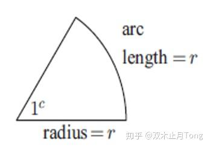

# 任意角三角函数与诱导公式

原文：https://zhuanlan.zhihu.com/p/81355179

三角函数是高中数学的重要内容，无论是国内还是国际三大体系，AP、IB、Alevel中都有三角函数的一席之地，而且要求不低，比如ALevel Further Math要求掌握利用积化和差求积分，（这一点可以参看《[三角函数积分方法总结](https://zhuanlan.zhihu.com/p/70136575)》）。而且三角函数还会和求导、积分、复数等联系在一起，所以学好三角函数非常重要。

本文主要讲解以下五个知识点：

> 1.认识弧度  
> 2.弧长与扇形面积计算  
> 3.角度的推广，任意角  
> 4.任意角下的三角函数  
> 5.[诱导公式](https://zhida.zhihu.com/search?content_id=106208407&content_type=Article&match_order=1&q=%E8%AF%B1%E5%AF%BC%E5%85%AC%E5%BC%8F&zhida_source=entity)

* * *

## 一、认识弧度

在初中我们用度(°)来衡量一个角的大小。就像克、千克、吨等同样衡量质量一样，我们现在引入弧度(Radian)来衡量一个角度的大小。那么1[弧度角](https://zhida.zhihu.com/search?content_id=106208407&content_type=Article&match_order=1&q=%E5%BC%A7%E5%BA%A6%E8%A7%92&zhida_source=entity)有多大呢？

> 弧长为半径长的弧所对的圆心角为1弧度。

半径为 $r$ 的圆其圆周长为$2\pi r$ ,对应 $360^\circ$ ,所以 $\pi=180^\circ$ ，1弧度等于 $\frac{180^\circ}{\pi}\approx 57.3^\circ$

根据弧度的定义以及 $1rad=\frac{180^\circ}{\pi}$ ,可以得到下面弧度与角度的转化公式：

常见的比如： $90^\circ=\frac{\pi}{2},60^\circ=\frac{\pi}{3},45^\circ=\frac{\pi}{4},30^\circ=\frac{\pi}{6}$ 。

注：以后数字右上角没有"o"的都默认在弧度制下面。

## 二、弧长与扇形面积计算

那么为什么要引入弧度制？

第一个引入[弧度制](https://zhida.zhihu.com/search?content_id=106208407&content_type=Article&match_order=3&q=%E5%BC%A7%E5%BA%A6%E5%88%B6&zhida_source=entity)能够帮助我们简化一些运算，比如接下去讲的[扇形弧长](https://zhida.zhihu.com/search?content_id=106208407&content_type=Article&match_order=1&q=%E6%89%87%E5%BD%A2%E5%BC%A7%E9%95%BF&zhida_source=entity)与面积的计算。

图：圆、扇形各部分英语表达

在度制下，我们是利用成比例的方法来求解弧长与面积的，也就是算出圆周与圆面积，然后根据角度大小求出占比，从而求得对应的弧长与扇形面积。不过，引入弧度制后，我们有了更加简单的公式如下：

注： [扇形面积公式](https://zhida.zhihu.com/search?content_id=106208407&content_type=Article&match_order=1&q=%E6%89%87%E5%BD%A2%E9%9D%A2%E7%A7%AF%E5%85%AC%E5%BC%8F&zhida_source=entity)$A=\frac{1}{2} \theta r^{2}=\frac{1}{2}rl$ 很像三角形面积公式底乘高除以2。

当然引入弧度不仅仅是为了便于计算扇形弧长与面积，而是把我们的**实数与角度建立起了一一对应的关系**，把初中所学的三角函数定义域从 $(0^\circ,90^\circ)$ 变成了所有实数，接下去就讲解一下任意角下的三角函数。

## 三、角度的推广，任意角(General angle)

如果在初中被问到：请画出一个大小为$(-\frac{\pi}{6})$ 的角？

我们肯定是一脸问号……我们学的角度不都是正的吗？怎么还出现负的了？？

如果我们还是像初中一样在直角三角形中去定义角度大小，那么肯定是画不出负角度的。因此，我们这里要重新给出角大小的定义。接下去我们用旋转来定义一个角度的大小：

我们规定x轴正半轴为始边，逆时针旋转为正、顺时针旋转为负，如果逆时针旋转 $\theta$ 大小会有一条终边，那么通过旋转得到的角的大小就是 $\theta$ ；如果顺时针旋转 $\theta$ 大小，那么这个角就是 $-\theta$ 。

所以，你要画一个 $-\frac{\pi}{6}$ 角，只需要顺时针旋转 $\frac{\pi}{6}$ ，那么这个角就是所要求的角了。

至此，无论什么角我们都能够画出来了，大不了多转几圈就可以了。

## 四、任意角下的三角函数

在讲解任意角的三角函数之前，我们先简单回顾一下初中是如何定义三角函数的。

初中三角函数是在一个直角三角形中定义的，有一个直角三角形 $ABC$ ：

$\sin A=\frac{B C}{A B} \quad \cos A=\frac{A C}{A B} \quad \tan A=\frac{B C}{A C}\quad \tan A=\frac{\sin A}{\cos A}$

那么如何定义任意角下的三角函数呢？

在上一小节中我们知道了任意角有一条始边与终边，类似的我们也可以定义三角函数。不妨设终边最后落在了第二象限上，如下图所示。

然后过点A作x轴的垂线，[垂足](https://zhida.zhihu.com/search?content_id=106208407&content_type=Article&match_order=1&q=%E5%9E%82%E8%B6%B3&zhida_source=entity)为B，那么我们就有了一个直角三角形 $AOB$ ，于是我们就可以在这个基础上定义三角函数了。

$\sin A=\frac{y}{\sqrt{x^2+y^2}} \quad \cos A=\frac{x}{\sqrt{x^2+y^2}} \quad \tan A=\frac{y}{x}$

类似的，无论终边落在那个象限上我们都可以利用在终边上取一点，做垂线来定义三角函数。并且，在终边上任意取一点，最后得到三角函数值是一样的。因为 $\triangle AOB\sim \triangle COD$ ,所以对应边长成比例。

但是这样子计算三角函数值也太复杂了，在终边上任取一点坐标，要算到原点的距离还需要求比值。

所以为了简化我们的计算，引入了单位圆。

> 圆心为原点、半径为1的圆称为单位圆。

那么引入单位圆后有什么好处呢？

我们可以过终边与单位圆的交点作垂线，求对应的三角函数值。因为圆周上的点到圆心的距离为1，于是 $\sqrt{x^2+y^2}=1$ ，因此我们可以发现交点的坐标x和y的值就对应了 $\cos\theta$ 和 $\sin \theta$ 。

无论 $\theta$ 是多少， $\sin \theta$与 $\cos \theta$ 我们只需要去找终边与单位圆的交点坐标 $x,y$ 就可以了。

于是，我们计算任意角的 $\cos,\sin$ 时就先画出终边，然后求与单位圆交点，比如下图我们通过计算坐标求 $\sin\frac{\pi}{3}$

根据[勾股定理](https://zhida.zhihu.com/search?content_id=106208407&content_type=Article&match_order=1&q=%E5%8B%BE%E8%82%A1%E5%AE%9A%E7%90%86&zhida_source=entity)得 $k=\frac{\sqrt{3}}{2}$ ,所以 $\sin\frac{\pi}{3}=\frac{\sqrt{3}}{2}$

在直角三角形中我们没有办法知道 $\cos 90^\circ,\sin 90^\circ$ ,但是通过单位圆我们很容易看到90°的终边与单位圆的交点为(0,1)，所以 $\cos 90^\circ=0,\sin 90^\circ=1$ 。

## 五、诱导公式

三角函数是具有周期性的，比如终边再原来的基础上再转 $2k\pi$ 还是与原来的终边重合，且有些角度的三角函数值是有关系的，比如 $\cos 30^\circ=\sin60^\circ,\sin60^\circ=\sin120^\circ$ 等等。

下面是一些常见的转化公式：

公式一：

$\begin{array}{l}{\sin (2 k \pi+\alpha)=\sin \alpha(k \in Z)} \\ {\cos (2 k \pi+\alpha)=\cos \alpha(k \in Z)} \\ {\tan (2 k \pi+\alpha)=\tan \alpha(k \in Z)}\end{array}$

公式二：

$\begin{array}{l}{\sin (\pi+\alpha)=-\sin \alpha} \\ {\cos (\pi+\alpha)=-\cos \alpha} \\ {\tan (\pi+\alpha)=\tan \alpha}\end{array}$

公式三：

$\begin{array}{l}{\sin (-\alpha)=-\sin \alpha} \\ {\cos (-\alpha)=\cos \alpha} \\ {\tan (-\alpha)=-\tan \alpha}\end{array}$

公式四：

$\begin{array}{l}{\sin (\pi-\alpha)=\sin \alpha} \\ {\cos (\pi-\alpha)=-\cos \alpha} \\ {\tan (\pi-\alpha)=-\tan \alpha}\end{array}$

公式五：

$\begin{array}{l}{\sin (2 \pi-\alpha)=-\sin \alpha} \\ {\cos (2 \pi-\alpha)=\cos \alpha} \\ {\tan (2 \pi-\alpha)=-\tan \alpha}\end{array}$

公式六：

$\begin{array}{l}{\sin (\pi / 2+\alpha)=\cos \alpha} \\ {\cos (\pi / 2+\alpha)=-\sin \alpha} \\ {\tan (\pi / 2+\alpha)=-\cot \alpha}\end{array}$

$\begin{array}{l}{\sin (\pi / 2-\alpha)=\cos \alpha} \\ {\cos (\pi / 2-\alpha)=\sin \alpha} \\ {\tan (\pi / 2-\alpha)=\cot \alpha}\end{array}$

$\begin{array}{l}{\sin (3 \pi / 2-\alpha)=-\cos \alpha} \\ {\cos (3 \pi / 2-\alpha)=-\sin \alpha} \\ {\tan (3 \pi / 2-\alpha)=\cot \alpha}\end{array}$

上述公式是弧度制版的角度转化公式，当然还有角度制版的转化公式。

但是真的有必要把上面公式一个一个记下来吗？

其实是不用的，我们只需要记住下面十字口诀就可以了：

> **奇变偶不变，符号看象限**

首先我们把需要转化的三角函数整理为**标准形式**： $\sin (\frac{\pi}{2}k\pm \alpha),\cos (\frac{\pi}{2}k\pm \alpha),\tan (\frac{\pi}{2}k\pm \alpha)$

接下去判断 $k$ 是奇数还是偶数，

> （1）如果 $k$ 是偶数，那么 $\sin (\frac{\pi}{2}k\pm \alpha)\rightarrow\sin \alpha,\cos (\frac{\pi}{2}k\pm \alpha)\rightarrow \cos \alpha,\tan (\frac{\pi}{2}k\pm \alpha)\rightarrow \tan \alpha$  
> （2）如果 $k$ 是奇数，那么  
> $\sin (\frac{\pi}{2}k\pm \alpha)\rightarrow\cos \alpha,\cos (\frac{\pi}{2}k\pm \alpha)\rightarrow \sin \alpha,\tan (\frac{\pi}{2}k\pm \alpha)\rightarrow \cot \alpha$

这样前半句就结束了，那么后半句就是要在得到的三角函数前面要加个正负号。

那么到底加正好还是负号呢？

这是由 $\sin (\frac{\pi}{2}k\pm \alpha),\cos (\frac{\pi}{2}k\pm \alpha),\tan (\frac{\pi}{2}k\pm \alpha)$ 的正负性所决定的:

> (1)如果 $\sin (\frac{\pi}{2}k\pm \alpha),\cos (\frac{\pi}{2}k\pm \alpha),\tan (\frac{\pi}{2}k\pm \alpha)$ 是正的那么诱导出来的三角函数就是正的，“+”号我们就不标出来了；  
> (2)如果 $\sin (\frac{\pi}{2}k\pm \alpha),\cos (\frac{\pi}{2}k\pm \alpha),\tan (\frac{\pi}{2}k\pm \alpha)$ 是负的那么诱导出来的三角函数前面还要添加一个负号。

**不过要注意的是，这里的 $\alpha$ 我们都当成一个锐角来处理！**

比如 $\cos(\frac{\pi}{2}-\alpha)=\sin \alpha$

> （1） $\frac{\pi}{2}\times 1$ ,那么 $k=1$ ,所以要变， $\cos(\frac{\pi}{2}-\alpha)\rightarrow \sin \alpha$ ；  
> （2） $\frac{\pi}{2}-\alpha$ 是先逆时针旋转 $\frac{\pi}{2}$ 然后再顺时针旋转一个锐角，因此终边落在了第一象限上，而 $\cos$ 看的是x值，是正的，于是 $\cos(\frac{\pi}{2}-\alpha)=\sin \alpha$ 。

再比如 $\sin(-\alpha)=-\sin \alpha$

> （1）这是 $\frac{\pi}{2}\times 0$ ， $k=0$ ，是偶数，所以不变， $\sin(-\alpha)\rightarrow \sin \alpha$ ；  
> 注：要转化为标准形式。  
> （2） $-\alpha$ 是顺时针旋转一个锐角度，那么终边落在了第四象限上，而第四象限上 $\sin$ 是负的，所以 $\sin(-\alpha)=-\sin \alpha$ 。

关于各类三角函数在各象限的正负性，我们可以画图判断。在国际教材中还有一句口诀叫“**ASTC**”，分别对应四个象限：

> （1）第一象限，A，也就是ALL，所有的 $\sin,\cos,\tan$ 都是正的；  
> （2）第二象限，S，也就是Sin，只有 $\sin$ 是正的；  
> （3）第三象限，T，也就是Tan，只有 $\tan$ 是正的；  
> （4）第四象限，C，也就是Cos，只有 $\cos$ 是正的。

记口诀或者画终边都可以判断三角函数的正负性，两种方法都可以。

上述内容都是比较基础的知识，三角函数的内容还有很多，比如在下文中我们用两种方法证明了两角和差公式，并以此讲解了二倍角公式、辅助角公式、和差化积与积化和差：

欢迎交流讨论~

想了解更多国际数学课程的知识，可参阅：