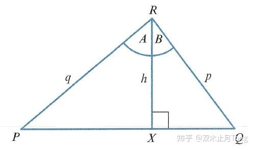

# 三角函数两角和差公式

2020年6月29日更新，补充了万能公式。

* * *

在《[任意角三角函数与诱导公式](https://zhuanlan.zhihu.com/p/81355179)》一文中，我们详细介绍了利用单位圆来求解任意角的三角函数值。但是很多角并不是那么容易求得的，因为单位圆求解对应角的三角函数值其本质还是要利用三角形的几何关系，一些特殊的角如 $30^o,45^o,60^o,90^o,120^o,135^o,150^o$ 等都很容易得到，如果不是特殊角就不是那么简单了，比如 $1^o,2^o$ 等。

有些我们是能够通过构造算得的，比如 $\sin 15^o,\cos 15^o$ ，如下图

首先先做一个 $30^o-60^o-90^o$ 的直角三角形 $ABC$ ，然后延长BC至点D，使得CD=AC。显然， $\angle D=15^o$ 。不妨设直角三角形三边长为 $1-2-\sqrt{3}$ ，根据勾股定理可知 $AD=\sqrt{1^2+(\sqrt{3}+2)^2}=\sqrt{2}+\sqrt{6}$ 。

所以, $\sin15^o=\frac{1}{\sqrt{2}+\sqrt{6}}=\frac{\sqrt{6}-\sqrt{2}}{4}$ , $\cos 15^o=\frac{\sqrt{3}+2}{\sqrt{2}+\sqrt{6}}=\frac{\sqrt{6}+\sqrt{2}}{4}$ .

那么有没有可以通过熟知的三角函数值算得未知的呢？比如 $15^o=60^o-45^o$ ，能够根据60°与45°的三角函数值算得15°的呢？

那这公式就是本文要介绍的**两角和差公式**：

$\begin{aligned} \sin (A+B) & \equiv \sin A\cos B+\cos A\sin B \\ \sin (A-B) & \equiv \sin A \cos B-\cos A \sin B \\ \cos (A+B) &\equiv\cos A \cos B-\sin A \sin B \\ \cos (A-B) & \equiv \cos A\cos B+\sin A \sin B \\ \tan (A+B) & \equiv \frac{\tan A+\tan B}{1-\tan A \tan B} \\ \tan (A-B) & \equiv \frac{\tan A-\tan B}{1+\tan A \tan B} \end{aligned}$

比如

$\sin 15^o=\sin (60^o-45^o)=\sin60^o\cos45^o-\cos60^ o \sin45^o=\frac{\sqrt{6}-\sqrt{2}}{4}$ .

注：两角和差公式其实有三组，分别是两角和差的正弦公式、余弦公式与正切公式，那么统称两角和差公式了。

接下去主要讲解：

> **（1）两角和差公式的证明；**  
> **（2）二倍角公式；**  
> **（3）万能公式；**  
> **（3）辅助角公式(合一变形公式)；**  
> **（5）积化和差与和差化积。**

* * *

## 一、两角和差公式的证明(Sum and Difference Identities)

两角和差公式的证明方法有很多种，这里主要介绍两种相对简单的证明方法：向量法与面积法。证明的思路都是先证明其中一个公式成立，然后通过诱导公式推得其它公式成立。如果不清楚诱导公式的可以参考《[任意角三角函数与诱导公式](https://zhuanlan.zhihu.com/p/81355179)》一文。

**（1）向量法**

在单位圆上取两个角 $\angle A,\angle B$ ，其终边与单位圆的交点分别是P与Q，其坐标分别为 $\mathrm{P}(\cos A, \sin A)$ ， $\mathrm{Q} (\cos B, \sin B)$ 。

根据向量点乘可知(如果不清楚，可以先看一下:[《向量点乘(Scalar product)》](https://zhuanlan.zhihu.com/p/66674587))：

$\overrightarrow{O Q} \cdot \overrightarrow{O P}=|\overrightarrow{O Q}| \cdot|\overrightarrow{O P}| \cos (A-B)=\cos A \cos B+\sin A \sin B$

而 $|\overrightarrow{O Q}| =|\overrightarrow{O P}|=1$ ，所以

$\boxed{\cos (A-B)=\cos A \cos B+\sin A \sin B}$ 。

这里已经证明了一个公式了，那么接下去就只需要变形与诱导公式了。

将 $(A+B)$ 变成 $(A-(-B))$，那么就可以套用上述公式了。

$\cos (A+B)=\cos(A-(-B))=\cos A \cos (-B)+\sin A \sin (-B)$

再利用诱导公式可知：

$\boxed{\cos (A+B)=\cos A\cos B-\sin A\sin B}$

又因为 $\sin \alpha=\cos(\frac{\pi}{2}-\alpha)$

所以， $\sin(A+B)=\cos(\frac{\pi}{2}-(A+B))=\cos((\frac{\pi}{2}-A)-B)$ ,

套用已知公式 $\cos(A-B)$ 可知：

$\cos((\frac{\pi}{2}-A)-B)=\cos(\frac{\pi}{2}-A)\cos B+\sin(\frac{\pi}{2}-A)\sin B=\sin A\cos B+\cos A\sin B$

因此， $\boxed{\sin(A+B)=\sin A\cos B+\cos A\sin B}$

最后，

$\sin(A-B)=\sin(A+(-B))=\sin A\cos(-B)+\cos A\sin (-B)$

因此，

$\boxed{\sin(A-B)=\sin A\cos B-\cos A\sin B}$

那么 $\tan (A \pm B)=\frac{\tan A \pm \tan B}{1 \mp \tan A \tan B}$ 如何证明呢？

其实有了上面的公式就很简单了，

$\tan(A\pm B)=\frac{\sin(A\pm B)}{\cos (A\pm B)}=\frac{\sin A \cos B \pm \cos A \sin B}{\cos A \cos B \mp \sin A \sin B}$

接着上下同除以 $\cos A\cos B$ ，整理一下可得：

$\boxed{\tan (A \pm B)=\frac{\tan A \pm \tan B}{1 \mp \tan A \tan B}}$

下面我们介绍另一个方法，面积法。

**（2）面积法**

已知 $\triangle RPQ$ ,过点R作PQ的垂线，垂足为X， $\angle PRQ=\angle A+\angle B$ ，如上图所示。

显然 $S_{\triangle RPQ}=S_{\triangle RPX}+S_{\triangle RXQ}$

根据三角形面积计算公式可知：

$S_{\triangle RPQ}=\frac{1}{2}pq\sin(A+B)$

而 $PX=q\cdot \sin A,\\ QX=p\cdot \sin B,\\ RX=q\cdot \cos A=p\cdot \cos B$

所以

$S_{\triangle RPX}=\frac{1}{2}PX\cdot RX=\frac{1}{2}(q\sin A) \cdot(p\cos B)=\frac{1}{2}pq\sin A \cos B$

$S_{\triangle RXQ}=\frac{1}{2}QX\cdot RX=\frac{1}{2}pq\cos A\sin B$

因此， 

$\frac{1}{2}pq\sin(A+B)=\frac{1}{2}pq\sin A \cos B+\frac{1}{2}pq\cos A\sin B$

$\boxed{\sin(A+B)=\sin A\cos B+\cos A\sin B}$

于是在上式的基础上通过变形与诱导公式就能完整推出所有的两角和差公式了，类似的可以仿照第一种方法，这里就省略了。

向量法与面积法都是两种比较简单的推导两角和差公式的方法，不过向量法需要一点向量点乘的知识，不像面积法只需要知道三角形面积公式就可以了。所以，面积法可能更加容易被接受。**不过在推导过程种都需要公式的变形，这一点就很好的体现了数学中化归的思想。**

* * *

## 二、二倍角公式(Double-Angle Identities)

有了上述两角和差公式后，我们就可以推得以下公式

（1） $\sin 2 A=2 \sin A \cos A$

因为， $\sin (A+B)=\sin A \cos B+\cos A \sin B$ ，令A=B可得：

$\boxed{\sin 2 A=2 \sin A \cos A}$

（2） $\cos 2 A=\cos ^{2} A-\sin ^{2} A$

因为， $\cos (A+B) = \cos A \cos B-\sin A \sin B$ ，令A=B可得：

$\cos 2 A=\cos ^{2} A-\sin ^{2} A$

又因为 $\sin^2A+\cos^2B=1$

所以，

$\boxed{\begin{aligned} \cos (2 A) &=\cos ^{2} A-\sin ^{2} A \\ &=1-2 \sin ^{2} A\\&=2 \cos ^{2} A-1 \end{aligned}}$

（3） $\tan 2 A =\frac{2 \tan A}{1-\tan ^{2} A}$

因为 $tan (A+B) = \frac{\tan A+\tan B}{1-\tan A \tan B}$ ，令A=B，可得：

$\boxed{\tan 2 A =\frac{2 \tan A}{1-\tan ^{2} A}}$

得到二倍角公式后，我们还可以推得其它的，比如

（1）降幂公式

上述公式只需要把 $\begin{aligned} \cos (2 A) &=1-2 \sin ^{2} A=2 \cos ^{2} A-1 \end{aligned}$ 移项化简就得到：

$\begin{array}{l}{\cos ^{2} A=\frac{1+\cos 2 A}{2}} \\ {\sin ^{2} A=\frac{1-\cos 2A}{2}}\end{array}$

（2）半角公式

把降幂公式种 A 变成 \frac{A}{2} ,然后两边开根号就可以得到半角公式：

$\begin{array}{c}{\sin \left(\frac{A}{2}\right)=\pm \sqrt{\frac{1-\cos A}{2}}} \\ {\cos \left(\frac{A}{2}\right)=\pm \sqrt{\frac{1+\cos A}{2}}} \\ {\tan \left(\frac{A}{2}\right)=\pm \sqrt{\frac{1-\cos A}{1+\cos A}}=\frac{\sin A}{1+\cos A}=\frac{1-\cos A}{\sin A}}\end{array}$

可能还有知友有疑问，那么 $\tan \left(\frac{A}{2}\right)=\frac{\sin A}{1+\cos A}=\frac{1-\cos A}{\sin A}$ ？

原因： $\tan \left(\frac{A}{2}\right)=\frac{\sin \frac{A}{2}}{\cos \frac{A}{2}}=\frac{\sin \frac{A}{2}\cdot 2\cos \frac{A}{2}}{\cos \frac{A}{2}\cdot 2\cos \frac{A}{2}}=\frac{\sin A}{1+\cos A}$ ,

且 $\frac{\sin A}{1+\cos A}=\frac{1-\cos A}{\sin A}\Leftrightarrow \sin^2 A+\cos^2A =1$ .

* * *

## 三、万能公式

万能公式有三个分别是：

$\sin a=\frac{2 \tan \frac{a}{2}}{1+\tan ^{2} \frac{a}{2}} ，\cos a=\frac{1-\tan ^{2} \frac{a}{2}}{1+\tan ^{2} \frac{a}{2}} ， \tan a=\frac{2 \tan \frac{a}{2}}{1-\tan ^{2} \frac{a}{2}}$

这是怎么来的呢？其实我们看一下 $\tan \frac{a}{2}$ 的半角公式就行了，由前面半角公式可知：

$\tan \left(\frac{A}{2}\right)=\frac{\sin A}{1+\cos A}=\frac{1-\cos A}{\sin A}$

于是得到下列等式：

$(1+\cos A)\cdot \tan \frac{A}{2}=\sin A$

$\sin A\cdot \tan \frac{A}{2}=1-\cos A$

把 $\tan \frac{A}{2}$ 当作常数，可解出 $\sin A,\cos A$ 的表达式：

$\sin A=\frac{2 \tan \frac{A}{2}}{1+\tan ^{2} \frac{A}{2}}, \cos A=\frac{1-\tan ^{2} \frac{A}{2}}{1+\tan ^{2} \frac{A}{2}}$ ，而

$\tan A=\frac{\sin A}{\cos A}=\frac{2\tan \frac{A}{2}}{1-\tan ^{2} \frac{A}{2}}$ .

* * *

## 四、辅助角公式

对于型如： $a\sin A+b\cos A$ 的三角函数我们是可以把它们合起来成为一个函数来考察的。

$a \sin A+b \cos A=\sqrt{a^{2}+b^{2}}\left(\frac{a}{\sqrt{a^{2}+b^{2}}} \sin A+\frac{b}{\sqrt{a^{2}+b^{2}}} \cos A\right)$

因为 $\-1\leq \frac{a}{\sqrt{a^{2}+b^{2}}},\frac{b}{\sqrt{a^{2}+b^{2}}}\leq1 ,且 (\frac{a}{\sqrt{a^{2}+b^{2}}})^2+(\frac{b}{\sqrt{a^{2}+b^{2}}})^2=1$

所以，必定存在一个角B，使得 $\cos B=\frac{a}{\sqrt{a^{2}+b^{2}}} , \sin B=\frac{b}{\sqrt{a^{2}+b^{2}}}$

所以，上式就变为了

$a \sin A+b \cos A=\sqrt{a^{2}+b^{2}}(\sin A\cos B+\cos A\sin B)=\sqrt{a^{2}+b^{2}}\sin(A+B)$

其中， $\tan B=\frac{b}{a}$ 。

把原本两个三角函数合成了一个，那么我们就可以来讨论其周期性、极大极小值等问题了。在竞赛中就有很多利用三角换元，然后利用辅助角公式求最值得问题。

* * *

## 五、积化和差与和差化积

这一小节要讲得就是如何实现两个三角函数的和与积之间的转化

**（1）积化和差**

$\begin{array}{l}{\sin A\cos B=\frac{1}{2}[\sin (A+B)+\sin (A-B)]} \\ 
{\cos A \sin B=\frac{1}{2}[\sin (A+B)-\sin (A-B)]} \\ 
{\cos A \cos B=\frac{1}{2}[\cos (A+B)+\cos (A-B)]} \\ 
{\sin A \sin B=-\frac{1}{2}[\cos (A+B)-\cos (A-B)]}\end{array}$

> 证明：  
> 根据两角和差公式可知：  
> $\begin{array}{l}{\sin (A+B)=\sin A \cos B+\cos A \sin B} \\ {\sin (A-B)=\sin A \cos B-\cos A \sin B}\end{array}$
> 
> 两式相加可得：  
> $\sin (A+B)+\sin (A-B)=2 \sin A \cos B$
> 
> 于是  
> $\boxed{\sin A \cos B=\frac{1}{2}[\sin (A+B)+\sin (A-B)]}$
> 
> 把上述两式相减可得：  
> $\sin (A+B)-\sin (A-B)=2 \cos A \sin B$ 
> 于是  
> $\boxed{\cos A \sin B=\frac{1}{2}[\sin (A+B)-\sin (A-B)]}$  
> 同理已知  
> $\begin{array}{l}{\cos (A+B)=\cos A \cos B-\sin A \sin B} \\ {\cos (A-B) \equiv \cos A \cos B+\sin A \sin B}\end{array}$  
> 把上述两式相加或相减，就可以得到剩下两个公式：  
> $\boxed{\begin{aligned} \cos A \cos B &=\frac{1}{2}[\cos (A+B)+\cos (A-B)] \\ \sin A \sin B &=-\frac{1}{2}[\cos (A+B)-\cos (A-B)] \end{aligned}}$

积化和差在三角函数积分中就会用到，比如下面积分

$\begin{aligned} \int \sin 3 x \cos 2 x \mathrm{d} x &=\frac{1}{2} \int(\sin 5 x+\sin x) \mathrm{d} x \\ &=-\frac{1}{10} \cos 5 x-\frac{1}{2} \cos x+c \end{aligned}$

注：关于三角函数的积分可以参看《[三角函数积分方法总结](https://zhuanlan.zhihu.com/p/70136575)》。

**（2）和差化积**

上面是把相乘转化为相加减的形式，那么下面介绍如何把加减转化为乘除，公式如下：

$\begin{array}{l}{\sin A+\sin B=2 \sin \frac{A+B}{2} \cos \frac{A-B}{2}} \\ {\sin A-\sin B=2 \cos \frac{A+B}{2} \sin \frac{A-B}{2}} \\ {\cos A+\cos B=2 \cos \frac{A+B}{2} \cos \frac{A-B}{2}} \\ {\cos A-\cos B=-2 \sin \frac{A+B}{2} \sin \frac{A-B}{2}}\end{array}$

> 证明：  
> 令 $A=\frac{A+B}{2}+\frac{A-B}{2} ， B=\frac{A+B}{2}-\frac{A-B}{2}$ 带入 $\sin A,\sin B$ 中  
> 于是  
> $\sin A=\sin \frac{A+B}{2} \cos \frac{A-B}{2}+\cos \frac{A+B}{2} \sin \frac{A-B}{2}$  
> $\sin B=\sin \frac{A+B}{2} \cos \frac{A-B}{2}-\cos \frac{A+B}{2} \sin \frac{A-B}{2}$
> 
> 两式相加可得：  
> $\boxed{\sin A+\sin B=2 \sin \frac{A+B}{2} \cos \frac{A-B}{2}}$  
> 两式相减可得：  
> $\boxed{\sin A-\sin B=2 \cos \frac{A+B}{2} \sin \frac{A-B}{2}}$  
> 同理把 $A=\frac{A+B}{2}+\frac{A-B}{2}, B=\frac{A+B}{2}-\frac{A-B}{2}$ 带入 $\cos A,\cos B$ 中，然后相加减就可以得到：  
> $\boxed{\begin{array}{l}{\cos A+\cos B=2 \cos \frac{A+B}{2} \cos \frac{A-B}{2}} \\ {\cos A-\cos B=-2\sin \frac{A+B}{2} \sin \frac{A-B}{2}}\end{array}}$  
> 附：利用上述公式证明：[三角级数求和：sinx+sin2x+……+sinnx, cosx+cos2x+……+cosnx](https://zhuanlan.zhihu.com/p/626094867)

* * *

三角函数中有一个难点就是公式很多，如果一个一个去背那肯定是会奔溃的，所以我们还是要掌握其原理，会推导重要的公式，比如两角和差公式。那么即使我们忘记了公式，也知道如何推导它。事实是：我们见的多了、用的多了，公式就自然而然记住了。

本文详细介绍了两角和差公式，并以此出发，讲解并证明了二倍角公式、辅助角公式以及积化和差与和差化积公式。之后我们可以通过问题再来讲讲这些公式的用处，多用了就记住了。

欢迎大家交流讨论~
