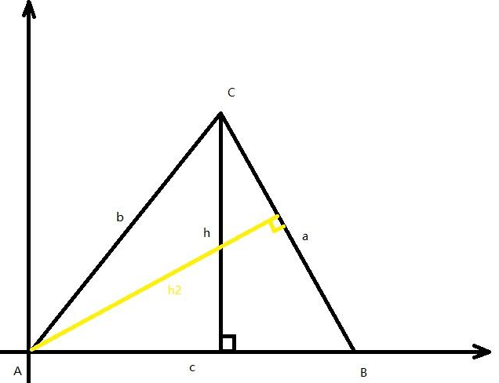

# 正弦定理

## 面积法证明

$S=\frac{1}{2}ch = \frac{1}{2}cb\sin A = \frac{1}{2}ca\sin B$

同理可得：

$S=\frac{1}{2}ch_2 = \frac{1}{2}ac\sin B = \frac{1}{2}ab\sin C$

可得：

$\frac{1}{2}cb\sin A = \frac{1}{2}ca\sin B = \frac{1}{2}ab\sin C$

同除 $\frac{1}{2}abc$ 得：

$\frac{sinA}{a} = \frac{sinB}{b} = \frac{sinC}{c}$