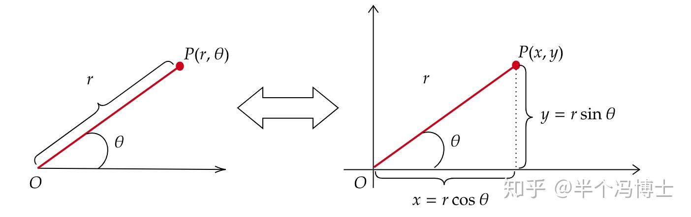
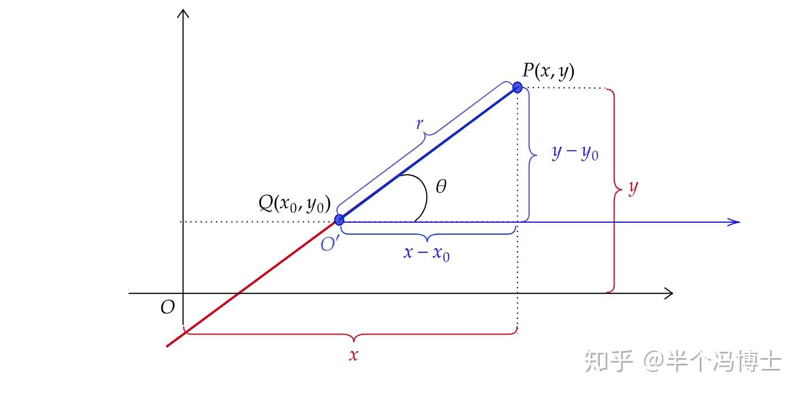
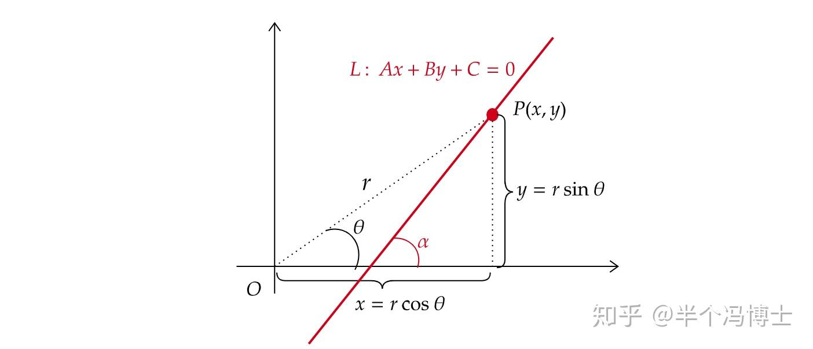
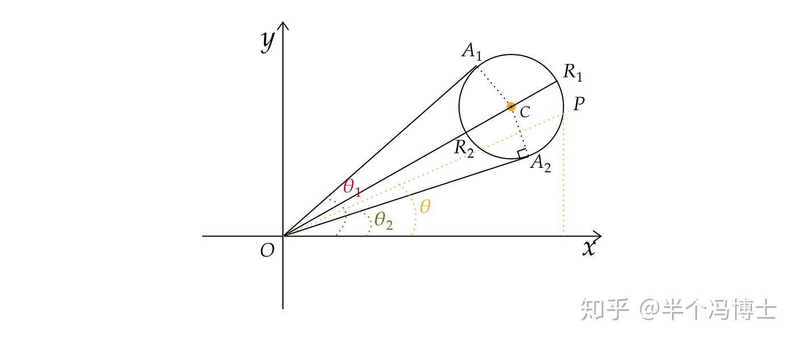
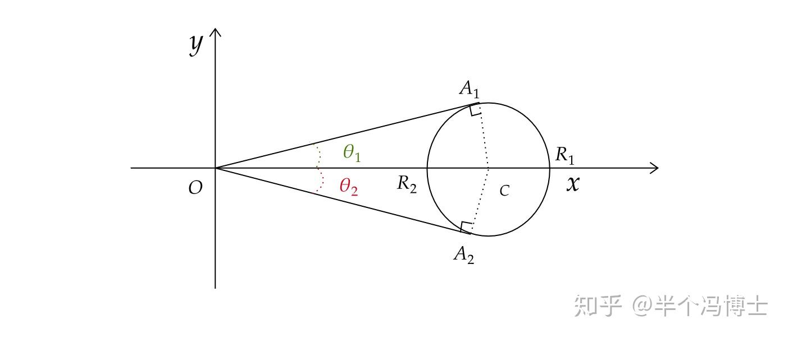
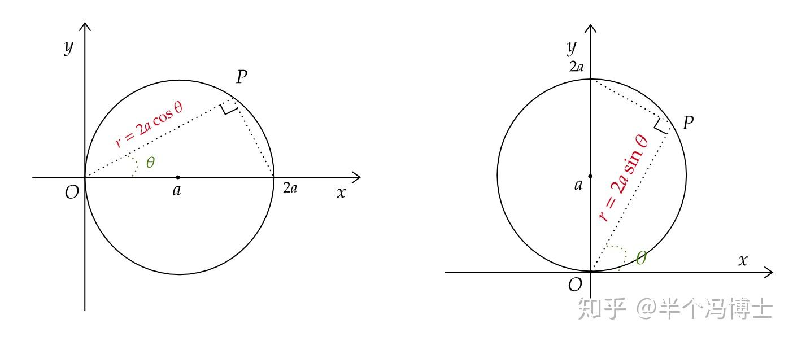
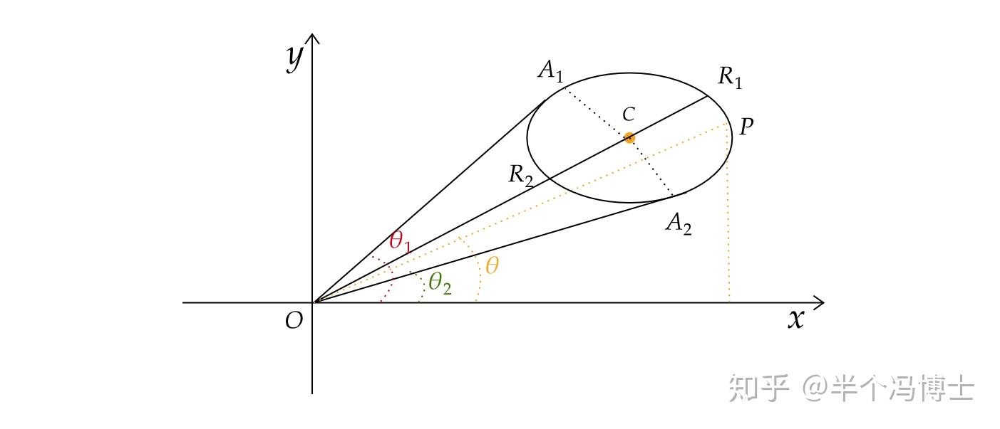
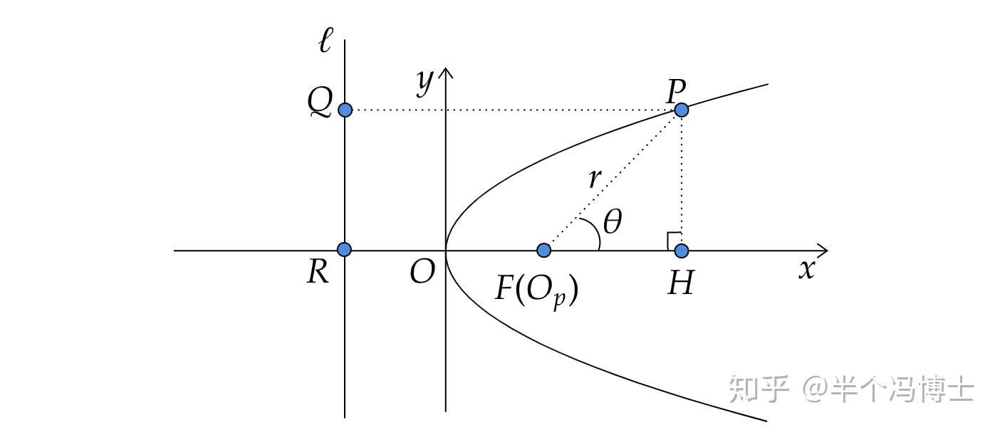
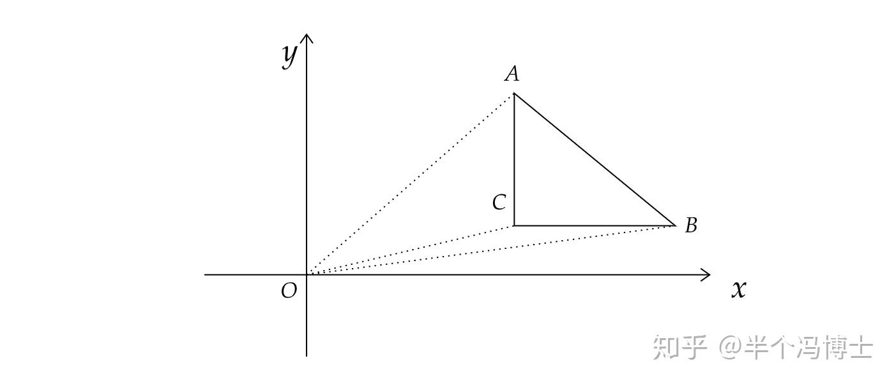
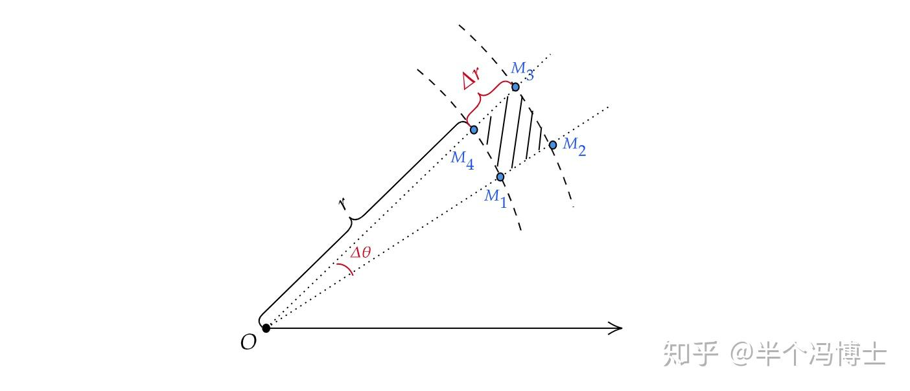

# 极坐标

> **目 录**  
> —、极坐标的基本概念  
> 二、极坐标和直角坐标的转换  
> 三、直角坐标系下的曲线方程转换为极坐标系下的曲线方程  
> (1）圆心在原点的圆: $r=a,(a>0)$  
> (2）圆心过原点的椭圆方程: $r(\theta) = \sqrt{ \left(a \cos\theta\right)^2 +\left(b \sin\theta\right)^2}$  
> (3）直线  
> 四、对称中心不在原点的封闭曲线  
> (1）圆心不在原点的圆  
> (2）对称中心不在原点的椭圆  
> (3）圆锥曲线的统一极坐标方程（极心在圆锥曲线的焦点)  
> 五、用极坐标描述区域  
> (1）圆形区域  
> (2）直线围成的区域  
> 六、用极坐标处理微元  
> 七、多元微积分中的极坐标变换  
> (1）标量函数的坐标变换  
> (2）二重积分中的坐标变换  
> (3）扩展到三重积分的情形

## **一、极坐标的基本概念**

简单地说，极坐标就是：**用角度和长度描述位置的坐标系**。结合上图明确这三点：

*   以原点 $O$ 为起点的射线作为参考系， 称$O$ 为**极点**，这条射线为**极轴**
*   点 $P$ 到原点的距离记为 $\overline{OP}=r(\ge0)$，称为**极径**
*   从参考系射线出发逆时针旋转到$OP$ 所经过的角度记为 $\theta\in [0,2\pi)$，称为**极角**

> 从计算的角度上讲$\theta$ 的取值范围也可以根据实际问题灵活处理。比如可以写为 $\theta\in [-\pi,\pi)$ 等。下文会有相应例子。  

有了上述三个要素，空间中任意一点都可以用序对 $(r,\theta)$ 表示。

## **二、极坐标和直角坐标的转换**

将一个点 $P(r,\theta)$ 转换为平面坐标系 $P(x,y)$ 其实非常简单，只需要一个**三角形**，如下图：

图中所示的方法可应用于极坐标和直角坐标的**相互转换**。上图描述的方式还可以总结为以下的表达式：

$\left\{\begin{matrix} x= r\text{cos}\theta \\ y= r\text{sin}\theta \end{matrix}\right. \Leftrightarrow \left\{\begin{matrix} r = \sqrt{x^2+y^2} \\ \theta = \arcsin \frac{y}{r}= \arcsin \frac{y}{x^2+y^2 } \end{matrix}\right.$

但是要**特别注意**：上式中 $\theta$ 的值仅对上图展示的情况($P$在第I象限)成立(此时$\theta\in[0,\frac{\pi}{2}]$，同时该点不能为原点)。对于其它象限则需要根据具体情况进行处理。

> 上述转换方法仅限于二者圆点相同，且极坐标参考系与直角坐标的 $x$ 轴方向相同的情况。下文将出现一些与上述示图不同的情形。  

## **三、直角坐标系下的曲线方程转换为极坐标系下的曲线方程**

### **（1）圆心在原点的圆：$r=a,(a>0)$**

用极坐标来描述圆的方程是最为合适的，所以从这个例子开始。考虑一个圆的方程：

$$ x^2+y^2=a^2,(a>0)$$

先考虑该圆上任意一点 $P(x,y)$ ，其极坐标表示为 $P(r,\theta)$。由（1）式可知：

$$ r = \sqrt{x^2+y^2} =a$$

注意，由于在圆上 $\theta$ 可以取 $[0,2\pi)$ 中任意值，因此在书写方程时可以不写出 $\theta$ 的取值范围，可以理解为它的取值不受限制。因此圆在极坐标中的方程就可以写为：

$\color{blue}{r =a,(a>0)}$

### **(2）圆心过原点的椭圆方程：**

圆其实可以看作是椭圆的一种特殊情况，由于也有圆周的特点，所以它也很适合用极坐标来表示。

但是要**注意**：这里我们要讨论的情形仍然是**在极坐标和直角坐标的原点重合的前提下**。

此时我们设一个对称中心在原点上的椭圆：

$$ \left(\frac{x}{a}\right)^2+\left(\frac{y}{b}\right)^2 =1,(a,b>0)$$

在极坐标中任意一点可以写成：

$$ \left\{\begin{matrix} x= r \cos \theta \\ y= r \sin \theta \end{matrix}\right.$$

从几何意义不难看出 $\theta$ 就是点 $P$ 在极坐标下的极角，因此在极坐标下有以下式子：

$$ r(\theta) = \frac{ab}{\sqrt{ \left(a \cos\theta\right)^2 +\left(b \sin\theta\right)^2}}=\frac{b}{\sqrt{1-(e \cos \theta)^{2}}}$$

> 这里 $e$ 是椭圆的离心率。这种记法的推导方式稍繁琐一些：  
> 先将直角坐标系中的椭圆方程进行变换：  
> 

$$ \left(bx\right)^2+\left(ay\right)^2 =(ab)^2$$

 再代入极坐标变换：  
> 

$$ \left(br \cos \theta\right)^2+\left(ar \sin\theta\right)^2 =(ab)^2$$

 提出 $r^2$:  
> 

$$ r^2\left(\left(b \cos \theta\right)^2+\left(a \sin\theta\right)^2 \right)=(ab)^2$$

 移项再开方得到：  
> 

$$ r=\frac{ab}{\sqrt{{\left(b \cos \theta\right)^2+\left(a \sin\theta\right)^2 }}}$$

 如果分子分母同时除以 $a$，再注意到 $e=\frac{\sqrt{b^2-a^2}}{a}$，就可以得到：  
> 

$$ \begin{align} r&=\frac{b}{\sqrt{{\left(\frac{b}{a} \cos \theta\right)^2+\left( \sin\theta\right)^2 }}}\\ &= \frac{b}{\sqrt{-\left( \frac{b^2}{a^2}-1\right) \cos^2 \theta+\left(\cos^2+ \sin^2\theta\right) }}\\ &=\frac{b}{\sqrt{1-(e \cos \theta)^{2}}} && \color{Red}{ \left ( \frac{b^2}{a^2}-1=\frac{b^2-a^2}{a^2}=e^2 \right ) } \end{align}$$

### **（3）直线：**

直线方程在极坐标系下的描述其实相对复杂一些，因为它的几何形态并不适合用长度和角度来描述。但研究它在极坐标下的坐标是很好的练习。

*   **直线方程有一种最简单的记法**：

$\color{blue}{\theta=\theta_0}$

从极坐标的几何意义上十分好理解：**长度任意，对极角为 $\theta_0$（常数）的点集**。这当然就是直线，而 $\theta_0$ 就是它对应直角坐标系中的倾斜角。

但上述记法也有一个缺点：**它描述的直线必须通过极坐标极点，且该极点和直角坐标中的原点重合**。否则就无法将直角坐标系中的点和极坐标中的点对应起来。

为了描述更一般的情况，我们来讨论一下极坐标下的原点和直角坐标系下原点不一致时的情况。

*   **指定直线上一个点为极从标极点的情形**

假设直角坐标系中 $Q(x_0,y_0)$ 极坐标的极点，如下图所示：

这样一来就只需要考虑直线上任意一点$P(x,y)$相对该参考点$Q(x_0,y_0)$的情况。在上图蓝色三角形中两个直角边的长度分别是$y-y_0$和$x-x_0$，注意此时若长度出现负数我们则认为它表示$P$点在$Q$点的左下方。

很明显，点 $P$ 的直角坐标如果用对应极坐标中的参数写出就是下式：

$P(x,\,y) \equiv (x_0 + r\cos \theta ,\,y_0 + r\sin \theta )$

不难想到，对给定的直线方程，其对应的倾斜角自然可以直接算出，或者利用斜率公式 $\tan \theta=k$ 算出 $\sin \theta,\cos \theta$。而在该直线上的任意一点 $A(x_A,y_A)$，也可以由上式算出其对应的 $r_A$。

*   **极坐标系极点与直角坐标系原点重合，但直线不过原点的情形**

注意，此时看似更加复杂，但从代数运算上来讨论其实仍然十分简单。此时描述的情况就是本文第二节描述的情况，也可以总结成上图。此时直角坐标系中任意一点 $P(x,y)$ 在极坐标下有（1）式成立。那么假设 $P$ 在以直线 $L$ 上：

$$ Ax+By+C= 0$$

只需要将（1）式代入直线方程：

$$ A\cdot(r\cos\theta)+B\cdot(r\sin\theta )+C=0$$

可以很容易得到 $r=r(\theta)$ 的具体表达式：

$\color{blue}{r = -\frac{C}{A\cos\theta+B \sin\theta}}$

注意这个式子也并不能描述所有的情况，因为分母有可能为 $0$。这种情况下：

$$ A\cos\theta+B \sin\theta=0 \Rightarrow (\tan \theta= )\frac{\sin\theta}{\cos\theta}=-\frac{A}{B}$$

而注意到一般式直线方程中 $-\frac{A}{B}=k$ （$k$ 是直线的斜率，注意上面图中可以看出此时 $\theta$ 不是倾斜角）。由几何意义不难想到，只有在1种情况下可能出现：**直线过原点时**。而这时，我们只需要回到上述情形中的定义即可，即将直线写为：$\theta=\theta_0$。

由于这段的叙述较长，我们小结一下。直角坐标系的直线在极坐标下可以写为：

*   **两个坐标系原点重合时**：$\color{blue}{\theta=\theta_0}$
*   **极坐标极点为直线上的某一点时**：$\color{blue}{\theta=\theta_0}$，同时辅以（L-2）式进行转换。
*   **极坐标系极点与直角坐标系原点重合，但直线不过原点时**： $\color{blue}{r = -\frac{C}{A\cos\theta+B \sin\theta}}$

> 从本节讨论中可以看到，实际上用极坐标来描述曲线时都非常简洁。这是因为极坐标直接使用角度来描述点，因此可以很好地体现曲线的“曲”这一性质。因此在解决许多与曲线相关的问题时，极坐标就经常用到。  

## **四、对称中心不在原点的封闭曲线**

下面要讨论的问题在微积分中时常会遇到。

### **（1）圆心不在原点的圆**

这个问题是圆的极坐标中最麻烦的一个，由于圆心不在原点，所以必须要考察清楚一些关键的参数，否则方程描述的图形就并是圆。

*   **一般的情形**

我们考虑下图：

圆 $C(x_C,y_C)$ 在直角坐标系中的任意位置，它的方程可以写为：

$(x-x_C)^2+ (y-y_C)^2=a^2$

此时我们仍然以 $x$ 轴的右半段作为极坐标的轴，那么该圆上任意一点 $P(x,y)$ 的坐标可以写为：

$$ \left\{\begin{matrix} x= r \cos \theta \\ y= r \sin \theta \end{matrix}\right.$$

注意，此时$r$ 是该点到原点的距离 $|OP|$， $\theta$ 是从 $x$ 轴到 $OP$ 的角度。因此上述坐标并**不是常规的圆的参数方程**。

由于 $P$ 点在圆上，因此可以将其代入圆的方程：

$\color{blue}{(r \cos \theta-x_C)^2+ (r \sin \theta -y_C)^2=a^2}$

该方程即是圆 $C$ 在极坐标下的方程。但该方程中很难直接看出以下两个问题：

*   $r$ 的取值范围是多少？
*   $\theta$ 的取值范围是多少？

从这个方程上很难直接看出因此需要进一步从几何上分析。

**先考虑 $r$ 的取值**：连接$OC$并延长至与圆相交，延长线与圆的交点记为 $R_1$，而线段 $OC$ 与圆的交点记为 $R_2$。容易证明$OR_1,OR_2$ 分别是 $O$ 与圆上的点的最长和最短的线段。又知道 $|OC|=\sqrt{x_C^2+y_C^2}$，那么易得：

$$ \left\{\begin{matrix} |OR_1|=|OC|+a =\sqrt{x_C^2+y_C^2}+a \\ |OR_2|=|OC|-a = \sqrt{x_C^2+y_C^2}-a \end{matrix}\right.$$

因此 $r$ 的取值范围为：

$\sqrt{x_C^2+y_C^2}-a \le r \le \sqrt{x_C^2+y_C^2}+a$

而 $\theta$ 的取值范围则更为复杂。仍然从几何上出发：过 $O$ 分别作圆的两条切线，上、下方切点分别记作 $A_1,A_2$。同样容易证明$\angle A_1Ox,\angle A_2Ox$ 分别是 $\theta$ 的最大、最小值。最麻烦的问题就在于此，要算出这两个角度则必须算出 $A_1,A_2$ 的坐标。那么就要求解以下二元二次方程组：

$$ \left\{\begin{matrix} (x_A-x_C)^2 + (y_A-y_C)^2 = a^2 \\ x_A^2 + y_A^2 = x_C^2+y_C^2-a^2 \end{matrix}\right.$$

> 式中第一个方程表示点在圆上。  
> 第二个方程是勾股定理：由于 $|OC|=\sqrt{x_C^2+y_C^2}$， 于是在三角形 $\triangle A_1OC$ 或 $\triangle A_2OC$ 中有  
> $|OA_1|^2=|OC|^2-a^2$ 或 $|OA_2|^2=|OC|^2-a^2$。  

那么解出 $A_1,A_2$ 的坐标后，就可以利用反三角函数算出图中 $\theta_1,\theta_2$ 的值了。另外，还需要注意在不同象限时这两个点的计算方式也不一样。在上图所示的情况中，这个范围可以写成：

$$ \arctan\frac{y_{A_2}}{x_{A_2}} \le \theta\le\arctan\frac{y_{A_1}}{x_{A_1}} \\ $$

*   **更为常见的一种情形是圆心在直角坐标系中的某一个轴上**

例如下图所示的情况，圆心在 $x$ 轴上：

此时 $r$ 和 $\theta$ 的取值范围就简单得多。由几何意义容易得到 $r$ 的取值范围为：

$$ x_C-a \le r \le x_C+a$$

而 $\theta$ 的取值范围为：

$$ \arcsin(-\frac{a}{x_C})\le \theta\le\arcsin(\frac{a}{x_C})$$

*   **在这个大前提下还有两种最为特殊的情形，圆心在某一个轴上且圆过原点：**

上图左边的情况，圆心在 $x$ 轴，半径为 $a$。这种情况在考虑点的极径 $r$ 时最容易出错。此时要考虑的三角形是**以圆的直径为斜边**的直角三角形，那么显然此时极径 $|OP|$ 就是 $r=2a\cos\theta$。对应地，右图展示的情况就是圆心在 $y$ 轴的情形，此时要注意另外一个问题是 $P$ 点对应的角度是 $\theta$ ，要注意$\angle POy$ 的角度刚好是 $\frac{\pi}{2}-\theta$。因此由图示的三角形可以得出极径 $|OP|=r=2a\sin\theta$。

### **（2）对称中心不在原点的椭圆**

椭圆的情况如下图所示：

类似对圆的讨论，对任意一椭圆：

$$ \left ( \frac{x-x_C}{a} \right )^2 + \left ( \frac{y-y_C}{b} \right )^2 =1,(a,b>0)$$

仍然用极坐标公式进行替换，可以得到：

$\color{blue}{\left ( \frac{r \cos \theta-x_C}{a} \right )^2 + \left ( \frac{r \sin \theta-y_C}{b} \right )^2 =1}$

但这里对 $r,\theta$ 的取值范围的讨论更为复杂，需要用到大量平面解析几何中的技巧。当然如果椭圆的对称中心若在直角坐标系中的某一个轴上，问题会简单一些。但本文不展开讨论。

一般在讨论极坐标下的圆锥曲线时，通常是考虑**极心在其焦点**最为方便：

### **（3）圆锥曲线的统一极坐标方程（极心在圆锥曲线的焦点）**

**圆锥曲线的统一定义：** 一动点 $P$ 到某一定点 $F$ 的距离与其到一定直线 $\ell$ 的距离之比为一定常数 $e$ （离心率），该动点 $P$ 的轨迹为圆锥曲线。

由这一定义，再考虑极心在某一焦点（上述动点），可以很容易地写出圆锥曲线的统一极坐标方程。考虑下图：

图中 $F$ 为定点（焦点），同时也作为极坐标的极心。直线 $\ell$ 为定直线（准线）。$PQ\perp \ell$ 并交于点 $Q$ ，$\ell$ 与 $x$ 轴交于点 $R$ 。那么根据定义：

*   动点到定点的距离为： $r=|PF|$
*   动点到定直线的距离为：$|PQ|=|RF|+|PF|\cdot \cos \theta =|RF|+r\cdot \cos \theta$
*   焦点到准线的距离通常记为：$p=|RF|$

于是根据定义：

$$ e=\frac{|PF|}{|PQ|}=\frac{r}{p+r\cos \theta} \\ $$

根据上式可以写出 $r=r(\theta)$，于是得到**极坐标下圆锥曲线的统一方程**：

$\color{blue}{r=\frac{e p}{1-e \cos \theta}} \tag{CO-1} $

> 这里再次强调极点在圆锥曲线的焦点上。  

当 $e$ 取不同值时可对应不同的圆锥曲线，总结如下：

$\begin{array}{|l|l|l|l|} \hline \text { 圆锥曲线 } & \text { 方程 } & 离心率公式& e\text { 的取值范围 } \\ \hline \text { 圆} & x^{2}+y^{2}=a^{2} & 0 & 0 \\ \hline \text { 椭圆} & \frac{x^{2}}{a^{2}}+\frac{y^{2}}{b^{2}}=1 & \sqrt{1-\frac{b^{2}}{a^{2}}} & 0<e<1 \\ \hline \text { 抛物线} & y^{2}=4 a x & 1 & \text { 1 } \\ \hline \text { 双曲线} & \frac{x^{2}}{a^{2}}-\frac{y^{2}}{b^{2}}=1 & \sqrt{1+\frac{b^{2}}{a^{2}}} & e>1 \\ \hline \end{array}$

> 注意，圆是一种特殊的椭圆。此时它的离心率仍然由椭圆的离心率公式计算，但此时 $a=b$，因此它的离心率为$0$。因此上述形式的统一方程不能描述圆的方程。  
> 在这种统一方程的定义下，圆的圆心就是焦点，因此它仍然是圆心在极点处的情形。而此时它的极坐标方程为 （C-1）式，即 $r=1$。  

## **五、用极坐标描述区域**

由封闭曲线所围成的区域主要是由不等式进行描述，在某些情况下使用极坐标更为方便。

### **（1）圆形区域**

上文已经提到，圆是最合适在极坐标下描述的曲线。由圆心在原点上的圆围成的区域在直角坐标系下写为：

$$ x^2+y^2\le a^2 ,(a>0) \\ $$

这个区域在极坐标下最为简单：

$\color{blue}{ \left\{\begin{matrix} x= r \cos \theta \\ y= r \sin \theta \end{matrix}\right. ,\quad \left(\begin{matrix} 0 \le r\le a \\ 0\le \theta < 2\pi \end{matrix}\right)}$

这个记法在考虑重积分时十分方便，可极大减小运算量。

另外，由上文所述若圆心不在原点，其极坐标描述的区域则应写为：

$\color{blue}{ \left\{\begin{matrix} x= r \cos \theta \\ y= r \sin \theta \end{matrix}\right. ,\quad \left(\begin{matrix} \sqrt{x_C^2+y_C^2}-a \le r \le \sqrt{x_C^2+y_C^2}+a \\ \theta_1\le \theta\le \theta_2 \end{matrix}\right)}$

当然这里的取值范围也要根据具体的几何背景进行单独讨论。

特别地，在积分区域划分时会经常遇到第四节第（1）部分讨论的圆心在直角坐标系中某一个轴上的情况，此时圆对应的区域为：

$\color{blue}{ \left\{\begin{matrix} x= r \cos \theta \\ y= r \sin \theta \end{matrix}\right. ,\quad \left(\begin{matrix} x_C-a \le r \le x_C+a \\ \arcsin(-\frac{a}{x_C})\le \theta\le\arcsin(\frac{a}{x_C}) \end{matrix}\right)}$

> 注意这里最容易把它和圆的参数方程混淆，从而导致错误。  

### **（2）直线围成的区域**

直线围成的区域并不适合由极坐标来描述，这里只作为拓展或者练习简单介绍。

这里我们考虑一种简单的情形--直角三角形。如上图所示，三角形 $\triangle ABC$ 中 $\angle C$ 为直角。而这个三角形中的三条直线均是第三节描述的情况：**极坐标系原点与直角坐标系原点重合，但直线不过原点**，此时三条直线的方程都应写为： $\color{blue}{r = -\frac{C}{A\cos\theta+B \sin\theta}}$ 的形式。不过有意思的是，由于 $AC,BC$ 分别垂直于 $x,y$ 轴，因此它们对应的一般方程中 $y,x$ 的系数均为零，从而以上三条直线我们可以写成：

$$ \left\{\begin{matrix} AC: r=\frac{x_A}{\cos \theta} \\ BC: r=\frac{y_B}{\sin \theta} \\ AB: r=-\frac{\mu}{\alpha\cos\theta+ \beta \sin\theta} \end{matrix}\right.$$

> 这里约定直角坐标系中：$AB:\alpha x+ \beta y + \mu=0$  

而上述方程中 $r,\theta$ 的取值范围则可以由勾股定理分情况讨论即可得到。类似地，矩形或多边形区域也是类似的讨论方式。**当然，这种处理通常并不能简化问题，因此这里也不作深入展开。**

## **六、用极坐标处理微元**

积分中通常在处理孤形的时候会用到极坐标。这一点从上面一些例子也不难理解，因为极坐标在处理弧线时会让问题更加简单。这里我们就回顾一下极坐标下的面积微元是如何分析和推导的。

图中极角增加了微小的量 $\Delta \theta$，极径也变化了微小的量$\Delta r$，同时注意到：

*   **圆弧** $\stackrel{\frown}{M_1M_4}$ ​：半径为 $r$, 圆心在极点$O$
*   **圆弧** $\stackrel{\frown}{M_2M_3}$ ：半径为 $r+\Delta r$, 圆心在极点$O$

阴影部分的面积为大扇形的面积减去小扇形的面积，注意到扇形面积公式：$S=\frac{1}{2}r^2\cdot\theta$，因此：

*   大扇形：$S_{扇M_2OM_3}=\frac{1}{2}(r+\Delta r)^2\cdot\Delta\theta$
*   小扇形：$S_{扇M_1OM_4}=\frac{1}{2}r^2\cdot\Delta\theta$

由此可以得出圆环$M_1M_2M_3M_4$ 的面积：

$$ \begin{align} S_{环}&=S_{扇M_2OM_3}-S_{扇M_1OM_4}\\ &=\frac{1}{2}(r+\Delta r)^2\cdot\Delta\theta-\frac{1}{2}r^2\cdot\Delta\theta \\ &= \frac{1}{2}(r^2+2r\Delta r +(\Delta r)^2-r^2)\cdot\Delta\theta \\ &= \frac{1}{2}(2r\Delta r +(\Delta r)^2)\cdot\Delta\theta \end{align} \\ $$

注意到这几个问题：

*   $d\theta \approx \Delta\theta $
*   $(\Delta r)^2$ 是 $2r\Delta r$ 的高阶无穷小，因此可以忽略
*   $dr\approx \Delta r$
*   $S_{环}$ 就是面积微元 $d\sigma$

因此上述公式就可以简化为：

$\color{Blue}{ S_{环}=d\sigma=\frac{1}{2}(2r\Delta r)\cdot\Delta\theta=r\cdot dr d\theta} \tag{D-1} $

明确这个简单的过程之后，就很容易记住这个公式了。

> 上述内容里面有两个点一开始可能不好理解：$dr\approx \Delta r$ 和忽略 $(\Delta r)^2$ 。其实这个问题也很简单，不外乎等价无穷小的应用。  
> 1、由于$\Delta r=d r+o(\Delta r)$，因此 $\Delta r\sim dr$；同理 $d\theta \sim\Delta\theta $ 。  
> 2、注意到 $r\Delta r\Delta\theta+\frac{1}{2}(\Delta r)^2\Delta\theta = r\Delta r\Delta\theta+\operatorname{o}(r\Delta r\Delta\theta)$ ，那么$r\Delta r\Delta\theta+\frac{1}{2}(\Delta r)^2\Delta\theta \sim r\Delta r\Delta\theta)$   
> 认识到这两点再考察二重积分的定义式：  
> $\iint_{D} f(x, y) \mathrm{d} \sigma=\lim _{\lambda \rightarrow 0} \sum_{i=1}^{n} f\left(\xi_{i}, \eta_{i}\right) \Delta \sigma_{i}$ 注意这里二重积分只要存在那么右端极限就存在，这和极坐标的处理没有关系。于是我们可以考虑将面积微元的完整式子写进来：  
> 

$$ \lim _{\lambda \rightarrow 0} \sum_{i=1}^{n} f\left(\xi_{i}, \eta_{i}\right) \Delta \sigma_{i} = \lim _{\lambda \rightarrow 0} \sum_{i=1}^{n} f\left(\xi_{i}, \eta_{i}\right) \color{Red}{\left ( r_i\Delta r_i\Delta\theta_i +\frac{1}{2}(\Delta r_i)^2\Delta\theta_i\right )}$$

 这时如果使用等价无穷小的替换，是对**整个括号部分**进行替换，是满足替换条件的。从而得到：  
> 如果这个极限存在：  
> 

$$ \iint_{D} f(x, y) \mathrm{d} \sigma=\lim _{\lambda \rightarrow 0} \sum_{i=1}^{n} f\left(\xi_{i}, \eta_{i}\right) \Delta \sigma_{i} = \lim _{\lambda \rightarrow 0} \sum_{i=1}^{n} f\left(\xi_{i}, \eta_{i}\right) \left ( r_i\Delta r_i\Delta\theta_i \right )$$

## **七、多元微积分中的极坐标变换**

极坐标变换在多元微、积分中是最为常用的一种手段，它通常可以

### **（1）标量函数的坐标变换**

标量函数的坐标变换比较简单，直接使用多元函数的求导的链式法则即可。

例如我们设函数 $u=u(x,y)$，考虑极坐标变换

$$ \left\{\begin{matrix} x= r\text{cos}\theta \\ y= r\text{sin}\theta \end{matrix}\right. \\ $$

假设我们已知它对 $x,y$ 的偏导，那么它对极坐标变量的偏导为：

$\begin{aligned} \frac{\partial u}{\partial r} &= \frac{\partial u}{\partial x} \frac{\partial x}{\partial r}+ \frac{\partial u}{\partial y} \frac{\partial y}{\partial r} \\ \frac{\partial u}{\partial \theta} &=\frac{\partial u}{\partial x} \frac{\partial x}{\partial \theta}+\frac{\partial u}{\partial y} \frac{\partial y}{\partial \theta} \end{aligned}$

> 注意，这里我们用到了全导数的概念。  

反之，如果已知它对 $r,\theta$ 的偏导，也可以计算出它对 $x,y$ 的偏导：

$$ \begin{aligned} \frac{\partial u}{\partial x} &=\frac{\partial u}{\partial r} \frac{x}{\sqrt{x^{2}+y^{2}}}-\frac{\partial u}{\partial \varphi} \frac{y}{x^{2}+y^{2}} \\ &=\cos \varphi \frac{\partial u}{\partial r}-\frac{1}{r} \sin \varphi \frac{\partial u}{\partial \varphi} \\ \frac{\partial u}{\partial y} &=\frac{\partial u}{\partial r} \frac{y}{\sqrt{x^{2}+y^{2}}}+\frac{\partial u}{\partial \varphi} \frac{x}{x^{2}+y^{2}} \\ &=\sin \varphi \frac{\partial u}{\partial r}+\frac{1}{r} \cos \varphi \frac{\partial u}{\partial \varphi} \end{aligned}$$

*   **这里有一道十分经典的例题**：Laplace算子的二维极坐标形式。二维Laplace方程：

$$ \frac{\partial^{2} u}{\partial x^{2}}+\frac{\partial^{2} u}{\partial y^{2}}=u_{x x}+u_{y y}=0$$

它在极坐标下的形式是：

$$ \frac{\partial^{2} u}{\partial r^{2}}+\frac{1}{r} \frac{\partial u}{\partial r}+\frac{1}{r^{2}} \frac{\partial^{2} u}{\partial \theta^{2}}=0$$

整个过程的推导比较麻烦，但对于熟悉二元函数的链式法则非常有用，建议自行练习。另外，虽然方程看起来并没有变得更加简单，但在实际问题中，如果要处理的边界是在圆（或者半圆、扇形）上，那么将会极大地简化问题。

> 完整推导可以参考：**[Laplace’s equation in the Polar Coordinate System](https://zhuanlan.zhihu.com/p/203377553/edit)**  

### **（2）二重积分中的坐标变换**

上面已经提到二重积分中极坐标的变换方法。这里再从另一个角度出发来讨论一下这个问题。

首先注意到本节的式（P-1），它实际上可以写成矩阵形式：

$$ \begin{bmatrix} \frac{\partial u}{\partial r} \\ \frac{\partial u}{\partial \theta} \end{bmatrix} = \color{blue}{ \begin{bmatrix} \frac{\partial x}{\partial r}& \frac{\partial y}{\partial r} \\ \frac{\partial x}{\partial \theta}& \frac{\partial y}{\partial \theta} \end{bmatrix} } \color{black}{ \begin{bmatrix} \frac{\partial u}{\partial x} \\ \frac{\partial u}{\partial y} \end{bmatrix}}$$

上式中蓝色部分是Jacobi矩阵的转置，Jacobi矩阵通常也可以记为：

$$ \mathbf{J}=\frac{\partial (x,y)}{\partial(r,\theta)}=\begin{bmatrix} \frac{\partial x}{\partial r}& \frac{\partial y}{\partial r} \\ \frac{\partial x}{\partial \theta} & \frac{\partial y}{\partial \theta} \end{bmatrix}$$

事实上，类似式（P-1），我们也可以给出极坐标变换时微分 $dx,dy$ 的变化（这里仍然使用全微分）：

$$ \begin{bmatrix} dx \\ dy \end{bmatrix} = \begin{bmatrix} \frac{\partial x}{\partial r}& \frac{\partial x}{\partial \theta} \\ \frac{\partial y}{\partial r}& \frac{\partial y}{\partial \theta} \end{bmatrix} \begin{bmatrix} dr\\ d\theta \end{bmatrix} = \frac{\partial (x,y)}{\partial(r,\theta)} \begin{bmatrix} dr\\ d\theta \end{bmatrix}$$

**特别注意**：此时虽然已经确定了 $dx,dy$ 与 $dr,d\theta$ 间的关系，但并不能直接带入 $dxdy$ 对面积微元进行替换！

正确的做法是：

$\color{blue}{dxdy = \det\left[\frac{\partial (x,y)}{\partial(r,\theta)}\right] drd\theta}$

这里$ \det\left[\frac{\partial (x,y)}{\partial(r,\theta)}\right]$  是Jacobi矩阵对应的行列式，也称为 Jacobi行列式。上式便是二重积分时极坐标的变换公式。上述的极坐标变换对应的Jacobi行列式为：

$$ \det\left[\frac{\partial (x,y)}{\partial(r,\theta)}\right] =\left|\begin{array}{cc} \frac{\partial x}{\partial r} & \frac{\partial x}{\partial \theta} \\ \frac{\partial y}{\partial r} & \frac{\partial y}{\partial \theta} \end{array}\right|=\left|\begin{array}{cc} \cos \theta & -r \sin \theta \\ \sin \theta & r \cos \theta \end{array}\right|=r$$

**因此在二重积分中，极坐标下的面积微元为 $rdrd\theta$。**

另外，二重积分中其它坐标的变换也是由类似的方式完成的。

### **（3）扩展到三重积分的情形**

三重积分时，球坐标变换是与极坐标变换最为相似的一种，它的变换公式为：

$$ \left\{\begin{array}{l} x=\rho \sin \varphi \cos \theta \\ y=\rho \sin \varphi \sin \theta \\ z=\rho \cos \varphi \end{array}\right.$$

对应的Jacobi矩阵为：

$$ \frac{\partial(x,y,z)}{\partial(\rho, \varphi, \theta)}=\left(\begin{array}{lll} \frac{\partial x}{\partial \rho} & \frac{\partial x}{\partial \varphi} & \frac{\partial x}{\partial \theta} \\ \frac{\partial y}{\partial \rho} & \frac{\partial y}{\partial \varphi} & \frac{\partial y}{\partial \theta} \\ \frac{\partial z}{\partial \rho} & \frac{\partial z}{\partial \varphi} & \frac{\partial z}{\partial \theta} \end{array}\right)=\left(\begin{array}{ccc} \sin \varphi \cos \theta & \rho \cos \varphi \cos \theta & -\rho \sin \varphi \sin \theta \\ \sin \varphi \sin \theta & \rho \cos \varphi \sin \theta & \rho \sin \varphi \cos \theta \\ \cos \varphi & -\rho \sin \varphi & 0 \end{array}\right)$$

对应的Jacobi行列式的值为： $\rho^{2} \sin \varphi$， 此时的体积微元为：$d V=\rho^{2} \sin \varphi d \rho d \varphi d \theta$。