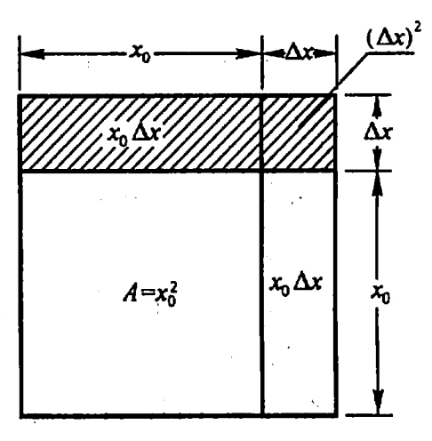

# 微分

## 定义

定义 设函数 $y=f(x)$在某区间内有定义，$x_0$及$x_0+\Delta x$ 在这区间内,如果增量

$$\Delta y=f(x_0+\Delta x)- f(x_0)$$

可表示为

$$\Delta y=A\Delta x - o(x_0)$$

其中 A 是不依赖于$\Delta x$ 的常数,那么称函数 $y=(x)$ 在$x_0$点是可微的，而 $A\Delta x$ 叫做函数$y=f(x)$在点$x_0$相应于自变量增量$\Delta x$的微分记作 $dy$,即

$$dy= A\Delta x$$

## 说明

$$dy=f^`(x)dx$$

## 现实问题

一块正方形金属薄片受温度变化的影响面积变化：

$$\Delta A=(x_0+\Delta x)^2-x_0=2x_0\Delta+(\Delta x)^2$$

当$\Delta x \to 0$时，其中$(\Delta x)^2$是比$\Delta x$的高阶无穷小。

一般的,如果函数 $y=f(x)$满足一定条件，则增量 $\Delta y$可表示为

$$\Delta y=A\Delta x - o(x_0)$$

其中 A 是不依赖于 $\Delta x$ 的常数,因此 $A\Delta x$ 是 $\Delta x$ 的线性函数且它与 $\Delta y$ 之差

$$\Delta y - A\Delta x = o(x_0)$$

是比 $\Delta x$ 高阶的无穷小所以,当 $A \ne 0$ 且 $\Delta x$ 很小时,我们就可以用 $\Delta x$  的线性函数 $A\Delta x$ 来近似代替 $\Delta y$。

