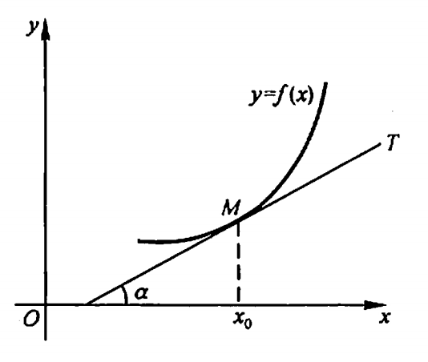

# 导数

## 定义

定义 设函数 $y=f(x)$在点$x_0$的某个域内有定义,当自变量$x$在$x_0$处取得增量 $\Delta x$(点$x_0+\Delta x$仍在该邻域内)时,相应的函数取得增 $\Delta y = f(x_0+\Delta x) - f(x_0);如果 $\Delta y$ 与$\Delta x$之比当 $\Delta x \to 0$ 时的极限存在,则称函数 $y=f(x)$ 在点 $x_0$ 处可导,并称这个极限为函数 $y=f(x_0)$ 在点 $x_0$ 处的导数,记为$f^`(x_0)$,即

$$f^`(x_0)=\lim\limits_{x\to0} \frac{\Delta y}{\Delta x}=\lim\limits_{x\to0}\frac{f(x_0+\Delta x)-f(x_0)}{\Delta x}$$

也可记做 $y^`|_{x=x_0}$，$\frac{dy}{dx}|_{x=x_0}$ 或 $\frac{df(x)}{dx}|_{x=x_0}$。

## 几何意义

函数 $y=f(x)$ 在点$x_0$处的导数 $f^`(x_0)$ 在几何上表示曲线$y=f(x)$在点$M(x_0,f(x_0))$处的切线的斜率,即

$$f^`(x_0)=tan\alpha$$

其中 $\alpha$ 是切线的倾角。

如果 $y=f(x)$ 在点$x_0$处的导数为无穷大,这时曲线 $y=(x)$ 的割线以垂直于$x$轴的直线$x=x_0$为极限位置。

过切点 $M(x_0,f(x_0))$ 且与切线垂直的直线叫做曲线 $y=f(x)$ 在点M处的法线。如果 $f^`(x_0)\ne 0$,法线的斜率为$-\frac{1}{f^`(x_0)}$，从而法线方程为

$$y-y_0 = -\frac{1}{f^`(x_0)} (x-x_0)$$

## 实际场景

在实际中,需要讨论各种具有不同意义的变量的变化“快慢”问题,在数学上就是所谓函数的变化率问题.导数概念就是函数变化率这一概念的精确描述.

路程函数：$s=f(t)$

速度函数：$v=s^`$

加速度函数：$a=v^`$

函数的切线斜率：$k=f^`(x)$

